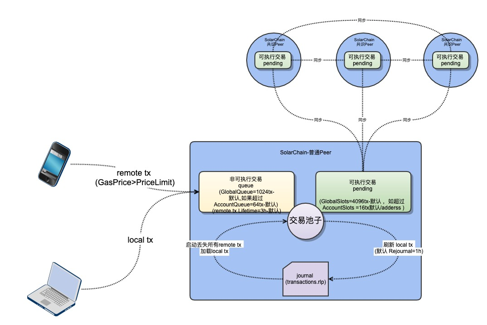

# Nonce 相关问题
## 关于高于当前 Nonce 的交易问题讨论
### 需求
因以太坊交易设计本身采用了每一个地址的交易中均有一个 nonce 用来做交易的安全 性限制（防止重放问题的出现。）

所以在以太坊的单地址交易队列中，本身是不存在并行处理，全部当前面的 nonce 处理完成之后才会处理后面的 nonce 的串行处理。

但因为出块大小以及时间的限制，导致如果按照1交易处理完毕后再处理一个交易，对于很多业务模型都是无法接受的。

对于高于当前 Nonce 交易的需求就应运而生，它本质上就是解决单地址并发问题的。
### nonce 的规则
- 当 nonce 太小（小于之前已经有交易使用的 nonce 值），交易会被直接拒绝
- 当 nonce 太大，交易会一直处于队列之中，这也就是导致本次讨论问题的原因
- 当发送一个比较大的 nonce 值，然后补齐之前缺失的  nonce 值时，那么在对垒中后续交易依旧可以被顺序执行
	- 执行成功

		与前面交易没有冲突
	- 执行失败

		与前面交易有冲突的，比如一样的转移，或者 gas 不足等 
- 当交易处于 queue 中因缺少 nonce 时，这时候， geth 关闭的话，queue 队列的交易会被清除
- 交易队列只保存最多 64 个从同一个账户发出的交易，

		The transaction pool queue will only hold a maximum of 64 transactions with the same From:address with nonces out of sequence. 
	也就是说，如果要批量转账，同一节点不要发出超过 64 笔交易。
- 当前 nonce 合适，但是账户余额不足时，会被以太坊拒绝；
- 如果发起一笔交易，但是因为 gas price 较低或者网络比较忙的时候，该交易还没矿工挖出，可以通过使用相同的 nonce 和较高的 gas 费用，从而“覆盖”前一笔交易。

### txpool 中由两部分构成 
- pending(一个为待打包状态)

	如果传入的 nonce 就是某用户下笔交易应该传入的 nonce，那么该笔交易就会放置在 pending 中，等待节点打包。
- queued(一个为队列中)

	如果传入的 nonce 值过大，在进入 txpool 中检查到它之前的 nonce 并没有使用过，那么此笔交易不会发送到 pending 中，而且放置在 queued 中。只有当前面的 nonce 补齐之后，才会进入到 pending 中。

	

### 解决方法
- 业务自行维护 nonce

	是由业务系统维护 nonce 值的递增。如果交易发送就出现问题，那么该地址下一笔交易继续使用这个 nonce 进行发送交易。
- 使用以太坊给出的 nonce

	使用现有的以太坊 api 查询当前地址已经发送交易的 nonce 值，然后对其加1，再发送交易。对应的API接口为 
	
		eth_getTransactionCount
	此方法由两个参数
	
	- 第一个参数为需要查询 nonce 的地址
	- 第二个参数为 block 的状态
		- latest
		- earliest
		- pending
	
	一般情况使用 pending 就可以查询获得最新已使用的 nonce

## replacement transaction underpriced 
### 热点账户问题
所谓的热点账户就是频繁被使用的账户，在以太坊中比如交易所的统一出币账户，在短时间内频繁发起交易的账户，均可被称作热点账户。

如果该账户发起交易时出现 `error: replacement transaction underpriced` 时，那么就需要考虑 nonce 使用是否正确。
### 问题分析
异常原因

- 当一个账户发起一笔交易，假设使用 nonce 为 1，交易已经发送至节点中，但由于某种原因 (例手续费低 或 网络拥堵 或 nonce 值过高)，导致此交易处于 queued 中迟迟未被打包。
- 同时该地址维护交易 nonce 再发起一笔交易，选用的是上面思路2的逻辑，通过 `eth_getTransactionCount` 获取的 nonce 值，那么必然于与上一个交易 nonce 值相同并再发出交易
	- 如果手续费高于原来的交易，那么第一笔交易将会被覆盖
	- 如果手续费低于原来的交易就会发生上面的 `error: replacement transaction underpriced` 异常

通常发生此异常意味着：

- 当前以太坊客户端的 pending 状态的交易中已经有了一个与新交易相同地址相同 nonce 的交易
- 新的交易的 gas price 小于老交易时，无法覆盖 pending 状态的交易

如果想用新交易覆盖掉 pending 状态的交易时，新交易的 gas price 需要高于原来交易的一定比例，这个取决于 geth 的设置(一般设置为原交易的 110%)

### 解决方案
#### 依赖以太坊客户端账户管理器
如果热点账户的私钥信息等都存放在 Ethereum 客户端中，那么在发送交易的时候不传递 nonce 值，Ethereum 客户端会帮处理此 nonce 值的排序。
	
此方案有两个弊端
	
- 安全性无法保障（未进行冷热账户分离）
- 在热点账户下如果想覆盖掉一笔交易，需要先查询一下该交易的信息，从中获取 nonce 值
 
#### 自行管理 nonce
自行管理 nonce 适用于冷热账户模式，也就是适用 `sendRawTransaction` 发送已经签名好的交易，此时 nonce 值已经存在于交易中，并且已经被签名。

这种模式下，需要在业务系统中维护 nonce 的自增序列，适用一个 nonce 之后，在业务系统中对 nonce 进行加一处理。

此种方案也有限制

- 由于 nonce 统一进行维护，那么这个地址必须是内部地址，而且发起交易必须通过统一维护的 nonce 作为出口，否则在其他地方发起交易，原有维护的 nonce 将会出现混乱。(比如在 metamask 上使用不同的客户端进行相同地址交易操作)
- 一旦已经发出的交易发生异常，异常交易的 nonce 未被使用，那么异常交易的 nonce 就需要新的交易重新使用之后，它后面的 nonce 交易才会生效

## 参考
- [以太坊实战之《如何正确处理nonce》](https://hello.blog.csdn.net/article/details/78081478?spm=1001.2101.3001.6650.1&utm_medium=distribute.pc_relevant.none-task-blog-2%7Edefault%7ECTRLIST%7Edefault-1.pc_relevant_default&depth_1-utm_source=distribute.pc_relevant.none-task-blog-2%7Edefault%7ECTRLIST%7Edefault-1.pc_relevant_default&utm_relevant_index=2)
- [以太坊实战-再谈nonce使用陷阱](https://hello.blog.csdn.net/article/details/79054937?spm=1001.2101.3001.6650.13&utm_medium=distribute.pc_relevant.none-task-blog-2%7Edefault%7EBlogCommendFromBaidu%7Edefault-13.pc_relevant_default&depth_1-utm_source=distribute.pc_relevant.none-task-blog-2%7Edefault%7EBlogCommendFromBaidu%7Edefault-13.pc_relevant_default&utm_relevant_index=14)
