# opensea 开发手册
## 开发人员教程
### 从头开始学习 ERC721
#### 智能合约的构建
由 CryptoKitties 率先开发的 ERC721 是不可替代代币的最新标准。要在 OpenSea 上列出，最好是您的商品遵循最新的 Open Zeppelin 实现 ERC721。

如果您正在开发 ERC1155 合约，请查看我们的 ERC1155 教程。解释:
	
	智能合约有很多种，但是现在普遍支持的标准是 ERC721 和 ERC 1155

- OpenSea 样本合约

	我们创建了一个非常简单的示例存储库来帮助您入门。该示例的完整代码可以在 [Github](https://github.com/ProjectOpenSea/opensea-creatures) 上找到。

	该示例代码是一个名为 OpenSea Creatures 的收藏品。OpenSea 生物非常基础：它们各自具有独特的外观，特征和属性。虽然有一天我们可能会围绕这些生物添加更多的游戏，但出于本示例的目的，您可以对生物进行的主要操作是拥有该生物。您可以在此处查看 Rinkeby 环境中所有适用于 OpenSea 的 OpenSea 生物。
	
	- ERC721合约
	
			pragma solidity ^0.5.0;
		
			import "./TradeableERC721Token.sol";
			import "openzeppelin-solidity/contracts/ownership/Ownable.sol";
			
			/**
			 * @title Creature
			 * Creature - a contract for my non-fungible creatures.
			 */
			contract Creature is TradeableERC721Token {
			  constructor(address _proxyRegistryAddress) TradeableERC721Token("Creature", "OSC", _proxyRegistryAddress) public {  }
			
			  function baseTokenURI() public view returns (string memory) {
			    return "https://opensea-creatures-api.herokuapp.com/api/creature/";
			  }
			}
		
		合约本身非常简单。它仅继承自 Tradeable ERC721Token，而后者又继承自 OpenZeppelin ERC721 合约（该合约实现了所有必要的 ERC721 方法）。您可能会在游戏中拥有更多的逻辑，但是对于 OpenSea 来说，重要的是 tokenURI 方法，它使我们能够 tokenId 将 Creature 合约中的映射到该合约的链下元数据。

	- OpenSea 白名单（可选）

		此外，ERC721 Tradable 和 ERC1155 Tradable 合约将 OpenSea 用户的代理帐户列入白名单，以便他们能够自动在 OpenSea 上交易任何商品（无需支付额外的批准费用）。在 OpenSea 上，每个用户都有一个他们控制的 “代理” 帐户，最终由交换合约调用以交易其项目。

		请注意，此添加并不意味着 OpenSea 本身就可以访问这些项目，只是意味着用户可以根据需要更轻松地列出它们。它是完全可选的，但是可以大大减少用户的摩擦。您可以在重写的 `isApprovedForAll ` 方法以及工厂 `mint` 方法中找到此代码。

		接下来，我们将学习如何构造该元数据，以便 OpenSea 可以选择它。
	- 部署合约
		- 部署 Creature 合约，只需获取[仓库代码](https://github.com/ProjectOpenSea/opensea-creatures)
		- 获得免费的 [Alchemy API 密钥](https://dashboard.alchemyapi.io/signup?referral=affiliate:e535c3c3-9bc4-428f-8e27-4b70aa2e8ca5)
		- 然后使用 Truffle 进行部署
		
				yarn install
				export ALCHEMY_KEY="<your_alchemy_project_id>"
				export MNEMONIC="<metamask>"
				export NETWORK="rinkeby"
				truffle deploy --network rinkeby	
		
		如果您已经在使用 Infura API，则也可以使用 `INFURA_KEY` 环境变量代替 `ALCHEMY_KEY`
		
		建议
			
		您只需 `export` 在 shell 会话中运行以上各行一次。我们建议您将这些行放入 `.env` 文件中，使用一次将其应用 `. .env`，并避免在提交代码时将其检入。有一个样本 `.env`文件在[这里](https://github.com/ProjectOpenSea/opensea-creatures/blob/master/.env.sample)。
		
		请注意，为了使用 Truffle 和 Infura 进行部署，您将需要来自以 Ether 资助的 MetaMask 帐户中的“种子短语”。为了使 Ether 进入您的 Rinkeby MetaMask 帐户，您可以使用 [Rinkeby Ether 龙头](https://faucet.rinkeby.io/)。您需要在其中一个社交资料中发布一条消息，然后将链接粘贴到您的帖子中，并将其粘贴到测试水龙头中。为了从 Metamask 获得“种子短语”，请单击“设置”，然后单击“显示种子词”。确保不与任何包含Mainnet令牌的帐户共享您的种子短语！
	- 铸造

		接下来，我们要为新部署的 ERC721 合约添加新资产！我们会将这些资产放入我们控制的帐户中，以便我们可以测试商品的OpenSea拍卖流程。

		部署到 Rinkeby 网络后，将在 Rinkeby 上签订一份合约，该合约将在 [Rinkeby Etherscan](https://rinkeby.etherscan.io/) 上可见。您可以在 Deployment 命令的输出中找到已部署合约的地址，并通过点击URL：在 Etherscan 上找到它
			
			https://rinkeby.etherscan.io/address/<contract_address>。

		例如，这是[最近部署的合约](https://rinkeby.etherscan.io/address/0xeba05c5521a3b81e23d15ae9b2d07524bc453561)。运行铸造脚本时，应将此合约地址和 MetaMask 帐户的地址设置为环境变量：
		
			export OWNER_ADDRESS="<my_address>"
			export NFT_CONTRACT_ADDRESS="<deployed_contract_address>"
			node scripts/mint.js
	- 下一步是什么？

		至此，我们已经在 Rinkeby 网络上部署了第一个智能合约，并在合约中铸造了一些新的 OpenSea 生物。您应该可以访问 rinkeby.opensea.io，并在钱包中以NFT的形式查看新生物！有关更多信息，请参见第3节。

		这些生物的默认元数据由提供 `https://opensea-creatures-api.herokuapp.com/api/creature/{token_id}`，在此处设置。接下来，您需要创建自定义元数据API。

#### 添加元数据
部署合约后，您将需要一种方法来使每个单独的项目正确显示在 OpenSea（以及支持不可替代令牌的其他网站）上。这是链外元数据发挥作用的地方！ERC721 合约中的每个令牌标识符都将具有对应的元数据 URI，该元数据 URI 返回有关项目的其他重要信息，例如项目的名称，图像，描述等。要找到此 URI，请使用 `tokenURI` ERC721 中的 uri 方法和 ERC1155 中的方法。此元数据的一个简单示例是：

	{
	  "name": "Herbie Starbelly",
	  "description": "Friendly OpenSea Creature that enjoys long swims in the ocean.",
	  "image_url": "https://storage.googleapis.com/opensea-prod.appspot.com/creature/50.png",
	  "attributes": [...]
	}			

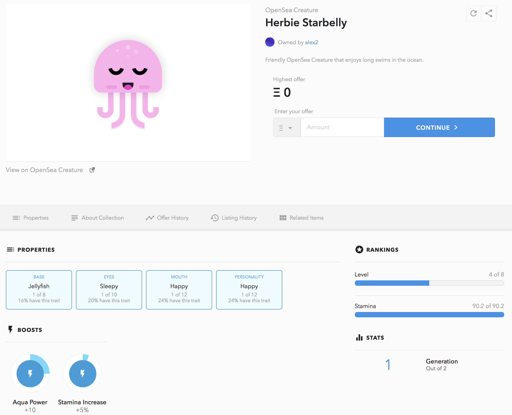

元数据可以做很多事情-包括添加排名，提升，动画，日期等等！我们认为您肯定希望对其进行完整的探索，因此请参阅本教程的专用

#### 在 opensea 上查看自己的项目
现在，假设您已经在 Rinkeby 测试网络上部署了合约。作为一个具体示例，我们在 Rinkeby 上将 OpenSea Creature 合约部署到了以下地址： [0x7dca125b1e805dc88814aed7ccc810f677d3e1db](https://rinkeby.etherscan.io/address/0x7dca125b1e805dc88814aed7ccc810f677d3e1db)。

我们还为该合约铸造了 25 个新项目，因此当前项目的总供应量为 25。在 [Etherscan](https://rinkeby.etherscan.io/address/0xccd0f00bce2836f72c85b0dd3af93a365ec32411#readContract) 上，我们可以检查其中 `tokenURI` 的一个项目，以查看它是否指向 OpenSea Creature API 端点。

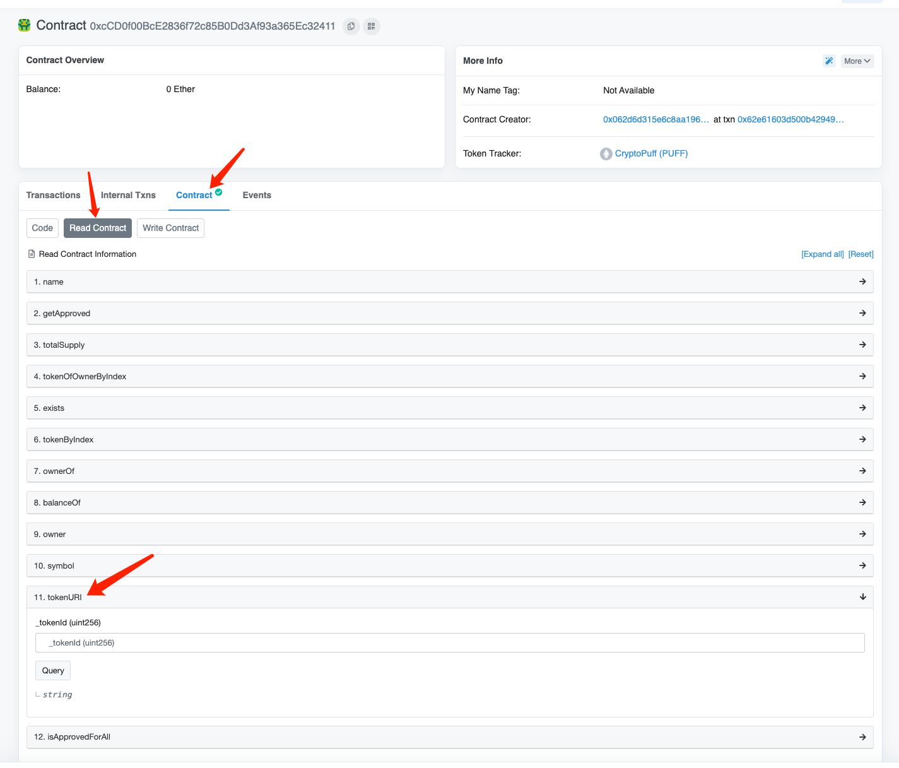

OpenSea 具有 Rinkeby 环境，允许开发人员测试其与 OpenSea 的集成。可以在 [testnets.opensea.io](https://testnets.opensea.io/) 上找到。通过点击正确的 URL，我们应该能够立即在 OpenSea 上查看我们的一项。可以通过以下方式构造URL：

	https://testnets.opensea.io/assets/<asset_contract_address>/<token_id>
`asset_contract_address` 我们合约的地址在哪里，并且 `token_id` 是我们商品的令牌ID之一。例如，对于 OpenSea Creature 合约，这是 OpenSea Creature＃12

[https://testnets.opensea.io/assets/0x7dca125b1e805dc88814aed7ccc810f677d3e1db/12](https://testnets.opensea.io/assets/0x7dca125b1e805dc88814aed7ccc810f677d3e1db/12)

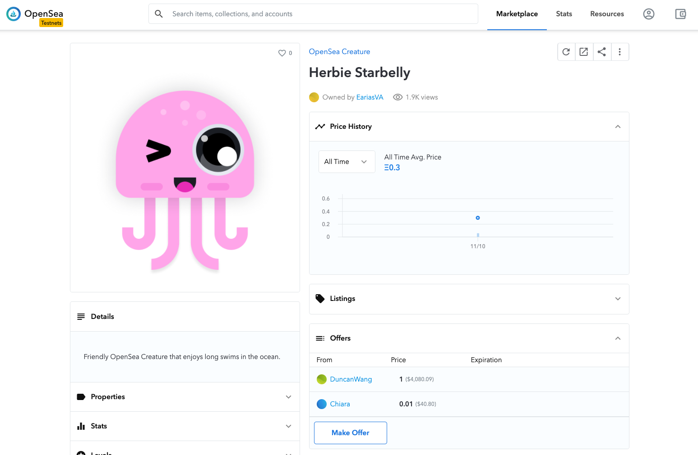

通过使用您自己的合约地址和令牌 ID，您也可以查看您的物品，并仔细检查所有内容是否都按预期显示。请注意，我们包含在令牌元数据中的属性显示为该项目的“属性”和“状态”。只要您将它们作为字符串或整数包含在元数据的属性部分中，就会自动发生。要测试集成，只需导航至：

	https://testnets.opensea.io/assets/<your_contract_address>/<token_id>
默认情况下，OpenSea 将为您的资产缓存数据。需要强制更新您的商品吗？只需使用 `force_update` 参数访问API ：

	https://testnets-api.opensea.io/api/v1/asset/<your_contract_address>/<token_id>/?force_update=true

#### 调试元数据
- 使用 `/validata` 端点

	如果项目无法正确显示在 OpenSea 上时遇到问题（也许它们缺少图像或属性），则可以使用以下 API 端点调试元数据。
	
		https://testnets-api.opensea.io/asset/<your_contract_address>/<your_token_id>/validate/
	或
	
		https://api.opensea.io/asset/<your_contract_address>/<your_token_id>/validate/
	只需使用您的合约地址和令牌 ID 来访问此URL，以查看您的元数据 URL 是否存在任何错误。如果您需要其他帮助，请随时通过我们的 Discord 频道与我们联系。	
#### 创建商店
既然我们已经测试了与您的一些商品的集成，那么现在该在 OpenSea 上创建自己的自定义店面了。

为此，我们将使用 OpenSea 店面创建器，该创建器将填充您在 OpenSea 上的所有资产，并为您的商品提供专门的店面页面。例如，您可以在此处查看商店中的 OpenSea Creatures 。

OpenSea店面创建者
单击[此处](https://testnets.opensea.io/get-listed/step-two)转到店面创建者。这将引导您完成将所有项目显示在OpenSea上的过程。

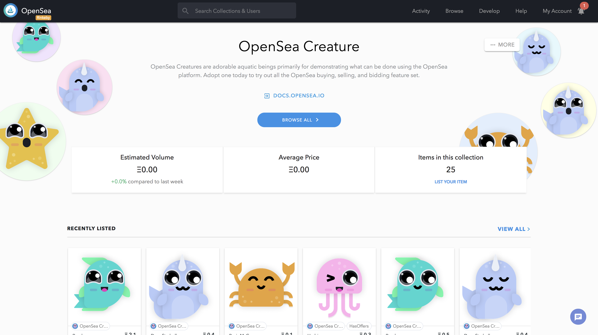
#### 拍卖物品
现在商品已在 OpenSea 上，任何拥有它们的用户都可以立即购买和出售它们。您无需编写任何其他智能合约或集成。OpenSea 平台负责所有这些工作！

- 测试拍卖流程

	假设将它们放在自己的帐户中，则可以立即测试商品的拍卖流程。只需转到一个项目，然后单击“出售”即可将其拍卖。该流程将逐步执行所需的任何其他步骤。

	完成列表流程后，您的 CryptoPuff 现在可以在 OpenSea 上立即购买。实际上，如果您在 Rinkeby 上登录另一个 MetaMask 帐户，则可以立即购买！
	
	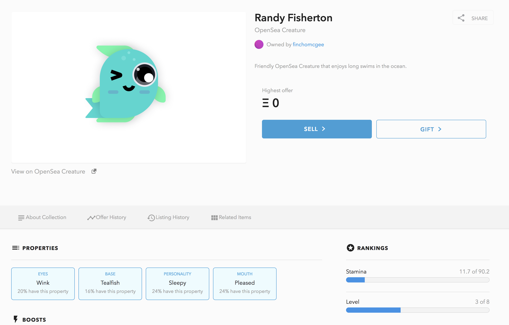
	
	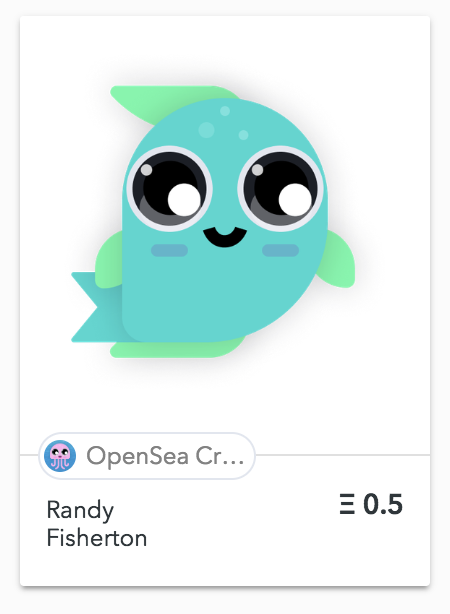
- 尝试对商品出价

	此外，任何以太坊账户都可以立即竞标您的所有物品。只需转到任何项目，然后选择“提供报价”即可。

	对于报价，还需要一些其他步骤，其中包括用 WETH 包装您的 ETH。您可以在[此处](https://medium.com/opensea/how-to-bid-on-a-crypto-collectible-using-opensea-72e9af709d06)详细了解我们的出价系统。
	
	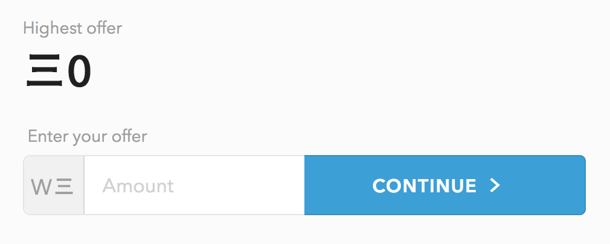
- 出售捆绑

	您也可以出售一捆 OpenSea 生物。为此，请转到您的帐户下拉菜单，然后单击“出售一捆物品”。
- 易趣式拍卖

	要将一个生物（或生物捆绑）出售给最高出价者，请选择最高出价！
	
			
	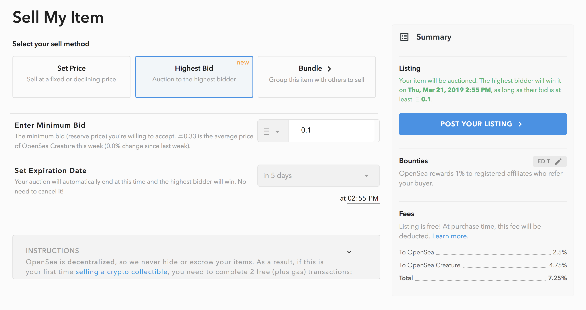
- 卖出另一个代币

	您还可以出售以太坊以外的代币形式的商品。要尝试此操作，请单击 Ether 符号，然后选择 OpenSea 令牌作为选项（这是Rinkeby上唯一可用的选项，但Mainnet上还有许多其他令牌）。

	如果您想添加自定义 ERC20 令牌供用户用来买卖您的资产，请通过support@opensea.io与我们联系。

#### 在主网上启动
在 Rinkeby 上完成测试并准备在主网上启动您的资产的过程大致相同，只是环境变量有所更改

部署合约并铸造商品后，请单击[此处](https://opensea.io/get-listed)转到主网的店面创建者。这将引导您完成将所有项目显示在 mainnet OpenSea 平台上的过程。
#### 主网部署说明
在主网上运行铸造脚本时，需要将环境变量设置为 `mainnet not live`。环境变量会影响铸造脚本中的节点URL，而不影响松露。

部署时使用 truffle 并且需要给 truffle 一个与 `truffle.js`（`--network live`）中的命名相对应的参数。但是当铸造时，依赖于设置来构建 URL 的环境变量（[https://github.com/ProjectOpenSea/opensea-creatures/blob/master/scripts/mint.js#L54](https://github.com/ProjectOpenSea/opensea-creatures/blob/master/scripts/mint.js#L54)），因此您需要使用使 Alchemy 或 Infura 感到高兴的术语（mainnet）。Truffle 和 Alchemy/Infura对 Rinkeby 使用相同的术语，但对主网使用不同的术语。

	如果您启动铸造脚本，但没有任何反应，请仔细检查您的环境变量。
#### 自定义您的店面
现在，您已经创建了自己的 OpenSea 店面，可以根据自己的喜好自定义它！只需确保您以智能合约的所有者身份登录到 Metamask（您需要确保您的合约是 `Ownable`；否则，请联系 support@opensea.io），然后您会看到一个按钮，该按钮将允许您可以编辑店面。或者，您可以转到“[店面管理器](https://opensea.io/storefronts)”页面以查看所有店面。

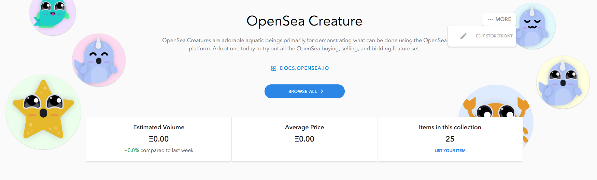

单击编辑按钮将调出店面编辑器。现在，您可以根据自己的喜好自定义店面，并使用自己的名称，描述和网站 URL。另外，您可以设置自己的[二次销售费用](https://docs.opensea.io/docs/10-setting-fees-on-secondary-sales)。

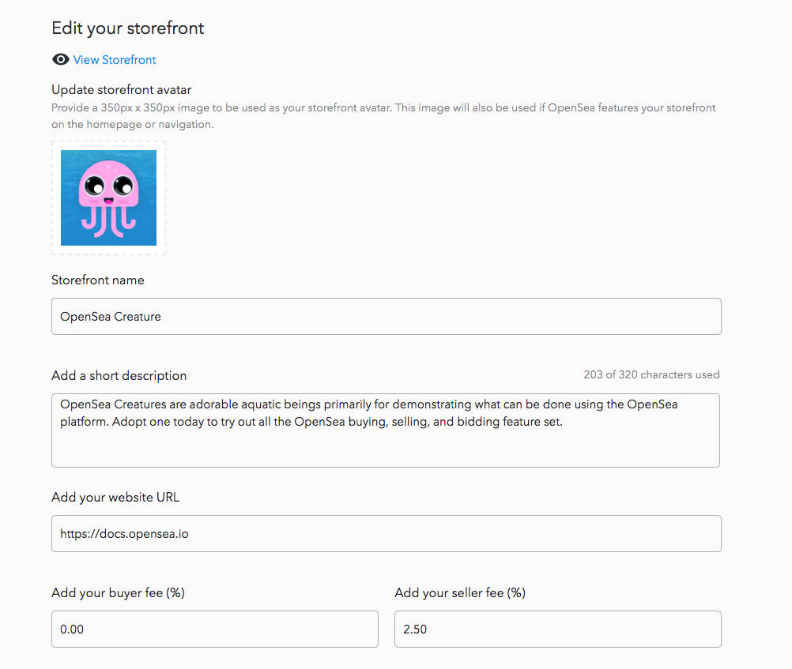

#### 进行初始商品销售
使用 OpenSea 将您的商品出售给您的初始用户群

您所有的 OpenSea 市场都已设置为允许用户购买、出售和出价您的商品。但是，您首先如何将商品带给用户？

- 选项1：简单商品销售

	您可以使用 OpenSea 通过“初始项目产品”分发项目。[CryptoVoxels](https://cryptovoxels.com/) 是一个很好完成此项目的很好的例子。CryptoVoxels 的开发人员仅使用 OpenSea 来出售 CryptoVoxels 世界中的土地。

	用这种方式在 OpenSea 上进行商品销售实际上非常简单。只需将您的物品放入您选择的帐户中，然后使用标准拍卖流程将其出售即可。它们将立即在您专用的 OpenSea 类别页面和全球 OpenSea feed 中显示出来出售，可供广大 OpenSea 用户基础找到。	
	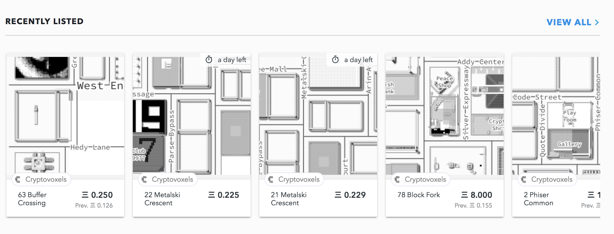
- 选项2：自订销售合约

	或可以使用我们的项目工厂合约立即插入我们的预售基础架构。在[此处](https://docs.opensea.io/docs/opensea-initial-item-sale-tutorial)查看我们的教程

#### 设定二次销售费用
每次在 OpenSea 上出售商品时均可赚取加密货币

使用 OpenSea 的最令人兴奋的原因之一是能够从商品的二次销售中获得收入。每次在 OpenSea 上出售商品时，项目所有者（您！）都可以将销售的一定百分比作为收入。这意味着您不仅可以通过向用户出售最初的商品集来赚钱，而且可以随着游戏和市场的升温而继续赚钱！

- 设定二次销售费用

	要设置您的二次销售费用，只需转到店面编辑器并调整“买方费用”和“卖方费用”字段即可。指定您希望在其中收取费用的付款地址。
	
	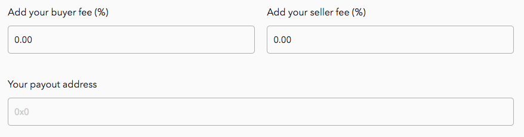
- 收费类型

	费用可以向卖方或买方收取。要了解两者之间的区别，例
	
	请考虑以 1 ETH 出售商品的用户。
	
	- 收取 2％ 的卖方费用
		- 买方将为该商品支付 1 ETH 而将 0.02 ETH 交给开发商（您）
		- 这意味着卖方将获得 0.98 ETH
	- 支付 2％ 的买方费用
		- 买方将为该商品支付 1.02 ETH
		- 向开发商（您）支付.02 ETH
		- 并向卖方支付 1  ETH

	您可以自由选择在[店面编辑器](https://docs.opensea.io/docs/7-customizing-your-storefront)中收取任何费用。
- 收取收入

	收入将每两周分配到指定的付款地址。如果您需要更频繁地收取费用，请与我们联系。

	OpenSea 免费提供其市场基础设施-开始建立市场和使用我们的平台完全免费。作为此项服务的补偿，每次销售的 2.5％ 将流向 OpenSea，而与您选择收取的任何费用无关。
- 在您自己的网站中嵌入店面

	拥有商品店面后，您可以将用户从您的网站定向到店面，也可以将店面直接嵌入到自己的网站或应用程序中。要直接嵌入店面，只需遵循[以下说明](https://docs.opensea.io/docs/embeds)。下面的例子
	
	- [https://www.sneakrcred.com/crazy](https://www.sneakrcred.com/crazy) 	
		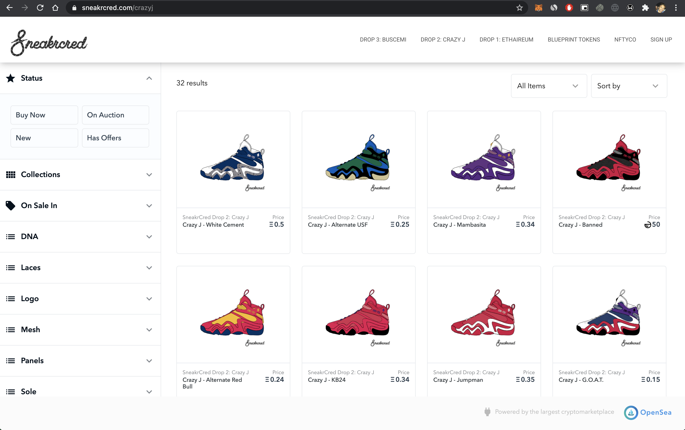
	- [https://etherland.world/marketplace](https://etherland.world/marketplace)
	
		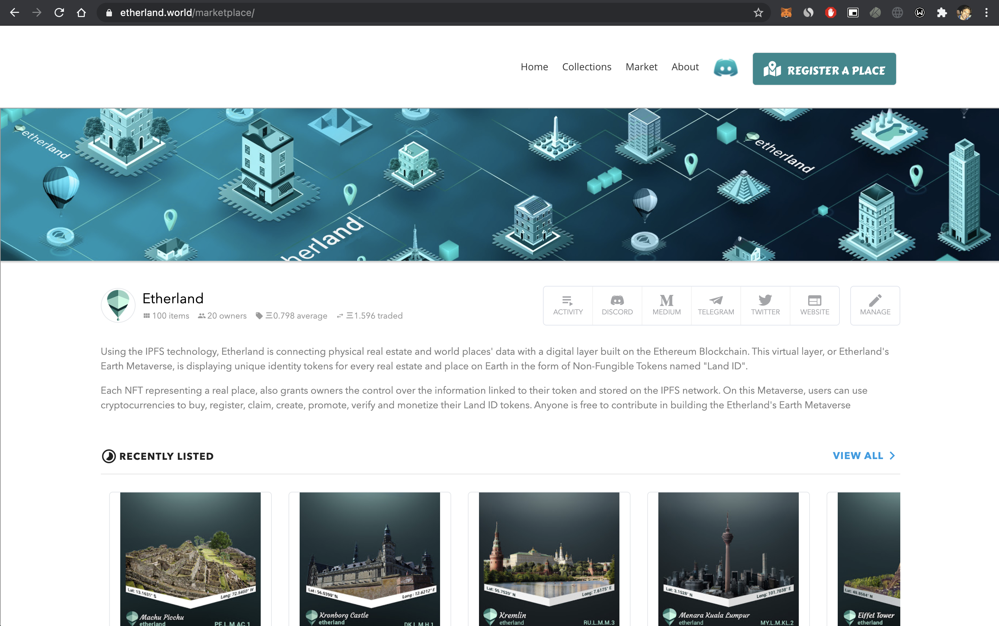

### ERC1155
部署可即时交易的ERC1155合约

完整的ERC1155教程即将推出。同时，请查看我们的示例存储库，以获取有关如何部署ERC1155合约的示例 [https://github.com/ProjectOpenSea/opensea-erc1155](https://github.com/ProjectOpenSea/opensea-erc1155)
### OpenSea 众筹销售教程
在OpenSea上为您的商品进行众筹的简单教程

	先决条件
	建议您在完成初始商品销售教程之前，先完成《OpenSea Developer教程》！
既然您已经利用 OpenSea 为用户建立了点对点市场来交易您的商品，那么下一个问题是如何向用户发行初始商品。您是否要向用户出售商品包？向用户提供 Airdop 物品作为奖励？或者也许有可以由用户购买甚至交易的战利品箱？

好消息：以上所有内容都可以使用 OpenSea 的平台完成！在本教程中，我们将学习在 OpenSea 上进行初始商品销售的各种选择。到最后，我们将拥有自己的定制销售合约，用于销售 OpenSea Creatures。此定制销售合约将支持：

- 购买一个 OpenSea 生物
- 购买四种（随机）OpenSea 生物
- 购买 OpenSea 生物的可交易战利品箱	

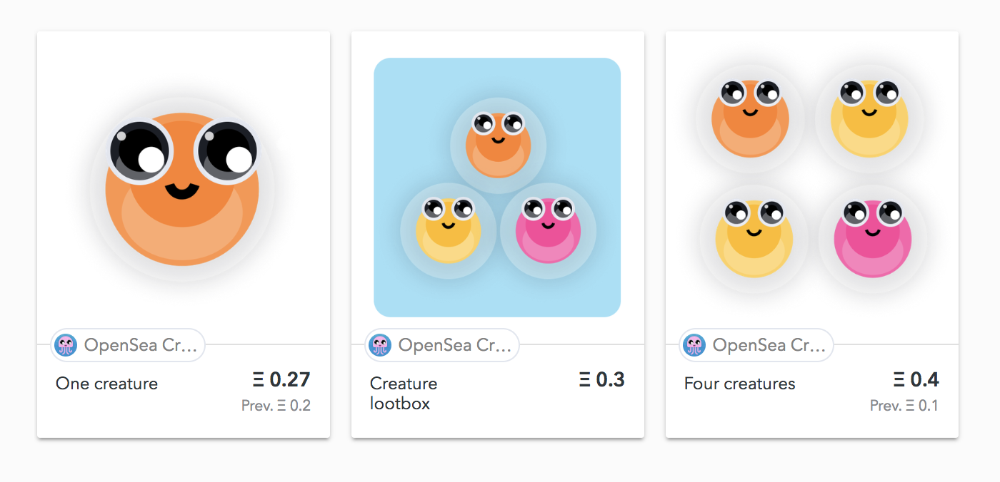
		
#### 简单的物品销售
在 OpenSea 上出售商品的最简单方法是简单地将商品放入您拥有的帐户中，然后通过标准的 OpenSea 网络流程或 [Javascript SDK](https://github.com/ProjectOpenSea/opensea-js/) 出售它们。它们将立即在您专用的 OpenSea 类别页面和全球 OpenSea feed 中显示出来出售，可供广大OpenSea 用户基础找到。

为此，只需导航至您要出售的商品，然后单击“出售”即可。然后，将指导您完成出售物品的说明。请注意，您还可以通过“捆绑销售”功能一次出售全部多个商品。

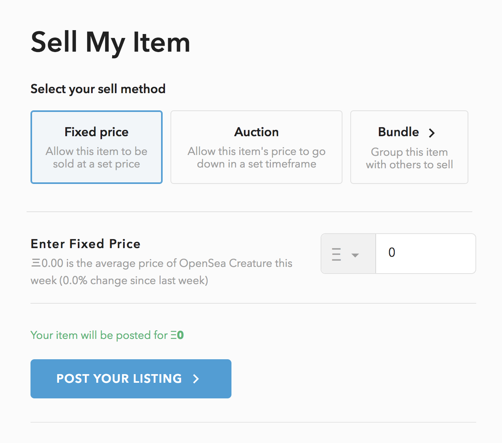

此外，请查看 [ChainBreakers](https://chainbreakers.io/)，该公司通过简单地出售成捆的预先铸造的物品就完成了大部分销售额。

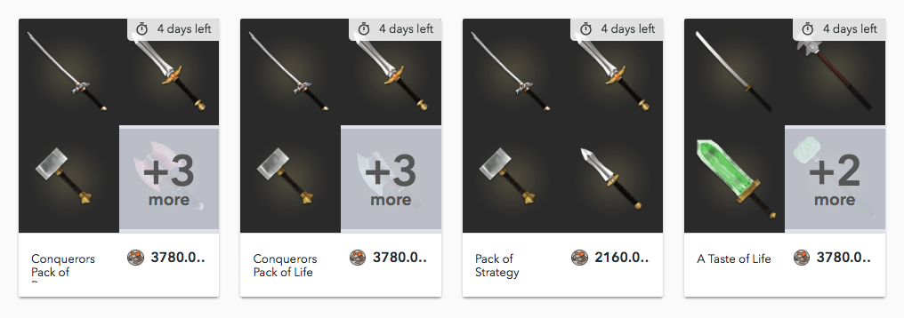
#### 定制销售合约—简介
简单物品销售的缺点是，您需要预先铸造要出售的物品（而不是在购买时即时铸造它们）。这可能会使向广泛的用户群销售许多商品变得困难。此外，使用简单的商品销售方法，很难为商品销售创建自定义逻辑（例如，随机商品包，铸造商品的随机统计信息等）。如果您需要这些功能中的任何一个，`Factory` 合约就是您的最佳选择！

为了仅在购买时铸造商品，OpenSea 提供了一个 `Factory` 界面,可以使用该界面定义如何铸造商品。然后可以使用 OpenSea 创建调用铸造功能的自定义“订单”。这是合约的主要 `mint` 方法 `Factory`。

	interface Factory {
	
	  ...
	
	  /**
	    * @dev Mints asset(s) in accordance to a specific address with a particular "option".
	    * Options should also be delineated 0 - (numOptions() - 1) for convenient indexing.
	    * @param _optionId the option id
	    * @param _toAddress address of the future owner of the asset(s)
	    */
	  function mint(uint256 _optionId, address _toAddress) external;
	}
该 `mint` 方法采用 `_optionId` 和 `_toAddress`。

- `_toAddress` 是该项目将被铸造的地址
- `_optionId` 是所使用的薄荷方法来区分对薄荷所说逻辑的项目的唯一标识符。

例如，`_optionId` 1 可能铸造单个项目，而 `_optionId` 2 可能铸造几个随机项目。您的选择权完全取决于您！由于您可以在 `mint` 方法中包括任何逻辑，因此可能性是无限的！

#### OpenSea生物销售示例
为了更具体一点，让我们看一个例子。在 OpenSea 生物工厂中，有三种不同的选择：

- 选项0：铸造单个生物
- 选项1：一次铸模四个生物
- 选项2：铸造一个生物战利品箱

这是该逻辑的代码：

	function mint(uint256 _optionId, address _toAddress) public {
	    Creature openSeaCreature = Creature(nftAddress);
	    if (_optionId == SINGLE_CREATURE_OPTION) {
	      openSeaCreature.mintTo(_toAddress);
	    } else if (_optionId == MULTIPLE_CREATURE_OPTION) {
	      for (uint256 i = 0; i < NUM_CREATURES_IN_MULTIPLE_CREATURE_OPTION; i++) {
	        openSeaCreature.mintTo(_toAddress);
	      }
	    } else if (_optionId == LOOTBOX_OPTION) {
	      CreatureLootBox openSeaCreatureLootBox = CreatureLootBox(lootBoxNftAddress);
	      openSeaCreatureLootBox.mintTo(_toAddress);
	    }
	  }
这意味着当您呼叫时 `mint(0, <destination_address>)`，目标地址将接收一个新的 OpenSea 生物，当您呼叫时 `mint(1, <destination_address>)`，目标地址将接收四个新的 OpenSea 生物，依此类推。

如果您想自己部署 OpenSea Creature 示例合约，只需 [OpenSea Creatures Github](https://github.com/ProjectOpenSea/opensea-creatures) 存储库并取消注释其中的行 `migrations/deploy_contracts.js`（您也要注释掉其上方的行，因为新注释的代码也将被部署生物 NFT）。

正如我们将在下一节中学习的那样，每个选项在 OpenSea 上都有一个专用页面，并且（可以令人兴奋地）可以通过在 OpenSea 上出售常规商品的多种方式中的任何一种来出售！

#### 自定义销售合约-查看您的选择
部署 `Factory` 合约后，下一步就是查看 OpenSea 上的每个选项。好消息是，让您的 `Factory` 选择显示在 OpenSea 上与您的 ERC721 项目相同。简单地实现该 tokenURI 方法，并使其以与 [ERC721](https://docs.opensea.io/docs/3-viewing-your-items-on-opensea) 项相同的格式返回元数据。

	interface Factory {
	
	  ...
		
	  /**
	   * @dev Returns a URL specifying some metadata about the option. This metadata can be of the
	   * same structure as the ERC721 metadata.
	   */
	  function tokenURI(uint256 _optionId) public view returns (string);
	}
通过点击正确的 URL，我们应该能够立即在 OpenSea 上查看我们的选项之一。可以通过以下方式构造 URL：
	
	https://testnets.opensea.io/assets/<factory_contract_address>/<option_id>

- `factory_contract_address` 您工厂的地址在哪里
- `option_id` 是选项ID之一

例如，这是 OpenSea 生物销售的选项之一，其工厂地址为 [0x381748c76f2b8871afbbe4578781cd24df34ae0d](http://rinkeby.etherscan.io/address/0x381748c76f2b8871afbbe4578781cd24df34ae0d)

		  	

自己查看以下 [https://testnets.opensea.io/assets/0x381748c76f2b8871afbbe4578781cd24df34ae0d/0](https://testnets.opensea.io/assets/0x381748c76f2b8871afbbe4578781cd24df34ae0d/0)

#### 定制销售合约-出售您的期权
此时，您应该在 OpenSea 上显示您的选项。期权类似于常规项目，因为它们可以在 OpenSea 上浏览，但是它们始终由 `Factory` 合约所有者拥有。

最重要的是，`Factory` 所有者可以“出售”期权。但是，当出售期权时，不是将其转移给买方，而是调用 `mint` 了该特定方法 `optionId`。

例如，将 `_optionId` 其中 `CreatureFactory` 一份合约出售给 `0xab23d`，`mint(1, '0xab23d')` 则会被致电。由于这样做的逻辑 `optionId` 是铸造4个 OpenSea 生物，因此 `0xab23d` 将获得4个全新生物。

当您的 `Factory` 项目首次出现在 OpenSea 上时，它们将显示为“已售完”。您需要通过以下方式列出要出售的商品：

	https://rinkeby.opensea.io/assets/<factory_contract_address>/<option_id>/sell
令人兴奋的是，所有用于销售常规商品的 OpenSea 功能都可用于 `option` 在您的内销售 `Factory`。因此，您可以以固定价格，荷兰拍卖，捆绑销售，自己选择的 ERC20 代币等进行出售。

- 卖很多一个选项

	尽管 OpenSea UI 允许您一次出售一件工厂商品，但在许多情况下，您可能希望向最初的用户出售大量物品：
	
		例如，100把剑或100包卡片
	为此，我们建议[使用 SDK](https://github.com/ProjectOpenSea/opensea-js#running-crowdsales) 即时创建具有给定供应量的销售。
	
		例如，假设您想以固定价格将100件商品以固定价格出售，明天到期。
	您可以执行以下操作
	
		// Expire these auctions one day from now. Omit `expirationTime` or set to 0 to never expire:
		const expirationTime = (Date.now() / 1000 + 60 * 60 * 24)
		
		const sellOrders = await seaport.createFactorySellOrders({
		  assetId: <ASSET_OPTION_ID>,
		  factoryAddress: <FACTORY_CONTRACT_ADDRESS>,
		  accountAddress,
		  startAmount,
		  expirationTime,
		  numberOfOrders: 100 // Will create 100 sell orders in parallel batches to speed things up
		})
	您可以在 [opensea-creatures](https://github.com/ProjectOpenSea/opensea-creatures/blob/master/scripts/initial_sale.js) 存储库中找到一个示例。要运行示例脚本，只需运行：
	
		. .env
		node scripts/sell.js
- 先进的商品销售结构

	另一个有趣的销售结构是使用战利品组件进行销售。每个战利品箱都可以像常规物品一样进行交易-但也可以“打开”以赎回实际的游戏物品。
	
		例如，游戏可能想要发行一堆随机生成特定能力等级的物品的物品或者发行具有获得“神话”或“传奇”卡片的几率的一组卡片。
	
	为此，您可以创建符合 ERC721 的 `LootBox` 合约。您可以 `LootBox` 像正常使用 ERC721 NFT 一样铸造它们，这意味着它们可以立即在 OpenSea 上列出。这些 NFT 将简单地实现该 `unpack` 方法，该方法将刻录 `LootBox` 并铸造该项目的新 NFT。
	
	例如，如果要实施 CryptoPuff 预售，我们可以创建一个 `CryptoPuffPreSaleItem` 继承自的 `ERC721Token`。在该 `unpack` 方法中，它将根据某些伪随机逻辑创建新的 CryptoPuff,详细代码在 [github](https://github.com/ProjectOpenSea/opensea-creatures)
	
	
		/**
		 * @title CreatureLootBox
		 *
		 * CreatureLootBox - a tradeable loot box of Creatures.
		 */
		contract CreatureLootBox is TradeableERC721Token {
		    uint256 NUM_CREATURES_PER_BOX = 3;
		    uint256 OPTION_ID = 0;
		    address factoryAddress;
		
		
		    ...
		    function unpack(uint256 _tokenId) public {
		        require(ownerOf(_tokenId) == msg.sender);
		
		        // Insert custom logic for configuring the item here.
		        for (uint256 i = 0; i < NUM_CREATURES_PER_BOX; i++) {
		            // Mint the ERC721 item(s).
		            Factory factory = Factory(factoryAddress);
		            factory.mint(OPTION_ID, msg.sender);
		        }
		
		        // Burn the presale item.
		        _burn(msg.sender, _tokenId);
		    }
		    ...
		}			
- 可交易包装
 
	如果您希望自己的预售包装本身是可交易的，则不需要任何额外的配置。您可以在 OpenSea 上（使用固定价格，荷兰式拍卖，英语拍卖，甚至捆绑销售）或通过我们的 [SDK](https://github.com/ProjectOpenSea/opensea-js) 出售预售包。您只需要一种让用户在您的网站上打开包装的方法即可。
	
### OpenSea 基本整合
该页面专为已经编写了 ERC721 合约并希望将其与 OpenSea 集成的开发人员而设计。但是，如果您是[新手](https://docs.opensea.io/docs/getting-started)，我们建议您遵循官方的 [OpenSea Developer Tutorial](https://docs.opensea.io/docs/getting-started)。
#### 在OpenSea上查看现有项目
好消息！如果您已经在以太坊主网上部署了 ERC721 合约，那么您的商品就已经可以在 OpenSea 上进行交易了。只需转到我们的列表流程即可查看您的店面。

点击[提交合约](https://opensea.io/get-listed/step-two)
#### 元数据 API
如果您未遵守 ERC721 元数据标准，则您的商品可能不会按预期显示在 OpenSea 上：它们可能缺少

- 图像
- 名称
- 描述

要解决此问题，您可以为 OpenSea 提供一个提供此信息的元数据API。您可以[在此处查看](https://docs.opensea.io/docs/2-adding-metadata)有关此 API 的确切格式的所有详细信息。API 响应示例如下所示：

	{
	  "description": "Friendly OpenSea Creature that enjoys long swims in the ocean.", 
	  "external_url": "https://openseacreatures.io/3", 
	  "image": "https://storage.googleapis.com/opensea-prod.appspot.com/puffs/3.png", 
	  "name": "Dave Starbelly",
	  "attributes": [ ... ], 
	}
通常，OpenSea 使用 ERC721 中的 tokenURI 方法查找项目的元数据API（您可以[在此处](https://docs.opensea.io/docs/2-adding-metadata)确切了解其工作方式）。但是，如果您已经部署了合约并且未实现此方法，则可以将符合元数据标准并具有以下格式的API URL发送到support@opensea.io：

	<your-api.com/any_path>/{token_id}
尽管您的 API 可以具有任何 URL，但重要的是，它需要一个 Token ID 并以[此处](https://docs.opensea.io/docs/2-adding-metadata)所述的格式返回数据。

### 常见问题
- 如何使用 OpenSea 为商品建立市场？

	如果您只是开始您的项目，并且您的合约符合 ERC721 或 ERC1155，则该过程相当快捷、容易。只需转到我们的[开发人员教程](https://docs.opensea.io/docs)并按照说明进行操作即可。
- 我已经建立了我的项目，但是它不符合元数据标准。我还能列出来吗？

	是的！根据您的智能合约的结构，我们也许可以进行自定义集成。特别是，如果您的合约符合 ERC721 或 ERC1155 标准，则可以为我们提供您的商品的元数据 URL，该 URL 应该相对易于集成。

	只需发送电子邮件至contact@opensea.io给我们，我们将与您联系以进行下一步。
- 我才刚开始。我如何确保我的物品将在 OpenSea 上可用？

	全新的开始真是太好了。我们强烈建议您遵循[《OpenSea Developer教程》](https://docs.opensea.io/docs/getting-started)，以学习如何正确构造合约和元数据以实现完全的 OpenSea 兼容性。入门非常快，而且实际上很有趣！我们甚至有[一个视频教程](https://www.youtube.com/watch?v=lbXcvRx0o3Y)。
- 构建商品时如何获得支持？

	很高兴你问。我们很乐意在[Discord](https://discord.gg/ga8EJbv)上与您聊天，并帮助进行集成。我们还建议注册我们的[邮件列表](https://www.getdrip.com/forms/674668683/submissions/new)，以获取有关 OpenSea 的所有最新更新。
- 这仅适用于游戏吗？

	不！我们将支持任何资产类型，只要它在区块链上即可。[查看Dottabot软件许可项目](https://opensea.io/assets/dottabot-license)以及 [Crypto Stamps](https://opensea.io/assets/crypto-stamp-edition-1)的非游戏项目的几个示例。
- 我重新部署了我的合约。我该如何更新旧版本？

	当您添加与先前合约同名的新合约时，它将自动拥有一个新店面，店面名称后带有“ V2”（或“ V3”，“ V4”等）。
	
		例如，如果我们部署了另一个 CryptoPuffs 合约，则该合约的名称为 “ CryptoPuffs V2”，并且可以在 https://opensea.io/category/cryptopuffsv2 上获得。

	要更新您的智能合约，只需将旧合约重命名为 CryptoPuffsOld，然后通过[店面定制程序将](https://docs.opensea.io/docs/7-customizing-your-storefront)新合约重命名为 CryptoPuffs 。

	更新合约后，您可能希望摆脱旧的合约。我们没有删除旧智能合约的界面，因此您需要通过 [Discord](https://discord.gg/G95kyQd) 与我们联系。我们一定会尽快上线！
- OpenSea 为我的 Dapp 提供了什么？

	OpenSea 为您的 Dapp 提供了一个强大的市场，使您可以轻松快捷地买卖商品。它经过 NFT 领域最活跃的社区的考验，并屡屡出现。OpenSea 使您可以专注于设计、内容和用户，同时仍具有项目数字资产的功能齐全的市场。另外，您可以为辅助销售设置费用，以便您在首次销售商品后就能长期赚钱。

	- 客制化

		OpenSea 店面可以完全根据您的项目量身定制，从而创建完全可自定义的登录页面和市场。如果您正在寻找比本地 OpenSea 市场更多的自定义设置，则可以探索我们的[白标](https://docs.opensea.io/docs/opensea-white-label)解决方案，以及我们的 [OpenSea SDK](https://docs.opensea.io/docs/opensea-sdk)，该 SDK 可直接在您的应用程序内部创建拍卖。
	- 流动性和可发现性

		成千上万的用户已经在使用 OpenSea 来发现，购买、出售稀有的数字产品。通过在 OpenSea 上列出您的游戏，您将向大量的游戏玩家、交易员和加密爱好者用户开放您的产品。这既增加了项目的流动性，又增加了应用程序的可发现性。
	- 初始商品销售

		除了点对点交易外，OpenSea 还可以用作初始销售游戏物品的工具。查看我们有关进行[初始商品销售](https://docs.opensea.io/docs/8-running-an-initial-item-sale)的部分，以了解如何做到这一点。
- 这仅适用于 ERC721 资产吗？

	我们的自助式店面创建仅适用于 ERC721 和 ERC1155 合约。但是，我们有时能够与其他数字资产进行自定义集成。如果您不使用受支持的标准，则集成可能会花费更长的时间。
- 这对我的 ERC1155 合约有效吗？

	是的！您可以使用[获取清单](https://opensea.io/get-listed/step-two)的流程将您的合约添加到 OpenSea。就像添加 ERC721 合约一样。
- 费用如何运作？我还能从商品的二次销售中受益吗？

	是的！我们让您决定要对商品收取的任何费用-这意味着，每售出一件商品，您（项目的开发人员）将获得一定比例的销售折扣。

	可以向卖方或买方收取费用。要了解两者之间的区别，请考虑以1 ETH出售商品的用户。收取2％的卖方费用，买方将为该商品支付1 ETH，而将0.02 ETH交给开发商（您），这意味着卖方将获得0.98 ETH。支付2％的买方费用，买方将为该商品支付1.02 ETH，向开发商（您）支付0.02 ETH，向您支付1 ETH。

		注意：买家费用暂时被禁用。 谢谢你的耐心！
	您可以自由选择在[店面编辑器](https://docs.opensea.io/docs/7-customizing-your-storefront)中收取任何费用。我们建议使用 2.5％ 或以下的卖家费用。

	OpenSea 免费提供其市场基础设施-开始建立市场和使用我们的平台是完全免费的。作为此项服务的补偿，每次销售的2.5％将流向 OpenSea。
- 我什么时候可以从二级销售中收取费用？在 Rinkeby 上进行测试时，我会收取费用吗？

	我们每两周一次向开发者和创作者发送二次费用，一次批量交易。将来，此过程将自动执行，因此您将立即获得费用。

	我们目前不在 Rinkeby 测试网络上发送二次费用。
- 您是否在 Rinkeby 上发送交易通知电子邮件？

	用户可以添加他们的电子邮件地址，以接收有关列表、优惠和销售的通知。我们目前不发送这些电子邮件用于在 Rinkeby 测试网络上进行的交易。
- 我可以使用 OpenSea 出售游戏中的原始物品吗？（与玩家之间的交易相对）

	是的！最简单的方法是简单地建立一个以太坊账户，并使用标准的 OpenSea 拍卖流程拍卖您的物品。有关更多详细信息，请参见进行[初始商品销售](https://docs.opensea.io/docs/8-running-an-initial-item-sale)。

	如果您有更复杂的方式来拍卖初始商品（也许是某种随机生成商品的方法），请查看[高级预售结构](https://docs.opensea.io/docs/9-advanced-presale-structure)。如果仍然不能满足您的需求，请随时通过support@opensea.io与我们联系，以查看我们是否能够为您提供帮助。
- 您能帮我为我的概念创建数字资产吗？

	是的！我们喜欢与团队紧密合作来建设资产。请通过support@opensea.io与我们联系，我们很乐意听到您的想法。
	
### 其他 Dapp 开发资源
- 元数据托管工具
	- [Pinata](https://pinata.cloud/)
- 铸币工具
	- [Mintbase](https://mintbase.io/) 
	- [Mintable](https://mintable.app/)

### 元数据标准
如何向您的 ERC721 或 ERC1155 NFT 添加丰富的元数据 

提供资产元数据可以使像 OpenSea 这样的应用程序获取丰富的数字资产数据，并轻松地在应用程序中显示它们。给定智能合约上的数字资产通常仅由唯一标识符（例如， ERC721 中的 `token_id` ）表示，因此元数据允许这些资产具有其他属性，例如名称、描述、图像。
#### 实现令牌URI
为了让 OpenSea 提取 ERC721 和 ERC1155 资产的链下元数据，您的合约将需要返回一个 URI，我们可以在其中找到元数据。要查找此 URI，请使用  ERC721 中的 `tokenURI` uri 方法和 ERC1155 中的方法。

首先，让我们仔细看看 `tokenURI` Creature合约中的方法。

	/**
	   * @dev Returns an URI for a given token ID
	   */
	  function tokenURI(uint256 _tokenId) public view returns (string) {
	    return Strings.strConcat(
	        baseTokenURI(),
	        Strings.uint2str(_tokenId)
	    );
	  }					
在 ERC721 功能的  `tokenURI`  或 uri 在你的 ERC1155 合约函数返回一个 HTTP 或 IPFS URL，如 `https://opensea-creatures-api.herokuapp.com/api/creature/3`。当被查询时，该 URL 应该反过来返回一个 JSON blob 数据以及您的令牌的元数据。您可以在[此处](https://github.com/ProjectOpenSea/opensea-creatures/tree/master/metadata-api)看到一个简单的 Python 服务器示例，该服务器用于在OpenSea生物存储库中提供元数据。

如果您使用IPFS托管元数据，则URL的格式应为 `ipfs://<hash>`。例如，`ipfs://QmTy8w65yBXgyfG2ZBg5TrfB2hPjrDQH3RCQFJGkARStJb`。

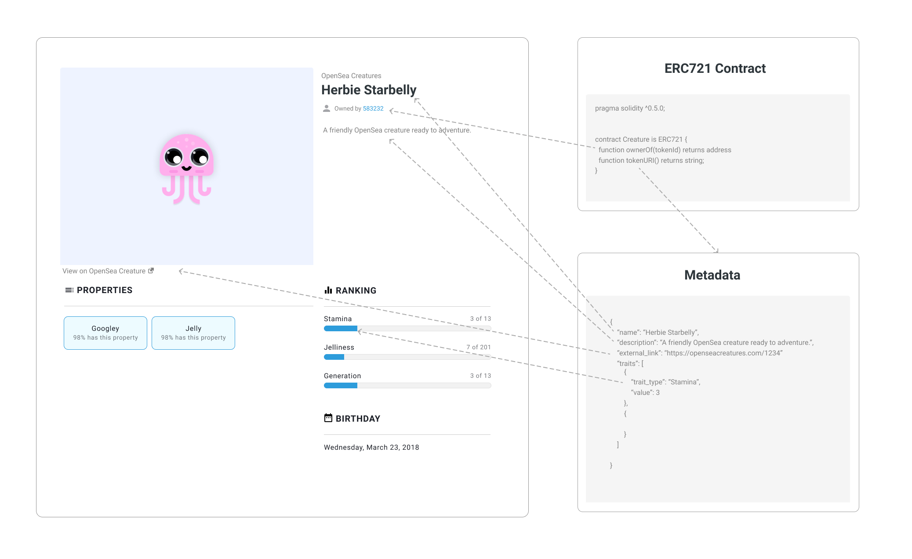
#### 元数据结构
OpenSea 支持根据[官方 ERC721 元数据标准](https://github.com/ethereum/EIPs/blob/master/EIPS/eip-721.md)或 [Enjin 元数据建议构造的元数据](https://github.com/ethereum/EIPs/blob/master/EIPS/eip-1155.md#erc-1155-metadata-uri-json-schema)。

此外，我们还支持其他几个属性，这些属性允许使用多媒体附件,包括

- 音频
- 视频
- 3D模型
- 以及商品的交互式特征

从而为您提供 OpenSea 市场上的所有排序和过滤功能。

以下是其中一个 OpenSea 生物的元数据示例：

	{
	  "description": "Friendly OpenSea Creature that enjoys long swims in the ocean.", 
	  "external_url": "https://openseacreatures.io/3", 
	  "image": "https://storage.googleapis.com/opensea-prod.appspot.com/puffs/3.png", 
	  "name": "Dave Starbelly",
	  "attributes": [ ... ], 
	}
参数解析如下

- image

	这是商品图片的网址。几乎可以是任何类型的图像（包括SVG，它将由 OpenSea 甚至 MP4 缓存到 PNG 中），并且可以是 [IPFS](https://github.com/ipfs/is-ipfs) URL 或路径。我们建议使用 350 x 350 的图像。
- image_data

	原始 SVG 图像数据（如果要动态生成图像）（不建议）。仅在不包含 image 参数的情况下使用此选项
- external_url

	这是 URL，将显示在 OpenSea 资产 image 下方并允许用户离开 OpenSea 并在您的网站上查看项目
- description

	该项目的人类可读描述。支持降价
- name

	项目名称
- attributes

	这些是项目的属性，这些属性将显示在该项目的OpenSea页面上。（见下文）
- background_color

	项目在OpenSea上的背景颜色。必须为六位字符的十六进制，且没有前置＃
- animation_url

	该项目的多媒体附件的 URL。
	
	- 支持文件扩展名 GLTF，GLB，WEBM，MP4，M4V，OGV 和 OGG
	- 以及仅音频扩展名MP3，WAV和OGA

	animation_url 还支持 HTML 页面，使您可以使用 JavaScript 画布，WebGL 等来构建丰富的体验。不支持访问浏览器扩展
- youtube_url

	YouTube视频的网址

#### Attributes(属性)
为了使您的项目更具趣味性，我们还允许您向元数据添加自定义“属性”，这些属性将显示在每个资产的下方。例如，以下是[OpenSea 生物](https://testnets.opensea.io/assets/0x7dca125b1e805dc88814aed7ccc810f677d3e1db/25)之一的属性。

为了生成这些属性，元数据中包含以下属性数组

	...
	{
	"attributes": [
	    {
	      "trait_type": "Base", 
	      "value": "Starfish"
	    }, 
	    {
	      "trait_type": "Eyes", 
	      "value": "Big"
	    }, 
	    {
	      "trait_type": "Mouth", 
	      "value": "Surprised"
	    }, 
	    {
	      "trait_type": "Level", 
	      "value": 5
	    }, 
	    {
	      "trait_type": "Stamina", 
	      "value": 1.4
	    }, 
	    {
	      "trait_type": "Personality", 
	      "value": "Sad"
	    }, 
	    {
	      "display_type": "boost_number", 
	      "trait_type": "Aqua Power", 
	      "value": 40
	    }, 
	    {
	      "display_type": "boost_percentage", 
	      "trait_type": "Stamina Increase", 
	      "value": 10
	    }, 
	    {
	      "display_type": "number", 
	      "trait_type": "Generation", 
	      "value": 2
	    }
	  ]
	}
这 `trait_type` 是特征的名称，是特征 `value` 的值，并且 `display_type` 是一个字段，指示您希望如何显示它。对于 `string` 特质，您不必担心 `display_type`

#### Numeric Traits(数字特征)
对于数字特征，OpenSea 当前支持三个不同的选项，

- `number`（在下图中的右下方）
- `boost_percentage`（在上图中的左下方）
- `boost_number`（类似于 `boost_percentage` 但不显示百分号）

如果您输入 `value` 的是数字而未设置 `display_type`，则该特征将显示在 “排名” 部分中（在上图中的右上方）。

添加可选选项可 `max_value` 为数字特征的可能值设置上限。它默认为 OpenSea 迄今为止在合约资产上看到的最大数量。如果设置为一个  `max_value`，请确保不要传递更高的值 `value`。

#### Date Traits(日期特征)
OpenSea 还支持 `date` `display_type`。此类型的特征将显示在“排名”和“统计”附近的右列中。传递 unix 时间戳作为值。

	{
	      "display_type": "date", 
	      "trait_type": "birthday", 
	      "value": 1546360800
	   }							
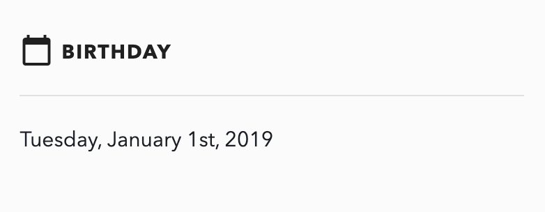

如果您不想 `trait_type` 为特定特征拥有一个，则可以在特征中仅包含一个值，并将其设置为通用属性。例如

	{
	    "value": "Happy"
	  }
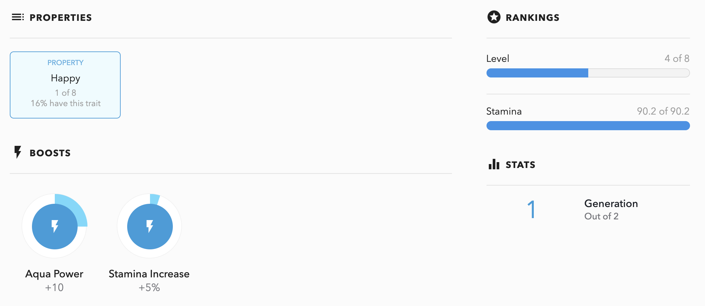	  				  		

也支持 [Enjin元数据样式](https://github.com/ethereum/EIPs/blob/master/EIPS/eip-1155.md#erc-1155-metadata-uri-json-schema)

	{
	    "properties": {
	        "base": "starfish",
	        "rich_property": {
	            "name": "eyes",
	            "value": "big",
	            "display_value": "Big",
	        }
	                ...
	    }
	}
虽然建议不要在链上存储元数据，但是如果您认为元数据对于您的用例很重要，请通过 support@opensea.io 与我们联系，我们将与您联系并提出问题和后续步骤。
#### 属性准则
提出您的属性时需要注意的几个重要事项！您应该将字符串属性包括为字符串（记住引号），并将数字属性包括为浮点数或整数，以便 OpenSea 可以适当地显示它们。字符串属性应该是人类可读的字符串。
#### 部署元数据API
欢迎您部署您认为合适的元数据API：您可以将其托管在 IPFS，云存储或您自己的服务器上。为了让您入门，我们在 Python 和 NodeJS 中都创建了一个示例API服务器：

- [Python 示例 API 服务器](https://github.com/ProjectOpenSea/metadata-api-python)
- [NodeJS示例API服务器](https://github.com/ProjectOpenSea/metadata-api-nodejs)

我们将很快创建一个教程，介绍如何将元数据服务器构建和部署到 Heroku！同时，查看 [Heroku](https://devcenter.heroku.com/articles/git) 关于该主题的资源
#### 在IPFS上存储
如果您打算在 IPFS 上存储，我们建议使用 [Pinata](https://pinata.cloud/) 轻松将数据存储在 IPFS 中
### 合约级元数据(自定义智能合约的元数据)
您可以将 `contractURI` 方法添加到 `ERC721` 或 `ERC1155` 合约中，该方法返回合约店面级元数据的 URL

	contract MyCollectible is ERC721 {
	    function contractURI() public view returns (string memory) {
	        return "https://metadata-url.com/my-metadata";
	    }
	}
该 URL 应该返回以下格式的数据

	{
	  "name": "OpenSea Creatures",
	  "description": "OpenSea Creatures are adorable aquatic beings primarily for demonstrating what can be done using the OpenSea platform. Adopt one today to try out all the OpenSea buying, selling, and bidding feature set.",
	  "image": "https://openseacreatures.io/image.png",
	  "external_link": "https://openseacreatures.io",
	  "seller_fee_basis_points": 100, # Indicates a 1% seller fee.
	  "fee_recipient": "0xA97F337c39cccE66adfeCB2BF99C1DdC54C2D721" # Where seller fees will be paid to.
	}
### 其他区块链
OpenSea 从其他基于 EVM 的链开始，正在积极致力于支持其他区块链。如果您正在开发另一条链，我们建议您执行以下操作：
#### 克莱顿区块链
如果您在 Klaytn 上进行开发，请按照[此处](https://docs.klaytn.com/smart-contract/sample-contracts/erc-721)的文档创建 ERC721 合约。
### Matic区块链
如果您使用 Matic 进行开发，请确保以下几点：

- 在 `isApprovedForAll` 方法中，您将 `0x` ERC721 或 ERC1155 代理合约列入白名单，具体取决于您的合约是 ERC721 还是 1155：

		/**
		   * Override isApprovedForAll to whitelist proxy accounts
		   */
		    function isApprovedForAll(
		        address _owner,
		        address _operator
		    ) public override view returns (bool isOperator) {
		        // Use 0x58807baD0B376efc12F5AD86aAc70E78ed67deaE as the whitelisted address for ERC721's.
		        if (_operator == address(0x207Fa8Df3a17D96Ca7EA4f2893fcdCb78a304101)) {
		            return true;
		        }
		        
		        return ERC1155.isApprovedForAll(_owner, _operator);
		    }
	这意味着用户首次在 OpenSea 上列出商品时无需支付汽油费。这对 Matic 尤为重要，因为 Matic 的天然气是在 Matic 中支付的，用户难以获得天然气。
- 您的智能合约支持元交易，因此 OpenSea 可以为用户提取诸如付款之类的方法的天然气费。为此，您需要执行以下操作：
	- 继承 Open Zeppelin 的最新 ERC721/ERC1155 标准。
	- 从 `ContentMixin` 和 `MetaTransaction` 实现中实现 `_msgSender()` 确定。

上面的示例实现可以在这里找到：

[https://github.com/ProjectOpenSea/meta-transactions/tree/main/contracts](https://github.com/ProjectOpenSea/meta-transactions/tree/main/contracts)

## 徽章嵌入式
### 徽标和品牌准则
这些是 OpenSea 的官方资源，您可以在营销材料，网页和/或移动应用程序中包括这些资源
#### 下载我们的徽标套件
是否需要在您的营销材料，网站等上添加 OpenSea？只需下载我们的[徽标工具包](https://storage.googleapis.com/opensea-static/opensea-logo-kit.zip)，即可获取我们不同徽标的 AI，SVG，PDF 和 PNG 格式。浏览以下内容以查看徽标套件中包含的内容。

- 商标

	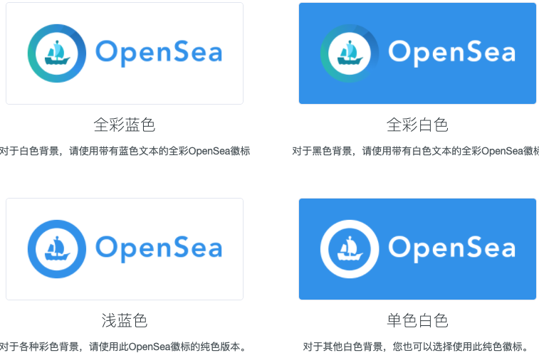
- 商标

	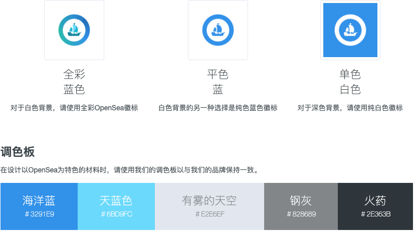

#### 徽章
通过在您的网站上添加我们的 OpenSea 徽章来建立与用户的信任

可以在网站上添加由 OpenSea 设计的徽章，以建立与用户的信任。根据您网站的配色方案，您可以选择添加浅色或深色 OpenSea 徽标

只需在代码中找到要在 OpenSea 徽章中添加的位置，然后复制并粘贴以下代码即可

- 	

			
- 		
		
		

我们也有“在OpenSea上市”徽章

- 

		
- 

		
- 

		
- 

		
		
### 嵌入
将 NFT 或集合直接嵌入到您的网站或博客中
#### 嵌入NFT的任何集合或页面
您可以通过 3 个简单的步骤将功能齐全的 OpenSea 市场嵌入到您的网站中！

- 找到要嵌入的 OpenSea 收藏集或市场页面，然后将其添加 `?embed=true` 到 URL 的末尾。如果 URL 中已经存在问号，请添加 `&embed=true`。
- 然后复制此以 `embed = true` 结尾的 URL，以替换下面的代码段中的示例URL（`https://opensea.io/assets?embed=true `）。
- 将此代码段粘贴到您的站点中，就可以开始工作

		<iframe src='https://opensea.io/assets?embed=true'
		        width='100%'
		        height='100%'
		        frameborder='0'
		        allowfullscreen>
		</iframe>						

想要自动调整手机框架的尺寸吗？OpenSea可与 [iFrame Resizer v4.2.3](https://github.com/davidjbradshaw/iframe-resizer) 一起使用。

如果您使用的是Wordpress，请参见[此处](https://themegrill.com/blog/wordpress-iframe/)，了解如何在您的网站中使用 iframe。

如果您不熟悉 HTML，或者不确定如何访问生成网站的代码，请在 Discord 上对我们执行ping操作。我们总是很乐意聊天。另外，您可以访问我们的[Github存储库](https://github.com/ProjectOpenSea/opensea-whitelabel)以获取更多说明。

- 

#### 嵌入单个NFT
您可以将来自 OpenSea 的任何 NFT 直接嵌入到您的网站、博客或中级帖子中。要嵌入 NFT，只需在 OpenSea 上转到 NFT（例如，此[OpenSea生物](https://opensea.io/assets/0x1301566b3cb584e550a02d09562041ddc4989b91/28)），然后单击右上角的 “共享” 按钮即可。然后选择 “嵌入资产”。弹出窗口将显示嵌入代码。将嵌入代码复制并粘贴到您的网站中。

在我们的[博客](https://opensea.io/blog/announcements/announcing-embeddable-nfts/)上阅读更多内容

- 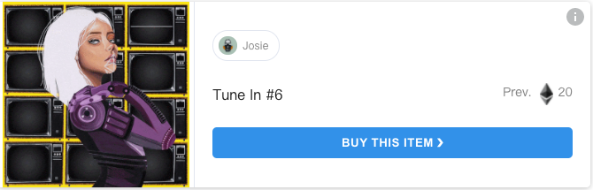						

## 合作伙伴计划
与 OpenSea 合作，为您的项目建立可定制的，标有白色的市场
### 建立自己的以 OpenSea 为动力的市场
我们已经建立了最大的密码收藏品市场，现在我们想帮助您建立自己的市场。OpenSea 为开发人员使用基于区块链的数字资产构建项目提供了一套强大的工具。

项目开发人员可以直接在 OpenSea 的基础设施上为其市场提供动力，获得对我们全套电子商务功能的即时访问，并在每次销售时就赚钱。

选项|页面|白标|sdk
---|---|---|---
即时设置-Instant set-up|1|-|-
定制化-Customizable |1|1|1
固定价格销售- Fixed-price selling|1|1|1
荷兰拍卖- Dutch auctions|1|1|1
竞价竞拍- Bid-based auctions|1|1|1
礼物- Gifting |1|1|1
捆绑- Bundles |1|1|1
免费gas 清单- Gas-free listings|1|1|1
收入成份-Revenue share|1|1|1
推荐/会员计划-Referral / affiliate program|1|1|1
定制化域名- Custom domain|-|1|1
完全控制定制- Full control over customization|-|-|1	

### 最先进的市场功能集
OpenSea 的平台为您的用户提供了最强大的购买和出售其商品的方式-拍卖、出价、捆绑（随便命名）。所有开发人员都可以立即访问我们的市场功能套件

- 

### 经过时间考验，经过审计的智能合约
OpenSea 由 [Wyvern 协议](https://github.com/ProjectWyvern)提供支持，Wyvern 协议是一套强大的以太坊智能合约，专门用于买卖独特的数字资产。智能合约经过安全审核，已用于大量游戏的生产中。您无需部署任何其他智能合约（除了 ERC721 或 ERC155 合约），即可使用我们的 SDK 立即进行商品交易。
### 完全可定制
您可以完全按照自己的需求定制市场。无论您是使用我们的即时 [OpenSea Storefront](https://docs.opensea.io/docs/opensea-storefront) 解决方案，通过我们的[白标集成](https://docs.opensea.io/docs/opensea-white-label)在自己的域上构建，还是使用 [OpenSea SDK](https://docs.opensea.io/docs/opensea-sdk) 进行DIY方法构建，您都可以在市场中获得所需的准确外观经验。
### 在最大的去中心化市场上的曝光
成千上万的用户已经在浏览 OpenSea，以发现价格最优惠的商品。当您建立自己的 OpenSea 市场时，您的商品将立即交叉列出到一般 OpenSea 市场中以供发现。

我们交易所的交易量超过 25,000 ETH，我们为基于区块链的项目建立了流动性池。通过使用 OpenSea，您可以直接插入该流动资金池，并真正使您的商品市场蓬勃发展。

- 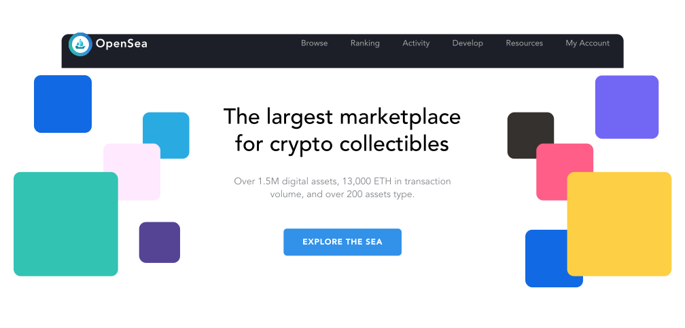

### 通过二次销售赚取收入
用户每次售出商品时，都会支付一定费用-占商品价格的百分比。当您在 OpenSea 上托管市场时，您会得到一笔费用。随着交易量的增加和曝光率的提高，这使得使用 OpenSea 实质上比建立一个孤立的市场更为可取。

您可以采取很小的削减幅度来鼓励更多交易，也可以采取更大的削减幅度来尝试最大化收入。

该过程很简单-只需指定您希望进行二次销售的费用百分比以及将要支付资金的地址即可。要了解有关设置费用的更多信息，请查看我们的[文档](https://docs.opensea.io/docs/10-setting-fees-on-secondary-sales)。 

### 在OpenSea上托管您的初始商品销售
我们的许多合作伙伴还在 OpenSea 上托管其初始商品销售。这可以完全在 OpenSea 平台上完成，并在[《OpenSea Crowd Sale教程》](https://docs.opensea.io/docs/opensea-initial-item-sale-tutorial)中进行了详细说明。

另外，如果您想做更多定制工作，请联系contact@opensea.io。

#### 店面
通过可定制的OpenSea集成立即启动并运行

利用 OpenSea 的最简单方法是通过 OpenSea 店面功能。只要您的合约符合 ERC721 或 ERC1155，此选项即刻生效。只需按照 [OpenSea 开发人员教程](https://docs.opensea.io/docs/getting-started)来设置商品并获得商品的即时交易市场即可。开发人员称此过程“神奇”。

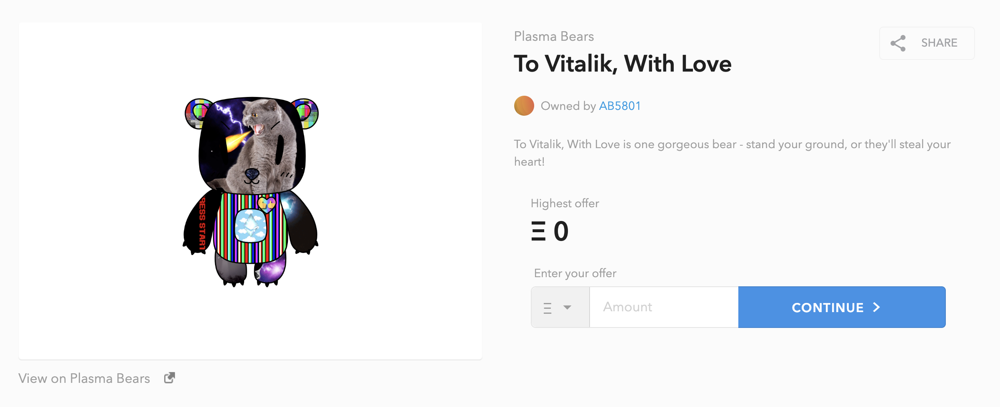

- 即时买卖

	借助 OpenSea 店面，您可以通过 OpenSea 的平台立即进行商品交易。这意味着您的用户将能够立即出售商品，而无需支付加油费，对商品进行出价，出售商品捆绑并将其赠送给其他用户。您可以免费获得所有这些！
	
	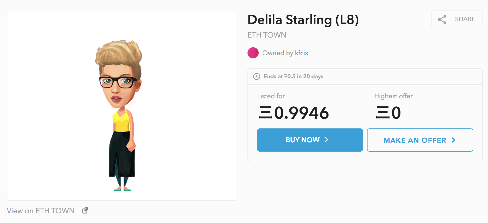
- 价钱

	OpenSea 店面功能不仅完全免费，而且还具有 OpenSea 的每笔二次销售都能为您带来收入的额外好处！您可以在[店面编辑器](https://docs.opensea.io/docs/8-customizing-your-storefront)中设置费用。
	
	[开始使用店面](https://docs.opensea.io/reference)	
#### 白标
在您自己的域上运行完全按照您的品牌定制的 OpenSea 市场

对于希望将更具定制化的市场直接集成到其网站或移动应用程序中的合作伙伴，我们提供了白标解决方案。查看我们的仓库以了解如何使用 iFrame 将您的市场直接嵌入到您的网站中 [https://github.com/ProjectOpenSea/opensea-whitelabel](https://github.com/ProjectOpenSea/opensea-whitelabel)

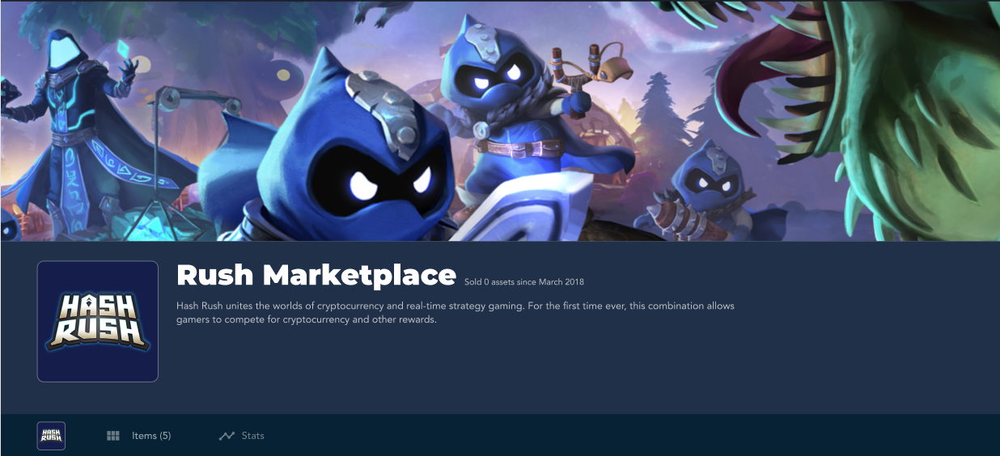

- 在您自己的域或应用上进行完全自定义

	OpenSea 白色标签可让您自定义主要市场页面以及每个单独列表的外观。将市场直接托管在您的域上，用户可以通过游戏体验直接访问该市场，或者允许用户直接在您的移动应用程序中利用体验。
	
	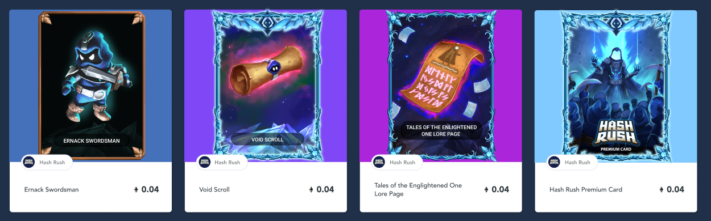
- 选择自己的经济学

	允许用户使用自己的代币买卖，并对 OpenSea 体验中的商品交易方式设置必要的限制。OpenSea 提供对自定义 ERC20 令牌的全面支持，并包括内置的会员奖励计划，以鼓励用户为您的物品寻找买家。
	
	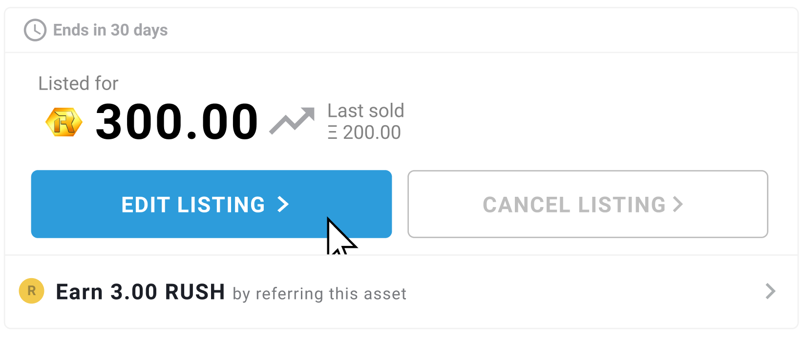
- 全力支持

	您将直接与OpenSea团队联系，以进行其他自定义
		
#### SDK
使用我们的 SDK 在 OpenSea 上建立自己的市场

是否想在 OpenSea 上建立自己的集成？请查看我们的 [SDK](https://github.com/ProjectOpenSea/opensea-js/)，了解基础工具集，该工具集可让您通过我们的平台为游戏内市场提供支持。

借助SDK，开发人员可以从头开始构建自己的市场，并将其更深入地集成到您的游戏中。也许您正在为游戏构建自定义后端，并希望在服务器端创建交易，或者您可能需要人们能够在游戏玩法的深处进行拍卖。SDK的确是无处不在。

例如，您可以查看 [Footfootttle](https://footbattle.io/transferMarket)市场，该市场完全使用OpenSea的SDK构建。

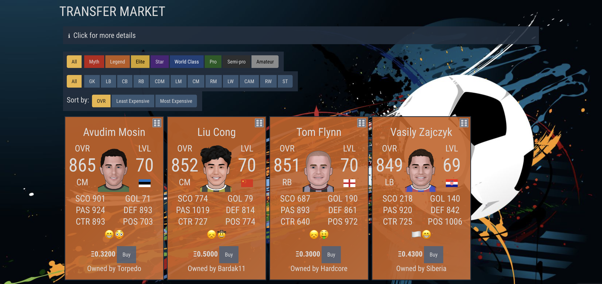	
#### 销售
通过 OpenSea Crowd Sale 集成，您可以完全使用 OpenSea 基础结构对商品进行众筹。如果您想分发游戏中物品的所有权或现有游戏中新物品的所有权，我们的工具可最大程度地提高加密游戏社区的曝光率，并为拍卖物品提供强大的基础架构。

- 无 gas 上市
- 多种拍卖方式（eBay式，荷兰式，固定价格）
- 市场上的曝光
- 直接整合到您的网站
- 捆绑和战利品集成
- 推荐/会员系统
- 卖出美元

要开始使用 OpenSea Crowd Sale 集成，请查看我们的[众筹教程](https://docs.opensea.io/docs/opensea-initial-item-sale-tutorial)

- 案例研究1：硬币和钢铁

	[Coins＆Steel](https://coinsandsteel.com/) 利用 OpenSea 平台进行众筹，在交易的前几周进行了价值 187 ETH 的交易。该团队没有实施自定义合约，而是通过利用 OpenSea 交换合约以及用于搜索和分类预售物品的用户界面节省了开发时间。
	
	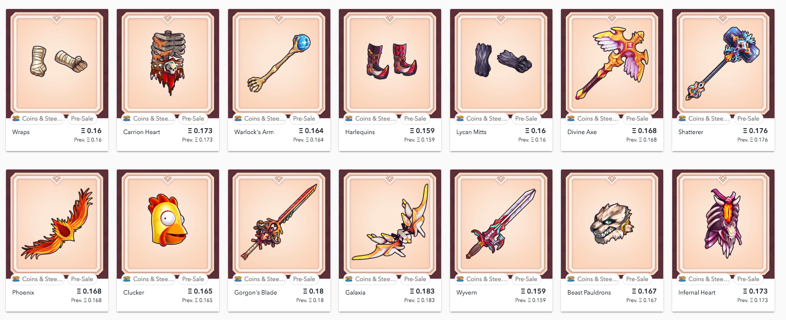
- 案例研究2：断链者

	[Chainbreakers](https://docs.opensea.io/docs/chainbreakers.io)利用OpenSea平台进行众筹，进行了160万MANA的销售。
	
	
- 案例研究3：战争骑士

	War Riders-建立在以太坊上的 MMO，并与 OpenSea 集成以对其车辆进行众筹。	
	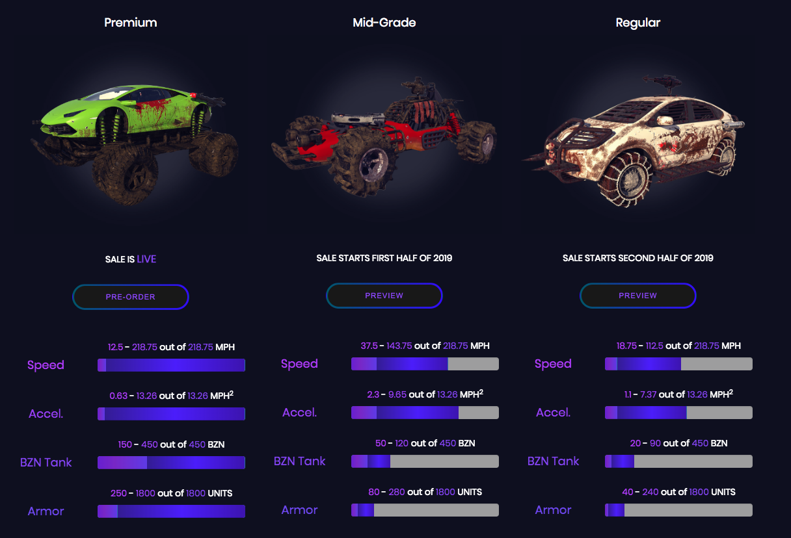
- 案例研究4：F1 Delta时间

	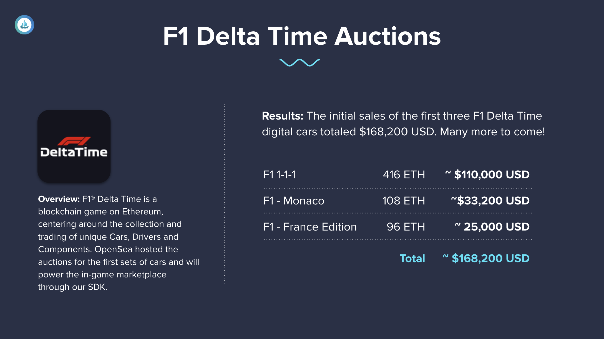
			

	