# 什么是 `ALCHEMY` 和 `INFURA`
去中心化网络应用的基础设施，可以提供即时可靠的链接以太网或 IPFS 的基础设施服务.

主要价值是通过一种技术手段(使用类似 ALCHEMY 等，或自建)来对链上数据进行操作，包含

- 跟踪关键交易
- 交易更新
- 同步数据到网站
- 高可用
- 高性能(尽可能高)

## ALCHEMY
ALCHEMY 提供多种产品，其中之一是 以太坊 API, 下面对产品进行分析
### 超级节点
Alchemy Supernode是使用最广泛的以太坊API，具有增强的可靠性，数据正确性和可伸缩性。类似于 INFURA 以太网 APi 功能
#### 为什么要选择
Alchemy Supernode 通过专用的分布式系统扩展了每个节点的功能，并通过专有的协调器服务维护了实时数据的正确，业界领先的以太坊API，Web 3.0的创新架构
#### 优势
- 数据正确性

	Web 2.0 基础结构使用由负载均衡器管理的多台服务器。区块链失败，因为每个节点都有不同的块、事务和日志。这不可避免地会导致错误，使应用程序崩溃并破坏用户体验。借助专有的协调器服务，Alchemy Supernode 可确保数据始终正确、实时和同步。

	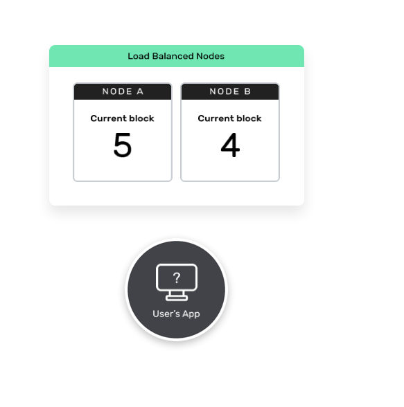
- 峰值可靠性

	直接在节点上运行的应用程序会遭受较高的延迟和停机时间，因为节点是通用的，并且其设计目的不是高度可用的。Alchemy Supernode 通过专用的分布式系统为节点的每个功能提供动力-与 Facebook 和 Amazon 用于实现大规模扩展的系统相同。
	
	
- 无限的可扩展性

	不必担心维护自己的基础架构。挑战是如此复杂，并且扩展更多的节点只会增加数据错误，从而导致崩溃，使您的睡眠和用户损失惨重。Alchemy Supernode 可以快速无缝地扩展，因此您可以花费更多的时间来运送产品并取悦用户。
		
	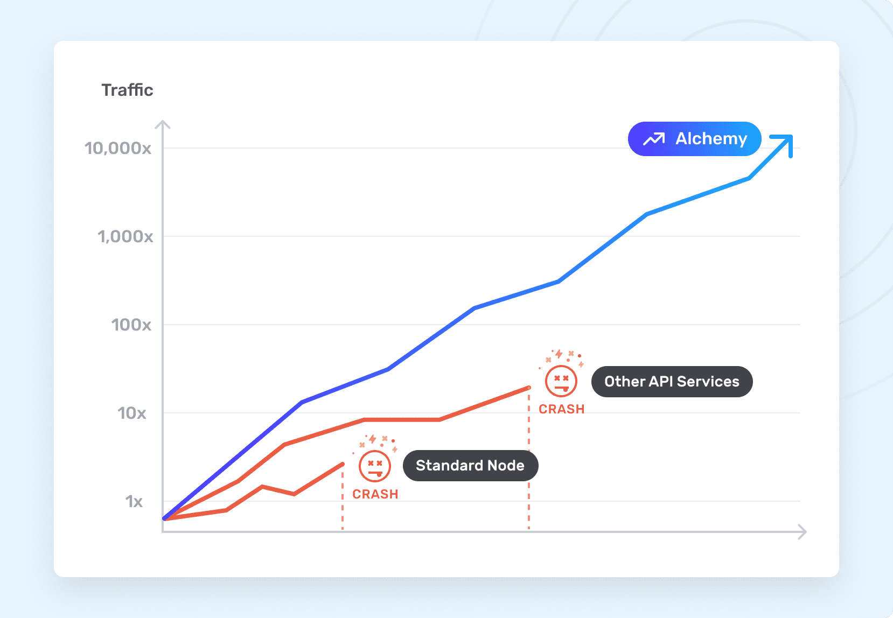
- 免费存档访问(全区块链数据)

	Alchemy 的 Supernode 支持无限量的归档数据请求，即使在免费层上也是如此。获取您需要的所有历史区块链信息，包括能够从创世叉起整个链，而无需任何额外费用。
- 增强型API

	Alchemy Supernode 包含增强的 API 方法，可在虚拟内存池中返回冻结和交易请求，智能合约事件日志以及未决交易。另外，升级后的 WebSocket 会持续监听更改，并自动处理重新连接和回填遗漏的事件。

### 开发系统	
Alchemy Build是一种无代码，无配置的开发人员工具套件，可以更快地对产品进行原型设计，调试和交付。立即免费开始！
#### 优势
更少的调试时间，更多的构建时间

- 搜索平台

	即时搜索数以百万计的历史请求，以查找特定的错误，性能优化或错误模式。
- 内存池可视化器

	查看内存池中事务的实时状态，以识别延迟，卡住或掉落的事务。
- 作曲家

	直接从仪表板进行 JSON-RPC 调用，以原型化和修复失败的请求或探索新方法的行为。
- 调试工具包

	快速扫描最近的请求和最近的错误，以及实时查询可视化工具，以帮助您以前所未有的速度进行调试

### 监控系统			
Alchemy Monitor 是一套全面的仪表板和警报，可用于检测应用程序的运行状况，性能和用户行为。可以在问题发生之前将其阻止，并通过深入的见解推动增长
#### 优势
- 指挥中心

	在一个地方即时检查所有应用程序的高级运行状况，包括每秒请求，响应时间和错误率
	
	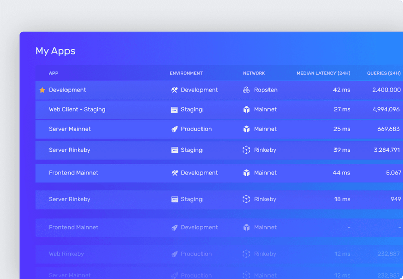
- 使用情况分析

	随时检查特定的应用程序使用情况，完全比较和对比制作和登台或两个不同的应用程序，甚至按方法深入研究应用程序使用情况。
	
	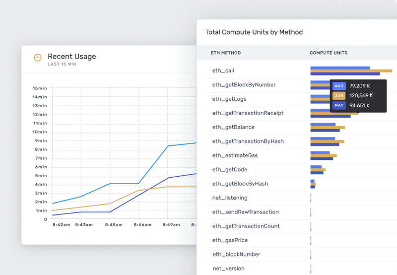
- 帮助优化

	允许使用多种过滤器来分析API调用，可以更好地了解如何优化请求，以及以更快的方式调试自己系统中的任何问题
- 用户见解

	通过汇总的地理，流量和活动数据获得有关用户行为的宝贵见解，而不会影响隐私或安全性。
	
	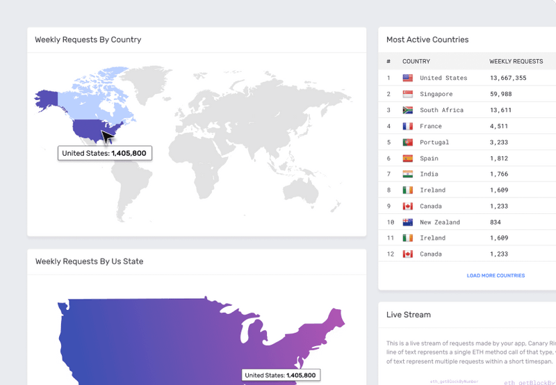
- 警报和摘要

	每当您的应用遇到错误并需要引起您的注意时，就会收到自动警报。另外，每天获取关键健康指标的报告，这样您就不会失去与性能的联系。
	
	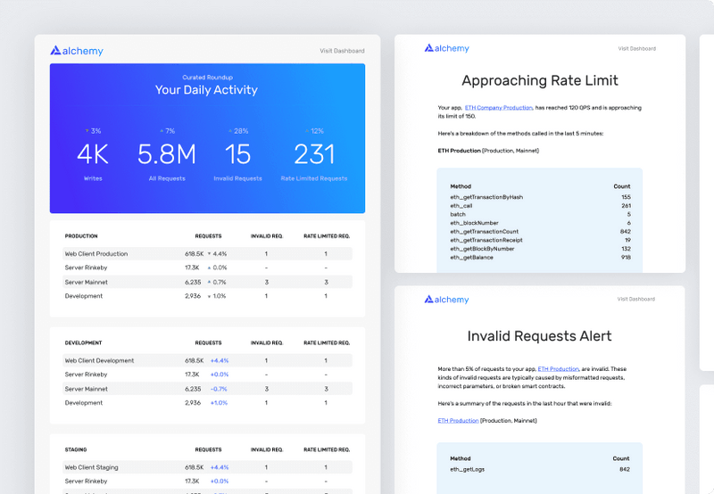
- 轻松整合

	通过吸引用户并创建更好的用户体验，将应用程序的使用率提高10倍。
- 强大的Webhooks

	可以访问用户关心的所有事件，例如交易记录和掉线，还可以通过强大的 Webhook 立即通知他们。
- 虚幻结果

	在不到15分钟的时间内吸引用户。一键式创建一个新的钩子，然后配置并开始通知。	
### 增强的 API 方法
不断增长的增强的 API 方法套件，使您的开发人员生活更加轻松。不再需要复杂且昂贵的区块链请求，只需更少的请求即可获得交易，令牌信息和调试所需的所有数据。
#### 优势
- 交易记录，起源

	在单个 API 调用中，此方法返回任何块范围内特定帐户或地址的交易记录。不必遍历整个链，而立即获得与请求参数相对应的传输对象列表。
	
	
- 基本令牌标识符

	在单个 API 调用中，此方法返回给定合同地址的关键令牌元数据。提供用于计算用户余额和显示令牌信息的必要信息。
	
	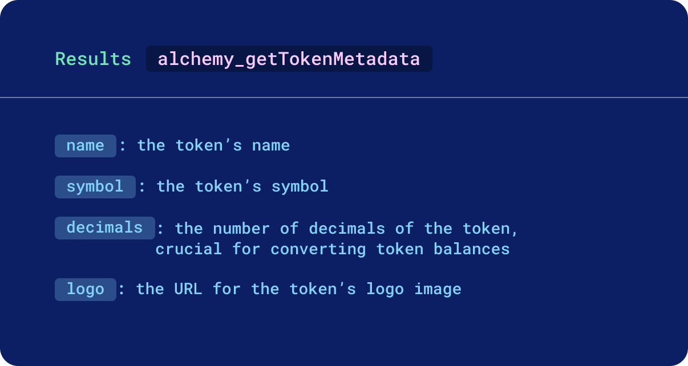
- 每个令牌的账户余额

	在单个 API 调用中，此方法在给定令牌合同列表的情况下返回用户地址的令牌余额。	
	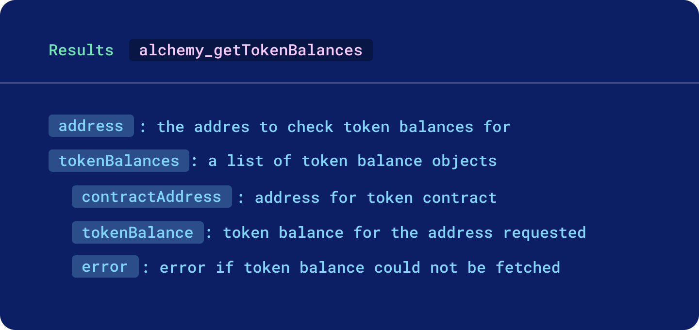
- 可用令牌数量

	在单个API调用中，此方法返回允许支出者从令牌所有者中提取的给定令牌的数量。	
	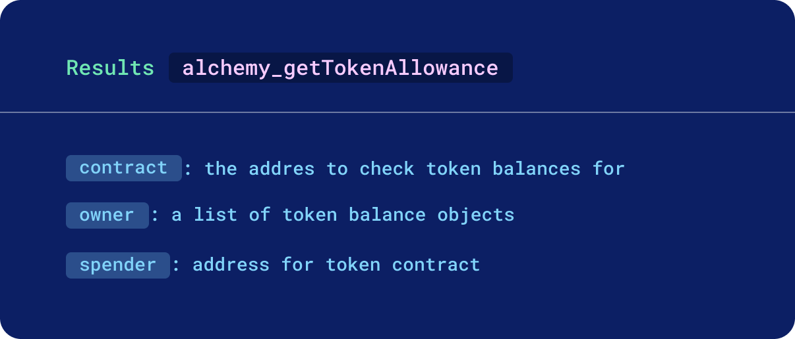
- 来自整个区块的完整交易收据

	在单个 API 调用中，此方法将返回指定块中包含的每个交易的完整交易收据。
	
	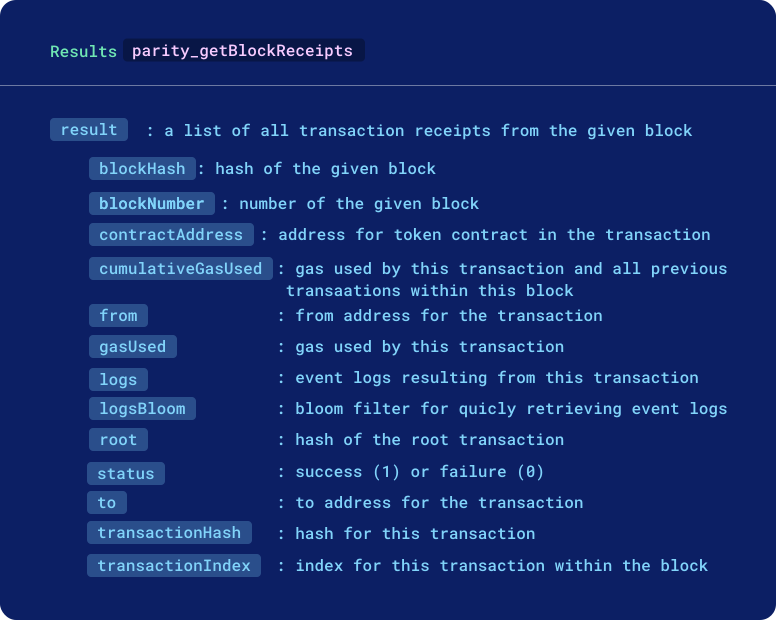			
- 更深入的交易见解
	
	通过这套API调用，您可以轻松地获得对事务处理的更深刻见解	
	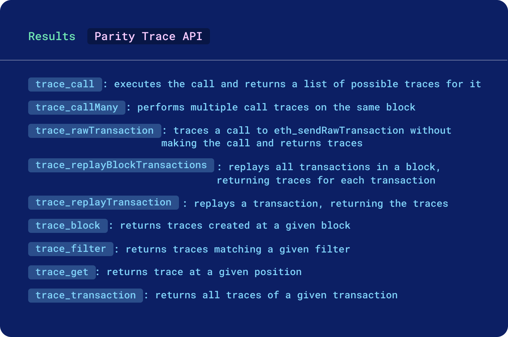
- 调试变得容易

	在单个API调用中，此方法将以与在网络上执行的方式完全相同的方式运行事务，并在此过程中重播每个事务
- 现有功能最强大的Web3库

	Alchemy Web3是web3.js的直接替代产品，其构建和配置为与Alchemy无缝协作，并提供了多个优点，例如自动重试和强大的WebSocket支持。
- 完全待处理的交易

	订阅以接收所有新的未决交易的完整交易收据，而不仅仅是交易哈希。

### 营销工具
Alchemy Amplify 是您的首选发布合作伙伴，可让开发人员和内容创建者在我们处理炒作的同时专注于构建自己的产品.即时产品可见度,改变游戏规则的产品和内容应与世界各地的用户共享。
#### 优势
- 认证基础设施联盟

	加入认证基础设施联盟，与该领域的知名人士一道，获得即时的信誉和无穷的回报。
	
	
- 增压通讯

	吸引您的受众并与已经在寻找您的产品或内容的 10,000 多个用户建立联系
- 社会传播

	立即与忠诚的用户建立联系并建立联系，这些忠诚的用户可能会成为您产品的传播者
- 个人聚光灯

	与领先的区块链项目和建设者分享您的故事，并引起项目关注。
- 加速器

	通过 独家获得启动折扣，指导和专用的24/7 Web3支持渠道来扩展您的增长。	

### 消息系统
Alchemy Notify允许开发人员向用户发送针对关键事件的实时推送通知，Alchemy 是唯一支持用户旅程中每个重要时刻的通知的区块链开发平台。增加用户的留存、参与、LTV
#### 优势
- 采矿交易

	让您的用户确切知道他们的存款，购买，游戏内操作或其他链上活动何时正式发生–是重新参与并继续使用您的应用程序的最佳时机。
- 交易掉落

	让您的用户在交易失败时立即做出响应，从而消除了区块链UX中最令人沮丧的部分。不再有错失交易，拍卖失败或代币消失的情况。
- 地址活动 Webhook

	让您的用户知道他们的地址上何时发生交易活动。无需刷新页面或观看每个新块并创建自定义过滤器来跟踪用户数据。
- 气体 Webhook

	Gasnet Webhook 允许您在 Mainnet 汽油价格高于或低于您可以选择的特定阈值时每分钟收到一条通知。
			
### 基础设施架构图
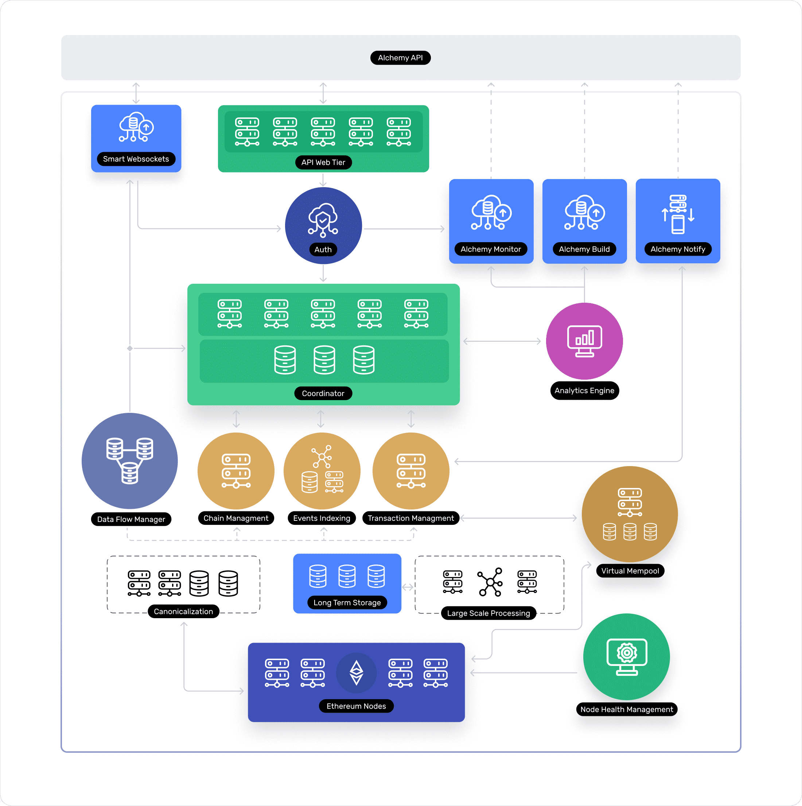
### 商业收费
- core 
	- 价格 免费
	- 功能
		- 超级节点构建、监控和通知
		- 每个月 25,000,000 的计算单元 
		- 5个项目
		- 增强 API
		- 完整的存储数据	
		- 基本限速 330/s
 - 增长 
	- 价格 $49/月
	- 功能
		- 包含所有免费功能 
		- 每个月 50,000,000 的计算单元 
		- 15个项目
		- 自动缩放计算单元
		- 奇偶校验和Geth 调试
		- 7*24 技术支持
		- 基本限速 660/s
 - 企业 
	- 价格 定制
	- 功能
		- 包含所有增长功能 
		- 自定义 SLA 
		- 无限项目
		- 自定义速率限制
		- 加密货币支付
- 扩展
	- 计算单元

		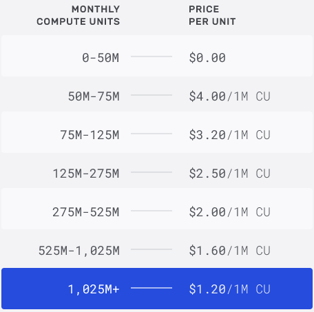
	- 什么是计算单元(CU)
	
		计算单元是 API 方法在 Alchemy 上消耗多少资源（CPU，RAM，磁盘等）的度量。一个简单的请求（例如blockNumber）仅消耗 10 个CU，而一个更复杂的请求（例如eth_call）则消耗 26 个CU。		

## INFURA
### 为什么选择 Infura？
Infura API 套件通过 HTTPS 和 WebSocket 提供对以太坊和 IPFS 网络的即时访问。提供 Web 3.0 应用程序的基础结构。

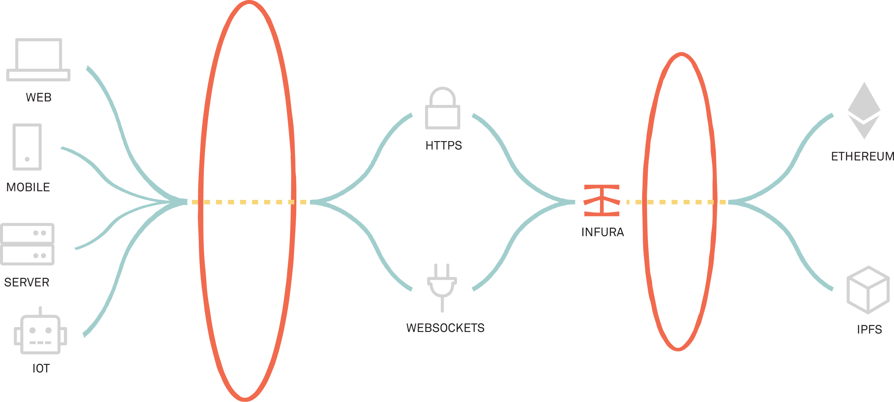

- [基础设施监控](https://status.infura.io/)

	

### 优势
- 专注于基础设施

	Infura 由尖端的微服务驱动架构提供支持，该架构可动态扩展以支持我们的 API。开发人员可以通过 HTTPS 和 WebSocket 连接到以太坊和 IPFS，在这里请求响应时间比其他服务和自托管解决方案快 20 倍。我们的 API 套件始终具有最新的网络更新，并在所有网络更改期间保持服务可用性，[请在此处查看我们的正常运行时间](https://status.infura.io/)。
- 目标帮助客户专注于应用建筑

	我们的目标是提供最简单，提供最可靠的基础架构。使用 Infura API 套件可让您花费更多时间与用户交谈并建立他们的需求。
- 深入了解您的应用

	我们的信息中心可让您直接了解应用的性能和 API 使用情况。使用它来优化和更好地了解您的用户。深入研究特定的请求方法，最活跃的使用时间等。

### 提供的功能
- 以太坊接口

	通过 HTTPS 和 WSS 上与客户端兼容的 JSON-RPC 支持主网和测试网。
- IPFS接口

	支持用于在网络上存储和检索数据的标准 IPFS 库
- 即时可用性

	用一行代码连接您的应用程序。没有同步，没有复杂的设置。
- 一直在线

	在最新的网络升级上运行，具有至少 99.9％ 的正常运行时间保证。
- 开发人员仪表板

	使用 Infura 配置，监视和分析您的应用程序。
- 全球支持

	24/7全天候访问专家支持团队和我们经验丰富的开发人员社区。
- 封存资料

	访问高级订户可用的以太坊存档节点数据。
- 可调极限

	我们在这里帮助您的应用取得成功。如果您的项目不断增长并且超出了您的日常要求，我们可以与您一起制定适合您需求的新计划。

### 商业收费
#### [Infura 以太坊API](https://infura.io/pricing)
Infura Standard Ethereum API 通过 HTTPS 和 WebSocket 提供对以太坊网络的即时访问。为开发人员提供了最易访问、最可靠的连接，使您有更多时间可以花更少的时间在基础架构上，而有更多的时间来构建出色的软件。

- core 
	- 价格 免费
	- 功能
		- 以太坊主网和测试网
		- 每天100,000个请求
		- 3个项目
		- 社区支持论坛
- 开发者
	- 价格 $50/月
	- 功能(比core套餐)
		- 每天200,000个请求
		- 10个项目
		- 直接客户支持
- 团队
	- 价格 $225/月
	- 功能(比开发者套餐)
		- 每天1,000,000个请求
		- 项目不限个数
		- 24小时支持响应时间
- 企业级
	- 价格 $1000/月
	- 功能(比团队套餐)
		- 每天5,000,000个请求
		- 8小时支持响应时间
- 其他套餐
	- 请求包
		- 价格 $200/月
		- 每天 1,000,000 个请求
	- 封存资料
		- 价格 $250/月

			使用完整的存档节点数据增强您的以太坊数据。存档数据附加组件提供对以太坊网络上的历史数据的API访问 
	- 多边 pos 网络组件()
		- 价格 $200/月？
		
		使用这些与以太坊兼容的网络升级您的帐户，以提高交易吞吐量，降低交易费用等，以太坊主网的混合等离子权益证明侧链，利用 Tendermint 共识验证器层和等离子侧链进行区块生产。	      		