# 以太坊：一种安全去中心化的通用交易账本(拜占庭版本 f72032b - 2018-05-04)
## 说明
Abstract. 由密码学安全交易（cryptographically-secured transactions）所构成的区块链范式，已经通过一系列项目展示了它的实用性，不止是比特币。每一个这类项目都可以看作是一个基于去中心化的单实例计算资源所构建的简单应用程序。我们可以把这种范式称为具有共享状态（shared-state）的交易化单例状态机（transactional singleton machine）。 以太坊以更通用的方式实现了这种范式。它提供了大量的资源，每一个资源都拥有独立的状态和操作码，并且可以通过消息传递方式和其它资源交互。我们将讨论它的设计、实现上的问题、它所提供的机遇以及我们所设想的未来障碍。
## 名词解释
- Address(地址)

	用于识别帐户的 160 位代码。
- Account(帐户)

	帐户具有作为以太坊状态的一部分维护的内在余额和交易计数。

	它们还有一些（可能是空的）EVM 代码和一个（可能是空的）与之相关的存储状态。虽然是同质的，但区分两种实际类型的账户是有意义的：
	
	- 那些关联 EVM 代码为空的账户（因此账户余额由某个外部实体控制，如果有的话）
	- 非空关联 EVM 代码的账户（因此帐户代表一个自治对象）。每个帐户都有一个标识它的地址。
- Transaction(交易)

	一条数据，由外部参与者签名。它代表一个消息或一个新的自治对象。交易记录在区块链的每个区块中。
- Autonomous Object(自治对象)

	仅存在于以太坊的假设状态中的概念对象。有一个固有地址，因此有一个关联的帐户；该帐户将具有非空的关联 EVM 代码。仅作为该帐户的存储状态合并。
- Storage State(存储状态)

	特定于给定账户的信息，在账户关联的 EVM 代码运行期间维护。
- Message(消息)

	通过自治对象的确定性操作或交易的加密安全签名在两个账户之间传递的数据（作为一组字节）和值（指定为以太）。
- Message Call(消息调用)

	将消息从一个帐户传递到另一个帐户的行为。如果目标帐户与非空 EVM 代码相关联，则 VM 将以所述对象的状态和所作用的消息启动。如果消息发送者是自治对象，则调用会传递从 VM 操作返回的任何数据。
- Gas(天然气)

	基本的网络成本单位。完全由 Ether 支付（从 PoC-4 开始），它可以根据需要自由转换为 Gas。 Gas 不存在于以太坊内部计算引擎之外；其价格由交易设定，矿工可以随意忽略 Gas 价格过低的交易。
- Contract(合约)

	非正式术语，用于表示可能与帐户或自治对象相关联的一段 EVM 代码。
- Object(对象)

	自治对象的同义词。
- App(应用程序)

	托管在以太坊浏览器中的最终用户可见应用程序。
- Ethereum Browser(以太坊浏览器)

	（又名以太坊参考客户端）界面类似于简化浏览器（如 Chrome）的跨平台 GUI，能够托管后端完全基于以太坊协议的沙盒应用程序。
- Ethereum Virtual Machine(以太坊虚拟机)

	（又名 EVM）构成账户相关 EVM 代码执行模型关键部分的虚拟机。
- Ethereum Runtime Environment(以太坊运行时环境)

	（又名 ERE）提供给在 EVM 中执行的自治对象的环境。包括 EVM，还包括 EVM 依赖于某些 I/O 指令（包括 CALL 和 CREATE）的世界状态的结构。
- EVM Code(EVM 代码)

	EVM 可以本地执行的字节码。用于正式指定消息到帐户的含义和后果。
- EVM Assembly(EVM 程序集)

	EVM 代码的人类可读形式。
- LLL

	类 Lisp 的低级语言，一种人类可写的语言，用于编写简单的合约和用于反编译的通用低级语言工具包。

## 1 简介
随着互联网连接了世界上绝大多数地方，全球信息共享的成本越来越低。比特币网络通过共识机制、自愿遵守的社会合约， 实现了一个`去中心化的价值转移系统`且可以在全球范围内自由使用，这样的技术改革展示了它的巨大力量。 这样的系统可以说是加密安全、基于交易的状态机的一种具体应用。尽管还很简陋，但类似域名币（Namecoin）这样的后续系统，把这种技术从最初的“货币应用”发展到了 其它领域。

以太坊是一个"尝试"达到通用性的技术项目，可以构建任何基于交易的状态机。 而且以太坊致力于为开发者提供一个紧密整合的端到端系统， 这个系统提供了一种可信对象消息传递计算框架（a trustful object messaging compute framework），使开发者可以用一种前所未有的计算范式来构建软件。
### 1.1 驱动因素
这个项目有很多目标，其中最重要的目标是为了促成那些本来无法信任对方的个体之间的交易。 这种不信任可能是因为地理上的分隔、对接的困难，或者是不兼容、不称职、不情愿、费用、不确定、不方便，或现有法律系统的腐败。 于是我们想用一个丰富且清晰的语言去实现一个状态变化的系统，期望协议可以自动被执行，我们可以为此提供一种实现方式。 这里所提议的系统中的交易，有一些在现实世界中并不常见的属性。公允的裁判通常很难找到，但无私的算法解释器却可以天然地提供这种特性。自然语言必然是模糊的，会导致信息的缺失， 同时那些平白的、旧有的成见很难被动摇，所以透明性或者说通过"交易日志"和规则或代码指令来清晰地查看状态变化或者裁判结果的能力， 在基于人来构建的系统中从来无法完美实现。 总的来说，我希望能提供一个系统，来给用户提供一些保证：无论是与其他个体、系统还是组织进行交互，他们都能完全信任可能的结果以及产生结果的过程。
### 1.2. 前人工作
- Buterin [2013a] 

	在 2013 年 11 月下旬第一次提出了这种系统的核心机制。 虽然现在已经在很多方面都有了进化，但其核心特性没有变化。那就是：

		这是一个具有图灵完备的语言和实质上具有无限的内部交易数据存储容量的区块链。 
- Dwork and Naor [1992] 

	第一次提出了使用计算开销的密码学证明（“proof-of-work”，即工作量证明）来作为在互联网上传递价值信号的一种手段。这里所使用的价值信号是作为对抗垃圾信息的一种威慑机制的， 并不是任何形式的法币；但这却极大地论证了一种承载强大的经济信号的基本数据通道的潜在可能， 这种通道允许数据接受者不依赖任何信任就可以做出物理断言。 Back [2002] 后来设计了一个类似的系统。
- Vishnumurthy et al. [2003] 

	最早使用工作量证明作为强大的经济信号保证货币安全。 在这个案例中， 代币被用来在点到点（peer-to-peer）文件交易中检查并确保“消费者” 可以向服务的“提供商”进行小额支付。通过在工作量证明中增加数字签名和账本， 一种新的安全模型产生了。 这种模型是为了防止历史记录被篡改， 并使恶意用户无法伪造交易或者不公平的抗议服务的交付。五年后（2008 年），中本 聪 Nakamoto [2008] 引入了另一种更广泛的工作量证明安全价值代币。这个项目的成果就是比特币，它也成为了第一个被广泛认可的全球化去中心化交易账本。

	由于比特币的成功，竞争币（alt-coins）开始兴起。通过修改比特币的协议，人们创建了许多其他的数字货币。比较知名的有
	
	- 莱特币（Litecoin）
	- 素数币（Primecoin）
	
	参见 Sprankel [2013] 。一些项目使用比特币的核心机制并重新改造以应用在其它领域，例如

	- 域名币（Namecoin）致力于提供一个去中心化的名称解析系统，参见 Aron [2012] 。

	其它在比特币网络之上构建的项目， 也是依赖巨大的系统价值和巨大的算力来保证共识机制。 

	- 万事达币（Mastercoin）项目是在比特币协议之上, 通过一系列基于核心协议的的辅助插件， 构建一个包含许多高级功能的富协议，参见 Willett [2013] 。
	- 彩色币（Coloured Coins，参见 Rosenfeld et al. [2012] ， 采用了类似的但更简化的协议， 以实现比特币基础货币的可替代性， 并允许通过色度钱包 （chroma-wallet）来创建和跟踪代币。
	
	其它一些工作通过放弃去中心化来进行。 
	
	- 瑞波币（Ripple），参见 Boutellier and Heinzen [2014] ，试图去创建一个货币兑换的联邦系统（`federated system`）和一个新的金融清算系统。 这个系统展示了放弃去中心化特性可以获得性能上的提升。
- Szabo [1997] 和 Miller [1997] 

	进行了智能合约（smart contract）的早期工作。大约在上世纪 90 年代，人们逐渐认识到协议算法的执行可以成为人类合作的重要力量。 虽然当时没有这样的系统， 但可以表明法律的未来发展将会受到这种系统的影响。就此而言，以太坊或许可以视为这种 `加密-法律（cypto-law）系统` 的一种通用实现。

	本文中所使用的术语列表，请参考附录 A。

## 2. 区块链范式
以太坊在整体上可以看作 `一个基于交易的状态机`：

- 起始于一个创世区块（Genesis）状态
- 然后随着交易的执行状态逐步改变一直到最终状态， 这个最终状态是以太坊世界的权威“版本”。

状态中包含的信息有：

- 账户余额
- 名誉度
- 信誉度
- 现实世界的附属数据等；

简而言之，能包含电脑可以描绘的任何信息。 而交易则成为了连接两个状态的有效桥梁；“有效”非常重要(因为无效的状态改变远超过有效的状态改变。) 例如：无效的状态改变可能是减少账户余额，但是没有在其它账户上加上同等的额度。一个有效的状态转换是通过交易进行的。可以正式地描述为：

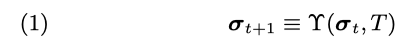

- Υ 是以太坊状态转换函数。在以太坊中，Υ 和 σ 比已有的任何比较系统都强; Υ 可以执行任意计算，
- 而 σ 可以储存交易中的任意状态

区块中记录着交易信息；

- 区块之间通过密码学哈希 （hash）以引用的方式链接起来。 
- 区块以流水账的方式组织起来，
	- 每个区块保留若干交易数据
	- 和前一个区块的引用， 
	- 加上一个最终状态的标识符（最终状态本身不会保存到区块中——否则区块就太大了）。
系统激励节点去挖矿（mine）。 这种激励以状态转换函数的形式产生，会给指定的账户增加价值（即给指定的账户分配挖矿奖励，校订注）。

挖矿就是通过付出一定的努力（工作量）来与其它潜在的区块竞争一系列交易（一个区块）的记账权。 它是通过密码学安全证明来实现的。 这个机制就是工作量证明 （proof-of-work），会在 11.5 详细讨论。

我们可以正式地描述为：

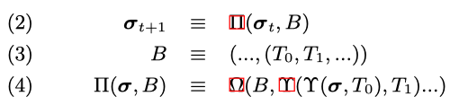

-  `Ω` 是区块定稿状态转换函数（这个函数奖励一个特定的账户）；
-  `B` 表示一个区块，包含一系列交易和一些其他组成部分；
-  `Π` 是区块级的状态转换函数。

这就是区块链范式的基础，这个模型不仅是以太坊的基础， 还是迄今为止所有基于共识的去中心化交易系统的基础。

### 2.1. 单位
为了激励网络中的计算，需要一种一致同意的转移价值方法。为了解决这个问题，以太坊设计了一种内置的货币——以太币（Ether），也就是我们所知的 `ETH`，有时也用古英语中的 `Ð` 表示。以太币最小的单位是 Wei（伟），所有货币值都以 Wei 的整数倍来记录。一个以太币等于 1018  Wei。以太币还有以下单位：

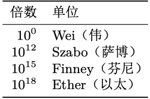

在当前状况下，任何在以太币的上下文中所使用的价值标示，比如货币、余额或者支付，都应以 Wei 为单位来计算。
### 2.2. 如何选择历史? 
因为这是一个去中心化的系统， 所有人都有机会在之前的某一个区块之后创建新的区块，这必然会形成一个区块树。为了能在这个区块树上从根节点-创世区块（the genesis block）到叶节点（包含最新交易的区块）形成一个一致的区块链，必须有一个共识方案。

如果各个节点所认为的从根节点到叶节点的路径（最佳区块链）不同，那么就会发生分叉。 这就意味着在一个给定的时间点，系统中会有多个状态共存：

- 一些节点相信一个区块包含权威的交易
- 其它节点则相信另外的区块包含权威的交易

其中就包含彻底不同或者不兼容的交易。必须要不惜一切代价避免这点，因为它会破坏整个系统信用。 我们使用了一个简易的 GHOST 协议版本来达成共识， 参见 Sompolinsky and Zohar [2013]。我们会在第 10 章中详细说明。

有时会从一个特定的区块链高度启用新的协议。本文描述了协议的一个版本，如果要跟踪历史区块链路径，可能需要查看这份文档的历史版本。
## 3. 约定(声明)
我们使用了大量的约定来表示公式中的符号，其中一些需要特别说明：

- 有两个高度结构化的顶层状态值
	- 用粗体小写希腊字母 `σ` 表示世界状态（world-state）；
	- 用 `µ` 表示机器状态 （machine-state）。

- 作用在高度结构化数据上的函数，使用大写的希腊字母， 例如：`Υ`，是以太坊中的状态转换函数。
- 对于大部分函数来说，通常用一个大写的字母表示，例 如：`C` 是总体费用函数。此外，可能会使用下角标表示一些特别的变量，例如：C SSTORE 是执行 SSTORE 操作的费用函数。
- 对于一些可能是外部定义的函数，可能会使用打印机文字字体，例如使用 `KEC` （一般指单纯的 `Keccak`）来表示 `Keccak-256` 哈希函数（这是由 Bertoni et al. [2017] 提出的，在 SHA-3 竞争中获胜的那种算法，而不是最新的版本）。也会用 `KEC512` 来表示 `Keccack-512` 哈希函数。
- 元组通常使用一个大写字母来表示，例如用 `T` 表示一个以太坊交易。也可以通过使用下标来表示其中的一个独立组成部分，例如用 T n 来表示交易的 nonce。下角标形式则用于表示它们的类型；例如：大写的下角标表示下角标所对 应的组成部分所构成的元组。
- 标量和固定大小的字节序列（或数组）都使用小写字母 来表示，例如 `n` 在本文中表示交易的 `nonce`。小写的希腊字母一般表示一些特别的含义，例如 `δ` 表示在栈上一个给定操作所需要的条目数量。
- 任意长度的序列通常用粗体小写字母表示，例如 `o` 表示消息调用中输出的字节序列数据。对于特别重要的值，可能会使用粗体大写字母。
- 我们认为标量都是正整数且属于集合 `N`。 
- 所有的字节序列属于集合 `B`，附录 `B` 给出了正式的定义。可以用下角标 表示这样的序列集合的限定长度，因此，长度为 32 的字节序列使用 B 32 表示，所有比 2 256 小的正整数使用 N 256 表 示。详细定义参见 4.3。
- 以全局状态 `σ` 为例，它表示一系列的账户（账户自身是元组），方括号被用来表示一个独立的账户。
- 当去考虑现有的变量时，我遵循在给定的范围内去定义的原则，如果我们使用占位符 `□` 表示未修改的“输入”值， 那么就可以使用 `□ ′` 来表示修改过的可用值，□\*、□\**&c` 表示中间值。在特殊情况下，为了提高可读性和清晰性，可能会使用字母-数字下角标表示中间值。
- 当使用已有的函数时，例如一个给定函数 `f`，函数 f\*表 示一个相似的、对集合中所有元素都生效的函数映射。正式定义参见 4.3。

以上，我定义了大量的函数。一个最常见的函数是 `ℓ`， 它 表示给定序列中的最后一个条目：

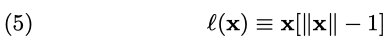

## 4. 区块、状态和交易
在介绍了以太坊的基本概念之后，我们将详细地讨论交易、区块和状态的含义。
### 4.1. 世界状态
世界状态（state）是在

- 地址（160 位的标识 符）
- 和账户状态（序列化为 RLP 的数据结构，详见附录 B） 

的映射。 

虽然世界状态没有直接储存在区块链上，但会假定在实施过程中会将这个映射维护在一个修改过的 `Merkle Patricia` 树上（即 trie，详见附录 D）。

这个 trie 需要一个简单的后端数据库去维护字节数组到字节数组的映射，我们称这个后端数据库为状态数据库。它有一系列的好处: 

- 第一， 这个结构的根节点是基于密码学依赖于所有内部数据的,它的哈希可以作为整个系统状态的一个安全标识；
- 第二，作为一个不变的数据结构，我们可以通过简单地改变根节点哈希来查找任何一个先前的状态（在根节点哈希已知的条件下）。

因为我们在区块链中储存了所以这样的根节点哈希值，所以我们可以很容易地恢复到特定的历史状态。 

账户状态 `σ[a]` 包含以下四个字段：

- `nonce`

	这个值等于由此账户地址发出的交易数量或者由这个账户所创建的合约数量（当这个账户有关联代码时）。 
	
	σ[a] n 
	
	即表示状态 `σ` 中的地址 `a` 的 nonce 值。 
- `balance`

	 σ[a] b 

	表示这个账户地址拥有多少 Wei（即账户余额，译者注）。 
- `storageRoot` 

	保存了账户的存储内容的 Merkle Patricia 树的根节点的 256 位哈希值，这个树中保存的是 256 位整数键值的 Keccak 256 位哈希值到 256 位整数值的 RLP 编码的映射。这个哈希定义 为 
	
	σ[a] s 。
- `codeHash`

	这个账户的 EVM 代码哈希值——当这个地址接收到一个消息调用时，这些代码会被执行； 它和其它字段不同，创建后不可更改。状态数据库中包含所有这样的代码片段哈希， 以便后续使用。 这个哈希可以定义为 
	
	σ[a] c
	
	然后我们用 `b` 来表示代码，则有 
	
	KEC(b) = σ[a] c 。

因为通常希望所指的并不是 Trie 的根哈希，而是其中所保存的键值对集合，所以我做了一个更方便的定义:

Trie 中的键值对集合函数 L \* i 被定义为适用于基础函数 L i 中所有元素的变换：

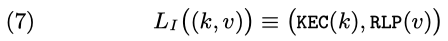

其中

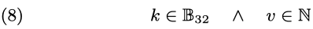

需要说明的是 σ[a] s 不应算作这个账户的“物理”成员,它不会参与之后的序列化。

如果 `codeHash` 字段是一个空字符串的 `Keccak-256` 哈希，也就是说 σ[a] c = KEC ( () ) ，那么这个节点则表示一个简单账户，有时简称为“非合约”账户。

因此我们可以定义一个世界状态函数 L S：

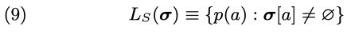

其中

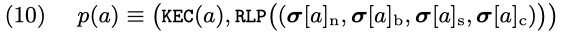

函数 L S 和 Trie 函数一起用来提供一个世界状态的简短标识（哈希）。我们假定

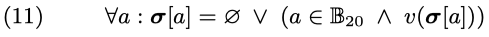

其中，v 是账户有效性验证函数

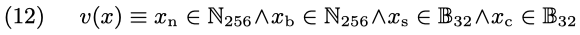

如果一个账户没有代码，它将是 empty（空的），且 `nonce` 和 `balance` 均为 0

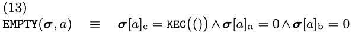

即使是所谓的预编译合约也可能处于 empty 状态。这是因为它们的账户状态并不总是包含可以表述它们的行为的代码。 

当一个账户的状态不存在或为 empty 时，就表示它 dead （死了）

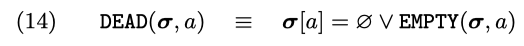

### 4.2. 交易
交易（符号，`T`）是个单一的加密学签名的指令， 通常由以太坊系统之外的操作者创建。 我们假设外部的操作者是人，而软件工具则用于构建和散播 1这个签名 。

- 交易有两种类型
	- 一种表现为消息调用
	- 另一种则通过代码创建新的账户（称为“合约创建”）。

两种交易类型一些共同的字段：

- `nonce`

	由交易发送者发出的的交易的数量，由 Tn 表示。 
- `gasPrice`

	为执行这个交易所需要进行的计算步骤消耗的每单位 gas 的价格，以 Wei 为单位，由 Tp 表 示。 
- `gasLimit` 

	用于执行这个交易的最大 gas 数量。这个值须在交易开始前设置，且设定后不能再增加，由 Tg 表示。 
- `to`

	160 位的消息调用接收者地址；
，用 ∅ 表示 B 0 的唯一成员。此字段由 T t 表示 
- `value`

	转移到接收者账户的 Wei 的数量；对于合约创建， 则代表给新建合约地址的初始捐款。 由 Tv  表示。 
- `v, r, s`

	与交易签名相符的若干数值，用于确定交易的发送者，由 Tw ，Tr 和 Ts 表示。
	
详见附录 F。

- 此外，合约创建还包含以下字段
	- `init`
	
		一个不限制大小的字节数组， 用来指定账户初始化程序的 EVM 代码，由 Ti 表示。 
		
		- `init` 执行后的返回结果 body，就是合约代码，这是这个账户每次接收到"消息"调用时会执行的代码（通过一个交易或者代码的内部执行）。
		- `init` 代码仅会在合约创建时被执行一次，然后就会被丢弃。 
- 与此相对，一个消息调用交易包括:
	- `data`
	
		一个不限制大小的字节数组，用来指定消息调用的输入数据，由  Td 表示。

	附录 F 详细描述了将交易映射到发送者的函数 S。这种映射通过 `SECP-256k1` 曲线的 ECDSA 算法实现，使用交易哈希（除去后 3 个签名字段）作为数据来进行签名。目前我们先简单地使用 `S(T)` 表示指定交易 `T` 的发送者。

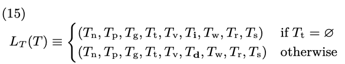

在这里，我们假设除了任意长度的字节数组 Ti 和 Td 以 外，所有变量都是作为整数来进行 RLP 编码的。

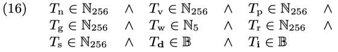

其中

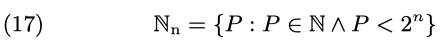

地址哈希 Tt稍微有些不同：它是一个 20 字节的地址哈希值或者当创建合约时（将等于 ` ∅`）是 RLP 空字节序列， 所以是 B 0 的成员：

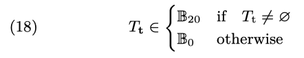

### 4.3. 区块
在以太坊中，区块是由以下部分组成的：

- 一些相关信息片段组成的集合（称为 block header， 即区块头）； 
	
	区块头包含的的信息如下：
	
	- `parentHash`
	
		父区块头的 Keccak 256 位哈希， 由 H p 表示。 
	- `ommersHash`
	
		当前区块的 ommers 列表的 Keccak 256 位哈希，由 H o表示。 
	- `beneficiary`
	
		成功挖到这个区块所得到的所有交易费的 160 位接收地址，由 H c 表示。 
	- `stateRoot`
	
		所有交易被执行完且区块定稿后的状态树（state trie）根节点的 Keccak 256 位哈希。 
	- `transactionsRoot`
	
		由当前区块中所包含的所有交易所组成的树结构（transaction trie）根节点的 Keccak 256 位哈希，由 H t 表示。 
	- `receiptsRoot`
	
		由当前区块中所有交易的收据所组成的树结构（receipt trie）根节点的 Keccak 256 位哈希。由 H e 表示。 
	- `logsBloom`
	
		由当前区块中所有交易的收据数据中的可索引信息（产生日志的地址和日志主题）组成的 Bloom 过滤器，由 H b 表示。 
	- `difficulty`
	
		当前区块难度水平值，它可以根据前一个区块的难度水平和时间戳计算得到，由 Hd  表示。 
	- `number`
	
		当前区块的祖先的数量（高度），由 H i 表示。创世区块的这个数量为 0。 
	- `gasLimit`
	
		目前每个区块的 gas 开支上限，由 H I 表 示。 
	- `gasUsed`
	
		当前区块的所有交易所用掉的 gas 之和， 由 H g 表示。 
	- `timestamp`
	
		当前区块初始化时的 Unix 时间戳，由 H s 表示。 
	- `extraData`
	
		与当前区块相关的任意字节数据，但必须在 32 字节以内，由 H x 表示。 
	- `mixHash`
	
		一个 256 位的哈希值，用来与 `nonce` 一 起证明当前区块已经承载了足够的计算量，由 H m  表示。 
	- `nonce`
		
		一个 64 位的值，用来与 `mixHash` 一起于证明当前区块已经承载了足够的计算量，由 H n 表示。
- 组成区块的交易 `T` 和 其它一些区块头` U` （这是一些父区块与当前区块的爷爷辈区块相同的区块， 这样的区块称为 ommers 2 ）。

	区块的另两个组成部分就是
	
	-  `ommer` 区块头（与以上格式相 同）列表 B U 
	- 本区块所有交易信息 B T 

	我们可以表示一个区块 B：

	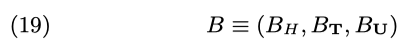

### 4.3.1. 交易收据
为了能使交易信息对零知识证明、索引和搜索都是有用的， 我们将每个交易执行过程中的一些特定信息编码为交易收据。我们以 B R [i] 表示第 i 个交易的收 据，并把收据信息保存在一个以索引为键的树（index-keyed trie）中，树的根节点用 H e 保存到区块头中。 

交易收据 R 是一个包含四个条目的元组：

- 包含交易收据的区块中当交易发生后的累积 gas 使用量 R u ；
- 交易过程中创建的日志集合 R I ；
- 由这些日志信息所构成的 Bloom 过滤器 R b
- 交易的状态代码 R z

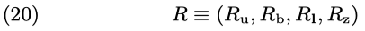

函数 L R 是将交易收据转换为 RLP 序列化字节数组的预处理函数：
	
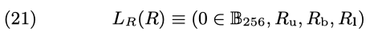
	
其中，0 ∈ B 256 代替了先前协议版本中的交易前状态根（the pre-transaction state root）。 我们要求状态代码 R z 是一个整数。
	
	
	
我们要求

- 累积的 gas 使用量 R u 是一个正整数
- 且日志 的 Bloom R b 是一个 2048 位（256 字节）数据的哈希：
	
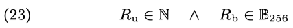

R 1是一系列的日志项 (O 0 , O 1 , ...)。

一个日志项 O 是一个记录了日志产生者的地址 O a ；一系列 32 字节的日志主 题 O t 和一些字节数据 O d 所组成的元组：

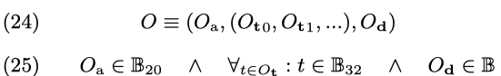

我们定义 Bloom 过滤器函数 M 将一个日志项精简为一个 256 字节哈希：

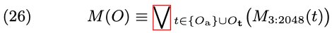

其中 M 3:2048 是一个特别的 Bloom 过滤器，它通过设置 2048 位中的 3 位数值来给定一个随机的字节序列。这是通过取得对一个字节序列中的前 3 对字节的 Keccak-256 哈希值的低位 11 位数据实现的 3 

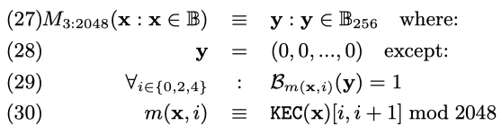
	
其中 B 是位引用函数， B j (x) 等于字节数组 x 中的索引 j（索引值从 0 开始）的位。

### 4.3.2. 整体有效性
当且仅当一个区块同时满足以下几个条件，我们才认为它是有效的：

- 它必须由内部一致的 ommer (叔区块) 
- 交易区块哈希值所组成,且基于起始状态 `σ`（由父区块的最终状态继承而来）
- 按顺序执行完成所有的给定交易 BT  （就像在 11 节所介绍的那样）

后所达到的标识符 H r 的一个新的状态

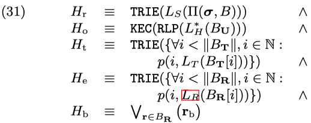
	
其中 `p(k, v)` 就是简单的 RLP 变换对，在这里，
	
- `k` 是交易在区块中的索引
- `v` 是交易收据
	
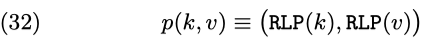
	
此外
	
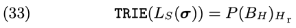
	
这样，`TRIE(L S (σ))` 是以状态 `σ` 和以 RLP 编码的值作为键值对数据的 Merkle Patricia 树根节点哈希，`P(B H )` 就 是父区块 B。

这些源于交易计算所产生的值，具体来讲就是交易收据 B R ，以及通过交易的状态累积函数所定义的 `Π`，会在 11.4 节详细说明。

### 4.3.3. 序列化
函数 L B 和 L H 分别是区块和区块头的预备函数。与交易收据预备函数 L R 非常相似，当需要进行 RLP 变换时，我们要求结构的类型和顺序如下：

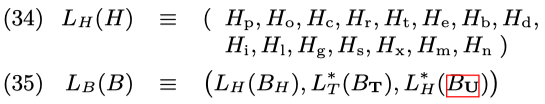

其中 L T 和 L H 是适用于所有元素的序列转换，因此

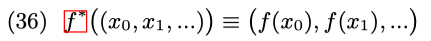

对所有函数 f 其组成要素的类型定义如下

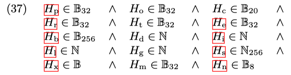

其中

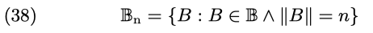

我们现在有了一个严格的区块结构构造说明。RLP 函数 RLP（见附录 B）提供了权威的方法来把这个结构转换为一个可以通过网络传输或在本地存储的字节序列。
### 4.3.4. 区块头验证. 
我们把 P(B H ) 定义为 B 的父区块

其区块号等于它的父区块号加 1

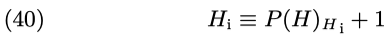

我们将一个区块头 H 的权威难度值定义为 D(H)：

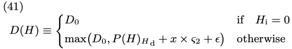

其中

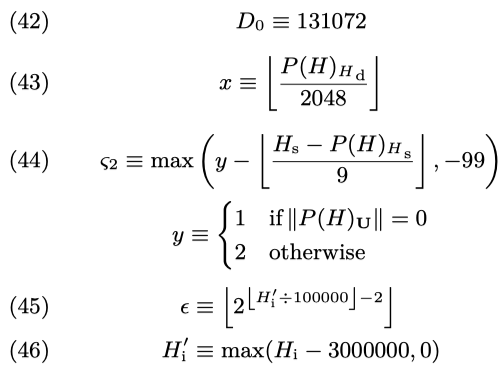

注意，D 0 是创世区块的难度值。就像下面介绍的那样， 

- Homestead 难度值参数 ς 2 被用来影响出块时间的动态平衡，它已经通过由 Buterin [2015] 提出的 EIP-2 实现了。在 Homestead 版本中，难度符号 `ϵ` 会越来越快地使难度值缓慢增长（每 10 万个区块），从而增加区块时间差别，也为向权益证明（proof-of-stake）的切换增加了时间压力。
- 这个效果就是所谓的“难度炸弹”（“difficulty bomb”）或“冰河时期”（“ice age”）在由 Schoedon and Buterin [2017] 提出的 EIP-649 中进行了解释，并用来推迟早先在 EIP-2 中的实现。 
- ς 2  也在 EIP-100 通过使用 x（即上面公式中的矫 正参数）和分母 9 进行了修改，用来达到由 Buterin [2016] 提出的对包含叔区块（uncle blocks）在内的平均出块时间的调整效果。
- 最终，在拜占庭版本中，伴随 EIP-649，我们通过伪造一个区块号 HI来延迟冰河时期的来临。这是通过实际区块号减去 300 万来获得的。换句话说，就是减少 `ϵ` 和区块间的时间间隔，来为权益证明的开发争取更多的时间并防止网络被“冻结”。 区块头 H 的 gas 限制 HI 需要满足下列条件：

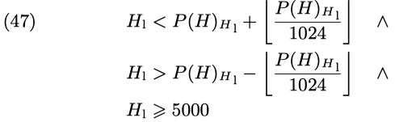

H s 是区块 H 的时间戳（以 Unix 的 time() 函数的形 式），需要满足下列条件:

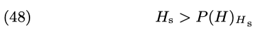

这个机制保证了区块时间的动态平衡；

- 如果最近的两个区块间隔较短，则会导致难度值增加，因此需要额外的计算量，大概率会延长下个区块的出块时间。
- 相反，如果最近的两个区块间隔过长， 难度值和下一个区块的预期出块时间也会减少。 

这里的 nonce H n 需满足下列关系：

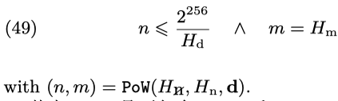

- 其中，H  n 是不包含 `nonce` 和 `mixHash` 的新区块的区块头 H；
- d 是当前的 DAG（即有向无环图， 是用来计算 `mixHash` 的一种大型数据集合）工作量证明函数 PoW（参 见 11.5）：这取决于一个数组的值，

- 数组的第一个元素

	是用来证明使用了一个正确的 DAG 的混合哈希（mix-hash）； 
- 数组的第二个元素

	是伪随机数，密码学依赖于 H 及 d。给定一个范围在 [0, 2 64 ) 的均匀分布，则求解时间和难度 Hd  是成比例变化的。 

这就是区块链的安全基础，也是一个恶意节点不能用其新创建的区块来覆盖（“重写”）历史数据的重要原因。因为这个随机数必须满足这些条件，且因为条件依赖于这个区块的内容和相关交易，创建新的合法的区块是困难且耗时的， 需要超过所有诚实矿工的算力总和。 这样，我们定义这个区块头的验证函数 V (H) 为：

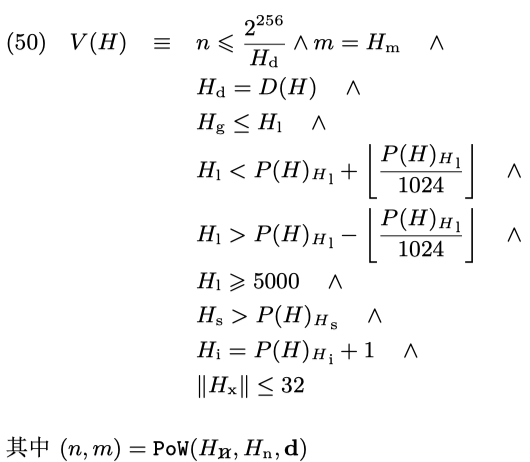

此外，`extraData` 最多 32 字节。

## 5. Gas 及其支付
为了避免网络滥用及回避由于图灵完整性而带来的一些不可避免的问题，在以太坊中所有的程序执行都需要费用。 各种操作费用以 gas（详见附录 G 中与不同计算相关的费 用说明）为单位计算。任意的程序片段，包括

- 合约创建
- 消息调用
- 分配资源
- 访问账户 storage
- 在虚拟机上执行操作等

都会有一个普遍认同的 gas 消耗。

每一个交易都要指定一个 gas 上限：`gasLimit`。 这些 gas 会从发送者的账户的 `balance` 中扣除。Gas 的购买是通过同样在交易中指定的 `gasPrice` 来完成的。如果这个账户的 `balance` 不能支持这样的购买，交易会被视为无效交易。之所以将其命名为 `gasLimit`，是因为剩余的 gas 会在交易完成后被返还（与购买时同样价格）到发送者账户。Gas 不会在交易执行之外存在，因此对于可信任的账户，可以设置一个相对较高的 gas 上限。

通常来说，以太币（Ether）是用来购买 gas 的，未返还的部分就会移交到 `beneficiary` 的地址（即一般由矿工所控制的一个账户地址）。交易者可以随意指定 `gasPrice`，然而矿工也可以任意地忽略某个交易。一个高 gas 价格的交易将花费发送者更多的以太币，也就将移交给矿工更多的以太币，因此这个交易自然会被更多的矿工选择打包进区块。通常来说，矿工会选择公告他们执行交易的最低 gas 价格，交易者们也就可以据此来提供一个具体的价格。因此，会有一 个（加权的）最低的可接受 gas 价格分布，交易者们则需要在降低 gas 价格和使交易能最快地被矿工打包间进行权衡。

## 6.交易执行
交易执行是以太坊协议中最复杂的部分：它定义了状态转换函数 Υ。我们假定任意交易在执行时前都要先通过初始的基础有效性测试。包含：

- (1) 交易是 RLP 格式数据，没有多余的后缀字节；
- (2) 交易的签名是有效的；
- (3) 交易的 nonce 是有效的（等于发送者账户当前的 nonce）；
- (4) gas 上限不小于交易所要使用的 gas g 0 ;
- (5) 发送者账户的 balance 应该不少于实际费用 v 0 ，且需要提前支付。

这样，我们可以定义状态转移函数 Υ，其中 T 表示交易， σ 表示状态：

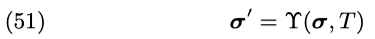

因此 `σ ′` 是交易后的状态。我们也定义 

- Υ g 为交易执行所消耗的 gas 数量；
- Υ I 为交易过程中累积产生的日志项；
- 以 及 Υz 为交易结果的状态代码。

这些都会在后文正式定义。

### 6.1. 子状态
交易的执行过程中会累积产生一些特定的信息，我们称为交易子状态，用  A 来表示，它是个元组：

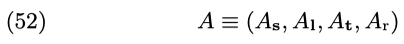

元组内容包括 

- 自毁集合 A s ：一组应该在交易完成后被删除的账户。
-  A1  是一系列的日志：这是一些列针对 VM 代码执行的归档的、可索引的‘检查点’，允许以太坊世界的外部旁观者（例如去中心化应用的前端）来简单地跟踪合约调用。 
-  A t 是交易所接触过的账户集合，其中的空账户可以在交易结束时删除。
-  最后是 A r ，也就是应该返还的余额；当 使用 SSTORE 指令将非 0 的合约 storage 重置为 0 时，这个余额会增加。虽然不是立即返还的余额，但可以部分抵消整体执行费用。

我们定义空的子状态 A 0 ，它没有自毁、没有日志、没有接触过的账户且返还余额为 0

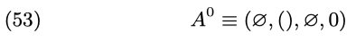

### 6.2. 执行.
我们定义固有的 gas 消耗 g0 ，它是需要在交易执行前支付的 gas 数量

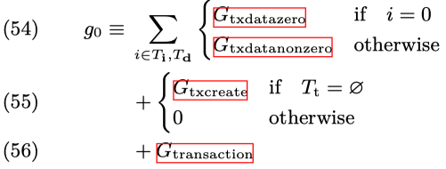

其中，T i ，T d 是交易附带的关联数据的字节序列和 EVM 初始化代码的字节序列， 具体取决于交易是合约创建还是消息调用。

- 如果这个交易是合约创建，则会增加 G  txcreate  
- 否则不增加

G 的完整定义参见附录 G。

预支付的费用 v 0计算如下

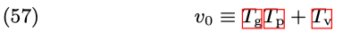

我们通过下列条件检查有效性：

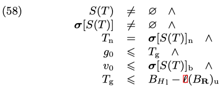

注意最后的条件: 交易的 gas 上限 T g 和由 ℓ(BR ) u 所给定的这个区块先前已经使用的 gas 数量之和，不可以超过当前区块的 gasLimit B H l 。

有效交易的执行起始于一个对状态不能撤回的改变：

- 发送者账户的 `nonce`，即 `S(T)` 的 `nonce` 会加 1
- 并且从账户余额扣减预付费用 TgTp 。(进行实际计算的可用 gas g 被定 义为 T g− g 0 )

无论是合约创建还是消息调用，计算都会产生一个最终状态（可能等于当前的状态），这种改变是确定的且从来不会无效：这样来看，其实并不存在无效的交易。

我们定义检查点状态` σ 0` ：

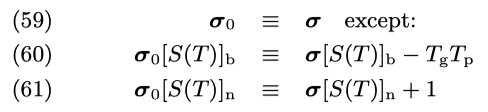

从 `σ 0` 到 `σ P `的计算依赖于交易的类型。不管它是合约创建还是消息调用，我们都可以定义这样的元组，包含

- 执行后的临时状态 `σ P` 
- 剩余的 gas g ′ 
- 子状态 A 
- 状态代码 z：

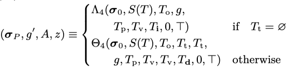

其中 g 是扣除掉合约存在所需要的基本 gas 数量之后的剩余 gas 数量：

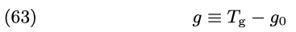

T o 是交易的原始发起人，当一个消息调用或合约创建不是由交易所触发，而是来自于 EVM 代码的运行所触发时，这个原始发起人会与发送者不同（即在这种情况下，To 会与 S(T) 不同，校订注）。

注意，我们使用 Θ 4 和 Λ4 来表示只取用那组函数中的前 4 个函数的值，这最终表现为消息调用的输出（一个字节数组），且这个最终结果不会在交易计算的上下文中使用。

在消息调用或合约创建被处理之后，在此过程中自毁的账户的返还余额计数也已经增加完成了。

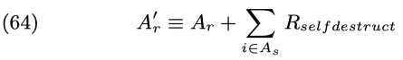

然后，就可以用剩余的 gas g ′ 加上基于返还计数的补贴来按照原始比率确定返还给发送者的 gas 数量 g /* 了。

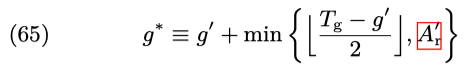

总共可返还的数量，是合法的剩余 gas g ′ 加上 Ar 与总 消耗量 Tg− g ′ 的一半进行四舍五入后的结果中较小的那个 值。所以 g ∗ 就是交易执行后的总剩余 gas。

交易花费的 gas 所对应的以太币会支付给矿工，它们的地址是由当前区块 B 的 beneficiary 所指定的。

所以我们基于临时状态 `σ P` 来定义预备最终状态 `σ ∗` ：

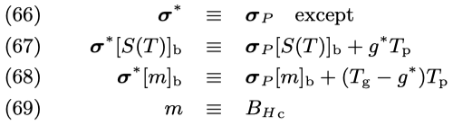

在删除了所有出现在自毁列表中的账户或被接触过的空账户之后，即可达到最终状态` σ ′` ：

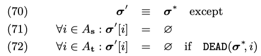

最后，我们定义这个交易中总共使用的 gas Υ g 、这个交 易中创建的日志 Υ I和这个交易的状态代码 Υ z

这些用来帮助我们定义交易收据， 并且也将用在后续的状态和 nonce 校验中。

## 7. 合约创建
创建一个合约账户需要很多固有参数：

- 发送者（s）
- 原始交易人（o）
- 可用的 gas（g）
- gas 价格（p）
- endowment（v， 即初始捐款）
- 任意长度的字节数组（i），即 EVM 初始化代码
-  消息调用/合约创建的当前栈深度（e）
-  对状态进行修改的许可（w）

我们定义创建函数为函数 `Λ`，它将使用上述参数和状态 `σ` 一起来计算出一个新的元组。就像第 6 节所介绍的那样，这个新的元组包含

- 新的状态
- 剩余的 gas
- 交易子状态
- 以及一个错误消息 `(σ ′ , g ′ , A, o)`：

新账户的地址是一个哈希值的最右边 160 位，这个哈希值是由一个仅包含发送者地址和其账户 nonce 的结构进行 RLP 编码之后再进行 Keccak 哈希计算所得到的。我们可以定义由此得来的新帐户的地址 a：

其中

- KEC 是 Keccak 256 哈希函数
- RLP 是 RLP 编码函数
- B a..b (X) 表示取二进制数据 X 的位数范围 [a, b] 的值
- σ[x] 则是地址 x 的状态，或者 ∅ 表示什么都不存在。

注意， 我们使用的是一个比发送者 nonce 要小的值（减了 1）；因为我们认定已经在这个调用之前对发送者的 nonce 加了 1，因此所用的值是发送者在该交易或 VM 操作开始时 的 nonce。

- 发送者账户的 nonce 被初始定义为 1
- balance 为交易传入的值
- storage 为空
- codeHash 为空字符串的 Keccak 256 位哈希值
- 发送者的 balance 会减去转账值。

于是这个变化的 状态就成为 σ \*

其中 v ′ 是账户在交易之前就有的余额，对应于它先前就已经存在的情况：

最终，合约账户是根据执行模型（参见第 9 章）通过执行账户初始化的 EVM 代码 i 来初始化的。代码的执行可以产生 一些内部执行状态以外的事件，包括：

- 更改账户的 storage
- 创建更多的账户
- 以及进行更多的消息调用。

用代码执行函 数 `Ξ` 可以得到一个元组，包括

- 结果状态 σ \**
- 可用的剩余 gas g \**
- 累积的子状态 A 
- 账户的代码 o。

其中 I 包含了执行环境的相关参数

由于这个调用没有任何输入数据，I d 为空的元组。I  H 则没有特别之处，由区块链所决定。

代码执行会消耗 gas， 且 gas 不能低于 0， 因此执行可能会在自然停止之前结束。在这个（以及其它几个）异常情况，我们称之为发生了 gas 不足（out-of-gas，OOG）异常： 计算后的状态将由空集合 ∅ 表示，整个创建操作将不会影响状态，就像刚开始尝试创建时那样。

如果这个初始化代码成功地执行完，那么对应的合约创建费用也会支付。这个代码保存费用 c 与创建出来的合约代码大小成正比：

如果没有足够的剩余 gas 来支付这个费用，也就是说如果 g \**< c，就会产生 gas 不足异常。

发生这样的异常后，剩余 gas 将变为 0。也就是说，如果合约创建是作为对交易的接受来处理的， 那么它就不会影响合约创建的固有费用的支付，就是肯定会支付。然而，当 gas 不足时，交易中附带的金额并不会转移到被取消的合约地址。

如果没有出现这样的异常，那么剩余的 gas 会返还给最原始的交易发起人，对状态的改变也将永久保存。这样，我们可以指定结果状态、gas、子状态和状态代码为 `(σ ′ , g ′ , A, z)`：

对于确定 `σ ′` 的例外， 由初始化代码的执行结果字节序列 o 所决定，它就是新创建账户的最终代码。 注意， 这是意图达到这样的结果：

- 要么带着初始捐款 （endowment）成功创建合约；
- 要么不会创建任何合约且不会进行转账。

### 7.1. 细微之处.
注意，在初始化代码执行过程中，一个新创建的地址会出现，但还没有内部的代码 4 。因此在这段时间内，任何消息调用都不会引发代码执行。如果这个初始化执行结束于一个 SELFDESTRUCT 指令，那么这个账户会在交易完成前被删除，这种情况是否合理已在讨论中。对于一个正常的 STOP 指令代码或者返回的代码是空的，这时候会出现一个僵尸账户， 而且账户中剩余的余额将被永远地锁定在这个僵尸账户中。
## 8. 消息调用
当执行消息调用时需要多个参数：

- 发送者（s）
- 交易发起人（o）
- 接收者（r）
- 执行代码的账户（c，通常与接收者相同）
- 可用的 gas（g）
- 转账金额（v）
- gas 价格（p）
-  函数调用的输入数据（一个任意长度的字节数组 d）
-  消息调用/合约创建的当前栈深度（e）
-  对状态修改的许可 （w）

除了可以获得新的状态和交易子状态以外，消息调用还有一个额外的元素——由字节数组 `o` 表示的输出数据。执行交易时输出数据是被忽略的，但消息调用可以由 VM 代码执行所产生，在这种情况下就将使用这些信息。

注意，对于 `DELEGATECALL` 指令，我们需要区分转账金额 `v` 和执行上下文中出现的 `˜v`。 我们定义 σ 1 为第一个交易状态，它是在原始状态的基础上加入由发送者向接收者的转账金额后的状态

除非 s = r。

按照先前的论述（我们假设如果 σ 1 [r] 还未定义），则这会创建一个没有代码或状态且 `balance` 和 `nonce` 都为 0 的 账户。因此上一个公式可以替换为：

账户关联的代码（由 Keccak 哈希为 σ[c] c 的代码片段0所标识）会依照执行模型（参见第 9 章）来执行。就像合约创建一样，如果执行因为一个异常（也就是说：因为 gas 供给不足、堆栈溢出、无效的跳转目标或者无效的指令）而停止，gas 不会被返还给调用者，并且状态也会立即恢复到转账之前的状态（也就是 σ） 。

其中

我们假设客户端会保存键值对数据 (KEC(I b ), I b )，来在某些情况下使获得 I b 成为可能。

如我们所见，在消息调用的通用执行框架 `Ξ` 中有 8 个特例：这是 8 个所谓的‘预编译’合约，它们作为最初架构中的一部分，后续可能会变成原生扩展。在地址 1 到 8 上 存在的这 8 个合约，分别是

- 椭圆曲线公钥恢复函数
- SHA2 256 位哈希方案
- RIPEMD 160 位哈希方案
- 标识函数
- 任意精度的模幂运算
- 椭圆曲线加法
- 椭圆曲线纯量乘法
- 椭圆曲线配对检查。

它们的完整定义参见附录 E

## 9. 执行模型
执行模型说明了如何使用一系列的字节代码指令和一个环境数据的元组去更改系统状态。这是通过一个正规的虚拟状态机来实现的，也就是以太坊虚拟机（Ethereum Virtual Machine - EVM）。它是一个准图灵机，这个“准”的限定来源于其中的运算是通过参数 gas 来限制的，也就是限定了可以执行的运算总量。
### 9.1. 基础
EVM 是一个简单的基于栈的架构。 

- 其中字 （Word）的大小（也就是栈中数据项的大小）是 256 位。这是为了便于执行 Keccak-256 位哈希和椭圆曲线计算。
- 其内存（memory）模型是简单地基于字寻址（word-addressed） 的字节数组。
- 栈的最大深度为 1024。
- EVM 也有一个独立的存储（storage）模型；它类似于内存的概念，但并不是一个字节数组，而是一个基于字寻址（word-addressable）的字数组（word array）。与不稳定的内存不同，存储是相对稳定的且作为系统状态的一部分被维护。 所有内存和存储中的数据都会初始化为 0。 

EVM 不是标准的冯诺依曼结构。 程序代码被保存在一个独立的、仅能通过特定的指令进行交互的虚拟 ROM（即只读存储器，校订注）中，而不是保存在一般的可访问内存或存储中。 EVM 存在异常执行的情况，包括堆栈溢出和非法指令。 在发生像 out-of-gas 这样的异常时，EVM 并不会使状态保持原样，而是会立即停止执行，并告知执行代理（交易的处理程序或递归的执行环境），由代理来独立处理这些异常。

### 9.2. 费用概述
在三个不同的情况下会收取执行费用（以 gas 来结算），这三种情况都是执行操作的先决条件。

- 第一种情况

	也是最普遍的情况就是计算操作费用（详见附录 G）。
- 第二种情况

	执行一个低级别的消息调用或者合约创建可能需要扣除 gas， 这也就是执行 CREATE，CALL 和 CALLCODE 的费用的一部分。
- 第三种情况
	- 内存
	
		内存使用的增加也会消耗一定的 gas。对于一个账户的执行，内存的总费用和其所有内存索引 （无论是读还是写）的范围成正比；这个内存范围是 32 字节的最小倍数。 这是实时（just-in-time）结算的；也就是说，任何对超出先前已索引的内存区域的访问，都会实时地结算为额外的内存使用费。由于这个费用，内存地址大概不会超过 32 位的界限，但 EVM 的实现必须能够管理这种可能性（就是说，虽然如果内存地址超过 32 位，即大于 2 32 ， 会产生很高的内存使用费，但 EVM 的实现还是应该支持这种可能性；校订注）。 
	- 存储

		存储费用则有一个细微差别的行为——激励存储的最小化使用（这直接反映在所有节点中更大的状态数据库里）。 清除一个存储中的记录项的执行费用不仅被免除了， 而且还会返还；实际上，这种费用返还（退款）是预先发生的， 因为首次使用存储位置的费用比正常使用高出很多。 EVM gas 消耗的严格定义,参见附录 H。

### 9.3. 执行环境.
作为系统状态 `σ` 和计算中剩余的 gas g 的补充， 还有一些执行代理必须提供的有关执行环境的重要信息，它们包含在元组 I 中：

-  I a 

	拥有正在执行的代码的账户地址
-  I o 

	触发这次执行的初始交易的发送者地址
-  I p 

	触发这次执行的初始交易的 gas 价格
-  I d  

	这次执行的输入数据字节数组；如果执行代理是一个交易，这就是交易数据。
-  I s 

	触发这次执行的账户地址；如果执行代理是一个交易，则为交易发送者地址。
-  I v

	作为这次执行的一部分传到当前账户的转账金额，以 Wei 为单位；如果执行代理是一个交易, 这就是交易的转账金额。
-  I b 

	所要执行的机器代码字节数组。
-  I H 

	当前区块的区块头。
- I e 

	当前消息调用或合约创建的深度（也就是当前已经被执行的 CALL 或 CREATE 的数量）。
- I w

	修改状态的许可。
	
执行模型定义了函数 `Ξ`， EVM 执行模型可以用来计算范围包括

- 结果状态 `σ ′` 
- 剩余的 gas `g ′` 
- 累积的子状态 A 
- 结果输出 `o`

根据当前的上下文，我们可以把它定义为：

这里，我们应该还记得这个累积的子状态 A 是由

- 自毁集合 s
- 日志集 l
- 接触过的账户 t 
- 返还金额 r 

所组成的元组：

## 9.4. 执行概述.
我们现在必须来定义 `Ξ` 函数了。在大多数可行的实现方案中，都应该对完整的系统状态 `σ` 和机器状 态 `µ` 一起进行迭代建模。我们定义一个递归函数 `X`，它使用了

- 一个迭代函数 `O`（定义状态机中单次循环的结果）
- 与一个用来确定当前机器状态是否是一个异常停止状态的函数 Z 
- 和一个当且仅当当前机器状态是正常停止状态时用来指定指令的输出数据的函数 H。 

由 () 表示的空序列并不等于由 `∅` 表示的空集合，这对 于解释 `H` 的输出非常重要；当 `H` 的输出是 `∅` 时需要继续执行，而当其为空序列时则应该停止执行。

注意，在推导 `Ξ` 时，我们去掉了第 4 个元素 I ′ 并从机器状态的结果 µ ′ 中提取了剩余的 gas µ g ′ 。

X 是被循环调用的（这里是递归，但是在实现方案中通常是去执行一个简单的迭代循环）直到 Z 变为 true，表示当前状态有异常，必须停止执行，并且所有的改动都会被舍弃；或者直到 H 变为一个序列（不是空集合），表示机器达到了正常控制的停止状态。

### 9.4.1. 机器状态.
机器状态 µ 是由一个元组 (g, pc, m, i, s) 所定义的，其中包括

- 可用的 gas g
- 程序计数器 pc ∈ N 256
- 内存的内容 m
- 内存中激活的字数（从 0 开始的连续计数） i
- 以及栈的内容 s

内存的内容 µ m 是大小为 2 256 的全 0 序列。 为了提高可读性，应该使用大写字母简写（例如 ADD） 的指令助记符来推演数字等式。 完整的指令列表和它们的 定义参见附录 H。 为了定义 Z、H 和 O，我们将当前要执行的操作定义为 w：

我们也假定从栈中移除和添加的条目的固定数量为 δ 和 α， 它们都可以作为具体指令的下标；并且指令费用函数 C 可以算出给定指令的全部费用（以 gas 为单位）。

### 9.4.2. 异常停止.
异常停止函数 Z 定义如下

以下情况都会使执行进入异常停止状态：

- gas 不足
- 无效的指令（指令的下标 δ 未定义）
- 栈中的条目不足
- 指令 JUMP/JUMPI 的目标无效
- 新栈的大小超过 1024 
- 或者在一个静态调用中去尝试修改状态

聪明的读者会意识到，这表明没有任何一个指令可以通过它的执行直接触发异常停止。

### 9.4.3. 跳转地址验证
我们先前使用 D 函数来判断正在运行的代码所给定的有效跳转地址集合。我们以 JUMPDEST 指令所使用的位置来定义它。 

所有这些跳转位置都必须在有效的指令块内，而不可以是 PUSH 操作的数据中的位置；并且这些跳转位置还必须在明确定义的代码中（而不是使用隐式定义的 STOP 指令所跟踪到的位置） 

这样：

这里的 N 是下一个有效指令在代码中的位置，且忽略了 PUSH 指令的数据（如果有的话）：

### 9.4.4. 正常停止.
正常停止函数 H 定义如下

会返回数据的停止操作 RETURN 和 REVERT 有一个特殊的函数 H RETURN 。同时也请注意在这里讨论过的，关于空序列和空集合的差别。
### 9.5. 执行循环
栈中的条目是在序列的最左侧以低位索引的方式添加或移除的，所有其它条目都不会变动：

其中，gas 会根据具体指令的 gas 消耗相应扣除，且除了下面的三个特例以外，对于大多数指令而言，每次循环， 程序计数器都会自动增加；这里我们假定一个函数 J，其下标是下边两个指令之一，可以算出相应的值

在一般情况下，我们假定内存、自毁集合和系统状态不会改变：

然而， 具体的指令通常会改变这些值中的一个或几个。附录 H 中列出了指令会更改的元素以及入栈数 α、出栈数 δ 和对 gas 需求的正式描述。
## 10. 区块树到区块链
权威的区块链是在整个的区块树中从根节点到叶子节点的路径。为了形成路径共识，概念上我们选择具有最大的计算量的或者说是最长的路径来识别它。帮助我们识别最长路径的一个明显事实就是叶子节点的区块数量(高度)， 等于在路径中除了没有挖矿的创世区块以外的区块数量。路径越长到达叶子节点的总体挖矿工作量就越大。 这和已有的比特币及其衍生协议类似。 

因为区块头中已经包含了难度值，所以仅通过区块头就能验证已经完成的计算量。 

区块链中的任意一个区块都对总计算量或一个链的总难度有所贡献。 由此我们递归地定义区块 B 的总难度：

对于给定区块 B，B t 是它的总难度，B ′ 是其父区块，Bd  则是它自己的难度。
## 11. 区块定稿
区块定稿的过程包含 4 个步骤：

- (1) 验证（或在挖矿中，确定）ommer；
- (2) 验证（或在挖矿中，确定）交易；
- (3) 发放奖励；
- (4) 校验（或在挖矿中，计算有效的）状态和区块 nonce。

### 11.1. Ommer 验证.
- 验证 ommer 头也就是验证每个 ommer 头即是有效的区块头
- 另一个关联条件是它必须是当前区块 N 代以内的 ommer，N ≤ 6，也就是最近6个高度范围内，超过作废。
- 一个区块最多有两 个 ommer 头。

这样：

其中 k 表示“是亲属”（“is-kin”）：

s 表示“是兄妹”（“is-sibling”）：

其中，B(H) 和 P(H) 分别表示区块头 H 所对应的区块和其父区块。

### 11.2. 交易验证.
给定的 `gasUsed` 必须与列入的交易如实地相符：

- 区块中的 gas 总使用量 B H g ，必须与区块中最后一个交易执行后的累积 gas 使用量相等：

	
	
### 11.3. 奖励发放.
区块奖励的发放，包含了
	
- 对当前区块

	我们给当前区块的 beneficiary 账户增加 R block；
- 和每 个 ommer 区块的 beneficiary 地址(矿工挖矿地址)中账户 balance 的增加。 

	对于每个 ommer 区块，我们额外给出 32分之1 的区块奖励，每个被当前区块确认的 ommer 会根据区块号会给对用 ommer 矿工的 beneficiary 奖励。

这样，我们定义函 数 Ω：

如果 ommer 和当前区块的 beneficiary 地址有重合（即： 两个 ommer 有相同的 beneficiary 地址或者某一个 ommer 的 beneficiary 地址与当前区块相同），额外奖励将会累积发放。

我们定义区块奖励为 3 以太币

### 11.4. 状态和 nonce 验证.
现在我们可以定义函数 Γ 了， 它区块 B 映射到其初始状态：

这里，TRIE(L S (σ i )) 指由状态 σ  i 所构成的 trie 的根节点哈希；我们假定客户端实现会把这个数据保存在状态数据库中，因为这个 trie 是个不可变的数据结构，所以这是简单有效。

最后我们定义区块变换函数 Φ，它将一个不完整的区块 B 映射到一个完整区块 B ′ ：

其中 d 是一个在附录 J 中定义的数据集。 就像本文先前定义的那样，Π 是状态转换函数，它概念上是由区块定稿函数 Ω 和交易计算函数 Υ 来定义的。

像先前详细介绍过的那样，R[n] z 、R[n] l 和 R[n] u 是第 n 个交易的状态代码、日志和累积 gas 消耗（元组中的第 4 个元素 R[n] b 已经在日志的概念中被定义了）。我们也定义 第 n 个状态 σ[n]， 我们可以简单地把它定义为基于先前的 交易结果状态（或者对于区块中的第一个交易来说，就是区 块的初始状态）来执行当前交易所产生的结果状态：

在 B R [n] u 中，我们使用类似的方法来定义每个交易中加算了前一个交易的 gas 用量（当它是区块中的第一个交 易时，则为 0）后的累积用量：

对于 R[n] 1 ，我们使用先前在交易执行函数中定义的 Υ1。

我们用类似的方式定义 R[n] z

最后，我们定义 Π 为将给定的区块奖励 Ω 发放到最后一个交易的结果状态 ℓ(σ) 之上的新状态：

至此，完整的区块转换机制就定义好了。除了工作量证 明（Proof-of-Work）函数 PoW 以外。
### 11.5. 挖矿工作量证明.
挖矿工作量证明（PoW）通过一个密码学安全的 nonce 来证明为了获得一些象征性的值 n，已经付出了一定量的计算。我们使用它并通过特定意义的难度（且可以扩展为总体难度）以及对难度的可信度认知来确保区块链的安全。然而，因为挖出新的区块会得到其附带的奖励， 所以工作量证明不仅是在未来使区块链的权威的获得保障的安全信任方法，同时也是一个利益分配机制。 出于以上原因，工作量证明函数有两个重要的目标：

- 首先，它应该尽可能的被更多人去接受。对特别定制的硬件的需求或由这种硬件所提供的回报应该被减到最小。这使得分配模型尽可能开放， 从而使世界各地的人们都可以以大 致相同的比例，通过电力消耗获得以太币。 
- 第二，应该不允许获得超线性的收益，尤其是在有一个很高的初始障碍条件下。否则，一个资金充足的恶意者可以获得引起麻烦的网络挖矿算力， 并允许他们获得超线性的回报（按他们的意愿改变收益分布），这也就会弱化网络的安全性。 

比特币世界中一个灾难是 ASIC。 有一些计算硬件仅仅是为了做一个简单的任务而存在（Smith [1997]）。在比特币中， 这个任务就是 SHA256 哈希函数（Courtois et al.[2014]）。当 ASIC 们为了工作量证明函数而存在时，所有的目标都会变得危险。因此，一个可抵抗 ASIC 的工作量证明函数（也就是难以在专用硬件上执行或者在专用硬件执行时并不划算）就可以作为谚语中的银弹。

ASIC 抗性的设计有两个方向：

- 第一是去让它成为内存困难（memory-hard）的问题所产生结果，即设计一个需要大量的内存和带宽，来使这些内存不能被用于并行地计算 nonce。 
- 第二个方向是让计算变得更有通用目的（general-purpose）；一个为通用目的“定制的硬件”的意思，就是使得类似于普通的桌面计算机这样的硬件可以适合这种计算。 

在以太坊 1.0 中，我们选择了第一个方向。

更正式地，工作量证明函数可以用 PoW 表示：

- 其中 H n 是新区块的头，但不包含 nonce 和 mixHash； 
- H n 是区块头的 nonce；
- d 是一个计算 mixHash 所需要的 大数据集合；
- H d 是新区块的难度值（也就是第 10 章中的 区块难度）

PoW 是工作量证明函数，可以得到一个数组，其中

- 第一个元素是 mixHash
- 第二个元素是密码学依赖于 H 和 d 的伪随机数。

这个基础算法称为 Ethash，将在下文介绍。

### 11.5.1. Ethash
Ethash 是以太坊 1.0 的 PoW 算法。 它是 Dagger-Hashimoto 的最新版本，由 Buterin [2013b] 和 Dryja [2014] 提出。因为原始算法中的很多特性都在 2015 年 2 月到 5 月 4 日的研发（Jentzsch [2015]）中被修改了， 所以再这么称呼它其实已经不太合适。 这个算法的大体路线如下： 

- 我们通过扫描区块头直到某点，来为每个区块计算得到一个种子。
- 根据种子我们可以得到一个初始大小为 J cacheinit  字节的伪随机 cache。
	- 轻客户端保存这个 cache。
- 根据 cache 我们可以生成一个初始大小为 J datasetinit 字节的数据集， 数据集中的每个条目仅依赖于 cache 中的一小部分条目。
	- 全节点客户端和矿工保存整个数据集。 
	- 数据集会随时间线性增长。 
- 挖矿则是在数据集中选取随机的部分并将他们一起哈希。

	可以根据 cache 仅生成验证所需的部分，这样就可以使用少量内存完整验证，所以对于验证来讲，仅需要保存 cache 即可。

而大数据集则每 J epoch 个区块更新一次，所以大多数矿工的工作都只是读取这个数据集，而不是改变它。以上提及的参数和算法的详细解释参见附录 J。

## 12. 实践合约
有一些特别有用的合约模式；我们会讨论其中两个
### 12.1  数据供给
一个数据供给合约提供简单的服务：它允许外部的信息进入以太坊系统内。 以太坊系统不会保证这个信息的精确度和及时性，这是二级合约作者（使用数据供给的合约）的任务，他们需要决定对于单次数据供给服务给予多少信任。 通常的模式会包含一个以太坊内的合约，当给定一个消息调用时，可以回应一些由外部服务提供的信息。

一个例子可以是纽约当地的温度。这将会作为一个合约来实现，并返回保存在存储中的一些值。当然，存储中的这些值比如温度需要正确地维护， 然后这个模式的第二部分就是用一个外部的服务器来运行以太坊节点，找到一个新区块，创建一个合法的交易发送到合约，然后更新存储中的值。合约代码应该仅接受带有这个服务器的标识的数据更新。
### 12.2. 随机数.
在这样一个严格确定性的系统中提供随机的数字，显然是一个不可能实现的任务。然而我们可以利用在交易时还不可知的数据来生成伪随机数。 比如区块的哈希值、区块的时间戳、区块的 beneficiary 地址。为了使恶意矿工难以控制这些数值，建议使用 BLOCKHASH 操作获得最近 256 个区块的哈希值作为伪随机数。如果要获得多个这样的数值，可以去加上一些固定的数值并对结果做哈希。

## 13. 未来方向
未来，状态数据库将不再被强制要求维护所有之前的 trie 结构。只需要树中节点的一定时间内的数据，并最终丢弃那些不够新的且不是检查点的节点数据。检查点或数据库中的一个节点集合可以允许对特定的区块状态树的遍历， 它们可以用来为在区块链中取回任意状态数据所需的最大计算步骤提供一个上限。

区块链合并可以用来减少作为全节点或挖矿节点客户端需要下载的区块数量。某一个时点（也许每 10000 个区块） 的区块树结构的压缩存档可以在节点网络中维护， 它们可以高效地重塑创世区块。 可以通过下载这样的单个归档文件加上一些强制数量的区块来减少总体下载量。

最终，或许可以实施区块链压缩：在一定数量的区块中没有进行任何发送/接收交易的状态树节点可以被丢弃，以此来降低以太币的泄露（Ether-leakage）并减小状态数据库的增长。
### 13.1. 可扩展性
可扩展性仍然是一个永恒的顾虑。对于一个概括性的状态转换函数， 切分和并行化交易将难以使用分而治之的策略。仍未解决的是，系统的动态价值范围大体上是固定，且由于平均交易价值的增加，那些低价值的交易变得可以忽略， 从经济角度变得没有必要再包含进主账本中。然而，已经有一些潜在的策略可以用来开发更具可扩展性的协议。 一些形式的层次结构或许可以实现并行化地交易组合和区块构建，比如通过合并小的轻量的链到主区块、或者通过增量式地组合或粘连（通过工作量证明）小的交易集合来构建主区块。 并行化也可以通过在一组有优先顺序的并行区块链中，将重复或无效的交易从合并的区块中剔除来实现。 最后，如果可验证的计算能达到足够通用且有效，那么这也许可以提供一种允许将工作量证明作为最终状态的验证的方法。

## 14. 结论
我们已经介绍、讨论并正式定义了以太坊的协议。通过这个协议， 读者可以在以太坊网络上实现一个节点并加入大家， 成为一个去中心化的安全的社会化操作系统中的一员。合约可以被创作出来，在算法上指定并自主化地执行交互规则。

## 注释
- 第3页-1

	特别是，这样的“工具”最终将会从基于人类行为的初始化中剥离——或者人类可能变成中立状态——当到达某个临界点时，这种工具可能会被看作一种自治的代理。例如，合约可以向那些发送交易来启动它们的人们提供奖金。
	
- 第4页-2

	ommer 的意思和自然界中的“父母的兄弟姐妹”最相近，参见 https://nonbinary.miraheze.org/wiki/Gender_neutral_language#Aunt.2FUncle
- 第4页-3

	11 位 2 进制数值 = 2 2048 ，其低位的 11 位数值也就是对操作数进行模 2048 的运算结果，这就是“取得对一个字节序列中的前 3 对字节的 Keccak-256 哈希值的低位 11 位数据”的情况。	
- 第8页-4

	在初始化代码的执行过程中，当前地址上的 EXTCODESIZE 也就是账户代码的长度应该返回 0。而 CODESIZE 则应该返回初始化代码的长度。（就像H.2中 定义的那样。）
- 第13页

	附录 A. 术语

	外部参与者：能够连接到以太坊节点但在以太坊世界之外的个人或其他实体。 它可以通过存放已签名的交易并检查区块链和关联状态来与以太坊进行交互。 拥有一个（或多个）固有账户。	

	
## 附录 A
- Pierre Arnaud, Mathieu Schroeter, and Sam Le Barbare. 金银, 2017. URL https://www.npmjs.com/package/electrum. 
- Jacob Aron. 比特币软件找到了新的生命. New Scientist, 213(2847):20, 2012. URL http://www.sciencedirect.com/science/article/ pii/S0262407912601055. 
- Adam Back. Hashcash - 可摊销的公共审计成本函数 2002. URL http://www.hashcash. org/papers/amortizable.pdf. 
- Guido Bertoni, Joan Daemen, Michaël Peeters, Gilles Van Assche, and Ronny Van Keer. KECCAK, 2017. URL https://keccak.team/keccak.html. 
- Roman Boutellier and Mareike Heinzen. 海盗、先驱、创新者和模仿者。 在创新中成长, pages 85–96. Springer, 2014. URL https: //www.springer.com/gb/book/9783319040158. 
- Vitalik Buterin. Ethereum: 下一代智能合约和去中心化应用平台, 2013a. URL https://github.com/ethereum/wiki/ wiki/White-Paper. 
- Vitalik Buterin. Dagger: 内存难以计算、内存易于验证的 Scrypt 替代方案, 2013b. URL http://www.hashcash.org/papers/dagger.html. 
- Vitalik Buterin. EIP-2: Homestead 硬分叉变更, 2015. URL https://github.com/ethereum/EIPs/ blob/master/EIPS/eip-2.md. 
- Vitalik Buterin. EIP-100: 将难度调整更改为目标平均区块时间，包括叔叔, April 2016. URL https://github.com/ethereum/EIPs/ blob/master/EIPS/eip-100.md. 
- Nicolas T. Courtois, Marek Grajek, and Rahul Naik. 在比特币挖矿中优化 SHA256, pages 131–144. Springer Berlin Heidelberg, Berlin, Heidelberg, 2014. ISBN 978-3-662-44893-9. doi: 10. 1007/978-3-662-44893-9_12. URL https://doi.org/10.1007/978-3-662-44893-9_12. 
- B.A. Davey and H.A. Priestley. 格和序介绍。 第二版。 剑桥：剑桥大学出版社，第 2 版, 2002. ISBN 0-521-78451-4/pbk. Thaddeus Dryja. Hashimoto: I/O bound proof of work, 2014. URL http://diyhpl.us/~bryan/papers2/ bitcoin/meh/hashimoto.pdf. 
- Cynthia Dwork and Moni Naor. 通过处理或打击垃圾邮件定价。 第十二届国际密码学年会, pages 139147, 1992. URL http://www.wisdom.weizmann.ac.il/ ~naor/PAPERS/pvp.pdf. 
- Phong Vo Glenn Fowler, Landon Curt Noll. Fowler–NollVo 哈希函数, 1991. URL http://www.isthe.com/ chongo/tech/comp/fnv/index.html. 
- Nils Gura, Arun Patel, Arvinderpal Wander, Hans Eberle, and Sheueling Chang Shantz. 在 8 位 CPU 上比较椭圆曲线加密和 RSA。 在密码硬件和嵌入式系统-CHES 2004, pages 119–132. Springer, 2004. URL https://www.iacr.org/ archive/ches2004/31560117/31560117.pdf
- Christoph Jentzsch. ethash 的提交日期, 2015. URL https://github.com/ethereum/yellowpaper/commit/ 77a8cf2428ce245bf6e2c39c5e652ba58a278666# commitcomment-24644869.
- Don Johnson, Alfred Menezes, and Scott Vanstone.椭圆曲线数字签名算法 (ECDSA), 2001. URL https://web.archive.org/web/ 20170921160141/http://cs.ucsb.edu/~koc/ccs130h/ notes/ecdsa-cert.pdf. 2017 年 9 月 21 日访问，但原始链接在 2017 年 10 月 19 日无法访问。 ECDSAPUBKEY 参见第 6.2 节，ECDSASIGN 和 ECDSARECOVER 参见第 7 节。
- Sergio Demian Lerner. 严格的内存硬散列函数, 2014. URL http://www.hashcash.org/papers/ memohash.pdf.
- Mark Miller. 法律的未来。 在 Extro 3 会议（8 月 9 日）上发表的论文, 1997. URL https://drive.google.com/file/d/ 0Bw0VXJKBgYPMS0J2VGIyWWlocms/edit?usp=sharing. 
- Satoshi Nakamoto. 比特币：点对点电子现金系统, 2008. URL http://www.bitcoin.org/bitcoin. pdf.
- Meni Rosenfeld, Yoni Assia, Vitalik Buterin, m liorhakiLior, Oded Leiba, Assaf Shomer, and Eliran Zach. 彩色硬币协议规范, 2012. URL https://github.com/Colored-Coins/ Colored-Coins-Protocol-Specification.
- Afri Schoedon and Vitalik Buterin. EIP-649: 大都会难度炸弹延迟和区块奖励减少, June 2017. URL https://github.com/ethereum/EIPs/ blob/master/EIPS/eip-649.md.
- Michael John Sebastian Smith. 专用集成电路. Addison-Wesley, 1997. ISBN 0201500221.
- Yonatan Sompolinsky and Aviv Zohar. 加速比特币的交易处理。 快钱长在树上，而不是链条上, 2013. URL https://eprint.iacr.org/ 2013/881.
- Simon Sprankel. 数字货币的技术基础, 2013. URL http://www.coderblog.de/wp-content/ uploads/technical-basis-of-digital-currencies. pdf.
- Nick Szabo. 在公共网络上建立和保护关系. First Monday, 2(9), 1997. URL http://firstmonday.org/ojs/index.php/ fm/article/view/548.
- Vivek Vishnumurthy, Sangeeth Chandrakumar, and Emin Gün Sirer. KARMA：用于点对点资源共享的安全经济框架, 2003. URL https://www.cs.cornell.edu/people/egs/papers/ karma.pdf.
- J. R. Willett. MasterCoin完整规格, 2013.URL https://github.com/mastercoin-MSC/spec.
	
## 参考
- [ethereum/yellowpaper](https://github.com/ethereum/yellowpaper)
- [黄皮书中文](https://github.com/wanshan1024/ethereum_yellowpaper/blob/master/ethereum_yellow_paper_cn.pdf)

## 问题
