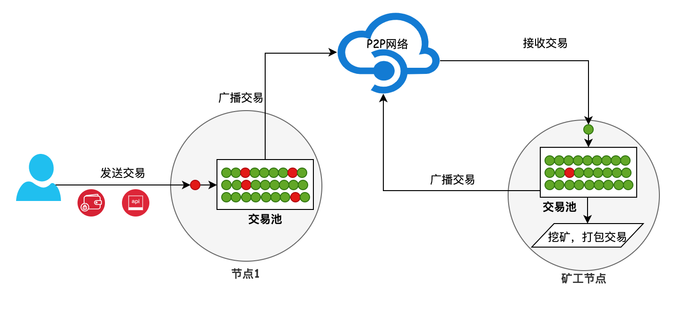
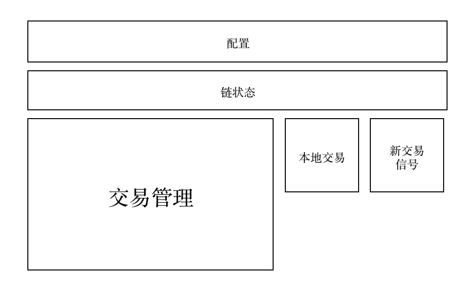
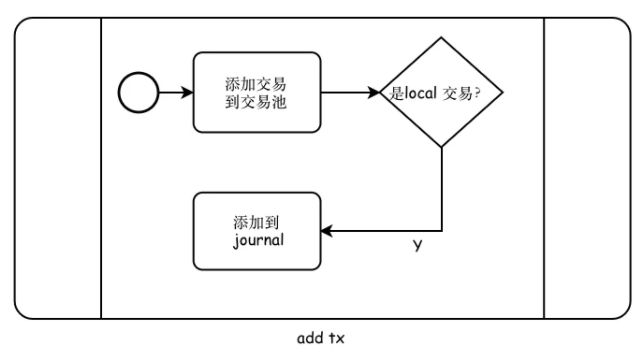
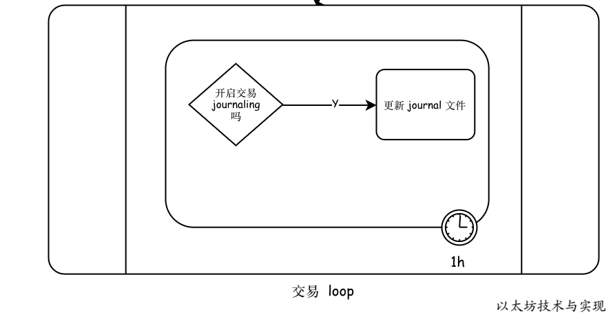

# 以太坊交易池架构设计
## 交易处理流程
以太坊钱包发送一笔转账交易。这笔交易是如何进入网络，最终被矿工打包到区块中呢？

- 客户端
	- 首先，用户可通过以太坊钱包或者其他调用以太坊节点API (eth_sendRawTransaction等)发送交易到一个运行中的以太坊 geth 节点。
- 应用节点
	- 节点时通过的API接收交易，因此此交易被视为一笔来自本地(local)（图中用红球表示）
	- 在经过一系列校验和处理后，交易成功进入交易池。
	- 随后向已连接的邻近节点发送此交易。
- 矿工节点 
	- 当邻近节点，如矿工节点从邻近节点接收到此交易。
	- 在进入交易池之前，会将交易标记为来自远方（remote）的交易（图中用绿球表示）。
	- 也需要经过校验和处理后，进入矿工节点的交易池，等待矿工打包到区块中。

如果邻近节点，不是矿工，也无妨。因为任何节点会默认将接受到得合法交易及时发送给邻近节点。得益于P2P网络，一笔交易平均在6s内扩散到整个以太坊公链网络的各个节点中。

进入以太坊交易池的交易被区分本地还是远方的目的是因为，节点对待 local 的交易和 remote 的交易有所差异。简单地说是 local 交易优先级高于 remote 交易。

## 交易池设计
交易池的主要设计模块，分别是交易池配置、实时的区块链状态、交易管理容器、本地交易存储和新交易事件。

### 配置
交易池配置不多，但每项配置均直接影响交易池对交易的处理行为。配置信息由 TxPoolConfig 所定义，各项信息如下：
	
	// core/tx_pool.go:125
	type TxPoolConfig struct {
	   Locals    []common.Address
	   NoLocals  bool
	   Journal   string
	   Rejournal time.Duration
	   PriceLimit uint64
	   PriceBump  uint64
	   AccountSlots uint64
	   GlobalSlots  uint64
	   AccountQueue uint64
	   GlobalQueue  uint64
	   Lifetime time.Duration
	}

- Locals: 定义了一组视为local交易的账户地址。任何来自此清单的交易均被视为 local 交易。
- NoLocals: 是否禁止local交易处理。默认为 fasle,允许 local 交易。如果禁止，则来自 local 的交易均视为 remote 交易处理。
- Journal： 存储local交易记录的文件名，默认是 ./transactions.rlp。
- Rejournal：定期将local交易存储文件中的时间间隔。默认为每小时一次。
- PriceLimit： remote交易进入交易池的最低 Price 要求。此设置对 local 交易无效。默认值1。
- PriceBump：替换交易时所要求的价格上调涨幅比例最低要求。任何低于要求的替换交易均被拒绝。
- AccountSlots： 当交易池中可执行交易（是已在等待矿工打包的交易）量超标时，允许每个账户可以保留在交易池最低交易数。默认值是 16 笔。
- GlobalSlots： 交易池中所允许的可执行交易量上限，高于上限时将释放部分交易。默认是 4096 笔交易。
- AccountQueue：交易池中单个账户非可执行交易上限，默认是64笔。
- GlobalQueue： 交易池中所有非可执行交易上限，默认1024 笔。
- Lifetime： 允许 remote 的非可执行交易可在交易池存活的最长时间。交易池每分钟检查一次，一旦发现有超期的remote 账户，则移除该账户下的所有非可执行交易。默认为3小时。

### 链状态
所有进入交易池的交易均需要被校验，最基本的是校验

- 账户余额是否足够支付交易执行
- 交易 nonce 是否合法

在交易池中维护的最新的区块 StateDB。当交易池接收到新区块信号时，将立即重置 statedb。

#### 订阅和接收事件
- 订阅监听

	在交易池启动后，将订阅链的区块头事件
	
		//core/tx_pool.go:274
		pool.chainHeadSub = pool.chain.SubscribeChainHeadEvent(pool.chainHeadCh)
	并开始监听新事件
	
		//core/tx_pool.go:305
		for {
		   select {
		   // Handle ChainHeadEvent
		   case ev := <-pool.chainHeadCh:
		      if ev.Block != nil {
		         pool.mu.Lock()
		         if pool.chainconfig.IsHomestead(ev.Block.Number()) {
		            pool.homestead = true
		         }
		         pool.reset(head.Header(), ev.Block.Header())
		         head = ev.Block
		
		         pool.mu.Unlock()
		      }
		  //...
		  }
		}
- 接收到事件后

	将执行 `func (pool *TxPool) reset(oldHead, newHead *types.Header)` 方法更新 state 和处理交易。核心是将交易池中已经不符合要求的交易删除并更新整理交易
	
### 本地交易
在交易池中将交易标记为 local 的有多种用途：

- 在本地磁盘存储已发送的交易

	这样，本地交易不会丢失，重启节点时可以重新加载到交易池，实时广播出去。
- 可以作为外部程序和以太坊沟通的一个渠道。

	外部程序只需要监听文件内容变化，则可以获得交易清单。
- 本地交易可优先于 remote 交易

	对交易量的限制等操作，不影响 local 下的账户和交易。

对应本地交易存储，在启动交易池时根据配置开启本地交易存储能力

	//core/tx_pool.go:264
	if !config.NoLocals && config.Journal != "" {
			pool.journal = newTxJournal(config.Journal)
			if err := pool.journal.load(pool.AddLocals); err != nil {
				log.Warn("Failed to load transaction journal", "err", err)
			}
	    //...
	}
并从磁盘中加载已有交易到交易池。在新的 local 交易进入交易池时，将被实时写入 journal 文件

	// core/tx_pool.go:757
	func (pool *TxPool) journalTx(from common.Address, tx *types.Transaction) {
	   if pool.journal == nil || !pool.locals.contains(from) {
	      return
	   }
	   if err := pool.journal.insert(tx); err != nil {
	      log.Warn("Failed to journal local transaction", "err", err)
	   }
	}
从上可看到，只有属于 local 账户的交易才会被记录。journal 文件不会跟随本地交易无限增长，虽然无法实时从 journal 中移除交易。但是支持定期更新 journal文件。

journal 并不是保存所有的本地交易以及历史，他仅仅是存储当前交易池中存在的本地交易。因此交易池会定期对 journal 文件执行 rotate，将交易池中的本地交易写入 journal 文件，并丢弃失效旧数据。

	journal := time.NewTicker(pool.config.Rejournal)
	//...
	//core/tx_pool.go:353
	case <-journal.C:
				if pool.journal != nil {
					pool.mu.Lock()
					if err := pool.journal.rotate(pool.local()); err != nil {
						log.Warn("Failed to rotate local tx journal", "err", err)
					}
					pool.mu.Unlock()
				}
	}

### 新交易信号
进入交易池的交易将被广播到网络中。这是依赖于交易池支持外部订阅新交易事件信号。任何订阅此事件的子模块，在交易池出现新的可执行交易时，均可实时接受到此事件通知，并获得新交易信息。

`注意的是并非所有进入交易池的交易均被通知外部，而是只有交易从非可执行状态变成可执行状态后才会发送信号。`

	//core/tx_pool.go:705
	go pool.txFeed.Send(NewTxsEvent{types.Transactions{tx}})
	//core/tx_pool.go:1022
	go pool.txFeed.Send(NewTxsEvent{promoted})
在交易池中，有两处地方才会执行发送信号。

- 一是交易时用于替换已经存在的可执行交易时
- 二是有新的一批交易从非可执行状态提升到可执行状态后

外部只需要订阅 `SubscribeNewTxsEvent(ch chan<- NewTxsEvent)` 新可执行交易事件，则可实时接受交易。在 geth 中网络层将订阅交易事件，以便实时广播。

	//eth/handler.go:213
	pm.txsCh = make(chan core.NewTxsEvent, txChanSize)
	pm.txsSub = pm.txpool.SubscribeNewTxsEvent(pm.txsCh)
	//eth/handler.go:781
	func (pm *ProtocolManager) txBroadcastLoop() {
	   for {
	      select {
	      case event := <-pm.txsCh:
	         pm.BroadcastTxs(event.Txs)
	      //...
	   }
	}
另外是矿工实时订阅交易，以便将交易打包到区块中

	//miner/worker.go:207
	worker.txsSub = eth.TxPool().SubscribeNewTxsEvent(worker.txsCh)
	//miner/worker.go:462
	txs := make(map[common.Address]types.Transactions)
	for _, tx := range ev.Txs {
			acc, _ := types.Sender(w.current.signer, tx)
	   	txs[acc] = append(txs[acc], tx)
	}
	txset := types.NewTransactionsByPriceAndNonce(w.current.signer, txs)
	w.commitTransactions(txset, coinbase, nil)

### 交易管理
最核心的部分则是交易池对交易的管理机制。以太坊将交易按状态分为两部分：

- 可执行交易(pending)
- 非可执行交易(queue)

分别记录在 pending 容器中和 queue 容器中。

#### 可执行交易和非可执行交易的定义
- 可执行交易
	
	指从交易池中择优选出的一部分交易可以被执行，打包到区块中。
- 非可执行交易
	
	任何刚进入交易池的交易均属于非可执行状态，在某一个时刻才会提升为可执行状态
	

如上图所示

- 交易池先采用一个 txLookup (内部为map）跟踪所有交易。
- 同时将交易根据本地优先，价格优先原则将交易划分为两部分 `queue` 和 `pending`。而这两部交易则按账户分别跟踪。

## 本地待处理交易存储
### 加载本地已存储交易
下图是交易池对本地待处理交易，从磁盘存储的交易中加载交易的流程

在交易池首次启动 journal 时，将主动将该文件已存储的交易加载到交易池。

	//core/tx_journal.go:61
	if _, err := os.Stat(journal.path); os.IsNotExist(err) { //❶
	   return nil
	}
	// Open the journal for loading any past transactions
	input, err := os.Open(journal.path) //❷
	if err != nil {
	   return err
	}
	defer input.Close()
处理时

- 如果文件不存在则退出 ❶
- 否则 Open 文件，获得 input 文件流 ❷。	

然后

	//core/tx_journal.go:76
	stream := rlp.NewStream(input, 0)//❸
	total, dropped := 0, 0
因为存储的内容格式是 rlp 编码内容，因此可以直接初始化 rlp 内容流 ❸，为连续解码做准备

	var (
	   failure error
	   batch   types.Transactions
	)
	for {
	   tx := new(types.Transaction)
	   if err = stream.Decode(tx); err != nil { //❹
	      if err != io.EOF {
	         failure = err
	      }
	      if batch.Len() > 0 {//❼
	         loadBatch(batch)
	      }
	      break
	   }
	   total++
	
	   if batch = append(batch, tx); batch.Len() > 1024 {//❺
	      loadBatch(batch)//❻
	      batch = batch[:0]
	   }
	}
直接进入 for 循环遍历

- 不断从 stream 中一笔笔地解码出交易❹。
- 但交易并非单笔直接载入交易池，而是采用批量提交模式，每 1024 笔交易提交一次 ❺。 
- 批量写入，有利于降低交易池在每次写入交易后的更新。一个批次只需要更新（排序与超限处理等）一次。当然在遍历结束时（err==io.EOF）,也需要将当前批次中的交易载入❼。

然后

	loadBatch := func(txs types.Transactions) {
	   for _, err := range add(txs) {
	      if err != nil {
	         log.Debug("Failed to add journaled transaction", "err", err)
	         dropped++ //❽
	      }
	   }
	}
loadBatch 就是将交易一批次加入到交易池，并获得交易池的每笔交易的处理情况。如果交易加入失败，则进行计数 ❽。最终在 load 方法执行完毕时，显示交易载入情况

	log.Info("Loaded local transaction journal", "transactions", total, "dropped", dropped)

### 本地存储交易

当交易池新交易来自于本地账户时❶，如果已开启记录本地交易，则将此交易加入journal ❷。到交易池时，将实时存储到 journal 文件中

	//core/tx_pool.go:757
	func (pool *TxPool) journalTx(from common.Address, tx *types.Transaction) {
	   // Only journal if it's enabled and the transaction is local
	   if pool.journal == nil || !pool.locals.contains(from) {//❶
	      return
	   }
	   if err := pool.journal.insert(tx); err != nil { //❷
	      log.Warn("Failed to journal local transaction", "err", err)
	   } 
	}
而 `journal.insert` 则将交易实时写入文件流中❸，相当于实时存储到磁盘。而在写入时，是将交易进行 RLP 编码

	//core/tx_journal.go:120
	func (journal *txJournal) insert(tx *types.Transaction) error {
	   if journal.writer == nil {
	      return errNoActiveJournal
	   }
	   if err := rlp.Encode(journal.writer, tx); err != nil {//❸
	      return err
	   }
	   return nil
	}
这里引发了在上面载入已存储交易时将交易重复写入文件。因此在加载交易时，使用一个 空 writer 替代 ❹并且在加载结束时清理❺。

	//core/tx_journal.go:72
	journal.writer = new(devNull) //❹
	defer func() { journal.writer = nil }() //❺

### 定期更新 journal

journal 的目的是长期存储本地尚未完成的交易，以便交易不丢失。而文件内容属于交易的 RLP 编码内容，不便于实时清空已完成或已无效的交易。因此以太坊采取的是定期将交易池在途交易更新到 journal 文件中。

- 首先，在首次加载文件中的交易到交易池后，利用交易池的检查功能，将已完成或者已完成的交易筛选出交易池外。
- 在加载完成后，交易池中的交易仅仅是本地账户待处理的交易，因此在加载完成后❶，立即将交易池中的所有本地交易覆盖 journal 文件❷。

		//core/tx_pool.go:264
		pool.journal = newTxJournal(config.Journal)
		
		if err := pool.journal.load(pool.AddLocals); err != nil {//❶
		   log.Warn("Failed to load transaction journal", "err", err)
		}
		if err := pool.journal.rotate(pool.local()); err != nil {//❷
		   log.Warn("Failed to rotate transaction journal", "err", err)
		}
- 在 rotate 中，并非直接覆盖。而是先创建另一个新文件❸，将所有交易RLP编码写入此文件❹

		replacement, err := os.OpenFile(journal.path+".new",  //❸
		                                os.O_WRONLY|os.O_CREATE|os.O_TRUNC, 0755)
		if err != nil {
		   return err
		}
		journaled := 0
		for _, txs := range all {
		   for _, tx := range txs {
		      if err = rlp.Encode(replacement, tx); err != nil {//❹
		         replacement.Close()
		         return err
		      }
		}
		   journaled += len(txs)
		}
		replacement.Close()
- 写入完毕，将此文件直接移动（重命名），已覆盖原 journal 文件

		if err = os.Rename(journal.path+".new", journal.path); err != nil {
		   return err
		}
- 其次，是交易池根据参数 `txpool.rejournal` 所设置的更新间隔定期更新❺。将交易池中的本地交易存储到磁盘❻。

		//core/tx_pool.go:298
		journal := time.NewTicker(pool.config.Rejournal)//❺
		//...
		for {
		  select {
		    //...
		    case <-journal.C:
					if pool.journal != nil {
						pool.mu.Lock()
						if err := pool.journal.rotate(pool.local()); err != nil { //❻
							log.Warn("Failed to rotate local tx journal", "err", err)
						}
						pool.mu.Unlock()
					}
				}
		  }
		}

## 交易入队列
交易进入交易池分三步走：

- 校验
- 入队列
- 容量检查

拿 AddLocalTx 举例。核心代码集中在交易池的 `func (pool *TxPool) add(tx *types.Transaction, local bool) (bool, error)` 方法。

### 校验交易合法性
任何交易进入交易池之前均需要校验交易数据的合法性。如果交易校验失败则拒绝此交易。

	//core/tx_pool.go:662
	if err := pool.validateTx(tx, local); err != nil {
	   log.Trace("Discarding invalid transaction", "hash", hash, "err", err)
	   invalidTxCounter.Inc(1)
	   return false, err
	}
代码逻辑集中在

	func (pool *TxPool) validateTx(tx *types.Transaction, local bool) error方法中。
- 首先是防止DOS攻击，不允许交易数据超过32KB。

		if tx.Size() > 32*1024 {
		   return ErrOversizedData
		}
- 接着不允许交易的转账金额为负数，实际上这次判断难以命中，原因是从外部接收的交易数据属RLP编码，是无法处理负数的。当然这里做一次校验，更加保险。

		if tx.Value().Sign() < 0 {
		   return ErrNegativeValue
		}
- 交易在虚拟机中执行时将消耗 GAS，为了防止程序错误，允许用户在交易中携带一个 GAS 上限，防止意外发生。同样，为了避免区块总消耗异常，和控制区块数据大小。也同样存在区块 GAS 上限。而区块中的 GAS 量是每笔交易执行消耗 GAS 之和，故不可能一笔交易的 GAS 上限超过区块 GAS 限制。一旦超过，这笔交易不可能会打包到区块中，则可在交易池中直接拒绝超过限制的交易

		if pool.currentMaxGas < tx.Gas() {
		   return ErrGasLimit
		}
- 每笔交易都需要携带交易签名信息，并从签名中解析出签名者地址。只有合法的签名才能成功解析出签名者。一旦解析失败拒绝此交易

		from, err := types.Sender(pool.signer, tx)
		if err != nil {
		   return ErrInvalidSender
		}
- 知道是交易发送者(签名者)，那么该发送者也可能是来自于交易池所标记的 local 账户。因此当交易不是 local 交易时，还进一步检查是否属于 local 账户。

		local = local || pool.locals.contains(from)
- 如果不是 local 交易，那么交易的 GasPrice 也必须不小于交易池设定的最低 GasPrice。这样的限制检查，允许矿工自行决定 GasPrice。有些矿工，可能只愿意处理愿意支付高手续费的交易。当然 local 交易则忽略，避免将本地产生的交易拦截。

		if !local && pool.gasPrice.Cmp(tx.GasPrice()) > 0 {
		   return ErrUnderpriced
		}
- 以太坊中每个账户都有一个数字类型的 Nonce 字段。是一个有序数字，一次比一次大。虚拟机每执行一次该账户的交易，则新 Nonce 将在此交易的 Nonce 上加 1。如果使用恰当，该 Nonce 可间接表示已打包了 Nonce 笔该账户交易。既然不会变小，那么在交易池中不允许出现交易的 Nonce 小于此账户当前 Nonce 的交易。

		if pool.currentState.GetNonce(from) > tx.Nonce() {
		   return ErrNonceTooLow
		}
- 如果交易被打包到区块中，应该花费多少手续费呢？虽然无法知道最终花费多少，但至少花费多少手续费是可预知的。手续费加上本次交易转移的以太币数量，将会从该账户上扣除。那么账户至少需要转移多少以太坊是明确的。

	因此在交易池中，将检查该账户余额，只有账户资产充足时，才允许交易继续，否则在虚拟机中执行交易，交易也必将失败。
	
		if pool.currentState.GetBalance(from).Cmp(tx.Cost()) < 0 {
		   return ErrInsufficientFunds
		}
- 我们不但知道最低花费，也可以知道将最低花费多少 GAS。因此也检查交易所设置的 Gas 上限是否正确。一旦交易至少需要 2 万Gas，而交易中设置的 Gas 上限确是 1 万GAS。那么交易必然失败，且剩余了 1万GAS。在最后。如果交易 GAS 上限低于已知的最低 GAS 开销，则拒绝这笔必将失败的交易。

		intrGas, err := IntrinsicGas(tx.Data(), tx.To() == nil, pool.homestead)
		if err != nil {
		   return err
		}
		if tx.Gas() < intrGas {
		   return ErrIntrinsicGas
		}

### 入队列
在交易池中并不是一个队列管理数据，而是由多个数据集一起管理交易。

- 在进入交易队列前，将判断所有交易队列 all 是否已经达到上限。如果到上限，则需要从交易池或者当前交易中移除优先级最低交易 

		//core/tx_pool.go:668
		if uint64(pool.all.Count()) >= pool.config.GlobalSlots+pool.config.GlobalQueue { //❶
		   if !local && pool.priced.Underpriced(tx, pool.locals) {//❷
		      log.Trace("Discarding underpriced transaction", "hash", hash, "price", tx.GasPrice())
		      underpricedTxCounter.Inc(1)
		      return false, ErrUnderpriced
		   }
		   drop := pool.priced.Discard(pool.all.Count()-int(pool.config.GlobalSlots+pool.config.GlobalQueue-1), pool.locals) //❸
		   for _, tx := range drop {
		      log.Trace("Discarding freshly underpriced transaction", "hash", tx.Hash(), "price", tx.GasPrice())
		      underpricedTxCounter.Inc(1)
		      pool.removeTx(tx.Hash(), false)
		   }
		}
	- 首先，本地交易是受保护的，因此如果交易来自 remote 时，将检查该交易的价格是否是整个交易池中属于最低价格的。
		- 如果是，则拒绝该交易❷。
		- 否则在加入此交易前，将从交易队列 all 中删除价格最低的一部分交易❸。

		为了高效获得不同价格的交易，交易池已经将交易按价格从低到高实施排列存储在 `pool.priced` 中。
	- 解决交易容量问题后，这笔交易过关斩将，立马将驶入交易内存池中。上图中，交易是有根据 from 分组管理，且一个 from 由分非可执行交易队列（queue）和可执行交易队列（pending）。
		- 新交易默认是要在非可执行队列中等待指示，但是一种情况时，如果该 from 的可执行队列中存在一个相同 nonce 的交易时，需要进一步识别是否能替换❹。
			- 怎样的交易才能替换掉已在等待执行的交易呢？以太坊早起的默认设计是，只要价格(gasPrice)高于原交易，则允许替换。但是17年7月底在 #15401 被改进。
				- 人们愿意支付更多手续费的原因有两种情况，
					- 一是急于处理交易，但如果真是紧急交易，那么在发送交易之处，会使用高于推荐的 gasprice 来处理交易。
					- 另一种情况时，以太坊价格下跌，人们愿意支付更多手续费。上调多少手续费是合理的呢？以太币下跌10%，那么便可以上调10%的手续费，毕竟对于用户来说，手续费的面值是一样的。交易池的默认配置（pool.config.PriceBump）是10%，只有上调10%手续费的交易才允许替换掉已在等待执行的交易❺。
	- 一旦可以替换，则替换掉旧交易❺，移除旧交易❻，并将交易同步存储到 all 交易内存池中

	入列

		//core/tx_pool.go:685
		if list := pool.pending[from]; list != nil && list.Overlaps(tx) {//❹
		   inserted, old := list.Add(tx, pool.config.PriceBump)//❺
		   if !inserted {
		      pendingDiscardCounter.Inc(1)
		      return false, ErrReplaceUnderpriced
		   }
		   if old != nil { //❻
		      pool.all.Remove(old.Hash())
		      pool.priced.Removed()
		      pendingReplaceCounter.Inc(1)
		   }
		   pool.all.Add(tx)
		   pool.priced.Put(tx)
		   pool.journalTx(from, tx)
		   //...
		   return old != nil, nil
		}
		replace, err := pool.enqueueTx(hash, tx)//❼
		if err != nil {
			return false, err
		}
- 检查完是否需要替换 pending 交易后，则将交易存入非可执行队列❼。同样，在进入非可执行队列之前，也要检查是否需要替换掉相同 nonce 的交易❽。

		func (pool *TxPool) enqueueTx(hash common.Hash, tx *types.Transaction) (bool, error) {
		   //...
		   inserted, old := pool.queue[from].Add(tx, pool.config.PriceBump) //❽
		   if !inserted {
		      queuedDiscardCounter.Inc(1)
		      return false, ErrReplaceUnderpriced
		   }
		   if old != nil {
		      pool.all.Remove(old.Hash())
		      pool.priced.Removed()
		      queuedReplaceCounter.Inc(1)
		   }
		   if pool.all.Get(hash) == nil {
		      pool.all.Add(tx)
		      pool.priced.Put(tx)
		   }
		   return old != nil, nil
		}
- 最后，如果交易属于本地交易还需要额外关照。如果交易属于本地交易，但是本地账户集中不存在此 from 时，更新本地账户集❾，避免交易无法被存储⑩。另外，如果已开启存储本地交易，则实时存储本地交易⑪。

		// core/tx_pool.go:715
		if local {
		   if !pool.locals.contains(from) {
		      log.Info("Setting new local account", "address", from)
		      pool.locals.add(from)//❾
		   }
		}
		pool.journalTx(from, tx)
		//....
		//core/tx_pool.go:757
		func (pool *TxPool) journalTx(from common.Address, tx *types.Transaction) {
			// Only journal if it's enabled and the transaction is local
			if pool.journal == nil || !pool.locals.contains(from) {//⑩
				return
			}
			if err := pool.journal.insert(tx); err != nil {//⑪
				log.Warn("Failed to journal local transaction", "err", err)
			}
		}

进入了交易内存池，等待执行。不难看出，priced 队列是在交易进入队列内存池时便被编排到 priced 队列，已让 priced 队列是对 all 交易内存池的同步排序。且交易是在进入 pending 队列或者 queue 队列后，才同步更新到 all 交易内存池中。

## 交易队列与容量内存限制
在交易存入交易池后，将影响 pending 格局。原因是在交易排队等待处理时，需要确定交易优先级。 如果交易池已有一万笔交易排队，该如何按优先级排队来处理呢？如果第一万零一笔交易刚刚加入交易池，需要优先处理此交易吗？如果待执行交易已经有十笔交易被执行完毕，如何从队列中转移一部分交易来添补空缺呢？如果交易将超过交易池配置上限呢？

不管如果变化，以太坊以不变应万变。用统一的优先级规则来应当各种情况，只要有交易加入或者清理出交易池都将立即激活对可执行交易队列的更新（promoteExecutables）。

	规则是删除无效和超上限交易、转移一部分、容量控制。虽然概括为一句话，但逻辑的整个处理确是整个交易池中最复杂的部分，也是最核心部分。
### 删除旧交易
当新区块来到时，很有可能包含交易内存池中一些账户的交易。一旦存在，则意味着账户的 nonce 和账户余额被存在变动。而只有高于当前新 nonce 交易才能被执行，且账户余额不足以支撑交易执行时，交易也将执行失败。

- 因此，在新区块来到后，删除所有低于新 nonce 的交易❶。 再根据账户可用余额，来移除交易开销（amount+gasLimit*gasPrice）高于此余额的交易❷。

		//core/tx_pool.go:982
		for _, tx := range list.Forward(pool.currentState.GetNonce(addr)) {//❶
		   hash := tx.Hash()
		   log.Trace("Removed old queued transaction", "hash", hash)
		   pool.all.Remove(hash)
		   pool.priced.Removed()
		}
		drops, _ := list.Filter(pool.currentState.GetBalance(addr), pool.currentMaxGas)//❷
		for _, tx := range drops {
			hash := tx.Hash()
			log.Trace("Removed unpayable queued transaction", "hash", hash)
			pool.all.Remove(hash)
			pool.priced.Removed()
			queuedNofundsCounter.Inc(1)
		}

### 转移交易或释放
在非可执行队列中的交易有哪些可以转移到可执行队列呢？因为交易 nonce 的缘故，如果 queue 队列中存在低于 pending 队列的最小 nonce 的交易❸，则可直接转移到 pending 中❹。

	for _, tx := range list.Ready(pool.pendingState.GetNonce(addr)) {//
	   hash := tx.Hash()
	   if pool.promoteTx(addr, hash, tx) {//❹
	      log.Trace("Promoting queued transaction", "hash", hash)
	      promoted = append(promoted, tx)
	   }
	}
转移后，该账户的交易可能超过所允许的排队交易数，如果超过则直接移除超过上限部分的交易❺。当然这仅仅针对 remote 交易。
	
	if !pool.locals.contains(addr) {
	   for _, tx := range list.Cap(int(pool.config.AccountQueue)) {//❺
	      hash := tx.Hash()
	      pool.all.Remove(hash)
	      pool.priced.Removed() 
	      //...
	   }
	}
每个账户的非可执行交易更新完毕

### 检查 pending 交易数量
交易池配置有设置总 pending 量上限 ( `pool.config.GlobalSlots` )。如果超过上限❶，则分两种策略移除超限部分

	pending := uint64(0)
	for _, list := range pool.pending {
	   pending += uint64(list.Len())
	}
	if pending > pool.config.GlobalSlots {//❶
		//...
	}
优先从超上限 ( `pool.config.AccountSlots` )的账户❷中移除交易。在移除交易时，并非将某个账户的交易全部删除，而是每个账户轮流❸删除一笔交易❹，直到低于交易上限❺。同时，还存在一个特殊删除策略，并非直接轮流每个账户，而是通过一个动态阀值控制❻，阀值控制遍历顺序，存在一定的随机性。

	//core/tx_pool.go:1032
	spammers := prque.New(nil)
	for addr, list := range pool.pending { 
	   if !pool.locals.contains(addr) && uint64(list.Len()) > pool.config.AccountSlots {
	      spammers.Push(addr, int64(list.Len()))//❷
	   }
	} 
	offenders := []common.Address{}
	for pending > pool.config.GlobalSlots && !spammers.Empty() {
	   offender, _ := spammers.Pop()
	   offenders = append(offenders, offender.(common.Address))
	
	   if len(offenders) > 1 { 
	      threshold := pool.pending[offender.(common.Address)].Len()//❻
	 
	      for pending > pool.config.GlobalSlots && pool.pending[offenders[len(offenders)-2]].Len() > threshold { //❺
	         for i := 0; i < len(offenders)-1; i++ {//❸
	            list := pool.pending[offenders[i]]
	            for _, tx := range list.Cap(list.Len() - 1) {//❹ 
	              //delete tx
	            }
	            pending--
	         }
	      }
	   }
	}
如果仍然还超限，则继续采用直接遍历方式❼，删除交易，直到低于限制❽

	//core/tx_pool.go:1073
	if pending > pool.config.GlobalSlots && len(offenders) > 0 {
	   for pending > pool.config.GlobalSlots && uint64(pool.pending[offenders[len(offenders)-1]].Len()) > pool.config.AccountSlots {//❽
	      for _, addr := range offenders {//❼
	         list := pool.pending[addr]
	         for _, tx := range list.Cap(list.Len() - 1) { 
							//delete tx
	         }
	         pending--
	      }
	   }
	}
### 检查 queue 交易数量
同样，交易池对于非可执行交易数量也存在上限控制。如果超过上限❶，同样需要删除超限部分。

	//core/tx_pool.go:1096
	queued := uint64(0)
	for _, list := range pool.queue {
	   queued += uint64(list.Len())
	}
	if queued > pool.config.GlobalQueue {//❶
		//...
	}
删除交易的策略完成根据每个账户 pending 交易的时间处理，依次删除长时间存在于 pending 的账户交易。在交易进入 pending 时会更新账户级的心跳时间，代表账户最后 pending 交易活动时间。时间越晚，说明交易越新。

当交易池的交易过多时，

- 首先根据账户活动时间，从早到晚排列❷。
- 再按时间从晚到早❸依次交易。
- 删除时，如果 queue 交易笔数不够待删除量时❹，
	- 直接清理该账户所有 queue 交易
	- 否则逐个删除，直到到达删除任务❺。	

测试
	
	addresses := make(addressesByHeartbeat, 0, len(pool.queue))
	for addr := range pool.queue {
	   if !pool.locals.contains(addr) { // don't drop locals
	      addresses = append(addresses, addressByHeartbeat{addr, pool.beats[addr]})
	   }
	}
	sort.Sort(addresses)//❷
	
	for drop := queued - pool.config.GlobalQueue; drop > 0 && len(addresses) > 0; {
	   addr := addresses[len(addresses)-1]//❸
	   list := pool.queue[addr.address]
	
	   addresses = addresses[:len(addresses)-1] 
	   if size := uint64(list.Len()); size <= drop {//❹
	      for _, tx := range list.Flatten() {
	         pool.removeTx(tx.Hash(), true)
	      }
	      drop -= size
	      queuedRateLimitCounter.Inc(int64(size))
	      continue
	   } 
	   txs := list.Flatten()
	   for i := len(txs) - 1; i >= 0 && drop > 0; i-- {//❺
	      pool.removeTx(txs[i].Hash(), true)
	      drop--
	      queuedRateLimitCounter.Inc(1)
	   }
	}	

为何是删除最新活动账户的 Queue 交易？这是因为账户是最新活动，意味着该账户有刚交易进入 pending ，此账户的交易是更有机会被执行的。那么公平起见，哪些迟迟未能进入 pending 的账户的 queue 交易应该继续保留，以便账户交易有机会进入 pending 。这样对于每个账户来说，长时间等待过程中都是有机会进入 pending 被矿工处理的。	

			

	

