# 肖老师以太坊和 Layer2 公开课笔记
 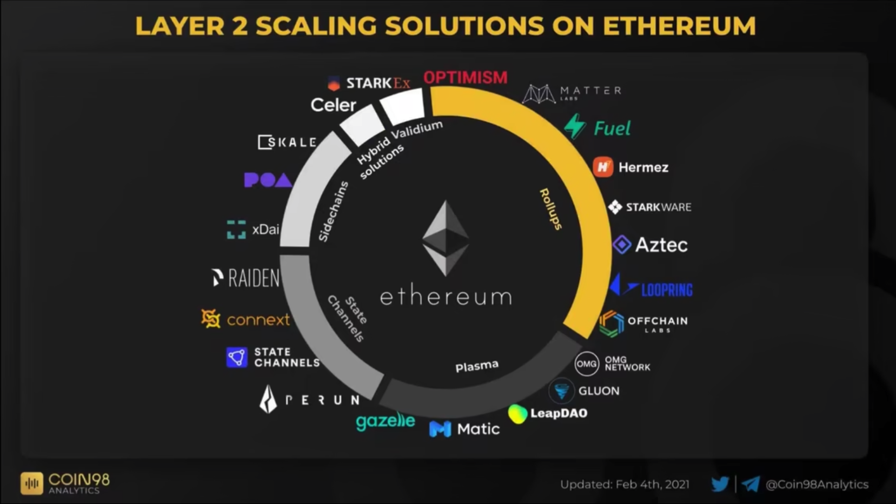
##  layer2 简介
是将以太坊链运行的交易搬到以太坊链下处理，然后将处理的结果返回到以太坊上，这样来降低以太坊的工作量，增加工作效率节省 Gas 费用

	注意，这里是以太坊链下，当然可能是这些可能是在侧链上运行的，虽然也是链，但是他们的链，从安全性，到去中心化性，肯定和以太坊不是一个级别。
- 哪些方案属于 layer2？

	当前 layer2 是有争议的，业界主流意见是 layer 要继承 layer 1的安全性
	
	- 侧链方案

		作为以太坊的侧链来运行，起到扩容的目的，但侧链是独立运行的协议，有独立的验证机制，独立的安全性，跟以太坊主链是脱节的。侧链的去中心化程度低，侧链的验证着比以太坊小很多，这样就会出现资产安全问题。
	- Rollup 方案

		Rollup 方案基于以太坊公链运行的，安全性可以通过以太坊链来保证。Rollup 在 layer2 是打包的意思，处理方式就是把几千个交易捆绑在一起处理。然后再把压缩后的数据上传到以太坊，大幅提高交易处理量
				
## Rollup 的工作原理
### 工作原理
#### 部署以太坊合约
 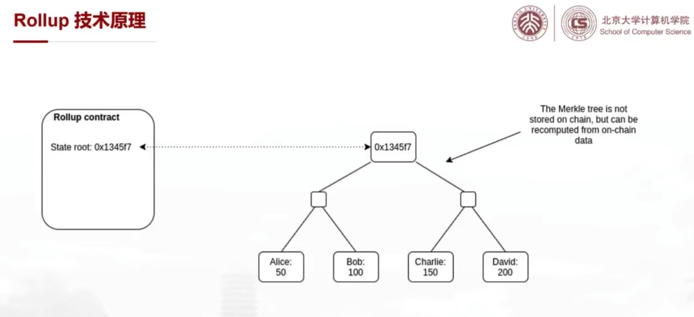	
 
 - 首先在以太坊上部署一个智能合约，来记录状态，包括账户的状态，也包括交易的状态，方法是通过 Merkle 根节点 hash 值表示。而 Merkle 的叶子结点是账户状态信息。
 
####  提交交易到合约
 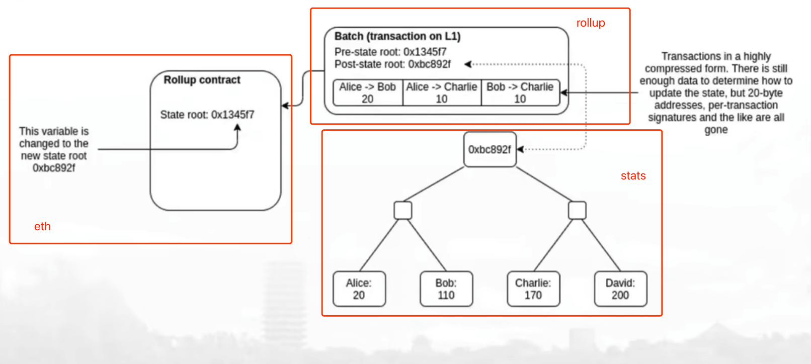
 
- 然后 Rollup 把多个交易卷起来(压缩)打包用批次的方式向以太坊提交交易，交易的计算是在链下完成，交易中包含类区块数据，包括 
	-  State root hash 值
		- 之前的
		- 当前的
			- 也会改变 state root ，也就是 Merkle 树的 hash 值 
	- 状态数据
		- 用户账户状态信息，包括下面各账户当前状态信息
	- 以及本批次线下交易的所有数据的压缩打包数据
		- 这些交易数据是直接上传到以太坊上的，数据放在合约的 Data 结构中的,对于提交这个交易的 EVM 来说，不会解析这个数据，也不会执行这个数据，当成区块链的历史数据
		- 不同的 L2 方案，在数据可用性上也是有差别的 
			- 大多数方案，是把数据存在链上
			- 也有方案把大部分数据存在链下( IPFS ？)进一步减轻负载，提高 TPS 和降低 GAS,代价就是安全性，数据不在链万一数据丢失怎么办 
- 提交成功后，完成了 rollup 类的状态转移确认

#### 合约处理
- 当 Rollup 交易被提交后， Rollup 合约会把状态进行更新，但智能合约在验证过程中，并不需要验证压缩包里的交易。如果再执行一遍，那么 Rollup 没有起效。
- Rollup 如何保证交易数据是正确的？如果不解决验证问题，攻击者可以任意修改 Rollup 数据。那么解决这个问题产生两种 rollup 解决方案

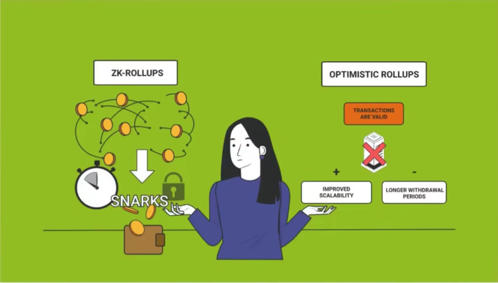
 
- OPTIMISTIC Rollup(乐观Rollup)

	采用欺诈证明，缺省情况下，假设提交是正确的。如果不正确，
	
	- 可以发布一个证明到链上，证明这个批次的 Rollup 计算错误通过合约接口发布到链上要求智能合约验证
		- 如果智能合约验证后发现确实是计算错误，那么状态恢复到提交这个批次之前的批次状态，并且对提交这个 Rollup 的欺诈者进行惩罚，对于举报者进行奖励。
- ZK Rollup

	采用的是有效性证明，每个批次在提交的时候都包含密码学证明，证明新状态根是执行该批次后的正确结果，无论签名的计算量多大，但是该证明都可以在链上快速验证。

### 优点与缺点
- 优点
	- Rollup 共有
		- 一次性验证很多交易，增加效率
		- 同时继承了以太坊的安全性
	- OPTIMISTIC 比 ZK  Rollup
		- 实现更简单，技术更成熟，被广泛应用 
	- ZK Rollup 特有
		- 与乐观 Rollup 相比，安全性更高，提交合约后就可以验证正确性，不存在恶意欺骗交易回滚的可能性   
- 缺点
	- OPTIMISTIC Rollup
		- 需要较长的退出时间，一般该 Rollup 需要1-2周的挑战期，相对安全，在挑战期结束前，没有那个交易可以认为是确定的，用户体验差。
			- 例如去中心化交易所，进行波段炒作，一周后被告知交易回滚
			- 即使简单的转账交易，一周后才能获得
		- 假设社区有足够多的验证者且在挑战期结束前及时提交欺诈证明，保证区块的合法性。该假设不一定成立，因为这个 Rollup 大部分的交易都是合法的，那么验证着检测获利的可能性较低，积极性无法得到满足，这样带来了安全性问题。 
		- 如何激励验证者是所有该 Rollup 的挑战
		- 验证的复杂性和成本问题
			- 如果提交欺诈，那么该 Rollup 合约将需要验证被标注欺诈的 Rollup 的打包合约中的数据，那么次交易也将被 L2 的 Gas 费用所限制，带来整体架构设计局限性，也就是 L2 的 Rollup 打包交易规模受到以太坊单交易 Gas 上限的限制。   
	- ZK Rollup
		- 不足之处在于，所以依赖的密码学证明很复杂，目前还没有办法做到和 EVM 完全兼容
	- Rollup 共有问题
		- 从系统架构上看， L2依赖于底层的 L1 的，如果 L1 出现问题，L2 方案将无法使用，但如果 L2 出现问题，L1 将不会受到影响， 交易依然可以进行，但是无法得到 L2 加速。

### OPTIMISTIC-Rollup 项目
#### 项目 Optimism (乐观)
- 乐观假设
	- 乐观的认为 Rollup 发布到 L1 的数据是正确的
	- 同时引入了时间延迟机制(Dispute Time Delay, DTD)
	- 使用挑战期保护数据正确性
		- 验证者发布数据的时候，需要验证者质押一定数量的保证金
			- 如果有人对发布数据有争议，可以在挑战期内发起挑战，向 Rollup 的智能合约提交证明，证明这个批次计算错误，而 Rollup 合约(协议)将在 L1 上重新计算该提交的 Rollup 打包区块的所有交易，最终来判断对错。如果发现确实存在欺诈，该批次和所有以后的交易将回滚，并且将罚没质押的保证金，并奖励给挑战者。
			- 而发起挑战者也需要质押保证金，防止 DDoS 攻击，防止攻击者利用这个接口将所有区块进行执行，达到攻击目的。
			- 最终双方都质押保证金，错误一方将被罚没，而正确一方将被奖励。

#### 项目 ARBITRUM
与 Optimism 不同的地方在于，在 L2 上采用了多轮欺诈证明和 L1 上的一步式证明

- Asserter(验证者)
- Challenger (挑战者)

1. 第一步

	两个人在链下，通过二分法不断拆分存在争议的具体步骤，直到拆分到一个最小的不可再分的单位。
2. 第二步

	将这个问题再放到 L1 进行判断，以此实现高效的争端处理
	
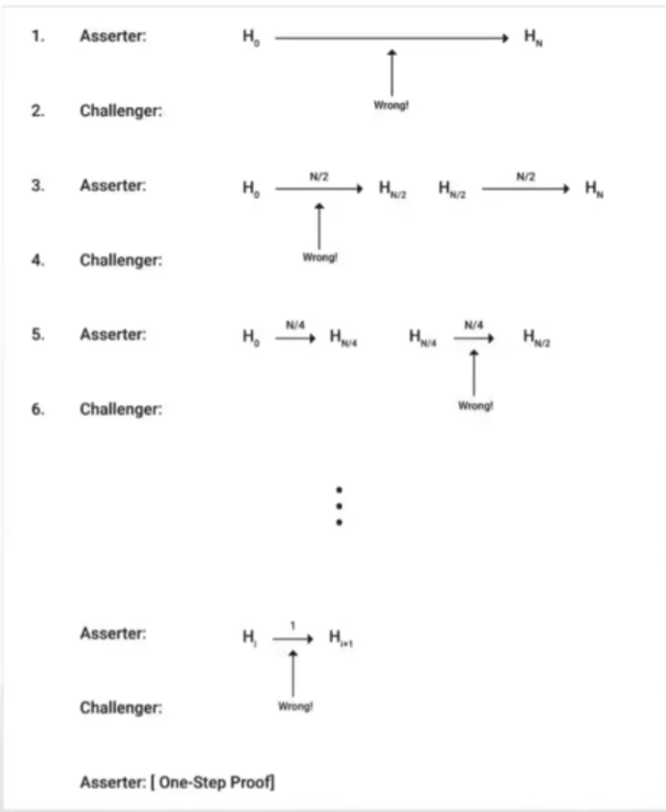

如图

- 首先，验证者给出区块
- 挑战者进行判断
- 验证着等分
- 挑战者从2等分的部分中，选择一个进行判断有问题
- 然后验证者再等分
- 循环直到找到最精确的问题区域
- 然后发送给 L1 的智能合约
- 智能合约进行计算裁定
- 智能合约计算后，将失败者的钱发送给胜利者  

设计好处

- 就是把跟多的计算放到 L2，这样来增加 L1 争议计算效率
- 同时可以让该项目支持复杂的智能合约，合约批处理块的规模不受 ETH 单交易 Gas 限制，这对于兼容 EVM 的 Rollup 来说是很重要的，更好的支持智能合约的组合性，如类似 Difi 等高级应用，往往设计多个智能合约调用，所以合约之间的可组合行相当重要
- 在争议期间，其他交易者可以根据自己的验证结果来断定争议结果，来进行判断和交易，这样就会出现软分差问题。验证者将会在正确的 L2 链上提交 Rollup 区块 
- 实际上该 Rollup 还提供更多的方案来加速争议解决
	- 比如每次不是2分，而是分成200份，该优化只是常数级别。这样的分割可以迅速缩小分歧的范围，但没有改变鉴定的复杂度。

设计缺点

- 分割在 L2 进行，验证在 L1 上进行，虽然增加了单批次的交易量超越 L1 的单交易 Gas 上限，但是因为增加了交互次数，争议期窗口对比 Optimism  单交互时间更长，并且需要原始提款人在线配合。导致交割时间更长 
		
### ZK-Rollup 项目
基于零知识证明的 L2 扩容方案，采用的是有效性证明方案
#### 特点
- 利用零知识证明(ZKP,zero-knowledge proof) 确保交易有效性

	在数据上链前，对数据进行有效性证明， 然后再更新 L1 的状态，保证 L1 数据永远是有效的和安全性	
- 该 Rollup 的安全性依赖于密码学原理

#### 优缺点
- 优点

	与 OPTIMISTIC 不同，它不需要挑战期，这样结算时间就控制在几分钟的范围内。
- 缺点
	- 通用计算能力较差，当前上线的版本职能实现转账和特定的应用场景 
	- 对开发人员不友好

但当前已经有新的 zk-rollup 在研究新的算法来解决问题，而 zk-rollup 更符合区块链世界原理，从密码学解决交易真伪，而不通过人工去解决交易真伪

## 零知识证明的概念
零知识证明是密码学概念，是指一方(证明者)向另一方(验证者)证明一个陈述时正确的，而无需透露除该陈述意外的其他信息，有人管它叫做零泄密证明。
### 零知识证明的组成部分
- 证明者(prover)

	负责计算交易并且把这些交易聚合成零知识证明，证明者需要运行在一个专门的硬件上，是去信任化的，系统的安全性不需要假设证明者和运行程序的硬件是可以值得信任的，因为数学上无法伪造假的zkp 证明
- 验证者(validator 或 verifier)

	验证证明提交的零知识证明的有效性，验证者不需要专用硬件，任何结点均可运行。
	
通俗的说

- 证明者从系统的输入中创建证明
- 验证者检查确认证明者上传的数据结果，而不需要重新计算

零知识证明的数学基础时同态加密

### 零知识证明的简单例子
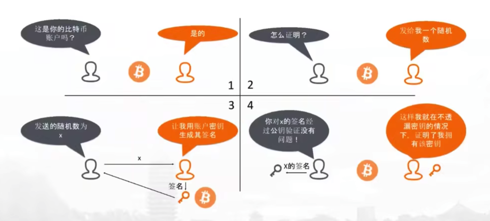

- 证明着需要证明一个 btc 账户是证明者的
- 验证者需要有证明者的公钥和自己生成一段随机数，并且将这个随机数发给证明者
- 证明着用私钥对这个随机数进行签名，并将结果发给验证者
- 验证者拿到签名与公钥和随机数做签名对比

### ZK-SNARK：Zero-Knowledge Succinct Non-Interactive Argument of Knowledge
它是一种特殊的零知识证明

- 优缺点
	- 优点
		- 非交互性
	
			证明向验证者一次性发送一个消息，两者无需进行交互，所有人都可以从 L1 上看到。
			
			这个叫做 `public verifier`
		- 简洁性
	
			验证速度快，存储空间小,只需要几百字节，即使原始输入很大，生成证明，也是很小的
- 缺点
	- 证明者产出的证明的工作量是很大的，一个匿名的转账交易，需要几秒中初始化，而验证这个交易只需要几毫秒。 
	- 目前为止，所有的 ZK-SNARK 电路全部是专用集成电路，根据不同的应用，定制不同的硬件
	- 且无法做到图灵完备
		
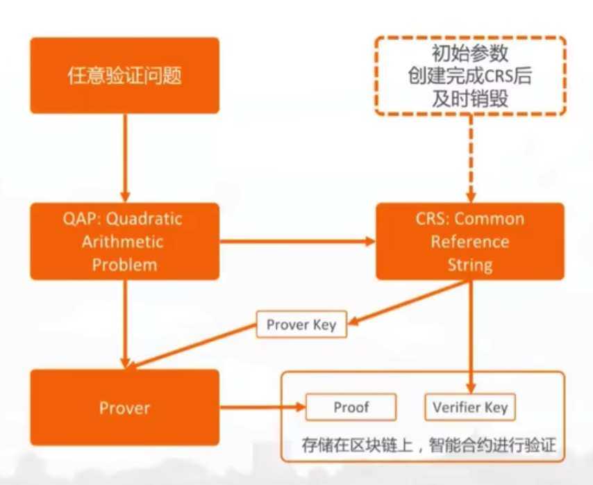

zk-snark 需要进行一次信任设置（也称为“私钥发行”）。如果私钥泄露，恶意攻击者将可以制造出假的证明，整个安全体系将崩溃。为了避免这样的风险，此过程需要最少一个可信的第三方参与（通常是一个组织或团队）来生成私钥并在之后必须销毁，这样每个参与者都没有拿到全部私钥，只要有任何一方销毁系统化的随机私钥，这个系统就是安全的。(多方签名？) 而公钥匙所有成员共享的。此私钥将用于之后的零知识证明，因此必须对其进行严格的安全管理。

- QAP 指的是“Quadratic Arithmetic Programs”（二次算术程序）

	它是一种在 SNARK 中用来编写证明算法的高级语言。它允许程序员使用多项式和算术运算来描述证明的逻辑，并且可以通过计算给定的多项式值来验证证明的真实性。
- CRS 指的是“Common Reference String”（公共参考字符串）

	它是 SNARK 中的一个基础组件。CRS 包含了所有参与 SNARK 证明的信息，例如公钥、私钥、系统参数以及用于验证证明的计算方法。它的作用是确保所有参与 SNARK 证明的方法和参数是一致的，从而保证证明的安全性。
-  CRS 建立过程
	1. 选择随机和确定性的参数，包括一个编码的系统，一个椭圆曲线和一组基本标量。
	2. 采用这些参数生成一个私钥和一个公钥以及一组受私钥控制的解密参数。
	3. 构造一个公式来描述被验证的信息，它将被用来生成一组关于被验证信息的式子。
	4. 通过使用私钥解密参数，将这些式子转换成可以用来验证的式子。
	5. 将这些式子转换为一个可以用来验证的群证明，这个群证明将被用来验证该信息的真实性。
	6. 将这个群证明和被验证的信息合并，形成一个 CRS，它可以被用来验证任何满足该信息的签名。
-  QAP 过程可以分为三个步骤：
	1. 生成 QAP

		首先，发行者根据要证明的陈述生成一个 QAP，它包含多项式、系数和变量。
	2. 生成证明

		然后，使用私钥生成一个证明，该证明表明 QAP 陈述是正确的。
	3. 验证

		最后，使用公钥验证证明，验证 QAP 陈述是正确的。
		
### ZK-SNARK 在区块链中的应用
注意，这2个不是 L2 项目，仅说明 ZK-SNARK 的应用场景

- Zcash

	Zcash 利用 ZK-SNARK, 隐藏交易信息，保护链上的交易具体信息(输入地址、输出地址、交易金额)，在不知道上面信息的情况下，Zcash 可以验证交易的合法性。
	
	与btc和eth不同， Zcash 只需要交易者证明它交易的币和金额合法存在于系统状态中，并不需要知道哪一个。
	
	Zcash 是 ZK-SNARK 的第一个广泛的应用
- Filecoin 利用ZK-SNARK ，完成复制证明(PoRep) 以及时空证明(PoSt)
	- 复制证明

		初次完成存储交易，验证存储提供者存储了数据
	- 时空证明

		随着时间推移，证明存储提供者依然持有存储原始数据
	
	Filecoin 是迄今为止部署的最大 ZK-SNARK 网络	，每天生成几百万的零知识证明。这里该项目并没有实现用户的隐私计算，而只用于该项目的共识机制。

#### ZK-Rollup 在以太坊中的应用
- zkSync
	- 基于 ZK-SNARK 实现
		- 安全依赖于初始化信任设置，与 V 神一起制定一个随机数，如下图
	
			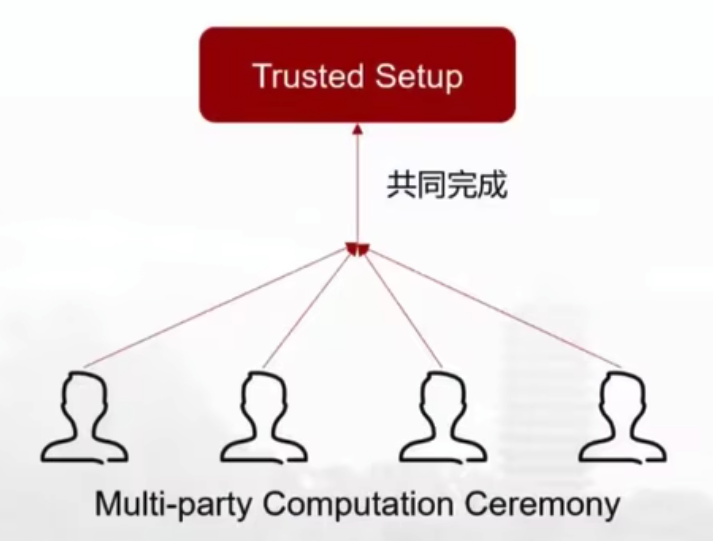
		- EVM 兼容，zkSync 编译器可以把 zkSync 的智能合约转换成 EVM 支持的操作码来实现 Solidiy 兼容 
	
			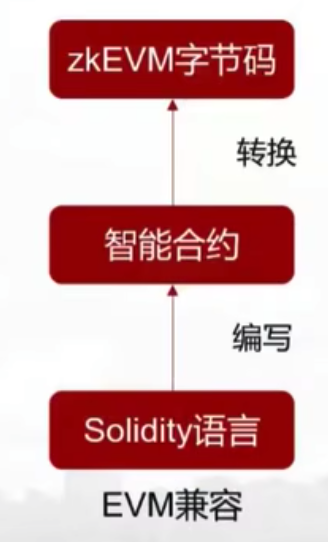
	- 数据可用性
		- 提供了两种数据可用性方案
			- L1 链上存储
				- 安全性高，需要支付一定的 Gas 费用，如下图 

				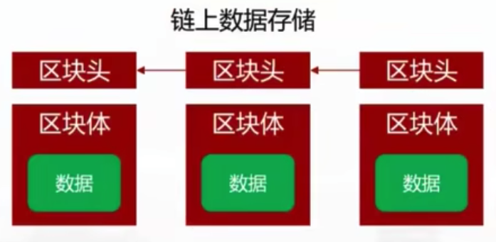
			- 非 L1 链下存储 
				- 节省 Gas 费，但可用性与L1就有差别了，牺牲一定的去中心化和安全性

				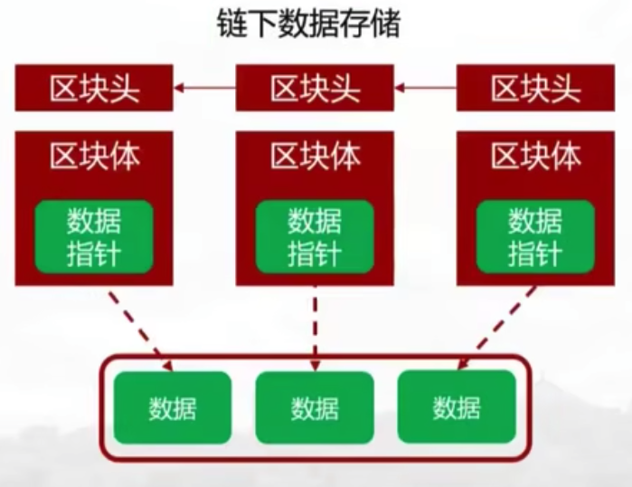 	
- STARKWARE 
	- 基于 zk-STARK 实现

		全称 Scalable Transparent Arguments of Knowledge，由 STARKWARE 团队发明，可以看做 ZK-SNARK 的升级版本，具有更强的可扩展性，允许开发人员将链上数据部分转移到链下，链下批量数据，可以打包生成一个 STARK 证明，证明发送链上后，由利益相关方可验证。
		
		- 比 zk-SNARK 优势如下
			- 透明性(Transparent)
				
				无需信任设置 (肖老师认为意义不大，因为 SNARK 多方参与，1方销毁就安全)
				
				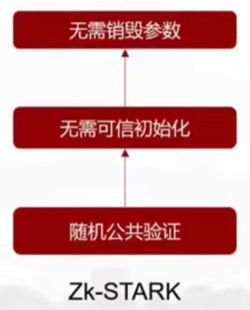 	
			- 扩展性(Scalability)
	
				降低计算复杂度，生成证明速度更快(但有争议)
			- 抗量子攻击
	
				使用抗冲突的哈希函数，提高了抵抗量子攻击的能力 ，肖老师认为意义不大
				
				- 量子计算实用比较早，其次即使有了
					- 传统 web2.0 法币支付更受到影响
					- 并且 L1 不升级也不安全，所以 L2 更不安全
					- 且加密也可以根据区块高度来升级成量子加密
			- 采用全新语言编写智能合约
				- 没有历史包袱，便于实现 EVM 无法做到的事 
		- 缺点
			- 技术成熟度、普及度低，社区、生态发展还处于起步阶段 
			-  为了 EVM 兼容性，创建了一种特定的编程语言 Cairo，运行 Stark 支持的程序。导致语言新、人少、开发学习成本高，并且不兼容 EVM, 导致当前的 Dapp 很难迁移					
				- snark
			
					 
				- stark
				
					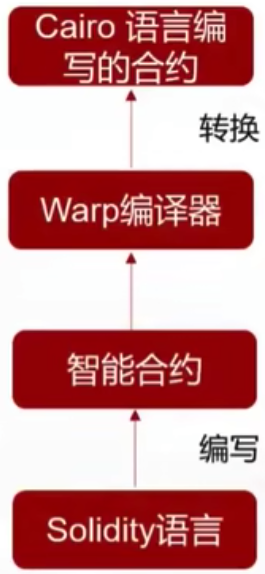
	- 数据可用性方案
		- 一样采取两种数据方案
			- L1 链上 Rollup 链上方案

				适合资金量比较大，安全要求高，且实时性要求不高的业务
				
				- 安全性
					- 最高
				- 成本
					- 消耗额外 Gas ，成本高
				- 实时性
					- 一般    
			- L1 非链上方案 validium 方案

				链下数据可用性方案是由一个中心化的 “数据可用性委员会(有声望的实体组成)” 提供安全保证，适合资金量小，安全性比较低，实时性比较高的场景，比如链游
				
				- 安全性
					- 牺牲一部分安全性
				- 成本
					- 只需要消耗少量 Gas 费，成本低
				- 实时性
					- 实时性高

## polygon
### 早期
最早的名字叫 Matic ，后来改名为 Polygon 

- 早期采用 Plasma 扩容方案,最早是 eth 早期的扩容方案，后来是因为固有弊端，如    
	- 资金退出异常复杂
	- 不兼容 DeFi 智能合约

最终逐渐退出 L2 的解决方案

### 转型 Polygon 用什么解决 L2 ？
他们认为 eth 扩容赛道当前没有成熟方案，所以并不能赢者通吃，所以导致当前状况不同的 Rollup 

- 有不同的底层设计
- 有各自的构造和优势
- 应用场景存在差异性	
- 发展路线和生态情况也不尽相同
- 所以解决方案各有优略
- eth 也是希望各种 layer2 大发展，v神公开投资多个 rollup 项目

那么带来的问题就是流动性割裂，不同 rollup 里的资金如何做到互联互通，所以 Polygon 项目方把自己定义成 Rollup L2 扩容方案的聚合器，提供一个可插拔的网络，为以太坊建设一个模块化，通用灵活的扩容框架

允许开发人员利用以太坊安全性， 创建定制的专注的应用程序的链，所以改名为 Polygon(多边形)，可以链接多种解决方案。

Polygon 区别在于其他 Rollup L2 提供一个 ALLINONE 解决方案，将多种扩容方案聚合在一起,本质上还是帮助以太坊 L1 进行扩容，来加快交易并获取更低的成本。

治理代币名称还是叫 Matic,用来投票、质押和交易费用，交易费用非常低，差不多1美分

Polygon 社区做的好，并且收购了很多 ZK-Rollup 的研发团队，来通过收购增加自己的技术实力 

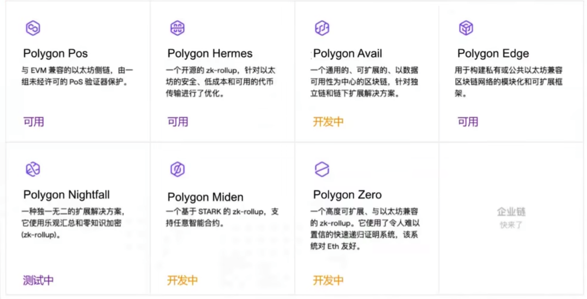

## 总结
22年8月，L2 总市值为 55亿美元，L1 以太坊市值的 15%

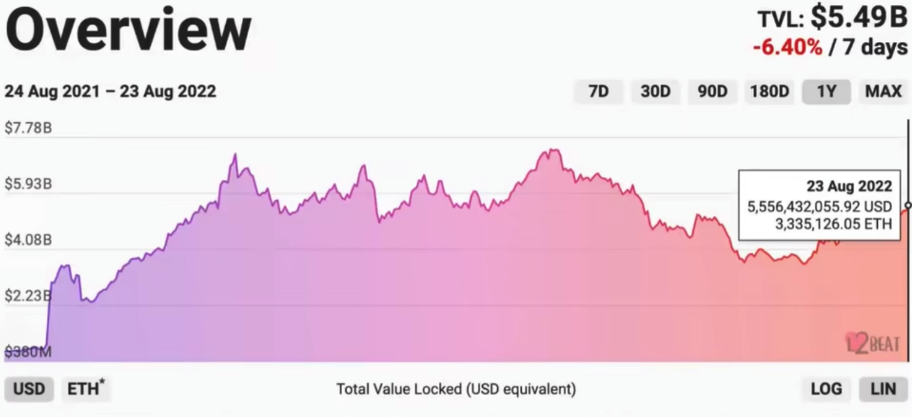
各项目的资金占比，从图中看出，OPTIMISTIC Rollup 方案占很大部分，并且竞争激烈。 V 神评价，

- 短期内
	- OPTIMISTIC Rollup 会因为与 EVM 的兼容性胜出
	- ZK Rollup 因为兼容性问题，在简单的场景胜出 
- 从中长期看
	- 随着 ZK Rollup 技术的进步，最终 ZK Rollup 会占据主导地位
	  
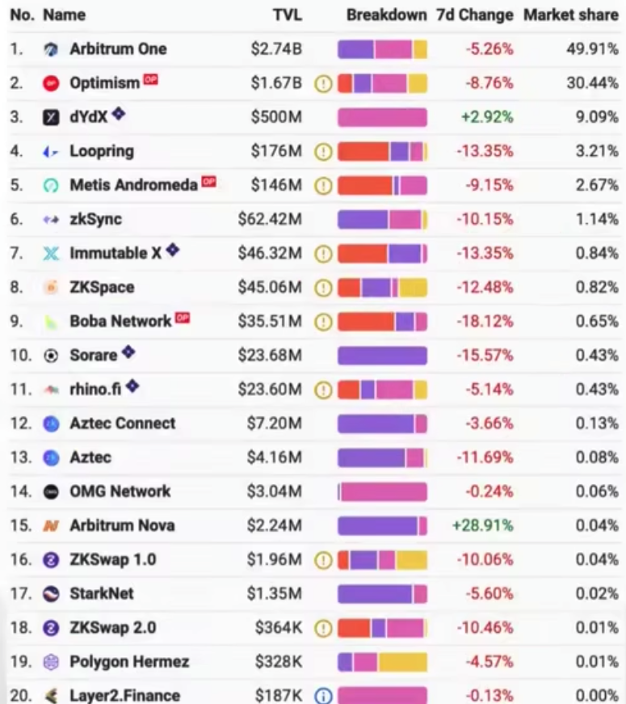
 				 	 

## 参考
[Web3新人公开课：第3讲 以太坊和Layer2](https://www.bilibili.com/video/BV1kP4y197vL/?spm_id_from=333.999.list.card_archive.click&vd_source=001dc29c0216ec8137c45550994354e9)