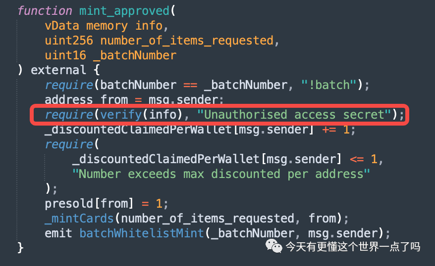
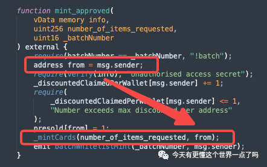
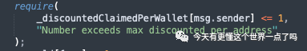

# NBA漏洞分析报告

## 背景介绍
NBA 发售了他们的 NFT 系列 The Association NFT，将240个球员各制作了75个 NFT，总共供应 18000 个，**白名单持有者可以free mint 1 个**，这句话重点圈起来，一般情况下在free mint铸币时，只需要缴纳gas费就可以mint到坐等升值，在肉眼可见的获利空间下最终白名单限制和 `mint 1` 个限制都被攻破。
### 漏洞带来的影响
- 攻破白名单

	非白名单用户也能 mint，导致
	
	- 把白名单用户的名额抢占了，因为 nft 的总量有限制
	- 其次对于花钱获取白名单资格的用户产生了不公平
- mint 数量

	直接让铸币总量减少，抢占了名额
- 对后期的运营难度成指数上升

## 漏洞分析
刚上面讲了，nba 这次有两个漏洞被攻破了，分别是 

- 白名单限制
-  mint 数量

### 白名单限制
根据以太坊特性，所有的 ABI 均可以被任何人调用，所以特殊的 ABI 接口需要进行权限控制，简单来说就是部分合约功能允许名单用户访问，而名单外的用户无权访问

白名单的常规校验方式

- 白名单的数据存于链上合约数据中
	- 在合约初始化或者运营期，被合约拥有者或超级管理员一个个的录入或者追加到白名单中
	- 在调用特殊 ABI(如铸币时)，校验一下当前用户地址能否匹配到白名单。

	方案优缺点
	
	- 优点在于直接、有效、安全、简单
	- 缺点是需要人工手动录入，而数据录入时都需要 gas 费用，成本高

	综上所属方案比较适用于静态权限管理，比如 ABI 限制特权用户使用，而非 NBA 这次的动态用户使用。
- 加密签名验证

	即一种技术难度较高，但更节省 gas 费的方式如梅克尔树这种加密签名验证，它的原理是将白名单数据不存储于在链上合约中，而是放在链下由项目方保管，当用户在官网购买 mint 权限后，对合约 mint  ABI 进行调用时，会根据用户的钱包地址和算法生成一个合约认可的有效签名，NBA 这次使用的就是加密签名方式的校验。

	
- 漏洞问题原理

	漏洞就产生于 `verify(info)` 方法中
	
	- 这里得 info 可以查看是线下签名的数据 
	- 然后合约执行铸币时，再获取当前用户的地址
	- 但当前用户和签名用户并没有进行验证，即漏洞就这样产生了

	

	这样就可以拿着已有在白名单用户的签名数据，给自己铸币。 这样就攻破了白名单限制，产生了签名重放漏洞，绕过了白名单。
- 修复方法

	只需要加了一层校验比如验证铸币的用户地址和校验白名单地址(签名地址)必须是一样的，这个漏洞就堵住了。

### mint 数量漏洞
- 漏洞原理

	在铸币的时候只验证了铸币用户已有的铸币数量是否不大于1个。但是铸币的时候，铸币的数量通过参数传递进来的，铸币时没有验证这个参数代表的铸币数量。

	
	
	- 第一次铸币的时候，铸币用户肯定还没有铸币，顺利通过验证后
	- 后面铸币逐步进入环节，只要参数传输正确，就可以随意铸币
- 修复方法

	铸币的时候，在检查白名单后，检查该地址是否已经铸币

## 基金会合约是否也存在类似漏洞

- 基金会白名单

	目前基金会铸币和销毁的白名单全部在合约层面维护，不存在本次攻击面
- 铸币数量

	目前没有铸币数量的限制。只要符合铸币用户的要求，能够 uint256 能表达出来，都可以铸币，不存在上面合约的攻击面

### 参考资料
- [深度解析：NBA的16进制合约漏洞是怎么被科学家薅秃噜皮的？](https://mp.weixin.qq.com/s/WTmegfvWEs5ws9FuEbls8Q)
