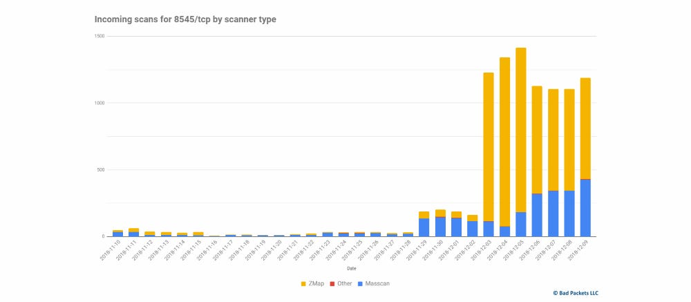
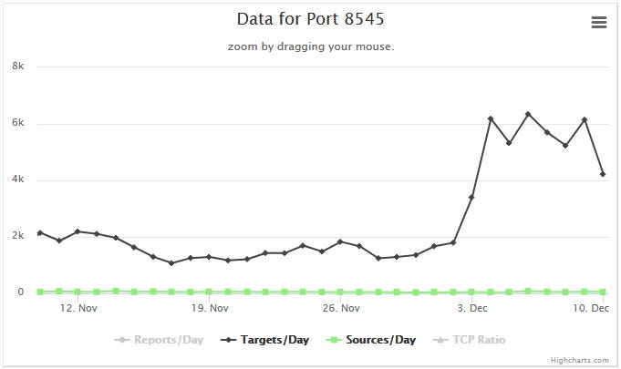

# unlock 账户攻击
## go-ethereum-issues
### 系统信息
System information
Geth version: 1.8.2
OS & Version: Linux
基于 POA 专用网络。
#### 操作
我正在使用 Mist 钱包客户端和 `-rpc myserverip:rpcport`。
我通过创世块将“余额”：“0x200000000000000000000000000000000000000000000000000000000000000”分配给两个地址。
#### 预期行为
我想将一些 ETH 从我在 geth 中创建的地址转移到我在 geth 中创建的另一个地址。

我所做的是，

- 通过命令创建了一个新帐户

		personal.newAccount()
- 假设它的 `eth.accounts[0]`
- 有人告诉我，我从同事那里收到了 10,000 ETH（用于测试）。
- 所以，当我通过命令检查余额时

		eth.getBalance(eth.accounts[0])
- 控制台显示 1e+22 表示我已成功收到硬币。
- 正如我上面写的，我想将一些 ETH 从 `eth.accounts[0]` 转移到另一个地址，所以我通过命令解锁了地址

		personal.unlockAccount(eth.accounts[0])
- 在将 ETH 发送到另一个地址之前，我再次检查了 eth.accounts[0] 的余额，它说我有 0 ETH？！

##### 重现行为的步骤
- 我试图在 geth 和 mist 之间移动 ETH
- 我试图在 geth 和 geth 之间移动 ETH
- 我试图通过另一个带有 WSL 的服务器移动ETH。

同样的事情不断发生在我身上。我已经尝试了几天来弄清楚发生了什么。

#### 其他人回答
很可能 RPC 端口打开并解锁了帐户，资金就会被发送。有机器人在做这件事。RPC 端口暴露时请不要解锁帐户。

## ZDnet 报道
在以太坊价格暴跌之前，黑客加大了对采矿设备的攻击力度,攻击者扫描在互联网上不小心暴露端口 8545 的以太坊钱包和采矿设备。

黑客已经发起了一场大规模的活动，扫描暴露在互联网上的以太坊钱包和采矿设备。

Bad Packets LLC 的联合创始人 Troy Mursch 告诉 ZDNet ，自 12 月 3 日以来，大规模扫描活动已经持续了至少一周。

攻击者正在扫描在线暴露端口 8545 的设备。这是许多以太坊钱包和挖矿设备的 JSON-RPC 接口的标准端口。该接口是一个程序化 API，本地安装的应用程序和服务可以查询挖矿和资金相关信息

从理论上讲，这个程序化接口应该只在[本地公开](https://ethereum.stackexchange.com/questions/3305/what-is-http-localhost8545/3306#3306)，但是一些钱包应用程序和挖矿设备在所有接口上都启用了它。此外，启用此 JSON-RPC 接口后，默认配置中也没有密码，并且依赖于用户设置密码。

如果以太坊钱包或挖矿设备暴露在互联网上，攻击者可以向这个强大的接口发送命令，从受害者的以太坊地址转移资金。

但是，端口 8545 的问题并不新鲜。早在 2015 年 8 月，以太坊团队就向所有以太坊用户发出了[安全警告](https://blog.ethereum.org/2015/08/29/security-alert-insecurely-configured-geth-can-make-funds-remotely-accessible/)，说明使用在互联网上暴露此 API 接口的挖矿设备和以太坊软件的危险，建议用户采取预防措施，在接口上添加密码，或使用防火墙过滤端口 8545 的传入流量。

许多矿机供应商和钱包应用程序制造商已采取预防措施限制 8545 端口的暴露，或者完全删除了 JSON-RPC 接口。不幸的是，这不是行业一致的努力，许多设备仍然在网上公开。

但是，尽管以太坊团队发出警告，但许多用户未能就这个问题检查以太坊客户端。

虽然最初这并没有那么大的麻烦，但随着以太坊的价格上涨到新的高度，对暴露的以太坊客户的扫描和攻击也是如此。2017 年 11 月、 2018 年1 月、2018 年5月和2018 年 6 月报告了针对端口 8545 的大规模扫描。

中国网络安全公司奇虎 360 Netlab 表示，这些扫描背后的一个特定组织窃取了价值超过 2000 万美元的以太坊，以 2018 年 6 月的汇率计算。

所有上述扫描都有一个共同点，那就是以太坊的价格在这些时期飙升至前所未有的高度，在 2018 年 1 月达到了惊人的 1,377 美元。

根据 Mursch 与ZDNet分享的图表，与上个月相比，扫描活动增加了两倍

在基于 ISC SANS 项目蜜罐数据的公共图表和德国数据安全公司 ZeroBS 共享的另一个图表中也可以看到同样的扫描活动增加了三倍。

使用  Shodan  快速搜索显示，近 4,700 台设备（其中大部分是 Geth 采矿设备和 Parity 钱包）目前正在暴露其 8545 端口。

此外，还有免费工具可用于通过端口 8545 利用和自动扫描和攻击以太坊客户端。

以太坊汇率可能会下跌，但这并不意味着加密货币一文不值。用户应以本文为警告，并在他们发现自己被盗一夜之前更改他们的采矿设备或钱包的配置。

## 参考
- [As soon as I unlock an address, the balance becomes 0. #17013](https://github.com/ethereum/go-ethereum/issues/17013)
- [Hackers ramp up attacks on mining rigs before Ethereum price crashes into the gutter](https://www.zdnet.com/article/hackers-ramp-up-attacks-on-mining-rigs-before-ethereum-price-crashes-into-the-gutter/)
