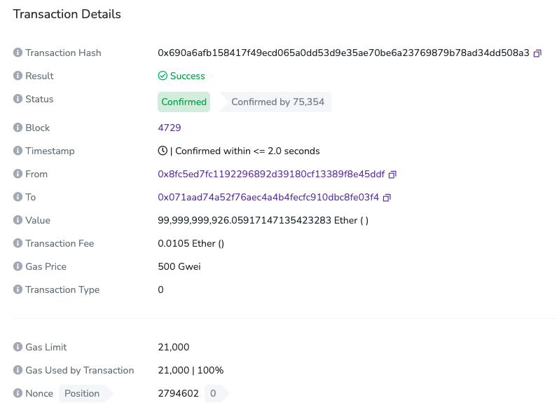
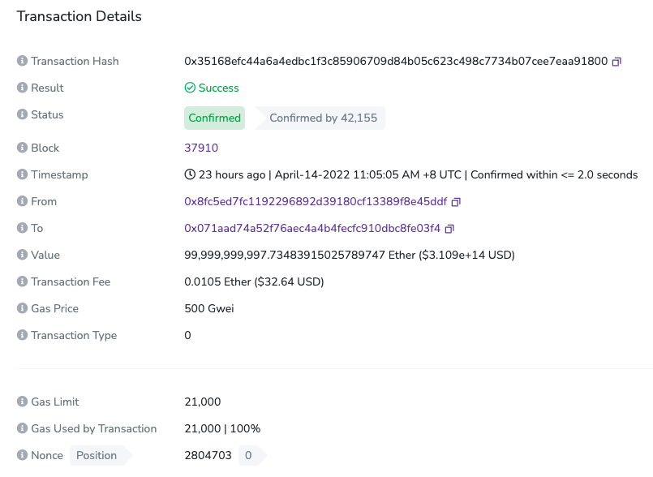
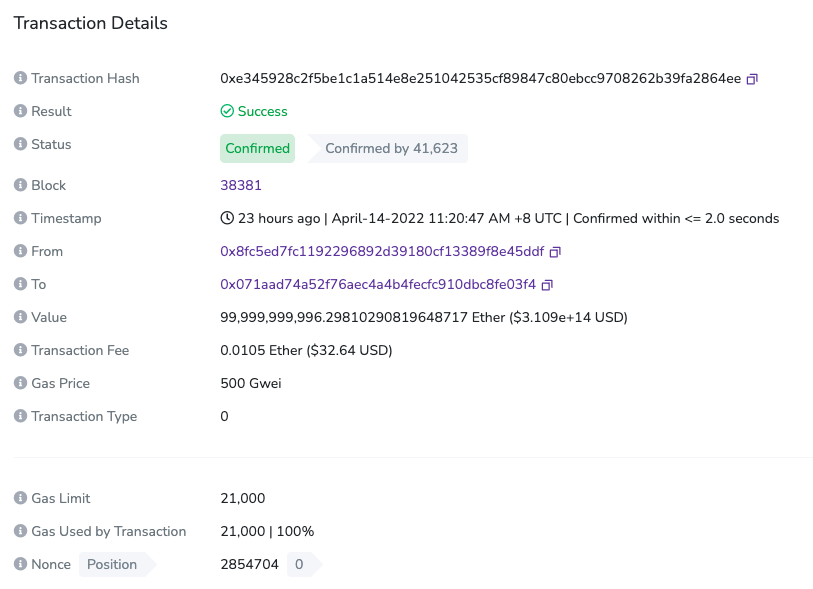
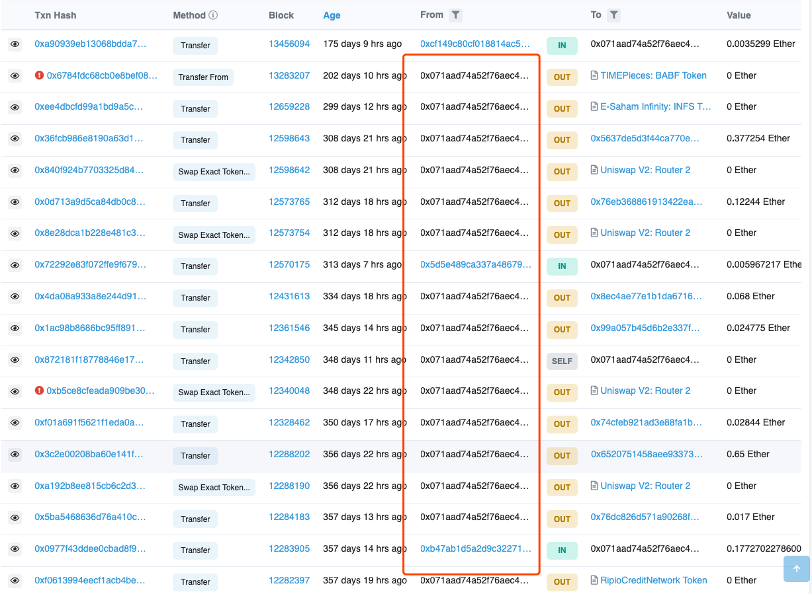

# 压测环境被 unlock 攻击
## 基础信息
- 发现时间

	2022年4月15号
- 攻击交易
	- 0x690a6afb158417f49ecd065a0dd53d9e35ae70be6a23769879b78ad34dd508a3

		
	- 0x35168efc44a6a4edbc1f3c85906709d84b05c623c498c7734b07cee7eaa91800

		
	- 0xe345928c2f5be1c1a514e8e251042535cf89847c80ebcc9708262b39fa2864ee

		
- 攻击表现

	对 eth 的压测报错，日志提示账户 gas 费用不足，从游览器查看该账户 eth 已经被 `0x071aad74a52f76aec4a4b4fecfc910dbc8fe03f4` 账户转走，并且在2天前还操作过1次，询问内部同事均无操作
- 攻击分析
	- 上公网查看 `0x071aad74a52f76aec4a4b4fecfc910dbc8fe03f4`

		发现该账户1年钱就存在，并且有较频繁的小额交易，判定被攻击
		 
		 
- 查询攻击原因

	通过查询以下参考类网站发现，是因为压测需要配置 peer 本地账户 unlock ，并且应该开放 rpc 给压测工具调用来进行签名压测。但是该 peer 又对外开放了 rpc 访问来测试在压测过程中通过钱包转账是否被影响。
- 解决方案
	- 生产级部署需求如下
		- 共识节点
			- 需要 unlock 本地节点账户的节点，不允许开放 rpc 和ws 等远程请求访问接口
		- 应用节点
			- 应用需要打开 rpc 和 ws 的节点给应用的
				- 需要使用参数限制，限制访问节点的网络地址。比如 localhost 或者内网ip
				- 禁止在该节点上使用 unlock 账户
		- 严格控制链本币操作
			- 开发人员使用生产链币，数量和使用方式必须严格审查，防止外泄造成攻击可能性
		- 共识节点和应用节网络控制
			- 共识节点和应用节点之间进行网络控制，如果查明应用节点被攻击，共识节点可以通过中断网络来防止其他业务受影响   
	- 测试节点
		- 测试 unlock 账户必须不能与生产业务账户重叠使用 
- 后续
	- 阅读了所有以太坊基金会重要的安全报告，防止其他简单攻击面存在
	- 对以太坊基金会合约上报出来的攻击面，后面会进行重新审查 
		
## 参考
- [以太坊基金会 blog-安全部分](https://blog.ethereum.org/category/security/)
- [Security Alert – cpp-ethereum’s account unlocking problem not yet fixed [Now fixed]](https://blog.ethereum.org/2016/06/03/security-alert-cpp-ethereums-account-unlocking-problem-not-yet-fixed/)
- [As soon as I unlock an address, the balance becomes 0. #17013](https://github.com/ethereum/go-ethereum/issues/17013)
- [Hackers ramp up attacks on mining rigs before Ethereum price crashes into the gutter](https://www.zdnet.com/article/hackers-ramp-up-attacks-on-mining-rigs-before-ethereum-price-crashes-into-the-gutter/)
	
