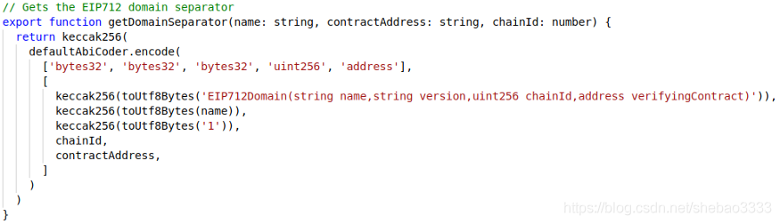
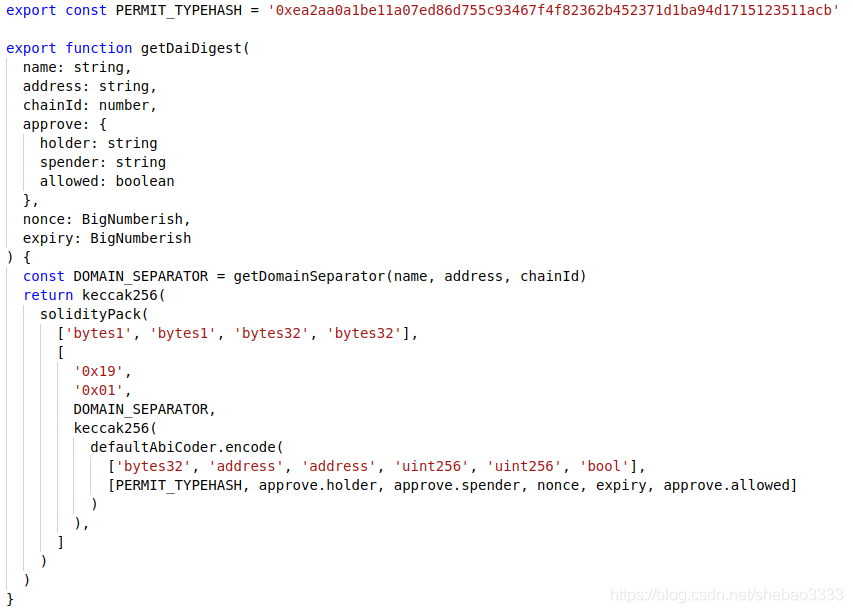
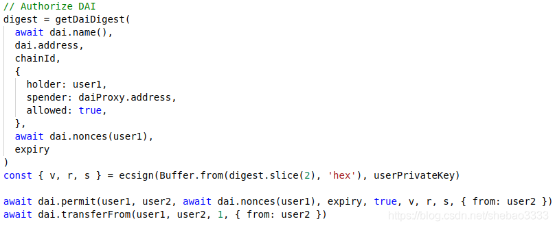

# 如何实现无 GAS 以太坊交易
## 目的(自述)
eth 以及其侧链使用交易时，均需要使用 gas，这个虽然保护了以太坊交易的安全性，但给业务开展带来了极大的影响。

讨论无 gas 或者代理合约接口，就是为了解决本问题而存在。

## 背景知识
- 正常的以太坊交易

	用户钱包私钥被用来签名发送到以太坊网络的交易，在这个过程中运用了一些密码学技术来识别用户身份并存入变量 `msg.sender`，这是以太坊中访问控制的基石。
- 无 gas 交易

	交易签名是链下生成的，无需消耗任何 gas。一旦签名完成，就可以将交易发送给其他人替签名用户执行，同时也替由其他人支付 gas 费用。当然这个不是免费的，经常会已非原生链币的 erc20 作为支付 gas 费发送给替他支付的人。 

	使用签名的合约函数通常就是一个普通的函数，不过支持传入额外的签名参数。例如在 `dai.sol` 中
	
	- 可以看到如下的 `approve` 函数
	
			function approve(address usr, uint wad) external returns (bool)
			
	- 同时也可以看到 `permit` 函数，它和 `approve` 同型函数，处理结果一致，但它支持额外的签名参数

			function permit(address holder, address spender, uint256 nonce, uint256 expiry, bool allowed, uint8 v, bytes32 r, bytes32 s) external
	- 这两个函数是如何处理 `allowance` 映射

			# 如果调用 `approve` 方法，那么就意味着允许 `spender` 账号操作,不超过wad个你持有的代币
			function approve(address usr, uint wad) external returns (bool)
			{
			  allowance[msg.sender][usr] = wad;
			  …
			}
			
			# 如果把一个有效签名给了其他人，那么那个人就可以通过调用 permit 方法 来允许 spender 账号操作不超过wad个你持有的代币。
			function permit(
			  address holder, address spender,
			  uint256 nonce, uint256 expiry, bool allowed,
			  uint8 v, bytes32 r, bytes32 s
			) external {
			  …
			  allowance[holder][spender] = wad;
			  …
			}
		因此基本上来说，无 gas 交易/代理交易背后的模式就是制作一个签名，别人用这个签名就可以用你的身份安全地执行一个特殊的交易，就像你授权别人执行一个方法。这其实就是一种代理模式。			

## 无 gas 交易/代理交易规范
- EIP712 [https://github.com/ethereum/EIPs/blob/master/EIPS/eip-712.md](https://github.com/ethereum/EIPs/blob/master/EIPS/eip-712.md) 

	描述了为合约方法生成签名的通用方式。其他的 EIP 则描述如何在特定的用例中运用 EIP712。
	
- EIP2612 [https://github.com/ethereum/EIPs/blob/master/EIPS/eip-2612.md](https://github.com/ethereum/EIPs/blob/master/EIPS/eip-2612.md)

	描述如何将 EIP712 签名用于 `permit` 方法，该方法和 ERC20 代币中的 `approve` 方法实现相同的功能

如果只是想实现一个已经定义过的签名方法，比如为 `MetaCoin` 合约添加支持签名的 `approve` 方法，那么阅读 EIP2612 就够了。当然更简单的办法就是直接继承一个已经实现了 EIP2612 的合约。

## 签名构成(dai.sol 代码讲解)
这章将研究 `dai.sol` 中的一种无 gas 交易/代理实现，这会帮助我们更清晰地理解其内部机制。`dai.sol` 的无 gas 实现是在 EIP2612 之前完成的，因此有一些区别。不过这不是大问题。

它允许 `dai` 持有者在链下计算签名并交由 `spender` 代为执行 `approve` 方法，而不是由 `dai` 持有者直接调用 `approve` 方法。

整个实现包含4个部分：

- `DOMAIN_SEPARATOR`(最终生成标识智能合约的哈希)

	代码 `DOMAIN_SEPARATOR` 以及相关的变量

		string  public constant name     = "Dai Stablecoin";
		string  public constant version  = "1";
		bytes32 public DOMAIN_SEPARATOR;
		
		constructor(uint256 chainId_) public {
		  ...
		  DOMAIN_SEPARATOR = keccak256(abi.encode(
		    keccak256(
		      "EIP712Domain(string name,string version," + 
		      "uint256 chainId,address verifyingContract)"
		    ),
		    keccak256(bytes(name)),
		    keccak256(bytes(version)),
		    chainId_,
		    address(this)
		  ));
		}
	`DOMAIN_SEPARATOR` 就是一个用来唯一标识智能合约的哈希，它是利用一个标记 EIP712 域（合约名称、版本、链ID、部署地址）的字符串构造的。

	所有这些信息在构造函数中进行哈希并存入 `DOMAIN_SEPARATOR` 变量，`dai` 持有者在生成签名时需要使用这个变量值，并且在执行 `permit` 方法时需要匹配。`DOMAIN_SEPARATOR` 可以确保一个签名仅对单一合约有效。
- `PERMIT_TYPEHASH`

	`PERMIT_TYPEHASH` 是函数名（首字母大写）以及全部参数（包括类型和参数名）的哈希，其目的是清晰界定签名的适用方法。

	在 `permit` 方法中需要处理签名，如果适用的 `PERMIT_TYPEHASH`  并不是针对这个方法的，交易就会回滚。这样就确保了一个签名仅可以用于特定的方法。
- `nonces` 

	`nonces` 映射：

		mapping (address => uint) public nonces;
	`nonces` 应用用来注册一个特定的 `dai` 持有者已经使用的签名数量。当创建签名时，需要包含一个 `nonces` 值，当执行 `permit` 方法时，`nonce` 必须匹配该持有者已经使用的签名数量。这一措施用来确保签名仅使用一次。
- `permit`
	- 首先 `permit` 方法是 `dai.sol` 中实现的一个函数，它允许使用签名来实现 `approve` 相同的功能。

			// --- Approve by signature ---
			function permit(
			  address holder, address spender,
			  uint256 nonce, uint256 expiry, bool allowed,
			  uint8 v, bytes32 r, bytes32 s
			) external

		`permit` 方法包含很多参数。这些参数是计算签名需要的数据，以及签名数据 `v、r、s`。
	
		传入创建签名的参数看起来很傻，但是这是必须的。因为从签名中能够恢复出来的只有签名创建者的地址。合约需要所有这些参数以及恢复出来的创建者地址来确保签名的有效性。
	- 然后合约利用这些参数计算一个摘要数据。`dai` 持有者需要在链下进行同样的计算，这是生成签名的必要环节：

			bytes32 digest =
			  keccak256(abi.encodePacked(
			    "\x19\x01",
			    DOMAIN_SEPARATOR,
			    keccak256(abi.encode(
			      PERMIT_TYPEHASH,
			      holder,
			      spender,
			      nonce,
			      expiry,
			      allowed
			    ))
			  ));

		使用 ecrecover 方法以及`v、r、s`，合约可以从签名中恢复出地址。如果这就是 `dai` 持有者的地址，那么我们就知道参数对上了，也就是说`DOMAIN_SEPARATOR、PERMIT_TYPEHASH、nonce、holder、spender、expiry` 以及 `allowed` 都对。
	- 如果对不上，就拒绝这个签名：

			require(holder == ecrecover(digest, v, r, s), "Dai/invalid-permit");

		这个地方需要注意。签名涉及很多参数，其中有些参数比较晦涩，例如 chainid（ DOMAIN_SEPARATOR 的一部分）。其中任何参数对不上都会导致签名被拒绝，这使得链下签名的调试非常困难。
	- 现在我们指导持有者已经授权了这个方法调用。接下来我们需要确认签名没有被滥用。
		- 首先检查当前时间是否在 `expiry` 之前，这样可以让授权仅在特定时间点之前有效

				require(expiry == 0 || now <= expiry, "Dai/permit-expired");
		- 也可以检查具有这个 `nonce` 的签名还没有使用过，这样就可以确保一个签名只能使用一次

				require(nonce == nonces[holder]++, "Dai/invalid-nonce");
		- 现在通过了！`dai.sol` 更新 `allowance`，触发事件，就这些简单的工作了。
		
				uint wad = allowed ? uint(-1) : 0;
				allowance[holder][spender] = wad;
				emit Approval(holder, spender, wad);		
`dai.sol` 合约使用二进制方式处理 `allowance`，在我们提供的代码中则使用了更传统的方式来处理 `allowance`。

## js 创建链下签名
用三个步骤来复制智能合约的 `permit` 方法中的逻辑,参考工程的 `signatures.ts` 文件。

- 创建 DOMAIN_SEPARATOR

	下面的函数将创建 `DOMAIN_SEPARATOR`。它和 `dai.sol` 构造函数中的代码功能一样，不过使用的是 `javascript` 以及 `ethers.js` 中的 `keccak256、defaultAbiCoder` 和 `toUtfBytes`。这个函数需要代币名称、部署地址以及链ID，并假设代币版本为"1"：

	
- 创建摘要

	下面的函数将为特定的 `permit` 调用创建摘要。注意 `holder、spender、nonce` 和 `expiry` 都作为参数传入。同时传入一个 `approve.allowed` 参数，虽然可以始终将其设置为 `true`。注意这里的 `PERMIT_TYPEHASH` 我们是直接从 `dai.sol` 拷贝过来的。
				
	
- 创建交易签名

	一旦我们得到摘要，那么进行签名就相对容易多了。我们使用 `ethereumjs-util` 中的 `ecsign` 对移除 `0x` 前缀的摘要数据进行签名。注意这个步骤需要用户私钥。

	

## 注意
- 在调用 `permit` 时是如何使用之前创建摘要的那些参数的。只有这样签名才会有效。
- 另一点需要注意的是，在这个代码片段中 `user2` 只调用两个交易。
	- `user1` 表示 `dai` 持有者，他是创建摘要并进行签名的账号。然而 `user1` 并不需要消耗任何gas。
	- `user1` 将签名给`user2`
	- `user2` 使用这个签名来执行 `permit` 方法以及 `transferFrom` 方法。
	- 在 `user1` 看来，这就是一个无gas交易，他不需要消耗任何 gas。	
			
## 参考
- 源码 [https://github.com/alcueca/ERC20Permit/tree/master/contracts]( https://github.com/alcueca/ERC20Permit/tree/master/contracts)
- How To Code Gas-Less Tokens on Ethereum [https://hackernoon.com/how-to-code-gas-less-tokens-on-ethereum-43u3ew4](https://hackernoon.com/how-to-code-gas-less-tokens-on-ethereum-43u3ew4)