# 私有区块链的以太坊客户端选择:从权威证明的角度进行评估
## 叙述
企业正在利用私有区块链实现他们的分布式账本使用案例，因为与公共网络相比，它更安全、高效和可靠。我们评估了以太坊客户端的行为和性能，即 geth、OpenEthereum (Parity) 和 Hyperledger Besu，以及他们在私有生态系统中的 Clique、Aura 和 IBFT 2.0 的权威证明共识算法。在此过程中，我们针对现有测试方法的不足，提出了一种新的测试方法。我们在 Microsoft AzureCloud 中执行测试，以分析来自不同以太坊聚焦参数的每个客户端的行为。我们使用通用智能合约交易进行测试，因为私营企业大多开发 dapp 或基于智能合约的应用程序，而不是传统的加密货币转账。我们提出了一种新的特定于以太坊的负载均衡中间件，并将其集成到我们的测试工具中，以实现无故障的统一可靠的交易分发。我们在测试过程中分析每个客户端的瓶颈及其根本原因。最后，我们还评估了在测试中经常注意到的问题，比如 Geth 的 EVM 层的节点停滞，Clique 的频繁分叉以及 Clique 的分叉死锁。

### 索引术语
- 区块链
- 以太坊
- 权威证明(POA)
- Geth
- OpenEthereum (Parity)
- Besu
- 性能

## 第一节 介绍
近年来，私有区块链爆炸式增长，因为许多企业开始将其用于从汽车数据认证、银行或供应链等各种不同的用例。我们专注于以太坊，因为它是成功的公共区块链，具有强大的智能合约功能，可以部署到私有网络。特别是，以太坊已经获得了[1]的突出地位，并被许多考虑到安全、验证用户、数据隐私和快速交易处理等问题的组织认为是私有链。在私有链中，权威证明(PoA)共识比工作量证明(PoW)共识更受青睐，因为它有利于验证参与者、确定性共识、性能和效率。我们通过使用[2]来分析最流行的以太坊客户端，这是 Geth, OpenEthereum(Parity) 和 Besu，每个都有不同版本的权威验证算法用于私有区块链部署。这些实现分别是 Clique by Geth, Aura by openethereum，而 Hyperledger Besu 实现了相同的 eclique 及其提出的 IBFT 2.0。尽管每个客户端在共识算法以及实现语言、数据库和设计选择上有所不同，但它们遵循相同的以太坊白皮书[3]。

本文的总体贡献如下:

- 1) 我们分析和评估现有的性能基准工作和基于以太坊的客户可用的开源测试工具。我们开发了一个新的工具来解决现有工作中发现的问题。
- 2) 在我们通用工具的帮助下，我们在 EVM (以太坊虚拟机)上测试了标准的智能合约交易行为，这可以用于基于其他用例的智能合约交易。我们理解每个客户的行为 Geth, Parity 和 Besu 与以太坊参数的 Block Gas, BlockPeriod 和交易类型。
- 3) 我们测试每个客户区块链的可伸缩性并通过开发一个集成在我们的测试工具中的新型负载均衡架构来进一步测试它。它由一个事务处理中间件组成，用于在节点之间均匀分布事务，而不会出现故障
- 4) 我们分析了基于区块链的性能的理论极限并找出每个客户端的瓶颈及其根本原因。我们报告了 Geth 在 EVM 层的节点停滞、Clique 算法频繁分叉以及 Go-Ethereum 社区[4][5][6] 的分叉死锁问题，这些问题正在被跟踪和解决。对于 Parity 和 besu 的其他客户端，我们在这里报告问题和根本原因，因为前者是一个更正式的实现。
- 5) 我们将开发的测试工具与专注于以太坊的负载均衡中间件一起发布在[7]上。

论文的组织结构如下:

- 第二节介绍了前人的作品。
- 第三节介绍了以太坊区块链的性能因素和现有工具的评估。它还解释了所提出的工具体系结构及其评估。
- 第四节从不同角度评估 PoA 区块链性能。并提出了以太坊环境下负载均衡中间件的新架构。它进一步分析了每个客户的各种问题和根本原因。
- 第五节对本文进行了总结，并展望了未来的工作。

## 第二节 以前的工作
### A 相关工作介绍
针对私有链的以太坊客户端的性能研究有一些贡献。在[8]中，作者使用 `profiling tool pprof` 分析了 Geth 中实现的私有 PoA 以太坊区块链的性能问题。虽然他们从 Geth 的功能层面进行了分析，但他们没有考虑其他客户端，也没有从多个角度分析以太坊，比如

- 块 Gas 限制
- 块周期
- 事务类型
- 可伸缩性

在[9]中，作者比较了以太坊客户端的 `Geth 's Clique` 和 `Parity 's Aura` 的PoA算法，并通过复制拜占庭节点证书模拟了对两者的成功克隆攻击。他们还解决了针对这种攻击的对策，以避免加密货币的双重支出问题。这项工作更关心的是攻击矢量，而不是性能或行为方面的实现。在[10]中，作者基于一致性、可用性和分区容忍定理，对 Clique 和 Aura 共识进行了更直接的比较。说明 Clique 以最终一致性满足可用性和分区容忍度，Aura 以不一致性满足可用性和分区容忍度。然而，他们在没有实验工作的情况下进行了定性分析。在[11]中，作者对以太坊客户端(Geth和Parity)与私有区块链中不同交易数量的性能进行了比较。他们的分析还捕获了两个客户机基于 CPU 和 ram 的资源消耗。它们通过改变事务数量和 RAM 容量来执行测试。但是，在测试中考虑的共识选择、交易类型和 Gas 影响并没有被提及，这些都是值得关注的。

作者还评估 [12] 了私有网络中两个客户端 Parity 和 Geth 的性能。他们开发了一个电子投票应用程序，使用智能合约存储和处理投票数据。他们的测试结果包括

- 未提到瓶颈的事务的吞吐量
- 延迟
- 可伸缩性
- 以及其他参数的影响

在工作[13]中，作者使用工作证明和权威证明算法跨不同参数(如块周期、块大小等)评估 Geth，但没有比较其他客户端。此外，工作中出现的瓶颈是一个普遍现象，没有提到具体的根本原因。除了上述的工作，我们进一步评估其他现有的工具和工作，在即将到来的 III-B 部分

### B. 以太坊
以太坊是一个带有图灵完整语言的区块链，用来编写智能合约。它是一个由帐号及其转换组成的状态机。以太坊中的所有交易都在其虚拟机(EVM)中执行。根据 EVM 上的事务类型或操作的复杂性，将进行称为 gas 的计算。每一项作业都通过 GAS 和 GAS  价格的乘积获得预定的GAS 成本。这一成本对于避免电网停机问题至关重要。GAS  成本可以吸引执行帐户支付加密费用，但在我们的私人网络中，这被忽略，因为将 GAS 价格设置为 1。

### C.客户端软件
基于以太坊白皮书的客户端有几种类型，但我们认为活跃的社区支持的客户端如下:

- 1) Geth:它是一种用 Go 编程语言编写的客户端，通过社区的贡献在以太坊生态系统中已经相当成熟。它使用 LevelDB 数据库来维护状态。
- 2) OpenEthereum: 也被称为 parity，它是在 rust 编程语言中构建的，使用 RocksDB 作为数据库。在它的文档 [14] 中提到它在块处理和节点不同步方面比 Geth 快3倍，这是我们在 revalue3 中考虑的。
- 3) Besu :它是用 Java 编程语言编写的客户端，使用 RocksDB 作为数据库。与其他客户相比，它是一个相对较新的进入者，但却有与 Geth 相当的积极贡献

### D.权威证明共识协议
- 算法比较表

	属性|Clique|Aura|IBFT 2.0
	---|---|---|---
	客户端|Ceth,Besu|Parity|Besu
	分叉率|倾向于更多分叉|少分叉|不分叉
	分叉确定性|最终|不能保证|不分叉
	活性(容错)|是|是|小于 Clique
	事物处理速度|高|低|小于 Clique

在上面的表中，我们简要地比较了在每个客户端中为以太坊上下文中的私有可信参与者实现的 Clique[15]、Aura[16] 和 IBFT 2.0 共识 [17] 的PoA 协议。虽然所有的算法都受到实用拜占庭容错共识的启发，但 poa 算法具有更好的消息通信复杂度。在所有这些方法中，从一组验证器中选择一个密封器来创建一个块，但密封协议的方式不同。

- 在 Clique 的例子中

	创建一个区块后，打包者会立即获得其他验证者的批准，但很容易分叉，因为恶意参与者可以延迟自己的同意，并强迫自己的区块。
- 然而，在IBFT 2.0中

	每一轮区块创建的消息交换都涉及到准备、准备和提交阶段，这使得它更慢，但更不容易发生分叉。在N个参与者的系统中，Clique just 需要 N/2个多数或诚实的参与者，而 IBFT 需要2N/3个参与者，这既保证了前者的更多的独立性，也在更多的分叉上存在缺陷。
- Aura 的功能与 Clique 类似，但对于每个区块的创建，它都要经过三个回合，比如区块提议、区块接受和最终接受。

## 实验测量
### A 性能影响因素
在本节中，我们讨论了影响以太坊交易处理性能的主要因素。每秒事务数或吞吐量(TPS)被认为是在达成一致意见后，可以在网络中验证、执行、最终确定和确认的事务数。在以太坊环境中，除了 PoA 私有链的共识机制外，影响处理的主要因素是

- 1 块大小或块 GAS 限制

	交易被整理成一个固定块大小的块。在以太坊中，它是通过设置区块 Gas 限制来衡量的，因为每笔交易不是根据内存大小来衡量的，而是根据前面 `II-B` 部分解释的 Gas 来衡量的。更高的区块 Gas 限制可以容纳更多的交易在一个区块，这直接影响执行和验证时间。
- 2 交易类型

	由于交易是根据 Gas 计算的，交易越复杂，它的 Gas 也就越高。例如，与乘法运算相比，两个数字的加法可以吸引更少的 Gas 。
- 3 块周期

	由于所有的 PoA 算法在每个固定的时间间隔包装块，更高的块周期会增加吞吐量的延迟。较低的区块周期可以增加交易的吞吐量，但会影响链的一致性，导致更多分叉，我们将在评估中看到。平衡和短的阻塞周期对于网络适应来自验证器的共识时间也是必不可少的。

除了上述基于以太坊的传统因素之外，另一个需要注意的因素是分叉的创建。由于共识问题而产生的分叉可能会影响吞吐量，因为事务有可能附加到一个无效的分叉链，并最终被丢弃。这也是我们在 Clique 算法中经常出现的 `IV-F` 部分解释这个问题的原因

### B 分析现有的测试工具
在本节中，我们将从性能的角度讨论现有的知名的测试以太坊网络的框架或工具。

- 1) ChainHammer:

	它是一个用 python 开发的测试套件[18]，用于创建区块链网络，部署智能合约，并使用不同类型的同步和异步方法测试交易负载。它主要是为 PoA 网络客户端(如Geth, Parity以及quorum)开发的。
- 2)Calliper:

	它是 HyperledgerLinux 基金会开发的[19]工具，具有不同的工作负载和区块链网络(如Geth, Besu和Fabric)的适配器。它是在 `Node.js` 中开发的，带有速率控制器，用于向网络发送事务，然后观察区块链网络的吞吐量。
- 3) BlockBench:

	在这项工作中，作者为 Geth, Parity 和 Fabric 的不同工作负载分析私有区块链的 viaAPIs 框架做出了贡献。它是用 `c++` 和 `Node.js` 开发的，带有宏观和微观的智能合约基准机制
	
### C 建议的测试工具架构
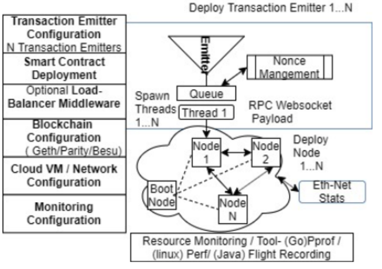	

在研究了上述各种工作后，我们希望消除这些缺点，进行全面而统一的性能测试。我们建议的工具解决了早期工具中注意到的主要问题，如图所示。

- 1) 事务发送模式:

	发送事务的异步多线程生产者-消费者模式比其他工具更好，因为它有效地控制了客户端的负载。每个客户机都有一个用于发送事务的RPC API 接口。为了测试每个客户端二进制文件的负载限制，必须在多线程版本中尽可能快地切换。为了控制事务触发的速率和可靠性，我们在生产者-消费者模型中将请求放在队列中，由进程处理。
- 2) Nonce 管理

	根据以太坊改进提案155来避免重放攻击，每个事务必须有增量 Nonce。每个事务的当前时间都是由工具按照增量顺序管理的，这与其他工具或工作的情况不同。当它被主动发送到一个事务的有效负载时，它加速了事务的处理，并且避免了重复的 nonce 事务，无序的或空白的无效事务。有效的 nonce 是由工具通过相互排除 nonce 增量过程有效计算的，即使在多个事务发送实例附加到单个区块链节点的情况下，也要避免重复。
- 3) 通信协议的选择

	第三个最重要的考虑因素是 RPC API 协议的选择，原始 web 套接字的性能比原始 HTTP 或常用的 web3 库要好得多。对于每个 HTTP 请求，它会打开一个新的连接，而在 web 套接字中，这个连接会一直保持，直到在开始打开一个新的连接时，只需要一个握手就会显式关闭。此外，在我们的工具中使用的原始 web 套接字连接比其他工具使用的 web3 库包装器避免了瓶颈。
	
建议的工具包括一个用于我们测试平台的监控层，包括用于 Go (Geth) 的 `pprof` 、用于 `Linux(open以太坊)` 的 `Perf` 和用于 `Java (Besu)` 的飞行记录器。在这一层之上，我们使用 `Terraform` 开发了云网络配置层来部署 `Azure vm` ，并通过覆盖网络将它们连接起来。下一层是区块链部分，使用 `shell` 脚本和 `python` 来配置网络和生成块来部署网络中所需的节点。在下一层，我们在工具中开发了一个负载均衡中间件，用于统一和可靠的事务分发，这将在 `IV-E` 节中解释。接下来，我们有一个智能合约部署层，这取决于所需的负载，然后是用于发送事务的客户端层。

### D.针对提议的测试工具评估现有的测试工具，以了解它们在3节点以太坊网络上的性能。
区块链网络设置在 `MicrosoftAzure` 云平台上，有3个节点的 `B2ms Ubuntu-18 `虚拟机，每个节点有 2 个 `VCPU` 和 `8GB RAM` 。与本地网络相比，选择云网络的原因是符合大多数部署都在标准云上的生产场景。虽然 `cloudnetwork` 的 `RTT` 比我们在前面的工作[21]中注意到的本地网络多5倍，但我们选择它来模拟真实的企业场景。我们通过部署一个简单添加的智能合约功能来测试每个工具，如下所示

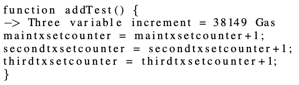

即使选择的函数是简单和表面的，它可以直观地外推到其他函数的 token，如平衡增量或汽车用例，如汽车里程数数据存储等。上述功能在 evm 级引入 38149 个 Gas 。在共识级别，我们配置 2 秒作为出块周期，块 Gas 限制为 228894000 以获得 6000 个交易的块大小，交易池队列大小为 10000000。Linux 64bit 区块链 

client stested 的版本如下:

- i) Geth - 1.9.18 
- ii) OpenEthereum - v3.0.1 
- iii) Besu 1.5.0。

评估的现有工具的版本是

- i) ChainHammer-V59 
- ii) caliper 0.4.0 
- iii) Blockbench(源代码于2020年7月)	

我们以异步多线程模式启动测试工具，其中 100 个线程来自另一台 Ubuntu 机器，配置与区块链节点类似。100 个线程的原因是由于 RPC API 的限制，因为我们在现有的工具中面临着 nonce 或 HTTP timeout errors 的问题。现有的测试工具都没有通过将 nonce 发送到事务的有效负载来预先管理它。相反，他们把它留给客户端二进制来计算，这减慢了事务处理的速度。我们在3次迭代中对每个工具执行 600000 个事务的测试。Blockbench 工具无法测试，因为工具套件遇到 web3 库错误。Calliper 无法用于测试奇偶校验，因为它没有实现适配器。此外，ChainHammer 工具不是为 Besu 客户开发的，所以结果不包括他们。

- 评估现有的测试工具

	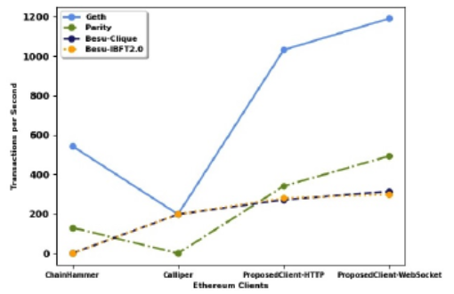
	
图中的结果表明，Chainhammer 的每秒事务比 Calliper 的 Geth 更好，主要是因为它在没有多模块结构的情况下非常高效。其次，Chainhammer 工具套件中的事务触发比 Nodejs Calliper 更好。除了Geth之外，Parity 和 Besu 等其他客户端无法在这些结果中直接进行比较。在我们提议的工具中，我们可以统一比较所有以太坊客户端。我们从我们所提出的工具的结果中注意到原始的 web 套接字比 http 性能更好。此外，我们可以注意到 Geth 的表现比其他客户端要好得多，这将在后面的章节中进一步阐明。我们可以从这个结果中假设，提议的工具解决了早期的问题，并帮助更好地测试我们的以太坊客户端。我们已经公开了这个工具[7]。

### E.使用建议的工具进行压力测试
在本节中，我们在建议的工具中逐步改变线程数，从 10 到 10000，其余配置与进一步的压力测试相同。 

- 可以看到 Geth 的线程数以及图3中其他客户机的线程数在性能上的改进。这是因为工具中的多线程将更多的事务填满节点。这表明 Geth 和 Parity 的性能呈线性增长，前者由于其更好的设计实现以及 Clique 的共识效率而更加陡峭。
- 在 Besu 的 Clique 或 IBFT 2.0 实现中，由于客户端本身的实现存在瓶颈，而不是在 `IV-F` 节讨论的共识级别上，因此与线程变体没有明显的区别。

在 10000 个线程的情况下，Gethand Parity 似乎是稳定的， 但由于设计和实现的限制，Besu 失败了。由于更好的缓存和 EVM 实现。Geth的表现比其他的要好。另外，Geth 性能更好的另一个原因是 `clique 共识` 比 Aura 或 IBFT2.0 具有更好的消息通信复杂性和即时密封性

- 自定义客户端测试工具线程变化性能

	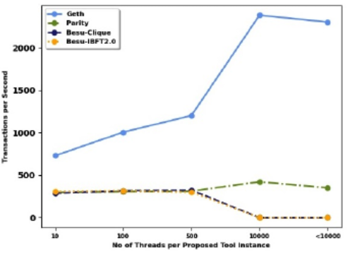
	
我们推断 100 个线程是所有客户端测试的最佳配置，因为我们注意到 Besu 对于更高的线程(如10000)会遇到稳定性问题。我们不能测试超过 10000 个线程，这对于所有客户机来说都是相当大的，因为我们受到 Linux 系统的 Ulimit 的限制。对于超过 10000 个线程的测试，我们注意到使用 pprof 进行分析时，Geth 的性能上限为每秒 2300个事务(tps)。在功能级别，我们注意到它增加了事务池，并在 `EIP155 ` 签名上消耗了时间，这是导致其他几个问题的根本原因。我们在下面的 `IV-F` 部分讨论了我们注意到的客户之间的瓶颈问题和根本原因，我们已经负责任地向社区报告了[4][5][6]

## 根据事实或事实对以太坊特定性能的评估
在本节中，我们改变客户端二进制文件的不同以太坊特定性能参数，并研究它们的行为。我们测试与前面第 `III-D` 相同的 `Add` 智能合约事务并保留区块链网络配置。
### A.区块 Gas 限制
区块 Gas 限制是一个重要的性能因素，需要根据交易的 Gas 量变化其比例进行分析。我们将阻塞周期设置为 2 秒，工具线程设置为 100，因为我们关注的是阻塞 Gas 限制对网络的影响。

试验是在不同比例的块 Gas 极限从 1000 到 15000 的增量上进行的。考虑添加 3000 个交易的比例，那么区块 Gas 限为 38149 * 3000 = 114447000，强制区块大小为 3000 个交易。更多的区块气限容纳更多的交易包含在区块中，但同时也增加了 EVM 上的交易执行时间。

从下图的结果中可以看出，当块 Gas 比为 6000 时，Geth 以 1196 tps 的速度达到了最佳性能。Parity 和 besu 在相同区块 Gas 限下的性能低于 Geth，因为他们的EVM 和交易池的执行效率不如前者

- 块 Gas 限制调参测试

	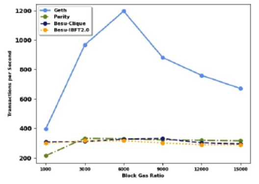

对于更高的块 Gas 限制(如9000或以上)，由于并发执行更多的事务，所有客户端二进制文件的性能都会下降。瓶颈在客户端的 EVM 级别和影响阻塞处理的事务池中被注意到。

在 Geth V1.9.12 的早期版本中，对于区块 Gas 比大于 10000 的区块 Gas ，我们发现 EVM 层的交易执行出现了停顿，我们向 Go 以太坊团队 [4] 报告了这个问题。在测试本文中提到的新版本时，我们注意到团队随后解决了这个问题。因此，我们确定 6000 块 Gas 比为进行测试的最佳参数。在 `IV-F` 中，我们讨论了由于较高的 Gas 限而导致产量下降的行为问题

### B 块时段
- 块时段调参测试

	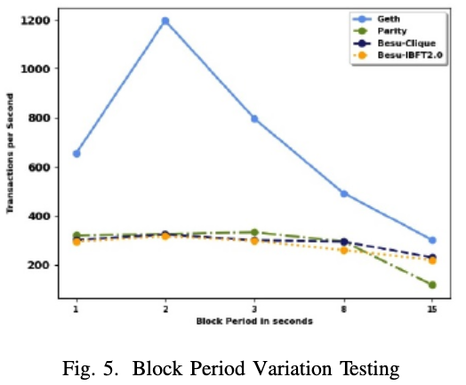

在这个测试中，我们以1到15秒不等的分段周期来评估客户的分段打包共识机制。我们保留了与之前测试相同的配置，相同的添加事物(Addtransaction)，以及固定为 6000 的块Gas 比。

从上图的结果中注意到，在1秒的区块周期，时间窗口太短，(Geth)Clique 共识面临稳定性问题。我们向 go 以太坊团队报告了在极低区块期[5]的稳定性问题，这在 `IV-F` 节中进行了讨论。不稳定性意味着在短时间内，由于节点无法同步和处理共识，链上会出现很多分叉和重组。

但是在块周期为2秒时，它在共识级别上稳定了所有不同的客户端二进制文件。因此，2秒的阻塞周期是最快和稳定的，因为更高的阻塞周期可以延迟阻塞的包装

### C 交易类型
- 交易类型调参测试

	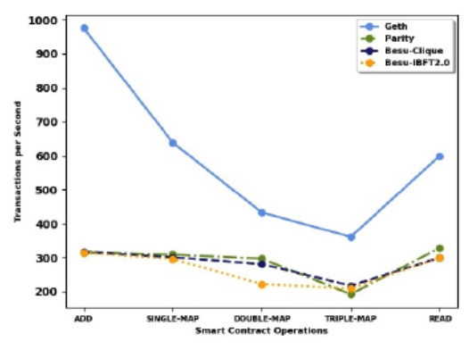
	
在这个测试中，我们了解了基于复杂性或 Gas 成本的不同交易类型的影响。选择智能合约交易的意义在于，它是一个简单的 Map 操作，执行基于关键值的功能，但我们在测试中包含这些操作的原因反映出，这些操作是企业在智能合约中作为通用数据存储结构调用最多的操作。另一个事务是Add操作，如前面第 `III-D` 所述，它具有重要意义。事务的类型如下:

- 1) 添加上一节中的 Test
- 2) 映射测试，它的功能像一个散列映射操作来存储智能合约中的对，并增加复杂度，子测试像
	- a) single 
	- b) double
	- c) triple

	映射操作，就像下面的代码片段。
- 3) 读取操作，不耗 Gas，不复杂。在本次测试中，我们保留了最佳的阻塞周期 2 秒和阻塞限 Gas 率 6000 的参数。

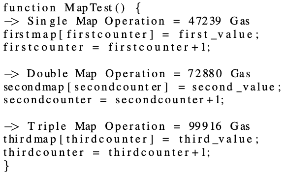

从上图中的测试结果推断，随着复杂性的增加，所有客户机的性能都成比例地下降。Geth对事务变化有明显的影响，但在其他客户端，它是逐渐的，他们已经限制在实现级别，处理的事务较小的限制。读操作与事务处理无关，不需要任何开销，但在客户端上的性能是一样的，geth 的性能要优于其他操作。作为这个测试的结果，我们最终确定了最佳的性能参数，区块周期为2秒，区块 Gas 限比为 6000，以及具有交易类型的行为。然后，我们继续使用这些参数来测试网络在不同客户机上的可伸缩性。我们将在 IV-F 进一步讨论这种行为

### D. 可扩展性
- 可扩展行为测试

	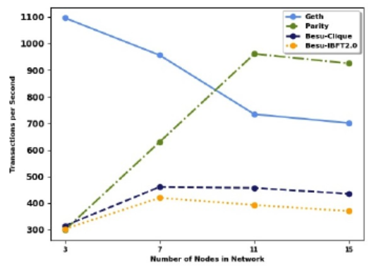

在本节中，我们保留了Add 操作，区块周期为2秒，区块气体比为6000，并从 3 个节点到 15 个节点了解性能方面的可扩展性。

我们注意到，从上图的结果中，Geth 的 Clique 性能随着节点的增加而下降，因为每个块中有更多的验证器可以验证，从而增加了分叉的概率。

除 Geth 在3个节点以上吞吐量下降外，Parity 和 Besu 在可扩展性方面都有初步的提高。在多达11个节点的奇偶校验和多达7个节点的 Besu 中，我们注意到一个增加，然后下降。这是由于节点的增加，增加了更多事务的接收，因为它避免了之前测试中注意到的api 层的瓶颈。但即使这个问题解决了，它也有一个内部处理瓶颈，更多的节点增加了共识层面的通信复杂性，这导致了增长后的衰落。与 Aura 的两轮信息相比，Clique 只有一个信息轮，这使得它更轻松。但是在 Clique 中，每一轮都有更多的验证器出现，以防出现包装故障。

在 Parity 的 Aura 中，每个区块只存在一个选择的验证器，这使得它不太容易分叉，但它也会缩小。对于 Besu 来说，由于算法的效率，Clique 的性能比 IBFT 2.0 更好，但 Besu 总体上仍然面临实现级别的瓶颈，在前面的部分，这在可伸缩性测试中进一步恶化，使得它不如 Geth 和 Parity，后者将在 ` IV-F` 讨论

### E.负载均衡器中间件集成与建议的工具
在以太坊中，事务的负载均衡与传统的事务有一个特殊性，因为它们受到客户端的某些设计决策的限制。通过监控事务队列来进行额外的、有效的负载计算，以及有效地处理节点故障，这些需求导致了我们开发新的中间件，并与前面 `III-C`  解释的测试工具集成。

在本节中，我们将描述事务触发在区块链网络中的节点之间的负载均衡分布。这种架构对企业来说更有意义，因为事务触发将更可靠、分布更均匀。即使节点可能发生故障或崩溃，队列也会存储传入的请求，并在最终恢复时进行处理。

- 以太坊客户端负载均衡中间件架构

	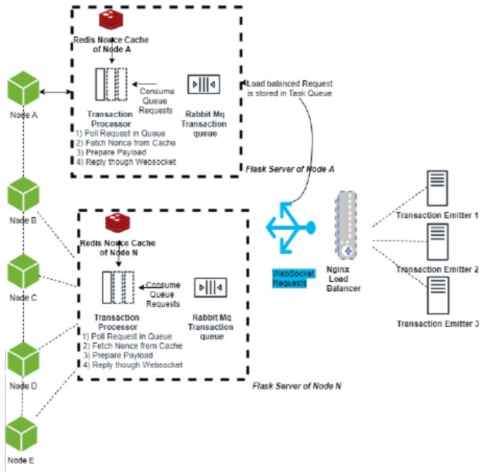

如上图所示，我们为每个具有 web 服务端点的节点创建一个中间件层。这一层将由工作在 FIFO 消息请求队列上的工作人员组成，该队列由基于轮循的负载均衡器转发。所有的 worker 通过在它们之间增加一个互斥的缓存来管理 nonce，以避免重复错误。

我们测试了Addtransaction和最佳参数，区块周期为2秒，区块气体限制比为6000，平衡节点数量从3到15不等。下图突出显示了该体系结构的测试结果

- 负载均衡行为测试
	
	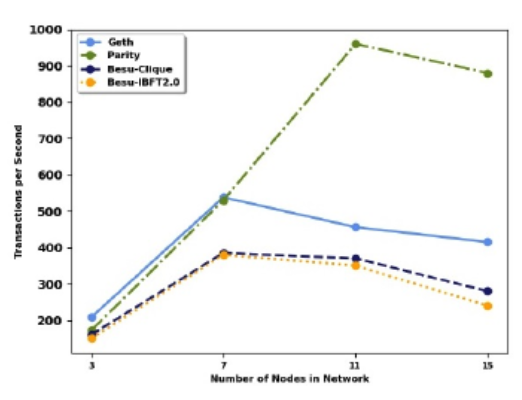

与以前的不是用负载均衡测试相比，总体上吞吐量更低，因为我们在未来的工作中有这种架构的限制。它的队列模型和即时管理的设计限制了到达网络的事务。因此，一般来说，与更适合奇偶校验和 Besu 的早期节点相比，节点的接收率更低。它在负面意义上匹配了他们的 API 级别瓶颈。Geth 在7个节点上拥有最大的性能，而 Parity 的性能随着节点数量的增加而提高，达到11个节点，类似的行为在 `IV-D` 的早期测试中解释过

### F.问题和根本原因分析
在本节中，我们详细讨论了瓶颈、稳定性问题，并指出了我们向社区报告以引起他们注意的根本原因。

- 1) 理论理想情况:

	根据以太坊白皮书[3]一个有N个参与者的同步网络，通过考虑理想情况，我们可以理论上计算吞吐量。例如，在增加交易的情况下，假设网络设置了一个 `572235000` 的区块 Gas 限额，包括每个区块的 `15000` 笔交易。我们还考虑了 2 秒的阻塞周期。那么理论上，我们应该通过以下公式推导 
	
		[块 Gas 限制/交易 Gas 消耗]/出块时间周期 = 交易TPS
- 客户端观察到的问题和根本原因
		
	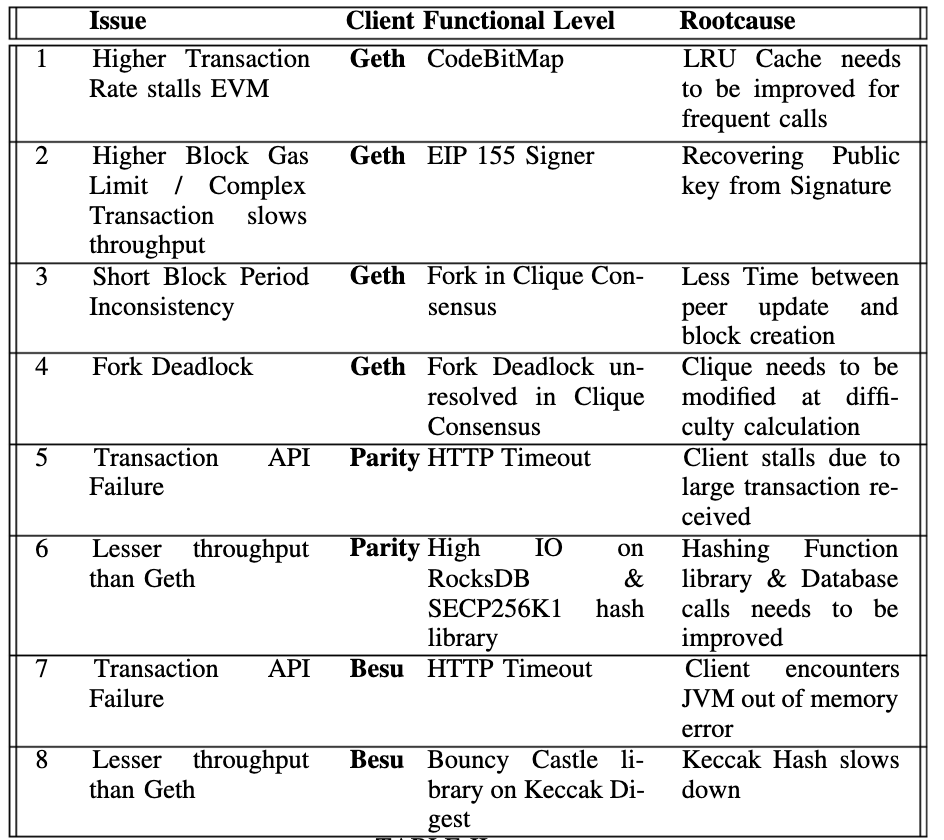

在理想情况下，通过计算应该是每秒 7200 个事务，但我们在所有客户机上得到的吞吐量要小得多，我们将在下面讨论。在上表中，我们列出了我们在客户中遇到的各种问题以及我们对每个问题的分析。我们使用分析工具调试每个问题，`pprof` for Geth 用 Go 语言实现，perf 基于 Rust 语言实现 Parity，然后使用 Java 飞行记录仪调试 Besu。

- 1) Geth 问题:

	在 Geth 中，当接收到许多事务时，EVM 层见证了频繁的智能合约调用被执行。由于 LRUcaching 无效，重复的智能合约交易执行速度变慢。当我们在 `Geth V1.9.12` 中向 `Go-Ethereumcommunity` 报告这个问题时，随后在 V1.9.18 中修复了这个问题。
	
	下一个问题是使用 pprof 处理超过 6000 块 Gas 限制和三重地图智能合约交易的吞吐量下降，这是由于 Ecrecover 功能从 EIP155 签名中恢复公钥导致的，需要改进。
	
	此外，在1秒的低块周期情况下，我们注意到链上有更多的分叉，这影响了吞吐量，归因于接收事务的同步操作和块创建过程之间的短时间。
- 2)  Parity 问题

	在 Parity 中，API 超时和较小吞吐量这两个问题是相互关联的。
	
	由于事务处理效率低，当事务请求泛滥时，它会填满 HTTP 连接池并导致超时。低吞吐量的原因是 RocksDB 操作过多，需要合理处理，因为这会导致大量 IO 消耗。另一个原因是 libsecp256k1 库使用了消耗时间和队列事务的 forECDSA 签名。图书馆需要检查，他们应该考虑替代。

- 3) Besu 问题

	Besu 也有类似的问题，比如在整个测试过程中出现的吞吐量较低和API故障。在Besu 中，Java 虚拟机发生内存不足的错误，因为许多进程卡在一个 kecakhashing 函数上。通过注意飞行记录仪配置文件，我们观察到 BouncyCastle for kecak 散列中的一个库的使用，该库需要改进以提高吞吐量的效率。
- 4) Clique 共识分叉问题

	在我们之前的测试中，我们注意到网络分叉问题和链重组。在《Clique》中，分叉是通过遵循最沉重的难度链来解决的，但有些问题仍然没有解决。在分叉过程中，节点必须在困难求和权重最高的链之间进行选择。
	
	但假设一条链在区块号 N 处有链a和链B的分叉，总难度一直到 N 为 x。
	
	- 链 a 产生了两个连续的块，高度 N+1，难度为1和2。
	- 链 B 也产生两个连续的块，高度 N+1，难度2和1。

	不属于任何高度为 N 的分支的节点无法在两个分支之间做出决定，从而导致死锁的情况。这是 clique 需要解决的问题之一，通过动态难度值而不是1或2 [6] 来修改分叉难度
	
## 五 结论与未来工作
在这项工作中，我们从权威证明 (POA) 的角度从性能和行为的角度全面分析了以太坊客户端。我们用现有的测试工具对其进行了评估，并分析了早期工作的不足之处。为了评估客户端的行为和性能，我们设计了一种改进的测试工具和一种新颖的基于以太坊的负载均衡中间件。在这个过程中，我们发现问题并公开报告他们的根本原因，需要由社区解决。Geth 似乎比它的同类更好，但是频繁分叉需要在 Clique 上进行稳定工作，而 parity 和 besu 则需要像前面讨论的那样提高吞吐量。我们研究的未来工作将进一步扩展我们的工具，用于以太坊 EVM 上下文中的操作码级别的安全和智能合约行为分析。负载均衡架构需要在当前和队列管理层面进一步优化，以提高性能测试。

## 参考
- [1] P. Fraga-Lamas和T. Fern´andez-Caram´es，“Ethereum by the numbers–june 2020”，Consensys 博客，2020年7月。
- [2] Ethernodes，“Ethereum mainnet statistic”，ethernodes.org, 08 2020。
- [3]以太坊，“以太坊白皮书”，[https://ethereum.org/en/whitepaper/](https://ethereum.org/en/whitepaper/)，07 2020。
- [4] C. N. Samuel，“Geth-node stalled at evm layer”，2020。(在线)。可用 [https://github.com/ethereum/go-ethereum/issues/21158](https://github.com/ethereum/go-ethereum/issues/21158)
- [5] “Geth-block period 1 fork”，2020。(在线)。可用: [https://github.com/ethereum/go-ethereum/issues/21191](https://github.com/ethereum/go-ethereum/issues/21191)
- [6] “Geth-clique poa 问题”，2020年。(在线)。可用:[https://github.com/ethereum/go - ethereum/issues/18402issuecomment-637328489](https://github.com/ethereum/go-ethereum/issues/18402)issuecomment-637328489
- [7] “建议的客户端工具”，2020年。(在线)。可用:[https://github.com/distributedledgerexperiments/EthereumTestingTool](https://github.com/distributedledgerexperiments/EthereumTestingTool)
- [8] K. Toyoda, K. Machi, Y. Ohtake, and A. N. Zhang，“私有授权证明以太坊区块链的功能级瓶颈分析”，IEEE Access, vol. 8, pp. 141 611-141 621, 2020
- [9] P. Ekparinya, V. Gramoli和G. Jourjon，“克隆对权威证明的攻击”，第27届年度网络和分布式安全研讨会，2019年2月，第1-5页。
- [10] S. De Angelis, L. Aniello, F. Lombardi, A. Margheri和V. Sassone，“Pbft vs 权威证明:将上限定理应用于许可区块链”，2017年01。
- [11] S. Rouhani和R. Deters，“私有区块链中以太坊交易的性能分析”，在2017年第8届IEEE软件工程与服务科学(ICSESS)国际会议上。IEEE, 2017, pp。70 - 74。
- [12] P. M. Dhulavvagol、V. H. Bhajantri和S. toad，“考虑电子投票应用的区块链以太坊客户端性能分析”，《程序计算机科学》，第167卷，第2506-2515页，2020年
- .[13] M. Sch¨affer、M. Di Angelo和G. Salzer，《私有以太坊区块链的性能和可扩展性》，2019年08年，第103-118页。
- [14]“Parity 技术- openethereum /Parity 性能分析”，[https://www.parity.io/performance-analysis/](https://www.parity.io/performance-analysis/)， 07 2020。
- [15] P. Szil´agyi，“Eip-225:派系权威证明共识协议，以太坊改进建议，没有。eip 225,“2017年03。(在线)。可用: [https://eips.ethereum.org/eips/eip-225](https://eips.ethereum.org/eips/eip-225)
- [16] open以太坊基金会，“光环-权威回合- wiki”，08 2020.[在线]。可用:[https://openethereum.github.io/wiki/Aura](https://openethereum.github.io/wiki/Aura)
- [17] R. Saltini和D. Hyland-Wood，“Ibft 2.0:用于最终同步网络的 Ibft 区块链共识协议的安全且实时变体”，2019年。
- [18] A. Krueger，“链锤以太坊基准测试”，07 2020。(在线)。可用:[https://github.com/drandreaskrueger/chainhammer](https://github.com/drandreaskrueger/chainhammer)
- [19]超级账本基金会，“超级账本卡尺”，07 2020。(在线)。可用:[https://hyperledger.github.io/caliper/](https://hyperledger.github.io/caliper/)
- [20]t.t.a.dinh，王俊杰，陈国强，刘瑞麟，黄宝昌，黄国良。Tan，“区块链:分析私有区块链的框架”，载于2017年ACM数据管理国际会议论文集，2017年，第1085-1100页。
- [21] C. Naves Samuel, S. Glock, D. Bercovitz, F. Verdier和P. Guitton-Ouhamou，“汽车数据认证问题:有效区块链架构解决方案的观点”，第11届IEEE信息技术、电子和移动通信会议(IEM-CON 2020)，加拿大温哥华，2020年11月。

## 原文
[Choice of Ethereum Clients for Private Blockchain: Assessment from Proof of Authority Perspective](https://www.researchgate.net/publication/352718717_Choice_of_Ethereum_Clients_for_Private_Blockchain_Assessment_from_Proof_of_Authority_Perspective)

	 

	

			

	
	

