# 精通以太坊
## 快速术语表
- 账户 Account

	包含地址、余额、随机数以及可选存储和代码的对象。账户可以是合约账户或外部拥有账户（EOA，externally owned account）.
	- 外部拥有账户 EOA
	
		外部拥有账户，Externally Owned Account. 由或为以太坊的真人用户创建的账户。
	- 合约账户 Contract account
	
		包含代码的账户，每当它从另一个账户（EOA 或合约）收到交易时执行。
- 地址 Address

	一般来说，这代表一个 EOA 或合约，它可以在区块链上接收（目标地址）或发送（源地址）交易。更具体地说，它是 ECDSA 公钥的 Keccak 散列的最右边的 160 位，表现为  16进制的 40 个字符长度，在前面加上 “0x” 字符。
- 断言 Assert

	在 Solidity 中，assert(false) 编译为 0xfe, 是一个无效的操作码，用尽所有剩余的燃气（Gas），并恢复所有更改。 当 assert() 语句失败时，说明发生了严重的错误或异常，你必须修复你的代码。 你应该使用 assert 来避免永远不应该发生的条件。
- 大端序 Big-endian

	一种数值的位置表示形式，最高有效位放在最前面。对应小端序（little-endian），最低有效位在前。
- 比特币改进提议 BIPs

	比特币改进提议，Bitcoin Improvement Proposals。比特币社区成员提交的一组提案，旨在改进比特币。例如，BIP-21 是改进比特币统一资源标识符（URI）方案的建议。
- 区块 Block

	区块是关于所包含的交易的所需信息（区块头）的集合，以及称为 ommer 的一组其他区块头。它被矿工添加到以太坊网络中。
- 区块链 Blockchain

	由工作证明系统验证的一系列区块，每个区块都连接到它的前任，一直到创世区块。这与比特币协议不同，因为它没有块大小限制；它改为使用不同的燃气限制。
- 编译 Compiling

	将高级编程语言（例如 Solidity）编写的代码转换为低级语言（例如 EVM 字节码）
- 共识 Consensus

	大量节点，通常是网络上的大多数节点，在其本地验证的最佳区块链中都有相同的区块的情况。 不要与共识规则混淆。
- 共识规则 Consensus rules

	完整节点为了与其他节点保持一致，遵循的区块验证规则。不要与共识混淆。
- 拜占庭分叉 Byzantium Fork

	拜占庭是大都会（ Metropolis ）发展阶段的两大分叉之一。它包括 EIP-649：大都会难度炸弹延迟和区块奖励减少，其中冰河时代（见下文）延迟1年，而区块奖励从5个以太坊减至3个以太坊。
- 君士坦丁堡 Constantinople

	大都会阶段的第二部分，2018年中期的计划。预计将包括切换到混合工作证明/权益证明共识算法，以及其他变更。
- 前沿 Frontier

	以太坊的试验开发阶段，从2015年7月至2016年3月。
- 家园 Homestead

	以太坊的第二个发展阶段，于2016年3月在1,150,000区块启动。
- 大都会阶段 Metropolis Stage

	大都会是以太坊的第三个开发阶段，在2017年10月启动。
- 宁静 Serenity

	以太坊第四个也是最后一个开发阶段。宁静还没有计划发布的日期。
- 合约创建交易 Contract creation transaction

	一个特殊的交易，以 “零地址” 作为收件人，用于注册合约并将其记录在以太坊区块链中（请参阅“零地址”）。
- 去中心化自治组织 DAO

	去中心化自治组织 Decentralised Autonomous Organization. 没有层级管理的公司和其他组织。也可能是指2016年4月30日发布的名为“The DAO”的合约，该合约于2016年6月遭到黑客攻击，最终在第 1,192,000 个区块激起了硬分叉（代号 DAO），恢复了被攻击的 DAO 合约，并导致了以太坊和以太坊经典两个竞争系统。
- 去中心化应用 DApp

	去中心化应用 Decentralised Application. 狭义上，它至少是智能合约和 web 用户界面。更广泛地说，DApp 是一个基于开放式、分散式、点对点基础架构服务的 Web 应用程序。另外，许多 DApp 包括去中心化存储和/或消息协议和平台。
- 契约 Deed

	ERC721 提案中引入了不可替代的标记标准。与 ERC20 代币不同，契约证明了所有权并且不可互换，虽然它们还未在任何管辖区都被认可为合法文件，至少目前不是。
- 难度 Difficulty

	网络范围的设置，控制产生工作量证明需要多少计算。
- 数字签名 Digital signature

	数字签名算法是一个过程，用户可以使用私钥为文档生成称为“签名”的短字符串数据，以便具有签名，文档，和相应公钥的任何人，都可以验证
	
	- （1 ）该文件由该特定私钥的所有者“签名”
	- （2）该文件在签署后未被更改。
- 椭圆曲线数字签名算法 ECDSA

	椭圆曲线数字签名算法（ Elliptic Curve Digital Signature Algorithm，ECDSA ）是以太坊用来确保资金只能由合法所有者使用的加密算法。
- 以太坊改进建议 EIP

	以太坊改进建议，Ethereum Improvement Proposals，描述以太坊平台的建议标准。 EIP 是向以太坊社区提供信息的设计文档，描述新的功能，或处理过程，或环境。有关更多信息，请参见 https://github.com/ethereum/EIPs（另请参见下面的 ERC 定义）。
- 熵 Entropy

	在密码学领域，表示可预测性的缺乏或随机性水平。在生成秘密信息（如主私钥）时，算法通常依赖高熵源来确保输出不可预测。
- 以太坊注释请求 ERC

	以太坊注释请求 Ethereum Request for Comments. 一些 EIP 被标记为 ERC，表示试图定义以太坊使用的特定标准的建议。
- Ethash

	以太坊 1.0 的工作量证明算法。更多信息，参见 https://github.com/ethereum/wiki/wiki/Ethash.
- 以太 Ether

	以太 Ether，是以太坊生态系统中使用的本地货币，在执行智能合约时承担燃气费用。它的符合是 Ξ, 极客用的大写 Xi 字符.
- Event

	事件允许 EVM 日志工具的使用，后者可以用来在 DApp 的用户界面中调用 JavaScript 回调来监听这些事件。更多信息，参见 http://solidity.readthedocs.io/en/develop/contracts.html#events。
- 以太坊虚拟机 EVM

	Ethereum Virtual Machine, 基于栈的，执行字节码的虚拟机。在以太坊中，执行模型指定了系统状态如何在给定一系列字节码指令和少量环境数据的情况下发生改变。 这是通过虚拟状态机的正式模型指定的。
- EVM汇编语言 EVM Assembly Language

	字节码的人类可读形式。
- 后备方法 Fallback function

	默认的方法，当缺少数据或声明的方法名时执行。
- 水龙头 Faucet

	一个网站，为想要在 testnet 上做测试的开发人员提供免费测试以太形式的奖励。

- Ganache

	私有以太坊区块链，你可以在上面进行测试，执行命令，在控制区块链如何运作时检查状态。
- 燃气 Gas

	以太坊用于执行智能合约的虚拟燃料。以太坊虚拟机使用会计机制来衡量天然气的消耗量并限制计算资源的消耗。参见“图灵完备”。 燃气是执行智能合约的每条指令产生的计算单位。燃气与以太加密货币挂钩。燃气类似于蜂窝网络上的通话时间。因此，以法定货币进行交易的价格是 gas （ETH /gas）（法定货币/ETH）。
- 燃气限制 Gas limit

	在谈论区块时，它们也有一个名为燃气限制的区域。它定义了整个区块中所有交易允许消耗的最大燃气量。
- 创世区块 Genesis block

	区块链中的第一个块，用来初始化特定的网络和加密数字货币。
- Geth

	Go语言的以太坊。Go编写的最突出的以太坊协议实现之一。
- 硬分叉 Hard fork

	硬分叉也称为硬分叉更改，是区块链中的一种永久性分歧，通常发生在非升级节点无法验证升级节点创建的遵循新共识规则的区块时。不要与分叉，软分叉，软件分叉或Git分叉混淆。
- 哈希值 Hash

	通过哈希方法为可变大小的数据生成的固定长度的指纹。
- 分层确定钱包 HD wallet

	使用分层确定密钥生成和传输协议的钱包（BIP32）。
- 分层确定钱包种子 HD wallet seed

	HD钱包种子或根种子是一个可能很短的值，用作生成HD钱包的主私钥和主链码的种子。钱包种子可以用助记词表示，使人们更容易复制，备份和恢复私钥。

- 冰河时代 Ice Age

	以太坊在200,000区块的硬分叉，提出难度指数级增长（又名难度炸弹），引发了到权益证明 Proof-of-Stake 的过渡。
- 集成开发环境 IDE (Integrated Development Environment)

	集成的用户界面，结合了代码编辑器、编译器、运行时和调试器。
- 不可变的部署代码问题 Immutable Deployed Code Problem

	一旦部署了契约(或库)的代码，它就成为不可变的。修复可能的 bug 并添加新特性是软件开发周期的关键。这对智能合约开发来说是一个挑战。
- 互换客户端地址协议 Inter exchange Client Address Protocol (ICAP)

	以太坊地址编码，与国际银行帐号（IBAN）编码部分兼容，为以太坊地址提供多样、校验和、可互操作的编码。 ICAP 地址可以编码以太坊地址或通过以太坊名称注册表注册的常用名称。他们总是以 XE  开始。其目的是引入一个新的 IBAN 国家代码：XE，X表示"extended"， 加上以太坊的 E，用于非管辖货币（例如XBT，XRP，XCP）。
- 内部交易（又称“消息”）Internal transaction (also "message")

	从一个合约地址发送到另一个合约地址或 EOA 的交易。
- Keccak256

	以太坊使用的加密哈希方法。虽然在早期 Ethereum 代码中写作 SHA-3，但是由于在 2015 年 8 月 SHA-3 完成标准化时，NIST 调整了填充算法，所以 Keccak256 不同于标准的 NIST-SHA3。Ethereum 也在后续的代码中开始将 SHA-3 的写法替换成 Keccak256 。
- 密钥推导方法 Key Derivation Function (KDF)

	也称为密码扩展算法，它被 keystore 格式使用，以防止对密码加密的暴力破解，字典或彩虹表攻击。它重复对密码进行哈希。
- Keystore 文件

	JSON 编码的文件，包含一个（随机生成的）私钥，被一个密码加密，以提供额外的安全性。
- LevelDB

	LevelDB是一种开源的磁盘键值存储系统。LevelDB是轻量的，单一目标的持久化库，支持许多平台。
- 库 Library

	以太坊中的库，是特殊类型的合约，没有用于支付的方法，没有后备方法，没有数据存储。所以它不能接收或存储以太，或存储数据。库用作之前部署的代码，其他合约可以调用只读计算。
- 轻量级客户端 Lightweight client

	轻量级客户端是一个以太坊客户端，它不存储区块链的本地副本，也不验证块和事务。它提供了钱包的功能，可以创建和广播交易。
- 消息 Message

	内部交易，从未被序列化，只在 EVM 中发送。
- METoken

	Mastering Ethereum Token. 本书中用于演示的 ERC20 代币。
- 矿工 Miner

	通过重复哈希计算，为新的区块寻找有效的工作量证明的网络节点。
- Mist

	Mist 是以太坊基金会创建的第一个以太坊浏览器。它还包含一个基于浏览器的钱包，这是 ERC20 令牌标准的首次实施（Fabian Vogelsteller，ERC20的作者也是Mist的主要开发人员）。Mist 也是第一个引入 camelCase 校验码（EIP-155）的钱包。Mist 运行完整节点，提供完整的 DApp 浏览器，支持基于 Swarm 的存储和 ENS 地址
- 以太坊名称服务 ENS

	以太坊名称服务，Ethereum Name Service. 更多信息，参见 https://github.com/ethereum/ens/
- 网络 Network

	将交易和区块传播到每个以太坊节点（网络参与者）的对等网络。
- 节点 Node

	参与到对等网络的软件客户端。
- 随机数 Nonce

	密码学中，随机数指代只可以用一次的数值。在以太坊中用到两类随机数。
- 账户随机数 - 这只是一个账户的交易计数。

	工作量证明随机数- 用于获得工作证明的区块中的随机值（取决于当时的难度）。
- Ommer

	祖父节点的子节点，但它本身并不是父节点。当矿工找到一个有效的区块时，另一个矿工可能已经发布了一个竞争的区块，并添加到区块链顶部。像比特币一样，以太坊中的孤儿区块可以被新的区块作为 ommers 包含，并获得部分奖励。术语 "ommer" 是对父节点的兄弟姐妹节点的性别中立的称呼，但也可以表示为“叔叔”。
- Parity

	以太坊客户端软件最突出的支持共同操作（多重签名）的实现之一。
- 权益证明 Proof-of-Stake (PoS)

	权益证明是加密货币区块链协议旨在实现分布式共识的一种方法。权益证明要求用户证明一定数量的加密货币（网络中的“股份”）的所有权，以便能够参与交易验证。
- 工作量证明 Proof-of-Work (PoW)

	一份需要大量计算才能找到的数据（证明）。在以太坊，矿工必须找到符合网络难度目标的 Ethash 算法的数字解决方案。
- 收据 Receipt

	以太坊客户端返回的数据，表示特定交易的结果，包括交易的哈希值，其区块编号，使用的燃气量，以及在部署智能合约时的合约地址。
- 重入攻击 Re-entrancy Attack

	当攻击者合约（Attacker contracts）调用受害者合约（Victim contracts）的方法时，可以重复这种攻击。让我们称它为 `victim.withdraw()`，在对该合约函数的原始调用完成之前，再次调用 `victim.withdraw()` 方法，持续递归调用它自己。 递归调用可以通过攻击者合约的后备方法实现。 攻击者必须执行的唯一技巧是在用完燃气之前中断递归调用，并避免盗用的以太被还原。
- Require

	在Solidity中，require（false）编译为 0xfd，它是 REVERT 操作码。REVERT 指令提供了一种停止执行和恢复状态更改的方式，不消耗所有提供的燃气并且能够返回原因。 应使用 require 函数来确保满足有效条件，如输入或合同状态变量，或者验证调用外部合约的返回值。 在*拜占庭*网络升级之前，有两种实际的方式来还原交易：耗尽燃气或执行无效指令。这两个选项都消耗了所有剩余的气体。 在*Byzantium*网络升级之前，在*黄皮书*中无法找到此操作码，并且因为该操作码没有规范，所以当EVM执行到它时，会抛出一个 invalid opcode error。
- 还原 Revert

	当需要处理与 require() 相同的情况，但使用更复杂的逻辑时，使用 revert()。 例如，如果你的代码有一些嵌套的 if/else 逻辑流程，你会发现使用 require() 而不是require（）是合理的。
- 奖励 Reward

	Ether（ETH）的数量，包含在每个新区块中的金额作为网络对找到工作证明解决方案的矿工的奖励。
- 递归长度前缀 Recursive Length Prefix (RLP)

	RLP 是一种编码标准，由以太坊开发人员设计用来编码和序列化任意复杂度和长度的对象（数据结构）。
- 中本聪 Satoshi Nakamoto

	Satoshi Nakamoto 是设计比特币及其原始实现 Bitcoin Core 的个人或团队的名字。作为实现的一部分，他们也设计了第一个区块链。在这个过程中，他们是第一个解决数字货币的双重支付问题的。他们的真实身份至今仍是个谜。
- Vitalik Buterin

	Vitalik Buterin 是俄国-加拿大的程序员和作家，以太坊和 Bitcoin 杂志的联合创始人。
- Gavin Wood

	Gavin Wood 是英国的程序员，以太坊的联合创始人和前 CTO。在2014年8月他提出了Solidity，用于编写智能合约的面向合约的编程语言。
- 密钥（私钥） Secret key (aka private key)

	允许以太坊用户通过创建数字签名（参见公钥，地址，ECDSA）证明账户或合约的所有权的加密数字。
- SHA

	安全哈希算法 Secure Hash Algorithm，SHA 是美国国家标准与技术研究院（NIST）发布的一系列加密哈希函数。
- SELFDESTRUCT 操作码

	只要整个网络存在，智能合同就会存在并可执行。如果它们被编程为自毁的或使用委托调用（delegatecall）或调用代码（callcode）执行该操作，它们将从区块链中消失。 一旦执行自毁操作，存储在合同地址处的剩余 Ether 将被发送到另一个地址，并将存储和代码从状态中移除。 尽管这是预期的行为，但自毁合同的修剪可能或不会被以太坊客户实施。 SELFDESTRUCT 之前称作 SUICIDE, 在EIP6中, SUICIDE 重命名为 SELFDESTRUCT。
- Serpent

	语法类似于 Python 的过程式（命令式）编程语言。也可以用来编写函数式（声明式）代码，尽管它不是完全没有副作用的。首先由 Vitalik Buterin 创建。
- 智能合约 Smart Contract

	在以太坊的计算框架上执行的程序。
- Solidity

	过程式（命令式）编程语言，语法类似于 Javascript, C++ 或 Java。以太坊智能合约最流行和最常使用的语言。由 Gavin Wood（本书的联合作者）首先创造
- Solidity inline assembly

	内联汇编 Solidity 中包含的使用 EVM 汇编（EVM 代码的人类可读形式）的代码。内联汇编试图解决手动编写汇编时遇到的固有难题和其他问题。
- Spurious Dragon

	在＃2,675,00块的硬分叉，来解决更多的拒绝服务攻击向量，以及另一种状态清除。还有转播攻击保护机制。
- Swarm

	一种去中心化（P2P）的存储网络。与 Web3 和 Whisper 共同使用来构建 DApps。
- Tangerine Whistle

	在 #2,463,00 块的硬分叉，改变了某些 I/O 密集操作的燃气计算方式，并从拒绝服务攻击中清除累积状态，这种攻击利用了这些操作的低燃气成本。
- 测试网 Testnet

	一个测试网络（简称 testnet），用于模拟以太网主要网络的行为。
- 交易 Transaction

	由原始帐户签署的提交到以太坊区块链的数据，并以特定地址为目标。交易包含元数据，例如交易的燃气限额。
- Truffle

	一个最常用的以太坊开发框架。包含一些 NodeJS 包，可以使用 Node Package Manager (NPM) 安装。
- 图灵完备 Turing Complete

	在计算理论中，如果数据操纵规则（如计算机的指令集，程序设计语言或细胞自动机）可用于模拟任何图灵机，则它被称为图灵完备或计算上通用的。这个概念是以英国数学家和计算机科学家阿兰图灵命名的。
- Vyper

	一种高级编程语言，类似 Serpent，有 Python 式的语法，旨在接近纯函数式语言。由 Vitalik Buterin 首先创造。
- 钱包 Wallet

	拥有你的所有密钥的软件。作为访问和控制以太坊账户并与智能合约交互的界面。请注意，密钥不需要存储在你的钱包中，并且可以从脱机存储（例如 USB 闪存驱动器或纸张）中检索以提高安全性。尽管名字为钱包，但它从不存储实际的硬币或代币。
- Web3

	web 的第三个版本。有 Gavin Wood 首先提出，Web3 代表了 Web 应用程序的新愿景和焦点：从集中拥有和管理的应用程序到基于去中心化协议的应用程序。
- Wei

	以太的最小单位，1018 wei = 1 ether.
- Whisper

	一种去中心化（P2P）消息系统。与 Web3 和 Swarm 一起使用来构建 DApps。
- 零地址 Zero address

	特殊的以太坊地址，全部是由 0 组成（即 0x0000000000000000000000000000000000000000)，被指定为创建一个智能合约所发起的交易（Transaction）的目标地址（即 to 参数的值）。

## 第一章 什么是以太坊
以太网是“世界的计算机”，这是以太坊平台的一种常见描述。这是什么意思呢？让我们首先从关注计算机科学的描述开始，然后对以太坊的功能和特性进行更实际的解读，并将其与比特币和其他分布式账本技术（简单起见，我们将经常使用“区块链”指代）进行对比。

从计算机科学的角度来说，以太坊是一种确定性但实际上无界的状态机，它有两个基本功能

- 第一个是全局可访问的单例状态
- 第二个是对状态进行更改的虚拟机

从更实际的角度来说，以太坊是一个开源的，全球的去中心化计算架构，执行名为 `智能合约` 的程序。它使用区块链来从同步和存储系统状态，以及使用称为 ether 的加密货币来计量和约束执行资源成本。

以太坊平台使开发人员能够利用内置的经济学方法构建强大的去中心化应用程序。在保证持续正常运行时间的同时，还可以减少或消除审查机构、第三方接口和对手方的风险。

### 与比特币的比较
很多之前有一些加密货币的经验人会加入以太坊，特别是比特币。以太坊与其他开放区块链共享许多通用元素：连接参与者的对等网络，用于状态同步（工作证明）的共识算法，数字货币（以太）和全局账本（区块链）。

- 区块链的组件

	开源、公开的区块链通常包括以下组件：

	- 一个连接参与者，并传播交易和包含已验证交易的区块的点对点网络，基于标准的 `gossip` 协议
	- 状态机中实现的一系列共识规则
	- 消息，以交易的形式表示，代表状态转移
	- 根据共识规则处理交易的状态机
	- 分布式数据库，区块链，记录所有状态转移的日志。
	- 共识算法（例如，Proof-of-Work），通过强制参与者竞争并使用共识规则约束他们，来分散区块链的控制权。
	- 上述内容的一个或多个开源软件实现。

	所有或大部分这些组件通常组合在一个软件客户端中。例如，在比特币中，参考实现由 Bitcoin Core 开源项目开发，并作为 bitcoind 客户端实现。在以太坊中，没有参考实现，而是参考规范，是在 [黄皮书](https://github.com/inoutcode/ethereum_book/blob/master/%E7%AC%AC%E4%B8%80%E7%AB%A0.asciidoc#yellowpaper) 中对系统的数学描述。有许多客户端根据参考规范建造。

	过去，我们使用术语“区块链”来表示上述所有组件，作为包含上述所有特性的技术组合的简称。然而，今天，区块链这个词已经被营销商和奸商所淡化，他们期待炒作他们的项目并为其创业公司实现不切实际的估值。它自己实际上是毫无意义的。我们需要限定词来帮助我们理解这些区块链的特征，例如 _开源，公开，全球，分散，中立和抗审查_等，以确定这些组件给予“区块链”系统的重要涌现特征。

	并不是所有的区块链都是相同的。当你被告知某样东西是区块链时，你还没有得到答案，你需要问很多问题来澄清“区块链”是什么意思。首先询问上面组件的描述，然后询问这个“区块链”是否显示了 开源、公开等特性。
- 以太坊的开发

	以太坊的目标和构建在很多方面都和之前的开源区块链有所不同，包括比特币。
	
	以太坊的目的主要不是数字货币支付网络。但数字货币 `_ether_ ` 对于以太坊的运作来说既是不可或缺的也是必要的，以太也被视为一种_实用货币_来支付以太坊平台的使用。

	与具有非常有限的脚本语言的比特币不同，以太坊被设计成一个通用可编程区块链，运行一个_虚拟机_，能够执行任意和无限复杂的代码。比特币的脚本语言故意被限制为简单的真/假消费条件判断，以太坊的语言是_图灵完备的_，这意味着它相当于一台通用计算机，可以运行理论图灵机可以运行的任何计算。
- 以太坊的诞生

	所有伟大的创新都解决了真正的问题，以太坊也不例外。当人们认识到比特币模型的力量，并试图超越加密货币应用，转向其他项目时构思出了以太坊。但开发人员面临着一个难题：要么在比特币之上构建，要么启动一个新的区块链。以比特币为基础意味着处于网络的有意约束之中，并试图找到解决方法。数据存储的有限类型和大小似乎限制了可以在其上作为第二层解决方案运行的应用程序的类型。程序员需要构建仅使用有限的变量，交易类型和数据集的系统。对于需要更多自由度和更大灵活性的项目，启动新的区块链是唯一的选择。但开始一个新的区块链意味着要构建所有的基础设施元素，测试等。

	2013年底，年轻程序员和比特币爱好者 Vitalik Buterin 开始考虑进一步扩展比特币和 Mastercoin（一种扩展比特币，提供基本智能合约的叠加协议）的功能。 2013年10月，Vitalik 向 Mastercoin 团队提出了一个更通用的方法，该方案允许用灵活且可编写脚本（但不是图灵完备的）的合约取代Mastercoin 的专业合约语言。虽然 Mastercoin 团队印象深刻，但这一提议太过激进，无法适应他们的发展路线图。

	2013年12月，Vitalik 开始分享一份白皮书，描述了以太坊背后的想法：一个图灵完备的可编程和通用区块链。几十个人看到了这个早期的草案，并向 Vitalik 提供了反馈，帮助他逐渐提出提案。

	本书的两位作者都收到了白皮书的初稿，并对其进行了评论。Andreas M. Antonopoulos 对这个想法很感兴趣，并向 Vitalik 询问了很多关于使用单独的区块链实施智能合约执行的共识规则以及图灵完备语言的影响等问题。Andreas 非常关注以太坊的进展，但他正在写作“Mastering Bitcoin”一书的早期阶段，直到很久以后才直接参与以太坊。然而，Gavin Wood 博士是第一批接触 Vitalik 并提供帮助提供 C ++ 编程技能的人员之一。Gavin 成为了以太坊的联合创始人，联合设计师和 CTO。

	正如 Vitalik 在他的 [Ethereum Prehistory](https://vitalik.ca/general/2017/09/14/prehistory.html) 中所述:

	当时的以太坊协议完全是我自己的创作。然而，从这里开始，新的参与者开始加入。迄今为止协议方面最突出的是 Gavin Wood。

	…​

	将以太坊视为构建可编程金钱的平台而带来的微妙变化也可以归功于 Gavin，基于区块链的合约可以保存数字资产并根据预设规则将其转移到通用计算平台。这起始于着重点和术语的细微变化，随着对 “Web 3”体系的日益重视，这种影响变得更加强烈，这种体系将 Ethereum 看作是一套去中心化技术的组成部分，另外两个是 Whisper 和 Swarm 。

	从2013年12月开始，Vitalik 和 Gavin 完善并发展了这个想法，共同构建了形成以太坊的协议层。

	以太坊的创始人们正在考虑一个并非针对特定目的的区块链，而是通过成为_可编程的_来支持各种各样的应用。这个想法是，通过使用像以太坊这样的通用区块链，开发人员可以编写他们的特定应用程序，而不必开发对等网络，区块链，共识算法等底层机制。以太坊平台旨在抽象这些详细信息并为去中心化区块链应用程序提供确定性和安全的编程环境。

	就像 Satoshi 一样，Vitalik 和 Gavin 不仅仅发明了一种新技术，他们以新颖的方式将新发明与现有技术结合起来，并提供了原型代码以向世界证明他们的想法。

	创始人多年来一直致力于构建和完善愿景。
	
	2015年7月30日，第一个以太坊地块被开采。世界计算机开始为世界服务…​…​

	Vitalik Buterin的文章“以太坊史前史”于2017年9月出版，提供了以太坊最早时刻的迷人第一人称视角。

	你可以在 https://vitalik.ca/general/2017/09/14/prehistory.html 阅读。

### 以太坊开发的四个阶段
以太坊的诞生是第一阶段的启动，名为“前沿（Frontier）”。以太坊的发展计划分四个阶段进行，每个新阶段都会发生重大变化。每个阶段都可能包含子版本，称为“硬分叉”，它们以不向后兼容的方式改变功能。

四个主要的发展阶段代号为前沿（Frontier），家园（Homestead），大都会（Metropolis）和宁静（Serenity）。中间的硬分叉代号为“冰河时代（Ice Age）”，“DAO”，“蜜桔前哨（Tangerine Whistle）”，“假龙（Spurious Dragon）”，“拜占庭（Byzantium）”和“君士坦丁堡（Constantinople）”。它们在下面列出，以及硬分叉发生的块号：

- 之前硬分
	- Block #0
	
		"Frontier" - 以太坊的初始阶段, 从2015年7月30日持续到2016年3月。
	- Block #200,000
	
		"Ice Age" - 引入指数级难度增长的一个难题，激励了到权益证明的过渡。
	- Block #1,150,000
	
		"Homestead" - 以太坊的第二阶段，2016年3月启动。
	- Block #1,192,000
	
		"DAO" - 恢复被破坏的DAO合约的硬分叉，导致以太坊和以太坊经典分成两个竞争系统。
	- Block #2,463,000
	
		"Tangerine Whistle" - 改变某些IO密集操作的燃气计算方法和清除拒绝服务攻击（利用这些操作的低燃气成本）累积状态的硬分叉。
	- Block #2,675,000
	
		"Spurious Dragon" - 解决更多拒绝服务攻击向量和另一种状态清除的硬分叉，还包括转播攻击保护机制。
- 当前状态

	我们目前位于_Metropolis_阶段，该阶段计划为两个次级版本的硬分叉 (参见 [hard_fork](https://github.com/inoutcode/ethereum_book/blob/master/%E7%AC%AC%E4%B8%80%E7%AB%A0.asciidoc#hard_fork)) ，代号 Byzantium 我 Constantinople。拜占庭于2017年10月生效，君士坦丁堡预计将在2018年中期。
	
	- Block #4,370,000
	
		“Byzantium" 大都会拜占庭会是以太坊的第三阶段，正是撰写本书的时间，于2017年10月启动。拜占庭是 Metropolis 的两个硬分叉中的第一个。
- 未来的计划

	在大都会拜占庭硬分叉之后，大都会还有一个硬分叉计划(Constantinople)。大都会之后是以太坊部署的最后阶段，代号为 Serenity。

	- Constantinople
		
		大都会阶段的第二部分，计划在2018年中期。预计将包括切换到混合的工作证明/权益证明共识算法，以及其他变更。
	- Serenity

		以太坊的第四个也是最后一个阶段。宁静尚未有计划的发布日期。

### 以太坊：通用的区块链
原始区块链（比特币的区块链）追踪比特币单位的状态及其所有权。你可以将比特币视为分布式共识状态机，其中交易引起全局的_状态转移 _，从而更改比特币的所有权。状态转移受共识规则的制约，允许所有参与者（最终）在开采数个区块后在系统的共同（共识）状态上汇合。

以太坊也是一个分布式状态机。但是，不仅仅追踪货币所有权的状态，以太坊追踪通用数据存储的状态转换。通常我们指的是任何可以表示为键值对 key-value tuple_的数据。键值数据存储简单地存储任何通过某个键引用的值。例如，存储由 “Book Title” 键引用的值 “Mastering Ethereum”。在某些方面，这与通用计算机使用的 _Random 访问存储器（RAM） 的数据存储模型具有相同的用途。以太坊有 memory 存储代码和数据，它使用以太坊区块链来跟踪这些内存随着时间的变化。就像通用的存储程序的计算机一样，以太坊可以将代码加载到其状态机中并运行该代码，将结果状态更改存储在其区块链中。与通用计算机的两个重要差异在于，以太坊状态的变化受共识规则的支配，并且状态通过共享账本全球分布。以太坊回答了这样一个问题：“跟踪任何状态并对状态机进行编程，以创建一个在共识之下运行的全球计算机会怎样？”。

- 以太坊的组件

	在Ethereum中，[区块链的组件](https://github.com/inoutcode/ethereum_book/blob/master/%E7%AC%AC%E4%B8%80%E7%AB%A0.asciidoc#blockchain_components) 中描述的区块链系统组件包括：

	- P2P Network

		以太坊在以太坊主网上运行，可以通过TCP端口30303访问，运行称作 ÐΞVp2p 的协议。
	- Consensus rules
	
		以太坊的共识规则，在参考规范，即 [yellowpaper] 中定义。
	- Transactions

		Ethereum交易（参见[transactions]）是网络消息，包括发送者，接收者，值和数据负载等。
	- State Machine

		以太坊的状态转移由 Ethereum虚拟机（EVM） 处理，这是一个执行 bytecode（机器语言指令）的基于栈的虚拟机。称为“智能合约”的 EVM 程序以高级语言（如Solidity）编写，并编译为字节码以便在 EVM 上执行。
	- Blockchain

		以太坊的区块链作为 database（通常是 Google 的 LevelDB）存储在每个节点上，该区块链在称作梅克尔帕特里夏树 Merkle Patricia Tree 的序列化哈希数据结构中包含交易和系统状态，。
	- Consensus Algorithm

		以太坊目前使用名为_Ethash_的工作量证明算法，但有计划在不久的将来将过渡到称为_Casper_的权益证明（Proof-of-Stake）系统。
	- Clients

		以太坊有几个可互操作的客户端软件实现，其中最突出的是 Go-Ethereum（Geth）_和_Parity。
	- 其他参考文献
		- 以太坊黄皮书: https://ethereum.github.io/yellowpaper/paper.pdf
		- 褐皮书为更广泛的读者以不太正式的语言重写了“黄皮书”： https://github.com/chronaeon/beigepaper
		- ÐΞVp2p 网络协议: https://github.com/ethereum/wiki/wiki/%C3%90%CE%9EVp2p-Wire-Protocol
		- 以太坊状态机 —— 一个“Awesome”资源列表 https://github.com/ethereum/wiki/wiki/Ethereum-Virtual-Machine-(EVM)-Awesome-List
		- LevelDB 数据库 (最经常用于存储区块链本地副本): http://leveldb.org
		- Merkle Patricia Trees: https://github.com/ethereum/wiki/wiki/Patricia-Tree
		- Ethash 工作量证明共识算法： https://github.com/ethereum/wiki/wiki/Ethash
		- Casper 权益证明 v1 实现指南: https://github.com/ethereum/research/wiki/Casper-Version-1-Implementation-Guide
		- Go-Ethereum (Geth) 客户端: https://geth.ethereum.org/
		- Parity 以太坊客户端: https://parity.io/

### 以太坊和图灵完整性
只要你开始阅读关于以太坊的信息，你将立即听到“图灵完成”一词。他们说，与比特币不同，以太坊是“图灵完成”。这到底是什么意思呢？

术语“图灵完全”是以英国数学家阿兰图灵（Alan Turing）的名字命名的，他被认为是计算机科学之父。1936年，他创建了一个计算机的数学模型，该计算机由一个状态机构成，该状态机通过读写顺序存储器（类似于无限长度的磁带）来操纵符号。通过这个构造，Alan Turing 继续提供了一个来回答（否定的）关于通用可计算性（是否可以解决所有问题）问题的数学基础。他证明了存在一些不可计算的问题。具体来说，他证明停机问题 Halting Problem（试图评估程序是否最终会停止运行）是不可解决的。

Alan Turing 进一步将系统定义为 _Turing Complete_，如果它可以用来模拟任何图灵机。这样的系统被称为通用图灵机 Universal Turing Machine（UTM）。

以太坊在一个名为以太坊虚拟机的状态机中执行存储程序，在内存中读写数据的能力，使其成为一个图灵完整系统，因此是一台通用图灵机。对于有限的存储，以太坊可以计算任何图灵机可以计算的算法。

以太坊的突破性创新是将存储程序计算机的通用计算架构与去中心化区块链相结合，从而创建分布式单状态（单例）世界计算机。以太坊程序“到处”运行，但却产生了共识规则所保证的共同（共识）状态。

- 图灵完备是一个“特性”
	
	听说以太坊是图灵完备的，你可能会得出这样的结论：这是一个图灵不完备系统中缺乏的功能。实际情况情况恰恰相反。需要努力来限制一个系统，使它不是 Turing Complete 的。即使是最简单的状态机也会出现图灵完备性。事实上，已知最简单的 Turing Complete状态机（Rogozhin，1996）具有4个状态并使用 6 个符号，状态定义只有 22 个指令长。
	
	图灵完备不仅可以最简单的系统中实现，而且有意设计为受限制的图灵不完备的系统通常被认为是“意外图灵完备的”。图灵不完备的约束系统更难设计，必须仔细维护，以保持图灵不完备。
	
	关于“意外图灵完备的”的有趣的参考资料可以在这里找到： http://beza1e1.tuxen.de/articles/accidentally_turing_complete.html
	
	以太坊是图灵完备的事实意味着任何复杂的程序都可以在以太坊中计算。但是这种灵活性带来了一些棘手的安全和资源管理问题。

- 图灵完备的含义

	图灵证明，你无法通过在计算机上模拟程序来预测程序是否会终止。简而言之，我们无法预测程序的运行路径。图灵完备系统可以在“无限循环”中运行，这是一个用于描述不终止程序的术语（过分简化地说）。创建一个运行永不结束的循环的程序是微不足道的。但由于起始条件和代码之间存在复杂的相互作用，无意识的无限循环可能会在没有警告的情况下产生。在以太坊中，这提出了一个挑战：每个参与节点（客户端）必须验证每个交易，运行它所调用的任何智能合约。但正如图灵证明的那样，以太坊在没有实际运行（可能永远运行）时，无法预测智能合约是否会终止，或者运行多久。可以意外，或有意地，创建智能合约，使其在节点尝试验证它时永久运行，实际上是拒绝服务攻击。当然，在需要毫秒验证的程序和永远运行的程序之间，存在无限范围的令人讨厌的资源浪费，内存膨胀，CPU过热程序，这些程序只会浪费资源。在世界计算机中，滥用资源的程序会滥用世界资源。如果以太坊无法预测资源使用情况，以太坊如何限制智能合约使用的资源？

	为了应对这一挑战，以太坊引入了称为 燃气 _gas_的计量机制。随着 EVM 执行智能合约，它会仔细考虑每条指令（计算，数据访问等）。每条指令都有一个以燃气为单位的预定成本。当交易触发智能合约的执行时，它必须包含一定量的燃气，用以设定运行智能合约可消耗的计算上限。如果计算所消耗的燃气量超过交易中可用的天然气量，则 EVM 将终止执行。Gas 是以太坊用于允许图灵完备计算的机制，同时限制任何程序可以使用的资源。

	2015年，攻击者利用了一个成本远低于应有成本的 EVM 指令。这允许攻击者创建使用大量内存的交易，并花几分钟时间进行验证。为了解决这一攻击，以太坊必须在不向前兼容（硬分叉）的更改中改变特定指令的燃气核算公式。但是，即使有这种变化，以太坊客户端也不得不跳过验证这些交易或浪费数周的时间来验证这些交易。

### 从通用区块链到去中心化应用 (DApps)
以太坊作为一种可用于各种用途的通用区块链的方式开始。但很快，以太坊的愿景扩展为编程去中心化应用（DApps） 的平台。DApps 代表比“智能合约”更广阔的视角。DApp 至少是一个智能合约和一个 web 用户界面。更广泛地说，DApp 是一个基于开放的、去中心化的、点对点基础架构服务的Web应用程序。

DApp至少由以下部分组成：

- 区块链上的智能合约
- 一个 Web 前端用户界面

另外，许多 DApp 还包括其他去中心化组件，例如：

- 去中心化（P2P）存储协议和平台。
- 去中心化（P2P）消息传递协议和平台。

提示:你可能会看到 DApps 拼写为 ÐApps. Ð 字符是拉丁字符，称为“ETH”，暗指以太坊。"ETH", 要显示此字符，请在 HTML 中使用十进制实体 #208，并使用 Unicode 字符 0xCE（UTF-8）或 0x00D0（UTF-16）。

### 万维网的进化
2004年 “Web 2.0” 一词引人注目，描述了网络向用户生成内容，响应接口和交互性的演变。Web 2.0 不是技术规范，而是描述 Web 应用程序新焦点的术语。

DApps 的概念旨在将万维网引入其下一个自然演进，将去中心化对等协议引入 Web 应用程序的每个方面。用于描述这种演变的术语是 Web3，意思是网络的第三个“版本”。由 Gavin Wood 首先提出，_web3_ 代表了 Web 应用程序的新愿景和焦点：从集中拥有和管理的应用程序到基于去中心化协议的应用程序。

在后面的章节中，我们将探索 Ethereum + web3js + JavaScript 库，它将你的浏览器中运行的 JavaScript 应用程序与以太坊区块链连接起来。web3.js 库还包含一个名为 Swarm 的 P2P 存储网络接口和一个称为 Whisper 的 P2P 消息传递服务。通过在你的 Web 浏览器中运行的 JavaScript 库中包含这三个组件，开发人员可以使用完整的应用程序开发套件来构建 web3 DApps：

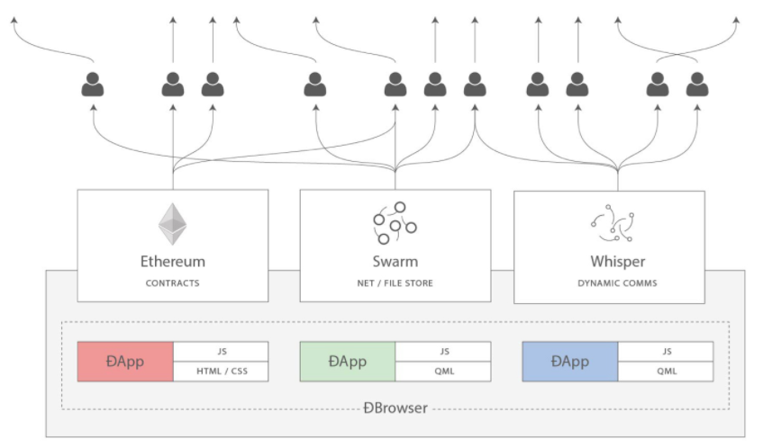

Figure 1. Web3: A suite of decentralized application components for the next evolution of the web

### 以太坊的开发文化
到目前为止，我们已经谈到了以太坊的目标和技术与其他区块链之前的区别，比如比特币。以太坊也有非常不同的开发文化。

在比特币中，开发以保守原则为指导：所有变化都经过仔细研究，以确保现有系统都不会中断。大部分情况下，只有在向后兼容时才会执行更改。允许现有客户“选择加入”，但如果他们决定不升级，将继续运作。

相比之下，在以太坊中，开发文化的重点是速度和创新。这个咒语是“快速行动，解决事情”。如果需要进行更改，即使这意味着使之前的假设失效，破坏兼容性或强制客户端进行更新，也会执行更改。以太坊的开发文化的特点是快速创新，快速进化和愿意参与实验。

这对开发者来说意味着什么，就是你必须保持灵活性，随着一些潜在的假设变化，准备重建你的基础设施。不要以为任何东西都是静态的或永久的。以太坊开发人员面临的一个重大挑战是将代码部署到不可变账本与仍在快速发展的开发平台之间的内在矛盾。你不能简单地“升级”你的智能合约。你必须准备部署新的、迁移用户、应用程序和资金，并重新开始。

具有讽刺意味的是，这也意味着构建具有更多自主权和更少集中控制的系统的目标是无法实现的。在接下来的几年中，自治和分权要求平台中的稳定性要比以太坊可能获得的稳定性要高一点。为了“发展”平台，你必须准备好取消并重启你的智能合约，这意味着你必须保留一定程度的控制权。

但是，在积极的一面，以太坊正在快速发展。“自行车脱落”的机会很小 - 这个表达意味着争论一些小细节，比如如何在大楼后面建造自行车棚。如果你开始骑脚踏车，你可能会突然发现其他的开发团队改变了计划，并且抛弃了自行车，转而使用自动气垫船。在以太坊有很少的神圣原则、最终标准或固定接口。

最终，以太坊核心协议的开发速度将会放慢，其接口将会变得固定。但与此同时，创新是推动原则。你最好跟上，因为没有人会为你放慢速度。
### 为什么学习以太坊？
区块链具有非常陡峭的学习曲线，因为它们将多个学科合并到一个领域：编程，信息安全，密码学，经济学，分布式系统，对等网络等。以太坊使得这一学习曲线不再陡峭，因此你可以很快就开始了。但就在一个看似简单的环境表面之下，还有更多。当你学习并开始更深入的观察时，总会有另一层复杂性和奇迹。

以太坊是学习区块链的绝佳平台，它构建了一个庞大的开发者社区，比任何其他区块链平台都快。相比其他区块链，以太坊是开发者为开发者开发的_开发者的区块链_。熟悉 JavaScript 应用程序的开发人员可以进入以太坊并开始快速生成工作代码。在以太坊的头几年，通常看到T恤衫宣布你可以用五行代码创建一个代币。当然，这是一把双刃剑。编写代码很容易，但编写_good_代码和_secure_代码非常困难。

### 本书将教你什么？
这本书深入以太坊的每一个组成部分。你将从一个简单的交易开始，分析它的工作原理，建立一个简单的合约，使其更好，并跟踪它在以太坊系统中的路径。

你将了解以太坊的工作方式，以及为什么这样设计。你将能够理解每个组成部分的工作方式，它们如何组合在一起以及为什么。

## 第二章 以太坊基础
### 控制和责任
像以太坊这样的开放区块链是安全的，因为它们是_去中心化的_。这意味着以太坊的每个用户都应该控制自己的密钥，这些密钥可以控制对资金和合约的访问。一些用户选择通过使用第三方保管人（比如交易所钱包）放弃对密钥的控制权。在本书中，我们将教你如何控制和管理你自己的密钥。

这种控制带来了很大的责任。如果你丢失了你的钥匙，你将无法获得资金和合约。没有人可以帮助你重新获得访问权 - 你的资金将永远锁定。以下是一些帮助你管理这一责任的提示：

- 提示你选择密码时：强化它，备份并不共享。如果你没有密码管理器，请将其写下并存放在锁定的抽屉或保险柜中。只要你拥有帐户的 “keystore” 文件，就可以使用此密码。
- 当系统提示你备份密钥或助记词时，请使用笔和纸进行物理备份。不要把这个任务放在“以后”，你会忘记。这些在你丢失了系统中保存的所有数据时使用。
- 不要在数字文档，数字照片，屏幕截图，在线驱动器，加密的 PDF 等中存储密钥材料（加密或不加密），不要临时凑合的安全性。使用密码管理器或笔和纸。
- 在传输任何大量数据之前，先做一个小的测试交易（例如，1美元）。一旦你收到测试交易，请尝试从该钱包中发送。如果你忘记密码或因任何其他原因无法发送资金，最好是一个小小的损失。
- 请勿将金钱汇入本书所示的任何地址。私人密钥被列在书中，有人会立即拿走这笔钱。

### 以太网货币单位
以太坊的货币单位称为以太 ether，也被称为 ETH 或符号 Ξ （来自看起来像程式化的大写字母E的希腊字母“Xi”）或（不太常见的）♦，例如，1个以太，或1个ETH，或 Ξ1，或 ♦1

	Tip
	Ξ 使用Unicode字符926，♦使用9830。

以太被细分为更小的单位，直到可能的最小单位，这被命名为 _wei_。一个 ether 是 1×10的18次方或1,000,000,000,000,000,000 个 wei。你可能会听到人们也提到货币“以太坊”，但这是一个常见的初学者的错误。以太坊是制度，以太是货币。

以太的值总是在以太坊内部表示为 _wei_，无符号整数值。当你处理1个以太网时，交易将编码 10000000000000000000 wei 作为值。

以太的各种单位既有使用国际单位系统（SI）的科学名称，也有口语化的名字，向计算机和密码学的许多伟大思想致敬。

表 [Ether Denominations and Unit Names](https://github.com/inoutcode/ethereum_book/blob/master/%E7%AC%AC%E4%BA%8C%E7%AB%A0.asciidoc#ether_denominations) 显示了各种单位，它们的俗名（通用）名称和他们的SI名称。为了与价值的内部表示保持一致，该表格显示了所有面值的wei（第一行），在第七行中 ether 显示为10的18次方 wei：

Table 1. Ether Denominations and Unit Names

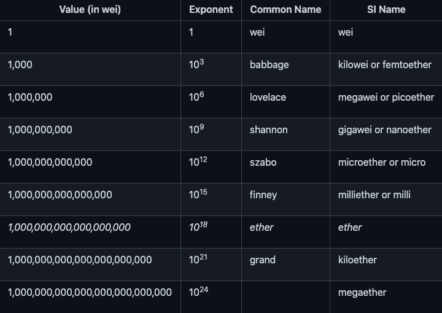

### 选择一个以太坊钱包
以太坊钱包是你通往以太坊系统的门户。它拥有你的密钥，并且可以代表你创建和广播交易。选择一个以太坊钱包可能很困难，因为有很多不同功能和设计选择。有些更适合初学者，有些更适合专家。即使你现在选择一个你喜欢的，你可能会决定稍后切换到另一个钱包。以太坊本身在不断变化，“最好”的钱包往往是适应它们的。

别担心！如果你选择一个钱包而不喜欢它的工作方式，那么你可以很容易地更换钱包。你只需进行一项交易，即将资金从旧钱包发送到新钱包，或者通过导出和导入私钥来移动密钥。

首先，我们将选择三种不同类型的钱包作为整本书的示例：移动钱包，桌面钱包和基于网络的钱包。我们选择了这三款钱包，因为它们代表了广泛的复杂性和功能。然而，选择这些钱包并不是对其质量或安全性的认可。他们只是示范和测试。

起始钱包：

- MetaMask

	MetaMask 是一款浏览器扩展钱包，可在你的浏览器（Chrome，Firefox，Opera或Brave Browser）中运行。它易于使用且便于测试，因为它可以连接到各种以太坊节点和测试区块链（请参阅“testnets”）。
- Jaxx

	Jaxx是一款多平台和多币种钱包，可在各种操作系统上运行，包括Android，iOS，Windows，Mac和Linux。对于新用户来说，它通常是一个不错的选择，因为它的设计简单易用。
- MyEtherWallet (MEW)

	MyEtherWallet 是一款基于网络的钱包，可在任何浏览器中运行。它具有多个复杂的功能，我们将在许多示例中探讨这些功能。
- Emerald Wallet

	Emerald钱包设计用于以太坊经典区块链，但与其他以太坊区块链兼容。它是一款开源桌面应用程序，适用于Windows，Mac和Linux。Emerald钱包可以运行一个完整的节点或连接到一个公共的远程节点，工作在“轻量”模式下。它还有一个配套工具来在命令行中执行所有操作。

我们将首先在桌面上安装MetaMask

#### 安装 MetaMask
打开Google Chrome浏览器并导航至：

https://chrome.google.com/webstore/category/extensions

搜索“MetaMask”并点击狐狸的标志。你应该看到这样的扩展的详细信息页面：

Figure 1. The detail page of the MetaMask Chrome Extension

验证你是否下载真正的 MetaMask 扩展非常重要，因为有时候人们可以将恶意扩展通过Google的过滤器。

- 在地址栏中显示ID nkbihfbeogaeaoehlefnkodbefgpgknn

		https://chrome.google.com/webstore/detail/metamask/nkbihfbeogaeaoehlefnkodbefgpgknn
- 由https://metamask.io提供
- 有超过800个评论
- 拥有超过1,000,000名用户

确认你正在查看正确的扩展程序后，请点击“添加到Chrome”进行安装。

#### 第一次使用MetaMask
一旦安装了 MetaMask，你应该在浏览器的工具栏中看到一个新图标（狐狸头）。点击它开始。它将要求你接受条款和条件，然后通过输入密码来创建新的以太坊钱包：

Figure 2. The password page of the MetaMask Chrome Extension

	Tip
	密码控制对 MetaMask 的访问，任何有权访问你的浏览器的人无法使用它。

一旦你设置了密码，MetaMask 将为你生成一个钱包并向你显示一个_助记词备份_，由12个英文单词组成。如果 MetaMask 或你的计算机出现问题，可以在任何兼容的钱包中使用这些词来恢复对资金的访问。你不需要通过密码进行恢复。这12个字就足够了。

Figure 3. The mnemonic backup of your wallet, created by MetaMask

	Tip
	在纸上备份助记符（12个字），两次。将两份纸张备份存放在两个单独的安全位置，例如防火安全柜，锁定的抽屉或保险箱。将纸质备份视为你在 Ethereum 钱包中存储的相同价值的现金。任何能够访问这些文字的人都可以访问并窃取你的资金。

一旦确认你已安全存储助记符，MetaMask 将显示你的以太坊帐户详细信息：

Figure 4. Your Ethereum account in MetaMask

你的帐户页面会显示你帐户的名称（默认情况下为“Account 1”），以太坊地址（示例中为0x9E713 …​）以及彩色图标，以帮助你将此帐户与其他帐户区分开来。在帐户页面的顶部，你可以看到你当前正在使用哪个以太坊网络（示例中的“主网络”）。

恭喜！你已经建立了你的第一个以太坊钱包！

#### 切换网络
正如你在 MetaMask 帐户页面上所看到的，你可以在多个以太坊网络中进行选择。默认情况下，MetaMask 将尝试连接到“主网络”。其他选择是公共测试网，你选择的任何以太坊节点或在你自己的计算机上运行私有区块链的节点（本地主机）：

- Main Ethereum Network

	主要的，公开的以太坊区块链。真正的ETH，真正的价值，真正的后果。
- Ropsten Test Network

	以太坊公开测试区块链和网络，使用工作证明共识（挖矿）。在这个网络上的ETH没有价值。Ropsten的问题在于攻击者铸造了数以万计的区块，产生巨大的重组并将燃气极限推到9B。当时需要一个新的公共测试网，但之后（2017年3月25日）Ropsten也复活了！
- Kovan Test Network

	以太坊公开测试区块链和网络，使用“Aura”协议进行权威证明（Proof-of-Authority）共识（联合签名）。在这个网络上的 ETH 没有价值。该测试网络仅由“Parity”支持。其他以太坊客户使用稍后提出的"Clique"协议作为权威证明。
- Rinkeby Test Network

	以太坊公开测试区块链和网络，使用“Clique”协议进行权威证明共识（联合签名）。在这个网络上的 ETH 没有价值。
- Localhost 8545

	连接到与浏览器在同一台计算机上运行的节点。该节点可以是任何公共区块链（主要或测试网络）或私人测试网络的一部分（参见[ganache](https://github.com/inoutcode/ethereum_book/blob/master/%E7%AC%AC%E4%BA%8C%E7%AB%A0.asciidoc#ganache)）。
- Custom RPC

	允许你将 MetaMask 连接到任何具有 geth 兼容的远程过程调用（RPC）接口的节点。该节点可以是任何公共或私有区块链的一部分。

有关各种以太坊测试网以及如何在它们之间进行选择的更多信息，请参见 [testnets](https://github.com/inoutcode/ethereum_book/blob/master/%E7%AC%AC%E4%BA%8C%E7%AB%A0.asciidoc#testnets)。

	Tip
	你的MetaMask钱包在连接的所有网络上使用相同的私钥和以太坊地址。但是，每个以太坊网络上的以太坊地址余额将有所不同。例如，你的密钥可以控制 Ropsten 上的以太和合约，但不能控制主网上的。

#### 获得一些测试以太
我们的首要任务是给我们的钱包充值。我们不会在主网上这样做，因为真正的以太网需要花费金钱，处理它需要更多的经验。现在，我们将使用一些 testnet ether 加载我们的钱包。

将 MetaMask 切换到 _Ropsten 测试网络_。然后点击“Buy”，然后点击“Ropsten Test Faucet”。MetaMask 将打开一个新的网页：

Figure 5. MetaMask Ropsten Test Faucet

你可能会注意到该网页已经包含你的 MetaMask 钱包的以太坊地址。MetaMask 集成了支持以太坊的网页（ 参见 [dapps](https://github.com/inoutcode/ethereum_book/blob/master/%E7%AC%AC%E4%BA%8C%E7%AB%A0.asciidoc#dapps)）与你的MetaMask 钱包整合在一起。MetaMask 可以在网页上“查看”以太坊地址，例如，你可以向显示以太坊地址的网上商店发送付款。如果网页请求，MetaMask 也可以使用自己的钱包地址填入网页，作为收件人地址。在此页面中，faucet 应用程序要求 MetaMask 提供一个钱包地址以发送测试以太网。

按绿色"request 1 ether from faucet"按钮。你会看到一个交易ID出现在页面的下方。faucet 应用程序创建了一个交易 - 付款给你。交易ID如下所示：

	0xea298d6b6e44847b49e7bc094c8e7b8337069238a768d7ddff97866d3f23156b
几秒钟后，新交易将由 Ropsten 矿工开采，你的 MetaMask 钱包将显示1 ETH的余额。

交易成功后，点击交易ID，你的浏览器会将你带到一个_block explorer_，该网站允许你查看和浏览区块，地址和交易。MetaMask 使用 etherscan.io 区块浏览器，这是受欢迎的以太坊区块浏览器之一。包含 Ropsten Test Faucet 支付的交易显示在 Etherscan Ropsten Block Explorer 中。

Figure 6. Etherscan Ropsten Block Explorer

交易记录在 Ropsten 区块链中，任何人都可以随时查看，只需搜索交易ID或访问链接即可：

	https://ropsten.etherscan.io/tx/0xea298d6b6e44847b49e7bc094c8e7b8337069238a768d7ddff97866d3f23156b

尝试访问该链接，或将交易哈希值输入到 ropsten.etherscan.io 网站中，亲自查看。

#### 使用 MetaMask 发送 ether
一旦我们从 Ropsten Test Faucet 接收到我们的第一个测试 ether，我们将试着发送一些 ether 回到 faucet。正如你在 Ropsten Test Faucet 页面上看到的那样，你可以选择 “donate”1个ETH。这个选项是可用的，所以一旦你完成了测试，你可以返回剩余的测试ether，以便其他人可以使用它。尽管测试 ether 没有价值，但有些人囤积测试 ether，使其他人难以使用测试网络。现在测试网络限制囤积，最多申请5个

幸运的是，我们不是测试 ether 的囤积者，我们希望练习发送 ether。

点击橙色的“1 ether”按钮来告诉 MetaMask 创建支付 Faucet 1 ether 的交易。MetaMask 将准备一个交易并弹出一个窗口，并显示确认信息：

Figure 7. Sending 1 ether to the faucet
哎！你可能注意到你无法完成交易。MetaMask表示“交易余额不足”。乍一看这可能会让人困惑：我们有1个ETH，我们想要发送1个ETH，为什么MetaMask说我们没有足够的资金？

答案是因为 `_gas_` 的成本。以太坊交易需要支付矿工收取的费用，以验证交易。以太坊的费用以 `_gas_` 虚拟货币收取。作为交易的一部分，你使用 ether 支付 gas。

	Tip
	测试网络也需要费用。如果没有费用，测试网络的行为将与主网络不同，从而使其成为不适当的测试平台。费用还可以保护测试网络免受拒绝服务攻击和构造不良的合约（如无限循环），就像保护主网络一样。

当你发送交易时，Metamas 以3 GWEI（即3 gigawei）计算最近成功交易的平均 gas 价格。Wei 是以太货币的最小的细分，正如我们在以太网货币单位中所讨论的那样。发送基本交易的 gas 成本为 21000 个 gas 单位。因此，你花费的ETH的最大数量为3 * 21000 GWEI = 63000 GWEI = 0.000063 ETH。请注意，平均 gas 价格可能波动，因为它们主要由矿工决定。我们将在后面的章节中看到如何增加/减少gas限制，以确保你的交易在需要时优先处理。

	tip
	2021年5月6号主网交易一次燃烧 gas 约为 3.97 美元

这表明：1 ETH交易的成本是1.000063 ETH。MetaMask在显示总数时会将此近似到1 ETH，但你需要的实际金额为1.000063 ETH，并且你只有1个ETH。点击“Reject”取消此交易。

让我们再来测试一下吧！再次点击绿色的 “request 1 ether from the faucet” 按钮，等待几秒钟。别担心，faucet 应该有足够的 ether，如果你要的话，会给你更多的东西。

一旦你有 2 ETH 的余额，你可以再试一次。这次，当你点击橙色的“1 ether”捐赠按钮时，你有足够的余额来完成交易。MetaMask 弹出付款窗口时点击“Submit”。所有这一切之后，你应该看到余额从2变成了 0.999937 ETH的余额，因为你使用0.000063 ETH的gas发送了1个ETH到faucet。

#### 探索地址的交易历史
到目前为止，你已经成为使用 MetaMask 发送和接收测试 ether 的专家。你的钱包已收到至少两次付款并至少发送了一次。让我们看看所有这些交易，使用 ropsten.etherscan.io 区块浏览器。你可以复制你的钱包地址并将其粘贴到浏览器的搜索框中，或者你可以让 MetaMask 为你打开该页面。在 MetaMask 中你的帐户图标旁边，你会看到一个显示三个点的按钮。点击它显示与帐户相关的选项菜单：

Figure 8. MetaMask Account Context Menu
选择 "View Account on Etherscan"，在浏览器中打开一个网页，显示你账户的交易记录：

Figure 9. Address Transaction History on Etherscan
在这里你可以看到你的以太坊地址的整个交易历史。它显示了 Ropsten 区块链上记录的所有交易，其中你的地址是交易的发件人或收件人。点击其中几项交易即可查看更多详细信息。

你可以浏览任何地址的交易历史记录。查看你是否可以浏览 Ropsten Test Faucet 地址的交易历史记录（提示：它是在你的地址中最早付款中列出的“发件人”地址）。你可以看到从 faucet 发送给你的和其他地址的测试 ether。你看到的每笔交易都可能带给你更多的地址和交易。不久之后，你将迷失在相互关联的数据迷宫中。公共区块链包含大量的信息，所有这些都可以通过编程方式进行探索，我们将在未来的例子中看到。

#### 世界计算机简介
我们已经创建了一个钱包，并且我们已经发送并接收了 ether。到目前为止，我们已经将以太坊视为一种加密货币。但是以太坊代表了更多。事实上，加密货币功能是服务于以太坊作为世界计算机的功能; 一个去中心化的智能合约平台。以太旨在用于支付运行的 smart contracts，这是在称为_EVM_的模拟计算机上运行的计算机程序。

EVM 是一个全球性的单例，这意味着它的运作方式就好像它是一个全球性的单实例计算机，无处不在。以太坊网络上的每个节点运行 EVM 的本地副本以验证合约执行，而以太坊区块链记录此世界计算机在处理交易和智能合约时变化的状态。
#### 外部所有账户（EOAs）和合约
我们在 MetaMask 钱包中创建的账户类型称为 Externally Owned Account（EOA）。外部所有账户是那些拥有私人密钥的账户，它控制对资金或合约的访问。现在，你可能猜测还有另一种帐户，_合约_帐户。合约账户由以太坊区块链记录，由 EVM 执行的软件程序的逻辑所拥有（和控制）。

将来，所有以太坊钱包可能会作为以太坊合约运行，模糊了外部所有账户和合约账户之间的区别。但是永远保持的重要区别在于：人们通过 EOA 做出决定，而软件通过合约做出决定。

合约有一个地址，就像 EOAs（钱包）一样。合约可以发送和接收 ether，就像钱包一样。当交易目的地是合约地址时，它会导致该合约在 EVM 中_运行_，并将交易作为其输入。

除了 ether 之外，交易还可以包含_数据_，用于指示合约中要运行的特定方法以及传递给该方法的参数。通过这种方式，交易通过合约_调用_ 方法。最后，合约可以产生调用其他合约的交易，建立复杂的执行路径。

其中一个典型的用法是合约A调用合约B，以便在合约A的用户之间保持共享状态。

在接下来的几节中，我们将编写我们的第一份合约。然后，我们将使用 MetaMask 钱包和测试 ether 在 Ropsten 测试网上创建，资助，使用该合约。

### 一个简单的合约：一个test ether faucet
以太坊有许多不同的高级语言，所有这些语言都可用于编写合约并生成 EVM 字节码。你可以阅读 [high_level_languages](https://github.com/inoutcode/ethereum_book/blob/master/%E7%AC%AC%E4%BA%8C%E7%AB%A0.asciidoc#high_level_languages) 中许多最成功和有趣的内容。一种智能合约编程的主要高级语言：Solidity。本书的合著者 Gavin Wood 创建了 Solidity，已经成为以太坊及以太坊外最广泛使用的语言。我们将使用 Solidity 编写我们的第一份合约。

作为我们的第一个例子，我们将编写一个控制_faucet_的合约。我们已经使用了 faucent 在 Ropsten 测试网络上获得测试 ether。faucet 是一件相对简单的事情：它给任何地址发放 ether，可以定期补充。你可以将 faucet 实现为由人类（或网络服务器）控制的钱包，但我们将编写一个实现 faucet 的 Solidity 合约：

Faucet.sol : A Solidity contract implementing a faucet

[link:code/Solidity/Faucet.sol[]](https://github.com/ethereumbook/ethereumbook/blob/develop/code/Solidity/Faucet.sol)
这是一个非常简单的合约。这也是一个有*缺陷*的合约，显示了一些不良做法和安全漏洞。我们将通过检查后面章节中的所有缺陷来学习。但现在，让我们逐行看下这个合约的作用，以及它是如何工作的。

- 第一行是注释

		// Version of Solidity compiler this program was written for

	注释用于人类阅读，不包含在可执行的 EVM 字节码中。我们通常将注释放在我们试图解释的代码之前，有时在同一行上。评论从两个正斜杠 // 开始。从斜线和直到该行结束的所有内容都被视为空白行并被忽略。
- 下一行是我们的_真正的_合约开始的地方：

		contract Faucet {
	该行声明了一个合约对象，类似于 JavaScript，Java或C++等其他面向对象语言中的 class 声明。合约的定义包含了大括号中的所有行 {}，它定义了 +范围 +，就像在其他许多编程语言中使用花括号一样。
	
	- 接下来，我们声明 faucet 合约的第一个函数：
	
			function withdraw(uint withdraw_amount) public {
		函数名为 withdraw，它接收一个无符号整数（uint）名为 withdraw_amount 的参数。它被声明为 public 函数，意味着它可以被其他合约调用。函数定义在花括号之间：
	
			require(withdraw_amount <= 100000000000000000);
		withdraw+ 方法的第一部分设置了取款限制。它使用内置的 Solidity 函数 +require 来测试前提条件，即 withdraw_amount 小于或等于100000000000000000 wei，它是 ether 的基本单位（参见 Ether Denominations and Unit Names），等于 0.1 ether。如果使用 withdraw_amount 大于该数量调用 withdraw 函数，则此处的 require 函数将导致合约执行停止并失败，并显示_异常_。
	
		合约的这部分是我们 faucet 的主要逻辑。它通过设定提款限额来控制合约的资金流出。这是一个非常简单的控制，但可以让你看到可编程区块链的强大功能：去中心化控制货币的软件。
	
		接下来是实际提款
	
			msg.sender.transfer(withdraw_amount);
		这里发生了一些有趣的事情。msg 对象是所有合约可以访问的输入之一。它代表触发执行此合约的交易。属性 sender 是交易的发件人地址。函数 transfer 是一个内置函数，它将 ether 从合约传递到调用它的地址。
		
		从后往前读，表示 transfer 到触发此合约执行的 msg 的 sender。
		
		transfer 函数将一个金额作为唯一的参数。我们传递之前声明为 withdraw 方法的参数的 withdraw_amount 值。
	
		紧接着的一行是结束大括号，表示 withdraw 函数定义的结束。

- 下面又声明了一个函数：

		function () public payable {}

	此函数是所谓的_“fallback”_或_default_函数，如果合约的交易没有命名合约中任何已声明的功能或任何功能或者不包含数据，则触发此函数。合约可以有一个这样的默认功能（没有名字），它通常是接收 ether 的那个。这就是为什么它被定义为 public 和 payable 函数，这意味着它可以接受合约中的 ether。除了大括号中的空白定义 {} 所指示的以外，它不会执行任何操作。如果我们进行一次向这个合约地址发送 ether 的交易，就好像它是一个钱包一样，该函数将处理它。

	在我们的默认函数下面是最后一个关闭花括号，它关闭了合约 faucet 的定义。就是这样！

#### 编译 faucet 合约
现在我们已经有了我们的第一个示例合约，我们需要使用 Solidity 编译器将 Solidity 代码转换为 EVM 字节代码，以便它可以由 EVM 执行。

Solidity 编译器是独立的可执行文件，作为不同框架的一部分，也捆绑在一个 _Integrated Development Environment（IDE）_中。

为了简单起见，我们将使用一种更流行的 IDE，称为 Remix。使用你的 Chrome 浏览器（使用我们之前安装的MetaMask钱包）导航到以下位置的Remix IDE：

https://remix.ethereum.org/

当你第一次加载Remix时，它将以一个名为 ballot.sol 的示例合约开始。我们不需要这个，所以让我们关闭它，点击标签边的 x ，这个新版本已经没有了

现在，点击左侧工具栏中的圆形加号，添加一个新选项卡，命名新文件 Faucet.sol：

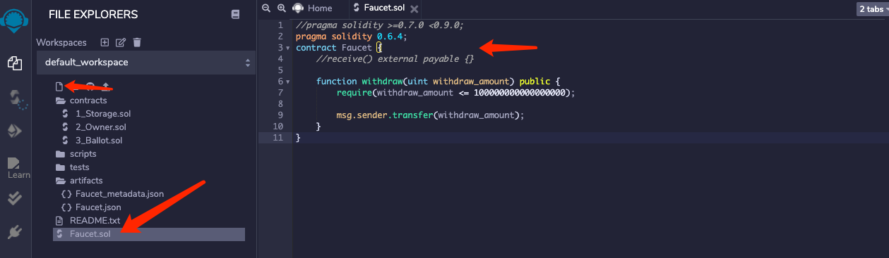

Figure 11. Click the plus sign to open a new tab

打开新选项卡后，复制并粘贴示例 Faucet.sol：
		
	pragma solidity 0.4.12;
	contract Faucet {
	    function withdraw(uint withdraw_amount) public {
	        require(withdraw_amount <= 100000000000000000);
	        
	        msg.sender.transfer(withdraw_amount);
	    }
	    function  () public payable {}
	}
Figure 12. Copy the Faucet example code into the new tab
现在我们已将 Faucet.sol 合约加载到 Remix IDE 中，IDE将自动编译代码。如果一切顺利，你会看到一个绿色的放开，右边出现一个带有“faucet”的绿色方块，在Compile选项卡下，确认编译成功：注意要选择对应的编译版本

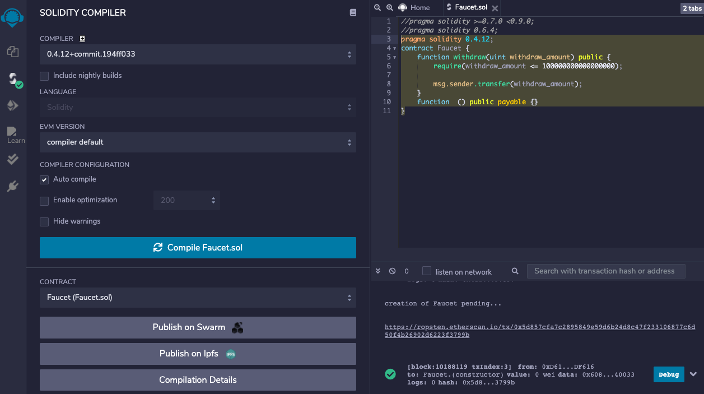

Figure 13. Remix successfully compiles the Faucet.sol contract

	如果出现问题，最可能的问题是 Remix IDE 正在使用与+0.4.19+版本不同的 Solidity 编译器。在这种情况下，我们的编译指示将阻止+Faucet.sol+编译。要更改编译器版本，请转到“Settings”选项卡，并重试。

Solidity 编译器现在已将我们的+ Faucet.sol +编译为EVM字节码。如果你好奇，可以打开编译详情查看

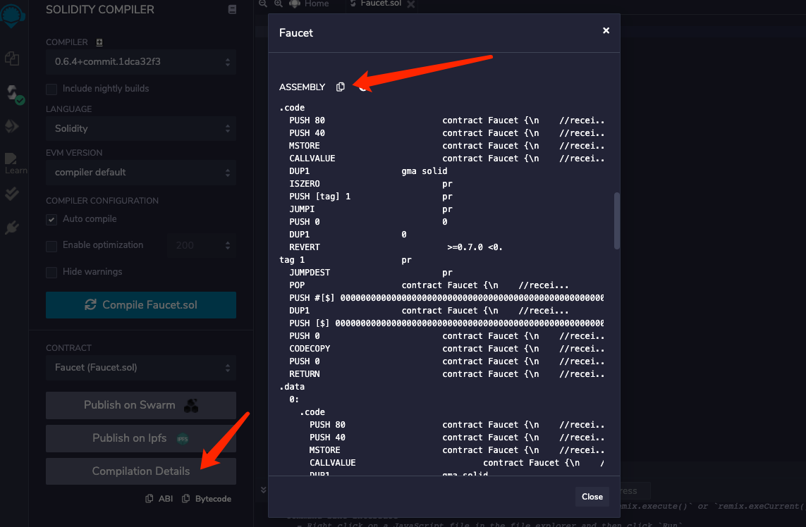

字节码如下所示：

	PUSH1 0x60 PUSH1 0x40 MSTORE CALLVALUE ISZERO PUSH2 0xF JUMPI PUSH1 0x0 DUP1 REVERT JUMPDEST PUSH1 0xE5 DUP1 PUSH2 0x1D PUSH1 0x0 CODECOPY PUSH1 0x0 RETURN STOP PUSH1 0x60 PUSH1 0x40 MSTORE PUSH1 0x4 CALLDATASIZE LT PUSH1 0x3F JUMPI PUSH1 0x0 CALLDATALOAD PUSH29 0x100000000000000000000000000000000000000000000000000000000 SWAP1 DIV PUSH4 0xFFFFFFFF AND DUP1 PUSH4 0x2E1A7D4D EQ PUSH1 0x41 JUMPI JUMPDEST STOP JUMPDEST CALLVALUE ISZERO PUSH1 0x4B JUMPI PUSH1 0x0 DUP1 REVERT JUMPDEST PUSH1 0x5F PUSH1 0x4 DUP1 DUP1 CALLDATALOAD SWAP1 PUSH1 0x20 ADD SWAP1 SWAP2 SWAP1 POP POP PUSH1 0x61 JUMP JUMPDEST STOP JUMPDEST PUSH8 0x16345785D8A0000 DUP2 GT ISZERO ISZERO ISZERO PUSH1 0x77 JUMPI PUSH1 0x0 DUP1 REVERT JUMPDEST CALLER PUSH20 0xFFFFFFFFFFFFFFFFFFFFFFFFFFFFFFFFFFFFFFFF AND PUSH2 0x8FC DUP3 SWAP1 DUP2 ISZERO MUL SWAP1 PUSH1 0x40 MLOAD PUSH1 0x0 PUSH1 0x40 MLOAD DUP1 DUP4 SUB DUP2 DUP6 DUP9 DUP9 CALL SWAP4 POP POP POP POP ISZERO ISZERO PUSH1 0xB6 JUMPI PUSH1 0x0 DUP1 REVERT JUMPDEST POP JUMP STOP LOG1 PUSH6 0x627A7A723058 KECCAK256 PUSH9 0x13D1EA839A4438EF75 GASLIMIT CALLVALUE LOG4 0x5f PUSH24 0x7541F409787592C988A079407FB28B4AD000290000000000

### 在区块链上创建合约
我们有一个合约，已经将它编译成字节码。现在，我们需要在以太坊区块链上“登记”合约。我们将使用 Ropsten 测试网来测试我们的合约，所以这就是我们想要记录的区块链。

在区块链上注册合约涉及创建一个特殊交易，其目标是地址 0x0000000000000000000000000000000000000000，也称为_zero address_。零地址是一个特殊的地址，告诉以太坊区块链你想注册一个合约。幸运的是，Remix IDE 将为你处理所有这些交易并将交易发送给 MetaMask。

首先，切换到“Run”选项卡，并在“Environment”下拉列表框中选择“Injected Web3”。这将 Remix IDE 连接到 MetaMask 钱包，并通过 MetaMask 连接到 Ropsten 测试网络。一旦你这样做，你可以在 Evironment 下看到 “Ropsten”。另外，在 Account 选择框中，它显示你的钱包的地址：

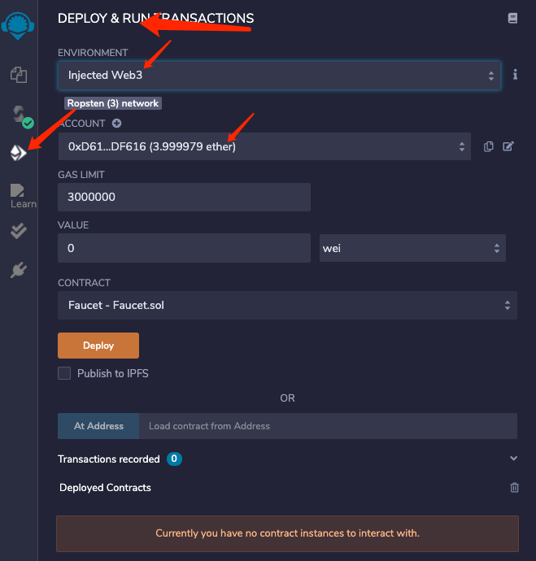

Figure 14. Remix IDE "Run" tab, with "Injected Web3" environment selected
在刚刚确认的“Run”设置下方，是Faucet合约，随时可以创建。点击“Create”或“Deploy“按钮：

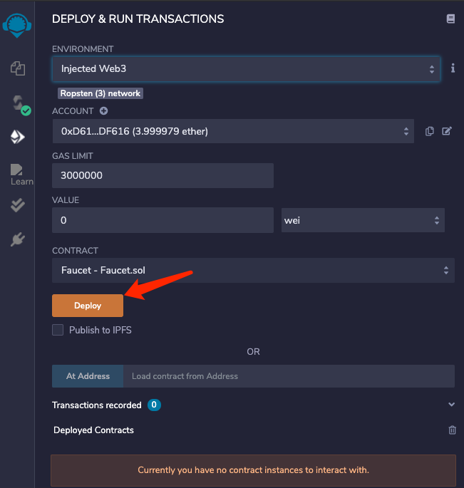

Figure 15. Click the Create button in the Run tab
Remix IDE将构建特殊的“creation“交易-新版本是 Deploy，MetaMask 会要求你批准它。

从 MetaMask 中可以看到，合约创建交易没有 ether，但它有266个字节（编译的合约），并且会消耗 1 个Gwei。点击“Submit”来批准：

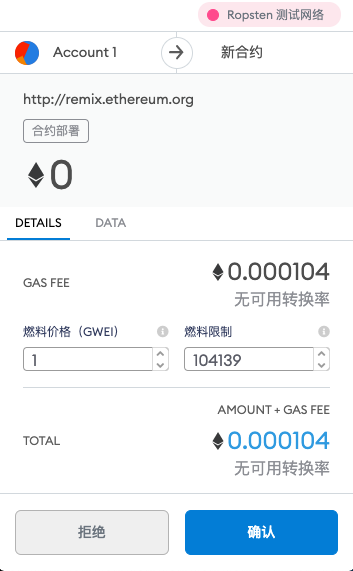
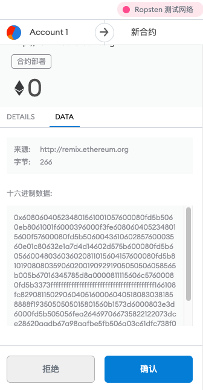
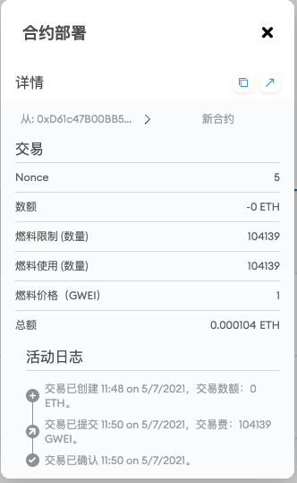

Figure 16. MetaMask showing the contract creation transaction
现在，等待：合约在 Ropsten 上开采需要大约15到30秒的时间。Remix IDE 似乎不会做太多，耐心等待。

合约创建后，它会显示在“运行”选项卡的底部：

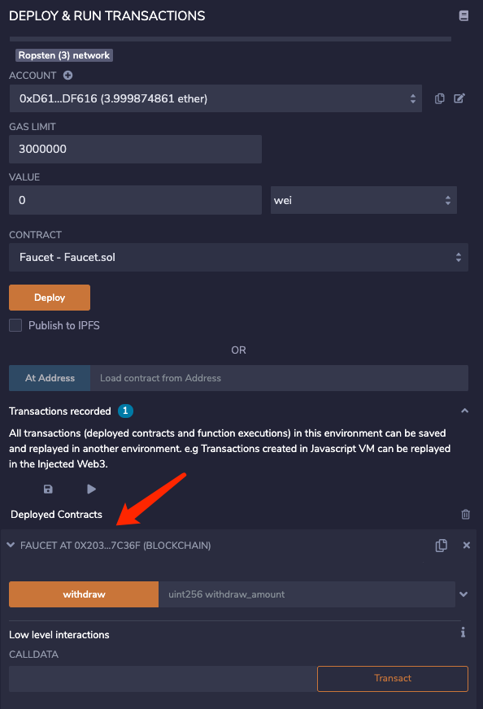

Figure 17. The Faucet contract is ALIVE!
请注意，Faucet合约现在有自己的地址：Remix将其显示为 Faucet 0x9A90f8E93fD7d55677E8A05db599D09E4e1b5855。右边的小剪贴板符号允许你将合约地址复制到剪贴板中。我们将在下一节中使用它。

### 与合约交互
让我们回顾一下我们迄今为止学到的东西：

以太坊合约是控制货币的程序，运行在名为 EVM 的虚拟机内。它们是由一个特殊的交易创建的，该交易提交它们的字节码以记录在区块链中。一旦他们在区块链上创建，他们就拥有一个以太坊地址，就像钱包一样。只要有人将交易发送到合约地址，它就会导致合约在 EVM 中运行，并将交易作为其输入。发送到合约地址的交易可能包含以太网或数据或两者都有。如果它们含有 ether，则将其 “存入” 合约余额。如果它们包含数据，则数据可以在合约中指定一个命名函数并调用它，并将参数传递给该函数。

#### 在区块浏览器中查看合约地址
现在，我们在区块链中登记了一份合约，我们可以看到它有一个以太坊地址。让我们在 ropsten.etherscan.io 区块浏览器中查看它，看看合约是什么样子。通过点击名称旁边的剪贴板图标来复制合约的地址。

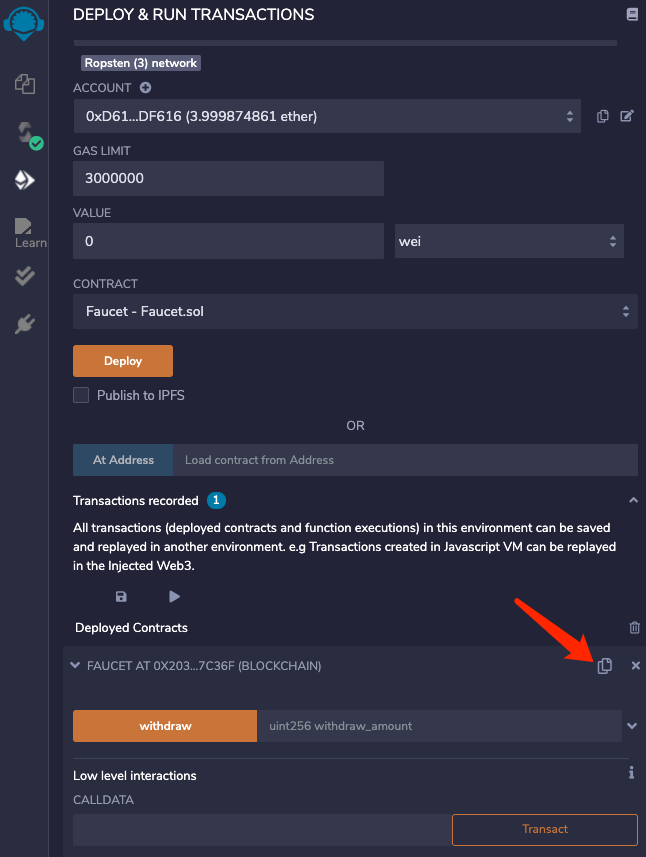

Figure 18. Copy the contract address from Remix
保持 Remix 打开在标签中，我们稍后会再回来。现在，将浏览器导航至 ropsten.etherscan.io 并将地址粘贴到搜索框中。你应该看到合约的以太坊地址记录：

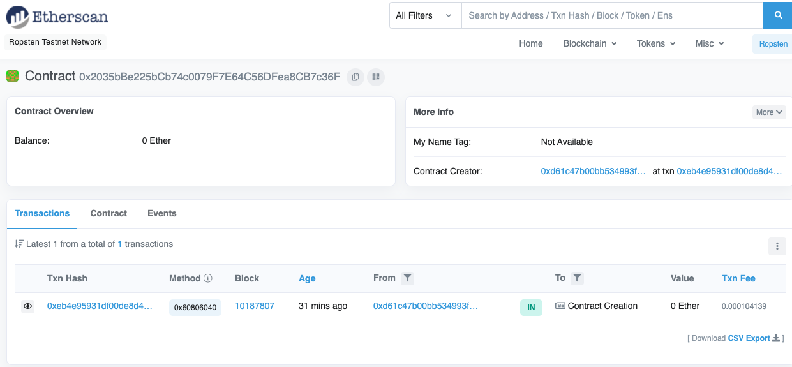

Figure 19. View the Faucet contract address in the etherscan block explorer

#### 为合约提供资金
现在，合约其历史上只有一笔交易：合约创建交易。如你所见，合约也没有 ether（零余额）。这是因为我们没有在创建交易中向合约发送任何提示，尽管我们可以提供。

让我们向合约发一些 ether！你仍然应该在剪贴板中拥有合约的地址（如果没有，请从Remix再次复制）。打开 MetaMask，然后向它发送1个ether，就像任何其他以太坊地址一样：

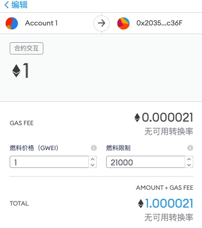

Figure 20. Send 1 ether to the contract address
一分钟后，如果你刷新etherscan区块浏览器，它会向合约地址显示另一个交易，并更新1 ether的余额。

还记得我们的 Faucet.sol 代码中的未命名默认公共付费功能？它看起来像这样：(新版本将无法编译报错)

	function () public payable {}
当你将交易发送到合约地址时，没有指定要调用哪个函数的数据，它将调用默认函数。由于我们将它声明为+payable+，因此它接受 1 ether 并存入合约账户余额中。你的交易导致合约在 EVM 中运行，更新其余额。我们资助了我们的 faucet！

#### 从我们的合约中提取
接下来，让我们从 faucet 中提取一些资金。要提取，我们必须构造一个调用 withdraw 函数并将 withdraw_amount 参数传递给它的交易。为了保持现在简单，Remix 将为我们构建该交易，并且 MetaMask 将提交它以供我们批准。

返回到 Remix 选项卡并在“Run”选项卡下查看合约。你应该看到一个标记为 withdraw 的黄色框，其中带有一个标记为 uint256 withdraw_amount：

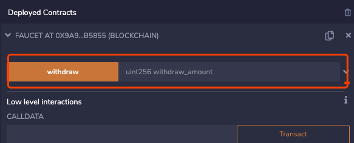

Figure 21. The withdraw function of Faucet.sol, in Remix
这是合约的 Remix 界面。它允许我们构造调用合约中定义的函数的交易。我们将输入 withdraw_amount 并点击 withdraw 按钮以生成交易。

首先，我们来看看 withdraw_amount。我们要试着提取 0.1 ether，这是我们合约允许的最高金额。请记住，以太坊中的所有货币值都以 wei + 计价，而我们的 +withdraw 函数预期 withdraw_amount 也以 wei 计价。我们想要的数量是 0.1 ether，这是 100000000000000000 wei（1后面跟着17个零）。

100000000000000000 到 withdraw_amount 框中，然后单击 withdraw 按钮：

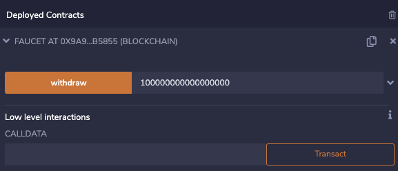

Figure 22. Click "withdraw" in Remix to create a withdrawal transaction
MetaMask 将弹出一个交易窗口供你批准。点击“Submit”将你的提款通知发送至合约：

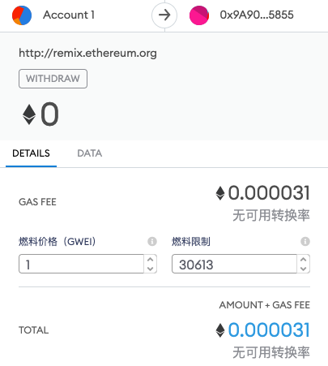
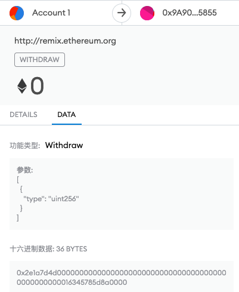

Figure 23. MetaMask transaction to call the withdraw function
等一下，然后重新加载 etherscan 区块浏览器以查看在ether合约地址历史记录中反映的交易：

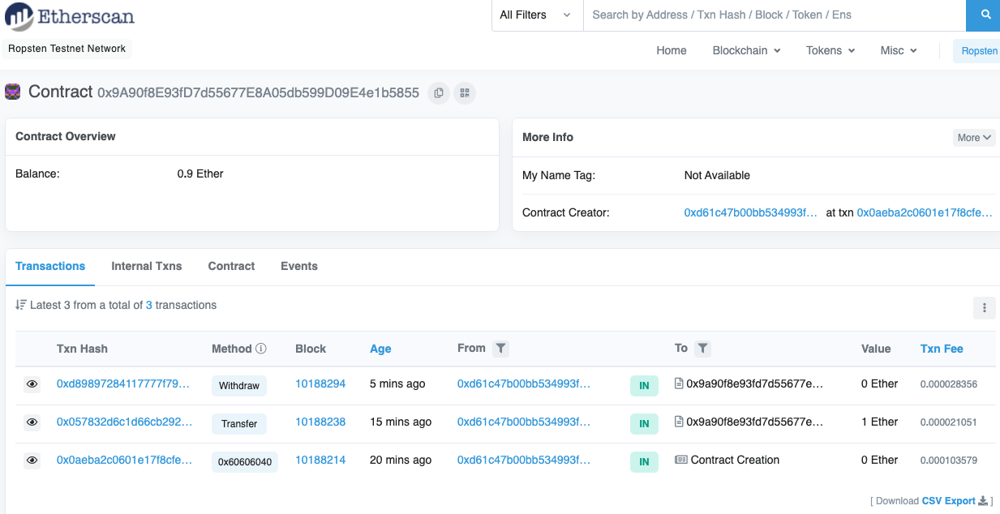

Figure 24. Etherscan shows the transaction calling the withdraw function
我们现在看到一个新的交易，其中合约地址是目标地址，0 ether。合约余额已经改变，现在是 0.9 ether，因为它按要求给了我们 0.1 ether。但是我们在合约地址历史记录中看不到“OUT”交易。

提款的交易在哪里？合约的地址历史记录页面中出现了一个名为“内部交易”的新选项卡。

	由于 0.1 ether 传输源于合约代码，因此它是一个内部交易（也称为_message_）。
点击“内部交易”标签查看：

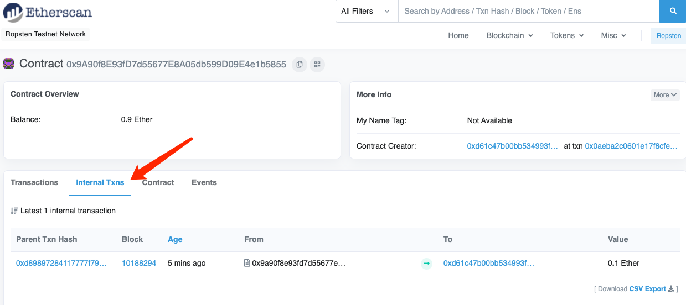
Figure 25. Etherscan shows the internal transaction transferring ether out from the contract
这个“内部交易”是由合约在这行代码中发送的（Faucet.sol 的 withdraw 方法）

	msg.sender.transfer(withdraw_amount);

回顾一下：

- 首先我们从  MetaMask 钱包发送了一个包含数据指令的交易，以 0.1 ether 的 +withdraw_amount+ 参数调用 withdraw 函数。该交易导致合约在 EVM 内部运行。
- 当 EVM 运行 faucet 合约的 withdraw 功能时
	- 首先它调用 +require+ 函数并验证我们的金额小于或等于最大允许提款0.1 ether。
	- 然后它调用 transfer 函数向我们发送 ether。

运行 transfer 函数生成一个内部交易，从合约的余额中将0.1以太币存入我们的钱包地址。这就是 etherscan 中“内部交易”标签中显示的内容。

### 总结
本章中，我们使用 MetaMask 创建了一个钱包，并且使用 Ropsten 测试网络上的一个 faucet 合约给钱包充值。我们收到了faucet 合约发送到钱包以太坊地址的 ether。然后我们把 ether 发回给 faucet 合约以太坊地址。

接下来，我们在 Solidity 中写了一个自己的合约(faucet)。使用 Remix IDE 将合约编译为 EVM 字节码。使用 Remix 进行交易，并在 Ropsten 区块链上登记 faucet 合约。一旦登记，faucet 合约有一个以太坊地址，我们发送一些 ether。

最后，我们构建了一个交易来调用 withdraw 函数，并成功请求了0.1 ether。该合约检查了我们的请求，发送给我们0.1 ether并进行内部交易。

可能看起来不多，但我们刚刚成功地与控制去中心化世界计算机上资金的软件进行了交互。

我们将在“智能合约”中做更多的智能合约编程，并了解最佳实践和安全考虑。

## 第三章 以太坊客户端
以太坊客户端是实现以太坊规范并通过对等网络与其他以太坊客户端进行通信的软件应用程序。不同的以太坊客户端如果符合参考规范和标准化通信协议，就可以互操作。虽然这些不同的客户端由不同的团队和不同的编程语言实现，但他们都“说”相同的协议并遵循相同的规则。

以太坊是一个_open source_项目，源代码可在开放（LGPL v3.0）许可下使用，可免费下载并用于任何目的。开源意味着不仅仅是免费使用。这也意味着以太坊由一个开放的志愿者社区开发，任何人都可以修改。

以太坊由名为“黄皮书”的正式规范定义。 这与比特币相反，比特币没有任何正式的定义。比特币的“规范”是比特币核心的参考实现，以太坊的规范定义在一篇结合了英文和数学的（正式的）规范的论文中。 这个正式的规范，除了各种以太坊改进建议之外，还定义了以太坊客户端的标准行为。随着对以太坊的重大改变，黄皮书会定期更新。

作为以太坊明确的正式规范的结果，以太坊客户端有许多独立开发的、可互操作的软件实现。以太坊在网络上运行的实现方式比任何其他区块链都多。
### 以太坊网络
存在各种基于以太坊的网络，这些网络很大程度上符合以太坊“黄皮书”中定义的正式规范，但它们可能或不能互操作。

在这些以太坊网络中有：

- Ethereum
- Ethereum Classic
- Ella
- Expanse
- Ubiq
- Musicoin 等等。

虽然大多数在协议级别上兼容，但这些网络通常具需要以太坊客户端软件维护人员进行微小更改以支持每个网络的功能或属性。因此，并非以太坊客户端软件的每个版本都可以在每个以太坊区块链上运行。

目前，以六种不同语言编写的以太坊协议有六个主要实现：

- Go（Geth）
- Rust（parity）
- C ++（cpp-ethereum）
- Python（pyethereum）
- Scala（mantis）
- Java（harmony）。

在本节中，我们将看看两个最常见的客户，Geth和Parity。我们将学习如何使用每个客户端启动一个节点，并探索他们的一些命令行和应用程序编程接口（API）。

#### 我应该运行一个完整的节点吗？
区块链的健康、弹性和抗审查取决于拥有有多少独立运营和地理上分散的完整节点。每个完整节点都可以帮助其他新节点获取块数据以引导其操作，并为运营商提供对所有交易和合约的权威和独立验证。

但是，运行完整的节点会导致硬件资源和带宽的巨大成本。完整的节点必须下载超过 80GB 的数据（截至 2018年4月;取决于客户端）并将其存储在本地硬盘上。随着新的交易和区块的添加，这种数据负担每天都会迅速增加。[完整节点的硬件要求](https://github.com/inoutcode/ethereum_book/blob/master/%E7%AC%AC%E4%B8%89%E7%AB%A0.asciidoc#requirements) 中有关于此主题的更多信息。

在以太坊开发中，运行在活跃网络（主网）上的完整节点不是必需的。你可以使用_testnet_节点（它存储小型公共测试区块链的副本），或本地私有区块链（参见 [ganache](https://github.com/inoutcode/ethereum_book/blob/master/%E7%AC%AC%E4%B8%89%E7%AB%A0.asciidoc#ganache)），或服务提供商提供的基于云的以太坊客户端（参见 [infura](https://github.com/inoutcode/ethereum_book/blob/master/%E7%AC%AC%E4%B8%89%E7%AB%A0.asciidoc#infura)），做几乎任何事。

你还可以选择运行轻量级客户端，该客户端不会存储区块链的本地副本或验证块和交易。这些客户端提供钱包的功能，并可以创建和广播交易。

轻量级客户端可用于连接到现有网络，例如你自己的完整节点、公共区块链、公开或许可的（PoA）测试网或私有本地区块链。在实践中，你可能会使用轻量级客户端，如 

- MetaMask
- Emerald Wallet
- MyEtherWallet
- MyCrypto 

作为在所有不同节点选项之间切换的便捷方式。

尽管存在一些差异，术语“轻量级客户端”和“钱包”可以互换使用。通常，轻量级客户端除了提供钱包的交易功能外，还提供 API（如web3js API）。

不要将以太坊中轻量级钱包的概念与比特币中简化支付验证（SPV）客户端的概念混淆。

- SPV 客户验证区块头并使用 merkle 证明来验证区块链中是否包含交易。
- 以太坊轻量级客户端通常不验证区块头或交易。他们完全信任由第三方运营的完整客户端，让他们通过 RPC 访问区块链。

#### 完整节点的优点和缺点
选择运行一个完整的节点可以帮助各种基于以太坊的网络，但也会给你带来一些温和的或适中的成本。我们来看看一些优点和缺点。

- 优点
	- 支持基于以太坊的网络的弹性和抗审查。
	- 权威性验证所有交易。
	- 可以与公共区块链上的任何合约进行交互（无需中介）。
	- 如有必要，可以离线查询（只读）区块链状态（账户，合约等）。
	- 可以在不让第三方知道你正在读取的信息的情况下查询区块链。
	- 可以直接将自己的合约部署到公共区块链中（无需中介）。
- 缺点
	- 需要大量且不断增长的硬件和带宽资源。
	- 需要几个小时或几天才能完成第一次初始下载的同步。
	- 必须维护，升级并保持联机才能保持同步。

#### 公共测试网的优点和缺点
无论你是否选择运行完整节点，你可能都需要运行公共 testnet 节点。我们来看看使用公共测试网的一些优点和缺点。

- 优点
	- 测试网络节点需要同步并存储少得多的数据，根据网络大小约为10GB（截至2018年4月）。
	- 测试网络节点可以在几个小时内完全同步。
	- 部署合约或进行交易需要测试 ether，它没有价值，可以从几个“faucet”免费获得。
	- Testnets 是与其他许多用户和合约共享的区块链，运行“live”。
- 缺点
	- 你不能在测试网上使用“真实”的钱，它以测试 ether 运转。
	- 因此，你无法针对真正对手进行安全性测试，因为没有任何风险。
	- 公共区块链的某些方面无法在testnet上真实地测试。例如，交易费虽然是发送交易所必需的，但由于 gas 是免费的，因此不需要在测试网上考虑。测试网不会像公共网络那样经历网络拥塞。

#### 本地实例（TestRPC）的优点和缺点
对于许多测试目的，最好的选择是使用 testrpc 节点启动一个实例私有区块链。TestRPC 创建一个本地私有区块链，你可以与之交互，而无需任何其他参与者。它分享了公共测试网的许多优点和缺点，但也有一些差异。

- 优点
	- 不同步，磁盘上几乎没有数据。你自己挖掘第一块。
	- 无需测试 ether，你可以将挖矿奖励“奖励”给自己，用于测试。
	- 没有其他用户，只有你。
	- 没有其他合约，只有你启动后部署的合约。
- 缺点
	- 没有其他用户意味着它不像公共区块链一样。没有交易空间或交易排序的竞争。
	- 除你之外没有矿工意味着采矿更具可预测性，因此你无法测试公开区块链上发生的一些情况。
	- 没有其他合约意味着你必须部署所有你想测试的内容，包括依赖项和合约库。
	- 你不能重新创建一些公共合约及其地址来测试一些场景（例如DAO合约）。

#### 运行以太坊客户端
如果你有时间和资源，你应该尝试运行一个完整的节点，即使只是为了更多地了解这个过程。在接下来的几节中，我们将下载，编译和运行以太坊客户 Go-Ethereum（Geth）和 Parity。这需要熟悉在操作系统上使用命令行界面。无论你选择将它们作为完整节点，作为 testnet 节点还是作为本地私有区块链的客户端运行，都值得安装这些客户端。

- 完整节点的硬件要求

	在我们开始之前，你应该确保你有一台具有足够资源的计算机来运行以太坊完整节点。你将需要至少 80GB 的磁盘空间来存储以太坊区块链的完整副本。如果你还想在以太坊测试网上运行完整节点，则至少需要额外的 15GB。下载 80GB 的区块链数据可能需要很长时间，因此建议你使用快速的 Internet 连接。

	同步以太坊区块链是非常密集的输入输出（I / O）。最好有一个固态硬盘（SSD）。如果你有机械硬盘驱动器（HDD），则至少需要 8GB 的 RAM 能用作缓存。否则，你可能会发现你的系统速度太慢，无法完全保持同步。

	- 最低要求
		- 2核心CPU
		- 固态硬盘（SSD），至少80GB可用空间。
		- 最小4GB内存，如果你使用HDD而不是SSD，则至少8GB。
		- 8+ MBit/sec下载速度的互联网。

	这些是同步基于以太坊的区块链的完整（但已修剪）副本的最低要求。

	在编写本文时（2018年4月），Parity 代码库的资源往往更轻，如果你使用有限的硬件运行，那么使用 Parity 可能会看到最好的结果。

	如果你想在合理的时间内同步并存储我们在本书中讨论的所有开发工具，库，客户端和区块链，你将需要一台功能更强大的计算机。

	- 推荐规格
		- 4个以上核心的快速CPU。
		- 16GB+ RAM。
		- 至少有500GB可用空间的快速SSD。
		- 25+ MBit/sec下载速度的互联网。

	很难预测区块链的大小会增加多快，以及何时需要更多的磁盘空间，所以建议你在开始同步之前检查区块链的最新大小。

	- 以太坊： https://bitinfocharts.com/ethereum/
	- 以太坊经典： https://bitinfocharts.com/ethereum%20classic/

#### 构建和运行客户端（节点）的软件要求
本节介绍 Geth 和 Parity 客户端软件。并假设你正在使用类 Unix 的命令行环境。这些示例显示了在运行 Bash shell（命令行执行环境）的 Ubuntu Linux 操作系统上输入的输出和命令。

通常，每个区块链都有自己的 Geth 版本，而 Parity 支持多个以太坊区块链（Ethereum，Ethereum Classic，Ellaism，Expanse，Musicoin）。

在我们开始之前，我们可能需要满足一些先决条件。如果你从未在你当前使用的计算机上进行任何软件开发，则可能需要安装一些基本工具。对于以下示例，

- 你需要安装 git
- 源代码管理系统; Golang
- Go编程语言和标准库
- Rust 一种系统编程语言。

可以按照以下说明安装Git： https://git-scm.com/

可以按照以下说明安装Go： https://golang.org/

	Note
	Geth 的要求各不相同，但如果你坚持使用 Go 版本1.10或更高版本，你应该能够编译你想要的任何版本的 Geth。当然，你应该总是参考你选择的 Geth 的文档。
	
	如果安装在你的操作系统上的 Golang 版本或者从系统的软件包管理器中获得的版本远远早于 1.10，请将其删除并从 golang.org 安装最新版本。

可以按照以下说明进行安装Rust ： https://www.rustup.rs/

	Note
	Parity 需要 Rust 版本1.24或更高版本。

Parity还需要一些软件库，例如 OpenSSL 和 libudev。要在 Linux（Debian）兼容系统上安装，请执行以下操作：

	$ sudo apt-get install openssl libssl-dev libudev-dev
对于其他操作系统，请使用操作系统的软件包管理器或遵循Wiki说明（https://github.com/paritytech/parity/wiki/Setup）来安装所需的库。

现在你已经安装了 git，golang，rust 和必要的库，让我们开始工作吧！

#### Parity
Parity 是完整节点以太坊客户端和 DApp 浏览器的实现。Parity 是由 Rust 从头开始编写的，系统编程语言是为了构建一个模块化、安全和可扩展的以太坊客户端。Parity 由英国公司Parity Tech 开发，并以 GPLv3 开源许可证发布。

	Note
	披露：本书的作者之一 Gavin Wood 是 Parity Tech 的创始人，并撰写了大部分 Parity 客户端。Parity 代表了约28%的以太坊客户端。

要安装 Parity，你可以使用 Rust 包管理器 +cargo+ 或从 GitHub 下载源代码。软件包管理器也下载源代码，所以两种选择之间没有太大区别。在下一节中，我们将向你展示如何自己下载和编译 Parity。

- 安装 Parity

	Parity Wiki 提供了在不同环境和容器中构建 Parity 的说明：

	https://github.com/paritytech/parity/wiki/Setup

	我们将从源代码构建奇偶校验。这假定你已经使用 rustup 安装了Rust（见[构建和运行客户端（节点）的软件要求](https://github.com/inoutcode/ethereum_book/blob/master/%E7%AC%AC%E4%B8%89%E7%AB%A0.asciidoc#sw_reqs)）。

	- 首先，让我们从GitHub获取源代码：

			$ git clone https://github.com/paritytech/parity
	- 现在，我们转到+parity+目录并使用+cargo+构建可执行文件：

			$ cd parity
			$ cargo build
	- 如果一切顺利，你应该看到如下所示的内容：

			$ cargo build
			    Updating git repository `https://github.com/paritytech/js-precompiled.git`
			 Downloading log v0.3.7
			 Downloading isatty v0.1.1
			 Downloading regex v0.2.1
			
			 [...]
			
			Compiling parity-ipfs-api v1.7.0
			Compiling parity-rpc v1.7.0
			Compiling parity-rpc-client v1.4.0
			Compiling rpc-cli v1.4.0 (file:///home/aantonop/Dev/parity/rpc_cli)
			Finished dev [unoptimized + debuginfo] target(s) in 479.12 secs
			$
	- 让我们通过调用+--version+选项来运行+parity+以查看它是否已安装：

			$ parity --version
			Parity
			  version Parity/v1.7.0-unstable-02edc95-20170623/x86_64-linux-gnu/rustc1.18.0
			Copyright 2015, 2016, 2017 Parity Technologies (UK) Ltd
			License GPLv3+: GNU GPL version 3 or later <http://gnu.org/licenses/gpl.html>.
			This is free software: you are free to change and redistribute it.
			There is NO WARRANTY, to the extent permitted by law.
			
			By Wood/Paronyan/Kotewicz/Drwięga/Volf
			   Habermeier/Czaban/Greeff/Gotchac/Redmann
			$
	
	现在已安装了Parity，我们可以同步区块链并开始使用一些基本的命令行选项。
- Go-Ethereum (Geth)

	Geth是Go语言实现的，它被积极开发并被视为以太坊客户端的“官方”实现。通常情况下，每个基于以太坊的区块链都会有自己的Geth实现。如果你正在运行Geth，那么你需要确保使用以下某个存储库链接为区块链获取正确的版本。

对应以太坊版本库的链接

- Ethereum: https://github.com/ethereum/go-ethereum (or https://geth.ethereum.org/)
- Ethereum Classic: https://github.com/ethereumproject/go-ethereum
- Ellaism: https://github.com/ellaism/go-ellaism
- Expanse: https://github.com/expanse-org/go-expanse
- Musicoin: https://github.com/Musicoin/go-musicoin
- Ubiq: https://github.com/ubiq/go-ubiq

		Note
		你也可以跳过这些说明并为你选择的平台安装预编译的二进制文件。预编译的版本安装起来更容易，可以在上面版本库的“版本”部分找到。但是，你可以通过自己下载和编译软件来了解更多信息。

- 克隆存储库

	我们的第一步是克隆git仓库，以获得源代码的副本。

	要创建此存储库的本地克隆，请使用 git 命令，如下所示，在你的主目录或用于开发的任何目录下：

		$ git clone <Repository Link>
	在将存储库复制到本地系统时，你应该看到进度报告：

		Cloning into 'go-ethereum'...
		remote: Counting objects: 62587, done.
		remote: Compressing objects: 100% (26/26), done.
		remote: Total 62587 (delta 10), reused 13 (delta 4), pack-reused 62557
		Receiving objects: 100% (62587/62587), 84.51 MiB | 1.40 MiB/s, done.
		Resolving deltas: 100% (41554/41554), done.
		Checking connectivity... done.
	现在我们有了 Geth 的本地副本，我们可以为我们的平台编译一个可执行文件。
- 从源代码构建Geth

	要构建 Geth，切换到下载源代码的目录并使用 make 命令：

		$ cd go-ethereum
		$ make geth
	如果一切顺利，你将看到Go编译器构建每个组件，直到它生成+ geth +可执行文件：

		build/env.sh go run build/ci.go install ./cmd/geth
		>>> /usr/local/go/bin/go install -ldflags -X main.gitCommit=58a1e13e6dd7f52a1d5e67bee47d23fd6cfdee5c -v ./cmd/geth
		github.com/ethereum/go-ethereum/common/hexutil
		github.com/ethereum/go-ethereum/common/math
		github.com/ethereum/go-ethereum/crypto/sha3
		github.com/ethereum/go-ethereum/rlp
		github.com/ethereum/go-ethereum/crypto/secp256k1
		github.com/ethereum/go-ethereum/common
		[...]
		github.com/ethereum/go-ethereum/cmd/utils
		github.com/ethereum/go-ethereum/cmd/geth
		Done building.
		Run "build/bin/geth" to launch geth.
		$
	让我们在停止并更改它的配置之前运行 geth 以确保它工作：

		$ ./build/bin/geth version
		
		Geth
		Version: 1.6.6-unstable
		Git Commit: 58a1e13e6dd7f52a1d5e67bee47d23fd6cfdee5c
		Architecture: amd64
		Protocol Versions: [63 62]
		Network Id: 1
		Go Version: go1.8.3
		Operating System: linux
		GOPATH=/usr/local/src/gocode/
		GOROOT=/usr/local/go
	你的 geth version 命令可能会稍微不同，但你应该看到类似上面的版本报告。

	最后，我们可能希望将 geth 命令复制到操作系统的应用程序目录（或命令行执行路径上的目录）。在Linux上，我们使用以下命令：

		$ sudo cp ./build/bin/geth /usr/local/bin
	先不要开始运行 geth，因为它会以“缓慢的方式”开始将区块链同步，这将花费太长的时间（几周）。基于以太坊的区块链首次同步解释了以太坊区块链的初始同步带来的挑战。

#### 基于以太坊的区块链首次同步
通常，在同步以太坊区块链时，你的客户端将下载并验证自创世区块以来的每个区块和每个交易。

虽然可以通过这种方式完整同步区块链，但同步会花费很长时间并且对计算资源要求较高（RAM更多，存储速度更快）。

许多基于以太坊的区块链在 2016 年底遭受了拒绝服务（DoS）攻击。受此攻击影响的区块链在进行完全同步时倾向于缓慢同步。

例如，在以太坊中，新客户端在到达区块 2,283,397 之前会进展迅速。该块在 2016年9月18日 开采，标志着 DoS 攻击的开始。从这个区块到2,700,031区块（2016年11月26日），交易验证变得非常缓慢，内存密集并且 I/O 密集。这导致每块的验证时间超过1分钟。以太坊使用硬分叉实施了一系列升级，以解决在拒绝服务中被利用的底层漏洞。这些升级还通过删除由垃圾邮件交易创建的大约 2000 万个空帐户来清理区块链。<<[1]>>

如果你正在使用完整验证进行同步，则客户端会放慢速度并可能需要几天或更长时间才能验证受此 DoS 攻击影响的任何块。

大多数以太坊客户端包括一个选项，可以执行“快速”同步，跳过交易的完整验证，同步到区块链的顶端后，再恢复完整验证。

对于 Geth，启用快速同步的选项通常称为 --fast。你可能需要参考你选择的以太坊链的具体说明。

对于 Parity，较旧版本（<1.6），该选项为 --warp，较新版本（>=1.6）上默认启用（无需设置配置选项）。

	Note
	Geth 和 Parity 只能在空的区块数据库启动时进行快速同步。如果你已经开始没有“快速”模式的同步，则 Geth 和 Parity 无法切换。删除区块链数据目录并从头开始“快速”同步比继续完整验证同步更快。删除区块链数据时请小心不要删除任何钱包！

#### JSON-RPC 接口
以太坊客户端提供应用程序编程接口（API）和一组远程过程调用（RPC）命令，这些命令被编码为 JavaScript 对象表示法（JSON）。这被称为 _JSON-RPC API_。本质上，JSON-RPC API 是一个接口，允许我们将使用以太坊客户端的程序作为_gateway_编写到以太坊网络和区块链中。

通常，RPC 接口作为端口+8545+上的 HTTP 服务提供。出于安全原因，默认情况下，它仅受限于从本地主机（你自己的计算机的IP地址为+127.0.0.1+）接受连接。

要访问 JSON-RPC API，可以使用专门的库，用你选择的编程语言编写，它提供与每个可用的 RPC 命令相对应的“桩（stub）”函数调用。或者，你可以手动构建 HTTP 请求并发送/接收 JSON 编码的请求。你甚至可以使用通用命令行 HTTP 客户端（如 curl ）来调用 RPC 接口。让我们尝试一下（确保你已经配置并运行了Geth）：

Using curl to call the web3_clientVersion function over JSON-RPC

	$ curl -X POST -H "Content-Type: application/json" --data \
	'{"jsonrpc":"2.0","method":"web3_clientVersion","params":[],"id":1}' \
	http://localhost:8545
	
	{"jsonrpc":"2.0","id":1,
	"result":"Geth/v1.8.0-unstable-02aeb3d7/linux-amd64/go1.8.3"}
在这个例子中，我们使用 curl 建立一个 HTTP 连接来访问 `http://localhost:8545`。我们已经运行了 geth，它将 JSON-RPC API 作为端口 8545 上的 HTTP 服务提供。我们指示 `curl `使用 HTTP POST 命令并将内容标识为 `Content-Type: application/json`。最后，我们传递一个 JSON 编码的请求作为我们 HTTP 请求的+data+部分。我们的大多数命令行只是设置 `curl `来正确地建立 HTTP 连接。有趣的部分是我们发布的实际的 JSON-RPC 命令：

	{"jsonrpc":"2.0","method":"web3_clientVersion","params":[],"id":4192}
JSON-RPC 请求根据 JSON-RPC 2.0 规范格式化，你可以在这里看到： http://www.jsonrpc.org/specification

每个请求包含4个元素：

- jsonrpc

	JSON-RPC协议的版本。这_必须_是“2.0”。
- method

	要调用的方法的名称。
- params

	一个结构化值，用于保存在调用方法期间要使用的参数值。该元素可以省略。
- id

	由客户端建立的标识符，必须包含字符串，数字或NULL值（如果包含）。如果包含，服务器必须在 Response 对象中使用相同的值进行回复。该元素用于关联两个对象之间的上下文。

Tip
	
	id 参数主要用于在单个JSON-RPC调用中进行多个请求的情况，这种做法称为_批处理_。批处理用于避免每个请求的新 HTTP 和 TCP 连接的开销。例如，在以太坊环境中，如果我们想要在一个 HTTP 连接中检索数千个交易，我们将使用批处理。批处理时，为每个请求设置不同的 id，然后将其与来自 JSON-RPC 服务器的每个响应中的 +id+ 进行匹配。实现这个最简单的方法是维护一个计数器并为每个请求增加值。

The response we receive is:

	{"jsonrpc":"2.0","id":4192,
	"result":"Geth/v1.8.0-unstable-02aeb3d7/linux-amd64/go1.8.3"}
这告诉我们 JSON-RPC API 由 Geth 客户端版本 1.8.0 提供服务。

让我们尝试一些更有趣的事情。在下一个例子中，我们要求 JSON-RPC API 获取当前的 gas 价格，以wei为单位：

	$ curl -X POST -H "Content-Type: application/json" --data \
	'{"jsonrpc":"2.0","method":"eth_gasPrice","params":[],"id":4213}' \
	http://localhost:8545
	
	{"jsonrpc":"2.0","id":4213,"result":"0x430e23400"}
响应 0x430e23400 告诉我们，当前的 gas 价格是1.8 wei（gigawei或十亿wei）。

	https://github.com/ethereum/wiki/wiki/JSON-RPC

#### Parity 的 Geth 兼容模式
有一个特殊的“Geth兼容模式”，它提供了一个与 +geth+ 相同的 JSON-RPC API。要在 Geth 兼容模式下运行奇偶校验，请使用 +--geth+ 开关：

	$ parity --geth
### 轻量级以太坊客户
轻量级客户端提供了完整客户端的一部分功能。他们不存储完整的以太坊区块链，因此它们的启动速度更快，所需的数据存储量也更少。

轻量级客户端提供以下一项或多项功能：

- 管理钱包中的私钥和以太坊地址
- 创建，签署和广播交易
- 使用数据与智能合约进行交互
- 浏览并与 DApps 交互
- 提供到区块浏览器等外部服务的链接
- 转换 ether 单位并从外部来源检索汇率
- 将 web3 实例作为 JavaScript 对象注入到 Web 浏览器中
- 使用另一个客户端提供/注入浏览器的 web3 实例
- 在本地或远程以太网节点上访问 RPC 服务

一些轻量级客户端（例如移动（智能手机）钱包）仅提供基本的钱包功能。其他轻量级客户端是完全开发的 DApp 浏览器。轻量级客户端通常提供完整节点以太坊客户端的某些功能，而无需同步以太坊区块链的本地副本。

我们来看看一些最受欢迎的轻量级客户端及其提供的功能。

- 移动（智能手机）钱包
	
	所有的移动钱包都是轻量级的客户端，因为智能手机没有足够的资源来运行完整的以太坊客户端。
	
	流行的移动钱包包括 Jaxx，Status和Trust Wallet。我们列举这些作为流行手机钱包的例子（不是对这些钱包的安全或功能的认可）。
	
	- Jaxx
	
		基于 BIP39 助记种子的多币种手机钱包，支持比特币，莱特币，以太坊，以太坊经典，ZCash，各种ERC20代币和许多其他货币。Jaxx 可在 Android，iOS  上作为浏览器插件钱包使用，桌面钱包可用于各种操作系统。可以在 https://jaxx.io 找到它。
	- Status
	
		移动钱包和 DApp 浏览器，支持各种代币和流行的 DApps。适用于 iOS和Android智能手机。可以在 https://status.im 找到它。
	- Trust Wallet
	
		支持ERC20和ERC223代币的移动以太坊，以太坊经典钱包。Trust Wallet 适用于iOS和Android智能手机。可以在 https://trustwalletapp.com/ 找到它。
	- Cipher Browser
	
		全功能的启用以太坊的移动 DApp 浏览器和钱包。允许与以太坊应用程序和代币集成。可以在 https://www.cipherbrowser.com 找到它
- 浏览器钱包

	各种钱包和 DApp 浏览器可用作浏览器的插件或扩展，例如 Chrome 和 Firefox：运行在浏览器内的轻量级客户端。

	一些比较流行的是 MetaMask，Jaxx 和 MyEtherWallet/MyCrypto。

	- MetaMask

		MetaMask 在 [intro](https://github.com/inoutcode/ethereum_book/blob/master/%E7%AC%AC%E4%B8%89%E7%AB%A0.asciidoc#intro) 中介绍，它是一个多功能的基于浏览器的钱包，RPC 客户端和基本合约浏览器。它可用于 Chrome，Firefox，Opera和Brave Browser。在以下位置找到 MetaMask： https://metamask.io

		乍一看，MetaMask 是一款基于浏览器的钱包。但是，与其他浏览器钱包不同，MetaMask 将 web3 实例注入浏览器，作为连接到各种以太坊区块链（例如 mainnet，Ropsten testnet，Kovan testnet，本地 RPC 节点等）的 RPC 客户端。能够注入 web3 实例并充当外部 RPC 服务的入口，使 MetaMask 成为开发人员和用户非常强大的工具。例如，它可以与MyEtherWallet 或 MyCrypto 相结合，充当这些工具的 web3 提供者和 RPC 网关。

	- Jaxx

		在 移动（智能手机）钱包 中作为移动钱包介绍的Jaxx也可用作Chrome和Firefox扩展。可以在这里找到：https://jaxx.io
	- MyEtherWallet (MEW) - 可以提供购买比特币和以太坊功能

		MyEtherWallet是一款基于浏览器的JavaScript轻量级客户端，提供：

		- 在 JavaScript 中运行的软件钱包。
		- 通往诸如 Trezor 和 Ledger 等流行硬件钱包的桥梁。
		- 一个 web3 界面，可以连接到另一个客户端注入的 web3 实例（例如MetaMask）。
		- 可以连接到以太坊完整客户端的 RPC 客户端。
		- 给定合约地址和应用程序二进制接口（ABI），可以与智能合约交互的基本接口。

		MyEtherWallet 对于测试和作为硬件钱包界面非常有用。它不应该被用作主要的软件钱包，因为它在浏览器环境中会受到威胁，并且不是一个安全的密钥存储系统。

		访问 MyEtherWallet 和其他基于浏览器的 JavaScript 钱包时，你必须非常小心，因为它们经常是钓鱼攻击的目标。始终使用书签而不是搜索引擎或链接访问正确的网址。MyEtherWallet 可以在以下网址找到：https://MyEtherWallet.com
	- MyCrypto

		就在本书第一版出版之前，MyEtherWallet 项目分为由两个独立开发团队主导的竞争实现：一个“分叉”，就像在开源开发中所称的那样。这两个项目被称为 MyEtherWallet（原始品牌）和 MyCrypto。在拆分时，MyCrypto 提供与 MyEtherWallet 相同的功能。由于两个开发团队采取不同的目标和优先事项，这两个项目可能会出现分歧。

		与 MyEtherWallet 一样，在浏览器中访问 MyCrypto 时必须非常小心。始终使用书签，或者非常小心地输入URL（然后将其书签以备将来使用）。

		MyCrypto可以在以下网址找到：https://MyCrypto.com
	- Mist

		Mist 是以太坊基金会创建的第一个启用以太坊的浏览器。它还包含一个基于浏览器的钱包，这是有史以来第一个实现 ERC20 代币标准的（Fabian Vogelsteller，ERC20 的作者也是 Mist 的主要开发人员）。Mist 也是第一个引入 camelCase 校验和的软件包（EIP-155，参见 [eip-155](http://eips.ethereum.org/EIPS/eip-155) ）。Mist 运行一个完整的节点，并提供完整的 DApp 浏览器，支持基于Swarm 的存储和 ENS 地址。可以在以下网址找到： https://github.com/ethereum/mist

References

- [[[1]]] EIP-161: http://eips.ethereum.org/EIPS/eip-161

## 以太坊测试网（Testnets）
### 什么是测试网？
测试网络（简称testnet）用于模拟以太网主网的行为。有一些公开的测试网络可以替代以太坊区块链。这些网络上的货币毫无价值，但它们仍然很有用，因为合约和协议变更的功能可以在不中断以太网主网或使用真实货币的情况下进行测试。当主网（简称mainnet）即将包含对以太坊协议的任何重大改变时，其测试主要在这些测试网络上完成。这些测试网络也被大量开发人员用于在部署到主网之前测试应用程序。
### 使用 Testnets
你可以连接到公共可用的测试网络或创建你自己的私人测试网络。首先，让我们使用公共测试网来更简单地起步。要使用公共测试网络，需要一些测试网络以及到该网络的连接。对于testnet ether，使用“faucet”，faucet 缓慢地分配测试 ether，向任何询问的人“滴送”少量 ether。要连接到一个测试网络，你需要一个以太坊客户端，完整的客户端，比如 geth，或者完整的客户端的网关，比如 MetaMask。
### 获取测试以太网
由于测试网不以真正的金钱运作，矿工保护测试网的动机很弱。因此，测试网必须保护自己免受滥用和攻击。因此，为这些测试网创建了水龙头，以受控的方式向开发人员分发免费的测试 ether（大多数faucet每隔几秒左右"滴注"ether）。这种以太网的受控分配可防止用户滥用链，因为提供有限的 ether 供应可防止他们向链中写入过多内容或执行太多交易。另外，一些 testnets 已经实施了认证证明（Proof of Authentication）方案，使用 faucet 需要具有适当社交媒体网站的认证的凭证。
### 连接到 Testnets
- Metamask

	Metamask 完全支持 Ropsten，Kova n和 Rinkeby 测试网，但也可以连接到其他测试网和本地网。在 Metamask 中，只需单击“main network”下拉菜单，即可切换网络。MetaMask 还提供了一个“buy”测试 ether 的选项，该选项将你引导至你可以请求免费测试以太网的 faucet。如果使用 Ropsten 测试网，则可以从 Ropsten 测试 faucet 服务中获取ether。你可以从此页面访问此 faucet。它需要 Metamask 扩展才能工作。https://faucet.metamask.io/
	
	- 切换测试网络
	
		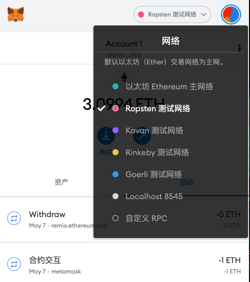
	- 申请测试币

		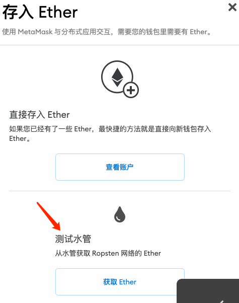
		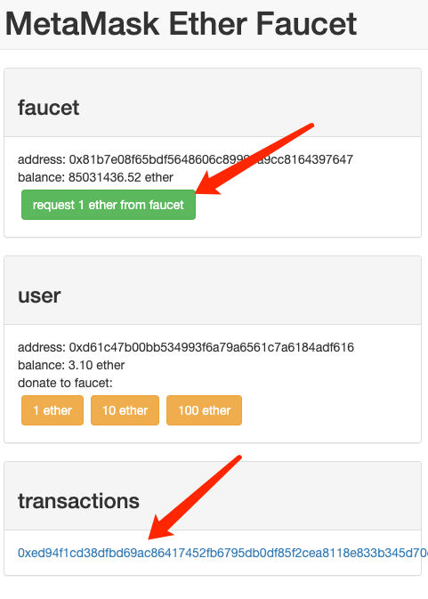		
- Infura

	当 MetaMask 连接到测试网络时，它使用 Infura 服务提供商来访问 JSON-RPC 接口。Infura 诞生的目的是为 ConsenSys 内部项目提供稳定可靠的 RPC 访问。除了 JSON-RPC API 之外，Infura 还提供 REST（表述性状态转移）API，IPFS（星际文件系统，即去中心化存储）API 和 Websockets（即流式传输）API。

	Infura 为 Ethereum 主网，Ropsten，Kovan，Rinkeby 和 INFURAnet（用于 Infura 的定制测试网络）提供网关 API。

	要通过 MetaMask 使用 Infura 进行较低级别的活动，你不需要账户。要直接使用 API，你需要注册一个账户并使用 Infura 提供的 API 密钥。

	有关Infura的更多信息，请访问：https://infura.io/
- Remix集成开发环境（IDE）

	Remix IDE 可用于在主网和测试网上部署和交互智能合约，包括 Ropsten，Rinkeby和Kovan（Web3 提供者使用 Infura 地址和 API 密钥或通过 Injected Web3 使用 MetaMask 中选择的网络）和 Ganache（ Web3提供端点 http://localhost:8545）

		https://github.com/ethereum/remix/blob/master/docs/run_tab.rst https://medium.com/swlh/deploy-smart-contracts-on-ropsten-testnet-through-ethereum-remix-233cd1494b4b
- Geth

	Geth 本身支持 Ropsten 和 Rinkeby 网络。要连接到 Ropsten 网络，请使用命令行参数：

		geth --testnet
	这将开始同步 Ropsten 区块链。名为 testnet 的新目录将在你的主 Ethereum 数据目录中创建。一个 keystore 目录将在 testnet 内部创建，并将存储你的 testnet 帐户的私钥。在撰写本文时，Ropsten 区块链比以太坊主区块链小得多：大约14GB的数据。由于测试网需要的资源较少，因此首先在测试网上设置并测试你的代码会更简单。

	与 testnet 的交互与 mainnet 类似。你可以使用控制台启动 Geth testnet，方法是运行：

		geth --testnet console
	这使得执行操作成为可能，例如开设新账户，检查余额，检查其他以太坊地址的余额等。 在 Geth 控制台之外运行时，只需将 `--testnet` 参数添加到命令行指令中，就可以执行类似于在主网上执行的操作。作为列举所有可用的 testnet 帐户及其地址的示例，请运行：

		geth --testnet account list

	Tip

		虽然小得多，但测试网仍需要一些时间才能完全同步。

	你可以通过在 geth 交互式控制台中运行以下命令来检查 geth 是否已完成同步测试网络：

		eth.getBlock("latest").number
	一旦你的 testnet节点完全同步，这应该返回一个非0的数字。你可以将该编号与已知的 testnet 区块浏览器中的最新块进行比较，例如 https://ropsten.etherscan.io/

同样，要连接到Rinkeby测试网络，请使用命令行参数：

		geth --rinkeby
- Parity

	Parity 客户端支持 Ropsten 和 Kovan 测试网络。你可以用+chain+参数选择你要连接的网络。例如，要同步 Ropsten 测试网络：

		parity --chain ropsten
	同样，要同步 Kovan 测试网络，请使用：

		parity --chain kovan

### 深入以太坊 Testnets
在这个阶段你可能会想：“我明白我为什么要使用测试网络，但为什么会有这么多呢？”

https://www.ethnews.com/ropsten-to-kovan-to-rinkeby-ethereums-testnet-troubles

- 工作量证明（挖矿）Proof-of-Work (Mining) 与 权威证明（联合签名）Proof-of-Authority (Federated Signing)

	https://github.com/ethereum/guide/blob/master/poa.md
- Morden（原始测试网）

	https://blog.ethereum.org/2016/11/20/from-morden-to-ropsten/
- Ropsten

	如果你想开始在 Ropsten 网络上测试合约，有几个 faucet 可以供给你 Ropsten 的 ether。如果 faucet 不起作用，请尝试不同的 faucet。

	- http://faucet.ropsten.be:3001/ 这个faucet提供了应该排队接收测试以太的地址的可能性。
	- bitfwd Ropsten Faucet 

		https://faucet.bitfwd.xyz/。
	- Kyber Network Ropsten Faucet 

		https://faucet.kyber.network/。
	- MetaMask Ropsten Faucet 

		https://faucet.metamask.io/
	- Ropsten Testnet Mining Pool 

		http://pool.ropsten.ethereum.org/
	- Etherscan Ropsten Pool 

		https://ropsten.etherscan.io/

- Rinkeby

	Rinkeby 水龙头位于 https://faucet.rinkeby.io/。 要请求测试 ether，有必要在 Twitter，Google Plus 或 Facebook 上发布公开信息。
	
	- https://www.rinkeby.io/
	- https://rinkeby.etherscan.io/
- Kovan

	Kovan testnet 支持各种方法来请求测试 ether。 更多信息可以在 https://github.com/kovan-testnet/faucet/blob/master/README.md 找到。

	- https://medium.com/@Digix/announcing-kovan-a-stable-ethereum-public-testnet-10ac7cb6c85f
	- https://kovan-testnet.github.io/website/
	- https://kovan.etherscan.io/

#### 以太坊经典Testnets
- Morden

	以太坊经典目前运行着 Morden 测试网的一个变体，与以太坊经典活跃网络保持功能相同。你可以通过 gastracker RPC 或者为 `geth` 或 `parity` 提供一个标志来连接它.

	- Faucet: http://testnet.epool.io/
	- Gastracker RPC: https://web3.gastracker.io/morden
	- Block Explorer: http://mordenexplorer.ethertrack.io/home
	- Geth flag

			geth --chain=morden
	- Parity flag

			parity --chain=classic-testnet

### 以太坊测试网的历史
Olympic, Morden to Ropsten, Kovan, Rinkeby

- Olympic testnet (Network ID: 0) 

	 Frontier 首个公共测试网（简称Ethereum 0.9）。它于2015年初推出，2015 年中期被 Morden 取代时弃用。
- Ethereum’s Morden testnet (Network ID: 2) 

	与 Frontier 一起发布，从2015年7月开始运行，直到2016年11月不再使用。虽然任何使用以太坊的人都可以创建测试网，但 Morden 是第一个“官方”公共测试网，取代了 Olympic 测试网。由于臃肿区块链的长同步时间以及 Geth 和 Parity 客户端之间的共识问题，测试网络重新启动并重新生成为 Ropsten。
- Ropsten (Network ID: 3)

	是一个针对 Homestead 的公共跨客户端测试网，于 2016 年晚些时候推出，并作为公共测试网顺利运行至2017年2月底。根据 Ethereum 的核心开发人员PéterSzilágyi的说法，二月的时候，“恶意行为者决定滥用低 PoW，并逐步将 gas 限制提高到90亿（从普通的470万），发送巨大交易损害了整个网络”。Ropsten 在2017年3月被恢复。
	
		https://github.com/ethereum/ropsten
- Kovan (Network ID: 42) 

	是由 Parity 的权威证明（PoA）共识算法驱动的 Homestead 的公共 Parity 测试网络。该测试网不受垃圾邮件攻击的影响，因为 ether 供应由可信方控制。这些值得信赖的各方是在Ethereum 上积极开发的公司。 尽管看起来这应该是以太坊测试网问题的解决方案，但在以太坊社区内似乎存在关于 Kovan 测试网的共识问题。
	
		https://github.com/kovan-testnet/proposal
- Rinkeby (Network ID: 4) 

	是由 Ethereum 团队于2017年4月开始的 Homestead 发布的 Geth 测试网络，并使用 PoA 共识协议。以斯德哥尔摩的地铁站命名，它几乎不受垃圾邮件攻击的影响（因为以太网供应由受信任方控制）。请参阅EIP 225：https://github.com/ethereum/EIPs/issues/225

### 工作量证明（挖矿）Proof-of-Work (Mining) 与 权威证明（联合签名）Proof-of-Authority (Federated Signing)
	https://github.com/ethereum/guide/blob/master/poa.md
- Proof-of-Work 是一种协议

	必须执行挖矿（昂贵的计算机计算）以在区块链（分布式账本）上创建新的区块（去信任的交易）。 缺点：能源消耗。集中的哈希算力与集中的采矿农场，不是真正的分布式。挖掘新块体所需的大量计算能力对环境有影响。
- Proof-of-Authority 是一种协议

	它只将造币的负载分配给授权和可信的签名者，他们可以根据自己的判断并随时以发币频率分发新的区块。https://github.com/ethereum/EIPs/issues/225 优点：具有最显赫的身份的区块链参与者通过算法选择来验证块来交付交易。

	https://www.deepdotweb.com/2017/05/21/generalized-proof-activity-poa-forking-free-hybrid-consensus/

### 运行本地测试网
Ganache: 以太坊开发的个人区块链

你可以使用 Ganache 部署合约、开发应用程序并运行测试。它可用作 Windows，Mac和Linux的桌面应用程序。

网站: http://truffleframework.com/ganache

Ganache CLI: Ganache 作为命令行工具。

这个工具以前称为“ethereumJS TestRPC”。https://github.com/trufflesuite/ganache-cli/

	$ npm install -g ganache-cli
让我们开始以太坊区块链协议的节点模拟。 

- \* []检查 `--networkId` 和 `--port` 标志值是否与 truffle.js 中的配置相匹配 
- \* []检查 `--gasLimit` 标志值是否与 https://ethstats.net 上显示的最新主网 gas 极限（即8000000 gas）相匹配，以避免不必要地遇到 `gas` 异常。
- 请注意，4000000000 的 `--gasPrice` 代表 4 gwei 的 gas 价格。 
- * [] 可以输入一个 `--mnemonic` 标志值来恢复以前的高清钱包和相关地址

命令行
		
	$ ganache-cli \
	  --networkId=3 \
	  --port="8545" \
	  --verbose \
	  --gasLimit=8000000 \
	  --gasPrice=4000000000;

## 第五章 密钥，地址
以太坊的基础技术之一是密码学 cryptography，它是数学的一个分支，广泛用于计算机安全。密码学在希腊文中的意思是“秘密写作”，但密码学的科学不仅仅包含秘密协作，它被称为加密。加密也可以用来证明秘密的知识而不泄露该秘密（数字签名），或者证明数据的真实性（数字指纹）。这些类型的密码学证明是以太坊和大多数区块链系统的关键数学工具，广泛用于以太坊应用。讽刺的是，加密并不是以太坊的重要组成部分，因为它的通信和交易数据没有加密，也不需要加密以保护系统。在本章中，我们将以密钥和地址的形式介绍一些以太坊用来控制资金所有权的密码学。
### 简介
以太坊有两种不同类型的账户，可以拥有和控制 ether：

- 外部所有账户（EOA）
- 合约账户

在本节中，我们将研究使用密码学来确定外部所有账户（即私人密钥）对 ether 的所有权。

EOAs 中以太的所有权通过以下内容建立的

- 数字密钥(digital keys)

	数字密钥实际上并不存储在区块链中或在以太坊网络上传输，而是由用户创建并存储在文件或称为_钱包_的简单数据库中。用户钱包中的数字密钥完全独立于以太坊协议，可以由用户的钱包软件生成和管理，无需参考区块链或访问互联网。数字密钥可实现以太坊的许多有趣特性，包括去中心化的信任和控制以及所有权证明。
	
	数字密钥成对组成，密钥和公钥。将公钥视为类似于银行帐号，私钥类似于私密PIN，用于控制帐户。以太坊的用户很少看到这些数字密钥。在大多数情况下，它们存储在钱包文件内并由以太坊钱包软件管理。
- 以太坊地址

	在以太坊交易的付款部分中，预期收款人由_以太坊地址_表示，该地址与支票上的收款人名称相同（即“付款给谁”）。在大多数情况下，以太坊地址是从公钥生成并对应的。但是，并非所有以太坊地址都代表公钥。他们也可以代表合同，我们将在 [contracts] 中看到。以太坊地址是用户常会看到的唯一密钥表示，因为这是他们需要与世界分享的部分。
- 数字签名

	以太坊交易需要将有效的数字签名包含在区块链中，该签名只能使用密钥生成；因此，任何拥有该密钥副本的人都可以控制 ether。以太坊交易中的数字签名证明了资金的真正所有者。

首先，我们将介绍密码学并解释以太坊使用的数学。接下来，我们将看看密钥是如何生成，存储和管理的。最后，我们将回顾用于表示私钥和公钥以及地址的各种编码格式。

### 公钥密码技术和加密货币
公钥密码技术是现代信息安全的核心概念。首先由 Martin Hellman，Whitfield Diffie和Ralph Merkle在20世纪70年代公开发明的，这是一个巨大的突破，它激起了公众对密码学领域的广泛兴趣。在70年代以前，强大的密码学知识在政府的控制下，很少有公开的研究，直到公钥密码技术研究的公开发表。

公钥密码系统使用唯一的密钥来保护信息。这些独特的密钥基于具有独特属性的数学函数：它们很容易在一个方向上计算，但很难在相反方向上计算。基于这些数学函数，密码学能够创建数字密钥和不可伪造的数字签名，这些签名由数学定律保证。

例如，计算两个大素数的乘积是微不足道的。但是给定两个大素数的乘积，很难找到这两个素数（称为_素因式分解_问题）。假设我提供数字 6895601 并告诉你它是两个素数的乘积。找到这两个素数要比让它们相乘生产 6895601 要困难得多。

如果你知道一些秘密信息，这些数学函数可以很容易地被反转。在我们上面的例子中，如果我告诉你一个主素数是 1931，你可以简单地用一个简单的除法找到另一个：6895601/1931 = 3571。这样的函数被称为 _trapdoor 函数_因为给定一个秘密信息，你可以采取一个快捷方式，使得反转该函数很简单。

在密码学中有用的另一类数学函数基于椭圆曲线上的算术运算。在椭圆曲线算术中，乘以模数是简单的，但是除法是不可能的（一个被称为_离散对数_的问题）。椭圆曲线密码术在现代计算机系统中被广泛使用，并且是以太坊（和其他加密货币）数字密钥和数字签名的基础。

Tip

更多关于密码学和现代密码学中使用的数学函数：

- 密码： https://en.wikipedia.org/wiki/Cryptography
- Trapdoor函数： https://en.wikipedia.org/wiki/Trapdoor_function
- 素因子分解： https://en.wikipedia.org/wiki/Integer_factorization
- 离散对数： https://en.wikipedia.org/wiki/Discrete_logarithm
- 椭圆曲线密码学： https：//en.wikipedia.org/wiki/Elliptic_curve_cryptography

在以太坊，我们使用公钥加密技术来创建一个密钥对，以控制对 ether 的访问，并允许我们对合同进行身份验证。密钥对由私钥和唯一公钥组成，并且被认为是“一对儿”，因为公钥是从私钥中派生出来的。公钥用于接收资金，私钥用于创建数字签名来签署交易以支付资金。数字签名也可用于验证合同的所有者或用户，我们将在 << contract_authentication>> 中看到。

公钥和私钥之间存在数学关系，允许私钥用于在消息上生成签名。该签名可以在不公开私钥的情况下使用公钥进行验证。

当使用 ether 时，当前所有者在交易中呈现她的公钥和签名（每次不同，但是使用相同的私钥创建）。通过公钥和签名，以太坊系统中的每个人都可以独立验证并接受交易的有效性，从而确认在转移 ether 的人拥有他们。

	Tip
	在大多数钱包实现中，为了方便起见，私钥和公钥一起存储为 _key pair_。但是，公钥可以由私钥进行简单计算，因此只存储私钥也是可以的。

#### 为什么使用不对称加密（公钥/私钥）？
为什么在以太坊使用非对称密码术？它不习惯“加密”（保密）交易。相反，非对称密码术的有用特性是产生数字签名的能力。私钥可应用产生交易的数字签名。这个签名只能由知道私钥的人制作。但是，任何有权访问公钥和交易签名的人都可以使用它们来验证。非对称加密技术的这一有用特性使任何人都可以验证每笔交易的每个签名，

### 私钥
私钥只是一个随机选取的数字。私有密钥的所有权和控制权是用户控制与相应以太坊地址相关联的所有资金的基础，也是对该地址的合同的访问权授权。通过证明交易中使用的资金的所有权，私钥用于创建花费 ether 所需的签名。私钥在任何时候都必须保密，因为向第三方透露密钥相当于让他们控制以太和由该密钥保证的合同。私钥还必须备份并防止意外丢失。如果它丢失了，无法恢复，它保护的资金也将永远丢失。

	Tip
	以太坊私钥只是一个数字。你可以使用硬币，铅笔和纸随机挑选你的私钥：投掷硬币256次，得到可以在以太坊钱包中使用的随机二进制数字作为私钥。然后可以从私钥生成公钥和地址。
#### 从随机数生成私钥
生成密钥的第一步也是最重要的一步是找到一个安全的熵源或随机源。创建以太坊私钥基本上与“选择1到2 256之间的数字”相同。只要不可预测和不可重复，用于选择该数字的确切方法并不重要。以太坊软件使用底层操作系统的随机数生成器生成256位熵（随机性）。通常，操作系统随机数生成器是由一个人为的随机源进行初始化的，这就是为什么钱包软件会要求你将鼠标左右摇摆几秒钟或者按下键盘上的随机键。

更确切地说，可能的私钥范围略小于2256。在以太坊中，私钥可以是 +1+ 和 +n-1+ 之间的任何数字，其中 n 是定义为使用的椭圆曲线的阶数的常数（n = 1.158*1077，略小于2256）（参见椭圆曲线密码学解释）。

为了创建这样的密钥，我们随机选择一个256位数字并检查它是否小于+n-1+。在编程方面，这通常是通过将从密码学安全的随机源收集的更大的随机比特串提供给256位哈希算法（如Keccak-256 或 SHA256）（参见 [cryptographic_hash_algorithm]），产生一个256位数字。如果结果小于+n-1+，我们有一个合适的私钥。否则，我们只需再次尝试使用另一个随机数。

	Warning
	不要编写自己的代码来创建随机数或使用你的编程语言提供的“简单”随机数发生器。
	使用密码学安全的伪随机数字发生器（CSPRNG）和来自足够熵源的种子。
	研究你选择的随机数生成器库的文档，以确保其是密码学安全的。正确实施 CSPRNG 对于密钥的安全至关重要。
以下是以十六进制格式显示的随机生成的私钥（k）（256位，显示为 64 个十六进制数字，每个4位）：

	f8f8a2f43c8376ccb0871305060d7b27b0554d2cc72bccf41b2705608452f315

Tip

以太坊的私人密钥空间的大小（2256）是一个难以置信的大数目。十进制大约是1077。可见宇宙估计含有 1080 原子。

### 公钥
以太坊公钥是一个椭圆曲线上的_点_ point，意思是它是一组满足椭圆曲线方程的X和Y坐标。

简单来说，以太坊公钥是两个数字，并联在一起。这些数字是通过一次单向的计算从私钥生成的。这意味着，如果你拥有私钥，则计算公钥是微不足道的。但是你不能从公钥中计算私钥。

公钥使用椭圆曲线乘法和私钥计算，这是不可逆的：K = k * G，

- 其中_k_是私钥
- G_是一个称为_generator point_的常数点，
- _K_是结果公钥。

如果你知道_K，那么称为“寻找离散对数”的逆运算就像尝试所有可能的_k_值一样困难，也就是蛮力搜索。

简单地说：椭圆曲线上的算术不同于“常规”整数算术。点（G）可以乘以整数（k）以产生另一点（K）。但是没有_除法_这样的东西，所以不可能简单地用公共密钥K除以点G来计算私钥k。这是公钥密码技术和加密货币中描述的单向数学函数。

Tip

椭圆曲线乘法是密码学家称之为“单向”函数的一种函数：在一个方向（乘法）很容易完成，而在相反方向（除法）不可能完成。私钥的所有者可以很容易地创建公钥，然后与世界共享，因为知道没有人能够反转该函数并从公钥计算私钥。这种数学技巧成为证明以太坊资金所有权和合同控制权的不可伪造和安全数字签名的基础。

在我们演示如何从私钥生成公钥之前，我们先来看一下椭圆曲线加密。

### 椭圆曲线密码学解释
椭圆曲线密码术是一种基于离散对数问题的非对称或公钥密码体系，如椭圆曲线上的加法和乘法运算。

A visualization of an elliptic curve 是椭圆曲线的一个例子，类似于以太坊使用的曲线。

Tip

以太坊使用与比特币完全相同的椭圆曲线，称为 secp256k1 。这使得重新使用比特币的许多椭圆曲线库和工具成为可能。

Figure 1. A visualization of an elliptic curve

以太坊使用特定的椭圆曲线和一组数学常数，由国家标准与技术研究院（NIST）制定的名为 secp256k1 的标准中所定义的。secp256k1 曲线由以下函数定义，该函数产生一个椭圆曲线：

	\[\begin{equation} {y^2 = (x^3 + 7)}~\text{over}~(\mathbb{F}_p) \end{equation}\]
或

	\[\begin{equation} {y^2 \mod p = (x^3 + 7) \mod p} \end{equation}\]

mod p (模素数p) 表示该曲线在素数阶_p_的有限域上，也写作 \(\( \mathbb{F}_p \)\), 其中 p = 2256 – 232 – 29 – 28 – 27 – 26 – 24 – 1, 一个非常大的素数。

因为这条曲线是在有限的素数阶上而不是在实数上定义的，所以它看起来像是一个散布在二维中的点的模式，使得难以可视化。然而，数学与实数上的椭圆曲线的数学是相同的。作为一个例子，Elliptic curve cryptography: visualizing an elliptic curve over F(p), with p=17 在一个更小的素数阶17的有限域上显示了相同的椭圆曲线，显示了一个网格上的点的图案。secp256k1 以太坊椭圆曲线可以被认为是一个更复杂的模式，在一个不可思议的大网格上的点。

Figure 2. Elliptic curve cryptography: visualizing an elliptic curve over F(p), with p=17
例如，以下是坐标为（x，y）的点Q，它是 secp256k1 曲线上的一个点：

	Q = (49790390825249384486033144355916864607616083520101638681403973749255924539515, 59574132161899900045862086493921015780032175291755807399284007721050341297360)

Using Python to confirm that this point is on the elliptic curve 显示了如何使用Python检查它。变量x和y是上述点Q的坐标。变量 p 是椭圆曲线的主要阶数（用于所有模运算的素数）。Python的最后一行是椭圆曲线方程（Python中的％运算符是模运算符）。如果x和y确实是椭圆曲线上的点，那么它们满足方程，结果为零（0L+是零值的长整数）。

通过在命令行上键入+python 并复制下面的每行（不包括提示符 >>>），亲自尝试一下：

	Example 1. Using Python to confirm that this point is on the elliptic curve
	Python 3.4.0 (default, Mar 30 2014, 19:23:13)
	[GCC 4.2.1 Compatible Apple LLVM 5.1 (clang-503.0.38)] on darwin
	Type "help", "copyright", "credits" or "license" for more information.
	>>> p = 115792089237316195423570985008687907853269984665640564039457584007908834671663
	>>> x = 49790390825249384486033144355916864607616083520101638681403973749255924539515
	>>> y = 59574132161899900045862086493921015780032175291755807399284007721050341297360
	>>> (x ** 3 + 7 - y**2) % p
	0L
### 椭圆曲线算术运算
很多椭圆曲线数学看起来很像我们在学校学到的整数算术。具体而言，我们可以定义一个加法运算符，而不是添加数字就是在曲线上添加点。一旦我们有了加法运算符，我们也可以定义一个点和一个整数的乘法，等于重复加法。

A lot of elliptic curve math looks and works very much like the integer arithmetic we learned at school. Specifically, we can define an addition operator, which instead of adding numbers is adding points on the curve. Once we have the addition operator, we can also define multiplication of a point and a whole number, such that it is equivalent to repeated addition.

加法定义为给定椭圆曲线上的两个点 P1 and P2 , 第三个点 P3 = P1 + P2, 也在椭圆曲线上。

在几何上，这个第三点 P3 是通过在 P1和 P2之间画一条直线来计算的。这条线将在另外一个地方与椭圆曲线相交。称此点为 P3 = (x, y)。然后在x轴上反射得到 P3 = (x, –y)。

在椭圆曲线数学中，有一个叫做“无穷点”的点，它大致对应于零点的作用。在计算机上，它有时用 x = y = 0表示（它不满足椭圆曲线方程，但它是一个容易区分的情况，可以检查）。有几个特殊情况解释了“无穷点”的需要。

如果 P1 and P2 是同一点，P1 and P2 之间的直线应该延伸到曲线上 P1 的切线。 该切线恰好与曲线在一个新点相交。你可以使用微积分技术来确定切线的斜率。我们将我们的兴趣局限在具有两个整数坐标的曲线上，这些技巧令人好奇地工作！

在某些情况下（即，如果 P1 和 P2 具有相同的x值但不同的y值），切线将精确地垂直，在这种情况下P3 =“无穷点”。

如果 P1 是“无穷点”，那么 P1+ P2 = P2。 类似地, 如果 P2 是“无穷点”，P1 + P2 = P1。这显示了无穷点如何扮演零在“正常”算术中扮演的角色。

+ 是可结合的, (A + B) + C = A + (B + C). 这表示 A + B + C 不加括号也没有歧义。

现在我们已经定义了加法，我们可以用扩展加法的标准方式来定义乘法。对于椭圆曲线上的点P，如果k是整数，则 k * P = P + P + P + …​ + P (k 次)。请注意，在这种情况下，k有时会被混淆地称为“指数”。

### 生成一个公钥
以一个随机生成的数字_k_的私钥开始，我们通过将它乘以称为  generator point_ G_的曲线上的预定点，在曲线上的其他位置产生另一个点，这是相应的公钥_K。生成点被指定为+secp256k1+ 标准的一部分，对于 +secp256k1+ 的所有实现始终相同，并且从该曲线派生的所有密钥都使用相同的点 _G_：

	\[\begin{equation} {K = k * G} \end{equation}\]
其中_k_是私钥，G_是生成点，_K_是生成的公钥，即曲线上的一个点。因为所有以太坊用户的生成点始终相同，所以_G_乘以_G_的私钥总是会导致相同的公钥_K。k_和_K_之间的关系是固定的，但只能从_k_到_K_的一个方向进行计算。这就是为什么以太坊地址（来自_K）可以与任何人共享，并且不会泄露用户的私钥（k）。

正如我们在椭圆曲线算术运算中所描述的那样，k * G的乘法相当于重复加，G + G + G + …​ + G ，重复k次。总而言之，为了从私钥_k_生成公钥_K_，我们将生成点_G_添加到自己_k_次。

	Tip
	私钥可以转换为公钥，但公钥不能转换回私钥，因为数学只能单向工作。

让我们应用这个计算来找到我们在私钥中给出的特定私钥的公钥：

私钥到公钥计算的示例
	
	K = f8f8a2f43c8376ccb0871305060d7b27b0554d2cc72bccf41b2705608452f315 * G
密码库可以帮助我们使用椭圆曲线乘法计算K值。得到的公钥_K_被定义为一个点 K = (x,y) ：

根据示例私钥计算出的示例公钥

	K = (x, y)
	
	where,
	
	x = 6e145ccef1033dea239875dd00dfb4fee6e3348b84985c92f103444683bae07b
	y = 83b5c38e5e2b0c8529d7fa3f64d46daa1ece2d9ac14cab9477d042c84c32ccd0
在以太坊中，你可以看到公钥以 66 个十六进制字符（33字节）的十六进制序列表示。这是从行业联盟标准高效密码组（SECG）提出的标准序列化格式采用的，在 http://www.secg.org/sec1-v2.pdf[Standards for Efficient Cryptography（SEC1）](http://www.secg.org/sec1-v2.pdf) 中有记载。

该标准定义了四个可用于识别椭圆曲线上点的可能前缀：

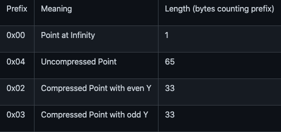

以太坊只使用未压缩的公钥，因此唯一相关的前缀是（十六进制）04。顺序连接公钥的X和Y坐标：

	04 + X-coordinate (32 bytes/64 hex) + Y coordinate (32 bytes/64 hex)
因此，我们在 Example public key calculated from the example private key 中计算的公钥被序列化为：

	046e145ccef1033dea239875dd00dfb4fee6e3348b84985c92f103444683bae07b83b5c38e5e2b0c8529d7fa3f64d46daa1ece2d9ac14cab9477d042c84c32ccd0
### 椭圆曲线库
加密货币相关项目中使用了 secp256k1 椭圆曲线的几个实现：

- OpenSSL

	OpenSSL 库提供了一套全面的加密原语，包括 secp256k1 的完整实现。例如，要派生公钥，可以使用函数+EC_POINT_mul()+。
	
	https://www.openssl.org/
- libsecp256k1

	Bitcoin Core 的 libsecp256k1 是 secp256k1 椭圆曲线和其他密码原语的C语言实现。椭圆曲线密码学的 libsecp256 是从头开始编写的，代替了 Bitcoin Core 软件中的 OpenSSL，在性能和安全性方面被认为是优越的。
	
	https://github.com/bitcoin-core/secp256k1

### 加密哈希函数
加密哈希函数在整个以太坊使用。事实上，哈希函数几乎在所有密码系统中都有广泛应用，这是密码学家布鲁斯•施奈尔（Bruce Schneier）所说的一个事实，他说：“单向哈希函数远不止于加密算法，而是现代密码学的主要工具。

在本节中，我们将讨论哈希函数，了解它们的基本属性以及这些属性如何使它们在现代密码学的很多领域如此有用。我们在这里讨论哈希函数，因为它们是将以太坊公钥转换成地址的一部分。

简而言之，“哈希函数是可用于将任意大小的数据映射到固定大小的数据的函数。” [Source：Wikipedia](https://en.wikipedia.org/wiki/Hash_function)。哈希函数的输入称为 `原象 _ pre-image` 或 `消息 message` 。输出被称为 `哈希 hash`或 `摘要 digest`。哈希函数的一个特殊子类别是加密哈希函数，它具有对密码学有用的特定属性。

加密哈希函数是一种_单向_哈希函数，它将任意大小的数据映射到固定大小的位串，如果知道输出，计算上不可能重新创建输入。确定输入的唯一方法是对所有可能的输入进行蛮力搜索，检查匹配输出。

加密哈希函数有五个主要属性 (Source: Wikipedia/Cryptographic Hash Function):

- 确定性

	任何输入消息总是产生相同的哈希摘要。
- 可验证性

	计算消息的哈希是有效的（线性性能）。
- 不相关

	对消息的小改动（例如，一位改变）会大幅改变哈希输出，以致它不能与原始消息的哈希相关联。
- 不可逆性

	从哈希计算消息是不可行的，相当于通过可能的消息进行蛮力搜索。
- 碰撞保护

	计算两个不同的消息产生相同的哈希输出应该是不可行的。

碰撞保护对于防止以太坊中的数字签名伪造至关重要。

这些属性的组合使加密哈希函数可用于广泛的安全应用程序，包括：

- 数据指纹识别
- 消息完整性（错误检测）
- 工作证明
- 认证（密码哈希和密钥扩展）
- 伪随机数发生器
- 原象承诺
- 唯一标识符

通过研究系统的各个层面，我们会在以太坊找到它的很多应用。

### 以太坊的加密哈希函数 - Keccak-256
以太坊在许多地方使用_Keccak-256_加密哈希函数。Keccak-256 被设计为于2007年举行的SHA-3密码哈希函数竞赛的候选者。Keccak 是获胜的算法，在2015年被标准化为 FIPS（联邦信息处理标准）202。

然而，在以太坊开发期间，NIST 标准化工作正在完成。在标准过程完成后，NIST调整了 Keccak 的一些参数，据称可以提高效率。这与斯诺登透露的文件暗示 NIST 可能受到国家安全局的不当影响同时发生，故意削弱 Dual_EC_DRBG 随机数生成器标准，有效地在标准随机数生成器中放置一个后门。这场争论的结果是对所提议修改的反对以及 SHA-3 标准化的严重拖延。当时，以太坊基金会决定实施最初的 Keccak 算法。

	Warning
	虽然你可能在 Ethereum 文档和代码中看到“SHA3”，但很多（如果不是全部）这些实例实际上是指 Keccak-256，而不是最终确定的 FIPS-202 SHA-3 标准。实现差异很小，与填充参数有关，但它们的重要性在于 Keccak-256 在给定相同输入的情况下产生与 FIPS-202 SHA-3 不同的哈希输出。

由于 Ethereum 中使用的哈希函数（Keccak-256）与最终标准（FIP-202 SHA-3）之间的差异造成了混淆，因此正在努力将代码中所有的 sha3 的所有实例，操作码和库重新命名为 keccak256。详情请参阅 https://github.com/ethereum/EIPs/issues/59[ERC-59](https://github.com/ethereum/EIPs/issues/59)。
### 我正在使用哪个哈希函数？
如何判断你使用的软件库是 FIPS-202 SHA-3 还是 Keccak-256（如果两者都可能被称为“SHA3”）？

一个简单的方法是使用_test vector_，一个给定输入的预期输出。最常用于哈希函数的测试是_empty input_。如果你使用空字符串作为输入运行哈希函数，你应该看到以下结果：

	Keccak256("") =
	c5d2460186f7233c927e7db2dcc703c0e500b653ca82273b7bfad8045d85a470
	
	SHA3("") =
	a7ffc6f8bf1ed76651c14756a061d662f580ff4de43b49fa82d80a4b80f8434a
因此，无论调用什么函数，都可以通过运行上面的简单测试来测试它是否是原始的 Keccak-256 或最终的NIST标准 FIPS-202 SHA-3。请记住，以太坊使用 Keccak-256，尽管它在代码中通常被称为 SHA-3。

接下来，让我们来看一下 Ethereum 中 Keccak-256 的第一个应用，即从公钥生成以太坊地址。

### 以太坊地址
以太坊地址是唯一标识符 unique identifiers，它们是使用单向哈希函数（Keccak-256）从公钥或合约派生的。

在我们之前的例子中，我们从一个私钥开始，并使用椭圆曲线乘法来派生一个公钥：

- Private Key k:

		k = f8f8a2f43c8376ccb0871305060d7b27b0554d2cc72bccf41b2705608452f315
- Public Key K (X and Y coordinates concatenated and shown as hex):

		K = 6e145ccef1033dea239875dd00dfb4fee6e3348b84985c92f103444683bae07b83b5c38e5e2b0c8529d7fa3f64d46daa1ece2d9ac14cab9477d042c84c32ccd0

		Warning
		值得注意的是，在计算地址时，公钥没有用前缀（十六进制）04格式化。

- 我们使用 Keccak-256 来计算这个公钥的 _hash_：

		Keccak256(K) = 2a5bc342ed616b5ba5732269001d3f1ef827552ae1114027bd3ecf1f086ba0f9
- 然后我们只保留最后的20个字节（大端序中的最低有效字节），这是我们的以太坊地址：

		001d3f1ef827552ae1114027bd3ecf1f086ba0f9
- 大多数情况下，你会看到带有前缀“0x”的以太坊地址，表明它是十六进制编码，如下所示：

		0x001d3f1ef827552ae1114027bd3ecf1f086ba0f9

### 以太坊地址格式
以太坊地址是十六进制数字，从公钥的 Keccak-256 哈希的最后 20 个字节导出的标识符。

与所有客户端的用户界面中编码的比特币地址不同，它们包含内置校验和来防止输入错误的地址，以太坊地址以原始十六进制形式呈现，没有任何校验和。

该决定背后的基本原理是，以太坊地址最终会隐藏在系统高层的抽象（如名称服务）之后，并且必要时应在较高层添加校验和。

回想起来，这种设计选择导致了一些问题，包括由于输入错误地址和输入验证错误而导致的资金损失。以太坊名称服务的开发速度低于最初的预期，诸如 ICAP 之类的替代编码被钱包开发商采用得非常缓慢。

#### 互换客户端地址协议 Inter Exchange Client Address Protocol (ICAP)
[互换客户端地址协议ICAP](https://github.com/ethereum/wiki/wiki/%5BSimplified-Chinese%5D-Ethereum-TOC)是一种部分与国际银行帐号（IBAN）编码兼容的以太坊地址编码，为以太坊地址提供多功能、校验和互操作编码。ICAP 地址可以编码以太坊地址或通过以太坊名称注册表注册的常用名称。

	阅读以太坊Wiki上的ICAP：https://github.com/ethereum/wiki/wiki/ICAP:-Inter-exchange-Client-Address-Protocol
IBAN是识别银行账号的国际标准，主要用于电汇。它在欧洲单一欧元支付区（SEPA）及其以后被广泛采用。IBAN 是一项集中和严格监管的服务。ICAP 是以太坊地址的分散但兼容的实现。

一个 IBAN 由含国家代码，校验和和银行账户标识符（特定国家）的34个字母数字字符（不区分大小写）组成。

ICAP 使用相同的结构，通过引入代表“Ethereum”的非标准国家代码“XE”，后面跟着两个字符的校验和以及3个可能的账户标识符变体：

- Direct

	最多30个字母数字字符 big-endian base-36 整数，表示以太坊地址的最低有效位。由于此编码适合小于155位，因此它仅适用于以一个或多个零字节开头的以太坊地址。就字段长度和校验和而言，它的优点是它与IBAN兼容。示例：XE60HAMICDXSV5QXVJA7TJW47Q9CHWKJD（33个字符长）
- Baasic

	与“Direct”编码相同，只是长度为31个字符。这使它可以编码任何以太坊地址，但使其与IBAN字段验证不兼容。示例：XE18CHDJBPLTBCJ03FE9O2NS0BPOJVQCU2P（35个字符长）
- Indrect

	编码通过名称注册表提供程序解析为以太坊地址的标识符。使用由_asset identifier_（例如ETH），名称服务（例如XREG）和9个字符的名称（例如KITTYCATS）组成的16个字母数字字符，这是一个人类可读的名称。示例：XE## ETHXREGKITTYCATS（20个字符长），其中“##”应由两个计算校验和字符替换。

我们可以使用 `helpeth` 命令行工具来创建 ICAP 地址。让我们尝试使用我们的示例私钥（前缀为0x并作为参数传递给 helpeth）：

	$ helpeth keyDetails -p 0xf8f8a2f43c8376ccb0871305060d7b27b0554d2cc72bccf41b2705608452f315

	Address: 0x001d3f1ef827552ae1114027bd3ecf1f086ba0f9
	ICAP: XE60 HAMI CDXS V5QX VJA7 TJW4 7Q9C HWKJ D
	Public key: 0x6e145ccef1033dea239875dd00dfb4fee6e3348b84985c92f103444683bae07b83b5c38e5e2b0c8529d7fa3f64d46daa1ece2d9ac14cab9477d042c84c32ccd0
`helpeth` 命令为我们构建了一个十六进制以太坊地址以及一个 ICAP 地址。我们示例密钥的 ICAP 地址是：

	XE60HAMICDXSV5QXVJA7TJW47Q9CHWKJD
由于我们的示例以太坊地址恰好以零字节开始，因此可以使用 IBAN 格式中有效的 “Direct” ICAP 编码方法进行编码。因为它是33个字符长。

如果我们的地址不是从零开始，那么它将被编码为“Basic”编码，这将是35个字符长并且作为IBAN格式无效。

	Tip
	以零字节开始的任何以太坊地址的概率是1/256。为了生成这样一个类型，在我们找到一个作为IBAN兼容的“Direct”编码之前，它将平均用256个不同的随机私钥进行256次尝试ICAP地址。

不幸的是，现在，只有几个钱包支持 ICAP。

#### 使用大写校验和的十六进制编码 (EIP-55)
由于 ICAP 或名称服务部署缓慢，因此提出了一个新的标准，以太坊改进建议55（EIP-55）。你可以阅读详细信息：

	https://github.com/Ethereum/EIPs/blob/master/EIPS/eip-55.md
通过修改十六进制地址的大小写，EIP-55 为以太坊地址提供了向后兼容的校验和。这个想法是，以太坊地址不区分大小写，所有钱包都应该接受以大写字母或小写字母表示的以太坊地址，在解释上没有任何区别。

通过修改地址中字母字符的大小写，我们可以传达一个校验和，可以用来保护地址完整性，防止输入或读取错误。不支持 EIP-55 校验和的钱包简单地忽略地址包含混合大写的事实。但那些支持它的人可以验证它并以 99.986％ 的准确度检测错误。

混合大小写编码很微妙，最初你可能不会注意到它。我们的示例地址是：

	0x001d3f1ef827552ae1114027bd3ecf1f086ba0f9
使用 EIP-55 混合大小写校验和，它变为：

	0x001d3F1ef827552Ae1114027BD3ECF1f086bA0F9
你能看出区别吗？一些来自十六进制编码字母表的字母（AF）字符现在是大写字母，而另一些则是小写字母。除非你仔细观察，否则你甚至可能没有注意到其中的差异。

EIP-55 实施起来相当简单。我们采用小写十六进制地址的 Keccak-256 哈希。这个哈希作为地址的数字指纹，给我们一个方便的校验和。输入（地址）中的任何小改动都会导致哈希结果（校验和）发生很大变化，从而使我们能够有效地检测错误。然后我们的地址的哈希被编码为地址本身的大写字母。让我们一步步分解它：

1.  计算小写地址的哈希，不带 0x 前缀：:

		Keccak256("001d3f1ef827552ae1114027bd3ecf1f086ba0f9")
		23a69c1653e4ebbb619b0b2cb8a9bad49892a8b9695d9a19d8f673ca991deae1
- 如果哈希的相应十六进制数字大于或等于 0x8，则将每个字母地址字符大写。如果我们排列地址和哈希，这将更容易显示：

		Address: 001d3f1ef827552ae1114027bd3ecf1f086ba0f9
		Hash   : 23a69c1653e4ebbb619b0b2cb8a9bad49892a8b9...
我们的地址在第四个位置包含一个字母 d。哈希的第四个字符是 6，小于+8+。所以，我们保持 d 小写。我们地址中的下一个字母字符是 f，位于第六位。十六进制哈希的第六个字符是 c，它大于+8 。因此，我们在地址中大写 +F，等等。正如你所看到的，我们只使用哈希的前20个字节（40个十六进制字符）作为校验和，因为我们只有20个字节（40个十六进制字符）能正确地大写。

检查自己产生的混合大写地址，看看你是否可以知道在地址哈希中哪些字符被大写和它们对应的字符：

	Address: 001d3F1ef827552Ae1114027BD3ECF1f086bA0F9
	Hash   : 23a69c1653e4ebbb619b0b2cb8a9bad49892a8b9...
#### 在 EIP-55 编码地址中检测错误
现在，我们来看看 EIP-55 地址如何帮助我们发现错误。假设我们已经打印出 ETHER-E 编码的以太坊地址：

	0x001d3F1ef827552Ae1114027BD3ECF1f086bA0F9
现在，让我们在阅读该地址时犯一个基本错误。最后一个字符之前的字符是大写字母“F”。对于这个例子，我们假设我们误解为大写“E”。我们在钱包中输入（不正确的地址）：

	0x001d3F1ef827552Ae1114027BD3ECF1f086bA0E9
幸运的是，我们的钱包符合 EIP-55 标准！它注意到混合大写字母并试图验证地址。它将其转换为小写，并计算校验和哈希值：

	Keccak256("001d3f1ef827552ae1114027bd3ecf1f086ba0e9")
	5429b5d9460122fb4b11af9cb88b7bb76d8928862e0a57d46dd18dd8e08a6927
如你所见，即使地址只改变了一个字符（事实上，“e”和“f”只相隔1位），地址的哈希值已经根本改变了。这是哈希函数的特性，使它们对校验和非常有用！

现在，让我们排列这两个并检查大小写：

	001d3F1ef827552Ae1114027BD3ECF1f086bA0E9
	5429b5d9460122fb4b11af9cb88b7bb76d892886...
这都是错的！几个字母字符不正确地大写。请记住，大写是_正确的_校验和的编码。

我们输入的地址的大小写与刚刚计算的校验和不匹配，这意味着地址中的内容发生了变化，并且引入了错误。

## 第六章 钱包
在以太坊中，“钱包”一词有几个不同的含义。

在较高层次上，钱包是作为主要用户界面的应用程序。钱包控制对用户资金的访问，管理密钥和地址，追踪余额以及创建和签署交易。另外，一些以太坊钱包还可以与合约（如代币）进行交互。

狭义上讲，从程序员的角度来看，“钱包”一词是指用于存储和管理用户密钥的系统。每个“钱包”都有一个密钥管理组件。对于一些钱包来说，这就是全部。其他一些钱包是更广泛类别的一部分，即“浏览器”，它是以太坊去中心化应用或 “DApps” 的接口。在 “钱包” 这个术语下混合的各种类别之间没有明确的区别。

在本节中，我们将把钱包看作私钥的容器，并将其视为用于管理密钥的系统。
### 钱包技术概览
在本节中，我们总结了用于构建用户友好，安全，和灵活的以太坊钱包的技术。

关于以太坊的一个常见误解是以太坊钱包包含 ether 或代币。实际上，钱包只包含密钥。ether 或其他代币记录在以太坊区块链中。用户通过使用钱包中的密钥签署交易来控制网络上的代币。从某种意义上说，以太坊钱包是一个钥匙串 keychain。

Tip

以太坊钱包包含密钥，而不是 ether 或令牌。每个用户都有一个包含密钥的钱包。钱包真的是包含私钥/公钥的钥匙串（参见[private_public_keys]）。用户使用密钥签署交易，从而证明他们拥有 ether。ether 储存在区块链上。

有两种主要类型的钱包，通过它们包含的密钥是否彼此相关来区分。

- 第一种类型是 非确定性钱包 nondeterministic wallet

	每个密钥都是从随机数中独立生成的。密钥不相互关联。这种类型的钱包也被称为“Just a Bunch Of Keys”，JBOK 钱包。
- 第二种类型的钱包是 确定性钱包 deterministic wallet

	所有密钥都来自单个主密钥，称为_种子_ seed。这种类型的钱包中的所有钥匙都是相互关联的，如果有原始种子，可以再次生成。确定性钱包中使用了许多不同的密钥推导方法。最常用的派生方法使用树状结构，称为 _分层确定 _hierarchical deterministic_或_HD_钱包。

确定性钱包是从种子初始化的。为了使这些更容易使用，种子被编码为一些英文单词（或其他语言的词），称为 mnemonic code 助记词，接下来的几节将从较高的层次介绍这些技术。

#### 非确定性（随机）钱包
在第一个以太坊钱包（由Ethereum pre-sale创建）中，钱包文件存储一个随机生成的私钥。这些钱包正在被确定性的钱包取代，因为它们管理，备份和导入很麻烦。随机密钥的缺点是，如果你生成了许多密钥，你必须保留所有密钥的副本。每个密钥都必须备份，否则如果钱包变得不可访问，则其控制的资金将不可撤销地丢失。此外，以太坊地址重用可以通过将多个交易和地址相互关联来降低隐私。0型非确定性钱包是很少的选择，特别是如果你想避免地址重用，因为它意味着管理许多密钥，需要经常备份。

许多以太坊客户端（包括 go-ethereum 或 geth）使用_keystore_文件，这是一个 JSON 编码的文件，其中包含一个（随机生成的）私钥，由一个密码加密以提高安全性。JSON 文件的内容如下所示：

	{
	    "address": "001d3f1ef827552ae1114027bd3ecf1f086ba0f9",
	    "crypto": {
	        "cipher": "aes-128-ctr",
	        "ciphertext": "233a9f4d236ed0c13394b504b6da5df02587c8bf1ad8946f6f2b58f055507ece",
	        "cipherparams": {
	            "iv": "d10c6ec5bae81b6cb9144de81037fa15"
	        },
	        "kdf": "scrypt",
	        "kdfparams": {
	            "dklen": 32,
	            "n": 262144,
	            "p": 1,
	            "r": 8,
	            "salt": "99d37a47c7c9429c66976f643f386a61b78b97f3246adca89abe4245d2788407"
	        },
	        "mac": "594c8df1c8ee0ded8255a50caf07e8c12061fd859f4b7c76ab704b17c957e842"
	    },
	    "id": "4fcb2ba4-ccdb-424f-89d5-26cce304bf9c",
	    "version": 3
	}
keystore 格式使用_Key派生函数（KDF），也称为密码扩展算法，该算法可防止对密码加密的暴力破解，字典或彩虹表攻击。简而言之，私钥没有直接由密码短语加密。相反，通过反复对它进行哈希，密码被_拉长。哈希函数重复执行 262144 轮，可以在 keystore JSON 中的参数 `crypto.kdfparams.n` 看到。试图暴力破解密码短语的攻击者必须对每个尝试的密码应用 262144 轮哈希，这足以减缓攻击行为，从而使破解足够复杂性和够长的密码短语是不可行的。

有许多软件库可以读写 keystore 格式，例如JavaScript库 keythereum：

https://github.com/ethereumjs/keythereum

Tip

除简单测试以外，不鼓励使用非确定性钱包，他们太麻烦了，无法备份和使用。相反，使用具有  mnemonic 种子的基于行业标准的_HD钱包_。

#### 确定性（种子）钱包
确定性或“种子”钱包是包含私钥的钱包，所有私钥都来源于共同的种子，使用单向哈希函数生成。种子是随机生成的数字，可以与其他数据（如索引编号或“链码”（请参阅​HD 钱包 (BIP-32/BIP-44)））组合以导出私钥。在确定性钱包中，种子足以恢复所有派生的密钥，因此在创建时的单个备份就足够了。种子也足以用于钱包的导入和导出，允许在不同实现的钱包之间轻松迁移所有用户密钥。

- HD 钱包 (BIP-32/BIP-44)

	确定性钱包的开发使得从单个”种子“中获得许多密钥变得容易。确定性钱包的最先进的形式是由比特币的 BIP-32 标准定义的HD钱包。HD钱包包含以树状结构导出的密钥，以便父密钥可以生成一系列的子密钥，每个子密钥可以派生一系列孙子密钥等等，可以达到无限深度。这个树状结构在 [hd_wallet] 中进行说明。

	
	
	Figure 1. HD wallet: a tree of keys generated from a single seed

	与随机（非确定性）密钥相比，HD钱包具有两大优势。
	
	- 首先，树状结构可以用来表达额外的组织含义，例如，使用特定分支的子密钥来接收传入的支付，使用不同分支的子秘钥来接收支付时产生的零钱。密钥的分支也可用于公司设置，将不同分支分配给部门，子公司，特定职能或会计类别。
	- 其次是用户可以创建一系列公钥而无需访问相应的私钥。这允许 HD 钱包用于不安全的服务器上，或者仅用于只查看或只接收的地方，其中钱包没有可以花费资金的私钥。
- 种子和助记词（BIP-39）

	HD钱包是管理许多密钥和地址的非常强大的机制。如果将它们与一系列英文单词（或另一种语言的单词）相结合，更易于转录，和跨钱包的导出导入。这被称为_mnemonic_，标准由 BIP-39 定义。今天，许多以太坊钱包（以及用于其他加密货币的钱包）都使用此标准，并且可以使用可互操作的助记词导入和导出种子以进行备份和恢复。

	我们从实际的角度来看一下。下列哪种种子更容易转录，在纸上记录，无误地读取，导出并导入另一个钱包？

	确定性钱包的种子（十六进制）

		FCCF1AB3329FD5DA3DA9577511F8F137
	确定性钱包的种子，来自12个单词的助记符
	
		wolf juice proud gown wool unfair
		wall cliff insect more detail hub

#### 钱包最佳实践
随着加密货币钱包技术的成熟，某些常见行业标准使钱包广泛地互操作，易于使用，安全和灵活。这些标准还允许钱包从多个不同的加密货币中获取密钥，所有这些都来自助记词。这些通用标准是：

- 基于 BIP-39 的助记词
- 基于 BIP-32 的HD钱包
- 基于 BIP-43 的多用途HD钱包
- 基于 BIP-44 的多币种和多账户钱包

这些标准可能会改变，或者可能会因未来的发展而过时，但现在它们形成了一套互联技术，已成为大多数加密货币的事实上的钱包标准。

这些标准已广泛的被软件和硬件钱包采用，使所有这些钱包可以互操作。用户可以导出其中一个钱包上生成的助记词并将其导入另一个钱包，恢复所有交易，密钥和地址。

支持这些标准的软件钱包有 Jaxx，MetaMask，MyEtherWallet（MEW），硬件钱包有：Keepkey，Ledger和Trezor。

以下各节详细介绍了这些技术。

	Tip
	
	如果你正在实现以太坊钱包，则应该将其作为HD钱包构建，并将种子编码为易于备份的助记词，并遵循BIP-32，BIP-39，BIP-43和BIP -44标准，如以下各节所述。

#### 助记词 (BIP-39)
助记词是表示（编码）派生确定性钱包的种子的随机数的单词序列。单词序列足以重新创建种子，从而重新创建钱包和所有派生的密钥。使用助记词实现的确定性钱包会在首次创建钱包时向用户展示 12 至 24 个字的序列。该单字序列是钱包的备份，可用于在相同或任何兼容的钱包应用程序中恢复和重新创建所有密钥。

	Tip
	
	助记词经常与“脑钱包”混淆。他们不一样。主要区别在于脑钱包由用户选择的单词组成，而助记词由钱包随机创建并呈现给用户。这个重要的区别使助记词更加安全，因为人类是非常贫乏的随机性来源。

助记词在 BIP-39 中定义。请注意，BIP-39 是助记词编码标准的一个实现。有一个不同的标准，带有一组不同的单词，在 BIP-39 之前用于 Electrum 比特币钱包。BIP-39 由Trezor 硬件钱包背后的公司提出，与 Electrum 的实现不兼容。但是，BIP-39 现在已经在数十种可互操作实现方面取得了广泛的行业支持，应该被视为事实上的行业标准。此外，BIP-39 可用于生产支持以太坊的多币种钱包，而 Electrum 种子不能。

BIP-39 定义了助记词和种子的创建，我们在这里通过九个步骤来描述它。为了清楚起见，该过程分为两部分：

- 步骤1至6展示在生成助记词 
- 骤7至9展示在从助记词到种子

- 生成助记词

	助记词是由钱包使用 BIP-39 中定义的标准化流程自动生成的。钱包从熵源开始，添加校验和，然后将熵映射到单词列表：

	- 创建一个128到256位的随机序列（熵）
	- 通过取其 SHA256 哈希的第一部分（熵长度/32）来创建随机序列的校验和
	- 将校验和添加到随机序列的末尾
	- 将序列按照 11bits 划分
	- 将每个 11bits 的值映射到预定义字典中的 2048 个词中的一个
	- 助记词就是单词的序列

	Generating entropy and encoding as mnemonic words 展示了如何使用熵来生成助记词。

	
	
	Figure 2. Generating entropy and encoding as mnemonic words

	Mnemonic codes: entropy and word length 展示熵数据的大小和助记词的长度关系。

	Table 1. Mnemonic codes: entropy and word length
	
	
- 从助记词到种子

	助记符字表示长度为 128 到 256 位的熵。然后使用密钥扩展函数 PBKDF2 将熵导出成更长的（512位）种子。然后使用生成的种子构建确定性钱包并派生其密钥。

	密钥扩展函数有两个参数：
	
	- 助记词
	- salt

		在密钥扩展函数中使用盐的目的是使得构建能够进行暴力攻击的查找表不可行。在 BIP-39 标准中，盐有另一个目的，它允许引入密码，作为保护种子的附加安全因素，我们将在 BIP-39 中的可选密码短语中详细描述。

	步骤7到9中从 生成助记词 描述的过程后继续：

	- PBKDF2 密钥扩展函数的第一个参数是步骤6产生的助记词
	- PBKDF2 密钥扩展函数的第二个参数是盐。盐由用户提供的密码字符串和“mnemonic”组合起来
	- PBKDF2 使用 2048 轮 HMAC-SHA512 哈希算法，扩展助记词和盐，生成 512 位的种子。

	[fig_5_7] 展示如何使用助记词来生成种子。

	
	
	Figure 3. From mnemonic to seed

	Tip
	
	密钥扩展函数及其 2048 轮哈希对抵御助记词或密码攻击具有一定的有效保护作用。它使（在计算中）尝试超过几千个密码和助记词组合的成本高昂，因为可能派生的种子数量很大（2512）。

	表格 #mnemonic_128_no_pass, #mnemonic_128_w_pass, 和 #mnemonic_256_no_pass 展示了一些助记词和它们生成的种子的例子（没有密码）。
	
	Table 2. 128-bit entropy mnemonic code, no passphrase, resulting seed
	
	Entropy input (128 bits)|0c1e24e5917779d297e14d45f14e1a1a
	---|---
	Mnemonic (12 words)|army van defense carry jealous true garbage claim echo media make crunch
	Passphrase|(none)
	Seed (512 bits)|5b56c417303faa3fcba7e57400e120a0ca83ec5a4fc9ffba757fbe63fbd77a89a1a3be4c67196f57c39 a88b76373733891bfaba16ed27a813ceed498804c0570
	
	Table 3. 128-bit entropy mnemonic code, with passphrase, resulting seed
	
	Entropy input (128 bits)|0c1e24e5917779d297e14d45f14e1a1a
	---|---
	Mnemonic (12 words)|army van defense carry jealous true garbage claim echo media make crunch
	Passphrase|SuperDuperSecret
	Seed (512 bits)|3b5df16df2157104cfdd22830162a5e170c0161653e3afe6c88defeefb0818c793dbb28ab3ab091897d0 715861dc8a18358f80b79d49acf64142ae57037d1d54
	
	Table 4. 256-bit entropy mnemonic code, no passphrase, resulting seed
	
	Entropy input (256 bits)|2041546864449caff939d32d574753fe684d3c947c3346713dd8423e74abcf8c
	---|---
	Mnemonic (24 words)|cake apple borrow silk endorse fitness top denial coil riot stay wolf luggage oxygen faint major edit measure invite love trap field dilemma oblige
	Passphrase|(none)
	Seed (512 bits)|3269bce2674acbd188d4f120072b13b088a0ecf87c6e4cae41657a0bb78f5315b33b3a04356e53d062e5 5f1e0deaa082df8d487381379df848a6ad7e98798404

- BIP-39 中的可选密码短语

	BIP-39 标准允许在派生种子时使用可选的密码短语。如果没有使用密码短语，助记词将被一个由常量字符串+"mnemonic"+ 组成的盐扩展，从任何给定的助记词中产生一个特定的512位种子。如果使用密码短语，则扩展函数会从同一助记词中生成一个_不同的_种子。事实上，对于一个助记符，每个可能的密码都会生成不同的种子。本质上，没有“错误的”密码。所有密码都是有效的，它们都会生成不同的种子，形成一大批可能未初始化的钱包。可能的钱包的集合非常大（2512），因此没有暴力或意外猜测正在使用的钱包的可能。

		Tip
		
		BIP-39 中没有“错误”的密码短语。每个密码都会生成一些空钱包，除非以前使用过。

	可选的密码短语创造了两个重要的特性：
	
	- 一种似是而非的拒绝形式或“胁迫钱包”，一个选定的密码短语会导致一个带有少量资金的钱包，用于将攻击者从包含大部分资金的“真实”钱包吸引开。
	- 第二个使得只有助记词没有用的因素（需要记忆的东西），从而保护助记词备份免受小偷的威胁。

	但是，重要的是要注意使用密码也会导致丢失的风险。
	
	- 如果钱包所有者无行为能力或死亡，且其他人不知道密码，则种子无用，钱包中存储的所有资金将永远丢失。
	- 相反，如果所有者在与种子相同的位置备份密码，它会失去第二个因素的目的。

	虽然密码短语非常有用，但只能结合精心策划的备份和恢复过程，考虑到主人存活的可能性，并允许其家人恢复加密货币资产。
- 使用助记词

	BIP-39 以许多不同的编程语言实现为库：

	- python-mnemonic [https://github.com/trezor/python-mnemonic](https://github.com/trezor/python-mnemonic)

		SatoshiLabs 团队提出的 BIP-39 标准的参考实现，使用Python
	- Consensys/eth-lightwallet [https://github.com/ConsenSys/eth-lightwallet](https://github.com/ConsenSys/eth-lightwallet)

		轻量级JS Ethereum节点和浏览器钱包（使用BIP-39）
	- npm/bip39 [https://www.npmjs.com/package/bip39](https://www.npmjs.com/package/bip39)

		比特币 BIP39 的 JavaScript 实现：用于生成确定性密钥的助记词

	在独立网页中还有一个 BIP-39 生成器，对于测试和实验非常有用。[A BIP-39 generator as a standalone web page](https://iancoleman.io/bip39/) 展示了生成助记词，种子和扩展私钥的独立网页。

	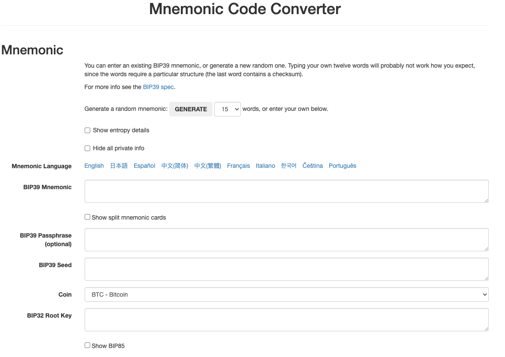
	
	Figure 4. A BIP-39 generator as a standalone web page

- 从种子创建HD钱包

	HD钱包是由单个_根种子_创建的，该_种子_是128,256或512位随机数。最常见的情况是，这个种子是从_助记词_生成的，详见前一节。

	HD钱包中的每个密钥都是从这个根种子确定性地派生出来的，这使得可以在任何兼容的HD钱包中从该种子重新创建整个HD钱包。这使得备份，恢复，导出和导入包含数千乃至数百万个密钥的HD钱包变得很容易，只需传输根种子的助记词即可。

	[[bip32_bip43/44]] ==== 分层确定性钱包（BIP-32）和路径（BIP-43/44）

	大多数HD钱包遵循 BIP-32 标准，这已成为确定性密钥事实上的行业标准代。你可以在以下网址阅读详细说明：

	https://github.com/bitcoin/bips/blob/master/bip-0032.mediawiki

	我们不会在这里讨论 BIP-32 的细节，只是了解如何在钱包中使用 BIP-32。在许多软件库中提供了许多可互操作的 BIP-32 实现：

	- [Consensys/eth-lightwallet](https://github.com/ConsenSys/eth-lightwallet)

		轻量级JS Ethereum节点和浏览器钱包（使用BIP-32）

	- 还有一个BIP-32独立的网页生成器，对BIP-32的测试和实验非常有用：

		http://bip32.org/

		Note
		独立的 BIP-32 生成器不是 HTTPS 网站。提醒你，使用这个工具是不安全的。它仅用于测试。你不应使用本网站制作的密钥（使用实际资金）。
- 扩展公钥和私钥

	在 BIP-32 术语中，可以扩展并产生“孩子”的父密钥称为 扩展密钥 extended key。
	
	- 扩展私钥 extended_private_key 前缀 _xprv_区分

			xprv9s21ZrQH143K2JF8RafpqtKiTbsbaxEeUaMnNHsm5o6wCW3z8ySyH4UxFVSfZ8n7ESu7fgir8imbZKLYVBxFPND1pniTZ81vKfd45EHKX73
	- 扩展公钥 extended public key 由前缀 xpub 区分:

			xpub661MyMwAqRbcEnKbXcCqD2GT1di5zQxVqoHPAgHNe8dv5JP8gWmDproS6kFHJnLZd23tWevhdn4urGJ6b264DfTGKr8zjmYDjyDTi9U7iyT

	HD钱包的一个非常有用的特点是能够从公开的父公钥中派生子公钥，而不需要拥有私钥。这为我们提供了两种派生子公钥的方法：
	
	- 从子私钥派生
	- 直接从父公钥派生。

	因此，可以使用扩展公钥导出HD钱包结构分支中的所有 公钥（只有公钥）。

	此快捷方式可用于创建非常安全的公钥 - 部署中的服务器或应用程序只有扩展公钥的副本，没有任何私钥。这种部署可以产生无限数量的公钥和以太坊地址，但无法花费发送到这些地址的任何资金。与此同时，在另一个更安全的服务器上，扩展私钥可以导出所有相应的私钥来签署交易并花费金钱。

	此解决方案的一个常见应用是在为电子商务应用程序提供服务的Web服务器上安装扩展公钥。网络服务器可以使用公钥派生函数为每个交易（例如，针对客户购物车）创建新的以太坊地址。Web 服务器将不会有任何易被盗的私钥。如果没有HD钱包，唯一的方法就是在单独的安全服务器上生成数千个以太坊地址，然后将其预先加载到电子商务服务器上。这种方法很麻烦，需要不断的维护以确保电子商务服务器不会“用完”密钥。

	此解决方案的另一个常见应用是冷钱包或硬件钱包。在这种情况下，扩展私钥可以存储在硬件钱包中，而扩展公钥可以保持在线。用户可以随意创建“接收”地址，而私钥可以安全地在离线状态下存储。要花费资金，用户可以在离线签署的以太坊客户端上使用扩展私钥或在硬件钱包设备上签署交易。
- 强化子密钥派生

	从 xpub 派生公钥的分支是非常有用的，但它带有潜在风险。访问 xpub 不能访问子私钥。但是，因为 xpub 包含链码，所以如果某个子私钥已知，或者以某种方式泄漏，则可以与链码一起使用，以派生所有其他子私钥。一个泄露的子私钥和一个父链码一起揭示了所有子私钥。更糟的是，可以使用子私钥和父链码来推导父私钥。

	为了应对这种风险，HD钱包使用一种称为 强化派生 _hardened derivation_的替代派生函数，该函数“破坏”父公钥和子链码之间的关系。强化派生函数使用父私钥来派生子链码，而不是父公钥。这会在父/子序列中创建一个“防火墙”，链码不能用于危害父代或同级私钥。

	简而言之，如果你想使用 xpub 的便利来派生公钥的分支，而不会让自己面临泄漏链码的风险，所以应该从强化父项而不是普通父项派生。作为最佳做法，主密钥的1级子密钥级始终通过强化派生派生，以防止主密钥受到破坏。
- 正常和强化派生的索引号

	BIP-32 派生函数中使用的索引号是一个32位整数。为了便于区分通过常规派生函数派生的密钥与通过强化派生函数派生的密钥，该索引号分为两个部分。
	
	- 0到231-1（0x0到0x7FFFFFFF）之间的索引号仅用于常规派生。
	- 231和232-1（0x80000000至0xFFFFFFFF）之间的索引号仅用于强化派生。

	因此，如果索引号小于231，则子项是常规的，如果索引号等于或大于231，则子项是强化的。

	为了使索引号更容易阅读和展示，强化子项的索引号从零开始展示，但带有一个主要符号。
	
	- 第一个正常子密钥展示为0，而第一个强化子密钥（索引0x80000000）展示为0'。
	- 然后，按顺序，第二个强化子密钥将具有索引0x80000001，并将展示为1'
	- 依此类推。当你看到HD钱包索引i'时，表示231+i。
- HD 钱包密钥标识符（路径）

	HD 钱包中的密钥使用“路径”命名约定来标识，树的每个级别都用斜杠（/）字符分隔（参见 HD wallet path examples）。从主密钥派生的私钥以“m”开头。从主公钥派生的公钥以“M”开始。因此，主私钥的第一个子私钥为 m/0。第一个子公钥是 M/0。第一个孩子的第二个孩子是 m/0/1，依此类推。

	从右向左读取一个密钥的“祖先”，直到你到达从派生出它的主密钥。例如，标识符 m/x/y/z 描述了密钥 m/x/y 的第z个子密钥，密钥 m/x/y 是密钥 m/x 的第y个子密钥，密钥 m/x 是 m 的第 x 个子密钥。

	Table 5. HD wallet path examples
	
	HD path|Key described
	---|---
	m/0|The first (0) child private key from the master private key (m)
	m/0/0|The first grandchild private key of the first child (m/0)
	m/0'/0|The first normal grandchild of the first hardened child (m/0')
	m/1/0|The first grandchild private key of the second child (m/1)
	M/23/17/0/0|The first great-great-grandchild public key of the first great-grandchild of the 18th grandchild of the 24th child
- HD钱包树状结构导航

	HD钱包树结构提供了巨大的灵活性。每个父扩展密钥可以有40亿子密钥：20亿正常子密钥和20亿强化子密钥。这些子密钥中的每一个又可以有另外40亿子密钥，以此类推。这棵树可以像你想要的一样深，无限的世代。然而，这些灵活性，使得在这个无限树中导航变得非常困难。在实现之间转移HD钱包尤其困难，因为内部组织分支和子分支的可能性是无穷无尽的。

	通过为HD钱包的树状结构创建一些标准，两个 BIP 为这种复杂性提供了解决方案。BIP-43 建议使用第一个强化子密钥作为表示树结构“目的”的特殊标识符。基于 BIP-43，HD钱包应该只使用树的一个1级分支，索引号通过定义其目的来标识树的其余部分的结构和名称空间。例如，仅使用分支m/i'/的HD钱包表示特定目的，而该目的由索引号“i”标识。

	扩展该规范，BIP-44 提出了一个多币种多帐户结构作为 BIP-43 下的“目的”号码+44'+。遵循 BIP-44 的HD钱包通过仅使用树的一个分支的事实来标识：m / 44'/。

	BIP-44指定了包含五个预定义层级的结构

		m / purpose' / coin_type' / account' / change / address_index
	
	- 第一级“purpose”始终设置为+44'+。
	- 第二级“coin_type”指定加密货币类型，允许多货币HD钱包，
	
		其中每种货币在第二级下具有其自己的子树。标准文件中定义了几种货币，称为 SLIP0044：https://github.com/satoshilabs/slips/blob/master/slip-0044.md

		一些例子: 
		
		- Ethereum 是 m/44'/60'
		- Ethereum Classic 是 m/44'/61'
		- Bitcoin 是 m/44'/0',
		- 所有货币的 Testnet 是 m/44'/1'.
	- 树的第三级“account”, 允许用户将他们的钱包分割成逻辑上的子账户，用于会计或组织管理目的。例如 HD 钱包可能包含两个以太坊“账户”： 
		- m/44'/60'/0' 
		- m/44'/60'/1' 

		每个账户都是自己的子树的根。
	- 由于 BIP-44 最初是为比特币创建的，因此它包含一个在以太坊世界中不相关的“怪癖”。在路径的第四层 “change” 时，HD钱包有两个子树，
		- 一个用于创建接收地址
		- 另一个用于创建零钱地址
	
		以太坊只使用“接收”路径，因为没有零钱地址这样的东西。请注意，虽然以前的层级使用强化派生，但此层级使用正常派生。这是为了允许树的这个层级导出扩展公钥在非安全环境中使用。
	- 可用地址由HD钱包作为第四级的孩子派生，使树的第五级成为“address_index”。例如，在主账户中以太坊付款的第三个接收地址为
		- M/44'/60'/0'/0/2

	BIP-44 HD wallet structure examples 展示了几个例子。

Table 6. BIP-44 HD wallet structure examples

HD path|Key described
---|---
M/44'/60'/0'/0/2|The third receiving public key for the primary Ethereum account
M/44'/0'/3'/1/14|The fifteenth change-address public key for the fourth Bitcoin account
m/44'/2'/0'/0/1|The second private key in the Litecoin main account, for signing transactions

## 第七章 交易
交易是由外部所有帐户发起的签名消息，由以太坊网络传输，并在以太坊区块链上进行记录（挖掘）。在这个基本定义背后，有很多令人惊讶和着迷的细节。看待交易的另一种方式是，它们是唯一可触发状态更改或导致合约在 EVM 中执行的东西。以太坊是一个全球的单实例状态机，交易是唯一可以让状态机“运动”，改变状态的东西。合约不会自行运行。以太坊不会在后台运行。一切都始于交易。

在本节中，我们将剖析交易，展示它们的工作方式，并了解详细信息。
### 交易的结构
首先让我们来看看交易的基本结构，因为它是在以太坊网络上进行序列化和传输的。接收序列化交易的每个客户端和应用程序将使用其自己的内部数据结构将其存储在内存中，还会使用网络序列化交易本身中不存在的元数据进行修饰。交易的网络序列化是交易结构的唯一通用标准。

交易是一个序列化的二进制消息，其中包含以下数据：

- nonce

	由始发EOA（外部所有账户）发出的序列号，用于防止消息重播。
- gas price

	发起人愿意支付的gas价格（以wei为单位）。
- start gas

	发起人愿意支付的最大gas量。
- to

	目标以太坊地址。
- value

	发送到目标地址的 ether 数量。
- data

	变长二进制数据
- v,r,s

	始发 EOA 的 ECDSA 签名的三个组成部分。

交易消息的结构使用递归长度前缀（RLP）编码方案（参见 [rlp] ）进行序列化，该方案是专门为以太坊中准确和字节完美的数据序列化而创建的。以太坊中的所有数字都被编码为大端序整数，其长度为8位的倍数。

请注意，字段的标签（“to”，“start gas”等）在这里是为清楚起见而显示，但不是包含字段值的RLP编码交易序列化数据的一部分。通常，RLP不包含任何字段分隔符或标签。RLP的长度前缀用于标识每个字段的长度。因此，超出定义长度的任何内容都属于结构中的下一个字段。

虽然这是实际传输的交易结构，但大多数内部表示和用户界面可视化都使用来自交易或区块链的附加信息来修饰它。

例如，你可能会注意到没有表示发起人 EOA 的地址的 “from” 数据。

- EOA 的公钥可以很容易地从 ECDSA 签名的 +v,r,s+ 组成部分中派生出来。
- EOA 的地址又可以很容易地从公钥中派生出来。

当你看到显示“from”字段的交易时，是该交易所用的软件添加了该字段。客户端软件经常添加到交易中的其他元数据包括块编号（被挖掘之后生成）和交易ID（计算出的哈希）。同样，这些数据来源于交易，但不是交易信息本身的一部分。

#### 交易的随机数（nonce）
nonce 是交易中最重要和最少被理解的组成部分之一。黄皮书中的定义（见 [yellow_paper] ）写道：

	nonce：与此地址发送的交易数量相等的标量值，或者，对于具有关联代码的帐户，表示此帐户创建的合约数量。
严格地说，nonce 是始发地址的一个属性（它只在发送地址的上下文中有意义）。但是，该 nonce 并未作为账户状态的一部分显式存储在区块链中。相反，它是根据来源于此地址的已确认交易的数量动态计算的。

nonce 值也用于防止帐户余额的错误计算。例如，假设一个账户有10个以太的余额，并且签署了两个交易，都花费 6 个 ether，分别具有 nonce 1 和 nonce 2。这两笔交易中哪一笔有效？在以太坊这样的分布式系统中，节点可能无序地接收交易。nonce 强制任何地址的交易按顺序处理，不管间隔时间如何，无论节点接收到的顺序如何。这样，所有节点都会计算相同的余额。支付 6 以太币的交易将被成功处理，账户余额减少到 4 ether。无论什么时候收到，所有节点都认为与带有 nonce 2 的交易无效。如果一个节点先收到 nonce 2 的交易，会持有它，但在收到并处理完 nonce 1 的交易之前不会验证它。

使用 nonce 确保所有节点计算相同的余额，并正确地对交易进行排序，相当于比特币中用于防止 “双重支付” 的机制。但是，因为以太坊跟踪账户余额并且不会单独跟踪独立的币（在比特币中称为 UTXO），所以只有在账户余额计算错误时才会发生 “双重支付”。nonce 机制可以防止这种情况发生。

- 跟踪nonce

	实际上，nonce 是源自帐户的已确认（已开采）交易数量的最新计数。要找到 nonce 是什么，你可以询问区块链，例如通过web3界面：

	检索示例地址的交易计数
	
		web3.eth.getTransactionCount("0x9e713963a92c02317a681b9bb3065a8249de124f")
		40
	Tip

	该 nonce 是一个基于零的计数器，意味着第一个交易的 nonce 是 0.在例子中，我们有一个交易的计数为40，这意味着从0到39 nonce 已经被看到。下一个交易的 nonce 将是40。

	你的钱包将跟踪其管理的每个地址的 nonce。这很简单，只要你只是从单一点发起交易即可。
	
	假设你正在编写自己的钱包软件或其他一些发起交易的应用程序。你如何跟踪 nonce？

	当你创建新的交易时，你将分配序列中的下一个 nonce。但在确认之前，它不会计入 `getTransactionCount` 的总数。

	不幸的是，如果我们连续发送一些交易，`getTransactionCount` 函数会遇到一些问题。有一个已知的错误，其中 `getTransactionCount` 不能正确计数待处理(pending)交易。我们来看一个例子：

		web3.eth.getTransactionCount("0x9e713963a92c02317a681b9bb3065a8249de124f", "pending")
		40
		web3.eth.sendTransaction({from: web3.eth.accounts[0], to: "0xB0920c523d582040f2BCB1bD7FB1c7C1ECEbdB34", value: web3.toWei(0.01, "ether")});
		web3.eth.getTransactionCount("0x9e713963a92c02317a681b9bb3065a8249de124f", "pending")
		41
		web3.eth.sendTransaction({from: web3.eth.accounts[0], to: "0xB0920c523d582040f2BCB1bD7FB1c7C1ECEbdB34", value: web3.toWei(0.01, "ether")});
		web3.eth.getTransactionCount("0x9e713963a92c02317a681b9bb3065a8249de124f", "pending")
		41
		web3.eth.sendTransaction({from: web3.eth.accounts[0], to: "0xB0920c523d582040f2BCB1bD7FB1c7C1ECEbdB34", value: web3.toWei(0.01, "ether")});
		web3.eth.getTransactionCount("0x9e713963a92c02317a681b9bb3065a8249de124f", "pending")
		41
	如你所见，我们发送的第一笔交易将交易计数增加到了41，显示了待处理交易。但是当我们连续发送3个更多的交易时，`getTransactionCount` 调用并没有正确计数。它只计算一个，即使在 mempool 中有3个待处理交易。如果我们等待几秒钟，一旦块被挖掘，`getTransactionCount` 调用将返回正确的数字。但在此期间，虽然有多项交易待处理，但对我们无帮助。

	当你构建生成交易的应用程序时，无法依赖 `getTransactionCount` 处理未完成的交易。只有在待处理和已确认相同（所有未完成的交易都已确认）时，才能信任 `getTransactionCount` 的输出以开始你的 nonce 计数器。此后，请跟踪你的应用中的 nonce，直到每笔交易被确认。

	Parity 的 JSON RPC 接口提供 `parity_nextNonce` 函数，该函数返回应在交易中使用的下一个 nonce。`parity_nextNonce` 函数可以正确地计算 nonce，即使你连续快速构建多个交易，但没有确认它们。

	Parity 有一个用于访问 JSON RPC 接口的 Web 控制台，但在这里我们使用命令行 HTTP 客户端来访问它：

		curl --data '{"method":"parity_nextNonce","params":["0x9e713963a92c02317a681b9bb3065a8249de124f"],"id":1,"jsonrpc":"2.0"}' -H "Content-Type: application/json" -X POST localhost:8545

		{"jsonrpc":"2.0","result":"0x32","id":1}
	nonce 的间隔，重复的 nonce 和确认

	如果你正在以编程方式创建交易，跟踪 nonce 是十分重要的，特别是如果你同时从多个独立进程执行此操作。

	以太坊网络根据 nonce 顺序处理交易。这意味着如果你使用 nonce +0+ 传输一个交易，然后传输一个具有 nonce +2+ 的交易，则第二个交易将不会被挖掘。它将存储在mempool 中，以太坊网络等待丢失的 nonce 出现。所有节点都会假设缺少的 nonce 只是延迟了，具有 nonce +2+ 的交易被无序地接收到。

	如果你随后发送一个丢失的 nonce 1+ 的交易，则交易（交易+1+和+2）将被开采。一旦你填补了空白，网络可以挖掘它在 mempool 中的失序交易。

	这意味着如果你按顺序创建多个交易，并且其中一个交易未被挖掘，则所有后续交易将“卡住”，等待丢失的事件。交易可以在 nonce 序列中产生无意的“间隙”，比如因为它无效或gas 不足。为了让事情继续进行，你必须传输一个具有丢失的 nonce 的有效交易。

	另一方面，如果你不小心重复一个 nonce，例如传输具有相同 nonce 的两个交易，但收件人或值不同，则其中一个将被确认，另一个将被拒绝。哪一个被确认将取决于它们到达第一个接收它们的验证节点的顺序。

	正如你所看到的，跟踪 nonce 是必要的，如果你的应用程序没有正确地管理这个过程，你会遇到问题。不幸的是，如果你试图并发地做到这一点，事情会变得更加困难，我们将在下一节中看到。

- 并发，交易的发起和随机数

	并发是计算机科学的一个复杂方面，有时候它会突然出现，特别是在像 Ethereum 这样的去中心化/分布式实时系统中。

	简单来说，并发是指多个独立系统同时进行计算。这些可以在相同的程序（例如线程）中，在相同的CPU（例如多进程）上，或在不同的计算机（即分布式系统）上。按照定义，以太坊是一个允许操作（节点，客户端，DApps）并发的系统，但是强制实施一个单一的状态（例如，对于每个开采的区块只有一个公共/共享状态的系统）。

	现在，假设我们有多个独立的钱包应用程序正在从同一个地址或同一组地址生成交易。这种情况的一个例子是从热钱包进行提款的交易所。理想情况下，你希望有多台计算机处理提款，以便它不会成为瓶颈或单点故障。然而，这很快就会成为问题，因为有多台计算机生产提款会导致一些棘手的并发问题，其中最重要的是选择 nonce。多台电脑如何从同一个热钱包账户协调生成，签署和广播交易？

	你可以使用一台计算机根据先到先得的原则为签署交易的计算机分配 nonce。但是，这台电脑现在是可能故障的单点。更糟糕的是，如果分配了多个 nonce，并且其中一个从没有被使用（因为计算机处理具有该 nonce 的交易失败），所有后续交易都会卡住。

	你可以生成交易，但不为它们签名或为其分配临时值。然后将它们排队到一个签名它们的节点，并跟踪随机数。再次，你有了一个可能故障的单点。nonce 的签名和跟踪是你的操作的一部分，可能在负载下变得拥塞，而未签名交易的生成是你并不需要实现并行化的部分。你有并发性，但不是在过程中任何有用的部分。

	最后，除了跟踪独立进程中的账户余额和交易确认的难度之外，这些并发问题迫使大多数实现朝着避免并发和创建瓶颈进行，诸如单个进程处理交易所中的所有取款交易。

#### 交易 gas
我们在 [gas] 中详细讨论_gas_。但是，让我们介绍有关交易的 gasPrice 和 startGas 字段的一些基本知识。

gas 是以太坊的燃料。gas 不是 ether，它是独立的虚拟货币，有相对于 ether 的汇率。以太坊使用 gas 来控制交易可以花费的资源量，因为它将在全球数千台计算机上处理。开放式（图灵完备的）计算模型需要某种形式的计量，以避免拒绝服务攻击或无意中的资源吞噬交易。

gas 与 ether 分离，以保护系统免受随着 ether 价值快速变化而产生的波动。

交易中的 gasPrice 字段允许交易创建者设置每个单位的 gas 的汇率。gas 价格以每单位 gas 多少 wei 测量。
	
例如，在我们最近一个例子创建的交易中，我们的钱包已将 gasPrice 设置为 3 Gwei（3千兆，30亿wei）。

网站 ethgasstation.info 提供有关以太坊主网络当前 gas 价格以及其他相关 gas 指标的信息：https://ethgasstation.info/

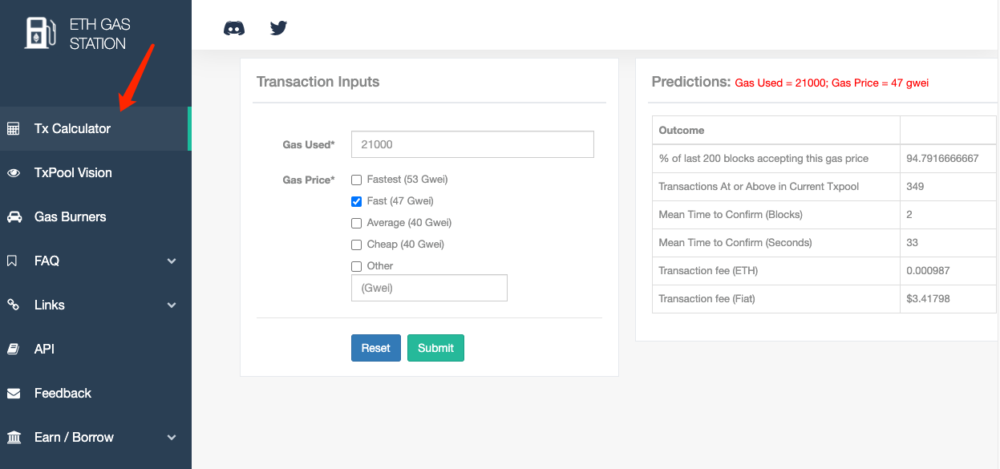

- gasPrice

	钱包可以在他们发起的交易中调整 gasPrice，以更快地确认（挖掘）交易。gasPrice 越高，交易可能被验证的速度越快。相反，较低优先级的交易可能会降低他们愿意为 gas 支付的价格，导致确认速度减慢。可以设置的最低 +gasPrice+ 为零，这意味着免费的交易。在区块空间需求低的时期，这些交易将被开采。
	
		Tip
		
		最低可接受的 gasPrice 为零。这意味着钱包可以产生完全免费的交易。根据能力的不同，这些可能永远不会被开采，但协议中没有任何禁止免费交易内容。你可以在以太坊区块链中找到几个此类交易成功开采的例子。
	
	web3 界面通过计算几个区块的中间价格来提供 gasPrice 建议：
	
		truffle(mainnet)> web3.eth.getGasPrice(console.log)
		truffle(mainnet)> null BigNumber { s: 1, e: 10, c: [ 10000000000 ] }
- startGas

	与 gas 有关的第二个重要领域是 startGas。这在 [gas] 中有更详细的解释。简单地说，startGas 定义交易发起人愿意花费多少单位完成交易。对于简单付款，意味着将ether 从一个 EOA 转移到另一个 EOA 的交易，所需的 gas 量固定为 21,000 个 gas单位。要计算需要花费多少 ether，你需要将你愿意支付的 gasPrice 乘以 21,000：

		truffle(mainnet)> web3.eth.getGasPrice(function(err, res) {console.log(res*21000)} )
		truffle(mainnet)> 210000000000000
	如果你的交易的目的地址是合约，则可以估计所需的 gas 量，但无法准确确定。这是因为合约可以评估不同的条件，导致不同的执行路径和不同的 gas 成本。这意味着合约可能只执行简单的计算或更复杂的计算，具体取决于你无法控制且无法预测的条件。为了说明这一点，我们使用一个颇为人为的例子：每次调用合约时，它会增加一个计数器，并在第100次（仅）计算一些复杂的事情。如果你调用99次合约，会发生一件事情，但在第100次调用时，会发生完全不同的事情。你要支付的 gas 数量取决于交易开采前有多少其他交易调用了该功能。也许你的估计是基于第99次交易，并且在你的交易被开采之前，其他人已经调用了99次合约。现在，你是第100个要调用的交易，计算工作量（和gas成本）要高得多。

	借用以太坊使用的常见类比，你可以将 startGas 视为汽车中的油箱（你的汽车是交易）。你认为它需要旅行（验证交易所需的计算），就用尽可能多的 gas 填满油箱。你可以在某种程度上估算金额，但你的旅程可能会有意想不到的变化，例如分流（更复杂的执行路径），这会增加燃油消耗。

	然而，与燃料箱的比较有些误导。这更像是一家加油站公司的信用账户，根据你实际使用的 gas 量，在旅行完成后支付。当你传输你的交易时，首先验证步骤之一是检查它源自的帐户是否有足够的金额支付 gasPrice * startGas 费用。但是，在交易执行结束之前，金额实际上并未从你的帐户中扣除。只收取你最终交易实际消耗的天然气，但在发送交易之前，你必须有足够的余额用于你愿意支付的最高金额。

#### 交易的接收者
交易的收件人在+to+字段中指定。这包含一个20字节的以太坊地址。地址可以是 EOA 或合约地址。

以太坊没有进一步验证这个字段。任何 20 字节的值都被认为是有效的。如果 20 字节的值对应于没有相应私钥的地址，或没有相应的合约，则该交易仍然有效。以太坊无法知道某个地址是否是从公钥（从私钥导出的）正确导出的。

	Warning
	
	以太坊不能也不会验证交易中的接收者地址。你可以发送到没有相应私钥或合约的地址，从而“燃烧”ether，使其永远不会被花费。验证应该在用户界面层级完成。

发送一个交易到一个无效的地址会_燃烧_发送的 ether，使其永远不可访问（不可花费），因为不能生成用来使用它的签名。假定地址验证发生在用户界面级别（参见 [eip-55] 或 [icap]）。事实上，有很多合理的理由来燃烧 ether，包括作为游戏理论，来抑制支付通道和其他智能合约作弊。
#### 交易的价值和数据
交易的主要“负载”包含在两个字段中：value 和 data。交易可以同时具有

- value和data
- 只有value

	只有 value 的交易是 支付 payment
- 只有data

	只有 data 的交易是调用(invocation)
- 没有value和data

	既没有value也没有data的交易，这可能只是浪费gas！但它仍然有可能
所有四种组合都是有效的。

让我们尝试所有上述组合：

- 首先，我们从我们的钱包中设置源地址和目标地址，以使演示更易于阅读：

	设置源地址和目的地址

		src = web3.eth.accounts[0];
		dst = web3.eth.accounts[1];
- 有value的交易（支付），没有data

		web3.eth.sendTransaction({from: src, to: dst, value: web3.toWei(0.01, "ether"), data: ""});
	我们的钱包显示确认屏幕，指示要发送的value，并且没有data：
	
	
		
	Figure 1. Parity wallet showing a transaction with value, but no data
- 有 value（支付）data 的交易

		web3.eth.sendTransaction({from: src, to: dst, value: web3.toWei(0.01, "ether"), data: "0x1234"});
	我们的钱包显示一个确认屏幕，指示要发送的value和data：
	
	
	
	Figure 2. Parity wallet showing a transaction with value and data
- 0 value 的交易，只有数据

		web3.eth.sendTransaction({from: src, to: dst, value: 0, data: "0x1234"});

	我们的钱包显示一个确认屏幕，指示value为0并显示data：

	
	
	Figure 3. Parity wallet showing a transaction with no value, only data
- 既没有value（支付）也没有data的交易

		web3.eth.sendTransaction({from: src, to: dst, value: 0, data: ""}));
	我们的钱包显示确认屏幕，指示0 value并且没有data：

	
	
	Figure 4. Parity wallet showing a transaction with no value, and no data
	
### 将 value 传递给 EOA 和合约
当你构建包含 value 的以太坊交易时，它等同于_payment_。根据目的地址是否为合约，这些交易行为会有所不同。

- 对于 EOA 地址或者更确切地说，对于未在区块链中注册为合约的任何地址

	以太坊将记录状态更改，并将你发送的 value 添加到地址的余额中。如果地址之前没有被查看过，则会创建地址并将其余额初始化为你的付款 +value+。
- 如果目标地址（to）是合约

	则 EVM 将执行合约并尝试调用你的交易的 data 中指定的函数（参见 调用[invocation] ）。如果你的交易中没有 data，那么 EVM 将调用目标合约的 fallback 函数，如果该函数是 payable，则将执行该函数以确定下一步该做什么。

合约可以通过在调用付款功能时立即抛出异常或由付款功能中编码的条件确定来拒绝收款。如果付款功能成功终止（没有意外），则更新合约状态以反映合约的 ether 余额增加。

### 将数据传输到 EOA 或合约
当你的交易包含+data+时，它很可能是发送到合约地址的。这并不意味着你无法向 EOA 发送+data+。事实上，你可以做到这一点。但是，在这种情况下，data+ 的解释取决于你用来访问 EOA 的钱包。大多数钱包会忽略它们控制的 EOA 交易中收到的任何+data。将来，可能会出现允许钱包以合约的方式解释+data+编码的标准，从而允许交易调用在用户钱包内运行的函数。关键的区别在于，与合约执行不同，EOA 对 data 的任何解释都不受以太坊共识规则的约束。

现在，假设你的交易是向合约地址提供 data。在这种情况下，data 将被 EVM 解释为 函数调用(function invocation)，调用指定的函数并将任何编码参数传递给该函数。

发送到合约的 data 是一个十六进制序列化的编码：

- 函数选择器（function selector）

	函数 _prototype_ 的 Keccak256 哈希的前4个字节。这使 EVM 能够明确地识别你希望调用的功能。
- 函数参数

	函数的参数，根据EVM定义的各种基本类型的规则进行编码。

我们来看一个简单的例子，它来自我们的 [solidity_faucet_example] 。在 +Faucet.sol+ 中，我们为取款定义了一个函数：

	function withdraw(uint withdraw_amount) public {

- withdraw 函数的 _prototype_ 被定义为包含函数名称的字符串
- 随后是括号中括起来的每个参数的数据类型，并用单个逗号分隔。

函数名称是 +withdraw+，它只有一个参数是 uint（它是uint256的别名）。所以 +withdraw+ 的原型将是：

	withdraw(uint256)
- 我们来计算 `withdraw(uint256)` 这个字符串的 Keccak256 哈希值（我们可以使用 truffle 控制台或任何 JavaScript web3 控制台来做到这一点）：

		$ web3.sha3("withdraw(uint256)");
		
		  '0x2e1a7d4d13322e7b96f9a57413e1525c250fb7a9021cf91d1540d5b69f16a49f'

	散列的前4个字节是 0x2e1a7d4d。这是我们的“函数选择器”的值，它会告诉 EVM 我们想调用哪个函数。
- 接下来，计算一个值作为参数 withdraw_amount 传递。我们要取款 0.01 ether。我们将它编码为一个十六进制序列化的大端序无符号 256 位整数，以 wei 为单位：

		withdraw_amount = web3.toWei(0.01, "ether");
		'10000000000000000'
		
		withdraw_amount_hex = web3.toHex(withdraw_amount);
		'0x2386f26fc10000'

现在，我们将函数选择器添加到这个参数上（填充为32字节）

	2e1a7d4d000000000000000000000000000000000000000000000000002386f26fc10000
这就是我们的交易的 data，调用 withdraw 函数并请求 0.01 ether 作为 withdraw_amount。

### 特殊交易：合约注册
有一种特殊的带有 data，没有 value 的交易。表示注册一个新的合约。合约登记交易被发送到一个特殊的目的地地址，即零地址。简而言之，合约注册交易中的+to+字段包含地址 0x0。该地址既不代表 EOA（没有相应的私人/公共密钥对）也不代表合约。它永远不会花费 ether 或启动交易。它仅用作目的地，具有“注册此合约”的特殊含义。

尽管零地址仅用于合约注册，但它有时会收到来自各个地址的付款。对此有两种解释：

- 无论是偶然的，导致ether的丧失
- 故意的_ ether燃烧_（见[burning_ether]）

如果你想进行有意识的 ether 燃烧，你应该向网络明确你的意图，并使用专门指定的燃烧地址：

	0x000000000000000000000000000000000000dEaD

Warning
	
	发送至合约注册地址 0x0 或指定燃烧地址 0x0 ... dEaD 的任何 ether 将变得不可消费并永远丢失。

合约注册交易不应包含 ether value，只能包含合约编译字节码的 data。此次交易的唯一影响是注册合约。

作为例子，我们可以发布 [intro] 中使用的 Faucet.sol。合约需要编译成二进制十六进制表示。这可以用 Solidiy 编译器完成。

	> solc --bin Faucet.sol
	======= Faucet.sol:Faucet =======
	Binary:
	6060604052341561000f57600080fd5b60e58061001d6000396000f300606060405260043610603f576000357c0100000000000000000000000000000000000000000000000000000000900463ffffffff1680632e1a7d4d146041575b005b3415604b57600080fd5b605f60048080359060200190919050506061565b005b67016345785d8a00008111151515607757600080fd5b3373ffffffffffffffffffffffffffffffffffffffff166108fc829081150290604051600060405180830381858888f19350505050151560b657600080fd5b505600a165627a7a72305820d276ddd56041f7dc2d2eab69f01dd0a0146446562e25236cf4ba5095d2ee802f0029
相同的信息也可以从 Remix 在线编译器获得。 现在我们可以创建交易。

	> src = web3.eth.accounts[0];
	> faucet_code = "0x6060604052341561000f57600080fd5b60e58061001d6000396000f300606060405260043610603f576000357c0100000000000000000000000000000000000000000000000000000000900463ffffffff1680632e1a7d4d146041575b005b3415604b57600080fd5b605f60048080359060200190919050506061565b005b67016345785d8a00008111151515607757600080fd5b3373ffffffffffffffffffffffffffffffffffffffff166108fc829081150290604051600060405180830381858888f19350505050151560b657600080fd5b505600a165627a7a72305820d276ddd56041f7dc2d2eab69f01dd0a0146446562e25236cf4ba5095d2ee802f0029"

	> web3.eth.sendTransaction({from: src, data: faucet_code, gas: 113558, gasPrice: 200000000000})

	"0x7bcc327ae5d369f75b98c0d59037eec41d44dfae75447fd753d9f2db9439124b"
不需要指定+to+参数，将使用默认的零地址。你可以指定 gasPrice 和 gas 限制。 

一旦合约被开采，我们可以在 etherscan 区块浏览器上看到它。

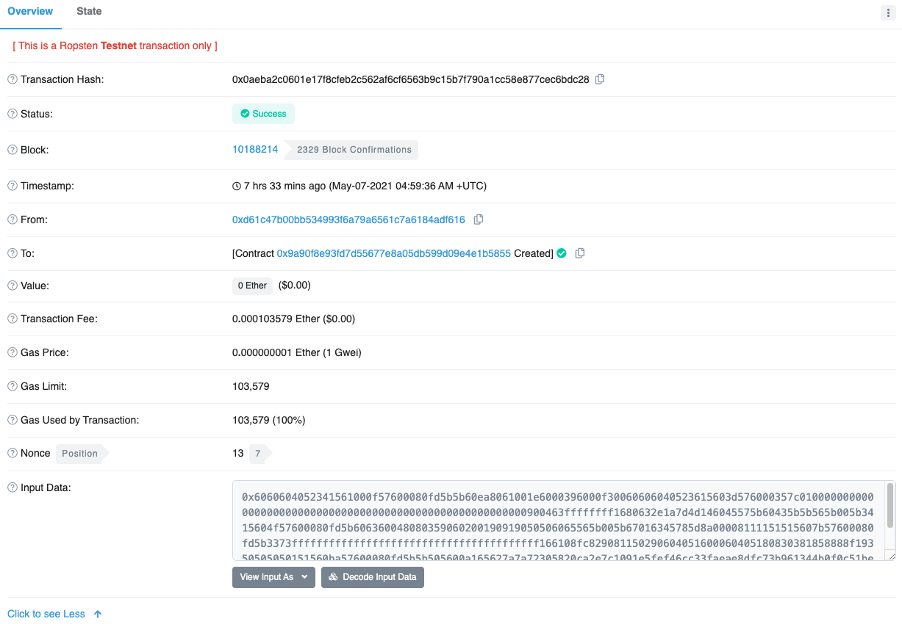

Figure 5. Etherscan showing the contract successully minded

你可以查看交易的接收者以获取有关合约的信息。

	> eth.getTransactionReceipt("0x7bcc327ae5d369f75b98c0d59037eec41d44dfae75447fd753d9f2db9439124b");
	
	{
	  blockHash: "0x6fa7d8bf982490de6246875deb2c21e5f3665b4422089c060138fc3907a95bb2",
	  blockNumber: 3105256,
	  contractAddress: "0xb226270965b43373e98ffc6e2c7693c17e2cf40b",
	  cumulativeGasUsed: 113558,
	  from: "0x2a966a87db5913c1b22a59b0d8a11cc51c167a89",
	  gasUsed: 113558,
	  logs: [],
	  logsBloom: "0x00000000000000000000000000000000000000000000000000000000000000000000000000000000000000000000000000000000000000000000000000000000000000000000000000000000000000000000000000000000000000000000000000000000000000000000000000000000000000000000000000000000000000000000000000000000000000000000000000000000000000000000000000000000000000000000000000000000000000000000000000000000000000000000000000000000000000000000000000000000000000000000000000000000000000000000000000000000000000000000000000000000000000000000000000000000",
	  status: "0x1",
	  to: null,
	  transactionHash: "0x7bcc327ae5d369f75b98c0d59037eec41d44dfae75447fd753d9f2db9439124b",
	  transactionIndex: 0
	}
在这里我们可以看到合约的地址。我们可以按照 将数据传输到EOA或合约 所示，从合约发送和接收资金。

	> contract_address = "0xb226270965b43373e98ffc6e2c7693c17e2cf40b"
	> web3.eth.sendTransaction({from: src, to: contract_address, value: web3.toWei(0.1, "ether"), data: ""});
	
	"0x6ebf2e1fe95cc9c1fe2e1a0dc45678ccd127d374fdf145c5c8e6cd4ea2e6ca9f"
	
	> web3.eth.sendTransaction({from: src, to: contract_address, value: 0, data: "0x2e1a7d4d000000000000000000000000000000000000000000000000002386f26fc10000"});
	
	"0x59836029e7ce43e92daf84313816ca31420a76a9a571b69e31ec4bf4b37cd16e"
过一段时间，这两个交易都可以在ethescan上看到

Figure 6. Etherscan showing the transactions for sending and receiving funds

### 数字签名
到目前为止，我们还没有深入探讨“数字签名”的细节。在本节中，我们将探讨数字签名是如何工作的,以及如何在不泄露私钥的情况下提供私钥所有权的证明。

#### 椭圆曲线数字签名算法（ECDSA）
以太坊中使用的数字签名算法是_Elliptic Curve Digital Signature Algorithm_，或_ECDSA_。ECDSA 是用于基于椭圆曲线私钥/公钥对的数字签名的算法，如 [elliptic_curve] 中所述。

数字签名在以太坊中有三种用途（请参阅下面的边栏）。

- 首先，签名证明私钥的所有者，暗示着以太坊账户的所有者，已经授权支付 ether 或执行合约。
- 其次，授权的证明是 _undeniable_（不可否认）。
- 第三，签名证明交易数据在交易签名后没有也不能被任何人修改。

Wikipedia对“数字签名”的定义

	数字签名是用于证明数字信息或文件真实性的数学方案。有效的数字签名使收件人有理由相信该信息是由已知的发件人（认证）创建的，发件人不能否认已发送的信息（不可否认），并且信息在传输过程中未被更改（完整性） 。 来源: https://en.wikipedia.org/wiki/Digital_signature_

#### 数字签名如何工作
数字签名是一种数学签名，由两部分组成。第一部分是使用私钥（签名密钥）从消息（交易）中创建签名的算法。第二部分是允许任何人仅使用消息和公钥来验证签名的算法。

- 创建数字签名

	在以太坊实现的 ECDSA 中，被签名的“消息”是交易，或者更确切地说，来自交易的 RLP 编码数据的 Keccak256 哈希。签名密钥是 EOA 的私钥。结果是签名：

		\(\(Sig = F_{sig}(F_{keccak256}(m), k)\)\)

	其中:

	- _k_是签名私钥
	- _m_是RLP编码的交易
	- Fkeccak256是Keccak256哈希函数
	- Fsig 是签名算法
	- Sig 是由此产生的签名

	更多关于ECDSA数学的细节可以在 ECDSA数学 中找到。

	函数 Fsig 产生一个由两个值组成的签名+Sig+，通常称为+R+和+S+：

		Sig = (R, S)
- 验证签名

	要验证签名必须有签名（R+和+S）、序列化交易和公钥（与用于创建签名的私钥对应）。实质上，对签名的验证意味着 “只有生成此公钥的私钥的所有者才能在此交易上产生此签名。”

	签名验证算法采用消息（交易的散列或其部分），签名者的公钥和签名（+R+和+S+值），如果签名对此消息和公钥有效，则返回 TRUE。
- ECDSA 数学

	如前所述，签名由数学函数 Fsig 创建，该函数生成由两个值_R_和_S_组成的签名。在本节中，我们将更详细地讨论函数 Fsig 。

	签名算法首先生成_ephemeral_（临时的）私钥/公钥对。在涉及签名私钥和交易哈希的转换之后，此临时密钥对用于计算_R_和_S_值。

	临时密钥对由两个输入值生成：

	1. 一个随机数_q_，用作临时私钥 1.和椭圆曲线生成点_G_
		- 从_q_和_G_开始，我们生成相应的临时公钥_Q_（以_Q = q * G_计算，与以太坊公钥的派生方式相同，参见[pubkey]）。数字签名的_R_值就是临时公钥_Q_的x坐标。
		- 然后，算法计算签名的_S_值，以便：

				S ≡ q-1 (Keccak256(m) + k * R)     (mod p)

			其中
			
			- _q_是临时私钥
			- _R_是临时公钥的x坐标
			- _k_是签名（EOA所有者）的私钥
			- _m_是交易数据
			- _p_是椭圆曲线的素数阶
	- 验证是签名生成函数的反函数，使用_R_，S_值和公钥来计算一个值_Q，它是椭圆曲线上的一个点（签名创建中使用的临时公钥）：

			Q ≡ S-1 * Keccak256(m) * G + S-1 * R * K     (mod p)

		其中:

		- _R_和_S_是签名值
		- _K_是签名者（EOA所有者）的公钥
		- _m_是被签名的交易数据
		- _G_是椭圆曲线生成点
		- _p_是椭圆曲线的素数阶

		如果计算的点_Q_的x坐标等于_R_，则验证者可以断定该签名是有效的。

		请注意，在验证签名时，私钥既不被知道也不会透露。

	Tip
	
		ECDSA 必然是一门相当复杂的数学; 完整的解释超出了本书的范围。许多优秀的在线指南会一步一步地通过它：搜索“ECDSA explained”或尝试这一个
		
		http://bit.ly/2r0HhGB。
- 实践中的交易签名

	为了产生有效的交易，发起者必须使用椭圆曲线数字签名算法将数字签名应用于消息。当我们说“签署交易”时，我们实际上是指“签署RLP序列化交易数据的Keccak256哈希”。签名应用于交易数据的哈希，而不是交易本身。

	Tip

		在＃2,675,000块，Ethereum实施了“Spurious Dragon”硬分叉，除其他更改外，还推出了包括交易重播保护的新签名方案。这个新的签名方案在EIP-155中指定（参见[eip155]）。此更改会影响签名过程的第一步，在签名之前向交易添加三个字段（v，r，s）。

	要在以太坊签署交易，发件人必须：

	- 创建一个包含九个字段的交易数据结构：nonce，gasPrice，startGas，to，value，data，v，r，s
	- 生成交易的RLP编码的序列化消息
	- 计算此序列化消息的Keccak256哈希
	- 计算ECDSA签名，用发起EOA的私钥签名散列
	- 在交易中插入ECDSA签名计算出的 r 和 s 值

- 原始交易创建和签名

	让我们创建一个原始交易并使用 ethereumjs-tx 库对其进行签名。此示例的源代码位于GitHub存储库中的 raw_tx_demo.js 中：

	raw_tx_demo.js: Creating and signing a raw transaction in JavaScript

		link:code/web3js/raw_tx/raw_tx_demo.js[]
	在此处下载： https://github.com/ethereumbook/ethereumbook/blob/develop/code/web3js/raw_tx/raw_tx_demo.js

	运行示例代码：

		$ node raw_tx_demo.js
		RLP-Encoded Tx: 0xe6808609184e72a0008303000094b0920c523d582040f2bcb1bd7fb1c7c1ecebdb348080
		Tx Hash: 0xaa7f03f9f4e52fcf69f836a6d2bbc7706580adce0a068ff6525ba337218e6992
		Signed Raw Transaction: 0xf866808609184e72a0008303000094b0920c523d582040f2bcb1bd7fb1c7c1ecebdb3480801ca0ae236e42bd8de1be3e62fea2fafac7ec6a0ac3d699c6156ac4f28356a4c034fda0422e3e6466347ef6e9796df8a3b6b05bed913476dc84bbfca90043e3f65d5224
- 用 EIP-155 创建原始交易

	EIP-155 “简单重播攻击保护” 标准在签名之前指定了重播攻击保护（replay-attack-protected）的交易编码，其中包括交易数据中的_chain identifier_。这确保了为一个区块链（例如以太坊主网）创建的交易在另一个区块链（例如Ethereum Classic或Ropsten测试网络）上无效。因此，在一个网络上广播的交易不能在另一个网络上广播，因此得名“重放攻击保护”。

	EIP-155 向交易数据结构添加了三个字段 v，r+和+s。r+和+s 字段被初始化为零。这三个字段在编码和散列_之前_被添加到交易数据中。因此，三个附加字段会更改交易的散列，稍后将应用签名。通过在被签名的数据中包含链标识符，交易签名可以防止任何更改，因为如果链标识符被修改，签名将失效。因此，EIP-155 使交易无法在另一个链上重播，因为签名的有效性取决于链标识符。

	签名前缀字段+v+被初始化为链标识符，其值为：
	
	Chain|Chain ID
	---|---
	Ethereum main net|1
	Morden (obsolete), Expanse|2
	Ropsten|3
	Rinkeby|4
	Rootstock main net|30
	Rootstock test net|31
	Kovan|42
	Ethereum Classic main net|61
	Ethereum Classic test net|62
	Geth private testnets|1337

	由此产生的交易结构被进行RLP编码，哈希和签名。签名算法也稍作修改，以在+v+前缀中对链ID进行编码。

	有关更多详细信息，请参阅EIP-155规范： https://github.com/ethereum/EIPs/blob/master/EIPS/eip-155.md
	
### 签名前缀值（v）和公钥恢复
如交易的结构所述，交易消息不包含任何 “from” 字段。这是因为发起者的公钥可以直接从 ECDSA 签名中计算出来。一旦你有公钥，你可以很容易地计算出地址。恢复签名者公钥的过程称为_公钥恢复_。

给定 ECDSA 数学 中计算的值 r 和 s，我们可以计算两个可能的公钥。

首先，我们根据签名中的x坐标 r 值计算两个椭圆曲线点R和R'。有个两点，因为椭圆曲线在x轴上是对称的，所以对于任何值+x+，在x轴的两侧有两个可能的值适合曲线。

从 r 开始，我们也计算r-1这是 r 的倒数。

最后我们计算 z，它是消息散列的最低位，其中n是椭圆曲线的阶数。

然后两个可能的公钥是：

K1 = r-1 (sR - zG)

和

K2 = r-1 (sR' - zG)

其中:

- K1 和 K2 是签名者公钥的两种可能性
- r-1 是签名的+r+值的倒数
- s 是签名的+s+值
- R和R'是临时公钥_Q_的两种可能性
- z 是消息散列的最低位
- G 是椭圆曲线生成点

为了使事情更有效率，交易签名包括一个前缀值 v，它告诉我们两个可能的R值中哪一个是临时的公钥。如果 v 是偶数，那么R是正确的值。如果 v 是奇数，那么选择R'。这样，我们只需要计算R的一个值。

### 分离签名和传输（离线签名）
一旦交易被签署，它就可以传送到以太坊网络。创建，签署和广播交易的三个步骤通常发生在单个函数中，例如使用 +web3.eth.sendTransaction+。但是，正如我们在原始交易创建和签名中看到的那样，你可以通过两个单独的步骤创建和签署交易。一旦你签署了交易记录，你就可以使用 +web3.eth.sendSignedTransaction+ 传输该交易记录，该方法采用十六进制编码的签名交易信息并在 Ethereum 网络上传输。

你为什么要分开交易的签署和传输？最常见的原因是安全：签名交易的计算机必须将解锁的私钥加载到内存中。传输的计算机必须连接到互联网并运行以太坊客户端。如果这两个功能都在一台计算机上，那么你的在线系统上有私钥，这非常危险。分离签名和传输功能称为。离线签名 offline signing，是一种常见的安全措施。

根据你所需的安全级别，你的“离线签名”计算机可能与在线计算机存在不同程度的分离，从隔离和防火墙子网（在线但隔离）到完全脱机系统，成为 气隙 _air-gapped_系统 。在气隙系统中根本没有网络连接 - 计算机与在线环境是“空气”隔离的。使用数据存储介质或（更好）网络摄像头和 QR 码将交易记录到气隙计算机上，以签署交易。当然，这意味着你必须手动传输你想要签名的每个交易，不能批量化。

尽管没有多少环境可以利用完全气隙系统，但即使是小程度的隔离也具有显着的安全优势。例如，带防火墙的隔离子网只允许通过消息队列协议，可以提供大大降低的攻击面，并且比在线系统上签名的安全性高得多。许多公司使用诸如 ZeroMQ（0MQ）的协议，因为它为签名计算机提供了减少的攻击面。有了这样的设置，交易就被序列化并排队等待签名。排队协议以类似于 TCP 套接字的方式将序列化的消息发送到签名计算机。签名计算机从队列中读取序列化的交易（仔细地），使用适当的密钥应用签名，并将它们放置在传出队列中。传出队列将签名的交易传输到使用 Ethereum 客户端的计算机上，客户端将这些交易出队并传输。
### 交易传播
以太坊网络使用 “泛洪” 路由协议。每个以太坊客户端，在 _Peer-to-Peer（P2P）中作为_node，（理想情况下）构成_mesh_网络。没有网络节点是“特殊的”，它们都作为平等的对等体。我们将使用术语“节点”来指代连接并参与P2P网络的以太坊客户端。

交易传播开始于创建（或从离线接收）签名交易的以太坊节点。交易被验证，然后传送到_直接_连接到始发节点的所有其他以太坊节点。平均而言，每个以太坊节点保持与至少13个其他节点的连接，称为_邻居_。每个邻居节点在收到交易后立即验证交易。如果他们同意这是有效的，他们会保存一份副本并将其传播给所有的邻居（除了它的邻居）。结果，交易从始发节点向外涟漪式地遍历网络，直到网络中的所有节点都拥有交易的副本。

几秒钟内，以太坊交易就会传播到全球所有以太坊节点。从每个节点的角度来看，不可能辨别交易的起源。发送给我们节点的邻居可能是交易的发起者，或者可能从其邻居那里收到它。为了能够跟踪交易的起源或干扰传播，攻击者必须控制所有节点的相当大的百分比。这是P2P网络安全和隐私设计的一部分，尤其适用于区块链。
### 记录到区块链中
虽然以太坊中的所有节点都是相同的对等节点，但其中一些节点由_矿工_操作，并将交易和数据块提供给_挖矿农场_，这些节点是具有高性能图形处理单元（GPU）的计算机。挖掘计算机将交易添加到候选块，并尝试查找使得候选块有效的_Proof-of-Work_。我们将在共识[consensus]中更详细地讨论这一点。

不深入太多细节，有效的交易最终将被包含在一个交易块中，并记录在以太坊区块链中。一旦开采成块，交易还通过修改账户余额（在简单付款的情况下）或通过调用改变其内部状态的合约来修改以太坊单例的状态。这些更改将与交易一起以交易_收据_ receipt 的形式记录，该交易也可能包含_事件_ events。我们将在 [evm] 中更详细地检查所有这些。

我们的交易已经完成了从创建到被 EOA 签署，传播以及最终采矿的旅程。它改变了单例的状态，并在区块链上留下了不可磨灭的印记。
### 多重签名（multisig）交易
如果你熟悉比特币的脚本功能，那么你就知道有可能创建一个比特币多重签名账户，该账户只能在多方签署交易时花费资金（例如2个或3个或4个签名）。以太坊的价值交易没有多重签名的规定，尽管可以部署任意条件的任意合约来处理 ether 和代币的转让。

为了在多重签名情况下保护你的 ether，将它们转移到多重签名合约中。无论何时你想将资金转入其他账户，所有必需的用户都需要使用常规钱包软件将交易发送至合约，从而有效授权合约执行最终交易。

这些合约也可以设计为在执行本地代码或触发其他合约之前需要多个签名。该方案的安全性最终由多重签名合约代码确定。

讨论和 Grid+ 参考实现： https://blog.gridplus.io/toward-an-ethereum-multisig-standard-c566c7b7a3f6

## 第八章 智能合约
我们在 [intro] 中发现，以太坊有两种不同类型的账户：

- 外部所有账户EOAs

	EOAs由以太坊以外的软件（如钱包应用程序）控制。
- 合约账户
	
	合约帐户由在以太坊虚拟机（EVM）内运行的软件控制。

两种类型的帐户都通过以太坊地址标识。在本节中，我们将讨论第二种类型，合约账户和控制它们的软件：智能合约。

### 什么是智能合约？
术语_smart contract_已被用于描述各种不同的事物。在二十世纪九十年代，密码学家 Nick Szabo 提出了这个术语，并将其定义为“一组以数字形式规定的承诺，包括各方在其他承诺中履行的协议”。自那时以来，智能合约的概念得到了发展，尤其是在2009年比特币发明引入了去中心化区块链之后。在本书中，我们使用术语“智能合约”来指代在 Ethereum 虚拟机环境中确定性的运行的不可变的计算机程序，该虚拟机作为一个去中心化的世界计算机而运转。

#### 拆解定义
计算机程序：智能合约只是计算机程序。合约这个词在这方面没有法律意义。 但包含以下概念

- 不可变的

	一旦部署，智能合约的代码不能改变。与传统软件不同，修改智能合约的唯一方法是部署新实例。 
- 确定性的

	智能合约的结果对于运行它的每个人来说都是一样的，包括调用它们的交易的上下文，以及执行时以太坊区块链的状态。 
- EVM上下文

	智能合约以非常有限的执行上下文运行。他们可以访问自己的状态，调用它们的交易的上下文以及有关最新块的一些信息。 去中心化的世界计算机：EVM 在每个以太坊节点上作为本地实例运行，但由于 EVM 的所有实例都在相同的初始状态下运行并产生相同的最终状态，因此整个系统作为单台世界计算机运行。

### 智能合约的生命周期
智能合约通常以高级语言编写，例如 Solidity。但为了运行，必须将它们编译为 EVM 中运行的低级字节码（请参见 [evm]）。一旦编译完成，它们就会随着转移到特殊的合约创建地址的交易被部署到以太坊区块链中。每个合约都由以太坊地址标识，该地址源于作为发起账户和随机数的函数的合约创建交易。合约的以太坊地址可以在交易中用作接收者，可将资金发送到合约或调用合约的某个功能。

重要的是，如果合约只有被交易调用时才会运行。以太坊的所有智能合约均由 EOA 发起的交易执行。但合约可以调用另一个合约，其中又可以调用另一个合约，等等。但是这种执行链中的第一个合约必须始终由 EOA 的交易调用。合约永远不会“自行”运行，或“在后台运行”。在交易触发执行，直接或间接地作为合约调用链的一部分之前，合约在区块链上实际上是 “休眠” 的。

交易是原子性的 atomic，无论他们调用多少合约或这些合约在被调用时执行的是什么。交易完全执行，仅在交易成功终止时记录全局状态（合约，帐户等）的任何更改。成功终止意味着程序执行时没有错误并且达到执行结束。如果交易由于错误而失败，则其所有效果（状态变化）都会“回滚”，就好像交易从未运行一样。失败的交易仍存储在区块链中，并从原始账户扣除 gas 成本，但对合约或账户状态没有其他影响。

合约的代码不能更改。然而合约可以被“删除”，从区块链上删除代码和它的内部状态（变量）。要删除合约，你需要执行称为 SELFDESTRUCT（以前称为 SUICIDE ）的 EVM 操作码，该操作码将区块链中的合约移除。该操作花费 “负的gas”，从而激励储存状态的释放。以这种方式删除合约不会删除合约的交易历史（过去），因为区块链本身是不可变的。但它确实会从所有未来的区块中移除合约状态。
### 以太坊高级语言简介
EVM 是一台虚拟计算机，运行一种特殊形式的机器代码 ，称为_EVM 字节码_，就像你的计算机 CPU 运行机器代码 x86_64 一样。我们将在 [evm] 中更详细地检查 EVM 的操作和语言。在本节中，我们将介绍如何编写智能合约以在 EVM 上运行。

虽然可以直接在字节码中编写智能合约。EVM 字节码非常笨重，程序员难以阅读和理解。相反，大多数以太坊开发人员使用高级符号语言编写程序和编译器，将它们转换为字节码。

虽然任何高级语言都可以用来编写智能合约，但这是一项非常繁琐的工作。智能合约在高度约束和简约的执行环境（EVM）中运行，几乎所有通常的用户界面，操作系统界面和硬件界面都是缺失的。从头开始构建一个简约的智能合约语言要比限制通用语言并使其适用于编写智能合约更容易。因此，为编程智能合约出现了一些专用语言。以太坊有几种这样的语言，以及产生 EVM 可执行字节码所需的编译器。

一般来说，编程语言可以分为两种广泛的编程范式：

- 分别是声明式

	在声明式编程中，我们编写的函数表示程序的 逻辑 logic，而不是 流程 flow。声明式编程用于创建没有 副作用 side effects 的程序，这意味着在函数之外没有状态变化。声明式编程语言包括 Haskell，SQL 和 HTML 等。
- 命令式，也分别称为“函数式”和“过程式”。

	命令式编程就是程序员编写一套程序的逻辑和流程结合在一起的程序。命令式编程语言包括例如 BASIC，C，C++和Java。

有些语言是“混合”的，这意味着他们鼓励声明式编程，但也可以用来表达一个必要的编程范式。这样的混合体包括 Lisp，Erlang，Prolog，JavaScript 和 Python。一般来说，任何命令式语言都可以用来在声明式的范式中编写，但它通常会导致不雅的代码。相比之下，纯粹的声明式语言不能用来写入一个命令式的范例。在纯粹的声明式语言中，没有“变量”。

虽然命令式编程更易于编写和读取，并且程序员更常用，但编写按预期方式 准确 执行的程序可能非常困难。程序的任何部分改变状态的能力使得很难推断程序的执行，并引入许多意想不到的副作用和错误。相比之下，声明式编程更难以编写，但避免了副作用，使得更容易理解程序的行为。

智能合约给程序员带来了很大的负担：错误会花费金钱。因此，编写不会产生意想不到的影响的智能合约至关重要。要做到这一点，你必须能够清楚地推断程序的预期行为。因此，声明式语言在智能合约中比在通用软件中扮演更重要的角色。不过，正如你将在下面看到的那样，最丰富的智能合约语言是命令式的（Solidity）。

智能合约的高级编程语言包括（按大概的年龄排序）：

- LLL

	一种函数式（声明式）编程语言，具有类似Lisp的语法。这是以太坊智能合约的第一个高级语言，但今天很少使用。
- Serpent

	一种过程式（命令式）编程语言，其语法类似于Python。也可以用来编写函数式（声明式）代码，尽管它并不完全没有副作用。很少被使用。最早由Vitalik Buterin创建。
- Solidity

	具有类似于JavaScript，C ++或Java语法的过程式（命令式）编程语言。以太坊智能合约中最流行和最常用的语言。最初由Gavin Wood（本书的合着者）创作。
- Vyper

	最近开发的语言，类似于Serpent，并且具有类似Python的语法。旨在成为比Serpent更接近纯粹函数式的类Python语言，但不能取代Serpent。最早由Vitalik Buterin创建。
- Bamboo

	一种新开发的语言，受 Erlang 影响，具有明确的状态转换并且没有迭代流（循环）。旨在减少副作用并提高可审计性。非常新，很少使用。

如你所见，有很多语言可供选择。然而，在所有这些中，Solidity 是迄今为止最受欢迎的，以至于成为了以太坊甚至是其他类似 EVM 的区块链的事实上的高级语言。我们将花大部分时间使用 Solidity，但也会探索其他高级语言的一些例子，以了解其不同的哲学。

### 用Solidity构建智能合约
来自维基百科：

	Solidity 是编写智能合约的“面向合约的”编程语言。它用于在各种区块链平台上实施智能合约。它由 Gavin Wood，Christian Reitwiessner，Alex Beregszaszi，Liana Husikyan，Yoichi Hirai 和几位以前的以太坊核心贡献者开发，以便在区块链平台（如以太坊）上编写智能合约。
	— Wikipedia entry for Solidity
	
Solidity 由 GitHub 上的 Solidity 项目开发团队开发并维护：

https://github.com/ethereum/solidity

Solidity 项目的主要“产品”是 _Solidity Compiler（solc）_，它将用 Solidity 语言编写的程序转换为 EVM 字节码，并生成其他制品，如应用程序二进制接口（ABI）。Solidity 编译器的每个版本都对应于并编译 Solidity 语言的特定版本。

要开始，我们将下载 Solidity 编译器的二进制可执行文件。然后我们会编写一个简单的合约。

#### 选择一个Solidity版本
Solidity 遵循一个称为_semantic versioning_（https://semver.org/）的版本模型，该模型指定版本号结构为由点分隔的三个数字：MAJOR.MINOR.PATCH。

- "major" 用于对主要的和“向前不兼容”的更改的递增
- “minor” 在主要版本之间添加“向前兼容功能“时递增
- “patch”表示错误修复和安全相关的更改

目前，Solidity 的版本是+0.4.21+，其中+0.4+是主要版本，21是次要版本，之后指定的任何内容都是补丁版本。Solidity的0.5版本主要版本即将推出。

正如我们在[intro]中看到的那样，你的 Solidity 程序可以包含一个 +pragma+ 指令，用于指定与之兼容的 Solidity 的最小和最大版本，并且可用于编译你的合约。

由于Solidity正在快速发展，最好始终使用最新版本。

#### 下载/安装
有许多方法可以用来下载和安装 Solidity，无论是作为二进制发行版还是从源代码编译。你可以在 Solidity 文档中找到详细的说明：

https://solidity.readthedocs.io/en/latest/installing-solidity.html

- ubuntu

	在 Installing solc on Ubuntu/Debian with apt package manager 中，我们将使用 apt package manager 在Ubuntu/Debian操作系统上安装Solidity的最新二进制版本：
	
		Installing solc on Ubuntu/Debian with apt package manager
		$ sudo add-apt-repository ppa:ethereum/ethereum
		$ sudo apt update
		$ sudo apt install solc
	一旦你安装了 solc，运行以下命令来检查版本：
	
		$ solc --version
		solc, the solidity compiler commandline interface
		Version: 0.4.21+commit.dfe3193c.Linux.g++
根据你的操作系统和要求，还有许多其他方式可以安装 Solidity，包括直接从源代码编译。有关更多信息，请参阅

https://github.com/ethereum/solidity

开发环境
要在Solidity中开发，你可以在命令行上使用任何文本编辑器和+solc+。但是，你可能会发现为开发而设计的一些文本编辑器（例如Atom）提供了附加功能，如语法突出显示和宏，这些功能使Solidity开发变得更加简单。

还有基于Web的开发环境，如Remix IDE（https://remix.ethereum.org/）和EthFiddle（https://ethfiddle.com/）。

使用可以提高生产力的工具。最后，Solidity程序只是纯文本文件。虽然花哨的编辑器和开发环境可以让事情变得更容易，但除了简单的文本编辑器（如vim（Linux / Unix），TextEdit（MacOS）甚至NotePad（Windows）），你无需任何其他东西。只需将程序源代码保存为+.sol+扩展名即可，Solidity编译器将其识别为Solidity程序。

Writing a simple Solidity program
在[intro]中，我们编写了我们的第一个Solidity程序，名为+Faucet+。当我们第一次构建+Faucet+时，我们使用Remix IDE来编译和部署合约。在本节中，我们将重新查看，改进和修饰+Faucet+。

我们的第一次尝试是这样的：

Faucet.sol : A Solidity contract implementing a faucet
// Our first contract is a faucet!
contract Faucet {

    // Give out ether to anyone who asks
    function withdraw(uint withdraw_amount) public {

        // Limit withdrawal amount
        require(withdraw_amount <= 100000000000000000);

        // Send the amount to the address that requested it
        msg.sender.transfer(withdraw_amount);
    }

    // Accept any incoming amount
    function () public payable {}

}
从 [make_it_better] 开始，我们将在第一个示例的基础上构建。

用Solidity编译器（solc）编译
现在，我们将使用命令行上的Solidity编译器直接编译我们的合约。Solidity编译器+solc+提供了多种选项，你可以通过+--help+参数来查看。

我们使用+solc+的 --bin 和 --optimize 参数来生成我们示例合约的优化二进制文件：

Compiling Faucet.sol with solc
$ solc --optimize --bin Faucet.sol
======= Faucet.sol:Faucet =======
Binary:
6060604052341561000f57600080fd5b60cf8061001d6000396000f300606060405260043610603e5763ffffffff7c01000000000000000000000000000000000000000000000000000000006000350416632e1a7d4d81146040575b005b3415604a57600080fd5b603e60043567016345785d8a0000811115606357600080fd5b73ffffffffffffffffffffffffffffffffffffffff331681156108fc0282604051600060405180830381858888f19350505050151560a057600080fd5b505600a165627a7a723058203556d79355f2da19e773a9551e95f1ca7457f2b5fbbf4eacf7748ab59d2532130029
+solc+产生的结果是一个可以提交给以太坊区块链的十六进制序列化二进制文件。

以太坊合约应用程序二进制接口（ABI）
在计算机软件中，应用程序二进制接口（ABI）是两个程序模块之间的接口；通常，一个在机器代码级别，另一个在用户运行的程序级别。ABI定义了如何在*机器码*中访问数据结构和功能；不要与API混淆，API以高级的，通常是人类可读的格式将访问定义为*源代码*。因此，ABI是将数据编码到机器码，和从机器码解码数据的主要方式。

在以太坊中，ABI用于编码EVM的合约调用，并从交易中读取数据。ABI的目的是定义合约中的哪些函数可以被调用，并描述函数如何接受参数并返回数据。

合约ABI的JSON格式由一系列函数描述（参见[solidity_functions]）和事件（参见[solidity_events]）的数组给出。函数描述是一个JSON对象，它包含`type`，name，inputs，outputs，constant`和`payable`字段。事件描述对象具有`type，name，`inputs`和`anonymous`的字段。

我们使用+solc+命令行Solidity编译器为我们的+Faucet.sol+示例合约生成ABI：

solc --abi Faucet.sol
======= Faucet.sol:Faucet =======
Contract JSON ABI
[{"constant":false,"inputs":[{"name":"withdraw_amount","type":"uint256"}],"name":"withdraw","outputs":[],"payable":false,"stateMutability":"nonpayable","type":"function"},{"payable":true,"stateMutability":"payable","type":"fallback"}]
如你所见，编译器会生成一个描述由 Faucet.sol 定义的两个函数的JSON对象。这个JSON对象可以被任何希望在部署时访问 Faucet 合约的应用程序使用。使用ABI，应用程序（如钱包或DApp浏览器）可以使用正确的参数和参数类型构造调用 Faucet 中的函数的交易。例如，钱包会知道要调用函数+withdraw+，它必须提供名为 withdraw_amount 的 uint256 参数。钱包可以提示用户提供该值，然后创建一个编码它并执行+withdraw+功能的交易。

应用程序与合约进行交互所需的全部内容是ABI以及合约的部署地址。

选择Solidity编译器和语言版本
正如我们在 Compiling Faucet.sol with solc 中看到的，我们的 Faucet 合约在Solidity 0.4.21版本中成功编译。但是如果我们使用了不同版本的Solidity编译器呢？语言仍然不断变化，事情可能会以意想不到的方式发生变化。我们的合约非常简单，但如果我们的程序使用了仅添加到Solidity版本+0.4.19+中的功能，并且我们尝试使用+0.4.18+进行编译，该怎么办？

为了解决这些问题，Solidity提供了一个_compiler指令_，称为_version pragma_，指示编译器程序需要特定的编译器（和语言）版本。我们来看一个例子：

pragma solidity ^0.4.19;
Solidity编译器读取版本编译指示，如果编译器版本与版本编译指示不兼容，将会产生错误。在这种情况下，我们的版本编译指出，这个程序可以由Solidity编译器编译，最低版本为+0.4.19+。但是，符号^表示我们允许编译任何_minor修订版_在+0.4.19+之上的，例如+0.4.20+，但不是+0.5.0+（这是一个主要版本，不是小修订版） 。Pragma指令不会编译为EVM字节码。它们仅由编译器用来检查兼容性。

让我们在我们的 Faucet 合约中添加一条编译指示。我们将命名新文件 Faucet2.sol，以便在我们继续处理这些示例时跟踪我们的更改：

Faucet2.sol : Adding the version pragma to Faucet
// Version of Solidity compiler this program was written for
pragma solidity ^0.4.19;

// Our first contract is a faucet!
contract Faucet {

    // Give out ether to anyone who asks
    function withdraw(uint withdraw_amount) public {

        // Limit withdrawal amount
        require(withdraw_amount <= 100000000000000000);

        // Send the amount to the address that requested it
        msg.sender.transfer(withdraw_amount);
    }

    // Accept any incoming amount
    function () public payable {}

}
添加版本 pragma 是最佳实践，因为它避免了编译器和语言版本不匹配的问题。我们将探索其他最佳实践，并在本章中继续改进+Faucet+合约。

使用Solidity编程
在本节中，我们将看看Solidity语言的一些功能。正如我们在 [intro] 中提到的，我们的第一份合约示例非常简单，并且在许多方面也存在缺陷。我们将逐渐改进这个例子，同时学习如何使用Solidity。然而，这不会是一个全面的Solidity教程，因为Solidity相当复杂且快速发展。我们将介绍基础知识，并为你提供足够的基础，以便能够自行探索其余部分。Solidity的完整文档可以在以下网址找到：

https://solidity.readthedocs.io/en/latest/

数据类型
首先，我们来看看Solidity中提供的一些基本数据类型：

boolean (bool)
布尔值, true 或 false, 以及逻辑操作符 ! (not), && (and), || (or), == (equal), != (not equal).

整数 (int/uint)
有符号 (int) 和 无符号 (uint) 整数，从 u/int8 到 u/int256以 8 bits 递增，没有大小后缀的话，表示256 bits。

定点数 (fixed/ufixed)
定点数, 定义为 u/fixedMxN，其中 M 是位大小（以8递增），N 是小数点后的十进制数的个数。

地址
20字节的以太坊地址。address 对象有 balance (返回账户的余额) 和 transfer (转移ether到该账户) 成员方法。

字节数组（定长）
固定大小的字节数组，定义为+bytes1+到+bytes32+。

字节数组 (动态)
动态大小的字节数组，定义为+bytes+或+string+。

enum
枚举离散值的用户定义类型。

struct
包含一组变量的用户定义的数据容器。

mapping
+key ⇒ value+对的哈希查找表。

除上述数据类型外，Solidity还提供了多种可用于计算不同单位的字面值：

时间单位
seconds, minutes, hours, 和 days 可用作后缀，转换为基本单位 seconds 的倍数。

以太的单位
wei, finney, szabo, 和 ether 可用作后缀, 转换为基本单位 wei 的倍数。

到目前为止，在我们的+Faucet+合约示例中，我们使用+uint+（这是+uint256+的别名），用于+withdraw_amount+变量。我们还间接使用了+address+变量，它是+ msg.sender+。在本章中，我们将在示例中使用更多数据类型。

让我们使用单位的倍数之一来提高示例合约+Faucet+的可读性。在+withdraw+函数中，我们限制最大提现额，将数量限制表示为+wei+，以太的基本单位：

require(withdraw_amount <= 100000000000000000);
这不是很容易阅读，所以我们可以通过使用单位倍数 ether 来改进我们的代码，以ether而不是wei表示值：

require(withdraw_amount <= 0.1 ether);
预定义的全局变量和函数
在EVM中执行合约时，它可以访问一组较小范围内的全局对象。这些包括 block，msg 和 tx 对象。另外，Solidity公开了许多EVM操作码作为预定义的Solidity功能。在本节中，我们将检查你可以从Solidity的智能合约中访问的变量和函数。

调用交易/消息上下文
msg
+msg+对象是启动合约执行的交易（源自EOA）或消息（源自合约）。它包含许多有用的属性：

msg.sender
我们已经使用过这个。它代表发起消息的地址。如果我们的合约是由EOA交易调用的，那么这是签署交易的地址。

msg.value
与消息一起发送的以太网值。

msg.gas
调用我们的合约的消息中留下的gas量。它已经被弃用，并将被替换为Solidity v0.4.21中的gasleft()函数。

msg.data
调用合约的消息中的数据。

msg.sig
数据的前四个字节，它是函数选择器。

Note
每当合约调用另一个合约时，msg+的所有属性的值都会发生变化，以反映新的调用者的信息。唯一的例外是在原始+msg+上下文中运行另一个合约/库的代码的 +delegatecall 函数。

交易上下文
tx.gasprice
发起调用的交易中的gas价格。

tx.origin
源自（EOA）的交易的完整调用堆栈。

区块上下文
block
包含有关当前块的信息的块对象。

block.blockhash(blockNumber)
指定块编号的块的哈希，直到之前的256个块。已弃用，并使用Solidity v.0.4.22中的+blockhash()+函数替换。

block.coinbase
当前块的矿工地址。

block.difficulty
当前块的难度（Proof-of-Work）。

block.gaslimit
当前块的区块gas限制。

block.number
当前块号（高度）。

block.timestamp
矿工在当前块中放置的时间戳，自Unix纪元（秒）开始。

地址对象
任何地址（作为输入传递或从合约对象转换而来）都有一些属性和方法：

address.balance
地址的余额，以wei为单位。例如，当前合约余额是 address(this).balance。

address.transfer(amount)
将金额（wei）转移到该地址，并在发生任何错误时抛出异常。我们在+Faucet+示例中的+msg.sender+地址上使用了此函数，msg.sender.transfer()。

address.send(amount)
类似于前面的+transfer+, 但是失败时不抛出异常，而是返回+false+。

address.call()
低级调用函数，可以用+value+，data+构造任意消息。错误时返回+false。

address.delegatecall()
低级调用函数，保持发起调用的合约的+msg+上下文，错误时返回+false+。

内置函数
addmod, mulmod
模加法和乘法。例如，addmod(x,y,k) 计算 (x + y) % k。

keccak256, sha256, sha3, ripemd160
用各种标准哈希算法计算哈希值的函数。

ecrecover
从签名中恢复用于签署消息的地址。

合约的定义
Solidity的主要数据类型是_contract_对象，它在我们的+Faucet+示例的顶部定义。与面向对象语言中的任何对象类似，合约是一个包含数据和方法的容器。

Solidity提供了另外两个与合约类似的对象：

interface
接口定义的结构与合约完全一样，只不过没有定义函数，它们只是声明。这种类型的函数声明通常被称为 桩 stub，因为它告诉你有关函数的参数和返回值，没有任何实现。它用来指定合约接口，如果继承，每个函数都必须在子类中指定。

library
一个库合约是一个只能部署一次并被其他合约使用的合约，使用+delegatecall+方法（见地址对象）。

函数
在合约中，我们定义了可以由EOA交易或其他合约调用的函数。在我们的+Faucet+示例中，我们有两个函数：+withdraw+和（未命名的）_fallback_函数。

函数使用以下语法定义：

function FunctionName([parameters]) {public|private|internal|external} [pure|constant|view|payable] [modifiers] [returns (<return types>)]

我们来看看每个组件：

FunctionName
定义函数的名称，用于通过交易（EOA），其他合约或同一合约调用函数。每个合约中的一个功能可以定义为不带名称的，在这种情况下，它是_fallback_函数，在没有指定其他函数时调用该函数。fallback函数不能有任何参数或返回任何内容。

parameters
在名称后面，我们指定必须传递给函数的参数，包括名称和类型。在我们的+Faucet+示例中，我们将+uint withdraw_amount+定义为+withdraw+函数的唯一参数。

下一组关键字 (public, private, internal, external) 指定了函数的_可见性_：

public
Public是默认的，这些函数可以被其他合约，EOA交易或合约内部调用。在我们的+Faucet+示例中，这两个函数都被定义为public。

external
外部函数就像public一样，但除非使用关键字this作为前缀，否则它们不能从合约中调用。

internal
内部函数只能在合约内部"可见"，不能被其他合约或EOA交易调用。他们可以被派生合约调用（继承的）。

private
private函数与内部函数类似，但不能由派生的合约调用（继承的）。

请记住，术语 internal 和 private 有些误导性。公共区块链中的任何函数或数据总是_可见的_，意味着任何人都可以看到代码或数据。以上关键字仅影响函数的调用方式和时机。

下一组关键字（pure, constant, view, payable）会影响函数的行为：

constant/view
标记为_view_的函数，承诺不修改任何状态。术语_constant_是_view_的别名，将被弃用。目前，编译器不强制执行_view_修饰器，只产生一个警告，但这应该成为Solidity v0.5中的强制关键字。

pure
纯(pure)函数不读写任何变量。它只能对参数进行操作并返回数据，而不涉及任何存储的数据。纯函数旨在鼓励没有副作用或状态的声明式编程。

payable
payable函数是可以接受付款的功能。没有payable的函数将拒绝收款，除非它们来源于coinbase（挖矿收入）或 作为 SELFDESTRUCT（合约终止）的目的地。在这些情况下，由于EVM中的设计决策，合约无法阻止收款。

正如你在+Faucet+示例中看到的那样，我们有一个payable函数（fallback函数），它是唯一可以接收付款的函数。

合约构造和自毁
有一个特殊函数只能使用一次。创建合约时，它还运行 构造函数 constructor function（如果存在），以初始化合约状态。构造函数与创建合约时在同一个交易中运行。构造函数是可选的。事实上，我们的+Faucet+示例没有构造函数。

构造函数可以通过两种方式指定。到Solidity v.0.4.21，构造函数是一个名称与合约名称相匹配的函数：

Constructor function prior to Solidity v0.4.22
contract MEContract {
	function MEContract() {
		// This is the constructor
	}
}
这种格式的难点在于如果合约名称被改变并且构造函数名称没有改变，它就不再是构造函数了。这可能会导致一些非常令人讨厌的，意外的并且很难注意到的错误。想象一下，例如，如果构造函数正在为控制目的而设置合约的“所有者”。它不仅可以在创建合约时设置所有者，还可以像正常功能那样“可调用”，允许任何第三方在合约创建后劫持合约并成为“所有者”。

为了解决构造函数的潜在问题，它基于与合约名称相同的名称，Solidity v0.4.22引入了一个+constructor+关键字，它像构造函数一样运行，但没有名称。重命名合约并不会影响构造函数。此外，更容易确定哪个函数是构造函数。看起来像这样：

pragma ^0.4.22
contract MEContract {
	constructor () {
		// This is the constructor
	}
}
总而言之，合约的生命周期始于EOA或其他合约的创建交易。如果有一个构造函数，它将在相同的创建交易中调用，并可以在创建合约时初始化合约状态。

合约生命周期的另一端是 合约销毁 contract destruction。合约被称为+SELFDESTRUCT+的特殊EVM操作码销毁。它曾经是+SUICIDE+，但由于该词的负面性，该名称已被弃用。在Solidity中，此操作码作为高级内置函数+selfdestruct+公开，该函数采用一个参数：地址以接收合约帐户中剩余的余额。看起来像这样：

selfdestruct(address recipient);
添加一个构造函数和selfdestruct到我们的+Faucet+示例
我们在[intro]中引入的+Faucet+示例合约没有任何构造函数或自毁函数。这是永恒的合约，不能从区块链中删除。让我们通过添加一个构造函数和selfdestruct函数来改变它。我们可能希望自毁仅由最初创建合约的EOA来调用。按照惯例，这通常存储在称为+owner+的地址变量中。我们的构造函数设置所有者变量，并且selfdestruct函数将首先检查是否是所有者调用它。

首先是我们的构造函数：

// Version of Solidity compiler this program was written for
pragma solidity ^0.4.22;

// Our first contract is a faucet!
contract Faucet {

	address owner;

	// Initialize Faucet contract: set owner
	constructor() {
		owner = msg.sender;
	}

[...]
我们已经更改了pragma指令，将v0.4.22指定为此示例的最低版本，因为我们使用的是仅存在于Solidity v.0.4.22中的constructor关键字。我们的合约现在有一个名为+owner+的+address+类型变量。名称“owner”不是特殊的。我们可以将这个地址变量称为“potato”，仍然以相同的方式使用它。名称+owner+只是简单明了的目的和目的。

然后，作为合约创建交易的一部分运行的constructor函数将+msg.sender+的地址分配给+owner+变量。我们使用 withdraw 函数中的 msg.sender 来 标识提款请求的来源。然而，在构造函数中，+msg.sender+是签署合约创建交易的EOA或合约地址。这是事实，因为这是一个构造函数：它只运行一次，并且仅作为合约创建交易的结果。

好的，现在我们可以添加一个函数来销毁合约。我们需要确保只有所有者才能运行此函数，因此我们将使用+require+语句来控制访问。看起来像这样：

// Contract destructor
function destroy() public {
	require(msg.sender == owner);
	selfdestruct(owner);
}
如果其他人用 owner 以外的地址调用 destroy 函数，则将失败。但是，如果构造函数存储在 owner 中的地址调用它，合约将自毁，并将剩余余额发送到 owner 地址。

函数修饰器
Solidity提供了一种称为_函数修饰器_的特殊类型的函数。通过在函数声明中添加修饰器名称，可以将修饰器应用于函数。修饰器函数通常用于创建适用于合约中许多函数的条件。我们已经在我们的+destroy+函数中有一个访问控制语句。让我们创建一个表达该条件的函数修饰器：

onlyOwner function modifier
modifier onlyOwner {
    require(msg.sender == owner);
    _;
}
在 onlyOwner function modifier 中，我们看到函数修饰器的声明，名为+onlyOwner+。此函数修饰器为其修饰的任何函数设置条件，要求存储为合约的+owner+的地址与交易的+msg.sender+的地址相同。这是访问控制的基本设计模式，只允许合约的所有者执行具有+onlyOwner+修饰器的任何函数。

你可能已经注意到我们的函数修饰器在其中有一个特殊的语法“占位符”，下划线后跟分号（_;）。此占位符由正在修饰的函数的代码替换。本质上，修饰器“修饰”修饰过的函数，将其代码置于由下划线字符标识的位置。

要应用修饰器，请将其名称添加到函数声明中。可以将多个修饰器应用于一个函数，作为逗号分隔的列表，以声明的顺序应用。

让我们重新编写+destroy+函数来使用+onlyOwner+修饰器：

function destroy() public onlyOwner {
    selfdestruct(owner);
}
函数修饰器的名称（onlyOwner）位于关键字+public+之后，并告诉我们+destroy+函数由+onlyOwner+修饰器修饰。基本上你可以把它写成：“只有所有者才能销毁这份合约”。实际上，生成的代码相当于由+onlyOwner+ “包装” 的+destroy+代码。

函数修饰器是一个非常有用的工具，因为它们允许我们为函数编写前提条件并一致地应用它们，使代码更易于阅读，因此更易于审计安全问题。它们最常用于访问控制，如示例中的“function_modifier_onlyowner”，但功能很多，可用于各种其他目的。

在修饰函数内部，可以访问被修饰的函数的的所有可见符号（变量和参数）。在这种情况下，我们可以访问在合约中声明的+owner+变量。但是，反过来并不正确：你无法访问修饰函数中的任何变量。

合约继承
Solidity的合约对象支持 继承，这是一种用附加功能扩展基础合约的机制。要使用继承，请使用关键字+is+指定父合约：

contract Child is Parent {
}
通过这个构造，+Child+合约继承了+Parent+的所有方法，功能和变量。Solidity还支持多重继承，可以在关键字+is+之后用逗号分隔的合约名称指定多重继承：

contract Child is Parent1, Parent2 {
}
合约继承使我们能够以实现模块化，可扩展性和重用的方式编写我们的合约。我们从简单的合约开始，实现最通用的功能，然后通过在更具体的合约中继承这些功能来扩展它们。

在我们的+Faucet+合约中，我们引入了构造函数和析构函数，以及为构建时指定的owner提供的访问控制。这些功能非常通用：许多合约都有它们。我们可以将它们定义为通用合约，然后使用继承将它们扩展到+Faucet+合约。

我们首先定义一个基础合约+owned+，它拥有一个+owner+变量，并在合约的构造函数中设置：

contract owned {
	address owner;

	// Contract constructor: set owner
	constructor() {
		owner = msg.sender;
	}

	// Access control modifier
	modifier onlyOwner {
	    require(msg.sender == owner);
	    _;
	}
}
接下来，我们定义一个基本合约 mortal，继承自 owned：

contract mortal is owned {
	// Contract destructor
	function destroy() public onlyOwner {
		selfdestruct(owner);
	}
}
如你所见，mortal 合约可以使用在+owned+中定义的+ownOwner+函数修饰器。它间接地也使用+owner+ address变量和+owned+中定义的构造函数。继承使每个合约变得更简单，并专注于其类的特定功能，使我们能够以模块化的方式管理细节。

现在我们可以进一步扩展+owned+合约，在+Faucet+中继承其功能：

contract Faucet is mortal {
    // Give out ether to anyone who asks
    function withdraw(uint withdraw_amount) public {
        // Limit withdrawal amount
        require(withdraw_amount <= 100000000000000000);
        // Send the amount to the address that requested it
        msg.sender.transfer(withdraw_amount);
    }
    // Accept any incoming amount
    function () public payable {}
}
通过继承+mortal+，继而继承+owned+，+Faucet+合约现在具有构造函数和销毁函数以及定义的owner。这些功能与+Faucet+中的功能相同，但现在我们可以在其他合约中重用这些功能而无需再次写入它们。代码重用和模块化使我们的代码更清晰，更易于阅读，并且更易于审计。

错误处理（assert, require, revert）
合约调用可以终止并返回错误。Solidity中的错误由四个函数处理：assert, require, revert, 和 throw（现在已弃用）。

当合约终止并出现错误时，如果有多个合约被调用，则所有状态变化（变量，余额等的变化）都会恢复，直至合约调用链的源头。这确保交易是原子的，这意味着它们要么成功完成，要么对状态没有影响，并完全恢复。

assert+和+require+函数以相同的方式运行，如果条件为假，则评估条件并停止执行并返回错误。按照惯例，当结果预期为真时使用+assert，这意味着我们使用+assert+来测试内部条件。相比之下，在测试输入（例如函数参数或交易字段）时使用+require+，设置我们对这些条件的期望。

我们在函数修饰器+onlyOwner+中使用了+require+来测试消息发送者是合约的所有者：

require(msg.sender == owner);
require 函数充当_守护条件_，阻止执行函数的其余部分，并在不满足时产生错误。

从Solidity v.0.4.22开始，+require+还可以包含有用的文本消息，可用于显示错误的原因。错误消息记录在交易日志中。所以我们可以通过在我们的+require+函数中添加一条错误消息来改进我们的代码：

require(msg.sender == owner, "Only the contract owner can call this function");
revert 和 throw 函数，停止执行合约并还原任何状态更改。+throw+函数已过时，将在未来版本的Solidity中删除 - 你应该使用+revert+代替。+revert+函数还可以将作为唯一参数的错误消息记录在交易日志中。

无论我们是否明确检查它们，合约中的某些条件都会产生错误。例如，在我们的+Faucet+合约中，我们不检查是否有足够的ether来满足提款请求。这是因为如果没有足够的余额进行转账，+transfer+函数将失败并恢复交易：

The transfer function will fail if there is an insufficient balance
msg.sender.transfer(withdraw_amount);
但是，最好明确检查，并在失败时提供明确的错误消息。我们可以通过在转移之前添加一个require语句来实现这一点：

require(this.balance >= withdraw_amount,
	"Insufficient balance in faucet for withdrawal request");
msg.sender.transfer(withdraw_amount);
像这样的其他错误检查代码会略微增加gas消耗，但它比不检查提供了更好的错误报告。在gas量和详细错误检查之间取得适当的平衡是你需要根据合约的预期用途来决定的。在为测试网络设计的+Faucet+的情况下，即使额外报告成本更高，我们也不冒险犯错。也许对于一个主网合约，我们会选择节约gas用量。

事件（Events）
事件是便于生产交易日志的Solidity构造。当一个交易完成（成功与否）时，它会产生一个 交易收据 transaction receipt，就像我们在 [evm] 中看到的那样。交易收据包含_log_条目，用于提供有关在执行交易期间发生的操作的信息。事件是用于构造这些日志的Solidity高级对象。

事件在轻量级客户端和DApps中特别有用，它可以“监视”特定事件并将其报告给用户界面，或对应用程序的状态进行更改以反映底层合约中的事件。

事件对象接收序列化的参数并记录在区块链的交易日志中。你可以在参数之前应用关键字+indexed+，以使其值作为索引表（哈希表）的一部分，可以由应用程序搜索或过滤。

到目前为止，我们还没有在我们的+Faucet+示例中添加任何事件，所以让我们来做。我们将添加两个事件，一个记录任何提款，一个记录任何存款。我们将分别称这些事件+Withdrawal+和+Deposit+。首先，我们在+Faucet+合约中定义事件：

contract Faucet is mortal {
	event Withdrawal(address indexed to, uint amount);
	event Deposit(address indexed from, uint amount);

	[...]
}
我们选择将地址标记为+indexed+，以允许任何访问我们的+Faucet+的用户界面中搜索和过滤。

接下来，我们使用 emit 关键字将事件数据合并到交易日志中：

// Give out ether to anyone who asks
function withdraw(uint withdraw_amount) public {
    [...]
    msg.sender.transfer(withdraw_amount);
    emit Withdrawal(msg.sender, withdraw_amount);
}
// Accept any incoming amount
function () public payable {
    emit Deposit(msg.sender, msg.value);
}
Faucet.sol 合约现在看起来像：

Faucet8.sol: Revised Faucet contract, with events
link:code/Solidity/Faucet8.sol[]
// Version of Solidity compiler this program was written for
pragma solidity ^0.4.22;

contract owned {
	address owner;
	// Contract constructor: set owner
	constructor() {
		owner = msg.sender;
	}
	// Access control modifier
	modifier onlyOwner {
		require(msg.sender == owner, "Only the contract owner can call this function");
		_;
	}
}

contract mortal is owned {
	// Contract destructor
	function destroy() public onlyOwner {
		selfdestruct(owner);
	}
}

contract Faucet is mortal {
	event Withdrawal(address indexed to, uint amount);
	event Deposit(address indexed from, uint amount);

	// Give out ether to anyone who asks
	function withdraw(uint withdraw_amount) public {
		// Limit withdrawal amount
		require(withdraw_amount <= 0.1 ether);
		require(this.balance >= withdraw_amount,
			"Insufficient balance in faucet for withdrawal request");
		// Send the amount to the address that requested it
		msg.sender.transfer(withdraw_amount);
		emit Withdrawal(msg.sender, withdraw_amount);
	}
	// Accept any incoming amount
	function () public payable {
		emit Deposit(msg.sender, msg.value);
	}
}
捕捉事件
好的，所以我们已经建立了我们的合约来发布事件。我们如何看到交易的结果并“捕捉”事件？+web3.js+库提供一个数据结构，作为包含交易日志的交易的结果。在那里，我们可以看到交易产生的事件。

让我们使用+truffle+在修订的+Faucet+合约上运行测试交易。按照 [truffle] 中的说明设置项目目录并编译+Faucet+代码。源代码可以在本书的GitHub存储库中找到：

code/truffle/FaucetEvents
$ truffle develop
truffle(develop)> compile
truffle(develop)> migrate
Using network 'develop'.

Running migration: 1_initial_migration.js
  Deploying Migrations...
  ... 0xb77ceae7c3f5afb7fbe3a6c5974d352aa844f53f955ee7d707ef6f3f8e6b4e61
  Migrations: 0x8cdaf0cd259887258bc13a92c0a6da92698644c0
Saving successful migration to network...
  ... 0xd7bc86d31bee32fa3988f1c1eabce403a1b5d570340a3a9cdba53a472ee8c956
Saving artifacts...
Running migration: 2_deploy_contracts.js
  Deploying Faucet...
  ... 0xfa850d754314c3fb83f43ca1fa6ee20bc9652d891c00a2f63fd43ab5bfb0d781
  Faucet: 0x345ca3e014aaf5dca488057592ee47305d9b3e10
Saving successful migration to network...
  ... 0xf36163615f41ef7ed8f4a8f192149a0bf633fe1a2398ce001bf44c43dc7bdda0
Saving artifacts...

truffle(develop)> Faucet.deployed().then(i => {FaucetDeployed = i})
truffle(develop)> FaucetDeployed.send(web3.toWei(1, "ether")).then(res => { console.log(res.logs[0].event, res.logs[0].args) })
Deposit { from: '0x627306090abab3a6e1400e9345bc60c78a8bef57',
  amount: BigNumber { s: 1, e: 18, c: [ 10000 ] } }
truffle(develop)> FaucetDeployed.withdraw(web3.toWei(0.1, "ether")).then(res => { console.log(res.logs[0].event, res.logs[0].args) })
Withdrawal { to: '0x627306090abab3a6e1400e9345bc60c78a8bef57',
  amount: BigNumber { s: 1, e: 17, c: [ 1000 ] } }
用+deployed()函数获得部署的合约后，我们执行两个交易。第一笔交易是一笔存款（使用+send），在交易日志中发出+Deposit+事件：

Deposit { from: '0x627306090abab3a6e1400e9345bc60c78a8bef57',
  amount: BigNumber { s: 1, e: 18, c: [ 10000 ] } }
接下来，我们使用+withdraw+函数进行提款。这会发出+Withdrawal+事件：

Withdrawal { to: '0x627306090abab3a6e1400e9345bc60c78a8bef57',
  amount: BigNumber { s: 1, e: 17, c: [ 1000 ] } }
为了获得这些事件，我们查看了作为结果（res）返回的+logs+数组。第一个日志条目（logs[0]）包含+logs[0].event+的事件名称和+logs[0].args+的事件参数。通过在控制台上显示这些信息，我们可以看到发出的事件名称和事件参数。

事件是一种非常有用的机制，不仅适用于合约内通信，还适用于开发过程中的调试。

调用其他合约 (call, send, delegatecall, callcode)
在合约中调用其他合约是非常有用但有潜在危险的操作。我们将研究你可以实现的各种方法并评估每种方法的风险。

创建一个新的实例
调用另一份合约最安全的方法是你自己创建其他合约。这样，你就可以确定它的接口和行为。要做到这一点，你可以简单地使用关键字+new+来实例化它，就像任何面向对象的语言一样。在Solidity中，关键字+new+将在区块链上创建合约并返回一个可用于引用它的对象。假设你想从另一个名为+Token+的合约中创建并调用+Faucet+合约：

contract Token is mortal {
	Faucet _faucet;

	constructor() {
		_faucet = new Faucet();
	}
}
这种合约建造机制确保你知道合约的确切类型及其接口。合约+Faucet+必须在+Token+范围内定义，如果定义位于另一个文件中，你可以使用+import+语句来执行此操作：

import "Faucet.sol"

contract Token is mortal {
	Faucet _faucet;

	constructor() {
		_faucet = new Faucet();
	}
}
+new+关键字还可以接受可选参数来指定创建时传输的ether+值+以及传递给新合约构造函数的参数（如果有）：

import "Faucet.sol"

contract Token is mortal {
	Faucet _faucet;

	constructor() {
		_faucet = (new Faucet).value(0.5 ether)();
	}
}
如果我们赋予创建的+Faucet+一些ether，我们也可以调用+Faucet+函数，它们就像方法调用一样操作。在这个例子中，我们从+Token+的+destroy+函数中调用+Faucet+的+destroy+函数：

import "Faucet.sol"

contract Token is mortal {
	Faucet _faucet;

	constructor() {
		_faucet = (new Faucet).value(0.5 ether)();
	}

	function destroy() ownerOnly {
		_faucet.destroy();
	}
}
访问现有的实例
我们可以用来调用合约的另一种方法是将现有合约的地址转换为实例。使用这种方法，我们将已知接口应用于现有实例。因此，我们需要确切地知道，我们正在处理的事例实际上与我们所假设的类型相同，这一点非常重要。我们来看一个例子：

import "Faucet.sol"

contract Token is mortal {

	Faucet _faucet;

	constructor(address _f) {
		_faucet = Faucet(_f);
		_faucet.withdraw(0.1 ether)
	}
}
在这里，我们将地址作为参数提供给构造函数，并将其作为+Faucet+对象进行转换。这比以前的机制风险大得多，因为我们实际上并不知道该地址是否实际上是+Faucet+对象。当我们调用+withdraw+时，我们假设它接受相同的参数并执行与我们的+Faucet+声明相同的代码，但我们无法确定。就我们所知，在这个地址的+withdraw+函数可以执行与我们所期望的完全不同的事情，即使它的命名相同。因此，使用作为输入传递的地址并将它们转换成特定的对象中比自己创建合约要危险得多。

原始调用, delegatecall
Solidity为调用其他合约提供了一些更“低级”的功能。它们直接对应于具有相同名称的EVM操作码，并允许我们手动构建合约到合约的调用。因此，它们代表了调用其他合约最灵活和最危险的机制。

以下是使用 call 方法的相同示例：

contract Token is mortal {
	constructor(address _faucet) {
		_faucet.call("withdraw", 0.1 ether);
	}
}
正如你所看到的，这种类型的+call+，是一个函数的_盲_ blind_调用，就像构建一个原始交易一样，只是在合约的上下文中。它可能会使我们的合约面临一些安全风险，最重要的是 _可重入性 reentrancy，我们将在 [reentrancy] 中更详细地讨论。如果出现问题，+call+函数将返回false，所以我们可以评估返回值以进行错误处理：

contract Token is mortal {
	constructor(address _faucet) {
		if !(_faucet.call("withdraw", 0.1 ether)) {
			revert("Withdrawal from faucet failed");
		}
	}
}
call+的另一个变体是+delegatecall，它取代了更危险的+callcode+。+callcode+方法很快就会被弃用，所以不应该使用它。

正如地址对象中提到的，delegatecall+不同于+call，因为+msg+上下文不会改变。例如，call 将 msg.sender 的值更改为发起调用的合约，而+delegatecall+保持与发起调用的合约中的+msg.sender+相同。基本上，+delegatecall+在当前合约的上下文中运行另一个合约的代码。它最常用于从+library+调用代码。

应该谨慎使用+delegatecall+。它可能会有一些意想不到的效果，特别是如果你调用的合约不是作为库设计的。

让我们使用示例合约来演示+call+和+delegatecall+用于调用库和合约的各种调用语义。我们使用一个事件来记录每个调用的来源，并根据调用类型了解调用上下文如何变化：

CallExamples.sol: An example of different call semantics.
link:code/truffle/CallExamples/contracts/CallExamples.sol[]

pragma solidity ^0.4.22;

contract calledContract {
	event callEvent(address sender, address origin, address from);
	function calledFunction() public {
		emit callEvent(msg.sender, tx.origin, this);
	}
}

library calledLibrary {
	event callEvent(address sender, address origin,  address from);
	function calledFunction() public {
		emit callEvent(msg.sender, tx.origin, this);
	}
}

contract caller {

	function make_calls(calledContract _calledContract) public {

		// Calling the calledContract and calledLibrary directly
		_calledContract.calledFunction();
		calledLibrary.calledFunction();

		// Low level calls using the address object for calledContract
		require(address(_calledContract).call(bytes4(keccak256("calledFunction()"))));
		require(address(_calledContract).delegatecall(bytes4(keccak256("calledFunction()"))));
	}
}
我们的主要合约是+caller+，它调用库 calledLibrary 和合约 calledContract。被调用的库和合约有相同的函数 calledFunction，发送+calledEvent+事件。calledEvent+事件记录三个数据：+msg.sender, tx.origin, 和 this。每次调用+calledFunction+时，都会有不同的上下文（不同的 msg.sender）取决于它是直接调用还是通过 delegatecall 调用。

在+caller+中，我们首先直接调用合约和库的calledFunction()。然后，我们直接使用低级函数+call+和+delegatecall+调用+calledContract.calledFunction+。观察多种调用机制的行为。

让我们在truffle开发环境中运行并捕捉事件：

truffle(develop)> migrate
Using network 'develop'.
[...]
Saving artifacts...
truffle(develop)> web3.eth.accounts[0]
'0x627306090abab3a6e1400e9345bc60c78a8bef57'
truffle(develop)> caller.address
'0x8f0483125fcb9aaaefa9209d8e9d7b9c8b9fb90f'
truffle(develop)> calledContract.address
'0x345ca3e014aaf5dca488057592ee47305d9b3e10'
truffle(develop)> calledLibrary.address
'0xf25186b5081ff5ce73482ad761db0eb0d25abfbf'
truffle(develop)> caller.deployed().then( i => { callerDeployed = i })

truffle(develop)> callerDeployed.make_calls(calledContract.address).then(res => { res.logs.forEach( log => { console.log(log.args) })})
{ sender: '0x8f0483125fcb9aaaefa9209d8e9d7b9c8b9fb90f',
  origin: '0x627306090abab3a6e1400e9345bc60c78a8bef57',
  from: '0x345ca3e014aaf5dca488057592ee47305d9b3e10' }
{ sender: '0x627306090abab3a6e1400e9345bc60c78a8bef57',
  origin: '0x627306090abab3a6e1400e9345bc60c78a8bef57',
  from: '0x8f0483125fcb9aaaefa9209d8e9d7b9c8b9fb90f' }
{ sender: '0x8f0483125fcb9aaaefa9209d8e9d7b9c8b9fb90f',
  origin: '0x627306090abab3a6e1400e9345bc60c78a8bef57',
  from: '0x345ca3e014aaf5dca488057592ee47305d9b3e10' }
{ sender: '0x627306090abab3a6e1400e9345bc60c78a8bef57',
  origin: '0x627306090abab3a6e1400e9345bc60c78a8bef57',
  from: '0x8f0483125fcb9aaaefa9209d8e9d7b9c8b9fb90f' }
让我们看看发生了什么。我们调用+make_calls+函数并传递+calledContract+的地址，然后捕获不同调用发出的四个事件。查看+make_calls+函数，让我们逐步了解每一步。

第一个调用：

_calledContract.calledFunction();
在这里，我们直接调用+calledContract.calledFunction+，使用称为callFunction的高级ABI。发出的事件是：

sender: '0x8f0483125fcb9aaaefa9209d8e9d7b9c8b9fb90f',
origin: '0x627306090abab3a6e1400e9345bc60c78a8bef57',
from: '0x345ca3e014aaf5dca488057592ee47305d9b3e10'
如你所见，msg.sender+是+caller+合约的地址。+tx.origin+是我们的钱包+web3.eth.accounts[0]+的地址，钱包将交易发送给+caller。该事件由+calledContract+发出，我们从事件中的最后一个参数可以看到。

+make_calls+中的下一次调用是对库的调用：

calledLibrary.calledFunction();
它看起来与我们调用合约的方式完全相同，但行为非常不同。我们来看看发出的第二个事件：

sender: '0x627306090abab3a6e1400e9345bc60c78a8bef57',
origin: '0x627306090abab3a6e1400e9345bc60c78a8bef57',
from: '0x8f0483125fcb9aaaefa9209d8e9d7b9c8b9fb90f'
这一次，msg.sender+不是+caller+的地址。相反，它是我们钱包的地址，与交易来源相同。这是因为当你调用一个库时，这个调用总是+delegatecall+并且在调用者的上下文中运行。所以，当+calledLibrary+代码运行时，它继承+caller+的执行上下文，就好像它的代码在+caller+中运行一样。变量+this（在发出的事件中显示为+from+）是+caller+的地址，即使它是从+calledLibrary+内部访问的。

接下来的两个调用，使用低级+call+和+delegatecall+，验证我们的期望，发出与我们刚刚看到的事件相同的结果。

Gas 的考虑
Gas在 [gas] 一节中有更详细的描述，在智能合约编程中是一个非常重要的考虑因素。gas是限制以太坊允许交易消耗的最大计算量的资源。如果在计算过程中超过了gas限制，则会发生以下一系列事件：

引发“out of gas”异常。

函数执行前的合约状态被恢复。

全部gas作为交易费用交给矿工，不予退还。

由于gas由创建该交易的用户支付，因此不鼓励用户调用gas成本高的函数。因此，程序员最大限度地减少合约函数的gas成本。为此，在构建智能合约时建议采用某些做法，以尽量减少函数调用的gas成本。

避免动态大小的数组
函数中任何动态大小的数组循环，对每个元素执行操作或搜索特定元素会引入使用过多gas的风险。在找到所需结果之前，或在对每个元素采取行动之前，合约可能会用尽gas。

避免调用其他合约
调用其他合约，尤其是在其函数的gas成本未知的情况下，会导致用尽gas的风险。避免使用未经过良好测试和广泛使用的库。库从其他程序员收到的审查越少，使用它的风险就越大。

估算gas成本
例如，如果你需要根据调用参数估计执行某种合约函数所需的gas，则可以使用以下过程;

var contract = web3.eth.contract(abi).at(address);
var gasEstimate = contract.myAweSomeMethod.estimateGas(arg1, arg2, {from: account});
gasEstimate 会告诉我们执行需要的gas单位。

为了获得网络的 gas价格 可以使用：

var gasPrice = web3.eth.getGasPrice();
然后估算 gas成本

var gasCostInEther = web3.fromWei((gasEstimate * gasPrice), 'ether');
让我们应用我们的天然气估算函数来估计我们的+Faucet+示例的天然气成本，使用此书代码库中的代码：

code/truffle/FaucetEvents
我们以开发模式启动truffle，并执行一个JavaScript文件+gas_estimates.js+，其中包含：

gas_estimates.js: Using the estimateGas function
var FaucetContract = artifacts.require("./Faucet.sol");

FaucetContract.web3.eth.getGasPrice(function(error, result) {
    var gasPrice = Number(result);
    console.log("Gas Price is " + gasPrice + " wei"); // "10000000000000"

    // Get the contract instance
    FaucetContract.deployed().then(function(FaucetContractInstance) {

        // Use the keyword 'estimateGas' after the function name to get the gas estimation for this particular function (aprove)
		FaucetContractInstance.send(web3.toWei(1, "ether"));
        return FaucetContractInstance.withdraw.estimateGas(web3.toWei(0.1, "ether"));

    }).then(function(result) {
        var gas = Number(result);

        console.log("gas estimation = " + gas + " units");
        console.log("gas cost estimation = " + (gas * gasPrice) + " wei");
        console.log("gas cost estimation = " + FaucetContract.web3.fromWei((gas * gasPrice), 'ether') + " ether");
    });
});
truffle开发控制台显示：

$ truffle develop

truffle(develop)> exec gas_estimates.js
Using network 'develop'.

Gas Price is 20000000000 wei
gas estimation = 31397 units
gas cost estimation = 627940000000000 wei
gas cost estimation = 0.00062794 ether
建议你将函数的gas成本评估作为开发工作流程的一部分进行，以避免将合约部署到主网时出现意外。

安全考虑
在编写智能合约时，安全是最重要的考虑因素之一。与其他程序一样，智能合约将完全按写入的内容执行，这并不总是程序员所期望的。此外，所有智能合约都是公开的，任何用户都可以通过创建交易来与他们进行交互。任何漏洞都可以被利用，损失几乎总是无法恢复。

在智能合约编程领域，错误代价高昂且容易被利用。因此，遵循最佳实践并使用经过良好测试的设计模式至关重要。

防御性编程 _Defensive programming_是一种编程风格，特别适用于智能合约编程，具有以下特点：

极简/简约
复杂性是安全的敌人。代码越简单，代码越少，发生错误或无法预料的效果的可能性就越小。当第一次参与智能合约编程时，开发人员试图编写大量代码。相反，你应该仔细查看你的智能合约代码，并尝试找到更少的方法，使用更少的代码行，更少的复杂性和更少的“功能”。如果有人告诉你他们的项目产生了“数千行代码”，那么你应该质疑该项目的安全性。更简单更安全。

代码重用
尽可能不要“重新发明轮子”。如果库或合约已经存在，可以满足你的大部分需求，请重新使用它。在你自己的代码中，遵循DRY原则：不要重复自己。如果你看到任何代码片段重复多次，请问自己是否可以将其作为函数或库进行编写并重新使用。已被广泛使用和测试的代码可能比你编写的任何新代码更安全。谨防“Not-Invented-Here”的态度，如果你试图通过从头开始构建“改进”某个功能或组件。安全风险通常大于改进值。

代码质量
智能合约代码是无情的。每个错误都可能导致经济损失。你不应该像通用编程一样对待智能合约编程。相反，你应该采用严谨的工程和软件开发方法论，类似于航空航天工程或类似的不容乐观的工程学科。一旦你“启动”你的代码，你就无法解决任何问题。

可读性/可审核性
你的代码应易于理解和清晰。阅读越容易，审计越容易。智能合约是公开的，因为任何人都可以对字节码进行逆向工程。因此，你应该使用协作和开源方法在公开场合开发你的工作。你应该编写文档良好，易于阅读的代码，遵循作为以太坊社区一部分的样式约定和命名约定。

测试覆盖
测试你可以测试的所有内容。智能合约运行在公共执行环境中，任何人都可以用他们想要的任何输入执行它们。你绝不应该假定输入（比如函数参数）是正确的，并且有一个良性的目的。测试所有参数以确保它们在预期的范围内并且格式正确。

常见的安全风险
智能合约程序员应该熟悉许多最常见的安全风险，以便能够检测和避免使他们面临这些风险的编程模式。

重入 Re-entrancy
重入是编程中的一种现象，函数或程序被中断，然后在先前调用完成之前再次调用。在智能合约编程的情况下，当合约A调用合约B中的一个函数时，可能会发生重入，合约B又调用合约A中的相同函数，导致递归执行。在合约状态在关键性调用结束之后才更新的情况下，这可能是特别危险的。

为了理解这一点，想象一下通过钱包合约调用银行合约的提现操作。合约A在合约B中调用提现功能，试图提取金额X。这种情况将涉及以下操作：

合约B检查A是否有必要的余额来提取X。

B将X传送到A的地址（运行A的payable fallback函数）

B更新A的余额以反映此次提现

无论何时向合约发送付款（如本例中），接收方合约（A）都有机会执行_payable_函数，例如默认的fallback函数。但是，恶意攻击者可以利用这种执行。想象一下，在A的payable fallback中，合约A_再次_调用B银行的提款功能。B的提现功能现在将经历重入，因为现在相同的初始交易正在引发循环调用。

"(1) A 调用 B (2) B 调用 A 的 payable 函数 (1) A 再次调用 B "

在B的退出提现函数的第二次迭代中，B将再次检查A是否有可用余额。由于步骤3（其更新了A的余额）尚未执行，所以对于B来说，无论该函数被重新调用多少次，A仍然具有可用资金来提现。只要有gas可以继续运行，就可以重复该循环。当A检测到gas量不足时，它可以在payable函数中停止呼叫B. B将最终执行步骤3，从A的余额中扣除X. 然而，这时，B可能已经执行了数百次转账，并且只扣除了一次费用。在这次袭击中，A有效地洗劫了B的资金。

这个漏洞因其与DAO攻击的相关性而特别出名。用户利用了这样一个事实，即在调用转移并提取价值数百万美元的ether后，合约中的余额才发生变化。

为了防止重入，最好的做法是让程序员使用_Checks-Effects-Interactions_模式，在进行调用之前应用函数调用的影响（例如减少余额）。在我们的例子中，这意味着切换步骤3和2：在传输之前更新用户的余额。

在以太坊，这是完全没问题的，因为交易的所有影响都是原子的，这意味着在没有支付给用户的情况下更新余额是不可能的。要么都发生，要么抛出异常，都不会发生。这样可以防止重入攻击，因为所有后续调用原始提现函数的操作都会遇到正确的修改后余额。通过切换这两个步骤，可以防止A的提现金额超过其余额。

设计模式
任何编程范式的软件开发人员通常都会遇到以行为，结构，交互和创建为主题的重复设计挑战。通常这些问题可以概括并重新应用于未来类似性质的问题。当给定正式结构时，这些概括称为*设计模式*。智能合约有自己的一系列重复出现的设计问题，可以使用下面描述的一些模式来解决。

在智能合约的发展中存在着无数的设计问题，因此无法讨论所有这些问题 这里。因此，本节将重点讨论智能合约设计中最常见的三类问题分类：访问控制（access control），状态流（state flow）*和*资金支出（fund disbursement）。

在本节中，我们将制定一份合约，最终将包含所有这三种设计模式。该合约将运行投票系统，允许用户对“真相”进行投票。该合约将提出一项声明，例如“小熊队赢得世界系列赛”。或者“纽约市正在下雨”，然后用户会有机会选择真或假。如果大多数参与者投票赞成"真"合约就认为该声明为真，如果大多数参与者投票赞成“假”，则合约将认为该声明为“假”。为了激励真实性，每次投票必须向合约发送100 ether，而失败的少数派出的资金将分给大多数。大多数参与者将从少数人中获得他们的部分奖金以及他们的初始投资。

这个“真相投票”系统实际上是Gnosis的基础，Gnosis是一个建立在以太坊之上的预测工具。有关Gnosis的更多信息，请访问：https://gnosis.pm/

访问控制 Access control
访问控制限制哪些用户可以调用合约功能。例如，真相投票合约的所有者可能决定限制那些可以参与投票的人。 为了达到这个目标，合约必须施加两个访问限制：

只有合约的所有者可以将新用户添加到“允许的选民”列表中

只有允许的选民可以投票

Solidity函数修饰器提供了一个简洁的方式来实现这些限制。

_Note: 以下示例在修改器主体内使用下划线分号。这是Solidity的功能，用于告知编译器何时运行被修饰的函数的主体。开发人员可以认为被修饰的函数的主体将被复制到下划线的位置。

pragma solidity ^0.4.21;

contract TruthVote {

    address public owner = msg.sender;

    address[] true_votes;
    address[] false_votes;
    mapping (address => bool) voters;
    mapping (address => bool) hasVoted;

    uint VOTE_COST = 100;

    modifier onlyOwner() {
        require(msg.sender == owner);
        _;
    }

    modifier onlyVoter() {
        require(voters[msg.sender] != false);
        _;
    }

    modifier hasNotVoted() {
        require(hasVoted[msg.sender] == false);
        _;
    }

    function addVoter(address voter)
        public
        onlyOwner()
    {
        voters[voter] = true;
    }

    function vote(bool val)
        public
        payable
        onlyVoter()
        hasNotVoted()
    {
        if (msg.value >= VOTE_COST) {
            if (val) {
                true_votes.push(msg.sender);
            } else {
                false_votes.push(msg.sender);
            }
            hasVoted[msg.sender] = true;
        }
    }
}
修饰器和函数的说明：

onlyOwner: 这个修饰器可以修饰一个函数，使得函数只能被地址与*owner*相同的发送者调用。

onlyVoter: 这个修饰器可以修饰一个函数，使得函数只能被已登记的选举人调用。

addVoter(voter): 此函数用于将选民添加到选民列表。该功能使用*onlyOwner*修饰器，因此只有该合约的所有者可以调用它。

vote(val): 这个函数被投票者用来对所提出的命题投下真或假。它用*onlyVoter*修饰器装饰，所以只有已登记的选民可以调用它。

状态流 State flow
许多合约将需要一些操作状态的概念。合约的状态将决定合约的行为方式以及在给定的时间点提供的操作。让我们回到我们的真实投票系统来获得更具体的例子。

我们投票系统的运作可以分为三个不同的状态。

Register: 服务已创建，所有者现在可以添加选民。

Vote: 所有选民投票。

Disperse: 投票付款被分给大多数参与者。

以下代码继续建立在访问控制代码的基础上，但进一步将功能限制在特定状态。 在Solidity中，使用枚举值来表示状态是司空见惯的事情。

pragma solidity ^0.4.21;

contract TruthVote {
    enum States {
        REGISTER,
        VOTE,
        DISPERSE
    }

    address public owner = msg.sender;

    uint voteCost;

    address[] trueVotes;
    address[] falseVotes;

    mapping (address => bool) voters;
    mapping (address => bool) hasVoted;

    uint VOTE_COST = 100;

    States state;

    modifier onlyOwner() {
        require(msg.sender == owner);
        _;
    }

    modifier onlyVoter() {
        require(voters[msg.sender] != false);
        _;
    }

    modifier isCurrentState(States _stage) {
        require(state == _stage);
        _;
    }

    modifier hasNotVoted() {
        require(hasVoted[msg.sender] == false);
        _;
    }

    function startVote()
        public
        onlyOwner()
        isCurrentState(States.REGISTER)
    {
        goToNextState();
    }

    function goToNextState() internal {
        state = States(uint(state) + 1);
    }

    modifier pretransition() {
        goToNextState();
        _;
    }

    function addVoter(address voter)
        public
        onlyOwner()
        isCurrentState(States.REGISTER)
    {
        voters[voter] = true;
    }

    function vote(bool val)
        public
        payable
        isCurrentState(States.VOTE)
        onlyVoter()
        hasNotVoted()
    {
        if (msg.value >= VOTE_COST) {
            if (val) {
                trueVotes.push(msg.sender);
            } else {
                falseVotes.push(msg.sender);
            }
            hasVoted[msg.sender] = true;
        }
    }

    function disperse(bool val)
        public
        onlyOwner()
        isCurrentState(States.VOTE)
        pretransition()
    {
        address[] memory winningGroup;
        uint winningCompensation;
        if (trueVotes.length > falseVotes.length) {
            winningGroup = trueVotes;
            winningCompensation = VOTE_COST + (VOTE_COST*falseVotes.length) / trueVotes.length;
        } else if (trueVotes.length < falseVotes.length) {
            winningGroup = falseVotes;
            winningCompensation = VOTE_COST + (VOTE_COST*trueVotes.length) / falseVotes.length;
        } else {
            winningGroup = trueVotes;
            winningCompensation = VOTE_COST;
            for (uint i = 0; i < falseVotes.length; i++) {
                falseVotes[i].transfer(winningCompensation);
            }
        }

        for (uint j = 0; j < winningGroup.length; j++) {
            winningGroup[j].transfer(winningCompensation);
        }
    }
}
修饰器和函数的说明：

isCurrentState: 在继续执行装饰函数之前，此修饰器将要求合约处于指定状态。

pretransition: 在执行装饰函数的其余部分之前，此修饰器将转换到下一个状态

goToNextState: 将合约转换到下一个状态的函数

disperse: 计算大多数以及相应的瓜分奖金的功能。只有owner可以调用这个函数来正式结束投票。

startVote: 所有者可用于开始投票的功能。

注意到允许所有者随意关闭投票流程可能会导致合约的滥用很重要。在更真实的实现中，投票期应在公众理解的时间段后结束。对于这个例子，这没问题。

现在增加的内容确保只有在owner决定开始投票阶段时才允许投票，用户只能在投票前由owner注册，并且在投票结束后才能分配资金。

提现 Withdraw
许多合约将为用户从中提取资金提供一些方法。在我们的示例中，属于大多数的用户在合约开始分配资金时直接接收资金。虽然这看起来有效，但它是一种欠考虑的解决方案。在*disperse*中*addr.send()调用的接收地址可以是一个合约，具有一个会失败的fallback函数，会打断*disperse。这有效地阻止了更多的参与者接收他们的收入。 一个更好的解决方案是提供一个用户可以调用来收取收入的提款功能。

...

enum States {
    REGISTER,
    VOTE,
    DETERMINE,
    WITHDRAW
}

mapping (address => bool) votes;
uint trueCount;
uint falseCount;

bool winner;
uint winningCompensation;

modifier posttransition() {
    _;
    goToNextState();
}

function vote(bool val)
    public
    onlyVoter()
    isCurrentStage(State.VOTE)
{
    if (votes[msg.sender] == address(0) && msg.value >= VOTE_COST) {
        votes[msg.sender] = val;
        if (val) {
            trueCount++;
        } else {
            falseCount++;
        }
    }
}

function determine(bool val)
    public
    onlyOwner()
    isCurrentState(State.VOTE)
    pretransition()
    posttransition()
{
    if (trueCount > falseCount) {
        winner = true;
        winningCompensation = VOTE_COST + (VOTE_COST*false_votes.length) / true_votes.length;
    } else if (falseCount > trueCount) {
        winner = false;
        winningCompensation = VOTE_COST + (VOTE_COST*true_votes.length) / false_votes.length;
    } else {
        winningCompensation = VOTE_COST;
    }
}

function withdraw()
    public
    onlyVoter()
    isCurrentState(State.WITHDRAW)
{
    if (votes[msg.sender] != address(0)) {
        if (votes[msg.sender] == winner) {
            msg.sender.transfer(winningCompensation);
        }
    }
}

...
修饰器和（更新）功能的说明：

posttransition: 函数调用后转换到下一个状态。

determine: 此功能与以前的*disperse*功能非常相似，除了现在只计算赢家和获胜赔偿金额，实际上并未发送任何资金。

vote: 投票现在被添加到votes mapping，并使用真/假计数器。

withdraw: 允许投票者提取胜利果实（如果有）。

这样，如果发送失败，则只在一个特定的调用者上失败，不影响其他用户提取他们的胜利果实。

合约库
Github link: https://github.com/ethpm

Repository link: https://www.ethpm.com/registry

Website: https://www.ethpm.com/

Documentation: https://www.ethpm.com/docs/integration-guide

安全最佳实践
Github: https://github.com/ConsenSys/smart-contract-best-practices/

Docs: https://consensys.github.io/smart-contract-best-practices/

https://blog.zeppelin.solutions/onward-with-ethereum-smart-contract-security-97a827e47702

https://medium.com/zeppelin-blog/the-hitchhikers-guide-to-smart-contracts-in-ethereum-848f08001f05#.cox40d2ut

也许最基本的软件安全原则是最大限度地重用可信代码。在区块链技术中，这甚至会凝结成一句格言：“Do not roll your own crypto”。就智能合约而言，这意味着尽可能多地从经社区彻底审查的免费库中获益。

在Ethereum中，使用最广泛的解决方案是https://openzeppelin.org/[OpenZeppelin]套件，从ERC20和ERC721的Token实现，到众多众包模型，到常见于“Ownable”，“Pausable”或“LimitBalance”等合约中的简单行为。该存储库中的合约已经过广泛的测试，并且在某些情况下甚至可以用作_de facto_标准实现。它们可以免费使用，并且由https://zeppelin.solutions[Zeppelin]和不断增长的外部贡献者列表构建和修复。

同样来自Zeppelin的是https://zeppelinos.org/[zeppelin_os]，一个用于安全地开发和管理智能合约应用程序的服务和工具的开源平台。zeppelin_os在EVM之上提供了一个层，使开发人员可以轻松发布可升级的DApp，它们与经过良好测试的可自行升级的链上合约库链接。这些库的不同版本可以共存于区块链中，凭证系统允许用户在不同方向上提出或推动改进。该平台还提供了一套用于调试，测试，部署和监控DApp的脱链工具。

进一步阅读
应用程序二进制接口（ABI）是强类型的，在编译时和静态时都是已知的。所有合约都有他们打算在编译时调用的任何合约的接口定义。

关于Ethereum ABI的更严格和更深入的解释可以在这找到： https://solidity.readthedocs.io/en/develop/abi-spec.html. 该链接包括有关编码的正式说明和各种有用示例的详细信息。

部署智能合约
测试智能合约
测试框架
有几个常用的测试框架（没有特定的顺序）：

Truffle Test
Truffle框架的一部分，Truffle允许使用JavaScript（基于Mocha）或Solidity编写单元测试。这些测试是针对TestRPC/Ganache运行的。编写这些测试的更多细节位于 [truffle]。

Embark Framework Testing
Embark与Mocha集成，运行用JavaScript编写的单元测试。这些测试使用在TestRPC/Ganache上部署的合约执行。Embark框架自动部署智能合约，并在合约被更改时自动重新部署它们。它还跟踪已部署的合约，并在真正需要时部署合约。Embark包括一个测试库，它可以在EVM中快速运行和测试你的合约，并使用assert.equal()等函数。Embark测试将在目录测试下运行任何测试文件。

DApp
DApp使用本地Solidity代码（一个名为ds-test的库）和一个Parity构建的Rust库（称为Ethrun）执行以太坊字节码，然后断言正确性。ds-test库提供用于验证控制台中数据记录的正确性和事件的断言功能。

断言函数包括

assert(bool condition)
assertEq(address a, address b)
assertEq(bytes32 a, bytes32 b)
assertEq(int a, int b)
assertEq(uint a, uint b)
assertEq0(bytes a, bytes b)
expectEventsExact(address target)
日志事件将信息记录到控制台，使其易于调试。

logs(bytes)
log_bytes32(bytes32)
log_named_bytes32(bytes32 key, bytes32 val)
log_named_address(bytes32 key, address val)
log_named_int(bytes32 key, int val)
log_named_uint(bytes32 key, uint val)
log_named_decimal_int(bytes32 key, int val, uint decimals)
log_named_decimal_uint(bytes32 key, uint val, uint decimals)
Populus
Populus使用python和自己的链仿真器来运行用Solidity编写的合约。单元测试是用pytest库编写的。Populus支持专门用于测试的书面合约。这些合约文件名应该与glob模式 Test*.sol 匹配，并且位于项目测试目录`./tests/`下的任何位置。

Framework

Test Language(s)

Testing Framework

Chain Emulator

Website

Truffle

Javascript/Solidity

Mocha

TestRPC/Ganache

truffleframework.com

Embark

Javascript

Mocha

TestRPC/Ganache

embark.readthedocs.io

DApp

Solidity

ds-test (custom)

Ethrun (Parity)

dapp.readthedocs.io

Populus

Python

Pytes

Python chain emulator

populus.readthedocs.io

在区块链上测试
尽管大多数测试不应发生在部署的合约上，但可以通过以太坊客户端检查合约的行为。以下命令可用于评估智能合约的状态。这些命令应该在'geth'终端输入，尽管任何web3调用也会支持这些命令。

eth.getTransactionReceipt(txhash);
可用于获得在`txhash`处的合约地址。

eth.getCode(contractaddress)
获取部署在`contractaddress`的合约代码。这可以用来验证正确的部署。

eth.getPastLogs(options)
获取位于地址的合约的完整日志，在选项中指定。这有助于查看合约调用的历史记录。

eth.getStorageAt(address, position)
获取位于 address 的存储，并使用 position 的偏移量显示该合约中存储的数据。
## 参考
[ethereum_book](https://github.com/inoutcode/ethereum_book/blob/master/%E6%9C%AF%E8%AF%AD.asciidoc)