# 跨机房多共识节点( geth-poa) 性能测试报告
## 测试目的
- 尝试跨机房多共识节点测试，观察测试情况
- 引入更多的共识节点测试
- 得到比较稳定的 geth tps

## 压力测试工具
- 参考 [chainhammer](https://github.com/drandreaskrueger/chainhammer)
	- 修改代码，详细参考报告

## 参考之前案例
- [原生 geth-poa 性能测试报告](https://github.com/pangzheng/BOOKS/blob/master/%E6%8A%80%E6%9C%AF/%E5%8C%BA%E5%9D%97%E9%93%BE%E6%8A%80%E6%9C%AF%E5%AD%A6%E4%B9%A0/%E4%BB%A5%E5%A4%AA%E5%9D%8A/geth-poa%20%E5%8E%8B%E6%B5%8B%E6%B5%8B%E8%AF%95%E6%8A%A5%E5%91%8A.md)
- [自研合约 geth-poa 性能测试报告](https://github.com/pangzheng/BOOKS/blob/master/%E6%8A%80%E6%9C%AF/%E5%8C%BA%E5%9D%97%E9%93%BE%E6%8A%80%E6%9C%AF%E5%AD%A6%E4%B9%A0/%E4%BB%A5%E5%A4%AA%E5%9D%8A/geth-poa%20%E8%87%AA%E7%A0%94%E5%90%88%E7%BA%A6%E6%80%A7%E8%83%BD%E6%B5%8B%E8%AF%95%E6%8A%A5%E5%91%8A.md)

## 三共识2普通压力测试(公网)
### 硬件分布
- 共识节点

	node-sever1-8-142-35-75.tps 阿里云-华北 3 可用区 C 
	node-server2-39-104-50-237.tps 阿里云 华北 5 可用区 A
	node-server3-120-78-203-110.tps 阿里云 华南 1 可用区 D
- 应用节点
	- node-ucloud-106-75-24-118.tps ucloud 华北1 可用区 E
- 游览器节点	
	- node-browernode-47-113-229-255.tps 阿里云 河源 可用区B
- 游览器
	- node-brower-47-113-198-14.tps 阿里云 河源 可用区A
- 压测节点(监控使用性能测试链Grafana)
	- node9 ucloud 华北1 可用区E****
	
### 软硬件配置说明
硬件配置、操作系统版本、软件版本、系统配置与<自研合约 geth-poa 性能测试报告>相同

	注意：有些机器配置稍微有提升，主要因为该机房并没有更低的配置，所以本次实验无视
新增外网带宽

- 共识节点/游览器节点
	-  2 MB/S
- 应用节点
	- 5 MB/S  

## 原生合约压测
#### 硬件统计
- 共识节点

	共识节点，资源使用相差不大，故选用其中1台做基准指标
	
	- cpu、mem、load、network
		
		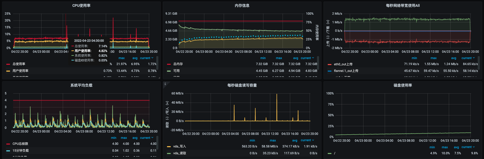
	
	- other
	
		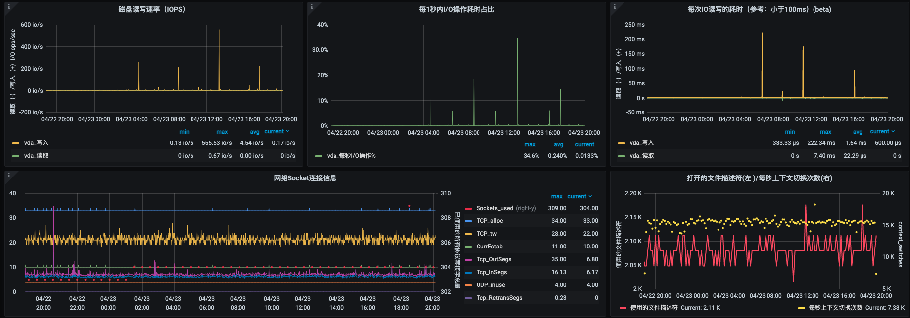
- 压测客户端普通链节点 
	- cpu、mem、load、network
	
		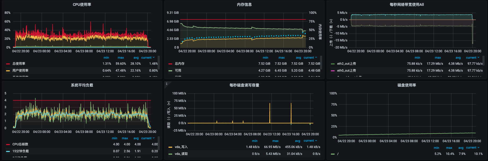

	- other
	
		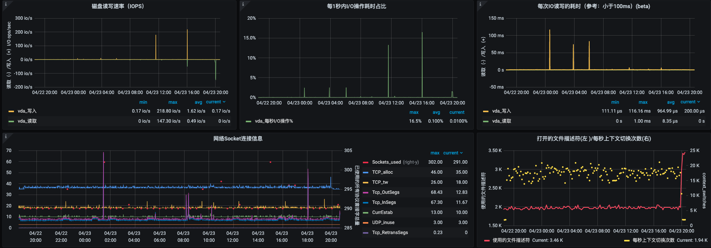
- 浏览器普通链节点
	- cpu、mem、load、network
		
		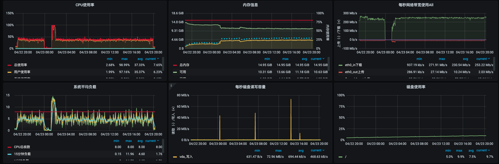
	- other
	
		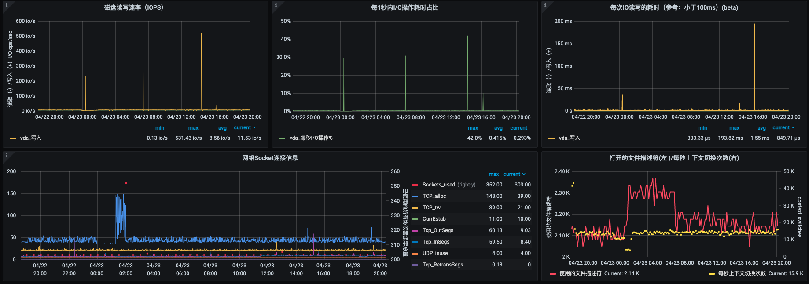
- 压测客户端节点	
	- cpu、mem、load、network

		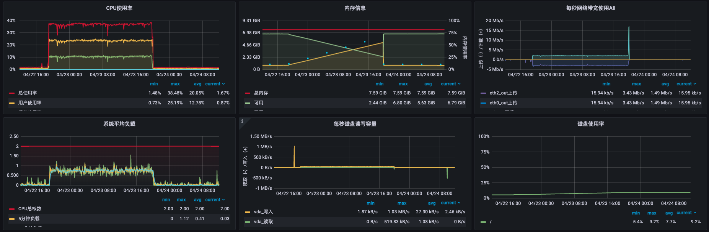
	- other
	
		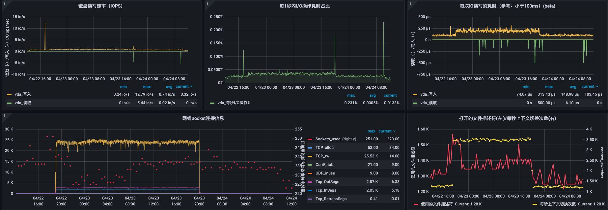
- 游览器节点
	- cpu
		
		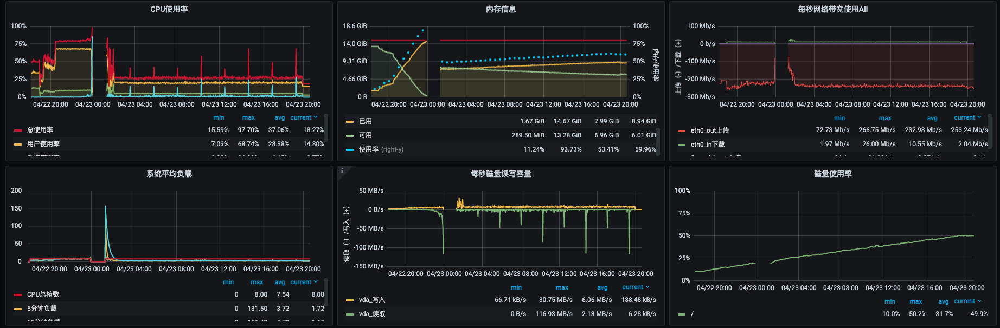
	- other
	
		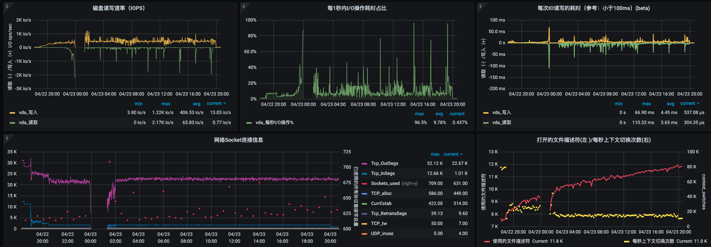

#### [游览器](http://106.75.120.70:4000/)查询数据
- 抽取块数据
	- 创建测试合约
		
		因为生产合约比较复杂，没有使用压测软件的部署方式，而是使用手动方式部署
	- 负载块信息 
	
		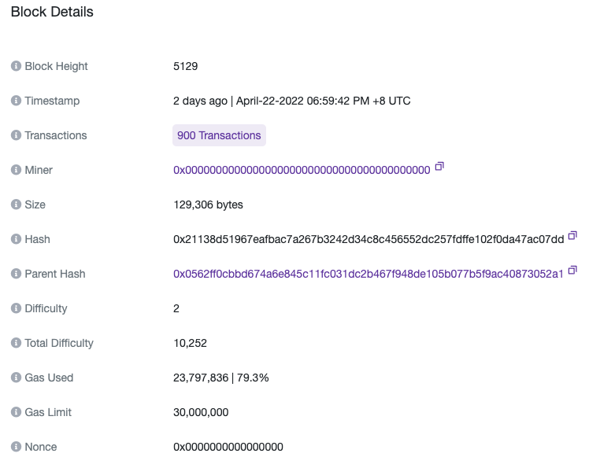
	- 块交易列表

		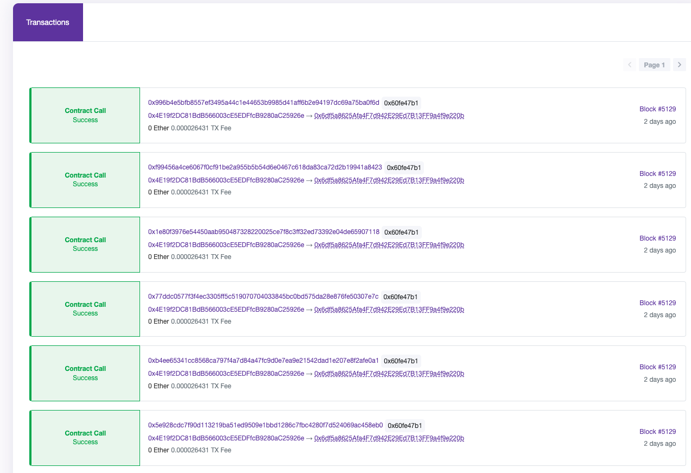
- 抽取单条交易数据
	
	 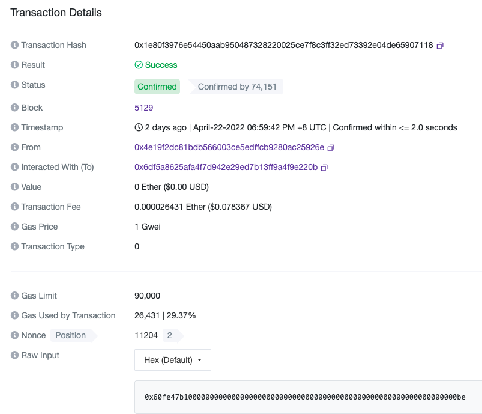

#### 测试客户端结果	
- 图形

	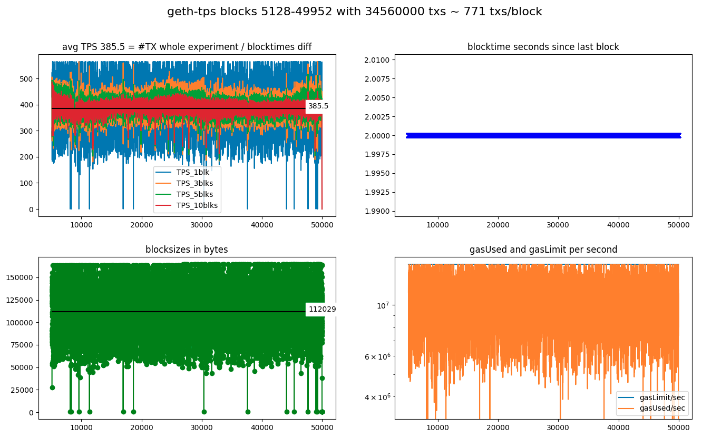
- 文本
	
		(geth-tps) Geth v1.10.17 with 34560000 txs: 385.5 TPS
		information:
		NODE: Geth/v1.10.17-stable-25c9b49f/linux-amd64/go1.18 on http://172.17.135.155:8545
		      consensus=clique chain_name=poa chain_id=65533 network_id=65533
		SEND: 34560000 transactions in blocks 5128-49952 with 10 empty blocks following.
		      A sample of transactions looked as if they: succeeded.
		TPS:  The stopclock watcher measured a final TPS of 385.5 since contract deploy,
		      and in between saw values as high as 424.1 TPS.
		DIAG: The whole experiment was prefixed 'geth-tps'.
		      The diagrams were saved into 'img/geth-tps-20220422-1859_blks5128-49952.png'.
		      Looking only at the experiment block-timestamps, the overall TPS was ~385.5.
		log:
		versions: web3 4.8.2, py-solc: 3.2.0, solc 0.4.25+commit.59dbf8f1.Linux.gpp, testrpc 1.3.5, python 3.6.9 (default, Dec  8 2021, 21:08:43) [GCC 8.4.0]
		web3 connection established, blockNumber = 5123, node version string =  Geth/v1.10.17-stable-25c9b49f/linux-amd64/go1.18
		first account of node is 0x4E19f2DC81BdB566003cE5EDFfcB9280aC25926e, balance is 99999999999.708496951 Ether
		nodeName: Geth, nodeType: Geth, nodeVersion: v1.10.17-stable-25c9b49f, consensus: clique, network: 65533, chainName: poa, chainId: 65533
		
		Block  5123  - waiting for something to happen
		(filedate 1650624898) last contract address: 0x7e04c0Ab66523f24d8EB785A92D5C11725537A9e
		(filedate 1650625176) new contract address: 0x6df5a8625Afa4F7d942E29Ed7B13FF9a4f9e220b
		
		blocknumber_start_here = 5126
		starting timer, at block 5126 which has  1  transactions; at epochtime 1650625176.709048
		block 5127 | new #TX   0 / 2000 ms =   0.0 TPS_current | total: #TX    1 /  1.5 s =   0.7 TPS_average (peak  is   0.7 TPS_average)
		block 5128 | new #TX 188 / 2000 ms =  94.0 TPS_current | total: #TX  189 /  4.3 s =  44.4 TPS_average (peak  is  44.4 TPS_average)
		block 5129 | new #TX 900 / 2000 ms = 450.0 TPS_current | total: #TX 1089 /  6.1 s = 178.3 TPS_average (peak  is 178.3 TPS_average)
		...
		block 49950 | new #TX 846 / 2000 ms = 423.0 TPS_current | total: #TX 34555461 / 89648.3 s = 385.5 TPS_average (peak was 424.1 TPS_average)
		block 49951 | new #TX 680 / 2000 ms = 340.0 TPS_current | total: #TX 34556141 / 89649.5 s = 385.5 TPS_average (peak was 424.1 TPS_average)
		block 49952 | new #TX 260 / 2000 ms = 130.0 TPS_current | total: #TX 34556401 / 89651.7 s = 385.5 TPS_average (peak was 424.1 TPS_average)
		block 49953 | new #TX   0 / 2000 ms =   0.0 TPS_current | total: #TX 34556401 / 89654.1 s = 385.4 TPS_average (peak was 424.1 TPS_average)
		block 49954 | new #TX   0 / 2000 ms =   0.0 TPS_current | total: #TX 34556401 / 89655.9 s = 385.4 TPS_average (peak was 424.1 TPS_average)
		block 49955 | new #TX   0 / 2000 ms =   0.0 TPS_current | total: #TX 34556401 / 89657.5 s = 385.4 TPS_average (peak was 424.1 TPS_average)
		block 49956 | new #TX   0 / 2000 ms =   0.0 TPS_current | total: #TX 34556401 / 89659.6 s = 385.4 TPS_average (peak was 424.1 TPS_average)
		block 49957 | new #TX   0 / 2000 ms =   0.0 TPS_current | total: #TX 34556401 / 89662.0 s = 385.4 TPS_average (peak was 424.1 TPS_average)
		block 49958 | new #TX   0 / 2000 ms =   0.0 TPS_current | total: #TX 34556401 / 89664.1 s = 385.4 TPS_average (peak was 424.1 TPS_average)
		block 49959 | new #TX   0 / 2000 ms =   0.0 TPS_current | total: #TX 34556401 / 89666.0 s = 385.4 TPS_average (peak was 424.1 TPS_average)
		block 49960 | new #TX   0 / 2000 ms =   0.0 TPS_current | total: #TX 34556401 / 89667.5 s = 385.4 TPS_average (peak was 424.1 TPS_average)
		block 49961 | new #TX   0 / 2000 ms =   0.0 TPS_current | total: #TX 34556401 / 89669.3 s = 385.4 TPS_average (peak was 424.1 TPS_average)
		block 49962 | new #TX   0 / 2000 ms =   0.0 TPS_current | total: #TX 34556401 / 89671.4 s = 385.4 TPS_average (peak was 424.1 TPS_average)
		Received signal from send.py = updated INFOFILE.
		Experiment ended! Current blocknumber = 49962
		Updated info file: last-experiment.json THE END.
		
		info raw
		{'diagrams': {'blocktimestampsTpsAv': 385.5056666071747, 'filename': 'img/geth-tps-20220422-1859_blks5128-49952.png', 'prefix': 'geth-tps'}, 'node': {'chain_id': 65533, 'chain_name': 'poa', 'consensus': 'clique', 'name': 'Geth', 'network_id': 65533, 'rpc_address': 'http://172.17.135.155:8545', 'type': 'Geth', 'version': 'v1.10.17-stable-25c9b49f', 'web3.version.node': 'Geth/v1.10.17-stable-25c9b49f/linux-amd64/go1.18'}, 'send': {'block_first': 5128, 'block_last': 49952, 'empty_blocks': 10, 'num_txs': 34560000, 'sample_txs_successful': True}, 'tps': {'finalTpsAv': 385.45178318389003, 'peakTpsAv': 424.0877567882903, 'start_epochtime': 1650625176.709048}}

#### 测试结果
- 从软硬件测试结果看
	- 硬件
		- 链节点
			- 共识节点	
			
				从资源监控看，所有节点硬件均较为正常
			- 应用普通

				从资源监控看，所有节点硬件均较为正常
			- 浏览器普通
				
				从资源监控看，所有节点硬件均较为正常
		- 应用节点
			- 压力测试节点

				从资源监控看,所有节点硬件均较为正常
			- 游览器节点

				内存耗尽，这块怀疑是k8s其他服务调度到该机器占用，有待进一步观察，但不影响整体稳定性
	- 软件
		- 总共测试交易 3456w 
		- 测试区块
			- 5127-49962
		- 最终平均是 385.5 TPS (注意与共识在相同机房处理速度一致(389.3 TPS)) 
- 测试中掺杂真实转账交易
	
	无测试
- 测试中遇到的问题
	- 带宽问题

		 之前测试使用带宽是100MB，后测算发现可以共识使用2Mb/s带宽，应用使用5Mb/s带宽即可，更换测试后正常
	- 浏览器节点内存占用问题

		因为使用 k8s 外网部署模式，所以浏览器节点的内存被其他节点调度任务占用了，故导致内存异常占用。	 

	