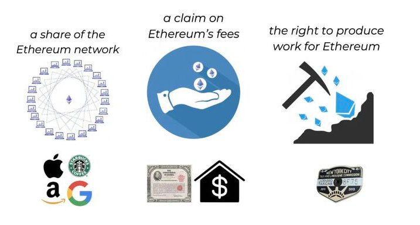

# 重新定义以太坊：新资本主义与三性资产
## 新资本主义
说到资本主义，你可能想到的是英国美国等资本主义帝国，但不得不提到一个国家，荷兰。

在十七世纪的欧洲，最强大的国家既不是西班牙与葡萄牙，也不是英格兰，而是有着“海上马车夫”之称的荷兰。荷兰的强大一方面来自于先进的造船业，荷兰达到鼎盛时期，荷兰的商船吨位占当时欧洲总吨位的3/4，海上贸易基本上被荷兰垄断。另一方面，则来源于发达的商业贸易，可以这样说，荷兰发明了资本主义，资本主义塑造了荷兰。

- 1602年，世界上第一个股份有限公司荷兰东印度联合公司成立；
- 1606年，世界上第一个以金融股票为主的证券交易所在荷兰阿姆斯特丹成立，比伦敦证券交易所早了一个世纪；
- 1609年，世界上第一个具有现代意义的银行在阿姆斯特丹诞生，阿姆斯特丹银行具备了中央银行的属性，体现了国家的信用，对货币和信用制度进行统一管理，成为了货币发行的银行。

当荷兰建立了第一个运转良好的贷款系统，这个系统可以更容易地创造债务，资本主义在荷兰生根发芽走向世界，因此，荷兰也被称为世界上“第一个资本主义国家”。几百年过去，一个新的资本主义系统开始被建立，那是数字世界的新荷兰，以太坊。

以太坊的变革之处在于其在互联网上建立一个新的应用层，价值层。Web 2.0 互联网，是中心化数据库和中心化数据互联网，Facebook、Google、Amazon及其产品代表了Web2.0的应用层巅峰。以太提供了另一种选择，让价值直接通过互联网传输，其中一个重大创新是将“以太坊虚拟机（EVM）”整合进其区块链。换句话说，有了 EVM，以太坊可以运行软件，软件可以处理其区块链上的数字资产，从而有了以太坊上的应用层，新的债务生态、新的股票交易系统……一整套资本主义的生态机制得以快速低成本建立并运行。

旧的资本主义系统，可以描述为 “meatspace + digital（物质世界 + 数字化）” ，在 “meatspace+digital” 经济体中，每种资产类别都有各自的交易所、托管机构和市场，因此跨市场价值转移需要付出资金和时间成本。

以太坊上的所有资产类型（股票、债券、资产、房地产、虚拟土地等）都是用同一种语言开发的，因此每种资产之间都可以实现无摩擦交易。在 “meatspace+digital” 系统中，个体用户将股票从一个托管机构转移到另一个托管机构需要等待几天乃至几周时间，但是在以太坊上只需要几分钟。因此，以太坊最具想象之处在于，成为未来的全球清算层，在以太坊上建立一套完整的资本主义生态系统。
## 三性资产
以太坊 2.0，将会是以太坊的一次进化。在 RealT 首席运营官 David Houman 看来，以太坊 2.0 之后，ETH 将成为历史上第一个同时具有所有三种资产类别属性的资产：

- 资本资产
- 可消耗资产
- 价值存储

1997年，美国经济学家 Robert J. Greer 在论文《什么是资产种类？》中将资产类别分为三类。

1. 资本资产

	资本资产指的是任何可以生成未来现金流的资产。比如说以股息形式生成现金流的股票和以票息形式生成现金流的债券，可出租房地产。其根本特点是可以将未来可能生成的现金流进行折现估值。
2. 可消费/可转换资产

	这类资产可以被消费或者转换成另一种资产，但本身无法生成未来现金流。比如例如石油、小麦、咖啡，换句话说，这类资产就是实物商品。可转换资产与资本资产的区别就是，这类资产无法通过折现未来的现金流来估值。
3. 价值储存资产

	这类资产无法创收，也不能被消费，但却存在经济价值，这类资产的价值在于投资者的认可。货币和收藏品就是保值资产的典型例子。例如黄金、艺术品或比特币。
	
2019年， David Houman抛出观点，“当ETH 渐渐成为一种在经济上发挥三重功效的“三性资产”，同时满足新经济所需的所有需求，是世界上最好的货币模式。”

## 以太坊是资本资产
1. 以太坊网络中的份额

	相当于以太坊网络中的“股份”，ETH 2.0 的 PoS 质押机制， 让 ETH 本身也变成一种生产性资产，它可以通过质押产生收益，这让它捕获到了系统成长的价值。
2. 以太坊的求偿权

	是对以太坊网络费用的求偿权。在这方面，表现得类似于债券。以太坊是一个债券发行人，Stakers 是债券持有人，并获得相应的收益。与传统债券的不同之处在于，Stakers 可以 "根据指令"（没有到期）赎回以太币，类似于债券的嵌入式期权。特别是，ETH 获得了主权债券的特质，因为该平台在设计上是有偿付能力的，没有违约风险。
3. 为以太坊进行生产的权利

	拥有 ETH，就拥有了以太坊的工作权力和收取费用的权力。ETH 也是确保以太坊网络与其工作人员之间激励一致性的一种机制，所有工人必须拥有 ETH 才能为以太坊工作。如果你想成为以太坊网络的雇员或是为相关服务付费，那么就必须拥有 ETH，并且与该网络保持一致。
	

## ETH 是消耗性资产
可以将 ETH 理解为一种可消耗的能源，有了能源。我们的世界才得以正常运转，能源是为世界经济提供动力的经济基础。以太坊网络的每一笔交易（发送代币或与智能合约互动）都要花费 Gas，并以 Gwei 为单位定价。

在引入 EIP - 1559（定于2021年7月）后，这些费用将被 “燃烧”，就像传统的天然气或石油一样，以太币将变成一种持续消耗的可消费/可转换的资产（商品）
## ETH 是价值存储
如果你关注 DeFi，那么就应该知道 ETH 充当了 DeFi 生态中的价值存存储，当 ETH 被锁定，往往意味着 ETH 会成为基础的抵押品。

比特币固定供应量为2100万，并且通胀率在不断下降，也被称为“数字黄金”。相比之下，以太坊虽没有固定供应量，但未来通货膨胀率将持续下降。

ETH 2.0 在完全转为 PoS 后，ETH 的全网增发量将急剧下降，使得通胀率从当前的 4.54 %，下降到 1.58%，不仅仅低于全球货币 2021 年通货膨胀率预期值（3.29%），而且将低于比特币的通货膨胀率（1.8%）。此外，EIP-1559 提案已经被批准将于今年年中的以太坊伦敦硬分叉升级中实施，正式将以太坊经济的增长与 ETH 资产的稀缺性联系起来。

一直以来，以太坊的货币政策是“最少必要发行量”，也即以太坊协议新增发行的 ETH 量“少到足以”确保以太坊网络的安全。

EIP-1559 将销毁作为交易费的 ETH，也即这部分 ETH 将从总流通量中移除，销毁 ETH 意味着 ETH 的稀缺性增加。ETH2.0 的 POS 机制以及 EIP-1559 将让以太坊更具价值存储属性。

最后，回到最初的问题，以太坊能超越比特币么？个人的观点是，以太坊在未来将得到更多的价值认可，实现增值，但在这个周期内依然无法撼动比特币的地位，在下个周期存在理论上的可能性。

从资金源头来看，比特币以及狗狗币都是直接吸收来自法币世界的大水漫灌，而以太坊的资金流入更多还是比特币的资金溢出。在竞争层面，比特币在赛道内没有对手，而以太坊面临更多挑战。

正如以太坊想挑战比特币，其他新旧公链也在向以太坊发起挑战，BSC\HECO 等交易所侧链、Solana\Near\Avalanche 等新公链都在吸收以太坊的资金与用户。

以太坊需要很努力，先去打败竞争对手，而比特币呢，只需要躺在那里，迎接崩坏的法币世界主动拥抱。

以太坊的成功来自于主动，比特币的成功源于被动，这要求以太坊需要不断进步，且不能犯致命错误。	
## 参考
[重新定义以太坊：新资本主义与三性资产](https://www.163.com/dy/article/G9B46AKC05319FMZ.html)