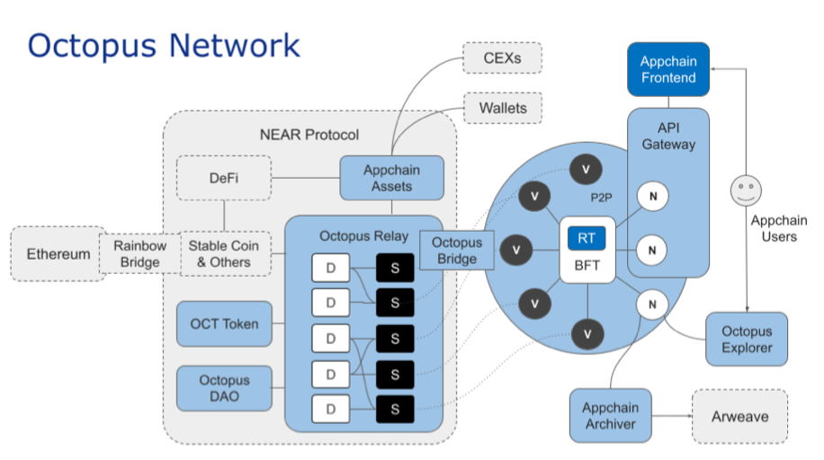

## 章鱼链概念

## 核心概念
- Octopus Network 的核心是 Octopus Relay

	一组运行在 NEAR 区块链（又名主链）上的智能合约，它实现了证券租赁市场。 Octopus 应用链位于市场的需求端。 他们用自己的原生代币支付租金，以从 $OCT 持有者那里租赁证券。
	
	Octopus Network 为应用链提供了一套完整的基础设施，包括 API Gateway、Blockchain Explorer、Archive Gateway 等。 Octopus Bridge 将为每个应用链原生代币在 NEAR 上部署一个 NEP141 包装器合约。然后钱包和交易所可以集成标准的包装令牌，而不是与应用链一一集成。因此，应用链团队只需要专注于 Substrate 运行时和前端开发，而 Octopus Network 处理所有其他技术需求。
	
	所有公共区块链和多链网络都将相互连接，形成区块链互联网，这并不是一个有争议的说法。八达通网络专门设计成为其中的一部分。 Octopus 团队，以前称为 Cdot，一直致力于通用区块链互操作性协议 IBC 和跨链集成。
	
	- 跨链机制
		1. 每个应用链验证者建立一个到主链全节点（或索引服务）的可靠 RPC 连接，并通过使用 Substrate 链下工作者订阅 Octopus 中继中发生的所有 staking 跨链事件。 
		2. 一旦观察到并识别出针对应用链的事件，应用链的所有验证者将以其与 staking 成正比的投票权重进行投票，从而在应用链上就该事件的存在达成共识。
		3. 当达成共识时，将执行相应的操作，例如铸造凭证令牌或更新的验证器集。

## 基础概念
- CosMos

	让每个应用链依赖其 PoW 或 PoS 安全性。 Vitalik Buterin 创造了这种“简单的解决方案”，而 Cosmos 就属于这一类。由于流片 ASIC 的成本非常高，因此引导安全的 PoW 公共区块链极其困难。虽然基于 PoS 的区块链更容易实现自包含的安全性，但当存在大量跨链资产时，其安全性变得脆弱。在这种情况下，操纵共识往往是有利可图的。
- Substrate
	- Polkadot(Polkadot XCMP)

		Polkadot 是基于 Substrate 的区块链,“硬解”。例如，可以在 Polkadot 中看到分片，其中在整个网络之间共享相同的安全级别（可能非常高）。但 Polkadot 在资源分配方面面临困难。考虑到协调开销，分片总量是有限的。以太坊 V2 将有 64 个分片，而 Polkadot 将有不到 100 个分片。
	
		假设网络为每个应用程序分配一个分片。在这种情况下，它只能支持几十个应用程序，每个应用程序必须支付整个网络共识成本的十分之一，这对网络或应用程序都没有意义。 Parathread 似乎是一种解决方法，但它仍然缺乏详细说明。至少对于某些类型的应用程序，例如去中心化游戏或社交媒体，没有活性保证的底层区块链，例如平行线程，是没有意义的。
		
		在计算系统中，更高的安全性并不一定等同于更好的安全性，因为更高级别的安全性总是伴随着更高级别的成本。因此，计算系统需要的是适当且足够的安全性。在 Polkadot 中，开发人员无法决定他们的平行链的适当安全级别。他们只有一个选择——在拍卖中赢得一席之地。
		
		即使平行链赢得拍卖，它通常也会为安全支付过高的费用，因为加密网络在其初始阶段根本不需要数十亿美元的安全级别。安全成本负担可能会导致这些平行链陷入恶性通货膨胀，因为它们必须承诺向众贷贷方发行大量原生代币。至少，这种负担使平行链几乎没有空间来激励其协议的真正价值创造者——帮助建立加密网络网络效应的参与者。
- NEAR 协议
- DeFi
- pBFT
- Arweave(去中心化存储)	
- Rainbow Bridge
- IBC

		
## 问题
- 散列时间锁定合约（HTLC）并不是支持去信任跨链资产交换的有意义的方式，因为交换发起者拥有其交易对手所没有的选择性。这造成了不公平的因素。

	举例来说，在掉期发起人 A 锁定资产后，B 锁定了他的资产，实质上是免费提供了他的选择权，允许 A 进行投机而不受惩罚。期权的价值由 B 设置的超时跨度和投入掉期的两种资产的相对价格波动决定。如果对她不利，A 可以选择中止掉期，而不必为该期权支付溢价。尽管 B 会尝试限制超时跨度，但该选项的值永远不会为零。所以，B 必须依赖 A，不能利用 B。更简单地说，B 必须信任 A。
	
	中继本质上被认为是不可信的。源链轻客户端在目标链上运行，使目标链能够验证表示源链上状态变化的消息，而无需求助于受信任方。最先进的区块链互操作系统和协议，如彩虹桥和 IBC 协议都属于这一类。

	但是中继并不是一种完全无需信任的跨链方法。中继器——负责为目标链上的轻客户端提供区块头（或相当于源链）的链下进程——结果证明是阿喀琉斯之踵。因为必须至少有一个诚实的中继器来保持轻客户端的更新，所以系统的去中心化程度取决于其最中心化的组件。中继器激励机制很复杂，即使对于最先进的协议来说仍然是一个未解决的问题。