# 蚂蚁链
## 技术优势
- 共识机制 – 支持100+节点的高效共识、十万级TPS、交易秒级确认
- 智能合约 – 灵活安全的编程模型、支持多类开发语言、提供安全可信的合约审计
- 可信计算 – 基于TEE(可信执行环境)的节点密钥管理、全程加密数据传输
- 隐私保护 – 强隐私账户模型、多类同态加密、零知识证明保护交易内容、可信硬件
- 跨链交互 – 跨链数据路由协议、Oracle(预言机)服务提供可信外部数据

## 入驻条件
拥有一个实名认证的企业支付宝账户

- 注册账号

	使用企业支付宝账户，在蚂蚁区块链中注册并开通租户。开通成功后，该企业支付宝账户即成为该租户的空间管理员，可添加更多成员账号，并对其赋予空间管理员、观察者、开发者等角色。
- 购买和开通云服务

	针对金融业务，蚂蚁区块链提供以下托管方案。
	
	公有云方案：满足互联网金融类业务需求，可选购各类云产品，如：可信身份认证、蚂蚁区块链 BaaS 平台
- 尊享灾备服务

	蚂蚁区块链提供同城双活的灾备方案，保证业务连续性和数据安全。
- 开发联调，部署完成	

## 基础架构
### 金融区/非金区
按照不同行业的特点及对成本、安全合规的要求差异，蚂蚁区块链提供差异化的云计算服务，总体划分为金融区（简称“金区”）和非金区，两个区域之间物理隔离。

- 金融区

	适用于对业务安全性、可靠性、监管合规等有严格要求的金融行业。采用独立的机房集群，满足一行三会金融监管要求；提供特高等级安全防护，支持两地三中心灾备。金融区的产品与服务在网络控制、访问控制上管理更为严格，通常价格也会更高。
- 非金区

	适用于对成本、访问灵活性有较高诉求的非金融行业。其中的资源、存储、服务更容易访问（比如可通过公网访问），能够更方便的构建云上与云下的混合部署环境，且使用方式灵活，便于快速搭建业务服务。产品与服务种类和金融区类似，价格更实惠。	
	
### 地域（Region）
按照数据中心所处的地理位置（城市）不同，金融区或非金区又进一步划分为不同的地域（Region）。不同地域之间的服务器内网是不通的，若要进行网络通信只能走公网。

距离越近的地域，网络延迟越小。您可以根据实际需求选择不同的地域。
### 网络类型
蚂蚁区块链上提供以下两种网络类型：

- 经典网络

	IP 地址由蚂蚁区块链统一分配，配置简便，使用方便，适合对操作易用性要求比较高、需要快速使用 ECS 的用户。
- 专有网络

	专有网络 VPC（Virtual Private Cloud），即逻辑隔离的私有网络，支持自定义网络拓扑和 IP 地址，可通过专线连接。适合对网络管理熟悉了解的用户。

	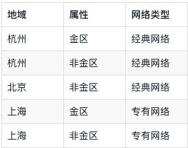
- 可用区（Zone）

	为提供同城容灾能力，蚂蚁区块链在同一地域中提供多个可用区（Zone）。不同的可用区分布在电力、网络相互隔离的物理区域，可以实现可用区之间内网互通、故障隔离。

	同一个企业用户在一个地域中可以选择两个可用区，以提高应用的高可用性。

	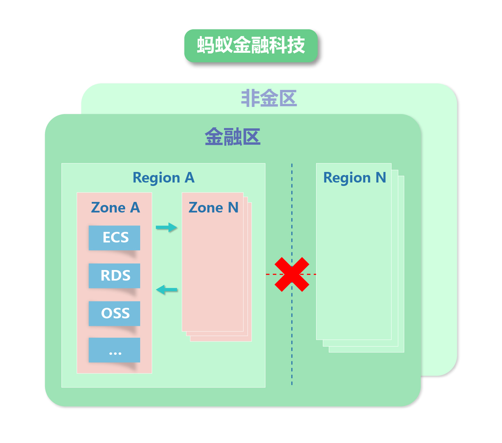

### 用户体系
蚂蚁区块链提供企业级的云服务。入驻蚂蚁区块链的实体必须是企业。企业具有企业名称、营业执照、法人等信息。

一个企业可以申请多个支付宝帐号（申请企业支付宝帐号），每个企业支付宝帐号都可以开通一个蚂蚁区块链租户。租户可以用来在逻辑上隔离财务独立的不同部门或子公司。

一个企业通常有很多成员，这些成员可以被添加为租户管理员或普通操作员。同一个企业下的不同租户间的成员是可以共享的。

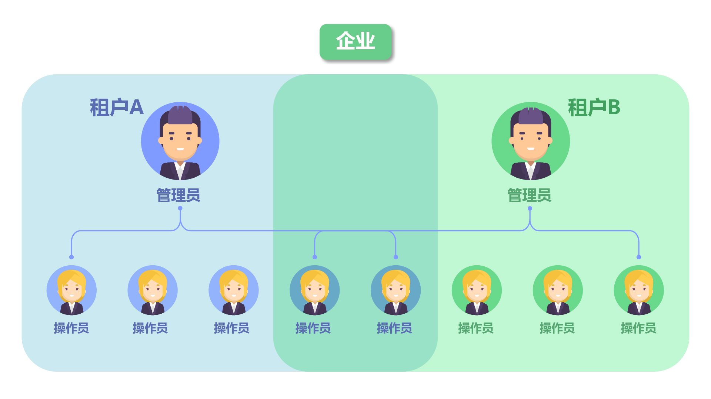

### 环境和应用
环境是指为了完成软件开发，部署等工作所必需的硬件、软件、网络设备、数据的总称。环境之间的资源是逻辑隔离的，每个租户可以根据研发交付需要为自己的应用创建不同的“环境（Workspace）”，比如开发环境、生产环境等。每个操作员对不同的环境可以分配不同的权限。

为支持高可用，环境可以跨可用区（Zone）， 但不能跨区域（Region）。每个环境下都需要为应用购买相应的资源，不同环境可以发布不同的应用版本。

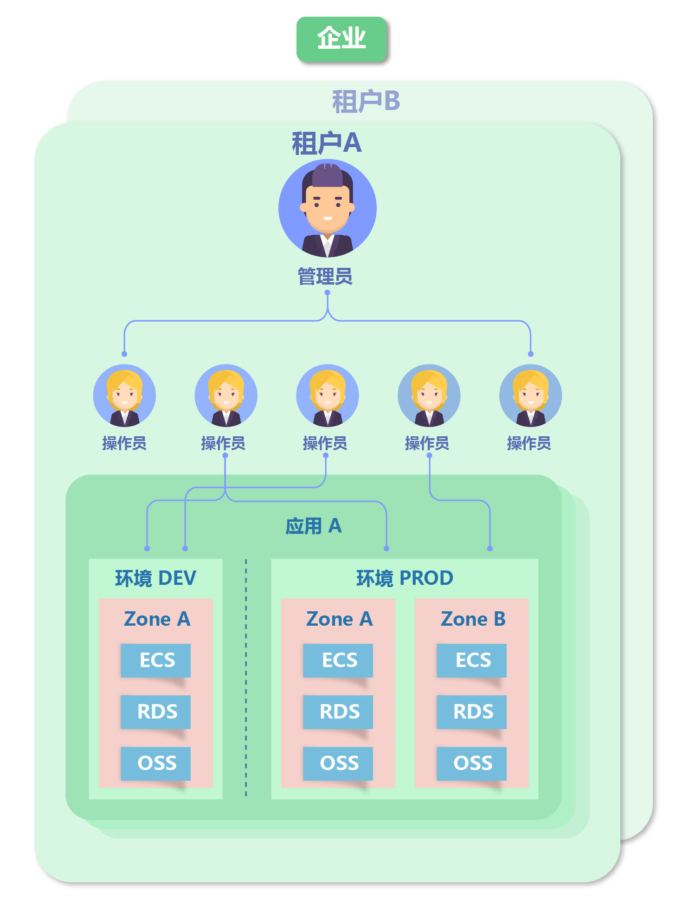

## [术语库](https://antchain.antgroup.com/docs/11/171894)
## 服务分别
- 蚂蚁开放联名链
- 可信存证服务
- 可信身份认证
- 蚂蚁区块链 BaaS 平台
- 区块链溯源营销
- 蚂蚁区块链 API 平台

## 蚂蚁区块链 API 平台
蚂蚁区块链 API 平台（以下简称为 API 平台）将蚂蚁区块链已有的服务封装成一系列数据接口，供开发者使用。开发者通过 API，不仅能够实现和 Web 端相同的操作，还可以进行复杂的数据交互。

API 平台主要负责承载两种类型的服务：

- 核心服务

	核心服务是指蚂蚁区块链 PaaS 层核心组件提供的服务，所有核心组件的 API 都以 antcloud 开头。核心服务包括以下内容
	
	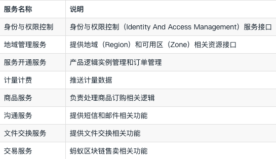
- 行业应用

	[开发者中心](https://apdevcenter.antchain.antgroup.com/dashboard?tenantName=FWTENRKF)
	
### [基础术语](https://antchain.antgroup.com/docs/11/172013)
### SDK 调用
蚂蚁区块链提供了两种 SDK：

- 核心 SDK：核心 SDK 只有一个，是通过 SDK 调用任何 API 时都必须依赖的 SDK。
- 应用 SDK：应用 SDK 数量丰富，是为实现特定功能封装而成的 SDK。

蚂蚁区块链强烈建议您通过 SDK 调用 API。通过 SDK 调用 API 时，您无需考虑业务逻辑、签名方式、传输协议等。关于蚂蚁区块链提供的 SDK 的具体信息，请参阅 [SDK 列表](https://apdevcenter.antchain.antgroup.com/console/sdk)。

本教程以实现向指定用户发送短信的功能为例，向您介绍如何快速上手使用蚂蚁区块链 Java SDK。

#### 前置条件
- 已准备好蚂蚁区块链账号的 AccessKey（包括 Access ID 和 Access Secret）。关于如何获取 AccessKey，请参阅 [成员管理](https://antchain.antgroup.com/docs/11/171905#)。
- 已准备好 Java 开发环境。蚂蚁区块链 Java SDK 支持 JDK 1.6+。
- 已确定需要使用的 API 的服务地域和调用入口，请参阅 [API 调用地域](https://antchain.antgroup.com/docs/11/172023#) 以获取具体信息。

#### 实现功能
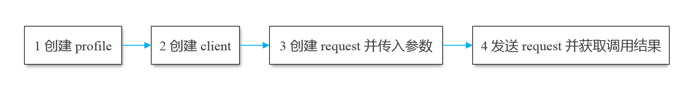

- 创建 profile

	创建 profile 的方法包含在核心 SDK 中。如果您使用 Apache Maven 来管理 Java 项目，您需要在项目的配置文件 pom.xml 中加入核心 SDK 的依赖
	
		<!-- 基础SDK -->
		<dependency>
		    <groupId>cn.com.antcloud.api</groupId>
		    <artifactId>antcloud-api-sdk</artifactId>
		    <version>3.0.1</version>
		</dependency>
	在项目的配置文件中加入核心 SDK 的 Maven 依赖后，您就可以创建 profile 了
	
		import cn.com.antcloud.api.AntFinTechProfile;
 
		AntFinTechProfile.getProfile(
		    "<gateway-endpoint>",
		    "<your-access-id>",
		    "<your-access-secret>"
		);
	创建 profile 时，需要传入准备好的参数：

	- <gateway-endpoint>：调用入口。
	- <your-access-id>：Access ID。
	- <your-access-secret>：Access Secret
- 创建 client

	创建 client 的方法也包含在核心 SDK 中，如下

		import cn.com.antcloud.api.AntFinTechApiClient;
		 
		// 创建 client 时，需要传入 profile
		AntFinTechApiClient acApiClient = new AntFinTechApiClient(profile);
- 创建 request 并传入参数

	您可以通过两种方式来创建 request 并传入参数：

	- DTO 方式：该方式通过应用 SDK 中定义的基础类创建 request 实例并传参
	
			import cn.com.antcloud.api.gotone.v1_0.model.TemplateParam; // cn.com.antcloud.api.{产品码}.{版本号}，具体请查看 SDK 中的代码
			import cn.com.antcloud.api.gotone.v1_0.request.NotifySmsRequest;
			 
			.........
			 
			        // 创建 request
			        NotifySmsRequest notifySmsRequest = new NotifySmsRequest();
			        // 在应用 SDK 中，每个参数都有对应的 set 方法
			        // SDK 会为您传入公共参数的值
			        // 您需要传入必填的非公共参数的值
			        notifySmsRequest.setRecNumber("");
			        notifySmsRequest.setTemplateCode("");
			        notifySmsRequest.setMark("");
			        TemplateParam templateParam = new TemplateParam();
			        templateParam.setKey("");
			        templateParam.setValue("");
			        List<TemplateParam> templateParams = new ArrayList<TemplateParam>();
			        templateParams.add(templateParam);
			        notifySmsRequest.setTemplateParams(templateParams);
			 
			.........
	- Map 方式：该方式通过核心 SDK 中定义的基础类创建 request 实例并传参。

			import cn.com.antcloud.api.antcloud.AntCloudClientRequest;
			 
			.........
			 
			        // 创建Request
			        AntCloudClientRequest request = new AntCloudClientRequest();
			        // 指定调用方法
			        request.setMethod("antcloud.gotone.sms.notify");
			        // 指定方法的版本号
			        request.setVersion("1.0");
			        // 在核心 SDK 中，每个业务参数都通过 request.putParameter({Key}, {Value}) 的方法传入
			        // SDK 会为您传入方法名和版本号以外的公共参数的值
			        // 您需要传入必填的非公共参数的值
			        request.putParameter("rec_number", "");
			        request.putParameter("template_code", "");
			        request.putParameter("mark", "");
			        request.putParameter("template_params.1.key", "");
			        request.putParameter("template_params.1.value", "");
			 
			.........	
- 发送 request 并获取调用结果
	- DTO 方式
	
			import cn.com.antcloud.api.gotone.v1_0.response.NotifySmsResponse;
			 
			.........
			 
			    NotifySmsResponse notifySmsResponse = acApiClient.execute(notifySmsRequest);
			 
			.........
	- Map 方式

			import cn.com.antcloud.api.antcloud.AntCloudClientResponse;
			 
			.........
			 
			    // 发送 request
			    AntCloudClientResponse response = acApiClient.execute(request);
			 
			    // 发送请求，获取返回值
			    String responseData = response.getData();
			 
			.........

### API 调用
### RPC 风格调用
采用 RPC 风格的调用时，请求方法必须是 POST ；请求 Header 的参数必须是 "Content-type: application/x-www.form-urlencoded" 。

以下是一个 RPC 风格调用示例：			
		
	 curl https://apigw.cloud.alipay.com/gateway.do -l -X POST
	 -H "Content-type: application/x-www-form-urlencoded"
	 -d application_name=myapp
	     &file_md5=452D06DF89A9145B52965A5334544D79
	     &file_path=appstore/myapp/1.0.0/myapp.tgz
	     &file_size=10240
	     &file_source=fxs-476ef85a9b
	     &tenant=MYBKC1CN
	     &version_memo=1.0稳定版
	     &version_no=v1.0-Build20160816-14
	     &workspace=Prod
	     &method=antcloud.deps.app.version.create
	     &version=1.0
	     &req_msg_id=随机唯一值
	     &sign=签名值，根据签名算法生成
	     &sign_type=HmacSHA1
	     &charset=UTF-8
	     &auth_token=三方授权token
### 请求传输参数数据类型
在您采用 RPC 风格的调用时，传输参数必须是以下三种数据类型之一：

- 基本数据类型
	
	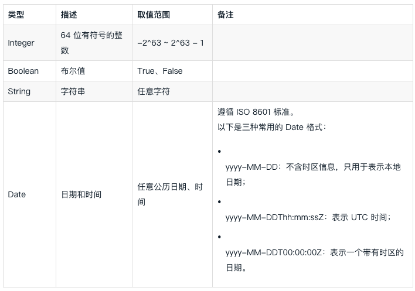
- 数组类型

	由多个同类型元素按顺序排列成的数据类型。同一个数组中的所有元素必须是同类型元素，元素类型可以是基本类型或结构体。支持多维数组。
- 结构体	

	由基本类型、数组类型、结构体组合而成的结构体，支持嵌套。

### REST 风格调用
REST 风格的调用方式如下：

	HTTP_method/URI<Parameters or RequestBody>
其中：

- HTTP_method 是请求使用的方法，包括 PUT、 POST、 GET、 DELETE。
- URI 是请求要调用的API接口，如 /sofa/mq/msgtype/1234。
- Parameters 是非公共参数。GET 和 DELETE 请求可以将参数放在请求参数中。请求参数的格式类似于 ?a=1&b=3 （请求参数和 URI 之间用 ? 分开，不同的请求参数之间以 & 连接）。
- RequestBody 是请求体。PUT 和 POST 请求可以将参数放在请求体中。请求体是 JSON 格式的字符串。

公共参数都放置在公共请求头中。关于公共请求头，请参阅 REST 公共参数。

以下是一个查看某一消息类型集合的 REST 请求示例：

	GET /sofa/mq/msgtype/0000000001?count=100
	 
	// 公共请求头
	X-AntCloud-Req-Msg-Id: 随机唯一值
	X-AntCloud-Access-Key: 您的 AccessKey
	X-AntCloud-Req-Time: 请求时间
	X-AntCloud-Sign-Type: HmacSHA1
	X-AntCloud-Api-Version: 1.0
	X-AntCloud-SDK-Version: Java-SDK-20180705
	X-AntCloud-Sign: 签名值

- GET 为 HTTP_method。
- URI 为 /sofa/mq/msgtype/000000001。
- Parameters 为 ?count=100。
- 由于该请求为 GET 请求，所以没有 RequestBody。
- 其余公共参数都在公共请求头中。

### 传入参数
#### 概述
传入参数包括：

- 公共参数

	如果使用蚂蚁区块链提供的 SDK 调用 API ，您无需关注公共参数。RPC 风格的调用和 REST 风格的调用需要传入的公共参数不完全一致。
	
	- REST 公共参数

		在采用 REST 风格的调用时，你必须在 HTTP Header 中设置以下公共请求头。
	
		- req_msg_id
		- access_key
		- sign
		- sign_type
		- req_time

		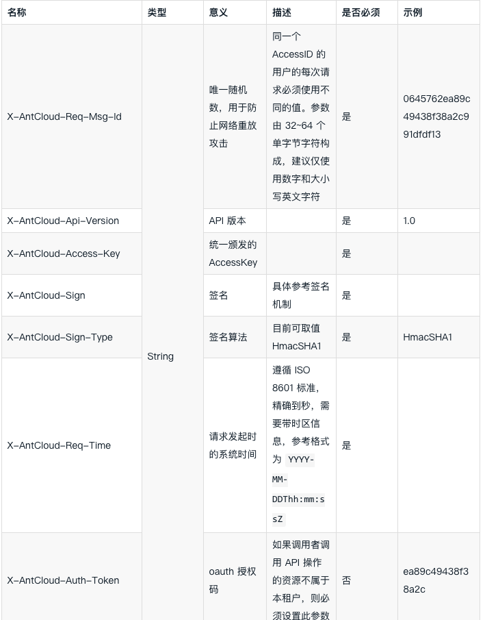
		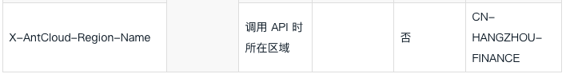
	- RPC 公共参数

		在采用 RPC 风格的调用时，以下参数都需要在调用时传递。
		
		- req_msg_id
		- access_key
		- sign
		- sign_type
		- req_time	

		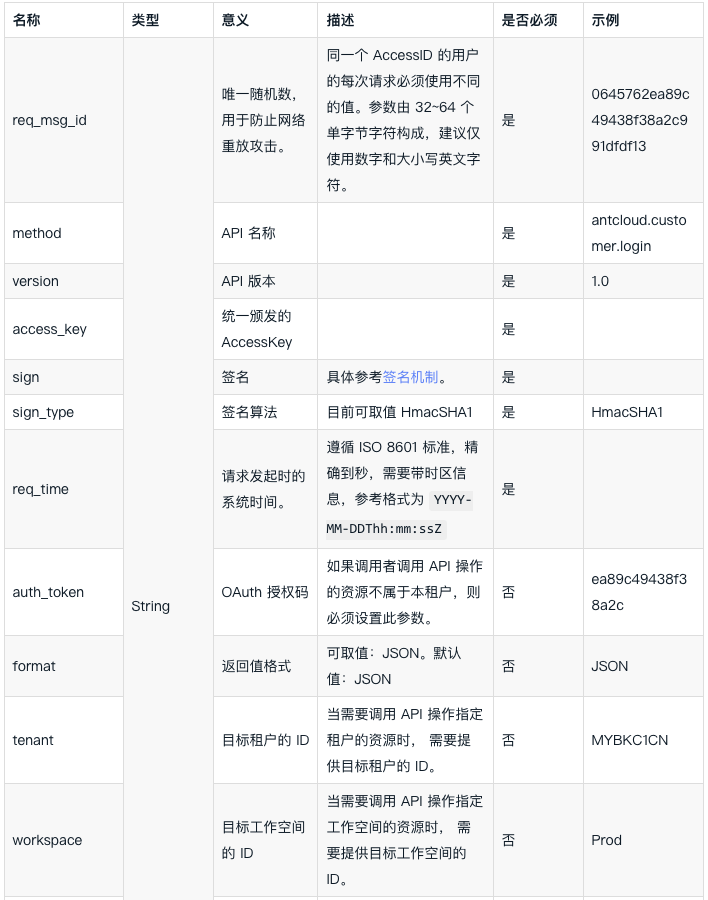
		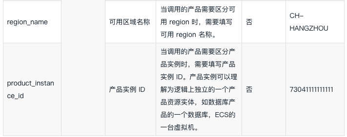
- 非公共参数

	指调用 API 时需要传入的公共参数以外的其他参数。不同的 API 需要传入的非公共参数可能不同。[文档](https://apdevcenter.antchain.antgroup.com/console/openapi)

### API 调用地域
在调用蚂蚁区块链 API 时，您需要指明该 API 的 Endpoint。目前，区块链API对外提供的服务地域只有一个：openapi.antchain.antgroup.com
### 调用结果
调用 API 后，您会收到返回结果。

- 网关调用成功返回值

	如果您收到带签名的 JSON 格式的字符串，且 HTTP Status code=200，表明网关调用成功。例如

		{
		    "response": {
		        "result_msg": "OK",
		        "update_time": "2016-04-12T13:18:27+08:00",
		        "create_time": "2015-11-24T22:45:32+08:00",
		        "req_msg_id": "0645762ea89c49438f38a2c991dfdf54",
		        "name": "STABLE模拟线上",
		        "description": "STABLE模拟线上",
		        "result_code": "OK",
		        "id": "stable",
		        "customer": "jiutianPriStable"
		    },
		    "sign": "yBwwaR4LLmi1+MF+0Ao6v7M05wg="
		}

	- response 对应的值为实际服务组件（如发布部署服务、用户中心）的真实返回值，蚂蚁区块链网关不增减任何字段。
		- response 中的 result_code 字段是结果码。
	- sign 表示网关对 response 的校验值，通过调用者的 AccessSecret 进行签名。

### 身份验证
在通过 API 进行操作时，您可以选择：

- 直接发起操作请求

	在直接调用 API 时，您需要提供 AccessID 进行身份验证。在直接调用 API 时，AccessID 会包含在调用请求中，被发送到服务端；而 AccessSecret 会安全地保存在调用端，不在请求中出现
	
	说明：AccessID 是 AccessKey 的一部分。AccessKey 是蚂蚁区块链发布的身份凭证，包括一个 AccessID 和一个 AccessSecret，两者成对出现。关于如何获取 AccessKey 信息，请参考 账户信息。
	
	- 通过 SDK 发起 API 请求时，您仅需在 profile 中配置 Access Key 即可。SDK 会为您在调用请求中包含 AccessID 。在 profile 中配置 Access Key 的详细步骤，请参阅 快速开始。
	- 手动创建 API 请求时，需要对请求进行签名。当您通过蚂蚁区块链 SDK 发起 API 请求时，SDK 会自动使用 AccessID 对请求进行签名。强烈建议您通过 SDK 发起 API 请求。
- 间接发起操作请求，即授权 ISV 代替您发起操作请求。
	
	您也可以授权蚂蚁区块链的独立软件服务提供方（ISV），由 ISV 代替您发起操作请求。

	此时，租户通过 AuthToken 对 ISV 进行授权。ISV 在调用 API 时，既需要传入 ISV 自己的 AccessID 和 AccessSecret ，又需要传入您给予的 AuthToken，以替代您发起操作请求。

	说明：蚂蚁区块链执行严格的租户隔离校验。ISV 仅在 AuthToken 有效时能够临时替换租户身份发起请求。AuthToken 的授权具有一定的授权范围和时效性

无论是以上哪种方式，实际操作发起方都需要通过身份验证。

### 权限管理
您需要先获得 AccessKey，并绑定相应 API 的调用权限，才能直接调用 API。

- 操作员可以在账户详情页查看 API 调用权限；
- 管理员可以在账户详情页面查看并管理成员和服务账号的 API 调用权限。

### API 签名
- 概述

	调用 API 时，调用者需要用自己的 AccessID 对参数签名。

	- 蚂蚁区块链 API 平台通过验证签名，确认调用请求是否确实由合法的调用者发出，并且请求内容没有被篡改。
	- 请求返回的结果也会使用调用的 AccessID 签名，调用者可以验证签名，以确认结果是否确实由蚂蚁区块链 API 平台返回，并且返回内容没有被篡改
- RPC 签名

	RPC 风格的 API 签名步骤如下
	
	- 参数排序：对请求中所有除 sign 以外的参数按参数名称的 ASCII 编码升序排序。
	- 构造待签名字符串：
		- 对每个参数键值对构建字符串：对每个参数的名称和值在 UTF-8 字符集下进行 Percent Encoding 编码，将键和值用 = 连接；
		- 链接字符串：将字符串依次使用 & 符号连接；
	- 将待签名字符串按照 UTF-8 编码转为字节流，以 AccessSecret 为密钥，用指定签名算法进行签名。
	- 将签名结果转为 Base64 字符串，作为公共参数中的 sign 的参数值。

### REST 签名
将 HTTP 请求拼接成一个待签名字符串，然后调用指定的签名算法，以 AccessSecret 为秘钥，对待签名字符串进行签名。
#### 生成待签名字符串
待签名字符串的组成部分依次是：

- uri：REST url 中 https://prodapigw.cloud.alipay.com/api 之后的部分。整个 uri 必须以 / 开头，且不能以 / 结尾。例如，假设 REST url 为 https://prodapigw.cloud.alipay.com/api/sofa/mq/msgtype，那么用于签名的 uri 为 /sofa/mq/msgtype。
- HTTP method：方法名，大写。
- query string：可为空。构建 query string 的具体步骤如下：
	- 参数排序：对请求中所有参数按参数名称的 ASCII 编码升序排序。
	- 对每个参数键值对构建字符串：对每个参数的名称和值在 UTF-8 字符集下进行 Percent Encoding 编码，将键和值用 = 连接。
	- 链接字符串：将字符串依次使用 & 符号连接。
- request body：JSON 格式，可为空。
- headers：构建 headers 的步骤如下：
	- 将各个 header 的名称转换为小写，再将 header 名称和 header 内容用 : 连接，并删去前后所有空格。
	- 将所有的 header 按照 header 名称的 ASCII 编码升序排序。
	- 将各个 header 之间用换行符拼接，注意最后一个 header 后不需要换行符。

将以上组成部分依次用 换行符 拼接，就可得到一个完整的待签名字符串。

GET 信息

	/antcloud/demo/gateway/echo
	GET
	inputDemo.someBoolean=true&inputDemo.someInt=1&inputString=hahaha
	 
	x-antcloud-access-key:key_kkk
	x-antcloud-api-version:1.0
	x-antcloud-req-msg-id:id_ddd
	x-antcloud-req-time:2018-05-02T14:50:38Z
	x-antcloud-sign-type:HmacSHA1
POST 信息

	/antcloud/demo/gateway/echo
	POST
	 
	{
	  "inputString": "hahaha",
	  "inputDemo": {
	    "someBoolean": true,
	    "someInt": 1,
	    "someList": ["aa", "bb"]
	  }
	}
	x-antcloud-access-key:LTAIyqaeoWfELqMg
	x-antcloud-api-version:1.0
	x-antcloud-req-msg-id:ce96b6d42c4849f8b936997cd04860a7
	x-antcloud-req-time:2018-05-02T14:51:30Z
	x-antcloud-sign-type:HmacSHA1

###  调用网关返回值签名
蚂蚁区块链网关会对调用 API 后返回的字符串签名。您可以通过验证签名的方式，确保返回的调用结果未被篡改。

网关对返回的字符串签名的过程如下：

- 获取待签名字符串：

	待签名字符串为 response 的对应值。包括开始和结束的 `{}`，且 JSON 中的任何空白都必须保留。例如，待签名字符串为：

		{
		     "result_msg": "OK",
		     "update_time": "2016-04-12T13:18:27+08:00",
		     "create_time": "2015-11-24T22:45:32+08:00",
		     "req_msg_id": "0645762ea89c49438f38a2c991dfdf54",
		     "name": "STABLE模拟线上",
		     "description": "STABLE模拟线上",
		     "result_code": "OK",
		     "id": "stable",
		     "customer": "jiutianPriStable"
		 }
- 将待签名字符串按照 UTF-8 编码，再以 AccessSecret 为秘钥进行签名，签名算法和请求参数时的签名算法一样，参考：RPC API 签名 和 REST API 签名
- 签名结果以 Base64 编码表示 

### Percent Encoding 编码方法
如果您的确需要自己实现签名过程，请认真了解 Percent Encoding 编码方法的细节：

- 不对字符 A-Z、a-z、0-9 以及 -、_、.、~ 进行编码。
- 将其他字符编码成 %XY 格式。其中 XY 是字符对应 ASCII 码的 16 进制表示，比如英文的双引号 " 对应的编码是 %22。

		注意：空格（ ）要被编码为 %20。
- 将扩展的 UTF-8 字符编码成 %XY%ZA... 格式。

常见的编程语言的标准库均不支持 Percent Encoding 编码方法，所以您可以先用标准库的方法进行编码, 然后对编码后的字符串进行简单替换，即可得到上述规则描述的编码字符串。代码示例如下

	import java.net.URLEncoder;
	 
	private static final String ENCODING = "UTF-8";
	 
	private static String percentEncode(String value) throws UnsupportedEncodingException {
	     return value != null ? URLEncoder.encode(value, ENCODING).replace("+", "%20").replace("*", "%2A").replace("%7E", "~") : null;
	 }
### [FQA](https://antchain.antgroup.com/docs/11/172034)	 

	
## 文档
- [蚂蚁链文档](https://antchain.antgroup.com/docs/11/171879)