# 蚂蚁链 BaaS 平台
## 产品概述
蚂蚁链以 `联盟链` 为目标，突破商业与金融应用场景，率先实现有自主权的工业级与金融级区块链系统，具有高可靠性、高可运维性、高安全性和适配全球部署等优势。

区块链 BaaS（Blockchain-as-a-Service）平台依托蚂蚁链平台开放行业领先的金融科技区块链服务。

提供

- 简单易用
- 一键部署
- 快速验证
- 灵活可定制的区块链服务

加速区块链业务应用开发、测试、上线，助力各行业区块链商业应用场景落地。提供高性能，稳定可靠，隐私安全，多种类型数据的区块链存证能力。

## 产品优势
- 高性能

	蚂蚁链基于全球领先的并行共识技术，轻松满足金融领域的高频场景应用。
- 高可靠性

	业务可靠受理，峰值业务缓冲，基于 PBFT 的共识技术提供高可用的拜占庭容错能力，支持共识状态自动恢复，区块数据互备恢复，数据存储自动均衡，节点服务自动路由。
- 双重权限信任保护

	提供双重权限信任保护。
	
	- 第一重，联盟链对可信参与方可见，对其它用户不可见；
	- 第二重，参与联盟链须提交用户 CA 证书申请并等待审核，通过审核后方可参与联盟链操作。
- 跨网络部署

	可以根据联盟参与方需求跨云平台部署区块链节点，即部分参与共识的节点运行在金融科技平台，部分参与共识的节点运行在用户的 IT 环境。
- 数据隐私及安全

	用户可以选择明文数据上链，也可以对称加密的方式对上链数据进行加密。同时支持分享隐私模型，即将加密密钥通过另一把私密密钥加密，加密后的明文和加密后的密钥上链保存。私密密钥通过特定的密钥导出函数进行管理，根据不同安全级别和分享范围分享不同的私密密钥。
- 网络安全保障

	多个独立的区块链节点部署在金融区的 VPC 网络中，保证网络安全性。同时，该 VPC 网络与用户在金融科技平台上的 VPC 可以连通，保证用户应用在安全的网络环境中访问操作区块链。
- 简单易用

	减小区块链使用门槛，用户无需精通或掌握区块链底层技术细节，无需相关的资源环境运维投入，从而使用户专注于基于区块链技术的业务应用和场景的创新与开发
	
## 产品功能
- 创建联盟

	用户可以在我的联盟页申请创建联盟，填入创建联盟的相关信息后，后台管理员会根据申请信息作出审批操作。通过，则创建联盟成功，在联盟页可看到已创建的联盟；不通过，联盟无法创建。
- 加入联盟

	联盟内用户，可邀请其他机构的用户加入已经存在的联盟，已被邀请的用户，待联盟内所有机构审批通过后，即可成为联盟中的一员，如果有机构不通过，则无法加入联盟。
- 联盟链准入

	用户可以通过上传证书请求，申请加入某联盟链。
- 证书与密钥

	用户在本地生成证书请求和私钥后，需保管自己的私钥文件和密码。申请加入联盟链时，用户需上传证书请求，证书请求审核通过时，用户上传的证书请求将由 CA 中心签名。用户应下载签名后的证书，用户访问区块链须使用签名的证书请求和私钥。
- 自动化部署

	区块链节点软件采用自动化部署方式，根据用户申请需求快速自动建立区块链平台。对于区块链节点软件版本更新，可后台各节点逐步升级，同时不影响区块链功能。
- 区块链平台

	提供拜占庭容错的 3F+1 个独立区块链节点，运行蚂蚁金服自研的区块链软件。
- 区块链应用

	用户可以在联盟内创建区块链应用，可将区块链应用发布到所处的联盟，联盟内所有机构共享联盟内的区块链应用。
- 区块链浏览器

	可通过区块链浏览器查询交易数目，节点信息、最近出块信息、块中包含的交易信息、区块信息查询、交易信息。

## 技术介绍
蚂蚁链通过引入 P2P 网络、共识算法、虚拟机、智能合约、密码学、数据存储等技术特性，构建一个稳定、高效、安全的图灵完备智能合约执行环境，提供账户的基本操作以及面向智能合约的功能调用。基于蚂蚁链提供的能力和功能特性，应用开发者能够完成基本的账户创建、合约调用、结果查询、事件监听等。

- 逻辑架构

	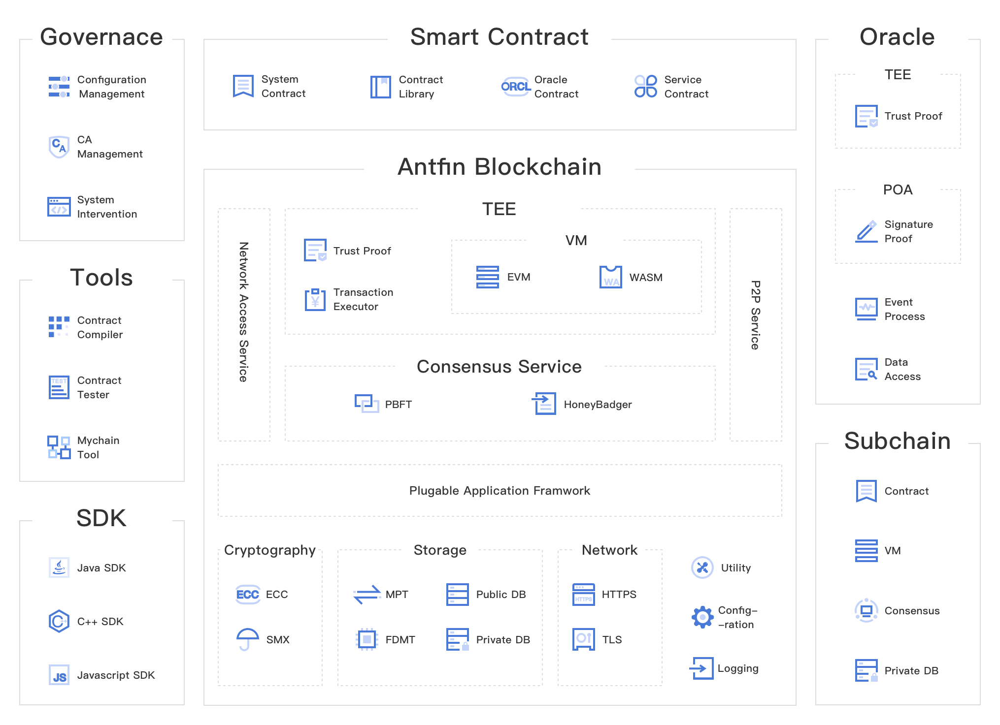
- 核心逻辑

	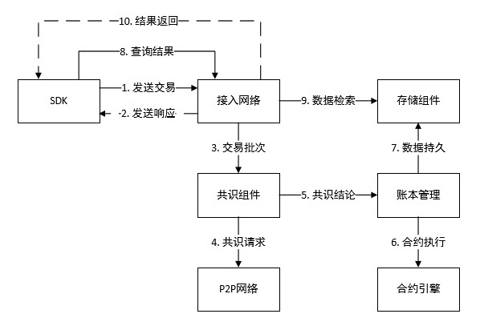
- 技术功能特性
	- 账户模型与状态转换

		蚂蚁链采用的新型账户模型设计能够支持多重签名机制与私钥恢复机制，从而解决了账户控制权重问题与单一私钥丢失导致账户不可用的问题。

		出于安全性考虑，蚂蚁链基于密码学与链式结构，通过签名机制实现交易数据的不可篡改性和不可伪造性。
	- 智能合约

		智能合约实质上是一套以数字形式定义的承诺（Promises），包括合约参与方可以在上面执行这些承诺的协议。蚂蚁链基于此定义设计了自己的智能合约平台，支持智能合约的拓展能力，能够基于智能合约编写图灵完备的业务逻辑来实现丰富的业务场景。
		
		- 合约生命周期

			蚂蚁链中，一份智能合约的典型的生命周期覆盖合约编写、合约编译、合约部署、合约调用、合约升级、合约冻结六个环节。
		- 合约类型

			蚂蚁链提供图灵完备的智能合约能力，目前提供对 EVM、Native、MYVM、Precompiled 合约类型的支持。
			
			其中，MYVM 合约类型，由蚂蚁自研的 MYVM 虚拟机类型支持，以 LLVM（Low Level Virtual Machine）编译模型支持多种合约编程语言（如 Solidity 和 C++），支持更优秀的性能，以及更出色的开发者友好特性。
		- 合约扩展

			蚂蚁链智能合约提供了多种形式的合约扩展能力，包括 RSA 验签、Base64 编解码、上下文获取、JSON & XML 解析等。
	- 存储设计

		蚂蚁链具备以下存储能力：

		- 数据存储

			数据存储分为
			
			- 本地文件系统的 KV 数据库存储
			- 以及上层的抽象世界状态数据存储

			蚂蚁区块链智能合约平台的对象存储利用特定的树状数据结构存储数据来达到全局状态快速计算摘要。
		- 世界状态存储

			蚂蚁链中，合约对象分为
			
			- 成员变量
			
				成员变量存储在合约状态（Storage）中
			- 成员函数

				成员函数存储在合约代码（Code）中。
			
			合约代码与合约状态数据分离，为合约状态以及世界状态提供了唯一稳态 Hash 值的计算，同时支持树上节点快速索引、更新。
		- 历史数据

			蚂蚁链中，不同的区块拥有不同的全局状态根哈希。根据不同区块和不同的全局状态根哈希，可以构造出不同的全局状态历史树，进而查询到不同历史状态下的数据。
	- 共识协议

		在蚂蚁链中，共识协议被定义成使分布式系统中的节点快速有效地达成数据的一致性，即确保所有诚实节点以完全相同的顺序执行共识结论中交易，达成数据一致性，同时正确的客户端发送的有效交易请求最终会被处理和应答。

		蚂蚁链平台的共识组件通过提供不同的共识插件来实现共识协议。目前，蚂蚁链系统中已实现的共识算法包括 PBFT 和 HoneyBadgerBFT。

		- PBFT（Practical Byzantine Fault Tolerance）共识协议支持系统中不超过 1/3 的节点容错性。通过 
			- PrePrepare
			- Prepare
			- Commit

			三阶段提交协议来实现网络共识节点之间的交易数据的一致性。蚂蚁链提供的 PBFT 共识插件具有快速终止、恢复可靠、状态同步等特性。
		- HoneyBadgerBFT 是一个满足拜占庭要求的异步共识协议，具备无主节点、异步交互、支持较大节点规模、拜占庭容错等优势，但实现复杂程度较高。具体而言，蚂蚁链的 HoneyBadgerBFT 共识插件可以有效地降低网络带宽负载，以及防止选择性共识问题。
	- 虚拟机

		虚拟机的职责是在特定的执行环境下通过一组指定的字节码指令来指定蚂蚁链状态机抽象模型的全局状态的更改方式。

		除蚂蚁金服自主研发的类 EVM 虚拟机插件，蚂蚁链还提供 MYVM、Native 虚拟机插件。EVM 虚拟机插件支持流行的 Solidity 合约语言；MYVM 虚拟机插件以 LLVM 编译模型支持多种合约编程语言。
	- 安全机制

		蚂蚁链的安全机制主要分为网络安全、数据安全、存储安全三个维度。

		- 网络安全

			客户端和节点通过 CA 中心获取 TLS 证书，客户端与节点、节点与节点间实行 TLS 双向认证，且通信流量经 TLS 加密，抵御中间人攻击。除了基本的证书验证外，节点与节点之间还增加了握手逻辑，通过在握手过程中添加验证对方节点私钥签名的方式来确保节点间通信的可靠。
		- 数据安全

			交易使用用户私钥签名，保证交易内容无法篡改。
		- 存储安全

			数据多节点存储，单节点数据丢失不影响整个网络，节点间数据同步机制保障数据的正确复制，提供数据归档工具，可以归档数据并使用传统方式备份。
	- 可信执行环境与跨链技术

		蚂蚁链基于硬件可信执行环境（TEE）提供强隐私和高性能的链上数据隐私保护服务，可以对敏感交易数据提供全链路、全生命周期的隐私保护。

		蚂蚁链的跨链技术包括三个组成部分：
		
		- UDAG 跨链协议
		- 跨链合约服务
		- 基于 TEE 的 Oracle 集群服务。

		蚂蚁链使用可信计算环境打造可以外部数据调用的 Oracle 集群，解决区块链协议只能访问链上数据的局限性问题。
	- 信任构建与系统治理

		蚂蚁链联盟的信任构建机制主要有创世信任、基础信任、共识信任、输入信任、治理信任、可验证信任。这些信任构建机制共同建立了蚂蚁链联盟的高度可信任的特征。

	蚂蚁链提供联盟管理能力，即对具体区块链联盟的成员结构的治理能力。

## TEE 合约介绍
### 需求
金融领域区块链隐私保护至少具备以下四方面的能力：

- 全生命周期的保护

	合约和交易的内容、执行过程中状态以及执行结果都可能涉及企业的商业信息，隐私保护应该包括数据全生命周期的机密性。
- 全网范围保护

	隐私保护技术的引入不能打破区块链原有的共识信任模型，即全网（或一定数量的子集）节点应该具有独立验证隐私数据相关交易的能力。
- 灵活支持复杂隐私模型

	隐私模型的灵活度和复杂度，即在复杂多变的金融应用场景中，隐私模型的定义要足够灵活，能够动态更新以适应需求变化。
- 高性能的保护

	隐私保护技术的引入必须兼顾平台的性能
	
### 技术架构
TEE 合约链架构在蚂蚁链合约平台之上，作为核心组件提供通用高效的隐私保护能力。在蚂蚁链平台通用框架下，TEE 合约链利用 TEE 技术将合约引擎和必要的交易处理以及密码学运算单元集成封装在“TEE 安全区”内，配合一系列严谨的安全协议流程达到隐私保护的目的。该架构充分利用蚂蚁链平台已有的功能特性，最大限度增加了 TEE 合约链与已有蚂蚁链平台的兼容性，方便用户开发使用具有隐私保护能力的区块链应用。同时最小化安全可信基，符合安全技术方案设计的原则。

下面是 TEE 合约链与蚂蚁链平台结合的总体框架图：

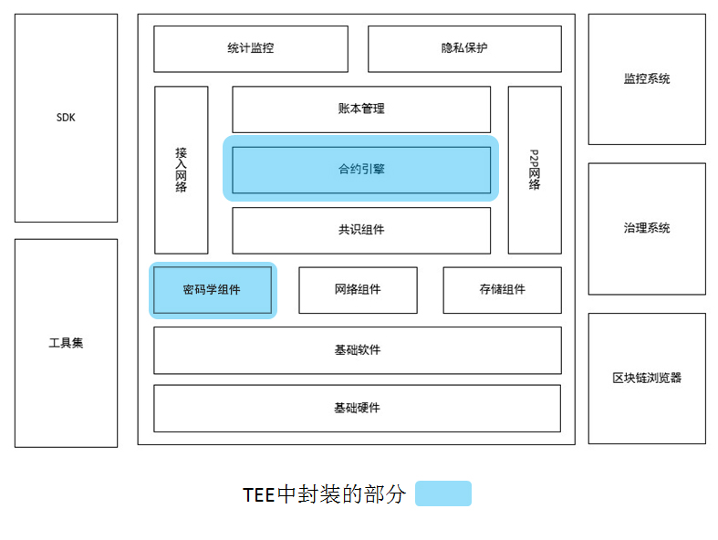

- 区块链的隐私保护体现在对交易全生命周期的保护，需要保护交易本身、合约代码、全局状态数据以及交易回执。
- 在 TEE 合约链中，交易分为隐私交易和明文交易。明文交易即无需隐私保护的交易，其执行过程与现有蚂蚁链平台一致；隐私交易是利用密码学技术进行保护的交易，交易内容只有在 TEE 内才安全可见，其执行过程中产生的全局状态数据以及交易回执均采用密码学技术进行加密保护。
- 在 TEE 合约链中，合约分为隐私合约和明文合约。隐私合约的代码和相应的数据加密存储，仅在 TEE 内部解密执行，相应的回执和状态均加密存储于外部数据库。

下图对比蚂蚁链合约平台和 TEE 合约链的交易处理流程：

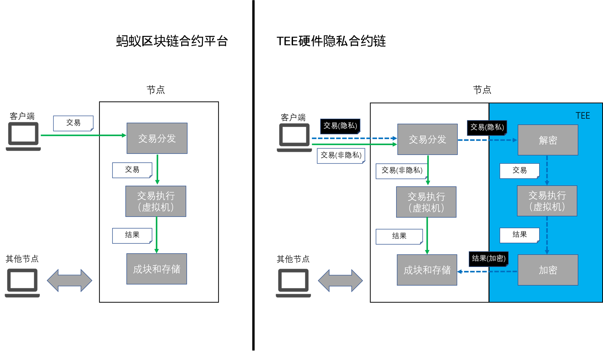

### 功能特性
- 交易与合约类型定义
	- 明文交易 v.s. 隐私交易
		- 明文交易指的是公开的、未启用隐私保护的区块链交易。交易内容以明文发送至区块链节点运行且明文记录；
		- 隐私交易指的是启用隐私保护的交易，交易内容加密发送至节点，在 TEE 中运行并加密记录于区块中。隐私交易默认对发送者以外的人不可见。
	- 明文合约 v.s. 隐私合约
		- 明文合约是通过明文交易部署的合约，合约执行过程中的全局状态明文存储于区块链节点本地数据库，调用接口完全开放；
		- 隐私合约是启用隐私保护的合约，通过隐私交易发起部署，合约执行过程在 TEE 中，所有的全局状态均加密存储，调用接口有限开放。
- 支持多种隐私操作
	- 合约操作
		- 隐私合约部署
		- 隐私合约调用
		- 保护合约调用（直接调用和代理调用均支持）
		- 隐私合约升级
	- 查询
		- 隐私链上数据存储查询（全局状态、交易、回执、日志）
- 交易隐私

	TEE 合约链支持加密交易发送，保护交易全生命周期的隐私性，包括：

	- 交易在客户端完成数字信封加密，发送至节点过程中通过 SSL/TLS 信道保护，到达节点后交由 TEE 处理。
	- 隐私交易进入 TEE 后进行相应的解密操作，完成必要的检查后开始执行。
	- 执行完成后所有合约状态加密存储，并生成加密回执。
	- 交易发送者通过客户端 SDK 提供的接口完成回执解密
-  通用高效

	TEE 由 CPU 硬件提供保护：

	- 具有高度安全隔离和可证明特性。
	- 支持通用 CPU 指令，支持各类合约虚拟机指令操作。
	- 高效利用 CPU 特有指令集对包括加解密算法的操作进行通用加速。
- 权限控制
	
	TEE 合约链支持用户自定义隐私权限控制：

	- 合约编写者根据需求指定合约调用、查询权限保证数据隐私完全自主可控。
	- 权限控制模型支持合约层面的灵活定制和无缝升级。
- 安全易管

	金融级别的密钥管理体系——根据需求可以灵活配置和管理

### 使用场景
TEE 合约链适用于以下任意场景：

- 需要隐私保护的合约逻辑复杂。
- 隐私模型本身复杂，需要灵活定制和动态更新。
- 对隐私保护有较高的性能要求。
- 隐私方案需要对开发者透明友好，不需要深入的密码学基础。
- 已有业务向隐私保护模型迁移时需要对应用层透明。
- 目前已应用在供应链金融、IoT等业务场景应用，总体日均交易量600万.

### 注意事项
TEE 合约链最大限度的保持了与蚂蚁链平台的兼容性，但不可避免的需要引入一些特殊特性来完成全生命周期的交易隐私保护。TEE 合约链提供相应的客户端 SDK，为您提供简洁一致的隐私交易构造接口。在使用 SDK 进行应用开发的过程中，需注意以下三个事项：

- 交易根密钥

	用户需保管好自己的交易根密钥，且根密钥切勿随意导出分享。
- 节点 RSA 公钥

	可公开下载 TEE 合约链节点 RSA 公钥，用户需下载该公钥提供给 SDK 相应接口用于生成隐私交易。用户可以同时下载TEE合约链的节点认证报告，通过报告中的 RSA 公钥哈希值确保所使用的RSA公钥的完整性。
- 隐私权限模型

	TEE 合约链配合用户隐私权限模型达到隐私保护的目的。安全合理的隐私权限模型是整个隐私保护的基础，需要由用户严格定义。
	
## [应用场景](https://antchain.antgroup.com/docs/11/73830)
## [基础术语](https://antchain.antgroup.com/docs/11/73832)
## [购买指南](https://antchain.antgroup.com/docs/11/73840)
### 服务开通
区块链 BaaS 服务免费开通，但使用服务期间，您可能需要购买区块链。

加入蚂蚁区块链平台后，即可登录[控制台](https://admin.antchain.antgroup.com/index#/aciamweb/dashboard)，点击 产品与服务 > 区块链 > BaaS 平台 开始使用服务。

- 产品版本
	- 免费体验链
		- 公共体验链
		- 免费
	- 专业版
		- 专属联盟链
		- 收费 10w/1年
		- 客服 5*8 工单
		- 环境
			- 测试无
			- 生产默认 4个节点、4C/8G/1T 带宽10GB/天
			- 可升级企业
			- 专业版不支持
				- 不支持添加节点
				- 不支持磁盘扩容
				- 不支持数据导出服务
				- 不支持浏览器业务视图
				- 不支持子链功能
	- 企业版
		- 专属联盟链
		- 收费 50w/1年
		- 客服 `5*8` 工单+ `7*24` 小时电话
		- 环境
			- 测试单节点
			- 生产默认 4个节点、12C24G6T 带宽10GB/天
			- 可升级企业
	- TEE安全版(无需求)
		- 60w/1年 
		           
## [试用体验链流程](https://antchain.antgroup.com/docs/11/147534)
## 快速开始建立自己的联盟链
## 用户指南
### 管理联盟
### 管理联盟机构
### 管理区块链主链
### 管理区块链子链
### 管理合约工程
### 管理联盟应用
### 管理平台应用
## 应用开发
### 简介
- 开发框架图
	
	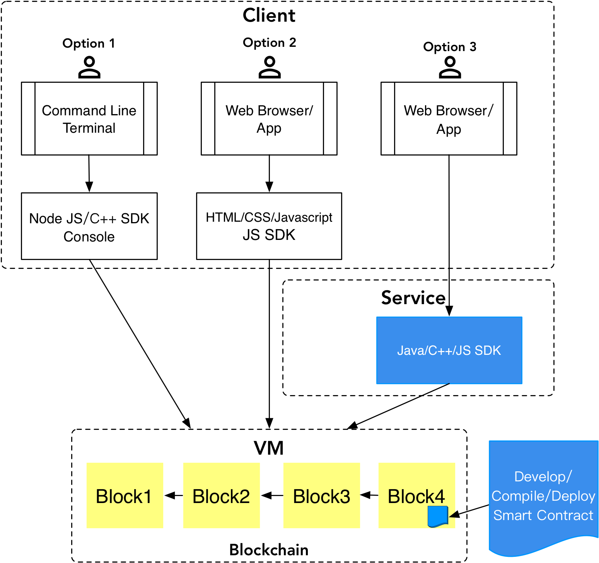
- 基于蚂蚁区块链开发应用时，您可以有以下 3 种选择：
	- 选项 1：通过 SDK 在命令行与蚂蚁区块链交互。
	- 选项 2：通过 Web 应用（Client）集成 SDK 直接与蚂蚁区块链交互。该方式让客户端直接访问区块链平台，去掉了中间的后端服务，更加透明，比较适合轻量级的合约调用、查询等操作。
	- 选项 3：与传统 Web 应用开发相似，访问后端服务（Service），后端服务集成 SDK 后与蚂蚁区块链交互。该方式适合与传统的业务系统相结合，在后端服务层实现一些比较重要的业务逻辑和计算任务。
	
	在实际操作中，选项 2 和 3 比较常用，您可以根据具体应用场景进行选择。

### 工具和 SDK 选择
为提高基于蚂蚁区块链的开发效率，BaaS 平台提供了辅助开发工具和多语言的 SDK 支持。

### Cloud IDE 合约开发环境
Cloud IDE 是一个在线的合约开发环境，此工具提供以下功能：

- 合约编辑与编译，展示编译结果字节码和接口说明（ABI）。
- 合约的部署和调用；提供默认体验链环境和测试账户，用来部署和调用合约。
- 解析合约方法的返回值、事件日志等，辅助调试合约；保存合约到 BaaS 合约管理。

更多 Cloud IDE 相关信息，参见 [Cloud IDE 合约开发环境](https://antchain.antgroup.com/docs/11/101785#) 相关文档。

### [多语言 SDK](https://antchain.antgroup.com/docs/11/145036)
蚂蚁区块链提供多语言 SDK 支持，包括：

- Java
- C ++
- Java Script

### Rest 开发指南
#### 获取身份
链上获取AccessKey和Access-ID信息，在调用 BaaS REST 接口时需要用到该获取的信息。
#### 获取并查看 REST 身份
BaaS REST 默认已开通权限，您可以直接在链上获取 AccessKey 和 Access-ID 信息，用于REST网关接入，具体步骤如下。

- 登录BaaS平台控制台，单击我的联盟，进入联盟后，选择目标联盟链。
- 单击目标联盟链上的 开发组件与证书 > 获取REST身份，即可弹出下载AccessKey的弹窗。
- 在弹窗中，单击下载，可以获取AK签名密钥对

		AccessKey下载后，无法二次获取，若不慎丢失，请参见下方重置REST身份重置REST身份，以获取新的AccessKey。
- 查看Access-ID。

	下载AccessKey后，您可以单击开发组件与证书 > 查看REST身份，进入Access-ID信息展示界面
- 重置REST身份

	如果密钥不慎丢失，您可以选择更多 > 重置REST身份进行重置。重置后，您可以在获取REST身份的弹窗中，单击下载获取新的AccessKey。

#### [SDK 参考](https://antchain.antgroup.com/docs/11/201541)只支持 java
#### API 参考
- API 试用说明
	
	使用BaaS REST服务时，需要先开通访问权限，然后将获得的AK签名密钥对和Access-ID，用以获取访问令牌，之后才能正常调用BaaS Rest接口。
	
	- 开通访问权限

		BaaS REST服务，需要开通访问权限后才能使用，开通后，您可以获得如下信息：

		- AK签名密钥对
		- AK ID

		关于如何开通BaaS REST服务并获取AK签名密钥对和Access-ID的方法，请参见[开通访问权限](https://antchain.antgroup.com/docs/11/204700#)章节。
	- 获取访问令牌

		您在使用BaaS REST时，首先要通过数字签名验证身份，获取访问令牌，后续请求中通过该访问令牌验证访问授权。

		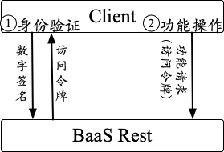
		
		验证身份时，用户使用 AK 私钥签名，BaaS REST 通过对应公钥验证签名，具体算法是 Sha256WithRSA 摘要算法，RSA 签名算法，签名内容是 Access-ID 和时间戳。

		为进一步保障安全，验证身份时会验证签名时效，获取的访问令牌也有使用时效。
	- 获取访问令牌接口
		- 基本信息
			- 功能说明：租户通过签名验证接入AK，获取访问令牌
			- Content-Type：application/json;charset=UTF-8
			- Http Method：POST
			- Request Path：/api/contract/shakeHand
		- 请求参数

			 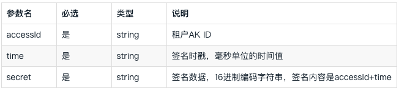
		- 返回参数

			 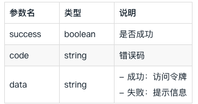
- API 概览
	- [区块链查询接口](https://antchain.antgroup.com/docs/11/202217)
	- [密钥托管运维接口](https://antchain.antgroup.com/docs/11/202252)
	- [密钥托管交易接口](https://antchain.antgroup.com/docs/11/202280)

#### Solidity 合约开发
- 蚂蚁链 Solidity vs. 以太坊 Solidity
	- 蚂蚁链平台中，solidity 合约使用 identity 替代官方 solidity 的 address 关键字。identity 表示的合约地址或账户地址，均为为32字节，而官方 solidity 中 address 表示的地址是20字节。
	- 蚂蚁链合约不支持 suicide，也不支持 selfdestruct。
	- 蚂蚁链合约不支持在合约内创建合约，因此不要在合约内使用 new 来创建合约。
	- 在蚂蚁链平台上，如果尝试在合约内向一个不存在的地址转账，合约会异常终止，并返回错误码 10303；而在以太坊官方 Solidity 合约内向不存在的地址转账时，系统会自动以该地址创建账户。
	- 对于 `<identity>.balance (uint256)` 语句，如果 identity 代表的账户不存在，则在蚂蚁链平台中该语句会造成合约异常终止，并返回错误码 10300；而在以太坊官方 Solidity 合约中，该语句会返回 0，不会造成合约异常终止。
	- 在蚂蚁链平台中，合约内的 block.number、block.timestamp 分别指最新已形成的区块（即本交易所在区块的上一个区块）的高度和时间戳（毫秒）；而在官方 Solidity 合约中，这两个参数分别指的是本交易所在区块的高度和时间戳。
	- 蚂蚁链平台不提供 ripemd160 这个散列算法。
	- 蚂蚁链平台中，solidity 合约内不支持 CHAINID 指令
	- 蚂蚁链平台中，如果 solidity 合约执行过程中异常终止，终止之前产生的 Event Log 依然会出现在交易回执中。
- [Solidity 积分 demo](https://antchain.antgroup.com/docs/11/101920)
- [Solidity 合约编译工具](https://antchain.antgroup.com/docs/11/101793)
- [合约数据类型](https://antchain.antgroup.com/docs/11/101967)
- [合约关键字](https://antchain.antgroup.com/docs/11/101968)
- 函数参考
	- [函数相关](https://antchain.antgroup.com/docs/11/101970)
- [住房积分系统 demo](https://antchain.antgroup.com/docs/11/110277) 

#### C++ 合约开发(暂时不考虑)
蚂蚁区块链智能合约平台基于 WebAssembly 开发，提供一套基于 C99/C++14 标准的 C++ 语言子集作为合约语言。合约开发者通过编译工具（mychain.mycdt）将合约代码编译成 wasm 字节码，由合约平台区块链节点对 wasm 字节码进行解释执行。
#### go 合约开发(暂时不考虑)
蚂蚁链通用智能合约平台（简称：蚂蚁链合约平台）提供了 Go 语言到 WebAssembly（简称 wasm）的编译工具链。开发者可以使用 Go 语言编写智能合约，然后编译成 wasm 字节码部署到蚂蚁链合约平台上。
#### Cloud IDE 说明+[使用](https://antchain.antgroup.com/docs/11/101800)
Cloud IDE 合约开发环境（以下简称“IDE”）是 BaaS 合约平台提供的在线合约开发工具。

说明：使用智能合约开发功能，应具有合理性与合规性，符合相关监管规则和要求，严禁将合约开发用于发代币等不法行为上。

- 核心功能

	IDE 为智能合约开发提供简单、高效的集成环境，并提供以下核心功能：

	- 合约工程管理：管理工程目录和文件，提供文件编辑自动保存功能，保存合约到 BaaS 合约管理。
	- 合约编辑与编译：展示编译结果字节码和接口说明（ABI）。
	- 合约的部署和调用：提供默认合约体验链环境和测试账户，用来部署和调用合约。
	- 自动编解码：解析合约方法的返回值、事件日志等，辅助合约测试。
	- 合约单步调试：当前支持 Solidity 合约的单步调试功能，可单步执行，查看临时变量、合约存储、堆栈、内存等信息来深度调试合约。
	- 合约单元测试：当前支持 Solidity 合约的单元测试，可直接使用 Solidity 语言编写单元测试用例，一键执行所有测试用例。
	- 合约分析：在编译合约的同时对 Solidity 合约进行静态扫描分析，给出分析结果参考。				 	 
	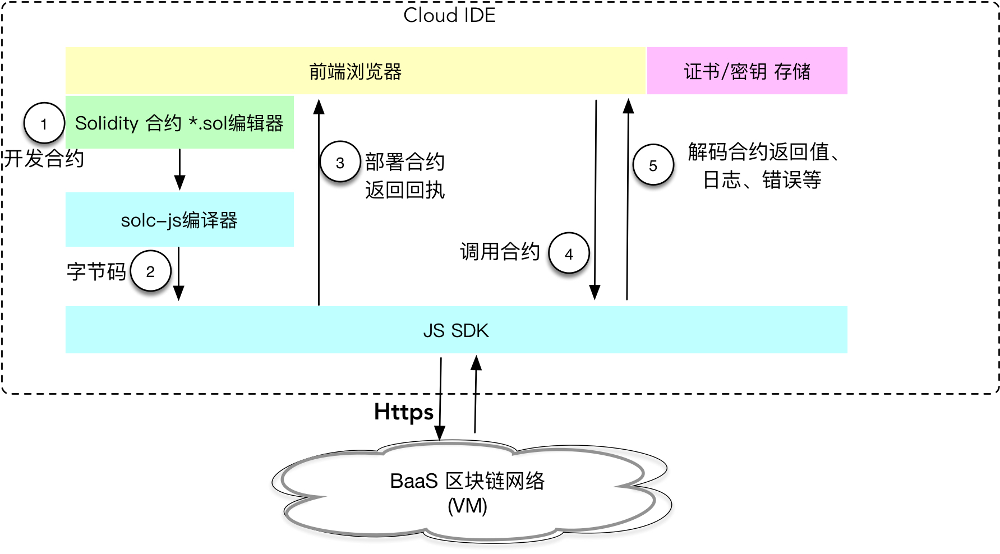	

#### TEE 合约链开发(暂时不考虑)
TEE 合约链遵循蚂蚁区块链合约平台的合约开发规范，详见 Solidity 合约开发 相关文档。
#### [离线合约开发工具](https://antchain.antgroup.com/docs/11/137929)
离线合约开发的脚手架工具通过简单命令完成合约编译、部署、发布，并支持单元测试框架，提高合约的开发、测试效率。
#### 外部数据源服务概述
外部数据源服务在区块链上部署了区块链预言机（Oracle）合约，提供异步查询互联网数据接口（CURL）供用户合约使用。正常情况下，用户合约调用预言机合约发起查询请求后，预言机合约在 1~3 个区块内就能得到外部数据源服务取回的数据，然后回调用户合约传入数据。

- 实现原理

	外部数据源服务使用 TEE （Trusted Execution Environment，TEE） 技术实现，对于每笔外部数据请求都将在可信硬件环境中执行。可信硬件环境会验证外部数据源的 TLS 通讯证书以确认数据源的身份，通过 TLS 协议确保拿到的数据没有被第三方篡改。可信硬件环境得到数据后，会使用硬件私钥对数据进行签名，并返回给智能合约，智能合约将自动验证可信硬件的签名，确保数据是可信硬件执行结果，没有被第三方篡改，从而安全可靠地获取来自指定外部数据源的数据。
	
	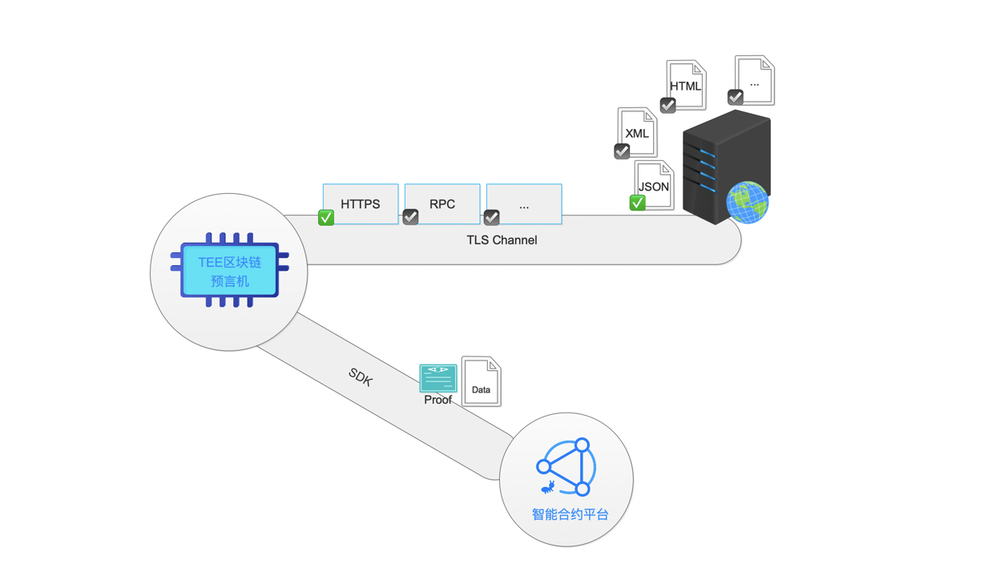
- 使用场景

	外部数据源服务适用于以下任意场景：

	- 智能合约需要可信访问 Web 数据。
	- 智能合约通过调用 Open API 使用互联网服务。
	- 智能合约需要与外部系统交互。
	- 智能合约依赖公共现实事件，如天气、赛事信息、航班信息等。
- 功能特性
	- 数据安全可信

		区块链预言机底层使用 TEE 技术实现，TEE 是一个安全隔离的执行环境，提供隔离执行、可信应用的完整性、可信数据的机密性、安全存储等安全特征，使预言机服务数据服务安全可信。
	- 支持 HTTPS 协议

		通过 HTTPS 协议，区块链预言机会与目标数据源建立端到端的安全通行通道，并且可以完成对数据源的证书校验以确定身份，从而安全、可靠地获取来自指定外部数据源的数据。
	- 支持 JSON API

		JSON 是一种轻量级的数据交换格式，广泛地被采用为 API 的数据交换格式。区块链预言机内置 JSON 解析器，如果请求的 URL 响应格式是 JSON 格式，可以在请求命令中设置 jsonpath 命令，使区块链预言机根据 jsonpath 读取部分 JSON 数据，只返回这部分数据上链。
	- 支持访问要权限认证的 API

		一些 API 需要认证授权访问，例如使用 OAuth 2.0 协议实现的 API，需要在请求中携带服务端认证鉴权需要的参数，但这些参数属于私密信息不可泄露。这种情况下，利用 TEE 技术提供的机密性，与区块链预言机的 TEE 环境建立端到端的加密信封，使得请求只在 TEE 硬件可信执行环境里面解密，从而不会泄露请求机密。
	- 高可用预言机集群

	区块链预言机服务使用集群架构实现，为合约提供高可用的数据访问服务。

#### [外部数据源服务开发说明](https://antchain.antgroup.com/docs/11/108801)
#### [跨链服务开发指南](https://antchain.antgroup.com/docs/11/138152)
蚂蚁链跨链数据连接服务是面向智能合约提供的链上数据服务，本服务在客户区块链环境中部署跨链服务合约/链码，并且提供 API 接口供用户合约/链码进行调用。跨链数据连接服务目前提供 账本数据访问 和 合约消息推送 两类服务及其对应的 API 接口。账本数据访问服务可以帮助用户智能合约获取其他区块链账本上的数据，包括但不限于区块头，完整区块、交易等。合约消息推送服务可以帮助部署了跨链数据服务的不同区块链上的智能合约进行消息通信，满足跨链业务关联处理等场景。

- 账本数据访问服务

	目前，账本数据访问服务仅支持蚂蚁区块链合约访问蚂蚁区块链账本数据，同时支持 Solidity 和 C++ 语言开发的智能合约。
- Solidity 合约开发流程

	用户智能合约使用账本数据访问 API 接口，开发流程如下：

	- 在 Baas 平台上获取账本数据合约名称。
	- 获取账本数据访问 API 接口定义（ChainDataInterface.sol，见 API [接口定义](https://antchain.antgroup.com/docs/11/138152#3) 章节）。
	- 在用户合约中引入账本数据访问 API 定义。
	- 用户合约实现回调接口，用于异步接收账本数据回调使用。
	- 用户合约构建账本数据访问请求(ChainDataCmdHelper.sol)。
	- 用户合约向账本数据合约发送请求，具体参考 [API 使用示例](https://antchain.antgroup.com/docs/11/138152#4)。
	- 账本数据服务返回数据为 JSON 格式，具体格式参考 [账本数据结构](https://antchain.antgroup.com/docs/11/138152#%E8%B4%A6%E6%9C%AC%E6%95%B0%E6%8D%AE%E7%BB%93%E6%9E%84) 部分。
- API 使用流程

	用户合约调用账本数据合约的账本数据访问接口发起查询请求，账本数据合约同步返回查询请求句柄，即请求单据号（reqeust_id）。
账本数据合约获取到查询结果数据后，异步回调用户合约的回调接口。
- API 接口定义

	ChainDataInterface.sol 中定义了账本数据合约提供的账本数据访问接口，用户通过调用账本数据合约 ChainDataRequest 接口发送请求。用户合约需要实现 ChainDataCallbackResponse 接口，用于接收账本数据合约的查询账本数据结果。
- API 参数说明

	账本数据访问接口需要用户指定要访问的区块链域名、资源类型和资源 ID，以及对于资源数据的加工处理。			
### 大文件上链方案
#### 方案简介
随着业务的发展，越来越多的客户诉求集中到文件上链。目前有两种方案：

- 方案一为文件内容直接上链，这样生成的交易内容较大，包含交易的区块大小增长较快，随着业务量增加，对蚂蚁链的网络和存储带来较大的压力；
- 方案二为文件内容hash上链，具体方案为将文件存储在对象存储服务器上，将文件内容 hash 以及相关信息上链，上链信息较小，针对大数据量和高并发场景。

方案二更优，当查询链上文件信息时，校验链上文件内容 hash 与对象存储服务器上文件内容 hash 是否一致，来确认文件内容是否被篡改。这种方式可极大避免对区块链产品的网络和存储压力，同时也能保证对文件内容的可信与可验证。该方案将作为 BaaS 产品（金融科技BaaS和阿里云BaaS MyChain）的最佳实践，以示例程序（Java为主）和产品文档的方式提供给用您。

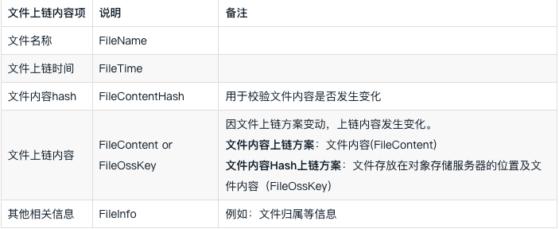

#### 运行应用
应用运行的过程主要分为以下4个步骤。

- 准备环境
	- 准备SSL连接文件和账户私钥文件。
	
		要与BaaS平台建立SSL连接，您需准备以下四个文件，其中账户的私钥文件在提交交易时使用。
	
		- CA 机构的根证书（trustCa）
		- 客户端的证书文件（client.crt）
		- 客户端的私钥文件（client.key）
		- 账户的私钥文件（user.key）文件的详细说明如下表所示，您也可以参考合约链：[本地生成证书请求和公私钥对查看详情](https://antchain.antgroup.com/docs/11/147534#h2-u672Cu5730u751Fu6210u8BC1u4E66u8BF7u6C42u548Cu516Cu79C1u94A5u5BF93)。

		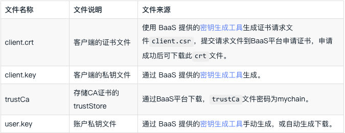
	- 查看合约链的节点信息。

		要与合约链交互，您需要获取链节点的IP地址和端口号。在BaaS平台，通过查看目标合约链详情，在区块浏览器中查看节点详情，可获取链节点的IP地址和端口号。
- 编写应用
	- 使用Intellij IDEA创建一个基于Maven构建的空项目，例如：FileDemoTest。创建完成后，项目目录结构应如下图所示。
	- 在 java 目录创建自定义包名，例如：com.example.demo，并将 FileDemoSample.java（单击下载FileDemoSample.java文件、FileHashDemoSample.java文件）中的内容完整拷贝至创建的包中，并将配置SDK必须使用的client.crt、client.key、trustCa及user.key文件放入到resources目录中，其中上链文件为one.txt
	- 在pom.xml中添加依赖。

		将SDK与项目使用的依赖引入到pom.xml，并在resources中添加log4j的配置文件。 
- 文件内容上链
	- 文件内容上链

		在项目根路径运行mvn clean compile执行项目编译
	- 流程
		- 初始化环境

				//step 1: init logger.
				initLogger();
				 
				//step 2:init mychain env.
				env = initMychainEnv(); 
		- 发起存证

				//step 3: 文件内容上链
				FileToChain fileToChain = depositData();
		- 文件验证

				//step 4: 文件上链校验
				if (fileToChain != null) {
				 fileVerify(fileToChain.fileToChainHash);
				}
		- 关闭 sdk

				//step 5 : sdk shut down
				sdk.shutDown();				
- 文件内容 hash 上链

	对象存储服务相关配置如下。
	
	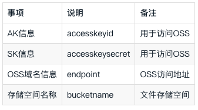
	
	在项目根路径运行mvn clean compile执行项目编译。
	
	- 初始化环境

				//step 1: init logger.
				initLogger();
				 
				//step 2:init mychain env.
				env = initMychainEnv(); 
		- 发起存证

				//step 3: 文件上传OSS，文件hash上链
				FileToChain fileToChain = depositData();
		- 文件验证

				//step 4: 文件上链校验
				if (fileToChain != null) {
					fileVerify(fileToChain.fileOssKey, fileToChain.fileToChainHash);
					}
		- 关闭 sdk

				//step 5 : sdk shut down
				sdk.shutDown();		

### [错误码](https://antchain.antgroup.com/docs/11/101803#%E5%8A%A0%E5%AF%86%E9%94%99%E8%AF%AF%E7%A0%81)
### [SLA](https://antchain.antgroup.com/docs/11/172046)
### [常见问题等](https://antchain.antgroup.com/docs/11/73997)

		
## [开放联盟链上链实战课程](https://tech.antfin.com/afbu/video/k97uzisa?id=79)

