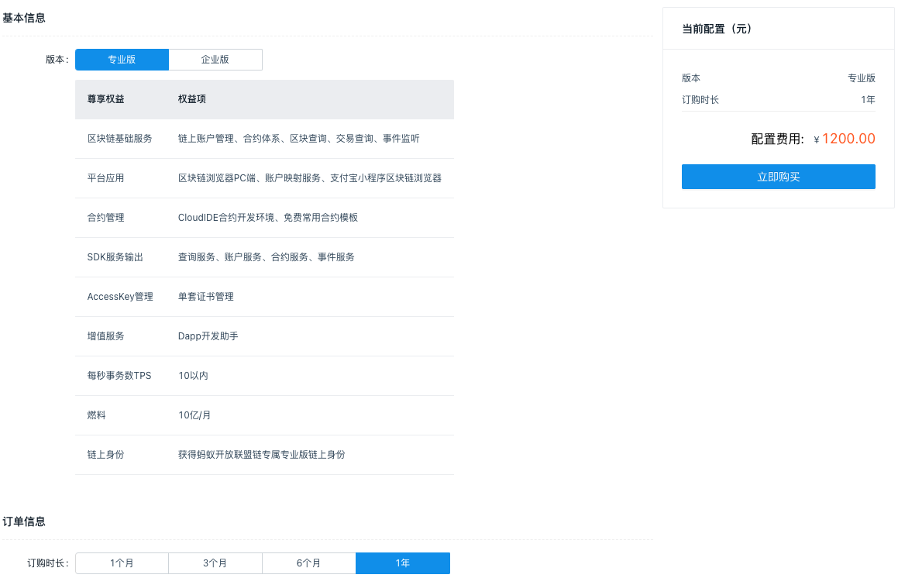
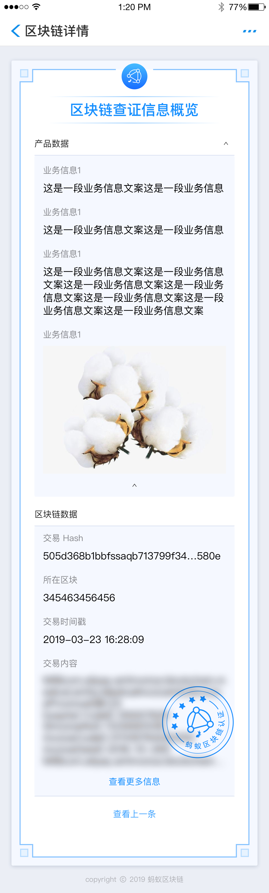

# 蚂蚁链开放联盟链
## 概述
蚂蚁区块链开放联盟链是一个低成本、低门槛开放普惠的区块链服务网络，依赖蚂蚁区块链联盟链强大的技术基础、创新公有许可机制，联合各行业权威节点合作伙伴共同打造。开放联盟链致力于解决现有区块链网络费用高、开发门槛高、无法大规模商用落地等问题。本着生态共建，合作共赢的原则，向广大开发者开放该服务网络，赋能全行业开发者，共建生态繁荣。
## 蚂蚁区块链开放联盟链具备以下功能特性：
- 公有许可机制
	- 面向广大开发者和中小微企业提供服务。
	- 联盟参与方加入需经过许可，权威公正。
	- 无需建链即可享受蚂蚁区块链服务。
- 生态服务共建
	- 联盟用户均可参与服务设计与输出，共享生态收益。
	- 放联盟链提供阿里经济体流量、服务承接。
- 优秀开发工具
	- Cloud IDE 及智能合约开发模板。
	- 多语言 SDK 集成服务。
	- 功能强大、丰富多样的中间件。
- 基础能力强大
	- 支持分布式数字身份。
	- 支持链上统一积分。
	- 提供强大的隐私计算能力。
	- 提供企业身份认证、实人认证、内容安全、金融级风控等能力。

## 区别
### 蚂蚁区块链开放联盟链支持哪些功能？
开放联盟链除了为用户提供区块链基础服务（数据存证、区块和交易查询等），还提供合约管理（CloudIDE 合约开发环境、常用合约模板等）、SDK 服务输出、AccessKey 管理、dApp 开发助手等多种功能，以更好地满足客户不同的业务需求。
### 开放联盟链与蚂蚁区块链 BaaS 有什么区别？
目前行业内主要有三大类区块链，即公链、联盟链，以及介于前两者之间的开放联盟链。
### 公链指的是任何人都可以参与数据读取、共识、存证、交易的区块链服务网络。
联盟链指用户需经过授权才可加入的区块链服务网络，且根据权限不同，在链上可进行的活动也不同。蚂蚁区块链 BaaS 是一种联盟链，它常被用于构建大型行业联盟，具备金融级隐私保护能力，同时实现交易秒级确认。
开放联盟链兼具公链的开放多元特性，以及联盟链的交易高效确认能力。在蚂蚁区块链开放联盟链上，任何通过支付宝认证的个人、企业均可参与，享受低成本、高效率的数据上链、智能合约开发、dApp 开发等功能。
### 开放联盟链能给客户带来什么价值？
蚂蚁区块链开放联盟链本着生态共建、合作共赢的原则，致力于解决现有区块链网络对于中小微企业、组织以及个人来说，费用高、开发门槛高、无法大规模商用落地等问题。 用户可以以低成本，精简的步骤，轻松开通区块链服务，使用数据上链、流转、合约编写、dApp 开发等功能。同时，金融科技将结合阿里经济体丰富的资源，对优秀的标杆场景进行扶持，共建生态繁荣。
## 应用场景
- 商品溯源

	商品溯源是指追踪记录商品从生产到零售的全部环节，它的实现需要产业链上下游各方共同参与。商品溯源属于一种多环节协同的综合性商业行为，集合了 IoT 技术、防伪技术、信息系统与溯源机制。
- 版权保护

	以区块链为核心技术，结合大数据和人工智能等多种先进技术，对生产者和产物的数据进行存储和探索，可以实现所有权的溯源，从而达到保护生产者版权的作用。
- 供应链金融

	将供应链上的核心企业以及与其相关的上下游企业看作一个整体，以核心企业为依托，以真实贸易为前提，运用自偿性贸易融资的方式，对供应链上下游企业提供的综合性金融产品和服务。根据融资担保品的不同，金融机构将供应链金融分为在应收账款类、预付类和存货类融资。

	而区块链的信任传递，能很好解决供应链金融下中小企业缺乏信用的问题，让优质核心企业闲置的银行信用额度传递给中小企业，实现整个链条上信任流通。
- 去中心化游戏

	将区块链技术应用于游戏当中，可以将游戏的所有权下放给所有的玩家，游戏不再受中心组织的控制。游戏交由玩家社区自治，运行机制透明，每一笔交易数据都上链不可篡改，避免了中心组织捏造虚假数据。玩家对自己的资产持有真正的把控权，只要区块链网络存在，玩家的资产就永远不会凭空消失。
- 公益

	区块链可以用提高公益事业的信息透明度，给予捐赠者以良好的反馈。记录其继续捐助，形成良性的循环。如利用区块链技术追踪钱款的来源和流向，对受捐赠者的身份进行确认，建立公益领域的问责机制，从而提升组织效率。
- 保险

	利用区块链技术，将保险产品信息及投保过程、流通过程、营销过程、理赔过程的信息进行整合并写入区块链，实现了全流程追溯、数据在交易各方之间公开透明，以及保险公司、保险机构、监管部门、消费者之间的信任共享，降低各方信息不对称程度，大大提升保险各环节业务效率。
- 电子票据

	传统“智慧医疗”模式下，患者通过网络交费、移动支付后，仍需线下人工打印纸质票据，严重制约了智慧医疗发展，给患者带来不便。而区块链票据模式则可实现非税、应税票据全面电子化，链上化，保证票据信息的真实性、唯一性，大幅提高报销效率。
- 跨境支付

	区块链技术通过分布式账本技术将原来像接力赛一样逐个节点确认传递的汇款模式，改变为业务节点实时同步并行确认，提升了效率，改变了运营模式。在汇出端钱包发起汇款的同时所有参与方同时收到该信息，在完成合规等所需的审核后，区块链上协同各方同时完成这一笔汇款交易。
- 资产数字化

	各类资产，如股权、债券、票据、收益凭证、仓单等均可被整合进区块链中，成为链上数字资产，使得资产所有者无需通过各种中介机构就能直接发起交易。上述功能可以借助于行业基础设施类机构实现，让其扮演托管者的角色，确保资产的真实性与合规性，并在托管库和分布式账本之间搭建一座桥梁，让分布式账本平台能够安全地访问托管库中的可信任资产。
	
## [基础术语](https://antchain.antgroup.com/docs/11/145476)
## [购买指南](https://antchain.antgroup.com/docs/11/143563)
- 专业版
	
	 
- 企业版	

	 

## [快速开始](https://antchain.antgroup.com/docs/11/143566)
## 用户指南
### 合约管理
- 创建合约工程(暂不考虑)

	您可以通过以下两种方式创建合约工程
	
	- 通过合约工程工具创建

		目前，很多存证类的合约的很多功能都有固定的格式代码对应，例如增、删、改、查功能、权限控制功能、日志功能、时间触发器等。因此，蚂蚁区块链开放联盟链提供一套自动化的智能合约代码生成工具，帮助用户通过配置数据表的形式来快速定义和生成合约，提高效率。
		
			目前合约工程工具仅支持创建 C++ 版本的智能合约。
	- 通过合约工程模板创建

		合约工程模板是已经实现某些基本功能的合约工程。您可以利用工程模板提供的基础功能代码，开发符合自己业务逻辑的智能合约。

		开放联盟链提供免费版、专业版、企业版三种类型的合约工程模板。免费版供用户免费使用；专业版和企业版需要付费购买。
		
### 链账户管理
您可以在开放联盟链上创建链账户，并查看所有链上账户列表，包括账户名称、账户地址、创建时间。

- 创建链账户

	进入开放联盟链控制台，点击 链账户管理 > 添加链账户，在 创建账户 窗口中，您可以选择以下密钥和证书生成方式。

	- 自动生成密钥和证书（密钥托管）
		- 选择 自动生成密钥和证书（密钥托管）后，点击 去生成。
		- 创建链上账户。输入账户名称，点击 确定。
		- 下载账户公钥，并记录密钥托管 ID（mykmsKeyId）。 公钥只有一次下载机会，务必妥善保存，离开此页面后不能再找回。
	- 自动生成密钥和证书（密钥非托管）
		- 选择 自动生成密钥和证书（密钥非托管）后，点击 去生成，然后根据页面提示填写相关信息，点击 申请。
		- 下载私钥和证书，然后点击 去创建账户。
		- 填写账户相关信息，点击 创建账户。
		- 下载私钥、公钥对及恢复私钥、恢复公钥对，然后点击 完成。私钥、公钥对和恢复私钥只有一次下载机会，务必妥善保存，离开此页面后不能再找回。
	- 手动生成密钥和证书
		- 选择 手动生成密钥和证书 后，点击 去生成，然后上传本地生成的证书请求文件 client.csr，点击 提交。本地生成私钥 client.key 和证书请求 client.csr 的具体步骤，[参见本文的 本地生成证书请求和公私钥对](https://antchain.antgroup.com/docs/11/147534#%E6%9C%AC%E5%9C%B0%E7%94%9F%E6%88%90%E8%AF%81%E4%B9%A6%E8%AF%B7%E6%B1%82%E5%92%8C%E5%85%AC%E7%A7%81%E9%92%A5%E5%AF%B9)。
		- 在账户创建窗口中，填写账户名称、公钥及恢复公钥，点击 创建账户。本地生成公私钥对和恢复公私钥对的具体步骤，[参见本文的 本地生成证书请求和公私钥对](https://antchain.antgroup.com/docs/11/147534#%E6%9C%AC%E5%9C%B0%E7%94%9F%E6%88%90%E8%AF%81%E4%B9%A6%E8%AF%B7%E6%B1%82%E5%92%8C%E5%85%AC%E7%A7%81%E9%92%A5%E5%AF%B9)。

- 查看链账户信息

	进入开放联盟链控制台，在左侧导航栏点击 链账户管理，您可以在此页面查看各账户信息，并根据账户名称、账户地址、密钥托管 ID（mykmskeyid）、创建时间进行搜索。其中，账户名称、账户地址、mykmskeyid 支关键字模糊匹配查询。 

### 燃料管理
燃料（gas）指智能合约在虚拟机中执行计算和存储的消耗度量，链上交易需要消耗燃料。您可以进行燃料充值、为链上账户分配燃料，并查询各个账户的剩余燃料、燃料收支明细以及分配记录。
#### 燃料充值
为确保机构拥有足够的燃料支撑链上交易，您需要在机构燃料余额不足时，通过购买来补充燃料。

- 进入开放联盟链控制台后，从左侧导航栏点击 燃料管理 进入燃料管理页面。
- 点击 燃料充值 按钮，进入开放联盟链燃料购买页面，选择要购买的燃料数量后，点击 立即购买，根据提示进行付费，完成燃料充值。
- 充值成功后，燃料管理页上的 待分配燃料 数量会发生相应的变化。

#### 分配燃料
为链上账户分配燃料，以防因燃料不足而导致链上交易无法正常进行。

在燃料管理页面上，点击 分配燃料，在燃料分配窗口中，输入接收燃料的账户地址及燃料分配数量后，点击 提交。

燃料分配完成后，燃料管理页上的 待分配燃料 数量会发生相应的变化。
#### 查看燃料收支明细
查看机构下的燃料收支明细。待分配燃料是机构拥有的总燃料，您可以将其分配给链上账户。

在燃料管理页面上，点击 待分配燃料 下的 收支明细 链接查看当前机构的具体燃料收支明细，包括交易类型、交易时间及交易数额。
#### 查询链账户剩余燃料
查询链上账户的剩余燃料，从而对燃料不足的账户及时进行补给。

操作步骤如下：

- 在燃料管理页面上，点击 链账户燃料 标签页查看各个链账户的剩余燃料数量。
- 点击链账户的 操作 列下的 燃料明细 可查看该链账户下的燃料收支明细。

#### 查看燃料分配记录
在燃料管理页面上，点击 分配记录 标签查看各个链账户的燃料分配记录，包括分配人、接受燃料的链账户地址、分配的燃料数量、操作时间。

#### 燃料预警
为保证燃料余额充足，您可以设置燃料预警，当余额小于设定值时，系统会以短信通知您。

在燃料管理页面上，点击页面右上方的 燃料预警 按钮，设置燃料预警的链上账户地址和预警值，然后提交设置。
### 证书和开发组建
您可以通过 证书及开发组件 页面申请、重置 AccessKey 私钥文件，下载开发组件。
#### 申请 AccessKey
在当前租户尚未生成 AccessKey 的情况下，可通过 证书及开发组件 页面申请 AccessKey。

在该页面的 AccessKey 信息管理 区域，点击 立即申请 按钮，然后在创建成功提示框中，查看 access-id 并点击下载相应的 access.key。
#### 重置 AccessKey
对已生成的 AccessKey 私钥证书进行重置。

操作步骤如下：

- 在 证书及开发组件 页面的 AccessKey 信息管理 区域，点击右侧的 重置 链接。
- 在 AccessKey 重置窗口中，输入要接收验证码的邮箱地址，然后点击 获取验证码。
- 前往接收验证码的邮箱地址，查看验证码，并输入获取的验证码，点击 重置 即可。

		注意： 重置 AccessKey 后，您将无法从开放联盟链平台获取之前的证书。

#### 下载开发组件
在 开发组件管理 区域，根据需要选择开发语言，点击右侧的下载图标下载相应的开发组件到本地。目前，开放联盟链支持 Java SDK、Java Demo 工程、C++ Demo 工程下载。
### 小程序有览器服务
蚂蚁区块链浏览器是由蚂蚁区块链提供的一套便于支付宝 C 端用户查看蚂蚁区块链上数据的服务。通过使用该服务，系统将为每条链上交易生成对应二维码，交易二维码展示在开放联盟链控制台交易详情页。使用方还可通过接口获取二维码放置在自己的业务页面。C 端用户可通过支付宝端扫码，进入到 蚂蚁区块链浏览器 小程序端查看相应的交易存证。

本文将介绍如何使用蚂蚁区块链浏览器服务。如有疑问，欢迎进入钉钉群交流：23115110。
#### 交易二维码显示
进入开放联盟链，在总览页的 实时交易情况 区域，点击 查看更多，进入交易列表，找到对应的交易后，进入交易结构详情。如果交易的发起账户、目标账户或者合约创建者在您租户下的账户管理中，则您可以看到二维码。

通过支付宝扫码，就可以查看链上的数据。
#### 定制业务数据展示
可通过使用智能合约自定义展示业务数据，如产品的属性数据。智能合约模板可从 合约市场 获取。目前，金融科技提供 Solitidy 语言和 C++ 语言的合约。

对于有关联关系的交易，合约模板提供了关联上一条交易的能力。开发者配置上一条交易的 hash，C 端用户即可在小程序浏览器页面点击查看上一条 查看到关联交易。

	注意：若没有配置或配置错误（如配成了当前交易），则 查看上一条 按钮不会生效。
#### 蚂蚁区块链浏览器小程序端使用
C 端用户，通过支付宝客户端扫链上交易二维码，或进入 蚂蚁区块链浏览器 小程序，扫链上交易二维码，即可确认交易存证在蚂蚁区块链上，并看到交易内容。区块链基础信息展示如下

 
#### 接口列表
BaaS 平台提供获取交易[二维码的接口](https://apdevcenter.antchain.antgroup.com/console/openapi/product/BAASPLUS/apis/baas.plus.bmpbrowser.transactionqrcode.query/versions/1.0/document?tenantName=FWTENRKF)。调用接口前，请加入钉钉答疑群 23115110，查看群公告提供信息，开通接口调用权限。	