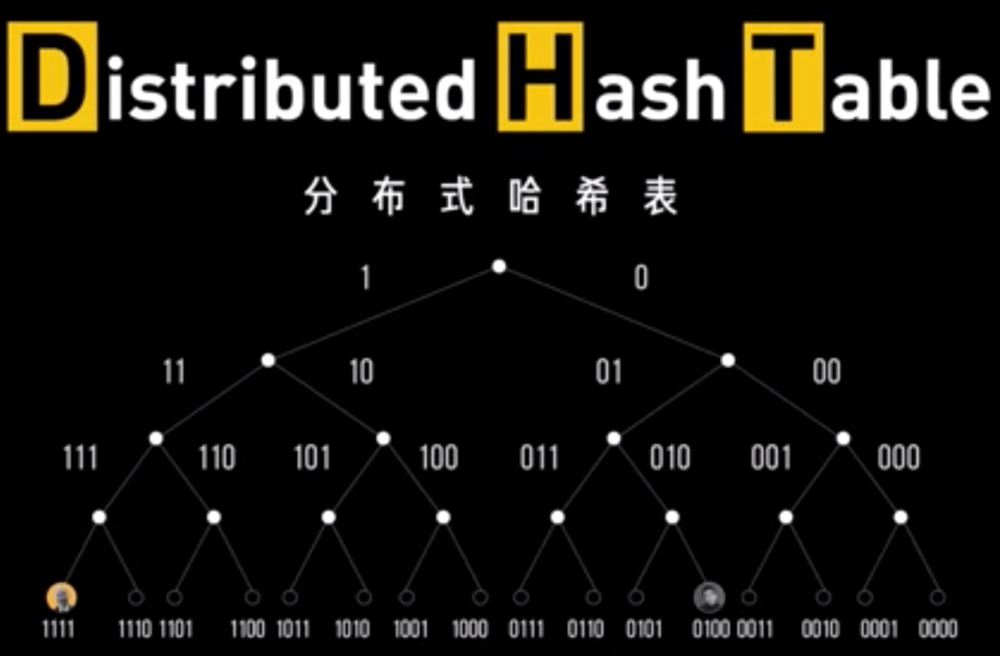
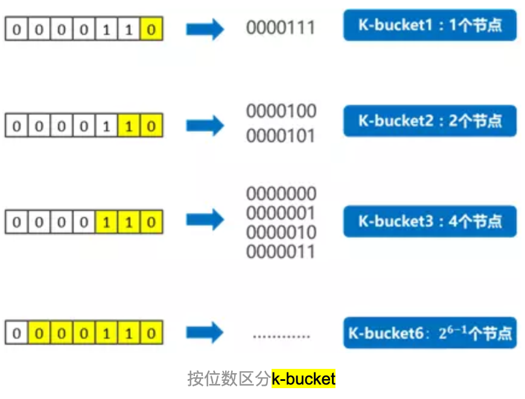
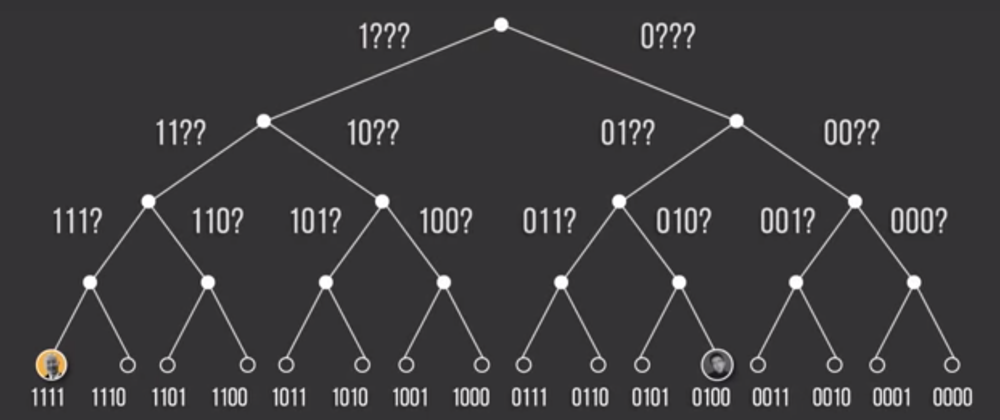
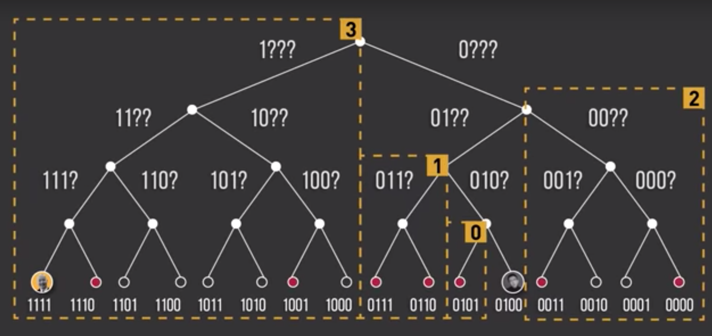
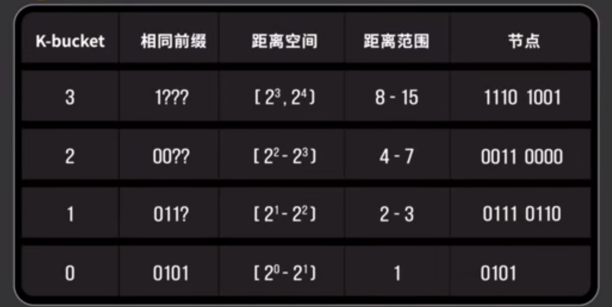
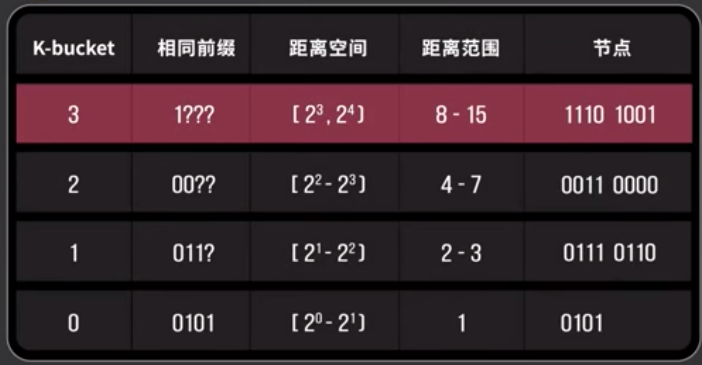

# DHT 算法原理
## 初始解决节点之间相互寻址的方法
### 步骤
- 比如 A 节点链接 10个 已知节点去找B
	-  10个节点并没有b
		- 他们各自又去自己的 10 个已知节点查询
			- 已此循环
			- 最后找到 B 节点
- A 节点连接到 B 节点

### 问题
这样会导致大量的广播，占用大量的额外带宽
## DHT
 
### 什么是 DHT
分布式散列表（英语：distributed hash table，缩写DHT）是分布式计算系统中的一类，用来将一个关键值（key）的集合分散到所有在分布式系统中的节点，并且可以有效地将消息转送到唯一一个拥有查询者提供的关键值的节点（Peers）。这里的节点类似散列表中的存储位置。分布式散列表通常是为了拥有极大节点数量的系统，而且在系统的节点常常会加入或离开（例如网络断线）而设计的。

在一个结构性的延展网络（overlay network）中，参加的节点需要与系统中一小部分的节点沟通，这也需要使用分布式散列表。分布式散列表可以用以创建更复杂的服务，例如分布式文件系统、点对点技术文件分享系统、合作的网页缓存、多播、任播、域名系统以及即时通信等。

简单的说 DHT 是 P2P 网络核心路由算法,主要是利用一致性 hash，把节点和资源都表示成一个 hash 值，放入到这个大的 hash 环中，每个节点负责路由靠近它的资源。

分布式散列表本质上强调以下特性：

- 离散性

	构成系统的节点并没有任何中央式的协调机制。
- 伸缩性

	即使有成千上万个节点，系统仍然应该十分有效率。
- 容错性

	即使节点不断地加入、离开或是停止工作，系统仍然必须达到一定的可靠度。

### 重要概念
1. node(每个客户端都是 DHT 的节点，不管是不是要分享数据)

	负责 P2P 路由信息，P2P 网络的组网就是它来负责 
2. peer(分发资源的节点)

	负责管理资源，生成种子文件，发布资源信息
3. nodeid

	节点的唯一标识，是一个 160bit 的2进制 hash 值
4. infohash

	资源的唯一标识，也是一个 160bit 的2进制 hash 值，同 nodeid 算法
5. 距离
	- 距离是两个 hash 值进行异或(XOR)操作后的值，值越小，距离越近
	- 节点和资源的距离： nodeid XOR infohash
	- 两个节点之间的距离：nodeid1 xor nodeid2 
6. 种子文件

	对某个资源的描述文件，种子文件包括
	
	- 资源的 infohash(160bit)
	- 资源所在机器（nodeId IP PORT）
	- 离资源所在机器最近的 N 个机器（nodeid IP PORT）列表
7. k-bucket(k桶)

	每个节点维护的一部分路由表中的节点叫做 k 桶，如何选择 k 桶
	
	- 以0000110为基础节点，如果一个节点的ID，前面所有位数都与它相同，只有最后1位不同，这样的节点只有1个——0000111，与基础节点的异或值为0000001，即距离为1；对于0000110而言，这样的节点归为“k-bucket 1”；
	- 如果一个节点的ID，前面所有位数相同，从倒数第2位开始不同，这样的节点只有2个：0000101、0000100，与基础节点的异或值为0000011和0000010，即距离范围为3和2；对于0000110而言，这样的节点归为“k-bucket 2”；
	- 如果一个节点的ID，前面所有位数相同，从倒数第n位开始不同，这样的节点只有2(i-1)个，与基础节点的距离范围为[2(i-1), 2i）；对于0000110而言，这样的节点归为“k-bucket i”；

	
	
### 步骤
- 发布者
	- 由文件生成了 hash 值为 40 位 16 进制，转换为2进制就是 160 位
	- 使用公钥使用相同方法也生成同样的 hash，然后转换成 160 位2进制
	- 可以计算2个距离
		- 节点和节点
		- 节点和文件
	- 文件发布者就找寻与文件距离最短的一批节点 id
	- 向这些节点广播新资源信息，将资源路由信息发送给这些节点。
	- 这些节点接收到了资源路由信息，提供给下载者使用。
- 下载者
	- 同样拿到文件的 hash 值
	- 使用和发布者一样的方法，就可以找到存放资源路由信息的距离最近节点
	- 想这些节点发送查询路由资源请求
	- 如果这些节点有，则返回数据，如果没有将返回离资源更近 node 列表
	- 最终响应
		- 成功

			客户端最终得到信息(nodeid\ip\端口)开向最终的 peer 发送下载请求
		- 失败

			如果没有找到信息，且没有更近的节点时，则说明这个资源的提供者不在线。

### 算法
引入了逻辑距离(也就是算法)，使用异或算法进行计算

- 先计算文件 hash 和你节点的距离，文件hash2进制^节点hash2进制，再转换成10进制得到距离
- 将所有节点 hash 转换成二进制引入2进制的二叉树

	 
- 160 位生成 160 层二叉树,图中因为使用的是4位，所以使用了4层二叉树
- 然后不管是发布者还是下载者都需要找到和文件 hash 最近的节点
- 先把二叉树分为160个子树，然后每颗子树选2个点，如图是拆分了4个子树

	 
- 使用你的节点值和选出来的每科子树的2个节点进行异或计算，得到你的节点和这些节点的距离

	 
- 然后在用这些距离和文件与你的节点距离做比对，找到最近的两个节点

	  
- 然后询问这两个节点，就可以得到最终文件数据下载信息放在那个节点上了
- 然后发布者就可以连接些节点发布信息，而下载者就可以连接这些信息进行下载
- 下载完毕后，还可以使用 hash 来验证下载数据的真实性 
 
## Kademlia
以上讲的是原理，基于 DHT 原理，有很多 DHT 实现，最直接的目标就是以最快的速度来定位到期望的节点。为了能快速完成这160棵子树计算，处于 DHT 网络中的每一个节点都记录了每棵子树上的 k 个节点的信息（ip,port,id），在BT中K固定为8， 也就是说，在 bt 的 DHT 网络中，每个节点都记录了每颗子树的8个节点信息，包含 ip,port,id，总共约为 1280 个。当然越靠近节点层，越可能少于8个节点，比如离自己节点最近的层，只记录1个节点。

这里8个节点就称为 k 桶，也称为路由表
### Kademlia的优点
- 对于任意一个有[ 2(n−1) ,2𝑛)个节点的网络，最多只需要n步搜索即可找到目标节点；
- K-bucket的更新机制一定程度上保持了网络的活性和安全性。

### 新加节点流程
每一个新加入到 DHT 网络的节点最开始这些“路由表”信息都是空的，它有以下几个方式可以来逐步生成和形成自己的“路由表”信息：

1. 如果本节点曾经启动过程，则从保存的“路由表”文件中直接读取然后刷新该“路由表“
2. 如果该节点第一次启动（孤立节点和其他节点无关），并且该节点使用种子文件来连接网络，从种子文件获取最靠近本新节点的 K 桶列表。或配置文件自带“超级节点“，通过这些节点获取靠近本新节点的 K 桶列表地生成自己的”路由表“（在 Kashmir 的某个版本中有一个文件保存这些”超级接点的信息“，BTSplits, BTcomet, eMules 则内嵌有 20 多个）
3. 如果第一次启动的节点没有这些所谓的“超级节点”(比如 Mainline 则没有这个功能)，则它的路由表生成过程需要推迟到 download 文件过程。它会从它获取到的种子文件中提取 nodes 字段，该字段是做种子（支持 DHT 网络的种子）的时候生成的，一般 nodes 字段设置为该原始种子的 ip 和 port，或者是做种子的节点离该种子的 info-hash 最近的 k 个节点。通过这些 nodes 字段中的节点通过来间接地生成自己的路由表。
4. 动态建立过程，该过程为节点经过上面的初始化后，在下载或者上传或者无任务过程中有收到任何节点发送的任何消息，都会去检查当前的“路由表”并尝试按照一定的规则去建立/刷新路由表。

DHT实现中包括两种类型的查找

- 一种是查找nodes(find_nodes)

	查找nodes的过程主要是为了建立本地的“路由表”，它的最终目的是后面查找 peers。
	
	- 过程
		- 节点 x 需要查找节点 y
		- x 首先从 xor(x,y) 对应的本地 K 桶中得到 k 个比较接近的节点
		- 然后向这些比较接近的 k 个节点继续询问它是否有离 y 更近的节点
		- 这些 k 个节点当然也从自己的对应的 K 桶中返回 k 个更近的节点给 x
		- x 然后再从返回结果中选取 k 个更更接近的节点重复上面的动作不能返回更近的节点为止，则最后找到的 k 个节点即为最接近的 nodes

		在这个过程中返回的任何 k 个接近的节点都会尝试去插到自己的路由表中 
- 一种是查找 peers（get_peers）

	x 查找 peers-list 的方法则和上面查找节点的方法类似，不同的是它以数据 hash(Info-hash) 作为参数进行查找，并且如果在查找过程中有任何一个节点返回了 (数据 hash, peers-list) 对则提前结束查找。

### 数据活动节点信息过程
- 一个节点通过上面方法得到了 peers-list 后，则会试图对每个 peers 主动发起 TCP 的连接继续后面真实的下载过程（该过程由 peer-peer protocol 协议规定），同时会把自己的 peer 信息发送给先前的告诉者和自己 K 桶中的 k 个最近的节点存储该 peer-list 信息。
- 该信息在该 k 个节点上可以保存24个小时，24小时后如果没有收到 x 发送的更新消息则失效。

一个活动的节点存储有两部份的信息

- 一部分是本地的“路由表”，
- 一部分则是(数据 hash, peers-list)列表信息（可有多个）。

Info-hash 的值当然也属于(0-2160)空间的一部分，但是它和节点 id 不同，节点 ID 是可以作为那棵无形的二叉前缀树的叶子（为什么是无形的，因为每个节点其实是没有用数据结构来存储这个棵的树的），而 info-hash 则只能附着在离它的值最近的 node id 上面。

### 节点的指令
为了实现上面的“路由表”建立，刷新，获取 peers-list,保存 peers-list 这些功能，kademlia 定义四个最基本的KRPC操作:

- ping 操作

	测试一个节点是否在线

	- Ping Request

			d1:ad2:id20:xxxxxxxxxxxxxxxxxxxe1:q4:ping1:t4:tttt1:y1:qe
			表示的含义：此操作为ping操作请求，参数为发送者的id是：xxxxxxxxxxxxxxxxxx
	- Ping Reponse

			d1:rd2:id20:yyyyyyyyyyyyyyyyyy e1:t4:1:y1:re
			返回的数据中只包括有一个响应者的id信息。
- store 操作

	要求一个节点存储一个 <key,value> 数据，以便以后查询需要
	
	- announce _peers 请求

			d1:ad2:id20:xxxxxxxxxxxxxxxxx9:info_hash20:zzzzzzzzzzzzzzzzzz4:porti10756e5:token20:ooooooooooooooooo1:q13:announce_peer1:t4:tttt1:y1:qe
			表示的含义是：此操作为announce_peer请求操作，告诉对端我这边对info-hash文件上传和下载，可以成为peers list中的一员，端口号是10756.
	- Announce_peer Reponse

			d1:rd2:id20:xxxxxxxxxxxxxxxxxxxx2:ip4:pppp1:t4:tttt1:v4:UTb*1:y1:re
			附件为抓取的分别为为一简单下载过程/一初始初始化路由表的数据包：可以对照进行分析
- find_node 操作

	根据节点ID查找一个节点，方法是从自己的“路由表”对应的 K 桶中返回 k 个节点信息(IP address,UDP port,Node ID)给发送者
	
	- find_node Request

			d1:ad2:id20:xxxxxxxxxxxxxxxxxxxx6:target20:yyyyyyyyyyyyyyyyyyyy1:q9:find_node1:t4:1:y1:qe
			表示的含义：此操作为find_node请求，参数为发送者id及目标节点的id
	- find_node Reponse

			d1:rd2:id20:xxxxxxxxxxxxxxxxxxxx5:nodes208:nnnnnnnnnnnnn5:token20:ooooooooooooo1:t4:ttt 1:y1:re
			表示的含义是：找到了8个最近的节点，nodes208表示8个node信息（ip,port,id）共208Bytes
- faind_value 操作

	根据KEY查找一个数据，实则上跟FIND_NODE非常类似。方法是把 info-hash 作为参数，如果本操作接收者正好存储了 info-hash 的 peers 则返回peers list，否则从自己的“路由表“中返回离 info-hash 更近的 k 个节点信息（同find_node过程）。

	- Get_peers 请求
		
			d1:ad2:id20:xxxxxxxxxxxxxxxxxxxx9:info_hash20:zzzzzzzzzzzzzzzzzzzze1:q9:get_peers1:t4:tttt1:y1:qe
			表示的含义：此操作为get_peers操作请求，参数为：发送者的id和要查询种子的info-hash。

	Get_peers响应格式有两种，一种是找到了节点含有该 info-hash 的 peers 列表信息，如下格式：

	- 找到表示含义

			d1:rd2:id20:xxxxxxxxxxxxxxxxxxx5:token20:ooooooooooooooooooo6:valuesl6:(ip1,port1)+(ip2,port2)+(ipi,porti)…e1:t4:tttt1:y1:re
			(values后面跟上的则是peers列表，ip, port)

	- 没有找到列表信息

			d1:rd2:id20:xxxxxxxxxxxxxxxx5:nodes208:nnnnnnnnnnnnnnnnnnnnnnnnnnnnnnnnnnnn 5:token20:ooooooooooooooo1:t4:tttt1:y1:re
			没有找到存有info-hash的节点，但找到了离该info-hash更近的8个节点，nodes208表示8个node信息（ip,port,id）共208bytes
	
## 路由表信息维护
- 创建路由表(创建 k 桶)
	- 从路由表文件中装载 ”路由表” K 桶信息，初始化内存“路由表”信息
	- 强制刷新 “路由表“ 中的每一个K 桶，刷新过程是随机产生 id 进行 findNode 查找
- 更新路由表(k 桶的维护及更新机制) 
	- 启动的时候进行强制更新路由表 refreshTable
	- 每15分钟如果 K 桶中的信息没有进行更新的话，则进行刷新一次 K 桶 refreshTable
	- 每4个指令中的任意一个会触发更新路由表
	- 每5分钟进行一次 checkpoint 操作，以把当前的路由表存放到路由表文件中
	- 当一个节点与自己接触时，检查它是否在K-bucket中
		- 如果在，那么将它挪到k-bucket列表的最底（最新）
		- 如果PING通了，将旧节点挪到列表最底，并丢弃新节点
		- 如果PING不通，删除旧节点，并将新节点加入列表
- 路由文件格式
		
		{'id':node.id, 'host':node.host, 'port':node.port, 'age':int(node.age)}
- refreshTable 操作过程
	- 如果 force=1，则对当前每个 K 桶都进行刷新
	- 如果 K 桶当前 nodes 数小于k（8），则也进行刷新
	- 如果 K 桶中存在无效的节点，即连续三个消息没有收到响应的节点
	- 如果 K 桶中所有节点没有交互的时间超过15分钟，则也进行刷新		
- “路由表”的动态建立过程
		
	当一个节点收到任何一个 RPC 消息（请求和响应后（ping/find/getPeers/announce_peer）都会去检查一下该消息的发送者是否在本地的“路由表“中，如果该发送者已经存在节点的本地“路由表”中，则会把该发送者从其对应的 K 桶移动到该 K 桶的末尾。如果该发送者不在节点的“路由表”中则会去尝试插入到本地”路由表“K桶中
			 
	- 找到该发送者的对应的 K 桶
	- 如果该节点是响应消息中发现的，则更新该节点 lastSeen = time() 时间
	- 如果 K 桶小于 k（8）则直接插到该 K 桶后面
	- 如果 K 桶已经满了，则检查是否有无效的节点
		- 如果有则把这些无效节点删除，并把该节点放入K桶末尾。（但后面会对这些早已经存在的节点进行再一次的ping操作，来进一步确定是否无效了，如果收到响应，则把这些节点重新放如K桶）
		- 如果所有的节点都是有效的，则需要查看自身是否在该 K 桶中（即该K桶是否是自己所在的K桶）
			- 如果是则直接丢弃该节点
			- 如果K桶不是自身所在的K桶，则需要进行K桶分拆。拆分的方法即是一个变为两个等长K桶，一个包括自身，一个不包括。
	- 对该节点添加到分拆后的一个K桶中去。

- findNodes(id, invalid=True)的过程：
	
	该过程是内部过程，给下面 findNode()
	
	- 如果该节点在自己的K桶中，则直接返回，结束该过程
	- 如果 invalid=True，则需要排除当前无效的节点
	- 如果上面选取该K桶中的所有节点小于K(8)，则需要从其他桶中补充，如下
	- 把左右相邻的两个K桶中的节点补充进去，然后把所有这些节点按照离id距离远近进行排序，选取最近的K(8)个节点
	- 返回最后得到的最近的K个节点。
- findNode(id)的过程：
	- 从自己本地的“路由表“取离id最近的K桶，返回k(8)个nodes信息
	- 从上面k个信息中选取a个（3）个，然后发送findNode消息给这3个节点
	- 该3个节点查找自己的“路由表“同时返回k个nodes信息
	- 从上面得到的3*k个节点在重复
- 获取数据
	- Keyexpired 过程
		- 节点存放的（info-hash，peers-list）如果24小时没有收到原节点的更新则视作无效
		- 当前仍然活动的 peer-lists 中的节点需要24小时向其 close 节点进行刷新 info-hash，peers-list。
		- 当前仍然活动的 peer-lists 中的节点如果在自己的路由表中发现有离 info-hash 更近的节点，则会把自（info-hash，peers-list）announce 给它们。
	
	在BT程序中，对外只有一个过程，那就是下面的 getPeersAndAnnounce 过程，该过程的作用就是对提供的 info-hash 找到一个peers list表，并且把自己作为一个peer告诉给别人
	
	- getPeers An dAnnounce 过程：
		- 过程包括 getPeers 和 Announce_peer 两个过程
			- getPeers 的过程首先是在自己的本地的（info-hash, peers-list）表中进行查找
				- 如果查找到则直接进行连接
				- 如果没有查找到 info-hash 的 key,values，则需要进行远程查找
					- 先从 info-hash 对应的 K 桶中找 k 个节点，然后分别向它们发送 getpeers 原始 RPC 消息
					- 分析上面 k 个节点的响应信息
						- 如果响应信息中存在 values 字段，则说明命中一个节点，该节点保存有 info-hash 的 peers-list 信息，保存起来。
						- 如果响应消息中只有 nodes 字段，则该字段后面跟上的是k（8）个更接近于 info-hash 的节点，判断这些节点是否发送过
							- 如果没有则把这些节点保存起来继续发送 getPeers RPC消息，直到收到响应消息中带有 values 字段，
							- 或响应消息中所有的节点都发送过了（没有更接近 info-hash 的节点了）
			- 当收到节点对 get_peers 响应包中包括有(info-hash,peers-list)后
				- 首先向响应者发送 announce
				- 然后向自己 K 桶中 info-hash 最近的 k 个节点发送 announce_peer 消息
	- Ping 消息的发送过程
		- 对于 DHT 种子文件中 nodes 逐个节点发送 ping 消息，有响应者则添加到“路由表”中去
		- 当插入新节点到“路由表”中时，如果该“路由表” K桶已满，则会选择K桶的头部节点进行 ping操作，如果该头节点仍然在线，则直接丢弃该节点（这是基于一种越长时间在线则可能以后越长在线的概率统计），否则删除头节点，并把新节点插到K桶尾。

有些实现是用 SQLite 数据库来实现这部分功能的。

每一个“路由表”的 K 桶都有一个“最近更新时间“属性，当收到该桶中任何节点的 ping 响应或者有任何节点被加入或者被替换，则该属性都需保持更新，并且重启一个15分钟的定时器，如果定时器超时，则会对该K桶进行一次 refresh 操作，操作的过程是从该K桶范围选出一随机的ID，然后对该ID进行find_node操作。“路由表”中的节点需要保持live状态，即得保证没有离线，如果向路由表中的一节点发出的连续3次请求都没有收到响应，则认为该节点失效。 	
## 参考
- [Vol 075 别再问我什么叫 BT 种子](https://www.youtube.com/watch?v=jp0bF9Qu2Jw)  
- [DHT技术原理](https://blog.csdn.net/u012785382/article/details/70739325)
- [分布式散列表](https://zh.wikipedia.org/wiki/%E5%88%86%E6%95%A3%E5%BC%8F%E9%9B%9C%E6%B9%8A%E8%A1%A8)
- [dht原理](https://www.cnblogs.com/hubaoxi/p/6868644.html)
- [易懂分布式 | Kademlia算法](https://www.jianshu.com/p/f2c31e632f1d)