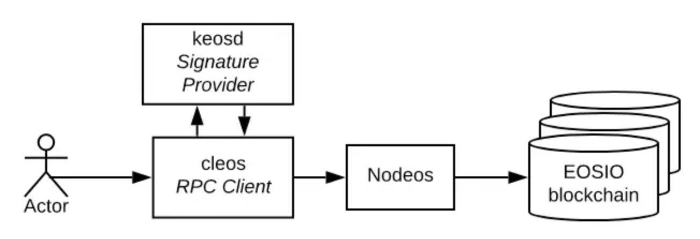

# EOS
## 什么是 EOS
EOS 的全称是 Enterprise Operation System，字面意思为<企业级区块链操作系统>。比特币的诞生就是实现了点对点的加密货币系统，以太坊的出现实现了图灵完备的虚拟机 (智能合约平台)。 

EOS 平台可以理解为一个系统，在该系统上的智能合约就类似于操作系统下的各个程序与软件。EOS 提供了帐户、身份验证、数据库、异步通信以及跨多个 CPU 核心或集群的应用程序调度支持。
## EOS 目标
EOS 目标是建立可以承载商业级智能合约与应用的区块链基础设施，成为区块链世界的 “底层操作系统”。

EOS 通过石墨烯技术解决延迟和数据吞吐量问题，当前 TPS 可达到数千，交易的确认时间也只有数秒。官方声称 EOS 会具有强大的横向扩展和纵向扩展能力，未来使用并行链的方式，最高可以达到数百万 TPS。同时普通用户无需支付使用费用。
## EOS 与 BM
BM 原名叫 Daniel Larimer，之所以叫 BM 只是因为他在网上经常使用网名 ByteMaster。

BM 对币圈老韭菜来说并不陌生，可以说是如雷贯耳了吧。别人整一个区块链系统就费老鼻子劲了，这货儿却一口气整了三个出来。

2013 年推出比特股 (Bitshare) 去中心化交易所，开始引入 DPos 共识，10 秒种出一个块。

2015 年，为了更好地优化系统性能， BM 团队发布了石墨烯工具组， Bitshare2.0 采用了此技术之后，缩短了区块生产的速度，每 3 秒就可以产出一个块，同时支持每秒 1 万笔交易的处理速度。后来他目光放在了内容社区上，并打造了一个通过加密货币奖励支持社区建设和社交互动的区块链数据库一 Steem。 Steem 沿用了比特股的底层技术：石墨烯底层框架，在交易性能和用户体验方面都达到了相当高的水准。 EOS 可以说是 BM 对于区块链技术理解的总结，这次 BM 将以太坊作为自己的对手，建立一个区块链操作系统。

## EOS 有哪些突出特点
- 较高的吞吐量和可扩展性

	EOS 是为实现高交易吞吐量而设计的。 通过 DPOS 共识机制，EOS 区块链网络不需要等待所有节点完成交易才能达到确认状态。 与其他共识机制相比交易吞吐量更高。
- 更快的确认和更低的延迟

	为了提供良好的用户体验，EOS 被设计成具有较低的交易确认延迟，以便开发人员构建的应用程序能够与中心化的互联网应用竞争。
- 用户免费和资源通证化

	建立在 EOS 上的应用可以采用免费增值模式，用户不需要支付基础设施的费用便可进行交易。 EOS 的基础设施资源是靠一种代币抵押机制来分配的。 你抵押多少 EOS 代币，就会相应的获取一定比例的资源，并且这些资源一直会锁定到你取消抵押，期间不会受 EOS 代币价格波动的影响。
- 更完善的账户与权限管理体系

	和比特币以太坊一个账户就是一个公私钥对不同，你可以通过 EOS 网络创建一个用户名来作为账户，每个账户下面有多对公私钥，每对公私钥可以根据业务需要赋予不同的权限。这给开发面向更复杂权限控制场景的应用提供了很大方便。
- C++/WASM 虚拟机

	C/C++ 几乎是每个科班计算机同学的必修课。会 C++ 的同学有福了，EOS 的智能合约就是需要用 C++ 写的，不需要为了写智能合约再学一门新的语言。

	EOS 底层用来执行智能合约代码的是一个 WebAssembly (WASM) 虚拟机。 WASM 也被谷歌、微软、苹果和其他公司开发的其他重要的互联网基础设施软件所使用。 使用 WASM 的设计选择使 EOS 能够重用经过优化和严格测试的编译器和工具链，这些编译器和工具链目前由更广泛的社区维护和改进。 此外，采用 WASM 标准还使编译器开发人员更容易将其他编程语言移植到 EOS 区块链上。
- 更好的支持应用升级

	部署在基于 EOS 区块链上的应用程序是可升级的。 这意味着开发人员在提供足够授权的情况下可以部署代码修复、添加特性和（或）更改应用程序逻辑。 作为一名开发人员，你可以持续迭代更新你的应用，而不必担心永久性地陷入错误或 bug 的风险。 当然，你也可以选择部署不可更改的智能合约。在智能合约升级方面，向左还是向右，一切由开发人员自行决定。
- 可编程的治理机制

	任何 EOS 区块链上的资源分配和治理机制都是可编程的。 EOS 的治理和资源分配是通过智能合约来控制的。 开发者只需要修改系统智能合约来改变 EOS 区块链的资源分配和管理规则。 这种方式使链上治理变得更加简单，因为在进行必要的更改时并不需要基础层代码的改动，从而可以比较好的避免应分叉带来的一些风险。
	
## 原理

EOS 主要由 keosd，cleos，nodeos 三大组件构成：

- keosd

	是个密钥管理器，用来管理和 EOS 账户相关的公私钥。
- cleos

	客户端命令行交互组件，用于解析用户命令，根据具体命令请求调用相应的接口，例如查看区块信息、操作钱包等。
- nodeos

	 EOS 核心进程，EOS 大部分的功能都是在 nodeos 中进行。可以使用插件来配置 nodeos 去执行各种功能。
	 
	 p2p 网络、合约代码调度以及区块链数据持久化等大部分区块链核心功能都被放在了 nodeos 中。对于开发人员来说，nodeos 也足够用来建立一个单节点区块链网络。
	 
## 账户体系
账户体系是 EOS 中的亮点之一，实现了基于角色的权限管理和账户恢复功能，使得用户可以灵活地以一种组织化的方式管理账户，并最大化保证资产的安全性。

备注：EOS 账户是通过智能合约实现的。

- 基于角色的多层级账户体系

	常见区块链项目的账户是一对公私钥，账户名就是公钥，而 EOS 中的账户名是由用户自定义的 12 位可读标识符组成，且一般一个账户可以被多对公私钥控制，每对可以自定义拥有不同的权限。遇过权限配置可实现该账户只被个体拥有或者被一个组织控制 (即多个个体共同拥有)，该账户是传统公钥所代表的单一权限的更高层次抽象集合。
	
	对于常见的区块链项目而言，账号一般就是一对公私钥，如果私钥被盗取代币便可直接转走。而在 EOS 中，代币是放在账户里的，每个公钥可以配置不同的权重，可以控制每个公钥可以转移的账户的代币的金额（需要每个拥有转账权限的钥匙的权重之和达到设定的阁值）。EOS 上的所有交易行为都是通过账户来完成的，通过账户执行任意操作时，EOS 系统首先会验证操作者是否拥有足够的权限，通过验证该操作才能生效。

	EOS 中，每个账户刚创建时一般由个体拥有，通过单一公私钥便能进行所有操作，后续可根据需要通过权限配置将该账户扩展成组织账户，由多对公私钥 (即多个主体) 共同控制，甚至可为组织外部个体或组织分配部分操作权限，从而实现极其灵活的组织管理方式。
- 账户权限管理
	
	EOS 中任意账户都自带两个原生权限: owner 和 active 权限。owner 即代表账户所有权，该权限可进行所有操作，包括更改 owner 权限，可由一对或多对 EOS 公私钥或另一账户的某权限实现权限控制。因此，代表着 owner 权限的 EOS 公私钥是最重要的，必须冷储藏（离线存储）。active 即活跃权限，能进行除更改 owner 权限以外的所有操作，也是通过一对或多对 EOS 公私钥或另一账户的某权限实现权限控制的。

- 密钥丢失或被盗后的恢复

	EOS 允许恢复被盗窃的密钥，这在比特币和以太坊上是不可能的。在比特币和以太坊上一旦密钥丢失那么整个账户也将随之丢失。EOS 系统软件为用户提供了密钥被盗时恢复其账户控制的方法。账户所有者可以使用过去 30 天内活跃的任何其批准的账户恢复合作伙伴的密钥，并重置账户上的所有者密钥。没有账户所有者的配合，账户恢复合作伙伴无法重置账户的控制权。

## 参考
- [EOS 入门第一篇 - 简析 EOS](https://learnblockchain.cn/2019/05/24/eos-dev-intro/)
- [EOS 入门第二篇 - 技术原理](https://learnblockchain.cn/2019/05/27/eos-dev-principle/)	