# P2P Gossip 协议(这里和DHT平行)
关联一致性 HASH 中的一个问题，如果增减节点，那么其他节点是如何知道这个节点的存在或者消失呢？在有中心化节点的时候，如一个 master 来维护整个，那么想怎么变就怎么变，每个节点读取 master 的配置即可。但是在无中心化节点的情况下，相当于每个节点自己维护自己的路由配置，那么一定要保证根据一个特定的集群状态，所有节点计算出来的结果是完全一样的。不仅要计算自己应该存什么，还应该计算别人应该存什么，因为客户端连任何一个节点都能请求任何数据。换句话说，每个节点根据一个特定的集群状态计算出的某个节点的 sharding 信息应该是完全一样的。

为了达成这个目标，首先集群中的每个节点获得的集群状态应该是一致的，再根据这个一致的状态来进行计算。保证在有机器挂掉、新增了新机器等，为了数据的一致性，应该尽量保证路由信息不变，如果路由信息不得不改版，应该做到尽量安全切换，防止数据丢失。比如，Cassandra 是 CAP 中的 AP 系统，路由信息切换不能以暂时无法访问失去可用性为代价。

Cassandra 使用 gossip 协议维持其一致性。Gossip 协议是一种无中心节点的分布式系统中常用的通信协议，akka 等系统也用。

简单来说就是每个节点周期性地随机找一个节点互相同步彼此的信息，P2P 通信，很像人类社会的 “gossip(八卦)” 因而得名。从概率上讲，集群中的状态最终是一定会收敛的，也就是说 gossip 协议维护的状态是最终一致性。

因为每个周期每个节点只选择1个其他节点进行通信，从概率上来说同步信息的负担不会因为集群节点数的增多而增大，不像有中心节点的系统中中心节点的负载会因为节点数变多而变高，但是集群信息收敛需要的时间也会变长。不过因为是最终一致性，实际上对性能的要求显得没那么高，因而跨机房高延迟的状态并不会导致什么太大的问题，而通常有中心节点的系统中对中心节点的响应时间有一定要求，跨机房的话性能会受到一定的影响。

## 脑裂问题
分布式系统一个常见的问题是“脑裂”，有中心节点的系统怕选出两个 master，无中心节点的系统怕拆成两个集群。Cassandra 为了防止集群被拆成两半，主要通过两个手段。

-  gossip 协议需要在起始阶段人工指定 “先知种子节点” 来获取初步的信息，并且一般来说需要每个节点填相同的若干个种子节点以保证在初期肯定能连到同一个集群中。
- 每个 gossip 周期随机选其他节点同步消息时，如果随机到的不是种子节点则额外选随机一个种子节点再进行同步。

这样既可以保证每个节点都能连到同一个集群中，也可以保证每个已存在的节点可以第一时间知道有新的节点加入（因为种子节点是最先知道新节点加入的）。此外 gossip 同步时拿到的集群节点列表是只增不减的，除非用户手动删除，否则哪怕访问不到也只是标记成“无响应”，不会踢出。先保证初期能连到同一个集群中，再保证后来不会有节点退出这个集群，从而防止 P2P 的集群分裂。

### 步骤
- 节点5增加到集群中

	
- 节点5通知种子节点2

	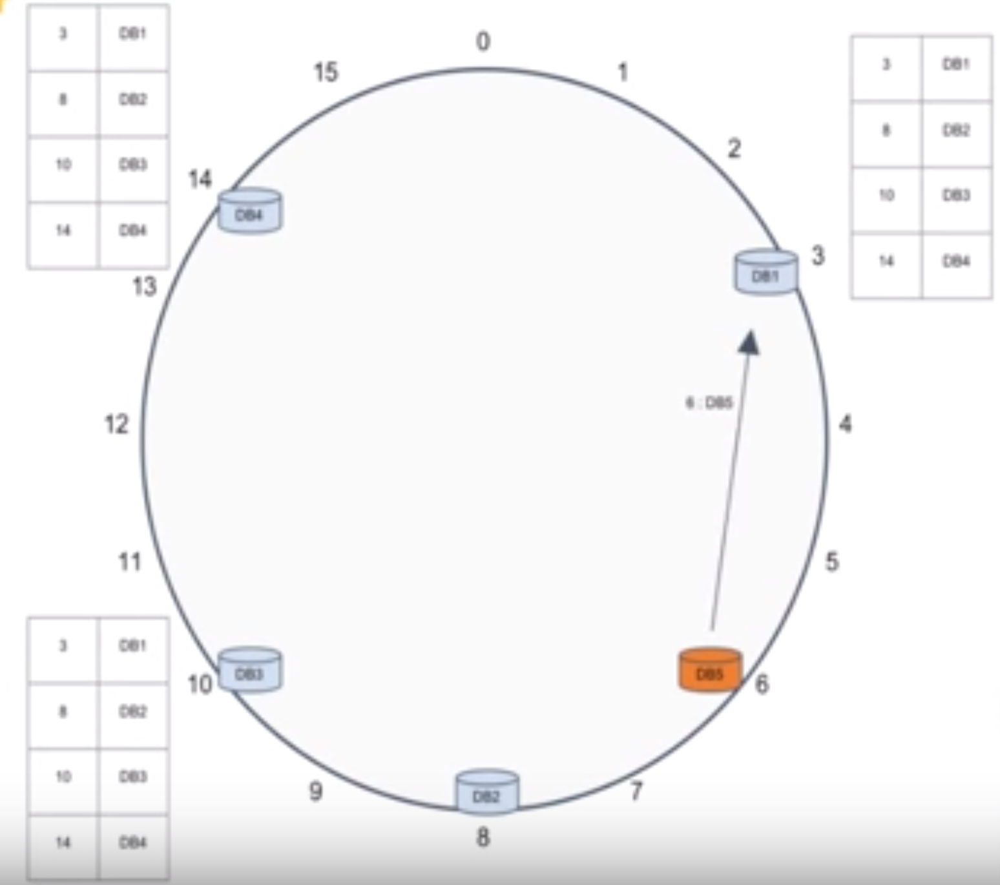	
- 5和2节点的节点表数据同步

		
- 再有这2个节点分别去同步其他节点

	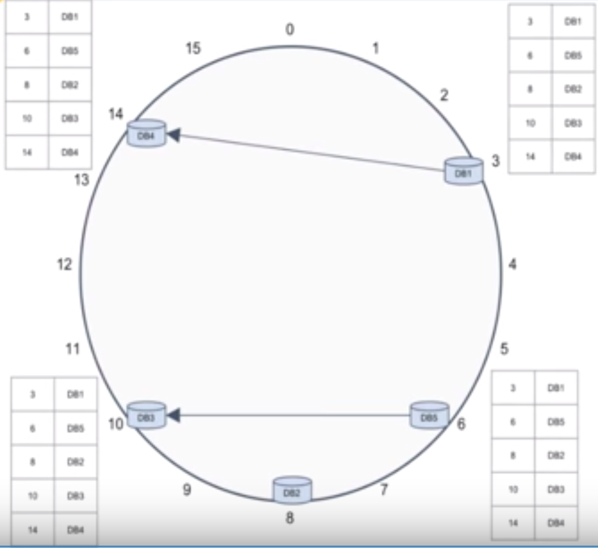	

## cassandra 数据存储方法
- 将每条数据的 id 进行 hash (hash 三种方案 md5、murmur-非加密，快5倍、保证 order-可能产生热点)
- 把 hash 结果发给负责节点
- cassandra 基于行存

### 问题
- 负载均衡
	- 问题
		- 新增节点会打破当前负载均衡情况
		- 集群小的时候，其中一个节点的数据过多问题
		- 单机处理能力不同
	- 解决方案
		- 虚拟节点(默认一个点是256)
		
			一台物理机器扮演很多个点，如下例子，初始2个物理点，模拟成8个点，每个物理机器4个点，这里可以让更好的机器负责更多的数据
			
			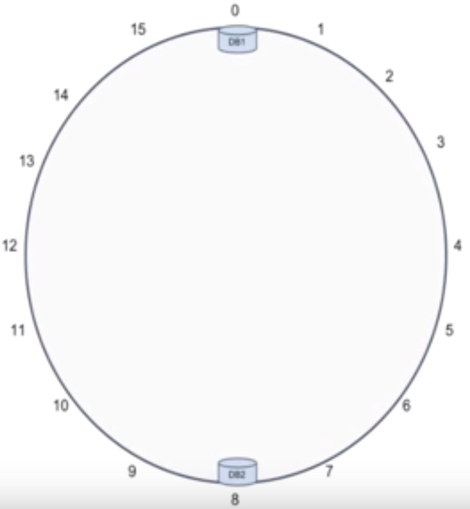	
			变成
			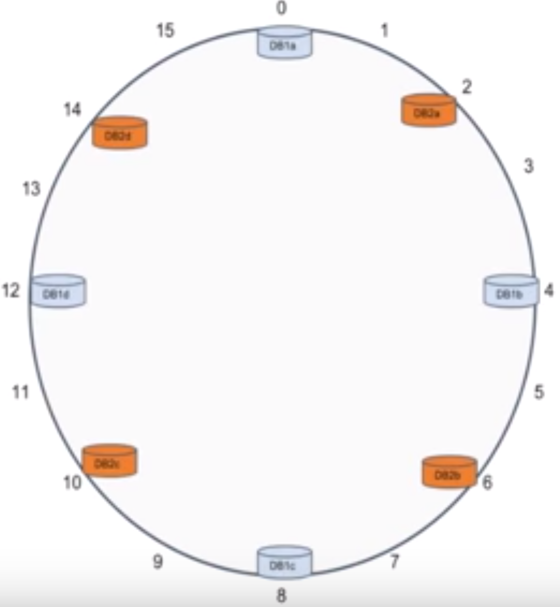	
			 
		- 移动节点
- 副本备份
	- 问题
		- 避免在同一类型的节点上从小到大分为
			- 物理节点
			- 机架
			- 供电区
			- 物理机房   
		- 解决方案
			- 服务提供额外的信息来做 
- 一致性
	- 问题
		- cap 原则，总的来说 cassandra 是 ap 系统
			- c 数据一致
			- a 数据可用
			- p 数据分片 
		- 三个参数设置可以调一致性
			- N 副本数
			- W 写操作的成功数
			- R 读操作的成功数
	- 一致性可调
		- 3副本1写1读(尽最大可能不返回失败给客户)
			- 1写 
				- 当前三副本数据
							
					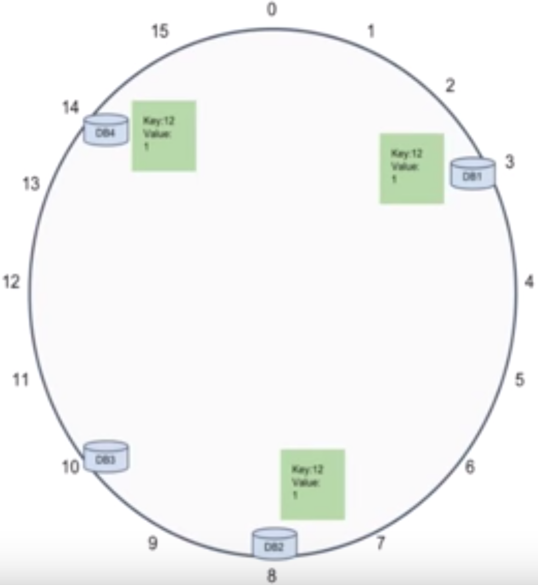	
				- 改这个数据的新值
	
					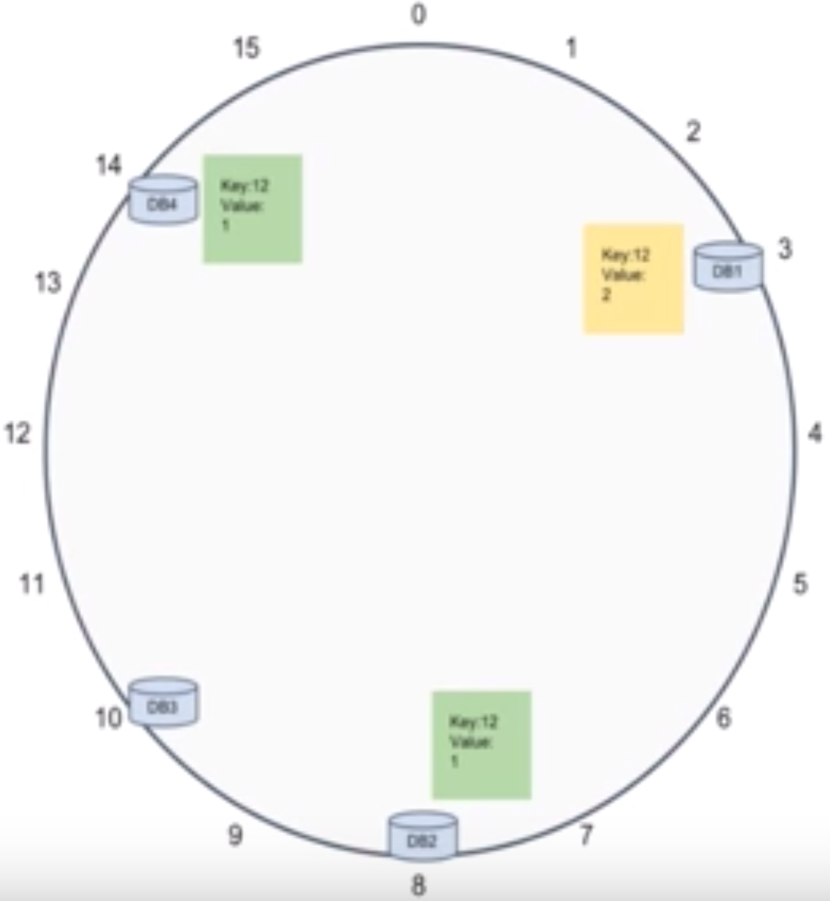
				- 在当前规则下(1写)，只要写一个成功了就算成功。
				- 注意 
			
					备份节点选择数据存储节点在环正时针紧挨着的两个节点，用来方便得到备份节点位置信息
			- 1 读
				
				如果一个副本可读就算成功，即使这个副本还是旧的数据，比如上图，读取的是 DB2 的数据

				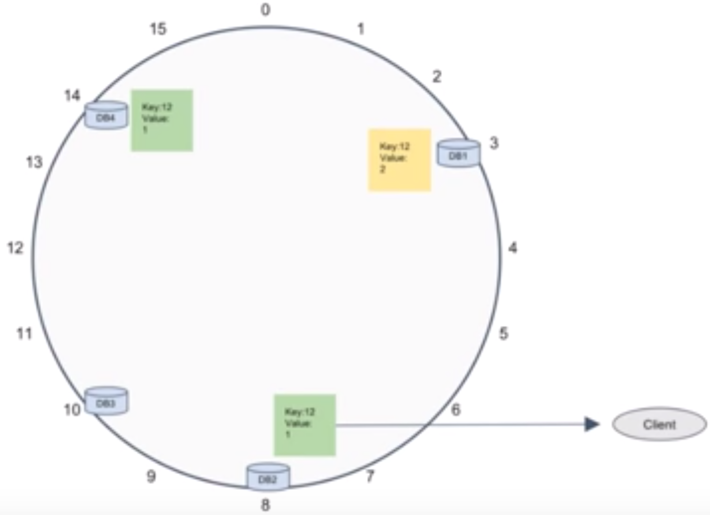
			- 优点
				- 等待时间短
				- 客户写使用很便捷 
			- 缺点
				- 读数据不一致
				- 可能产生单点故障
		- 3副本3写1读(最大保证一致性)
			- 3写
				- 档3个副本都写成功了，才算成功

					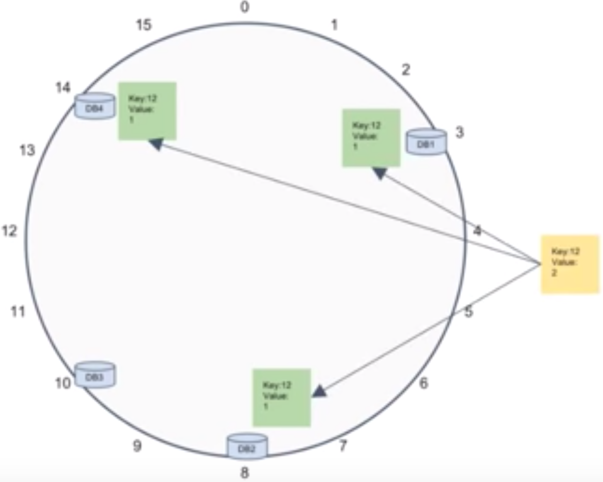
				- 注意

					这里肯定是两段提交，先写提交，然后在 commit 提交更新数据
			- 1读
			
				永远可读最新数据
				
				
			- 优点
				- 强一致 
			- 缺点
				- 响应慢或者失败几率大
		- 3副本1写3读(仍然可以保证一致性) 
			- 1写

				同1写1读的写是一样的		 	
				
				
			- 3读

				3个副本都读，然后比对那个副本最新
				
				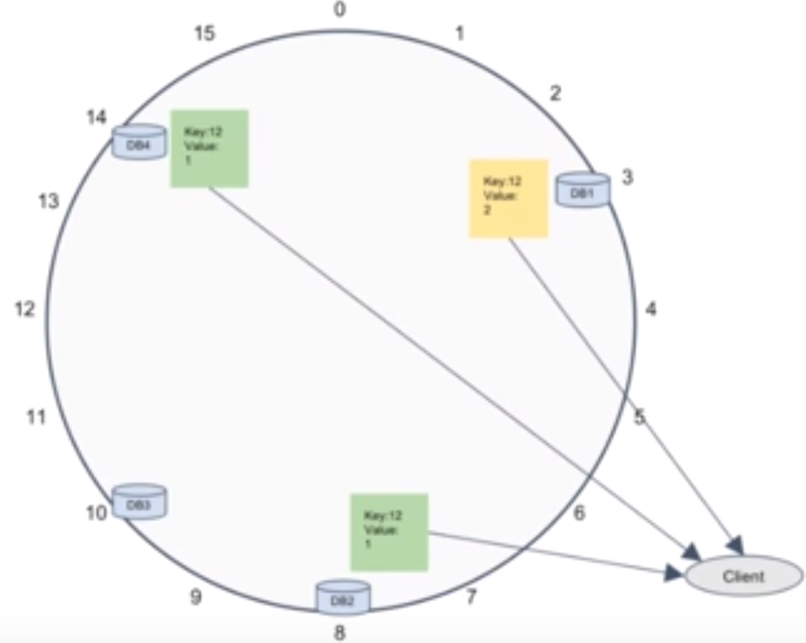
			- 优点
				- 等待时间短
				- 客户写使用很便捷 
			- 缺点
				- 读数据一致
				- 可能产生单点故障
		- 规律
			- 强一致性
				
					 W+R > N
				- 写	 
				
					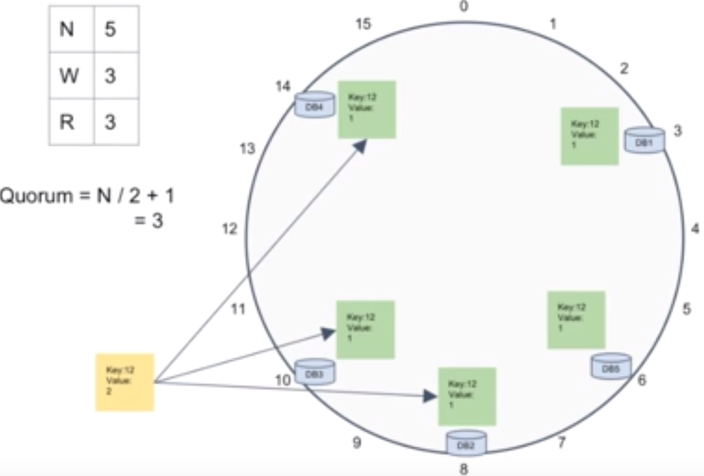	 
				- 读
				
					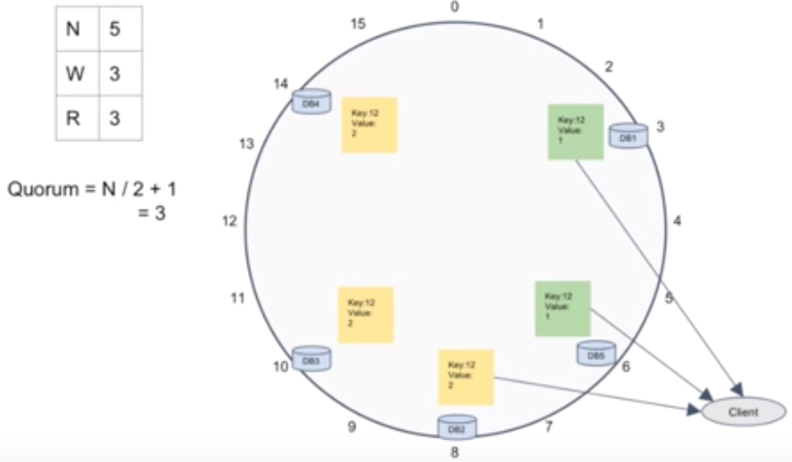
					
				- 注意
					- 这里之所以会读取到最新的，是因为数据本身带了时间戳来判断
					- 之所以能用时间戳，需要集群需要使用 ntp 强时间同步(误差1毫秒)
	- 如何保证最终一致性
		- 读修复

			意思就是如果在读取的时候发现数据不同步，就会通知问题节点进行数据同步
		- 暗号(这个很大问题会影响性能，凡是有尝试，就容易雪崩)
			- 如果在1写的时候，还是会尝试向副本数量的节点写，但是如果有节点异常无法写入
			
				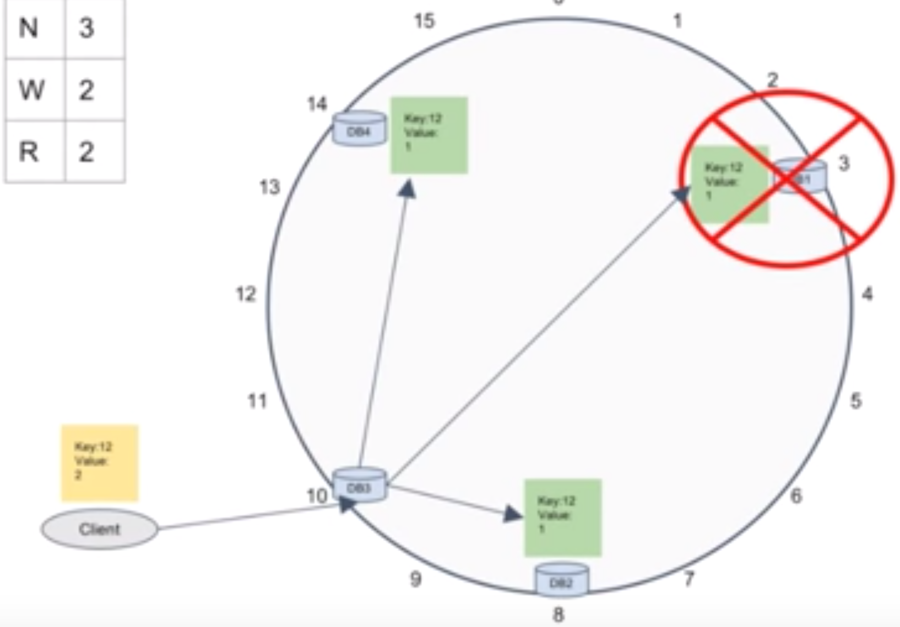
			- 让提交的节点也存储数据，但是会在数据上打一个暗号，标称这个数据应该存在哪里，然后会在短暂的时间里会去尝试连接实际存储节点来尝试恢复

				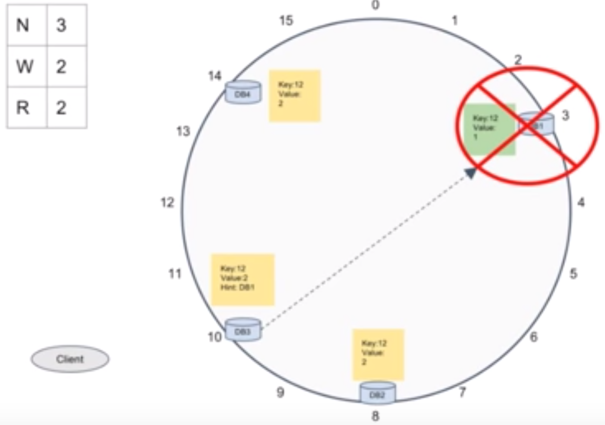
		- 反墒修复

			反墒修复逻辑，就是要在尽可能正常处理的模型中，来修复系统的故障或者叫降低系统混沌度
			
			- 每一个节点的数据会定期的和其他节点的副本进行比对，如果不一样，就已最新的为准进行同步
			- 如果当机启动的节点，会和其他副本自动同步
			- 如果很久没有读过的数据，只要被读就会尝试去同步
			- 一个节点故障后会尝试升级
			- 修复丢失的数据
		- 如何发现数据是否一致
			- merkle dag(写频繁会导致系统繁忙)
			
				使用 merkle dag 来比较副本是否一致
			
			 	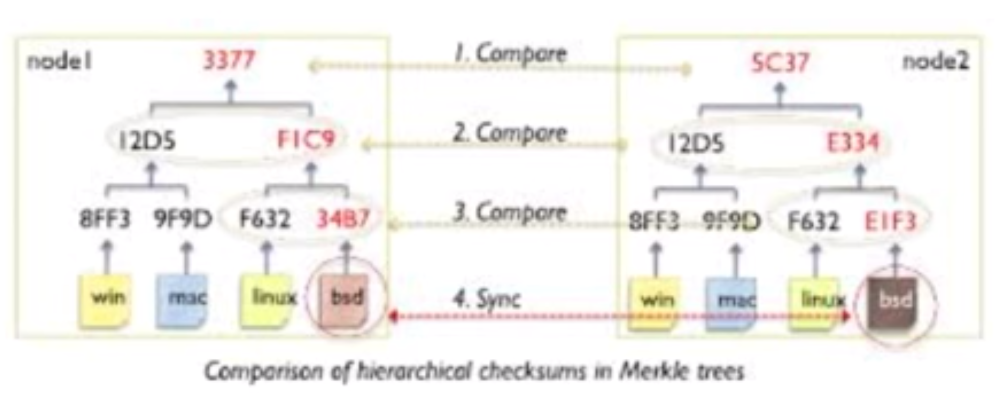
	- 如何增加写的速度

		
		
		- 先写内存表并写 log日志防止掉电
		- 内存表到一定程度后，刷新到磁盘 append only
	- 如何提高读的速度

		 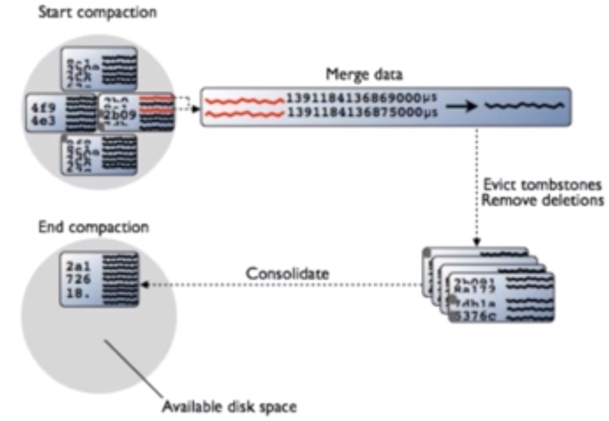
		 
		- 整体压数据
			- 把同一个 key 的数据块进行合
			- 同时把合并之前的数据进行标记过期数据，在删除的时候就可以一起被清理
			- 数据设置 ttl 保持较新的数据
		- 增加缓存
		- 压缩四个方案
			- 规模分层压缩策略(STCS)
				- 每四块压一块 
			- 等级压缩策略(LCS)
				- 分两种
					- 根据插入性能优化
					- 根据更新性能优化  
			- 数据分层压缩策略(DTCS)
				- 根据时间进行压缩  
				 							    

- 节点多效率低
- 一致性较差问题
- 只传输一遍，如果丢失也不会再传

## 参考
- [Cassandra内部原理和底层实现](https://www.youtube.com/watch?v=BUjcS4q86jQ)