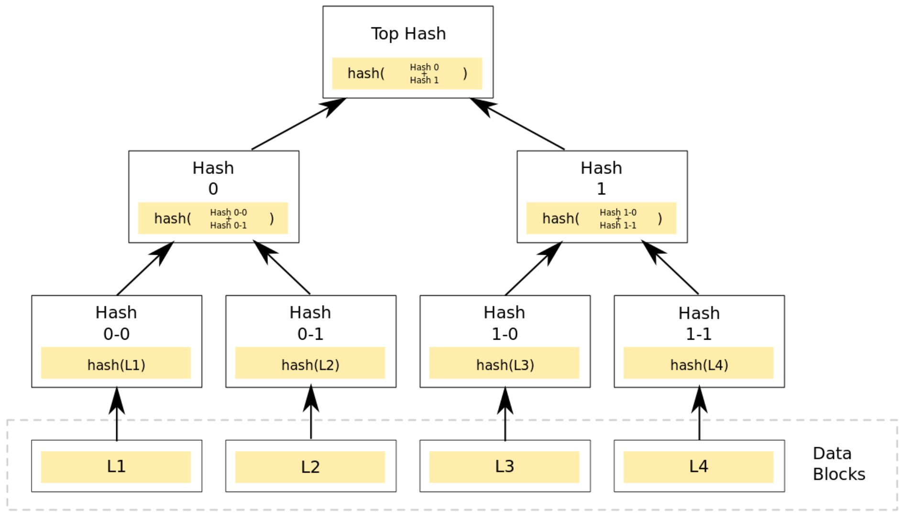
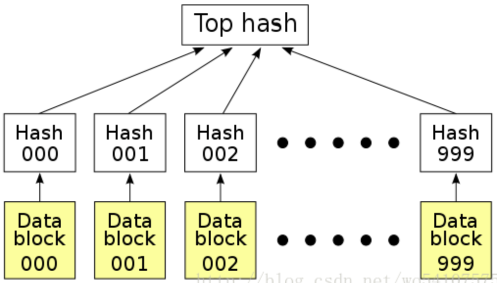
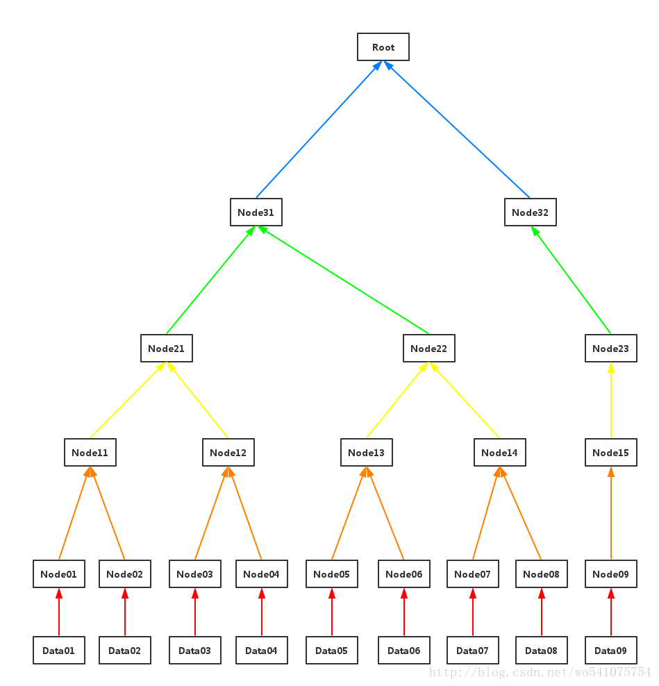
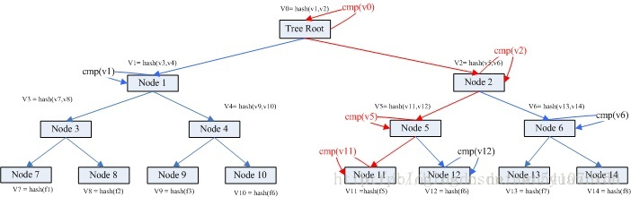
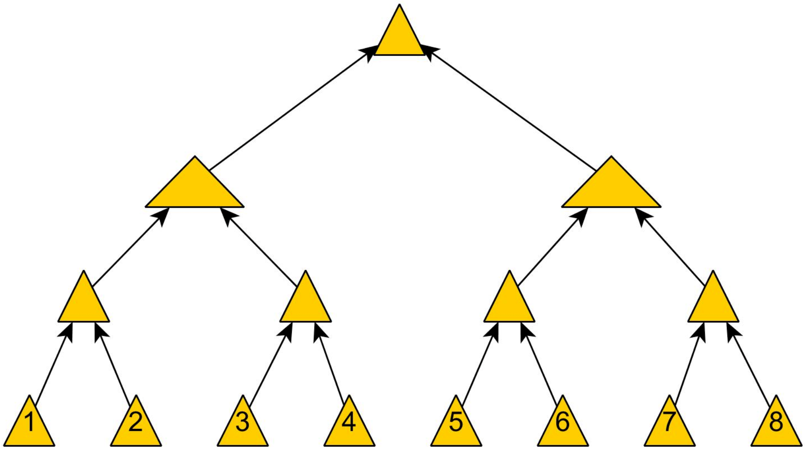
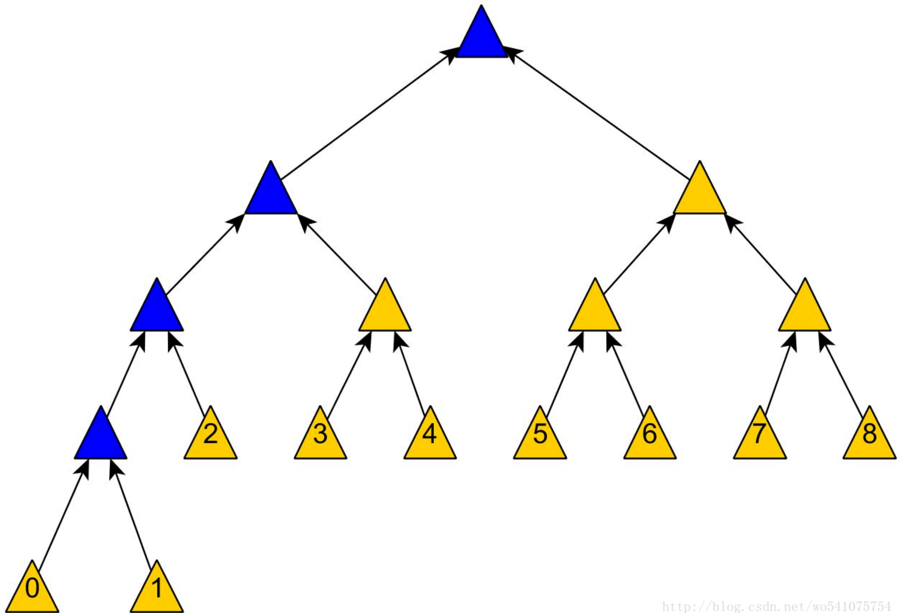
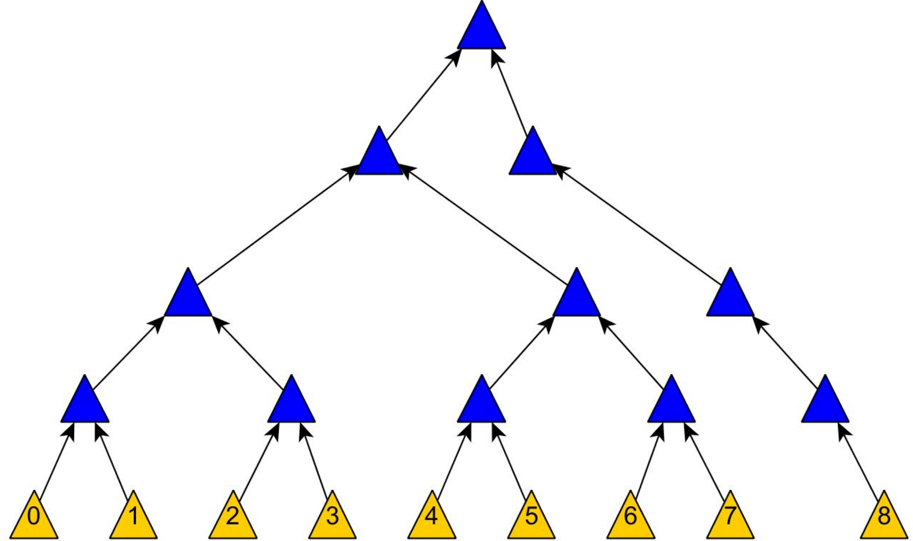
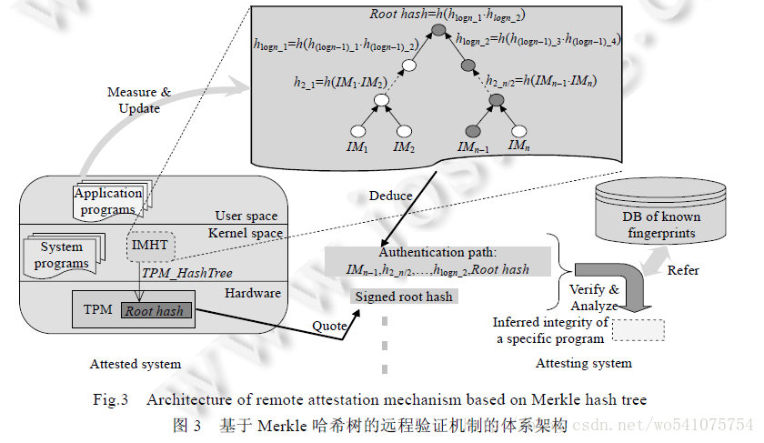
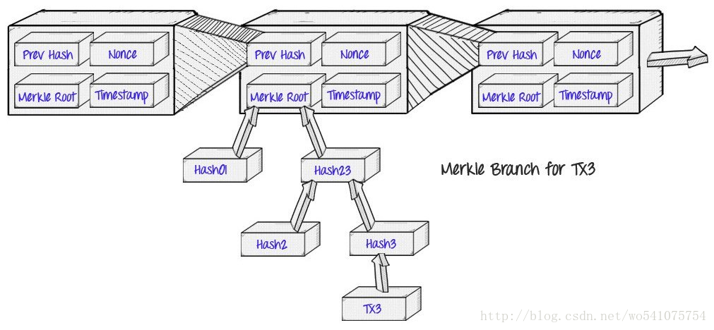
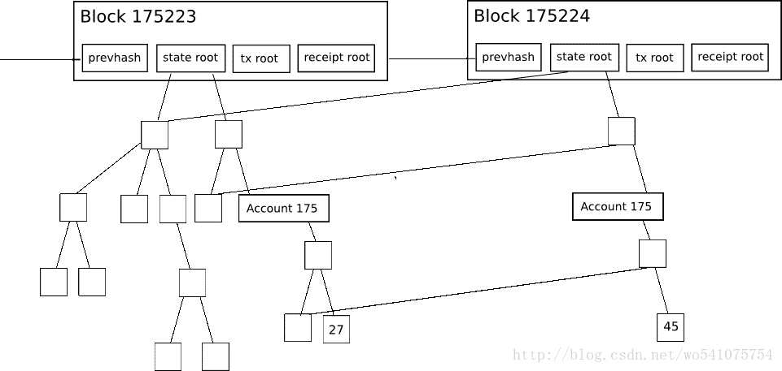

# Merkle Tree（默克尔树）算法解析
## 什么是 Merkle tree
Merkle Tree，通常也被称作 Hash Tree，顾名思义，就是存储 hash 值的一棵树(如图下)。Merkle 树的叶子是数据块(例如，文件或者文件的集合)的 hash 值。非叶节点是其对应子节点串联字符串的 hash。

## 概念
### Hash
Hash 是一个把任意长度的数据映射成固定长度数据的函数。

- 用处

	对于数据完整性校验，最简单的方法是对整个数据做 Hash 运算得到固定长度的 Hash 值，然后把得到的 Hash 值公布在网上，这样用户下载到数据之后，对数据再次进行 Hash 运算，比较运算结果和网上公布的 Hash 值进行比较，如果两个 Hash 值相等，说明下载的数据没有损坏。可以这样做是因为输入数据的稍微改变就会引起 Hash 运算结果的不同，而且根据 Hash 值反推原始输入数据的特征是困难的。 
- 问题 

	采用单一 Hash 是可取的。但如果数据源不稳定，一旦数据损坏，就需要重新下载，这种下载的效率是很低的。
- 解决办法

	Hash List

### Hash List
在点对点网络中作数据传输的时候，会同时从多个机器上下载数据，而且很多机器可以认为是不稳定或者不可信的。为了校验数据的完整性，更好的办法是把大的文件分割成小的数据块（例如，把分割成2K为单位的数据块）。

- 好处

	解决了上面的问题，小块数据在传输过程中损坏了，只要重新下载这一快数据就行了，不用重新下载整个文件。
- 如何确保在分割后，最终的文件是正常的

	只需要为每个数据块做Hash。如 BT 下载的时候，在下载到真正数据之前，会先下载一个 Hash 列表。把每个小块数据的 Hash 值拼到一起，然后对这个长字符串在作一次 Hash 运算，这样就得到 Hash 列表的根 Hash(Top Hash or Root Hash)。下载数据的时候，首先从可信的数据源得到正确的根 Hash，就可以用它来校验 Hash 列表了，然后通过校验后的 Hash 列表校验数据块。 

		

### Merkle Tree
Merkle Tree 可以看做 Hash List 的泛化（Hash List 可以看作一种特殊的 Merkle Tree，即树高为2的多叉 Hash List）。

在最底层和哈希列表一样，把数据分成小的数据块，有相应地哈希和它对应。但是往上走，并不是直接去运算根哈希，而是把相邻的两个哈希合并成一个字符串，然后运算这个字符串的哈希，这样每两个哈希就结婚生子，得到了一个”子哈希“。如果最底层的哈希总数是单数，那到最后必然出现一个单身哈希，这种情况就直接对它进行哈希运算，所以也能得到它的子哈希。于是往上推，依然是一样的方式，可以得到数目更少的新一级哈希，最终必然形成一棵倒挂的树，到了树根的这个位置，这一代就剩下一个根哈希了，我们把它叫做 Merkle Root。

- 使用场景

	例在 p2p 网络下载网络之前，先从可信的源获得文件的 Merkle Tree 树根。一旦获得了树根，就可以从不可信的源获取 Merkle tree 。通过可信的树根来检查接受到的 Merkle Tree。如果 Merkle Tree 是损坏的或者虚假的，就从其他源获得另一个 Merkle Tree，直到获得一个与可信树根匹配的 Merkle Tree。

### Merkle Tree 和 Hash List 的主要区别
Merkle Tree 可以直接下载一个分支并立即验证 。因为可以将文件切分成小的数据块，这样如果有一块数据损坏，仅仅重新下载这个数据块就行了。如果文件非常大，

- Merkle tree

	可以一次下载一个分支，然后立即验证这个分支，如果分支验证通过，就可以下载数据了。
- Hash list 

	只有下载整个 hash list 才能验证。 

## Merkle Tree 的特点
- MT 是一种树，大多数是二叉树，也可以多叉树，都具有树结构的所有特点；
- Merkle Tree 的叶子节点的 value 是数据集合的单元数据或者单元数据 HASH。
- 非叶子节点的 value 是根据它下面所有的叶子节点值，然后按照 Hash 算法计算而得出的。

通常，hash 方法会使用 SHA-2 和 MD5 这种加密的方法用来做 hash。但如果仅仅防止数据而不是蓄意的损坏或篡改，可以改用一些安全性较低但效率高的校验和算法，如 CRC。

## 操作逻辑
### 创建 Merckle Tree
例最底层有9个数据块。创建 Merkle Tree 是 O(n) 复杂度 (这里指 O(n) 次 hash 运算)，n 是数据块的大小。得到 Merkle Tree 的树高是 log(n)+1

	

- step1

	（红色线）对数据块做hash运算，Node0i = hash(Data0i), i=1,2,…,9

- step2

	（橙色线）相邻两个hash块串联，然后做hash运算，Node1((i+1)/2) = hash(Node0i+Node0(i+1)), i=1,3,5,7;对于i=9, Node1((i+1)/2) = hash(Node0i)
- step3

	（黄色线）重复step2
- step4

	（绿色线）重复step2
- step5

	（蓝色线）重复step2，生成 Merkle Tree Root 

### 检索数据
例有 A 和 B 两台机器，A 需要与 B 相同目录下有 8 个文件，文件分别是 f1 f2 f3 ….f8。这个时候就可以通过 Merkle Tree 来进行快速比较。假设在文件创建的时每个机器都构建了一个 Merkle Tree。叶子节点 node7 的 value = hash(f1),是 f1 文件的 HASH;而其父亲节点 node3 的 value = hash(v7, v8) ，也就是其子节点 node7 node8 的值得 HASH。就是这样表示一个层级运算关系。root 节点的 value 其实是所有叶子节点的 value 的唯一特征。

	

A 上的文件 5 与B上的不一样，比较检索过程

- Step1

	首先比较 v0 是否相同。如果不同，检索比较子节点 node1 和 node2.
- Step2

	v1 相同，v2不同。检索比较 node2 的子节点 node5 node6;
- Step3

	v5不同，v6相同，检索比较 node5 的子节点 node 11 和 node 12
- Step4

	v11不同，v12相同。node 11为叶子节点，获取其目录信息。
- Step5

	检索比较完毕

因为是2叉法，所以可以很快找到不同文件	
### 更新
赞无
### 插入
#### 默认插入方法
- 初始数据结构

	
- 插入0数据块后的结构

	
	
#### 新一种插入的算法
Merkle Tree 的插入和删除操作其实是一个工程上的问题，不同问题会有不同的插入方法。如果要确保树是平衡的或者是树高是 log(n)，可以用任何的标准的平衡二叉树的模式，如AVL 树，红黑树，伸展树，2-3 树等。这些平衡二叉树的更新模式可以在 O(lgn) 时间内完成插入操作，并且能保证树高是O(lgn)。

那么很容易可以看出更新所有的 Merkle Hash 可以在O((lgn)2) 时间内完成（对于每个节点如要更新从它到树根O(lgn) 个节点，而为了满足树高的要求需要更新 O(lgn) 个节点）。如果仔细分析的话，更新所有的 hash 实际上可以在 O(lgn) 时间内完成，因为要改变的所有节点都是相关联的，即他们要不是都在从某个叶节点到树根的一条路径上，或者这种情况相近。

设计者说实际上 Merkle Tree 的结构是否平衡，树高限制多少在大多数应用中并不重要，而且保持数据块的顺序也在大多数应用中也不需要。因此，可以根据具体应用的情况，设计自己的插入和删除操作。一个通用的 Merkle Tree 插入删除操作是没有意义的。

- re-hashing 操作的次数控制在 log(n) 以内 
- 数据块的校验在 log(n)+1 以内 
- 除非原始树的 n 是偶数，插入数据后的树没有孤儿，并且如果有孤儿，那么孤儿是最后一个数据块 
- 数据块的顺序保持一致 
- 插入后的 Merkle Tree 保持平衡

### 删除
暂无

## 应用
### 数字签名
最初 Merkle Tree 目的是高效的处理 Lamport one-time signatures。 每一个 Lamport key 只能被用来签名一个消息，但是与 Merkle tree 结合可以来签名多条Merkle。这种方法成为了一种高效的数字签名框架，即Merkle Signature Scheme。
### P2P 网络
在 P2P 网络中，Merkle Tree 用来确保从其他节点接受的数据块没有损坏且没有被替换，甚至检查其他节点不会欺骗或者发布虚假的块。

大家所熟悉的 BT 下载就是采用了 P2P 技术来让客户端之间进行数据传输，一来可以加快数据下载速度，二来减轻下载服务器的负担。

要进下载必须从中心索引服务器获取一个扩展名为 torrent 的索引文件（即大家所说的种子），torrent 文件包含了要共享文件的信息，包括文件名，大小，文件的 Hash 信息和一个指向 Tracker 的URL[8]。Torrent 文件中的 Hash 信息是每一块要下载的文件内容的加密摘要，这些摘要也可运行在下载的时候进行验证。

- 遇到的问题
	- 大的 torrent 文件是 Web 服务器的瓶颈，而且也不能直接被包含在 RSS 或 gossiped around(用流言传播协议进行传播)。一个相关的问题是大数据块的使用，因为为了保持torrent 文件的非常小，那么数据块 Hash 的数量也得很小，这就意味着每个数据块相对较大。
	- 大数据块影响节点之间进行交易的效率，因为只有当大数据块全部下载下来并校验通过后，才能与其他节点进行交易。

为了解决上面两个问题是用一个简单的 Merkle Tree 代替Hash List。设计一个层数足够多的满二叉树，叶节点是数据块的 Hash，不足的叶节点用0来代替。上层的节点是其对应子节点串联的 hash。Hash 算法和普通 torrent 一样采用SHA1。其数据传输过程和第一节中描述的类似。 

### 可信计算
可信计算是可信计算组为分布式计算环境中参与节点的计算平台提供端点可信性而提出的。可信计算技术在计算平台的硬件层引入可信平台模块 (Trusted Platform，TPM)，实际上为计算平台提供了基于硬件的可信根 (Root of trust，RoT)。从可信根出发，使用信任链传递机制，可信计算技术可对本地平台的硬件及软件实施逐层的完整性度量，并将度量结果可靠地保存再 TPM 的平台配置寄存器 (Platform configuration register，PCR) 中，此后远程计算平台可通过远程验证机制(Remote Attestation) 比对本地 PCR 中度量结果，从而验证本地计算平台的可信性。可信计算技术让分布式应用的参与节点摆脱了对中心服务器的依赖，而直接通过用户机器上的 TPM 芯片来建立信任，使得创建扩展性更好、可靠性更高、可用性更强的安全分布式应用成为可能。可信计算技术的核心机制是远程验证 (remote attestation),分布式应用的参与结点正是通过远程验证机制来建立互信,从而保障应用的安全。 

文献[10]提出了一种基于 Merkle Tree 的远程验证机制，其核心是完整性度量值哈希树。

### IPFS
IPFS 创建了一个基于 P2P 的集群，这个集群允许 IPFS 对象的交换。全部的 IPFS 对象形成了一个被称作 Merkle DAG 的加密认证数据结构。

IPFS对象是一个含有两个域的数据结构:

- Data – 非结构的二进制数据，大小小于256kB
- Links – 一个Link数据结构的数组。IPFS对象通过他们链接到其他对象

	Link 包含三个域：

	- Name – Link的名字
	- Hash – Link链接到对象的Hash
	- Size – Link链接到对象的累积大小，包括它的Links

- 面目录对象

		$ ipfs object get QmfTPQJp21rA7S3uhGcb9sjyp8fbdUfwaQJjiybgDpMbzn | jq .
		{
		  "Links": [
		    {
		      "Name": "aaa.txt",
		      "Hash": "QmWS6jyGwEMQou9cFdEkDJJ7VpGDuQ5hHGwxKc8DjS6Kwa",
		      "Size": 18
		    },
		    {
		      "Name": "index.html",
		      "Hash": "QmeWquPFAUNWoRmYrd3mTZVCsrub6teApChHDrgATwt3ic",
		      "Size": 555
		    },
		    {
		      "Name": "style.css",
		      "Hash": "QmfUcVBJseiTvr2BHeCRE4aTmwYt1tBBRxsvrs22uipUXh",
		      "Size": 29
		    }
		  ],
		  "Data": "\b\u0001"
		}

	如
	

- 小文件对象（<256kB），是一个没有Links的IPFS对象

		$ ipfs object get QmeWquPFAUNWoRmYrd3mTZVCsrub6teApChHDrgATwt3ic | jq
		{
		  "Links": [],
		  "Data": "\b\u0002\u0012�\u0004<!DOCTYPE html>\n<html lang=\"en\">\n<head>\n  <meta charset=\"UTF-8\">\n  <title>Hello Tarkov</title>\n  <link rel=\"stylesheet\" href=\"./style.css\" />\n</head>\n<body>\n  <h1>Welcome to IPFS Escape from Tarkov</h1>\n  <video width=\"640\" height=\"480\" controls=\"controls\">\n  <source src=\"http://ipfs.io/ipfs/QmUT97Bnskv9bZX27xtLLheD5ryjEYk54PvhL3wcnY4hfQ\" type=\"video/mp4\" />\n  <video width=\"640\" height=\"480\" controls=\"controls\">\n  <source src=\"http://ipfs.io/ipfs/QmcUHdzKgRrcJrD5Ah46HgBHF7urWDhmAnLKYwcHaLgeGP\" type=\"video/mp4\" />\n</video>\n</body>\n</html>\n\u0018�\u0004"
		}
- 大文件对象

		$ ipfs object get QmUT97Bnskv9bZX27xtLLheD5ryjEYk54PvhL3wcnY4hfQ | jq .
		{
		  "Links": [
		    {
		      "Name": "",
		      "Hash": "QmPTjmVuqxshDeJXhDtA63eegAndLQWMH4rdd5JWqaSGD2",
		      "Size": 262158
		    },
		    {
		      "Name": "",
		      "Hash": "QmfB1GtGf8sjjdrK3Nhveg4DvzZhn8Y48uCvjtjQCcv1wV",
		      "Size": 262158
		    },
		    {
		      "Name": "",
		      "Hash": "QmbyyM9y8gA4su2WbUyCoc6qVUWrVk78fKPGJAcgtRCuk1",
		      "Size": 262158
		    },
		....
		{
		      "Name": "",
		      "Hash": "QmZ6V1c8AkWkZd88xpSv5Nyz8A1u81sxdNJkRwspSdJdwb",
		      "Size": 50147
		    }
		  ],
		  "Data": "\b\u0002\u0018Շ�\u0011 ��\u0010 ��\u0010 ��\u0010 ��\u0010 ��\u0010 ��\u0010 ��\u0010 ��\u0010 ��\u0010 ��\u0010 ��\u0010 ��\u0010 ��\u0010 ��\u0010 ��\u0010 ��\u0010 ��\u0010 ��\u0010 ��\u0010 ��\u0010 ��\u0010 ��\u0010 ��\u0010 ��\u0010 ��\u0010 ��\u0010 ��\u0010 ��\u0010 ��\u0010 ��\u0010 ��\u0010 ��\u0010 ��\u0010 ��\u0010 ��\u0010 ��\u0010 ��\u0010 ��\u0010 ��\u0010 ��\u0010 ��\u0010 ��\u0010 ��\u0010 ��\u0010 ��\u0010 ��\u0010 ��\u0010 ��\u0010 ��\u0010 ��\u0010 ��\u0010 ��\u0010 ��\u0010 ��\u0010 ��\u0010 ��\u0010 ��\u0010 ��\u0010 ��\u0010 ��\u0010 ��\u0010 ��\u0010 ��\u0010 ��\u0010 ��\u0010 ��\u0010 ��\u0010 ��\u0010 ��\u0010 ��\u0010 ��\u0010 ��\u0010 ��\u0010 ��\u0010 ��\u0010 ��\u0010 ��\u0010 ��\u0010 ��\u0010 ��\u0010 ��\u0010 ��\u0010 ��\u0010 ��\u0010 ��\u0010 ��\u0010 ��\u0010 ��\u0010 ��\u0010 ��\u0010 ��\u0010 ��\u0010 ��\u0010 ��\u0010 ��\u0010 ��\u0010 ��\u0010 ��\u0010 ��\u0010 ��\u0010 ��\u0010 ��\u0010 ��\u0010 ��\u0010 ��\u0010 ��\u0010 ��\u0010 ��\u0010 ��\u0010 ��\u0010 ��\u0010 ��\u0010 ��\u0010 ��\u0010 ��\u0010 ��\u0010 ��\u0010 ��\u0010 ��\u0010 ��\u0010 ��\u0010 ��\u0010 ��\u0010 ��\u0010 ��\u0010 ��\u0010 ��\u0010 ��\u0010 ��\u0010 ��\u0010 ��\u0010 ��\u0010 ��\u0010 ��\u0010 ��\u0010 ��\u0010 ��\u0010 ��\u0010 ��\u0010 ��\u0010 Շ\u0003"
		}    

	如
		
- get 对象，Commit Object主要的特点是他有一个或多个名为’parent0’和‘parent1’等的链接

		
	
### 比特币
Bitcoin 的 Blockchain 利用 Merkle proofs 来存储每个区块的交易。 			
	
### Ethereum 的 Merkle Proof
每个以太坊区块头不是包括一个Merkle树，而是为三种对象设计的三棵树：

- 交易Transaction
- 收据Receipts(本质上是显示每个交易影响的多块数据)
- 状态State 

	

### MPT(Merkle Patricia Trees)
最为简单的一种Merkle Tree大多数情况下都是一棵二叉树。然而，Ethereum所使用的Merkle Tree则更为复杂，我们称之为“梅克尔.帕特里夏树”（Merkle Patricia tree）。
## 参考
- [Merkle Tree（默克尔树）算法解析](https://blog.csdn.net/wo541075754/article/details/54632929)