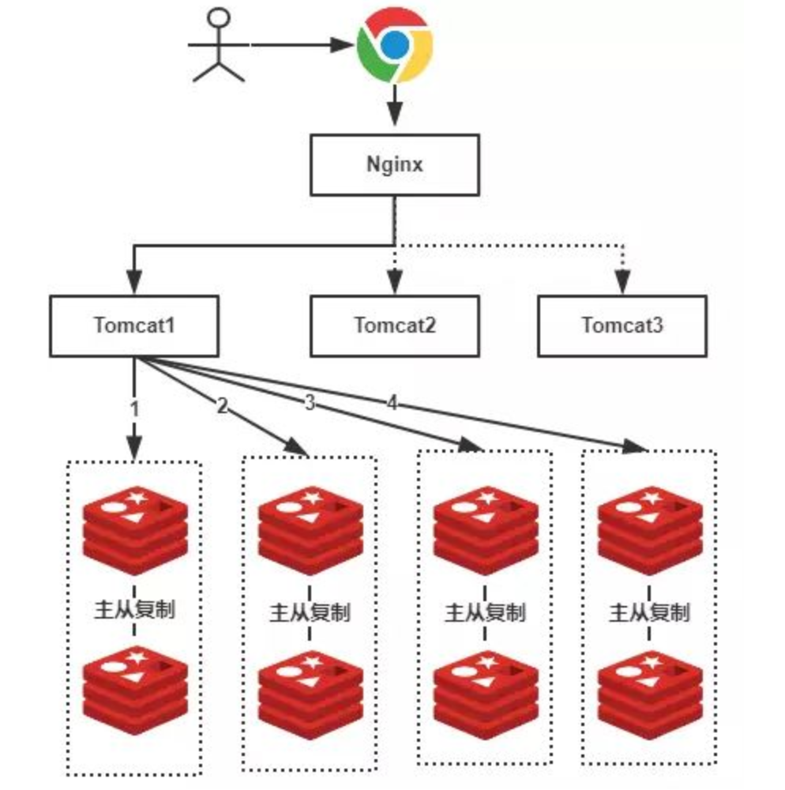
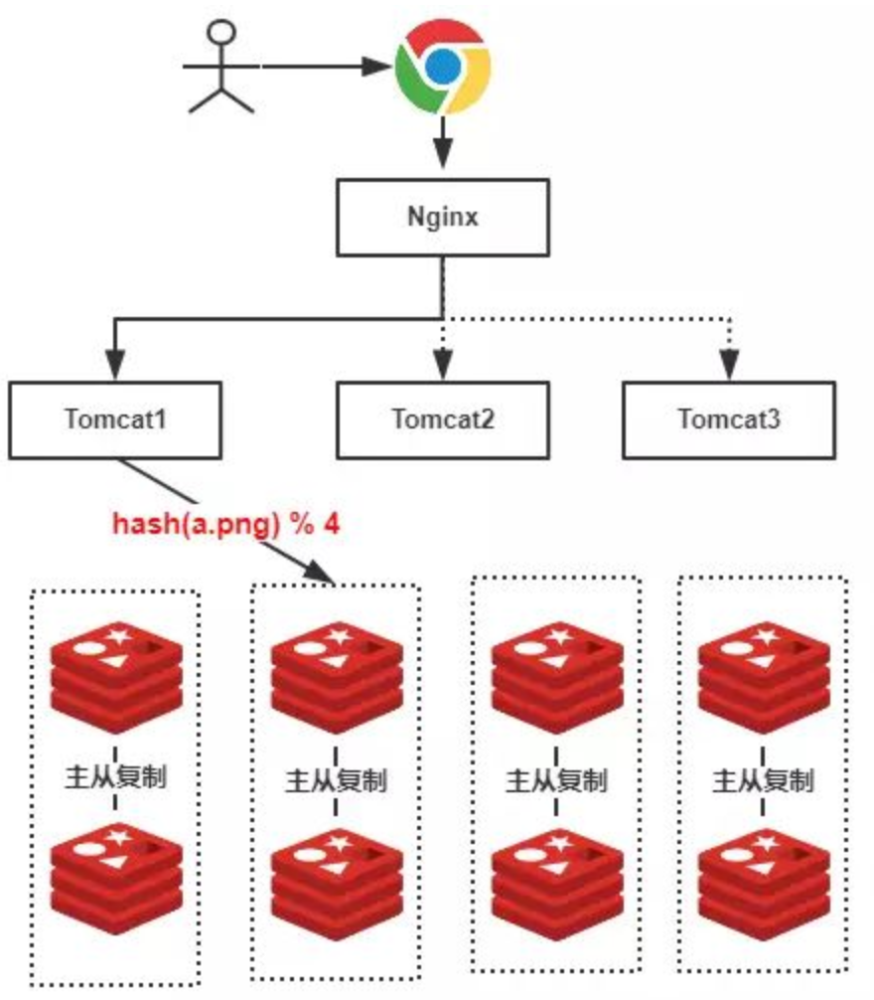
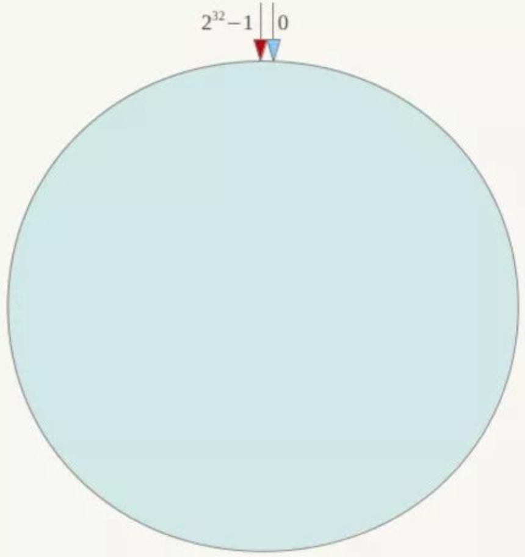
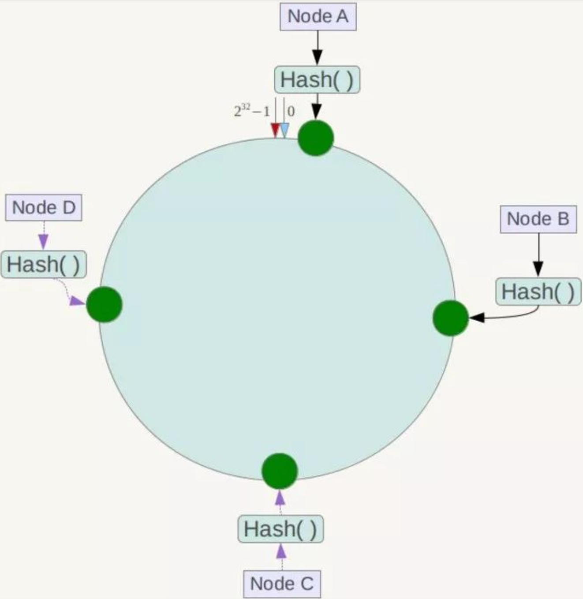
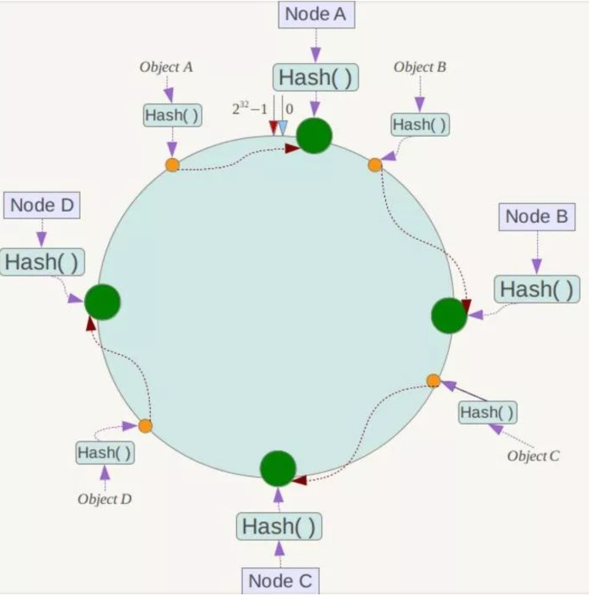
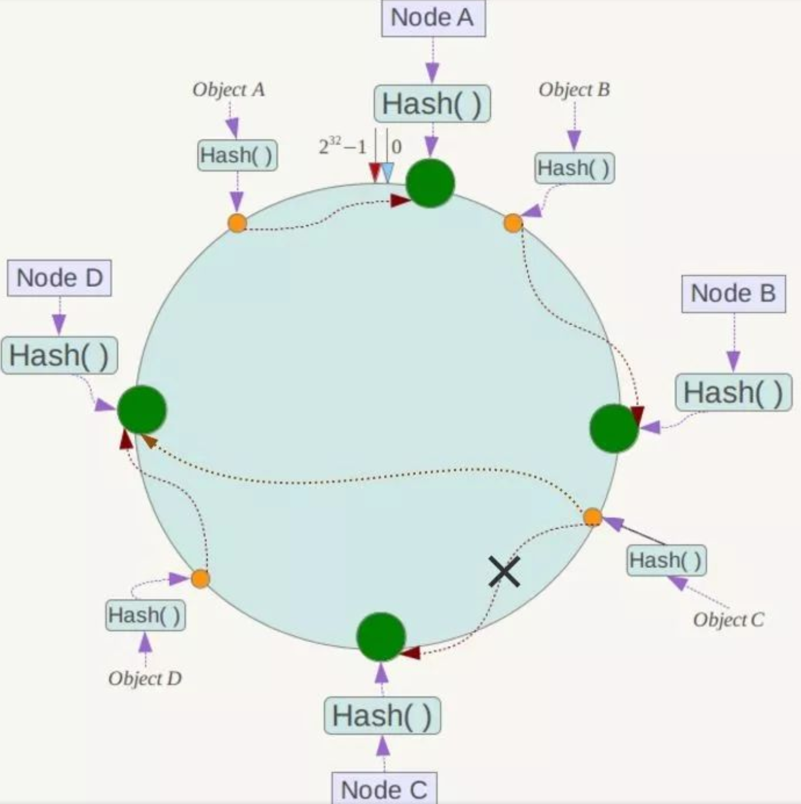
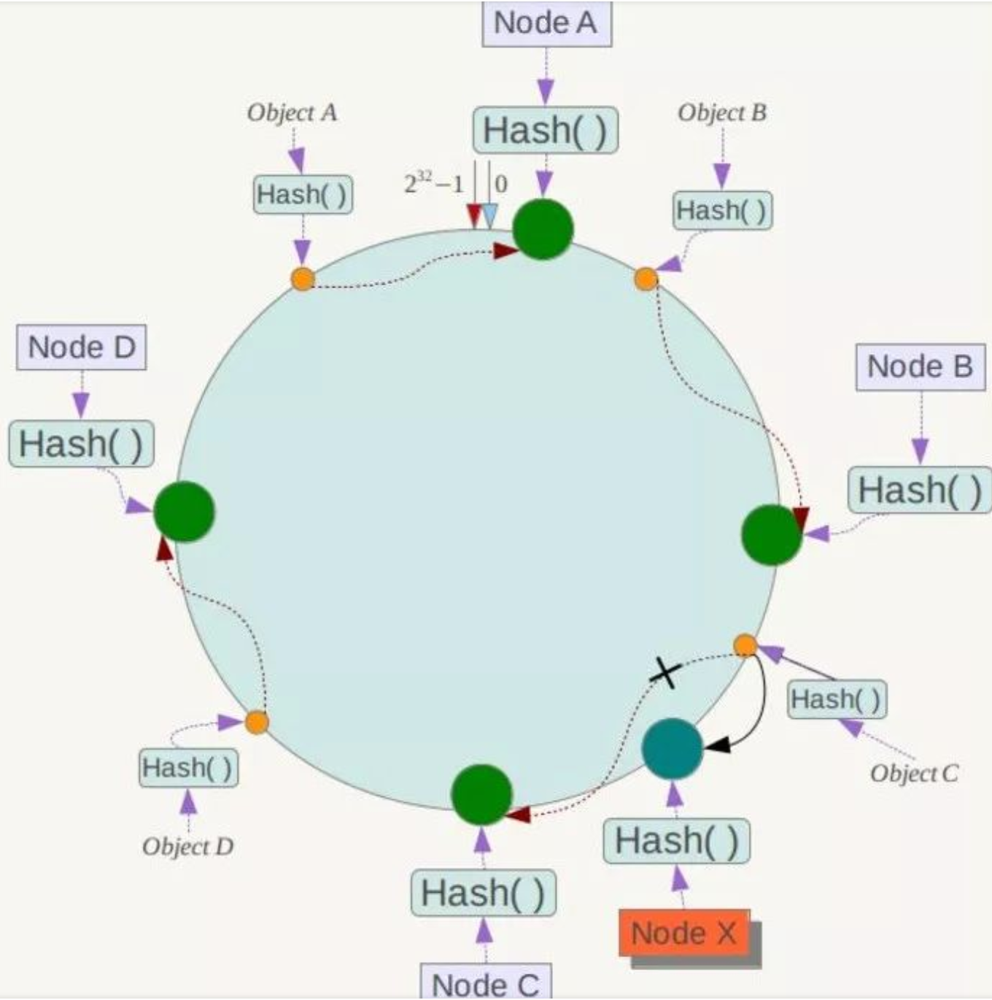
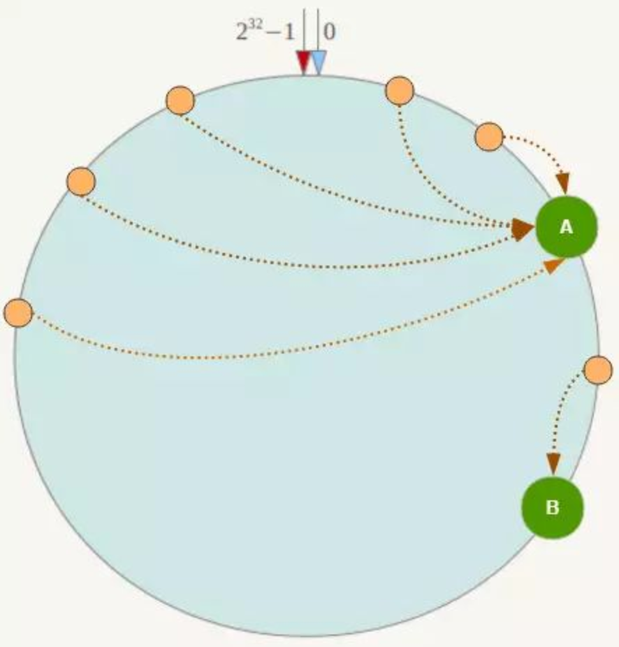
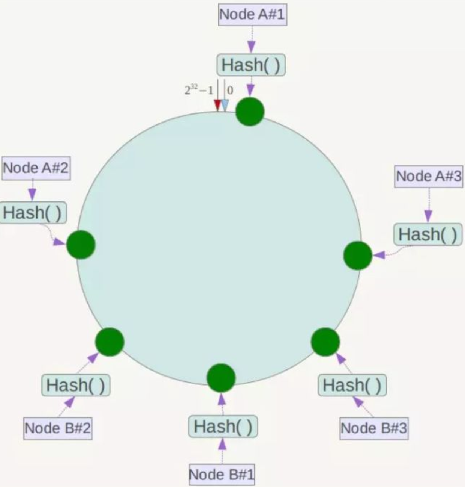

# 一致性 HASH 算法原理
## 数据分散原则
### 随机分配
比如有2000w的数据需要插入到4组 redis 的服务器中，比如使用常用的随机的方式插入,这样每组就插入500w的数据

- 优点

	解决了数据分散存储的问题
- 缺点
	- 获取数据问题

		这些数据随机存储在5组 redis 服务器中，那么读取其中一个数据就需要遍历所有5组服务器
	- 增减服务器问题

		如果需要新增服务器，如果考虑到数据分散平均原则，还需要对之前的数据进行平衡。

### HASH 方式
使用 hash 算法(一般是取模)插入数据，解决了随机分配方案获取数据的问题，可以很容易的得到一个数据存储在那组服务器，如下面算法为

	hash(a.png) % 4 = 2

- 优点
	- 解决了数据分散问题
	- 解决了读取性能问题
- 缺点
	- 在服务器变动时出现的问题

	如果服务器数量需要从4组增加到5组，那么原本的公式就从 `hash(a.png) % 4 = 2` 变成 `hash(a.png) % 5 = ？` 这样的结果就不一定是2了。所以查询数据的时候变更了算法再去获取数据的时候就可能会获取不到。同理减少服务器也是一样。

### 一致性 HASH
一致性 Hash 算法也是使用取模的方法，只是，刚才描述的取模法的对象是服务器的数量，而一致性 Hash 算法是对2^N次方取模(例子是 2^32)。

一致性Hash算法将整个哈希值空间组织成一个虚拟的圆环

整个空间按顺时针方向组织，圆环的正上方的点代表0，0点右侧的第一个点代表1，以此类推，2、3、4、5、6……直到2^32-1，也就是说0点左侧的第一个点代表2^32-1， 0和2^32-1在零点中方向重合，我们把这个由2^32个点组成的圆环称为Hash环。

下一步可以选择服务器的IP或主机名等关键字进行哈希，这样每台机器就能确定其在哈希环上的位置，下图假设将上文中四台服务器使用 IP 地址哈希后在环空间的位置如下

接下来使用如下算法定位数据访问到相应服务器，将数据key使用相同的函数Hash计算出哈希值，并确定此数据在环上的位置，从此位置沿环顺时针“行走”，第一台遇到的服务器就是其应该定位到的服务器！

例有Object A、Object B、Object C、Object D四个数据对象，经过哈希计算后，在环空间上的位置，Object A 对应 NODE A、Object B对应 NODE B、Object C对应 NODE C、Object D对应 NODE D如下：

- 减少节点问题

	现假设 Node C 不幸宕机，可以看到此时对象A、B、D不会受到影响，只有C对象被重定位到Node D。一般的，在一致性Hash算法中，如果一台服务器不可用，则受影响的数据仅仅是此服务器到其环空间中前一台服务器（即沿着逆时针方向行走遇到的第一台服务器）之间数据，其它不会受到影响，如下所示：

	
- 增加节点问题

	系统中增加一台服务器Node X，对象Object A、B、D不受影响，只有对象C需要重定位到新的Node X ！一般的，在一致性Hash算法中，如果增加一台服务器，则受影响的数据仅仅是新服务器到其环空间中前一台服务器（即沿着逆时针方向行走遇到的第一台服务器）之间数据，其它数据也不会受到影响。
	
	
- 数据倾斜问题

	一致性Hash算法在服务节点太少时，容易因为节点分部不均匀而造成数据倾斜（被缓存的对象大部分集中缓存在某一台服务器上）问题，例如系统中只有两台服务器，其环分布如下
		
	
	
	此时必然造成大量数据集中到 Node A 上，而只有极少量会定位到 Node B 上。为了解决这种数据倾斜问题，一致性Hash 算法引入了虚拟节点机制，即对每一个服务节点计算多个哈希，每个计算结果位置都放置一个此服务节点，称为虚拟节点。具体做法可以在服务器 IP 或主机名的后面增加编号来实现，在实际应用中，通常将虚拟节点数设置为32甚至更大，因此即使很少的服务节点也能做到相对均匀的数据分布。
	
	例如上面的情况，可以为每台服务器计算三个虚拟节点，于是可以分别计算 “Node A#1”、“Node A#2”、“Node A#3”、“Node B#1”、“Node B#2”、“Node B#3”的哈希值，于是形成六个虚拟节点：

	

- 优点
	- 增减节点带来的数据迁移量变小了
		- 需要将原先存储关联的数据迁移到新的节点中。这样仅影响到一台机器的数据  
		- 同理受到影响的机器也少了
- 缺点

	增加了计算量
	
	 
## 参考
- [什么是一致性Hash算法？](https://zhuanlan.zhihu.com/p/34985026)	   