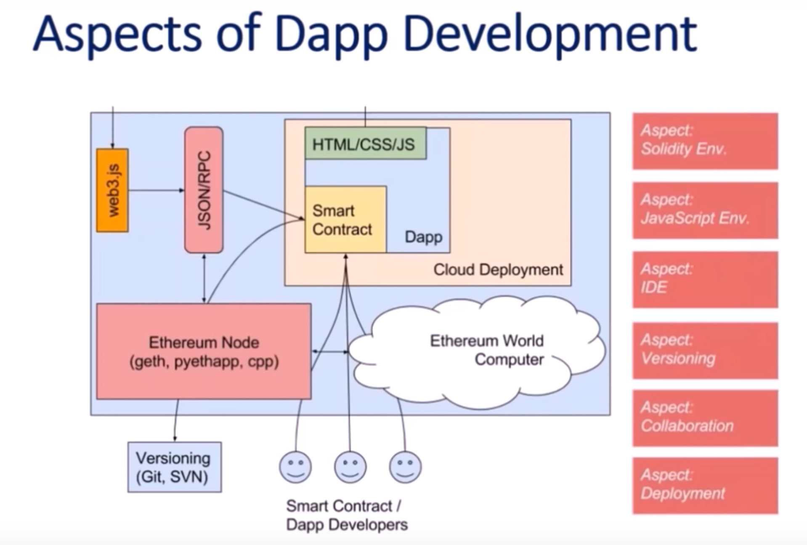

# 区块链学习
## 比特币
### 特性
- 数字货币
- 去中心化的电子记账系统
- 比特币的经济模型是金本位的模型设计
	- 黄金是有限资源
	- 黄金越挖越难
- 账本的一致性和唯一的
- 一个块只能放 1M 数据，可以交易 2000 笔交易
- 通过 10 分钟延迟来解决数据同步问题
- 通过区块链设计难以篡改
- 匿名
- 简单转账交易
- 非对称加密算法
- 规则机制
- 170 GB 总账、交易检索
- 没有监管、跨境无控制、完全匿名

### 比特币价格高的原因
- 其他代币的锚定币
- 黑产(真正价值)
- 交易所操作

### 比特币后期问题
- 算力集中(主要集中在几个矿池，作为单点挖矿的几率进一步降低)
- 算力集中控制比特币主链
- 比特币交易盗取问题
- 比特币不安全
	- 被盗
	- 交易不安全 
- 算力安全
	- 量子计算
	- 大型机算力
- 应分叉问题
- 上千种山寨币
- ico

	已区块链技术为核心，基于它展开理念做的代币。99% 骗人
- 去中心化的攻击无法得到合理解决
  
### 比特币需要解决什么问题
- 为什么要记账，以谁为准
	- 记账有奖励
		- 手续费
		- 打包奖励(只能一个人打包)
			- 每 10 分钟打一个包，每一个包奖励 50 个btc
				- 每四年衰减一倍
				- 币数总和约为 2100
			- 谁能打包
				- 工作量证明(pow)
					- 做数学题(称挖矿)  
					- 挖矿的原理
						- sha256(字符串)=256位的2进制数字
						- 块的结构
							- 块的头部
							- 内容(交易记录和账单)
						- 每人都申请打包账单(因为有奖励)
							- 根据字符串的格式来打包
							- 字符串的内容
								- 前块的头部+账单的信息+时间+随机数
								- 对上面的字符串做两次 sha256
								- hash=sha256(sha256(字符串))
								- 要求前 N 位是零，这个n就是难度的设置，n越多越难，想控制发币率，就调整这个难度即可。
								- 如何算符合要求的字符串，就是改变随机数
							- 计算符合要求后，用这个字符串作为新块的头部
						- 世界上有1w个矿机，计算能力是 14T/秒(每秒计算14T次的哈希芸算)        			    

- 如何防伪，身份验证
	- 用户注册的时候随机产生一个随机数
	- 通过随机数产生私钥字符串
	- 私钥字符串又可以产生公钥的字符串并产生一个地址
		- 私钥匙保密的
			- 它可以对字符进行加密
			- 只有一个人可以加密 
		- 公钥匙公开的
			- 可以对这个字符进行解密
			- 任何人都可以解密
	- 比特币交易流程
		- 付款者流程 
			- a 写一条交易记录
			- a 将记录进行 hash(通过 sha256)
			- a 对这个hash 进行加密，得到密码
			- a 广播，内容包含
				- 交易记录
				- 公钥
				- 加密的密码
		- 记录者流程(进行a的操作)
			- 对交易记录进行 hash，得到 hash
			- 同时利用公钥和密码进行解密，得到 a 打包的 hash
			- 然后对比
				- 如果想等就认可
				- 如果不一样就是伪造         
- 如何防止双重支付或者额度不够怎么办
	- 如何检查余额解决额度问题
		- 通过追溯交易记录得到余额
	- 双重支付
		- 交易记录会产生两条支付记录
		- 产生的交易记录都会记录在产生的区块中
		- 任意一边支付交易记录的人挖到矿就会把他的记录链接到区块链去
		- 另外一边支付交易记录的人看到新的区块链生成，就会放弃自己的块，交易失败
		- 所以交易后，必须等待块已经形成了记录在主链上才算真正的交易成功，否则可能交易失败，即使记录系统提示成功
- 防止篡改，账单以谁为准
	- 已谁为准	 
		- 最长链原则
			- 当一个新块同时产生了两个
			- 看下一个新块链接到那个之前的新块去，链接到的那个链就是最长链，它就是主链，而其他的链就废弃
	- 防止篡改
		- 因为有最长链为原则，所以除非计算力大于世界上进入比特币系统的算力，否则很难实现篡改
		- 增大篡改难度，比如在主链形成了6个块，才认可交易成功

### 比特币有什么问题
- 吞吐性能
	- 10 分钟 2000 笔交易 

## 区块链企业级应用实践
## 区块链问题
- 同步的问题
	- 挖矿 10 分钟
- 数据总数和它的功能效率
	- 170 GB 且一直增长的数据中， 检索   
		
## 以太坊
### 特新
- 区块链+智能合约，第二代区块链
- 开源社区
- DAPPS(开发工具)
- POW+POS(工作量+权益)
- 交易费
- 脚本语言
- 公、私、联盟
- ETC
- 同样效率低

### 什么是智能合约(区块链上执行的业务逻辑)
在区块链记录的数据，以及这个数据运行的逻辑，做成自动化可触发的合约。

从技术上讲，智能合约就是代码状态机，达到什么状态，触发什么操作
### 分拆
- 软分叉 
- 硬分叉
	- 以太坊 fix bug(去中心化的理念颠覆)
	- 必须得到所有节点统一
	- 否则就是硬分叉

### 以太坊架构

### 以太坊问题
- 100w 开发应用，4w 个安全问题
- 性能问题

## 企业落地
区块链的企业落地的主要目的是基于现有数据和信息，打穿隔离墙、壁垒、边界来提供安全的数据和数字化服务。

- 开放性
- 不宜篡改
- 匿名
- 去信任
- 分布是
- 去中心化

### 企业落地有
- 公有链

	面向所有大众
- 私有链

	公司内部的有限节点能参与共识过程
- 联盟链

	机构内部和选定节点才能菜鱼共识

### 供应链落地
在没有区块链的情况下，企业和企业之间的继成需要进行

- 门户集成
- 数据集成
- 应用集成

区块链相当于企业和企业之间的 CICD 的管道，通过智能合约最大化的完成企业间的自动化合作

区块链粘合中心化才是真正有效的提供真正的服务 

## 参考
- [Yang Bin（杨斌）--刨析 区块链（Blockchain）、比特币、ICO 和区块链企业应用实例、场景（CRM、ERP、Financials、AI、IOT、BaaS）](https://www.youtube.com/watch?v=nnD0F1DVKT0)
- [比特币和区块链啥原理？矿机挖矿咋回事？李永乐老师讲比特币(1)](https://www.youtube.com/watch?v=g_fSistU3MQ)
- [比特币和区块链啥原理？矿机挖矿咋回事？李永乐老师讲比特币(2)](https://www.youtube.com/watch?v=pbAVauYsqP0)

  