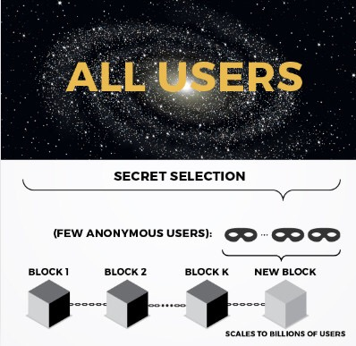
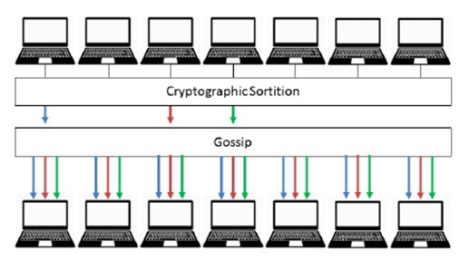
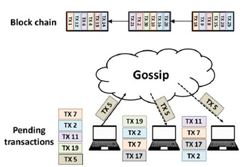

# 学习 algorand 算法(公有链算法)
## 介绍
Algorand 是由 64 岁的图灵奖得主、美国麻省理工学院计算机科学与人工智能实验室（MIT CSAIL）教授 Silvio Micali 提出，项目由 algorithm （算法）和 random （随机）两个词组合而成，从字面意思中可以看出，Algorand 是基于随机算法的公有链项目（Public Chain）。Algorand 具有能耗低、效率高、民主化、分叉概率极低、可拓展性等优点，旨在解决现有区块链项目存在的「不可能三角」问题。Micali 教授对能耗和环保非注意，所以没有使用 PoW
## 优点
- Algorand 的技术创新体现在 VRF 以及加密抽签的机制，因此达到很高的安全性以及快速性；
- Algorand 兼顾去中心化三大需求
	- 中心化（Decentralization）
	- 可扩展性（Scability）
	- 安全性（Security）
- Algorand 团队属于区块链领域的顶尖团队(MIT)；

## 项目情况
- 项目粉丝活跃度表现属中等靠上水平，相比团队实力，粉丝活跃度并不算高；
- 路线图信息不算透明，代码目前尚未开源。

## 当前算法的优缺点(去中心化命题)
未来 PoW 和 PoS 共识机制会应用在不同场景的区块链上，基于 PoS 效率更高的特点，如果确实在安全性上实现突破，PoS 共识算法的应用场景可能会更多一些，也会带动一大批项目转投 PoS 阵营。
### PoW 共识
- 优点
	- 安全性高 
	- 相对去中心化
	- 不容易被攻击 
- 缺点
	- TPS 极地
	- 大量浪费在工作证明
	- 后期会产生算力集中而共识集中的可能
	
### 中央管理机构共识
- 优点
	- 非常高效
	- 易于实现
	- 能保证出块的快速性
	- 最终性 
- 缺点
	- 需要极强的信任假设
	- 因为趋紧中心化共识，容易被攻击
	- 攻击后无法快速恢复交易

### 固定议会
- 优点
	- 效率高
	- 易于实现
	- 相对安全

		议会成员对区块进行数字签名进行认证 	
- 缺点
	- 需要极强的信任假设
	- 后期可能产生腐败等问题
	- 因为趋紧中心化共识，容易被攻击
	- 攻击后无法快速恢复交易 

### 轮值议会
- 两种算法
	- 从固定议会中随机获取仲裁员
	- 多个固定议会随机获取
- 优点
	
	同固定议会
- 缺点

	同固定议会

### algorand 算法
Algorand 旨在成为一个真正的去中心化区块链，其去中心化的设计思路与上述方法都不相同。每个新区块是由一个独立的新议会产生，这个议会从所有用户的集合中随机选出。在议会选择上，Algorand 的独特的创新是加密抽签，用户是唯一知道自己是否成为议会成员的人，已放置攻击者获取议会成员，因此不能对他们进行贿赂或发起拒绝服务攻击。Algorand 每次都更换区块产生者，这意味着不需要一个固定议会。

## 可扩展性(这里的扩展是业务能力扩展)
需要建立统一的标准，评价维度主要是 TPS 和达到最终性的时间，建立相同的假设条件。

- 准入模型

	分为两部分，许可模式的系统通常更容易构建和扩展，不需要担心无权限系统出现的女巫攻击 (sybil attacks)
	
	- 无许可模式加入系统
	- 由许可模式加入系统
 - 直接参与、委托或抵押

	在一个理想的去中心化区块链中(algorand)，每个用户都应该能够参与共识协议。将「投票权」委托给代表应该是用户的权利，而不是系统运行的先决条件。而 DPoS 是由系统准备好选举池
- 传播网络类型

	网络类型分
	
	- p2p 传播网络

		交易和共识消息在 p2p 网络中传播到每个节点，这意味着节点必须将每个事务传播到其所有节点。
	- 中继传播网络

		中继传播网络可用于加速事务和底层共识协议的消息的传播。中继传播网络旨在优化性能，但也必须抵抗各种攻击。
- 链上处理和链下处理

	在区块链系统中，所有事务都记录在区块链上，任何人都可以检查。目前闪电网络等技术可以在链下执行额外的事务。因此，在分析区块链性能时，必须说明在区块链上处理了多少事务，以及有多少事务在链下处理。线下不属于区块链的性能范畴。
- 带宽分配

	分配更多带宽的节点可以更快地将事务块传播到它们的对等节点。在对块链系统进行性能分析时，必须对所有参与节点的带宽分配做出准确的假设，这也能从侧面反映出普通用户是否可以参与其中。
- 设想的安全模式

	在安全和性能之间总是需要有所取舍的，做到快速和不安全是很容易的。区块链应该是安全的，能抵抗拜占庭节点的攻击、应对与共识的节点的外部攻击 (例如拒绝服务攻击)、对激励机制的攻击、网络攻击等。		
- 压缩机制

	用于交易和区块的压缩机制会影响系统的总体性能。简洁的编码方案可以将节点对带宽的需求最小化。区块链系统必须清楚地表明对交易大小的假设和任何通过网络传播的附加消息
	
## 安全性	
Algorand 采用的去中心化方案也在一定程度上保证了安全性，对于任何网络攻击都是安全的，即使恶意者能够完全控制网络，并规定哪些用户可以接收到哪条消息，算法协议也永远不会分叉，用户的余额保持安全。	

同时，Algorand 也能够从分区中快速恢复。当用户在一段时间内被分区之后，用户进入恢复模式。在这种状态下，用户不断发送恢复消息。在被攻击期间，这些消息不能很好地传播。然而，攻击后这些消息会迅速传播，这使得 Algorand 几乎可以从分区攻击中立即恢复。网络攻击可以在任何去中心化的系统上执行，最好的方法是增加对手攻击区块链的成本。Algorand 可以立即从分区中恢复，使得攻击成本非常高。

在用户级别，协议级别和网络级别受到攻击，Algorand 都可以保证安全。
### Algorand 设计思路
#### 纯粹的股权证明（Pure Proof of Stake）
Algorand 采用的共识算法是纯粹的股权证明（Pure Proof of Stake，Pure PoS）。在这种公式算法中，每一枚 Token 都拥有相同权利，并且不需要作为抵押。新的区块是通过投票产生，每个人都可以参与或授权。
#### 超快速拜占庭协议
Algorand 通过「即时提议与确认（Immediate Propose and Agree）」来形成共识。这是一种「超快速拜占庭协议（Byzantine Agreement，BA*）」。拜占庭协议是普遍运用于区块链的通讯协议模式。

Algorand 的共识机制分成两个步骤

- 提议
- 达成共识

实用拜占庭容错算法（Practical Byzantine Fault Tolerance，PBFT）是首个实用的在异步分布式网络中实现拜占庭容错的共识算法。算法应用于一个分布式文件拷贝系统。系统中共有 3f+1 个复制节点，其中最多 f 个拜占庭错误节点。系统中的每个复制节点都运行一个有限状态机的副本，并且支持若干种操作。

PBFT 算法包含一个三阶段的协议

- 预准备
- 准备
- 确认

预准备和准备阶段是保证所有正常节点按照相同的顺序执行所有有效的用户请求，而 BA*可以完成即时提议与确认。

#### 解决分叉问题
通过这种共识机制，Algorand 解决了区块链中的分叉问题，使其成为一个可以持续「进化」的公链。由于区块链的去中心化设计，每个节点都必须保持一致，这使得单纯的系统升级在区块链上很难做到，每当改变规则，很容易导致系统分叉。但 Algorand 却是几乎不会出现分叉的分布式账本，因为其分叉的概率低至 10-18，这相当于如果每一秒出一个块，那么从宇宙大爆炸到现在 Algorand 只会分叉一次。交易能在几秒钟内得到确认，通过 Algorand 的转账资金立即可用。但是分叉概率是计算方法暂时没公布。

对于网络不在强同步的情况下（即两个区域因网络延迟问题提议了两个区块），Algorand 网络将会出现分叉。白皮书中提到这不影响 Algorand 的安全性，但会影响 Algorand 网络内的活跃度。在给定的 S 时间内，因为不同分叉区块上的议会成员将拥有不同的区块信息，也就意味着他们不会计算彼此对区块公证时的投票数，因此没有足够的票数将达到人数阀值，BA_将无法在更多的分叉区块上达到共识。而此时 Algorand 将会提出一个所有用户都统一的分支，并且运用 BA_共识来使用户确认是否应该切换到此分支。在全网弱同步的情况下，若时间超过 S，Algorand 网络就完成不可逆的分叉，不能恢复。这里的 S 只是一个系数，具体参数并未提及。
	
## Algorand 技术分析
### 加密抽签
加密抽签用密码学的方法来产生一个随机数生成器，用来决定下一个区块的提议者或验证议会成员，这一随机数生成的概念是 Algorand 的核心技术亮点之一。这其中将使用可验证随机函数（Verifiable Random Function，简称 VRF）来实现随机数的产生，而这个随机函数正是由 Algorand 创始人 Micali 于 1999 年的一篇论文中提出。值得一提的是，Dfinity 项目中随机数的生成也采用了 VRF。VRF 作为一种基于密码学的函数，在区块链领域内能带来3点优势

- 快速共识
- 抗攻击性
- 极低算力

#### VRF 的主要运行机制如下
每一轮的选举都将会将一个种子（seed）作为 VRF 的输入，随后 VRF 将输出一段随机哈希值（作为下一轮的种子输入）以及π（π是此轮次内被抽签选中的用户证明）。这里的种子也就是哈希输入值，创世区块的种子将使用分布式随机数生成器（Distributed Random Number Generation）来产生。

- VRF 里的随机定义为

	一个理想的哈希函数，其值域应该是离散的、均匀分布的，给定不同的输入值，其输出应该没有规律，随机的洒落、分布在值域区间内。因此，可以达到完全的随机性。
	
在进行加密抽签前，Algorand 将预先决定需要抽取的人数τ。第 r 轮的种子将会被 r-1 轮的 VRF 所决定，并且每一轮的种子以及π都会被记录到此轮次内的区块中。这里每一个轮次的种子都与上一轮的种子信息一一相关并且绑定，VRF 的存在也使得恶意者对于 VRF 的输出无法进行预测，使他们无法预知谁将成为下一个轮次的中奖者，很大程度提高了 Algorand 的安全性。

同时，一旦 Algorand 在第 r-1 轮的区块达成一致后，全网都将知道第 r 轮开始时的种子。如果第 r 轮的区块提议过程中有恶意者的参与并且打包了一些无效交易信息，那么大部分诚实用户都会将此区块认定为空（无效）区块，在第 r 轮的种子（seedr= H(seedr−1 ||r )）将重新通过加密哈希函数 H （可假定为随机预言机）来决定。

Algorand 的加密抽签机制使得每一个轮次的中奖者都具备不可预测的随机性，并且拥有加密哈希函数 H 作为备选的随机函数方案来保障 Algorand 系统内的安全性以及公平性。因为在每一个轮次内仅有一个区块将会被大家所公证并且达到最终性，如在第一时间内发现此区块存在被攻击的可能性或有恶意者进行了区块提议，则此区块还未进入到验证阶段即被否定，并且重新进行区块的提议过程。这也将 Algorand 主链分叉的可能性大大降低，同时缩短了区块确认的时间，使得类似小额支付等应用场景在区块链上变得不再遥不可及。

### 区块公式流程
#### 区块提议

区块提议分为两个部分

- 选取动态议员(加密抽签)

	所有的 Algorand 网络用户都可以进行加密抽签的方法来决定谁将在这一轮次内进行区块的提议(决定共识参与者范围，减小数量增加效率)。

	用户的账户余额将决定被选中成为议员的概率（拥有越多数量的 Token 将拥有更高的概率被选中），并且给予每一个被选中用户一个优先级别（priority）以及拥有此优先级的证明。
	
	整个加密抽签的过程可以类比为一个人中彩票的过程
	
	1. A 去彩票店买彩票，当然他花的钱越多中奖的概率也越大（Pure PoS 保证了账户余额越多选中概率越高）。
	2. 等到开奖的那天（加密抽签结果公布），只有 A 自己知道有没有中奖，所有其他买彩票的人并不知道谁中了奖（仅有区块提议者知道自己被选中）。
	3. 假设 A 中了奖，那么在领奖的那天 A 带着彩票去领奖并且出示他的彩票，届时大家都将知道 A 获得了大奖（提议区块并且公布身份）。
	4. 恶意者在此时若想再对区块提议者进行 DoS 攻击、合谋等都将变得毫无意义，因为一旦区块提议者公布了区块提议后他的身份将恢复为普通节点。
	
- 生成区块
	
	在加密抽签完成后，每个人的身份都是隐秘的，用户间都不知道谁被选中。直到每个被选中的区块提议者在全网公布了他们各自的区块提议后（公布的信息内同时包含区块提议者的优先级以及优先级证明），区块提议者的身份才会暴露，被提议的区块随后将在全网内进行Gossip协议传播。
	
	而这些被提议的区块中拥有最高优先级的区块将作为下一轮的待定区块，在全网内等待着被议员会成员公证，最终以达到共识成为下一个区块，优先级低的区块将被全网内的节点所忽略，并且不会再次被Gossip协议所传播。

由于拥有最高优先级别的区块提议者（这里简称 Leader，即此轮区块的成功提议者）的身份在被揭晓后，网络已经完成了区块数据的广播，即使恶意者攻击了真正的 Leader 也无法改变区块内的数据信息，这也很大程度上保证了 Agorand 的安全性。但上文中所提到的优先级别的程度是如何划分、以及具体的区分机制等并未在透露。

Algorand 白皮书中提到区块提议者的人数将极大概率保持在（0, 70）人的范围内，而 26 人将会是一个较为合理的人数。具体的人数也视全网节点数而定，在节点数增加的情况下，为了保证 Algorand 扩容性的同时也需要足够的人数来提供安全性。

#### 议会对区块进行公证
Algorand 将会选取一定数量的议会成员作为验证者来对最高优先级区块进行验证，选取的过程也将采用加密抽签的方式。议会成员对此区块的真实性进行验证签名，并且公布验证结果以及抽中作为议会成员的证明，而这些信息将通过Gossip协议进行全网内传播。信息一旦发布，议会成员的身份才被曝光并且将立即恢复到普通节点。

Algorand 独特的 BA* 共识需要达到全网 2/3 的节点公证签名，区块即完成最终性。若在上述的公证过程中，全网并未达到足够人数对区块的签名，则继续下一轮的加密抽签以及上述的公证过程直至全网 2/3 的节点达到共识，此刻区块达到最终性。

每一轮的加密抽签选举都是随机并且自愿选举的，因此选取的议会成员人数在每一轮也都不相同，这样使得每次的议会成员都无法预测，降低了验证者被攻击的可能性。因为加密抽签的快速性，通过重复地进行小范围内议会共识以及Gossip协议的传播能减少带宽，并且缩短区块的出块时间。

图展示了全网在拥有 7 个节点的情况下，3 个议会成员对一个区块进行公证的步骤，当然后续若想达成共识需要（7_2/3=14/3）约 4.66 个节点的签名公证，因此需要再重复进行加密抽签以及公证直到全网达到 BA_共识。

#### 总体归纳顺序
1. 通过随机算法选出参与选举的议员（0, 70）
2. 选举出来的议员比持有 token 大小，选出最大的(优先级最高)
3. 从没被选出的议员中，随机算法选出签名的议员。为最高级区块签名，证明合法性。(公正)
4. 被公正的区块进行广播发布
5. 广播后，议员身份恢复普通
6. 全网节点对区块生成进行监听，得到广播信息后进行签名共识
7. 全网 2/3 节点签名共识后，区块达成一致

## 不可能三角
### 去中心化
虽然并不会让全网节点参与区块的提议或公证，但是加密抽签的独特机制带来的随机性使得区块提议者以及验证议会成员完全不可预测，作为节点都拥有参与加密抽签的权利。但是，PoS 共识机制无法避免的是：Token 权重越高的人拥有更高概率能被选中作为区块提议者，而这会让权利都集中在 Token 多的人手中。Algorand 考虑到了这一弊端，在此环节做了优化：相较其他 PoS 共识的公链，Algorand 抽取多个区块提议者，给予每个人的优先级别不同，但优先级别具体的机制尚且不清。这样的设计主要也是想在 PoS 的机制中能尽量做到更加去中心化。

Algorand 节点的参与是无需任何许可的，也并没有对接入设备拥有高要求，即任何人拥有设备都可作为节点参与记账。全网内节点之间的交流是通过 Gossip 协议（Gossip Protocol）来完成，也就是说在区块提议阶段每一个节点都将在全网内进行交易信息的监听行为，并且收集信息装入区块。因为节点预先是不知道自己将作为下一个区块的提议者，所以每个节点要随时进行全网的监听以及信息搜集以确定自己是否成为下一个区块提议者。这种与比特币相同的全网传播机制，网络遍历时间将会被拉长，但每个节点都参与记账的同时也保证了 Algorand 的去中心化。

但随着后期账本数据的增多，一些普通节点的服务器内存可能负担不起庞大的数据量，而一些大型服务器可能将主宰全网的节点，使得全网去中心化的程度被削弱。节点加入 Algorand 网络并不需要从创世区块开始同步所有的数据，因此可能会将节点设备的门槛降低，但设备具体需要的配置以及后续账本的大量数据如何解决暂且没有明确答复。

总体来看，目前 Algorand 区块链去中心化程度要高于任何 DPoS 和大部分 PoS 共识的公链。

### 可扩展性
Algorand 独有的共识机制使得每一次有且只有一个拥有最高优先级区块被公证，也意味着 Algorand 区块链几乎不会分叉，所以只要下一轮新区块的出现也就意味着后续区块可以安全的直接接在前一个区块之后，而区块的出现也意味着其中的交易信息都将完成最终性。Algorand 的共识协议每隔几秒就能完成对区块的验证，造成非常低的延迟。

同时，加密抽签的快速性以及小范围内委员会成员对区块的公证都将给 Algorand 区块链带来高吞吐量。

- 性能测试

	据 Algorand 白皮书中描述，在测试了 Algorand 系统在 1000 个 EC2 虚拟机上的性能，模拟了在高达 500,000 个用户的情况下，Algorand 在 1 分钟内达到了交易确认，实现了 125 倍比特币的吞吐量，并且对于增加更多用户来说对性能并没有损失(表示怀疑)。

目前市场上的大部分公链，宣称其 TPS 可高达几十万级别以上，但目前实际落地的项目仍寥寥无几，而主网已上线的 EOS 在牺牲去中心化的条件下 TPS 也才刚达到千级别。对于 Algorand 来说，若主网落地时 TPS 能保持测试网的性能，那么在不牺牲去中心化以及安全性的情况下已经能满足目前市场上大部分应用场景。
### 安全性
在安全性方面，Algorand 做了许多考量，主要体现在以下几点

- 诚实节点的权重

	据 Algorand 称，若全网内诚实节点拥有 Token 权重只需要达到一定的比例（大于 2/3），那么 Algorand 主链就可以避免分叉以及双花的可能性；
- Pure PoS

	Micali 提出的 Pure PoS 的机制并不会通过用户 stake 的 Token 价值来决定加密抽签的概率，而是采用用户余额数量来选定中标用户。这样通过余额的方式给予权重，避免了攻击者伪造多个身份增加其被选中的概率，从而进行女巫攻击
- 加密抽签的机制

	通过加密抽签的随机性来选择区块提议者，让区块提议者在不对外公布区块提议前，个人身份得到隐藏，使攻击者无从下手。而每一轮的区块提议者都重新使用 VRF 进行加密抽签，增加了随机性以及不可预测性，加强安全性；
- 委员会的替换

	一旦验证委员会成员在全网发布了信息（对某一轮次区块的签名公证），他的身份就变得公开，但同时他将变为普通节点，而在下一轮的委员会选举中将重新进行选举。对于一个区块的公证，需要随机选出多轮委员会成员直至达到 BA*共识。即便在一轮内选到了多个恶意成员，那么他们进行一次公证后就失去权利，这样能使权利随机的分散到全网内的各个节点，使得攻击者对全网作恶、以及控制的可能性大大降低。

## 对比

	
## 区块链基础知识
### 区块链主要扩展方法
- 区块扩容

	一味的提高区块体积上限，则面临着区块块的传播与存储问题；
- 分片技术（shard）

	缓解扩展性问题，大幅提升了吞吐量（tps），但在交易费用和延迟方面提升不够；
- plasma或侧链技术

	可以大幅提升扩展性，缓解交易费用问题，但在延迟(最终一致性)方面依然没有得到很好解决；
- 状态通道技术（state channels）

	闪电网络、雷电网络、移动雷电都是属于链下通道技术。它有望实现大部分的高频转账功能，而大额、非高频的转账仍然通过区块链上进行。
		
### 闪电网络
因为处理能力有限(TPS 7-30)，所以有大量的交易积压，那么打包记账矿工为了自己的利益，只会合并高额交易，这样高频、小额交易就无法及时处理。

闪电网络提出了改进的方案，其理念是，在区块链之外开通一条“绿色通道”，将大量高频的、小额的交易在区块链外进行。(链下进行,其实违背了区块链设计思想)

			 
## 参考
- [一文读懂 Algorand 算法，彻底消除区块链「不可能三角」](https://www.chainnews.com/articles/105959325794.htm)
- [什么是闪电网络？干货都在这了！](https://www.jianshu.com/p/233b192dc4dc)