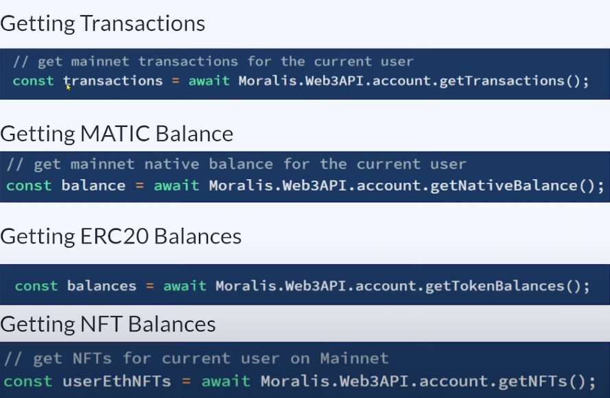
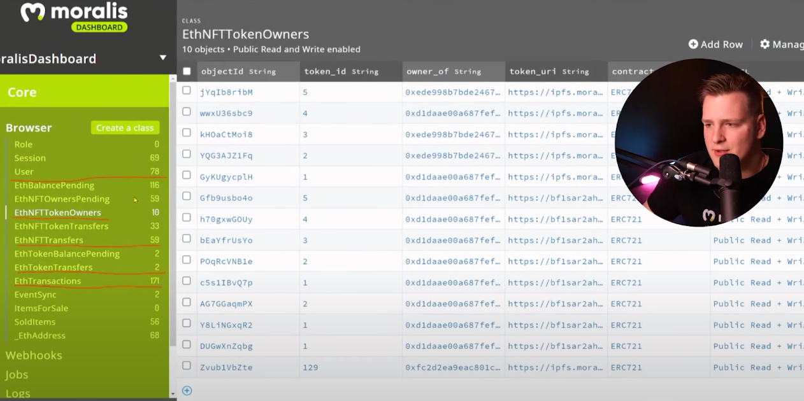
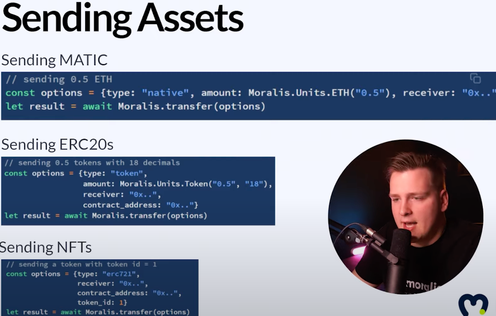

# Dapp 开发需求
## 基础需求
- 需要用户登陆，获取他们的数据，如
	- 进行了什么交易
	- 拥有什么资产(包括nft、token余额)
	- 合约的事件 
- 合约和用户的实时交互(用户通知或者告警 )
- 建立区块链数据索引
- 发送交易

## 直接使用节点 RPC 服务的问题
使用以太坊的 RPC 是一个很错误的决定，因为区块链是一个慢速系统，无法对应业务的所有查询，比如你想知道过去三周 NFT 市场中交易量最大的用户，这个是不可能从以太坊 RPC 获取到的，因为节点提供的 RPC 功能不是数据库，你的业务无法直接使用以太坊的 RPC 来获得过滤、聚合等数据库功能
## Dapp 需要使用 RPC 扩展服务
综上所述， Dapp 需要围绕以太坊节点 RPC 进行扩展构建整个技术体系，才能得到应用想得到的一切，这里功能包含

- 索引
- 验证签名

	登陆用户都必须得到后端的验证
- API
- Sockets

	如何通过 socket 来实现实时通讯能力，来提供实时交换或者实时游戏体验
- 数据库

	如果有用户访问数据库，就必须验证他们的签名，并且获得数据库同步以太坊的数据，包含代笔余额、NFT等，所有这些都必须保持同步，而且必须有足够设计精良的索引，比如，你想知道所有用户的 NFT，你不能从一个节点获取
	
	数据库提供以用户为中心的索引查询，基础4部分
	
	- 获取用户的交易
	- 获取 eth 余额
	- 获取 erc20 余额
	- 获取所属 NFT 

	
	
	数据库使用 mangodb 通过异步调用方法对数据进行
	
	- 查询总积分排行榜
	- 按名字查询游戏积分排行榜

	索引智能合约事件
	
	
	
	- 提供所有事件主题
	- 提供对过去的事件自动同步
	- 对新事件的实时报警，因为这个是实时增加到数据库中的
	- 获取实时的socket 通知
	- 合约升级可以轻松更新升级数据库对应格式，subgruph
- 用户生命周期管理
- 智能合约数据同步
- 交易同步
- 发送资产

	应用只需要知道什么资产、在什么合约、发给谁、发多少就行了，其他的全部由后台封装  
	

	用户在链上的所有动作，都要实时同步到数据库

## 构建真个体系需要
- 提供基础设施
- 提供数据库
- 提供同步服务
- 提供登陆服务
- 提供所有设施和程序的维护
- 提供一切，并且

这一些拖慢了整个 Dapp 开发者真正的商业模型创建和增加了试错成本，加大了错误的成本

 
## Dapp 需要做的事情的抽象
- 用户登陆
- 获取余额(原生、nft、token)
- 获取交易
- 获取智能合约事件
- 实时告警(合约和用户)
- 建立数据库索引同步链事件
- 发送交易

## Dapp 种类
- nft 市场
- 钱包
- Defi 仪表盘
- 跨链网桥
- nft 游戏
- 币市场(交换)
- 等等

## 插件
- 积分和法币兑换插件(共链需要)

## 跨链方案
- 默认支持所有链
- 随着平台的升级，链支持更多，应用就会支持更多链，通过平台屏蔽链
	- 相同的应用方法定义 