# Ledger Live 硬件 key 问题
因为最近工作需要使用硬件钱包来进行安全加强，使用中遇到很多问题，就此记录
## 1 软件网络链接异常解决方案
### 问题
当更新了 Ledger Live 软件以后，可能需要初始化软件后验证硬件key正版或者密钥已经初始化好，但需要点击我的 Legder 来安装硬件钱包的内部软件,如

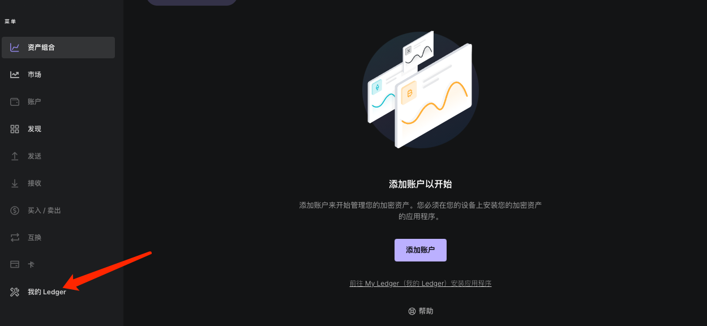
那么点击后就进入无限加载或者会出现各种网络异常报错，比如

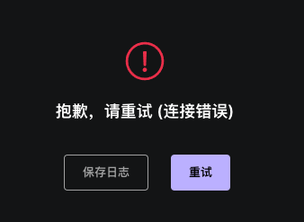

或者

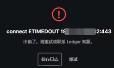

其他什么类型的网络报错等，那么说明所在 ISP 已经不提供硬件钱包的服务，那么就需要通过其他方法来进行

### 解决方法
#### 简介
- 首先你需要有一个网络工具，类似 ss ，或者 V2ray 这类的

	大同小异，共同使用的是 7层建立通信，比如 socket 或者 http.具体原理这里不在介绍，参考视频使用 v2ray ，而我这里使用 ss 来做，为什么没有使用 v2ray，因为测试过，使用不熟悉没调通。这里掠过工具使用详情。
- 需要安装一个名字叫 Proxfier 的软件

	这个软件的主要作用是劫持主机软件的请求流量到网络工具中建立的网络，具体不表。当然原理明白了，类似同类型的软件也应该可以，我之前用过类似的，但在 win 上。

#### Proxfier 设置
安装因操作系统不同就不说了，这里仅说配置，以 mac 为例

1. 设置服务器

	这里就是软件流量导入的网络，这个设置你懂的

	- 	
	- 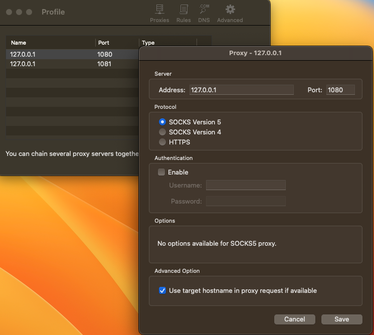
2. 设置代理规则

	这里默认有的网络有 local 和 default ，视频中介绍要设置网络工具到直连网络，我一直很奇怪，后来才知道，如果 default (所有软件)要设置引入网路，那么网络工具也会在其中造成环路bug，所以必须设置。
	
	- 设置网络工具规则

		注意2个问题
		
		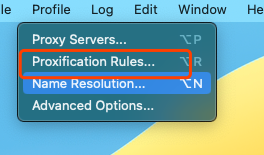 
		
		- 流量设置直连
		- 要设置2个规则
			- 一个是对 ss
			
				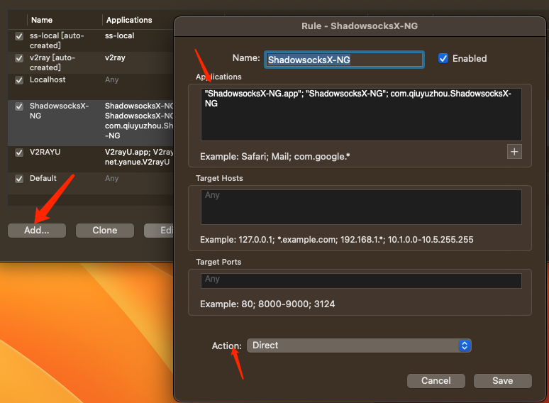 
			- 一个对 ss 后台

				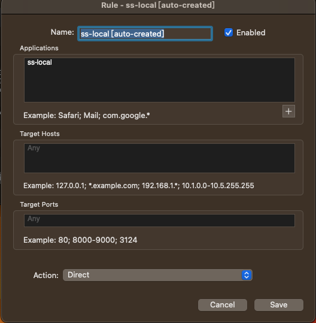 
			- 设置检查

				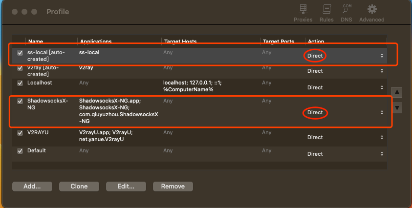
		- 设置 Default 规则
	
			流量导入网络工具
			
			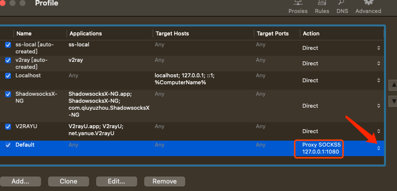 
		- 关闭配置页面		
	- 设置 DNS
		- 选择设置
	
			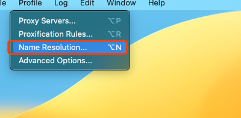 
		- 选择远程解析
		
			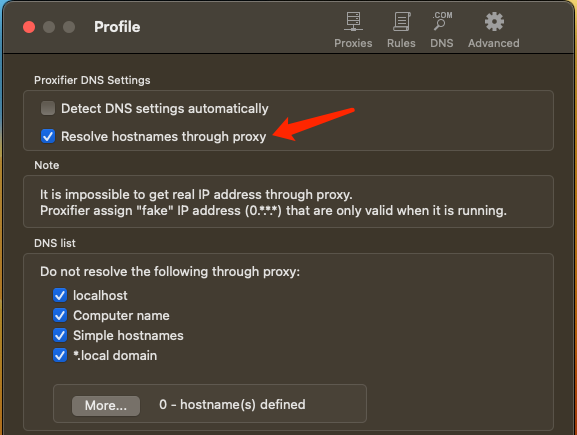 
		- 关闭配置页面
3. 查看软件主页

	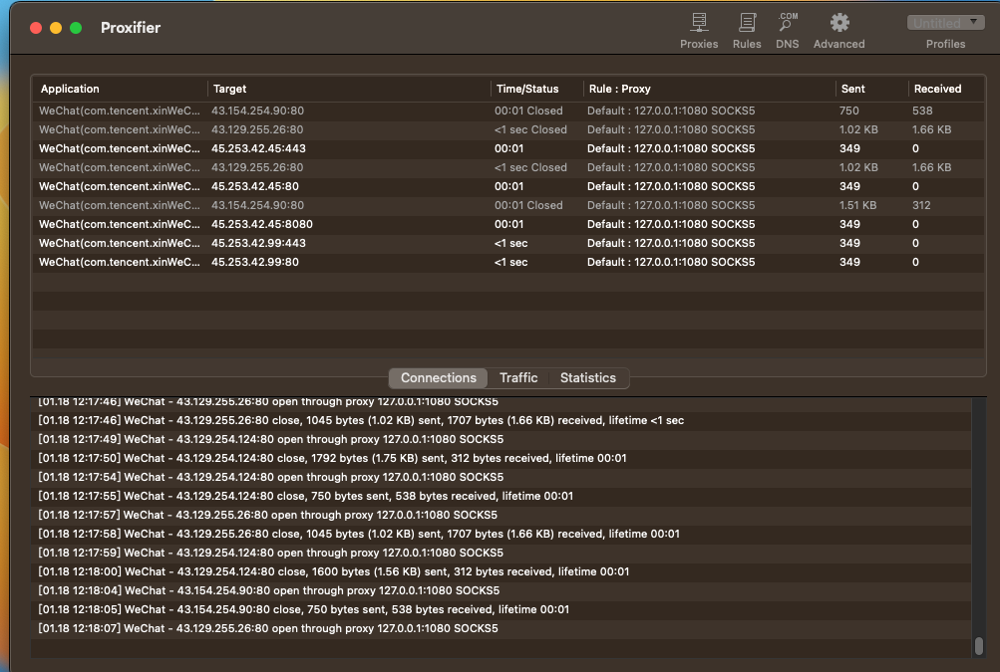
4. 进入 Ledger 
	- 重新点链接

		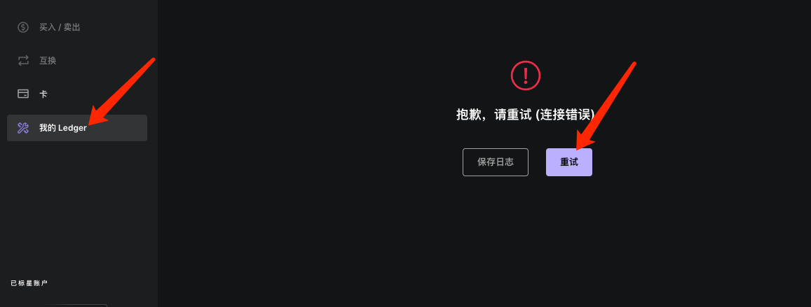
	- 解锁

		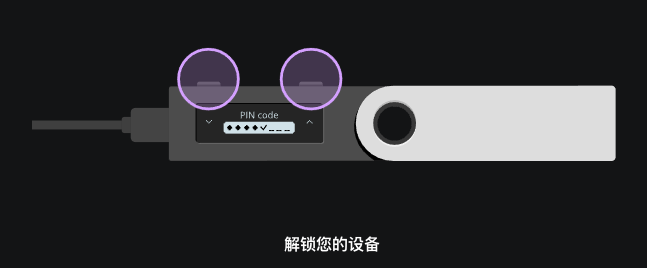	
	- 等待加载
	- 加载成功

		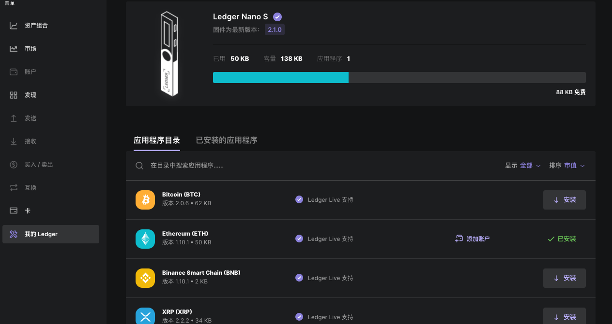
5. 结束

	使用结束后，请将 defult 设置回直连，然后关闭软件，这样才不会浪费带宽
	
	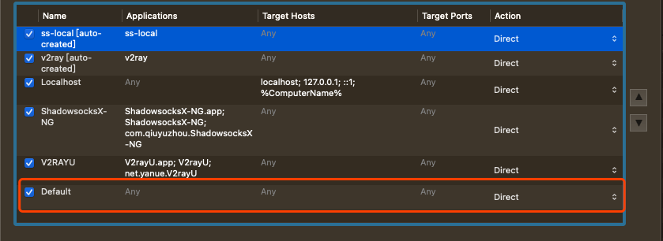

## 2 打开 Ledger Live 后，小狐狸外挂无法链接
### 问题
打开 Ledger Live 后，链接小狐狸钱包的 Ledger 硬件钱包接口报错。这个问题是因为 Ledger Live 打开后，我们默认选择了 `我的 Ledger` 这会让 Ledger 硬件钱包接口一直被 Live 占用。

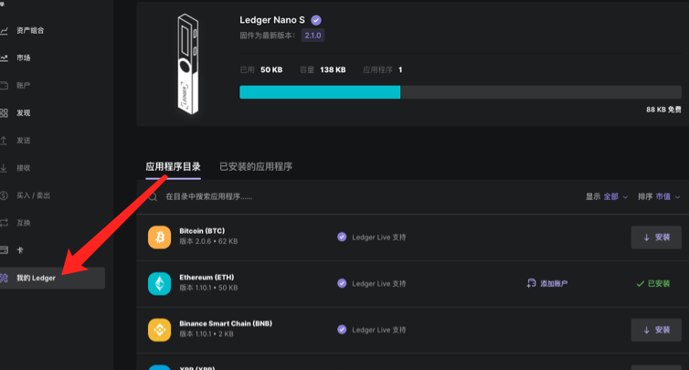
### 解决方法
解决方法也很简单，只要将 Live 选项转移到其他地方即可，比如

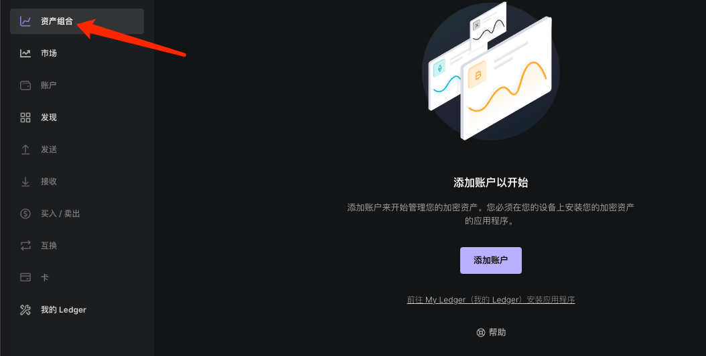

## 3 合约交互异常
### 问题
在解决了这些问题后，来到和合约安全升级问题，我们为了使合约更安全，将一些权限转移给了硬件钱包。但是请求合约时总是会卡住调用失败。

这里的问题时在于，硬件钱包在签名的时候，强制要求交易符合硬件钱包屏幕的显示规范可解析，这样才可以允许用户通过硬件钱包签名。

但是合约 ABI 交互的复杂度明显无法做到标准化，所以这块如果不符合硬件钱包支持的显示格式，钱包默认时无法让用户操作签名的。

但硬件钱包可以设置降低签名安全性，这里可以通过设置钱包来解决

	注意我们这里使用的是以太坊生态规范+小狐狸作为中转，其他模式不设计
### 解决方法
通过硬件钱包的设置，步骤

- 解锁 pin
- 双按进入 eth 应用
- 点击右键选择到 setting
- 双按进入设置
- 到设置盲签名

	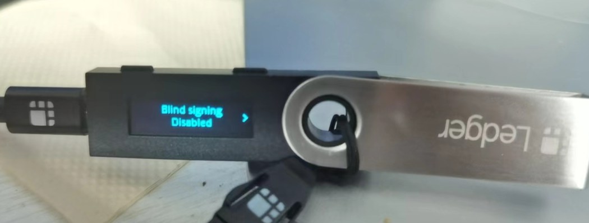
- 双按到 `Enabled` 状态

退出即可签名合约

## 安全提示
- 使用后切换关闭盲签，防止误操作。
- 还要注意，所有操作要详细核对操作地址

	因为即使密钥硬件离线了，但是软件依然是在线，有被攻击的可能性，比如签名中替换授权地址
- 注意不要使用官方的 Ledger Live 软件直接操作了链，官方bug太多	
						

		
		
	
					
			
					 
						

