# MetaMask 手册
## 介绍
欢迎使用 MetaMask 的开发人员文档。本文档用于学习为 MetaMask 开发应用程序。

- 您可以在我们的[官方网站](https://metamask.io/)上找到最新版本的 MetaMask 。
- 有关使用 MetaMask 的帮助，请访问我们的[用户支持网站](https://metamask.zendesk.com/) 。
- 有关最新消息，请关注我们的 Peepeth、推特或页面。
- 要了解如何为 MetaMask 项目本身做出贡献，请访问我们的[内部文档](https://github.com/MetaMask/metamask-extension/tree/develop/docs) 。

最近的重大提供商更改

	如果您是以太坊应用程序开发人员，并且正在寻找有关我们2021年1月提供程序API更改的信息，请参阅我们的[迁移指南](https://docs.metamask.io/guide/provider-migration.html)以获取更多详细信息。

### 为什么选择MetaMask
创建 MetaMask 是为了满足基于以太坊的安全和可用网站的需求。特别是，它处理帐户管理并将用户连接到区块链。

- [从这里开始](https://docs.metamask.io/guide/getting-started.html)
- [了解有关我们的 JavaScript Provider API 的更多信息](https://docs.metamask.io/guide/ethereum-provider.html)
- [了解有关我们的 RPC API 的更多信息](https://docs.metamask.io/guide/rpc-api.html)

### 帐户管理
MetaMask 允许用户以各种方式（包括硬件钱包）管理帐户及其密钥，同时将它们与站点上下文隔离。与将用户密钥存储在单个中央服务器甚至本地存储上相比，这是一个很大的安全性改进，它可以防止[大量帐户被盗](https://www.ccn.com/cryptocurrency-exchange-etherdelta-hacked-in-dns-hijacking-scheme/) 。

此安全功能还配备了开发商的方便：对于开发者来说，只需与全球可用的交互 `ethereumAPI`，用于标识 WEB3 兼容的浏览器的用户（如 MetaMask 用户），每当你请求一个交易签名（如 `eth_sendTransaction`，`eth_signTypedData` 或其他）， MetaMask 将以一种易于理解的方式提示用户。这样可以使用户保持了解情况，并使攻击者可以尝试对单个用户进行网络钓鱼，而不是进行大规模的黑客攻击（尽管[DNS黑客攻击仍然可以用于大规模网络钓鱼](https://medium.com/metamask/new-phishing-strategy-becoming-common-1b1123837168) ）。

### 区块链连接
MetaMask 通过我们 [Infura](https://infura.io/) 的朋友预先加载了与以太坊区块链和多个测试网络的快速连接 。这使您可以在不同步整个节点的情况下开始使用，同时仍提供升级安全性和使用您选择的区块链提供程序的选项。

如今，MetaMask 与任何公开了[以太坊兼容的 JSON RPC API](https://eth.wiki/json-rpc/API)的区块链都兼容 ，包括自定义和私有区块链。对于开发，我们建议运行像 [Ganache](https://www.trufflesuite.com/ganache) 这样的测试区块链 。

我们知道，人们不断有兴趣将 MetaMask 连接到新的私有区块链，并且[我们正在朝着与这些众多选项更轻松地集成的方向发展](https://medium.com/metamask/metamasks-vision-for-multiple-network-support-4ffbee9ec64d)。 。

### 新的Dapp开发人员
[学习扎实](https://karl.tech/learning-solidity-part-1-deploy-a-contract/) 由卡尔·弗洛尔施（Karl Floersch）
[加密僵尸](https://cryptozombies.io/)

## onboarding
要为 MetaMask 开发，请在您的开发计算机上安装 MetaMask。在[这里下载](https://metamask.io/) 。

快速说明...

	本指南假定您具有 HTML，CSS 和 JavaScript 的中级知识。

一旦安装并运行了 MetaMask，您应该发现新的浏览器选项卡 `window.ethereum` 在开发人员控制台中具有可用的对象。这就是您的网站与 MetaMask 交互的方式。

您可以[在此](https://docs.metamask.io/guide/ethereum-provider.html)处查看该对象的完整 API 。请注意，在2020年内，我们将对该 API 进行重大更改，建议您参考其文档。

### 基本注意事项
#### Web3 浏览器检测
要验证浏览器是否正在运行 MetaMask，请将下面的代码片段复制并粘贴到 Web 浏览器的开发者控制台中：

	if (typeof window.ethereum !== 'undefined') {
	  console.log('MetaMask is installed!');
	}
您可以[在此处](https://docs.metamask.io/guide/ethereum-provider.html)查看该 `window.ethereum` 对象的完整 API 。

#### 运行测试网络
在 MetaMask 的右上菜单中，选择当前连接到的网络。在几种常见的默认设置中，您会找到 `Custom RPC` 和 `Localhost 8545`。这些都对于连接到 ganache 等测试区块链很有用 。如果已使用进行了 `npm` 安装，则可以快速安装并启动 Ganache 

	npm i -g ganache-cli && ganache-cli
Ganache 具有一些很棒的功能，可以在不同的状态下启动您的应用程序。如果您的应用程序以该 `-m` 标志开头，则可以为它提供与 MetaMask 中相同的种子短语，并且测试网络将为您的前10个帐户中的每个帐户提供 100 个测试以太币，这使开始工作变得更加容易。

由于您的种子短语可以控制所有帐户，因此可能值得保留至少一个种子短语进行开发，与用于存储实际价值的任何短语分开。使用 MetaMask 管理多个种子短语的一种简单方法是使用多个浏览器配置文件，每个配置文件都可以具有自己的干净扩展安装。

- 重置本地随机数计算

	如果您正在运行测试区块链并重新启动它，您可能会意外混淆 MetaMask，因为它会根据网络状态和已知的已发送交易来计算下一个[随机数](https://docs.metamask.io/guide/sending-transactions.html#nonce-ignored)。

	要清除 MetaMask 的交易队列并有效地重置其现时计算，您可以使用 `Settings` 中的 `Reset Account` 按钮（位于右上角的三明治菜单中）。

#### 检测 MetaMask
如果要将 MetaMask 与其他与以太坊兼容的浏览器区分开，则可以使用来检测 MetaMask `ethereum.isMetaMask`。
#### 用户状态
当前，与此 API 交互时需要考虑一些有状态的事情

- 当前的网络是什么？
- 什么是活期账户？

两者都可以通过 `ethereum.networkVersion` 和同步使用 `ethereum.selectedAddress`。您也可以使用事件来监听更改，请参阅[API参考](https://docs.metamask.io/guide/ethereum-provider.html)。

#### 连接到 MetaMask
`connect` 或 `onboarding` 到 MetaMask 实际上意味着 “访问用户的以太坊帐户”。

您仅应响应用户的直接操作（例如单击按钮）来发起连接请求。连接请求待处理时应始终禁用“连接”按钮。您永远不要在页面加载时启动连接请求。

建议提供一个按钮，以允许用户将 MetaMask 连接到您的 dapp。单击此按钮应调用以下方法：

	ethereum.request({ method: 'eth_requestAccounts' });

例子：

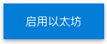

- HTML

		<button class="enableEthereumButton">Enable Ethereum</button>
- JavaScript

		const ethereumButton = document.querySelector('.enableEthereumButton');

		ethereumButton.addEventListener('click', () => {
		  //Will Start the metamask extension
		  ethereum.request({ method: 'eth_requestAccounts' });
		});

此承诺兑现功能可以使用一系列以十六进制为前缀的以太坊地址进行解析，这些地址可以在发送交易时用作通用帐户参考。

随着时间的流逝，该方法将不断发展壮大，以包括各种其他参数，以帮助您的站点在安装过程中向用户请求其所需的所有安装。

由于它返回一个 `promise`，因此，如果您使用的是 `async` 函数，则可以这样 `onboarding`：

	const accounts = await ethereum.request({ method: 'eth_requestAccounts' });
	const account = accounts[0];
	// We currently only ever provide a single account,
	// but the array gives us some room to grow.
例子：

帐户：

- HTML

		<button class="enableEthereumButton">Enable Ethereum</button>
		<h2>Account: </h2>
- JavaScript

		const ethereumButton = document.querySelector('.enableEthereumButton');
		const showAccount = document.querySelector('.showAccount');
		
		ethereumButton.addEventListener('click', () => {
		  getAccount();
		});
		
		async function getAccount() {
		  const accounts = await ethereum.request({ method: 'eth_requestAccounts' });
		  const account = accounts[0];
		  showAccount.innerHTML = account;
		}
### 选择便捷库
存在便捷库的原因多种多样。

其中

- 一些简化了特定用户界面元素的创建
- 一些完全管理了用户帐户
- 另一些则为您提供了与智能合约进行交互的各种方法，以用于从承诺，回调到强类型的各种API偏好等等

提供商 API 本身非常简单，并且包装 [以太坊JSON-RPC](https://eth.wiki/json-rpc/API#json-rpc-methods) 格式化的消息，这就是为什么开发人员通常使用便捷库与提供商进行交互的原因，例如

- [ethers](https://www.npmjs.com/package/ethers) 
- [web3.js](https://www.npmjs.com/package/web3) 
-  [truffles](https://www.trufflesuite.com/) 
-  [embarklabs](https://framework.embarklabs.io/) 或其他。

通过这些工具，您通常可以找到足够的文档来与提供程序进行交互，而无需阅读此较低级别的 API。

## 常用术语
这是使用 MetaMask 界面时可能遇到的术语的列表。

- 钱包
	- 您用来管理帐户的界面/客户/包装/持有人。
	- 示例：MetaMask.io、Ledger硬件钱包、Multisig 钱包合约
- 帐户
	- 一个公私密钥对，可以“持有”您的资金。
	- 您的资金实际上存储在区块链上，而不是钱包或帐户中。
	- 就像您的 Reddit 帐户具有 `username (public)` 和一样 `password (private)`，以太坊帐户也是如此。为了提高安全性，您可以使用密码来加密您的私钥，这将导致 `username (public)`和 `password (private)`和 `password for that password (private + more secure)`。请参阅本 `Keystore File` 部分。
- 地址（“公钥”）
	- 可以使用此送资金到一个帐户。
	- 有时也称为“公钥”
	- 由 `0x+` 组成的字符串 `40 hexadecimal characters`。
	- 在以太坊中，地址以开头 `0x`。
	- 例： `0x06A85356DCb5b307096726FB86A78c59D38e08ee`
- 公钥
	- 在密码学中，您有一个密钥对：公钥和私钥。
	- 您可以从私钥中派生公钥，但不能从公钥中派生私钥。
	- （高级）在以太坊中，地址像公钥一样“起作用”，但实际上不是公钥。
	- （高级）在以太坊中，公钥是从私钥派生的，并且是 128 个十六进制字符。然后将其 `"SHA3" (Keccak-256)` 的到的哈希值（64个字符），最后40个字符，并以作为前缀 `0x`，给您 42 个字符的地址。
- 私钥
	- 可以使用它从一个帐户中汇款。
	- 地址/公钥的秘密部分。
	- 一串64个十六进制字符。
	- （[几乎](https://crypto.stackexchange.com/questions/30269/are-all-possible-ec-private-keys-valid)）64 个十六进制字符的每个字符串都是一个私钥。
	- 如果不同的方式手动键入私钥将访问不同的钱包。`切勿手动输入私钥`
	- 您需要从帐户发送的字符串。没有它，您将无法使用您的资金。虽然，您无需以这种格式保存此原始的，未加密的私钥。您可以保存它的精美版本（例如，密钥库文件/助记词）。
	- 例子： `afdfd9c3d2095ef696594f6cedcae59e72dcd697e2a7521b1578140422a4f890`
- 密钥库文件
	- JSON 格式的私钥的加密版本（尽管它没有 JSON 扩展名）
	- 您的私钥的精美版本，受您选择的密码保护。
	- 与密码结合使用时，它具有私钥。
	- 比私钥安全，因为您需要密码。
	- 文件名通常采用 `UTC`+ `--` + `DATE_CREATED` + `--` + 格式 `YOUR_ADDRESS_WITHOUT_THE_OX`
	- 文件名示例： `UTC--2017-07-02T20-33-09.177Z--06a85356dcb5b307096726fb86a78c59d38e08ee`
	- 内容示例： 

			{
			    "version":3,
			    "id":"aa811d53-fe9a-44a2-bd1c-e737007b5591",
			    "address":"06a85356dcb5b307096726fb86a78c59d38e08ee",
			    "Crypto":{
			        "ciphertext":"f5a7cc8d4b8cf93510b0d0d057f3a52ac79fd48e619e0638c4ffd978ca180248",
			        "cipherparams":{
			            "iv":"975ab00192e2dd74170e91ca59c0b0bd"
			        },
			        "cipher":"aes-128-ctr",
			        "kdf":"scrypt",
			        "kdfparams":{
			            "dklen":32,
			            "salt":"0210f0d0b99e440dfbceb36373304638bac093a367ee7da6411cd165f7aa907a",
			            "n":1024,
			            "r":8,
			            "p":1
			        },
			        "mac":"8197a747a3855a10546a2ff939c36470daed78e393b670efa0c12fe3b23dd7e3"
			    }
			}
	- （PW： `mypassword`）
- 助记词/种子词/种子词
	- 您的私钥的另一个高级版本，实际上用于派生多个私钥。
	- 一个（通常）12或24个单词的短语，使您可以访问无限数量的帐户。
	- 由 Ledger，TREZOR，MetaMask，Jaxx等使用。
	- 源自 [BIP 39](https://github.com/bitcoin/bips/blob/master/bip-0039.mediawiki) Spec。
	- 您可以使用此短语访问的帐户由“路径”决定。
	- 示例12个单词： `brain surround have swap horror body response double fire dumb bring hazard`
	- 示例24个单词： `card enrich gesture connect kick topple fan body blind engine lemon swarm venue praise addict agent unaware equal bean sing govern income link leg`
- 硬件钱包
	- 通常，一个“持有”您的私钥以确保您的私钥安全的单用途设备。
	- 通常，他们使用 24 字词短语。您应该写下这个短语（不在计算机上），并与硬件钱包分开存储。
	- 如果您丢失了硬件钱包，仍然可以通过写下的字词来访问帐户和资金。
	- 切勿在计算机上键入词组。它违反了您的硬件钱包的目的。
	- 有关硬件钱包的更多信息，请[参见此处](https://kb.myetherwallet.com/en/hardware-wallets/)
- 识别码/地址识别码/地址图标
	- 与您的地址相对应的彩色斑点。
	- 这是查看您的地址是否正确的简单方法。
	- 例子1

		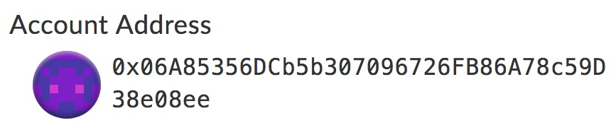
	- 例子2

		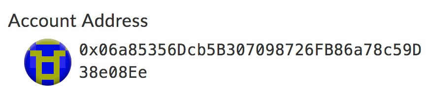
	- 注意：以上地址是单个字符，但图标和颜色明显不同。魔法！
- 十六进制

	在整个以太坊中用于各种事物，十六进制字符串由数字 `0 1 2 3 4 5 6 7 8 9` 和 `A B C D E F`
- 种子
	- 为获得私钥而提供的输入。这应该始终以真正随机的方式生成，而不是由可怜的人脑组成的东西。
	- 如果人选择了种子，则称为 `brain wallet` 脑钱包
- 脑钱包
	- 根据您选择的种子或密码或密码生成的帐户。
	- 人类没有能力产生足够的熵，因此从这些短语中得出的钱包是不安全的。
	- 超快速计算机可能会强行破解大脑钱包。
	- [大脑钱包没有安全感](https://www.reddit.com/r/ethereum/comments/45y8m7/brain_wallets_are_now_generally_shunned_by/)
	- 不要使用脑袋
- 熵
	- 也称为“随机性”
	- 事物越随机，它的熵就越大，它的安全性就越高。
	- 通常以“熵的位数”或强行获得具有这么大熵的\ _ \ _ \ _ \ _（例如私钥）所需的年数来定义。
	- 以太坊私钥是 256 位密钥
	- 24 词助记词短语也是 256 位熵。字典中有 2048 个单词。11位熵（单词）。11 * 24 = 264。最后一个字是校验和。
- 派生 Derive/Derivation
	- 派生某物就是从原始来源获得它。
	- 例如，如果我们要从私钥和密码派生密钥库，则意味着密钥库是从这两个来源创建的。
	- 密钥库是两者的乘积，因此它是从两者派生的。
- 加密
	- 加密是采取一串字母/数字（例如您的私钥），然后通过私有翻译的方法将它们转换为另一串字母/数字的行为。
	- 有多种不同的加密方法。
	- 加密为那些试图窃取您的信息的人提供了保护！
- 加密密钥与未加密密钥
	- 未加密的私钥长度为64个字符，用于解锁或恢复钱包。
	- 加密密钥的长度也为64个字母，并且是经过上述加密过程的常规私钥。
	- 例如，如果世界 “Apple” 是您的缩短的私钥，那么它被加密为字母下方的三个字母，则新的缩短的加密密钥为“Dssoh”。由于您知道加密此密钥的方法，因此可以通过反转加密方法从中获得原始私钥。
	- 通常，加密的私钥保存在扩展程序或加密设备中，并且不会被用户看到。这旨在增加另一层安全性，以确保用户的钱包信息安全。
- 分权/分权
	
	将单个实体（例如政府或大型公司）的权限转移到多个较小实体的过程。
- 不信任

	区块链负责的分布式无信任共识。由于每个人都有曾经执行过的所有交易的分类帐的副本，因此不需要第三方。您可以自己验证交易，但是创建了以太坊区块链和比特币区块链以确保当满足所有条件时各方之间执行规则和协议。
- 智能合约

	存储在区块链网络上的一段代码（或程序）。合约的条件由用户预先定义，如果满足所有条件，则合约（程序）将执行某些操作。
- 区块链

	去中心化的公共分类帐

## 初始化 Dapps
设置好基本开发环境之后，就可以开始与一些智能合约进行交互了。与智能合约进行通信时，无论使用什么库，都需要满足一些基本要求：
### 合约网络
如果您未连接到正确的网络，则不会有任何将交易发送到合约，因此请确保您拥有此权利！

许多聪明的 dapp 都能识别用户的当前网络，并真正适应它！例如，如果您检测到测试网络，则可以故意连接到智能合约的测试网络版本，这使用户可以轻松地“试用”您的系统而无需花费真金白银！
### 合约地址
以太坊中的每个账户都有一个地址，无论是外部密钥对账户还是智能合约。为了使任何智能合约库都能与您的合约进行通信，他们需要知道其确切地址。
### 合约 ABI
在以太坊中，[ABI 规范](https://solidity.readthedocs.io/en/develop/abi-spec.html) 是一种以用户界面可以理解的方式对智能合约的界面进行编码的方法。它是一个描述方法的对象数组，当您将其和地址输入到合约抽象库中时，它会 `ABI` 告诉这些库要提供的方法以及如何编写调用这些方法的事务。

示例库包括：

- [ethers](https://www.npmjs.com/package/ethers)
- [web3.js](https://www.npmjs.com/package/web3)
- [Embark](https://framework.embarklabs.io/)
- [ethjs](https://www.npmjs.com/package/ethjs)
- [truffle](https://www.trufflesuite.com/)

### 合约字节码
如果您的 Web 应用程序要发布预先编译的新智能合约，则可能需要包含一些 `bytecode`。在这种情况下，您将不会事先知道合约地址，而必须先发布，监视要处理的交易，然后从完成的交易中提取最终合约的地址。

如果使用字节码发布合约，则您还需要 `ABI` 与之交互！字节码未描述如何与最终合约交互。
### 合约源代码
如果您的网站将允许用户编辑智能合约源代码并进行编译，例如 [Remix](http://remix.ethereum.org/) ，您可以导入整个编译器，在这种情况下，您将从该源代码派生您的字节码和 ABI，最终您将从发布该字节码的已完成交易中获取合约的地址。
## 存取帐户
用户账户在以太坊的各种环境中都可以使用，包括用作标识符和签署交易。为了请求用户签名或让用户批准交易，必须能够访问用户的帐户。在 `wallet methods` 下面涉及的签名或交易的批准，所有需要发送帐户作为函数参数。

- `eth_sendTransaction`
- `eth_sign` （不安全且不建议使用）
- `eth_personalSign`
- `eth_signTypedData`

一旦你[连接到用户](https://docs.metamask.io/guide/getting-started.html)，可以随时通过检查再检查当前账户`ethereum.selectedAddress`。

例子：

### 帐户更改为
如果您希望在地址更改时收到通知，可以举办一个活动可以订阅：

	ethereum.on('accountsChanged', function (accounts) {
	  // Time to reload your interface with accounts[0]!
	});
如果返回数组中的第一个帐户不是您期望的帐户，则应通知用户！将来，帐户数组可能包含多个帐户。但是，阵列中的第一个帐户将继续被视为用户的“选定”帐户。
## 发送交易
交易是对区块链的正式行动。

- 它们总是在 MetaMask 中通过调用该 `eth_sendTransaction` 方法来启动。
- 可能涉及简单的以太币发送
- 可能导致发送令牌
- 创建新的智能合约
- 或以多种方式更改区块链上的状态

但它们始终由外部帐户的签名或简单的密钥对启动。

在 MetaMask 中，`ethereum.request` 直接使用该方法，发送事务将涉及组成这样的 options 对象：

	const transactionParameters = {
	  nonce: '0x00', // ignored by MetaMask
	  gasPrice: '0x09184e72a000', // customizable by user during MetaMask confirmation.
	  gas: '0x2710', // customizable by user during MetaMask confirmation.
	  to: '0x0000000000000000000000000000000000000000', // Required except during contract publications.
	  from: ethereum.selectedAddress, // must match user's active address.
	  value: '0x00', // Only required to send ether to the recipient from the initiating external account.
	  data:
	    '0x7f7465737432000000000000000000000000000000000000000000000000000000600057', // Optional, but used for defining smart contract creation and interaction.
	  chainId: '0x3', // Used to prevent transaction reuse across blockchains. Auto-filled by MetaMask.
	};
	
	// txHash is a hex string
	// As with any RPC call, it may throw an error
	const txHash = await ethereum.request({
	  method: 'eth_sendTransaction',
	  params: [transactionParameters],
	});
### 例子
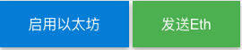

- HTML

		<button class="enableEthereumButton btn">Enable Ethereum</button>
		<button class="sendEthButton btn">Send Eth</button>
- JavaScript

		const ethereumButton = document.querySelector('.enableEthereumButton');
		const sendEthButton = document.querySelector('.sendEthButton');
		
		let accounts = [];
		
		//Sending Ethereum to an address
		sendEthButton.addEventListener('click', () => {
		  ethereum
		    .request({
		      method: 'eth_sendTransaction',
		      params: [
		        {
		          from: accounts[0],
		          to: '0x2f318C334780961FB129D2a6c30D0763d9a5C970',
		          value: '0x29a2241af62c0000',
		          gasPrice: '0x09184e72a000',
		          gas: '0x2710',
		        },
		      ],
		    })
		    .then((txHash) => console.log(txHash))
		    .catch((error) => console.error);
		});
		
		ethereumButton.addEventListener('click', () => {
		  getAccount();
		});
		
		async function getAccount() {
		  accounts = await ethereum.request({ method: 'eth_requestAccounts' });
		}

### 交易参数
MetaMask 为您处理了许多交易参数，但是最好知道所有参数的作用。

- Nonce [忽略]

	MetaMask 将忽略此字段。

	在以太坊中，每笔交易都有一个随机数。这样一来，每个交易只能由区块链处理一次。此外，要成为有效交易，随机数必须为0或者必须已经处理了具有先前编号的交易。

	这意味着始终按给定帐户的顺序处理交易，因此增加随机数是一个非常敏感的问题，很容易搞砸，尤其是当用户与多个应用程序通过同一帐户使用待处理交易进行交互时（可能跨多个帐户）设备。

	由于这些原因，MetaMask 当前无法为应用程序开发人员提供任何自定义其建议的事务随机数的方法，而是帮助用户自己管理其事务队列。
- Gas 价格(Gas Price)[可选]

	可选参数-最好在私有区块链上使用。

	在以太坊中，未决交易池将其 Gas 价格作为一种拍卖竞标价格提供给验证者，以将该交易包含在一个区块中以换取交易费。这意味着高昂的 Gas 价格可能意味着更快的处理速度，但也意味着交易成本更高。

	MetaMask 帮助用户在以太坊主网络和流行的测试网络上选择具有竞争力的 Gas 价格。我们向 MyCrypto 的朋友维护的 API 发出请求，并允许用户在其 Gas 价格的“慢”，“中”和“快速”选项之间进行选择。

	我们无法了解所有区块链上的 Gas 市场，因为它需要进行深入分析。因此，虽然您可以放心地在我们的主要托管网络上忽略此参数，但是在您的应用程序比我们更了解目标网络的情况下，您可能希望建议一个汽油价格。
- Gas 限制(Gas Limit )[可选]

	可选参数。对 Dapp 开发人员而言很少有用。

	Gas 限额是一个高度可选的参数，我们会为此自动计算一个合理的价格。您可能会知道，由于某种原因，您的智能合约会从自定义 Gas 限制中受益。
- to [半可选]

	十六进制编码的以太坊地址。与收件人的交易（除合约创建外的所有交易）必填。

	当没有 to 价值但有价值时，便会创建合约 `data`。
- vlaue [可选]

	要发送的网络本地货币的十六进制编码值。在以太坊主网络上，这是以太币 ，以 wei 表示，即`1e-18` ether。

	请注意，以太坊中经常使用的这些数字比本地 JavaScript 数字具有更高的精度，并且如果无法预料，可能会导致无法预料的行为。因此，我们强烈建议使用 [BN.js](https://github.com/indutny/bn.js/) 在处理打算用于区块链的值时。
- data [半可选]

	创建智能合约所需。

	此字段还用于指定合约方法及其参数。您可以了解有关如何在 [Solidity ABI](https://solidity.readthedocs.io/en/develop/abi-spec.html)规范上对数据进行编码的更多信息 。
- Chain ID [当前已忽略]

	Chain ID 当前由用户当前选择的网络（位于）得出 `ethereum.networkVersion`。将来，我们可能会允许一种同时连接到多个网络的方法，这时此参数将变得很重要，因此习惯于现在包含它可能会很有用。

## 以太坊提供商 API
- 提示推荐读物

	我们建议所有 web3 网站开发人员阅读 “[基本用法](https://docs.metamask.io/guide/ethereum-provider.html#basic-usage)”部分。
- 最近的重大提供商更改

	如果您是以太坊应用程序开发人员，并且正在寻找有关我们2021年1月提供程序API更改的信息，请参阅我们的[迁移指南](https://docs.metamask.io/guide/provider-migration.html)以获取更多详细信息。

MetaMask 将全球 API 注入其用户访问的网站 `window.ethereum`。该 API 允许网站请求用户的以太坊帐户，从用户连接的区块链中读取数据，并建议用户签署消息和交易。提供商对象的存在指示以太坊用户。我们建议使用`@metamask/detect-provider` 在任何平台或浏览器上检测我们的提供商。

以太坊 JavaScript 提供程序 API 由 [EIP-1193](https://eips.ethereum.org/EIPS/eip-1193)指定 。

	// This function detects most providers injected at window.ethereum
	import detectEthereumProvider from '@metamask/detect-provider';
	
	const provider = await detectEthereumProvider();
	
	if (provider) {
	  // From now on, this should always be true:
	  // provider === window.ethereum
	  startApp(provider); // initialize your app
	} else {
	  console.log('Please install MetaMask!');
	}
### 目录
- 目录
- 基本用法
- Chain ID
- 属性
	- `ethereum.isMetaMask`
- 方法
	- `ethereum.isConnected()`
	- `ethereum.request(参数)`
- 事件
	- `connect`
	- `disconnect`
	- `accountChanged`
	- `chainChanged`
	- `message`
- 失误
- 使用提供商
- 实验性API
- 实验方法
	- ethereum._metamask.isUnlocked（）
- 旧版API
- 旧版属性
	- ethereum.chainId（已弃用）
	- ethereum.networkVersion（已弃用）
	- ethereum.selectedAddress（不建议使用）
- 传统方法
	- ethereum.enable（）（不推荐使用）
	- ethereum.sendAsync（）（不推荐使用）
	- ethereum.send（）（不推荐使用）
- 遗留事件
	- 关闭（已弃用）
	- chainIdChanged（不推荐使用）
	- networkChanged（不建议使用）
	- 通知（已弃用）

### 基本用法
为了使任何重要的以太坊 Web 应用程序（又名dapp，web3网站等）正常工作，您必须：

- 检测以太坊提供商（`window.ethereum`）
- 检测用户连接到哪个以太坊网络
- 获取用户的以太坊账户

此页面顶部的代码段足以检测提供商。通过查看 “[使用提供商](https://docs.metamask.io/guide/ethereum-provider.html#using-the-provider)” 部分中的代码片段，您可以了解如何完成另外两个步骤。

创建完整功能的 web3 应用程序所需的全部是提供商API。

也就是说，许多开发人员都使用的库，例如 [ethers](https://www.npmjs.com/package/ethers) ，而不是直接使用提供程序。如果您需要比此 API 提供的抽象更高的抽象，我们建议您使用库。

### Chain ID
这些是默认情况下 MetaMask 支持的以太坊链的 ID。咨询 [chainid.network](https://chainid.network/) 更多。

十六进制|小数|网络
---|---|---
0x1|1|以太坊主网（Mainnet）
0x3|3|Ropsten测试网络
0x4|4|Rinkeby测试网络
0x5|5|Goerli测试网络
0x2a|42|Kovan测试网络

### 属性
- `ethereum.isMetaMask`

	此属性是非标准的。非 MetaMask 提供程序也可以将此属性设置为 true。

	`true` 如果用户已安装 MetaMask。

### 方法
- `ethereum.isConnected()`

	请注意，此方法与用户帐户无关。

	关于一个 web3 网站是否可以访问该用户的帐户，您可能经常遇到 “已连接” 一词。但是，在提供程序界面中，“已连接”和“已断开连接”是指提供程序是否可以向当前链发出 RPC 请求。

		ethereum.isConnected(): boolean;

	返回 `true` 提供商是否连接到当前链，`false` 否则返回。

	如果未连接提供程序，则必须重新加载页面才能重新建立连接。请参阅 `connect` 和 `disconnect` 事件以获取更多信息。

- `ethereum.request(参数)`

		interface RequestArguments {
		  method: string;
		  params?: unknown[] | object;
		}

		ethereum.request(args: RequestArguments): Promise<unknown>;

	用于 `request` 通过 MetaMask 将 RPC 请求提交给以太坊。它返回一个 `Promise` 解析为 RPC 方法调用结果的结果。

	`params`和返回值将 RPC 方法而变化。实际上如果一个方法有任何方法 `params`，它们几乎 `type` 总是  `Array<any>`。

	如果请求由于任何原因而失败，则 `Promise` 将以 [Ethereum RPC Error](https://docs.metamask.io/guide/ethereum-provider.html#errors) 拒绝。

	除了许多其他钱包可能不支持的方法外，MetaMask 还支持大多数标准化的以太坊 RPC 方法。有关详细信息，请参见 MetaMask [RPC API文档](https://docs.metamask.io/guide/ethereum-provider.html#errors)。

	例子

		params: [
		  {
		    from: '0xb60e8dd61c5d32be8058bb8eb970870f07233155',
		    to: '0xd46e8dd67c5d32be8058bb8eb970870f07244567',
		    gas: '0x76c0', // 30400
		    gasPrice: '0x9184e72a000', // 10000000000000
		    value: '0x9184e72a', // 2441406250
		    data:
		      '0xd46e8dd67c5d32be8d46e8dd67c5d32be8058bb8eb970870f072445675058bb8eb970870f072445675',
		  },
		];
		
		ethereum
		  .request({
		    method: 'eth_sendTransaction',
		    params,
		  })
		  .then((result) => {
		    // The result varies by by RPC method.
		    // For example, this method will return a transaction hash hexadecimal string on success.
		    //结果因RPC方法而异。
		    //例如，此方法成功时将返回事务哈希十六进制字符串。
		  })
		  .catch((error) => {
		    // If the request fails, the Promise will reject with an error.
		    //如果请求失败，则Promise将拒绝并返回错误。
		  });

### 事件
MetaMask 提供程序实现 [Node.js](https://nodejs.org/api/events.html) `EventEmitter` API。本节详细介绍了通过该 API 发出的事件。在 EventEmitter 其他地方有无数的指南，但是您可以听这样的事件：

	ethereum.on('accountsChanged', (accounts) => {
	  // Handle the new accounts, or lack thereof.
	  // "accounts" will always be an array, but it can be empty.
	  //处理新帐户或缺少新帐户。
	 //"accounts"始终是一个数组，但可以为空。
	});
	
	ethereum.on('chainChanged', (chainId) => {
	  // Handle the new chain.
	  // Correctly handling chain changes can be complicated.
	  // We recommend reloading the page unless you have good reason not to.
	  //处理新链。
	  //正确处理链条更改可能很复杂。
	  //除非您有充分的理由，否则我们建议您重新加载页面。
	  window.location.reload();
	});
- `connect`

		interface ConnectInfo {
		  chainId: string;
		}
		
		ethereum.on('connect', handler: (connectInfo: ConnectInfo) => void);
	当 MetaMask 提供程序首次能够将 RPC 请求提交到链时，它将发出此事件。我们建议使用 `connect` 事件处理程序和 `ethereum.isConnected()` [方法](https://docs.metamask.io/guide/ethereum-provider.html#ethereum-isconnected)来确定何时/是否连接了提供程序。
- `disconnect` 

		ethereum.on('disconnect', handler: (error: ProviderRpcError) => void);

	如果 MetaMask 提供程序无法将 RPC 请求提交到任何链，它将发出此事件。通常这只会由于网络连接问题或某些无法预料的错误而发生。

	一旦 `disconnect` 已经发出，提供商将不会接受任何新的请求，直到该链条的连接已经重新 `restablished`，这就需要重新加载页面。您还可以使用该 `ethereum.isConnected()` [方法](https://docs.metamask.io/guide/ethereum-provider.html#ethereum-isconnected)来确定提供程序是否已断开连接。
- `accountChanged`

		ethereum.on('accountsChanged', handler: (accounts: Array<string>) => void);
	每当 `eth_accounts` RPC 方法的返回值更改时，MetaMask 提供程序都会发出此事件。 `eth_accounts` 返回一个为空或包含单个帐户地址的数组。返回的地址（如果有）是允许呼叫者访问的最近使用的帐户的地址。呼叫者通过其URL origin 进行标识，这意味着具有相同来源的所有站点都共享相同的权限。

	这意味着 `accountsChanged` 只要用户的公开帐户地址发生更改，就会发出该消息。

	我们计划允许该 `eth_accounts` 数组在不久的将来能够包含多个地址。
- `chainChanged`

	有关 MetaMask 的默认链及其链ID，请参见[“链ID”部分](https://docs.metamask.io/guide/ethereum-provider.html#chain-ids)。

		ethereum.on('chainChanged', handler: (chainId: string) => void);
	当前连接的链发生更改时，MetaMask 提供程序将发出此事件。

	所有 RPC 请求都将提交到当前连接的链。因此，通过侦听此事件来跟踪当前链ID是至关重要的。

	除非您有充分的理由，否则我们强烈建议您重新加载页面以进行链式更改。

		ethereum.on('chainChanged', (_chainId) => window.location.reload());
- `message`

		interface ProviderMessage {
		  type: string;
		  data: unknown;
		}
	
		ethereum.on('message', handler: (message: ProviderMessage) => void);
	当 MetaMask 提供程序收到一些应通知消费者的消息时，它将发出此事件。消息的类型由 type 字符串标识。

	RPC 订阅更新是该 `message` 事件的常见用例。例如，如果您使用的是创建一个订阅 `eth_subscribe` ，每个订阅更新将被发射作为 `message` 一个事件 `type` 的 `eth_subscription`。

### 错误
MetaMask 提供程序引发或返回的所有错误均遵循以下界面：

	interface ProviderRpcError extends Error {
	  message: string;
	  code: number;
	  data?: unknown;
	}
该 `ethereum.request(args)` [方法](https://docs.metamask.io/guide/ethereum-provider.html#ethereum-request-args)急于引发错误。您通常可以使用 `error code` 属性来确定请求失败的原因。常用代码及其含义包括：

- `4001`

	该请求被用户拒绝
- `-32602`

	参数无效
- `-32603`

	内部错误

有关错误的完整列表，请参阅 [EIP-1193](https://eips.ethereum.org/EIPS/eip-1193#provider-errors) 和 [EIP-1474](https://eips.ethereum.org/EIPS/eip-1474#error-codes) 。

这 `eth-rpc-errors` 软件包可实现 MetaMask 提供程序抛出的所有 RPC 错误，并可以帮助您确定其含义。

### 使用提供商
此代码段说明了如何满足 web3 网站的三个最常见的要求：

- 检测以太坊提供商（`window.ethereum`）
- 检测用户连接到哪个以太坊网络
- 获取用户的以太坊账户

代码如下

	/*****************************************/
	/* Detect the MetaMask Ethereum provider */
	/* 检测MetaMask以太坊提供商 */
	/*****************************************/
	
	import detectEthereumProvider from '@metamask/detect-provider';
	
	// this returns the provider, or null if it wasn't detected
	
	// 这将返回提供商；如果未检测到，则返回null
	const provider = await detectEthereumProvider();
	
	if (provider) {
	  startApp(provider); // Initialize your app
	} else {
	  console.log('Please install MetaMask!');
	}
	
	function startApp(provider) {
	  // If the provider returned by detectEthereumProvider is not the same as
	  // window.ethereum, something is overwriting it, perhaps another wallet.
	 
	 //如果 detectEthereumProvider 返回的提供商与window不同。
	 //以太坊某些东西正在覆盖它，也许是另一个钱包。
	 
	  if (provider !== window.ethereum) {
	    console.error('Do you have multiple wallets installed?');
	  }
	  // Access the decentralized web!
	}
	
	/**********************************************************/
	/* Handle chain (network) and chainChanged (per EIP-1193) */
	/* 处理链（网络）和 chainChanged  (per EIP-1193) */
	/**********************************************************/
	
	const chainId = await ethereum.request({ method: 'eth_chainId' });
	handleChainChanged(chainId);
	
	ethereum.on('chainChanged', handleChainChanged);
	
	function handleChainChanged(_chainId) {
	  // We recommend reloading the page, unless you must do otherwise
	  //我们建议您重新加载页面
	  window.location.reload();
	}
	
	/***********************************************************/
	/* Handle user accounts and accountsChanged (per EIP-1193) */
	/* 处理用户帐户和 accountsChanged (per EIP-1193) */
	/***********************************************************/
	
	let currentAccount = null;
	ethereum
	  .request({ method: 'eth_accounts' })
	  .then(handleAccountsChanged)
	  .catch((err) => {
	    // Some unexpected error.
	    // For backwards compatibility reasons, if no accounts are available,
	    // eth_accounts will return an empty array.
	    
	    //一些意外错误。
	    //出于向后兼容的原因，如果没有可用帐户，
	    // eth_accounts将返回一个空数组。
	    console.error(err);
	  });
	
	// Note that this event is emitted on page load.
	// If the array of accounts is non-empty, you're already
	// connected.
	
	//请注意，此事件在页面加载时发出。
	 //如果帐户数组为非空，则说明您已经
	// 连接的。
	ethereum.on('accountsChanged', handleAccountsChanged);
	
	// For now, 'eth_accounts' will continue to always return an array
	
	//现在，'eth_accounts' 将继续始终返回一个数组
	function handleAccountsChanged(accounts) {
	  if (accounts.length === 0) {
	    // MetaMask is locked or the user has not connected any accounts
	    // MetaMask 被锁定或用户尚未连接任何帐户
	    console.log('Please connect to MetaMask.');
	  } else if (accounts[0] !== currentAccount) {
	    currentAccount = accounts[0];
	    // Do any other work!
	    
	    //做其他工作！
	  }
	}
	
	/*********************************************/
	/* Access the user's accounts (per EIP-1102) */
	/* 访问用户帐户(per EIP-1102) */
	/*********************************************/
	
	// You should only attempt to request the user's accounts in response to user
	// interaction, such as a button click.
	// Otherwise, you popup-spam the user like it's 1999.
	// If you fail to retrieve the user's account(s), you should encourage the user
	// to initiate the attempt.
	
	//您仅应尝试响应用户的交互（例如单击按钮）来请求用户的帐户。
	//否则，您将向用户弹出垃圾邮件，就像 1999 年一样。
	//如果您无法检索用户的帐户，则应鼓励用户发起尝试。
	document.getElementById('connectButton', connect);
	
	// While you are awaiting the call to eth_requestAccounts, you should disable
	// any buttons the user can click to initiate the request.
	// MetaMask will reject any additional requests while the first is still
	// pending.
	
	//在等待对 eth_requestAccounts 的调用时，应禁用用户可以单击以发起请求的任何按钮。
	//当第一个请求仍未处理时，MetaMask 将拒绝任何其他请求。
	function connect() {
	  ethereum
	    .request({ method: 'eth_requestAccounts' })
	    .then(handleAccountsChanged)
	    .catch((err) => {
	      if (err.code === 4001) {
	        // EIP-1193 userRejectedRequest error
	        // If this happens, the user rejected the connection request.
	        console.log('Please connect to MetaMask.');
	      } else {
	        console.error(err);
	      }
	    });
	}
	
### 实验性API
警告

	不能保证本节中定义的方法和属性将保持稳定。需要您自担风险使用它。
我们在此 `ethereum._metamask` 属性下公开了一些实验性的 MetaMask 专用方法。

### 实验方法
- `ethereum._metamask.isUnlocked()`

		ethereum._metamask.isUnlocked(): Promise<boolean>;

	此方法返回 Promise，解析为一个 boolean 指示，指示用户是否已解锁 MetaMask。必须解锁 MetaMask 才能执行涉及用户帐户的任何操作。请注意，此方法不指示用户是否向呼叫者公开了任何帐户。

### 旧版API
警告

	在实践中，您永远不应依赖任何这些方法，属性或事件。
本部分记录了我们的旧版提供程序 API。在通过 [EIP-1193](https://eips.ethereum.org/EIPS/eip-1193) 对提供商 API进行标准化之前，MetaMask 仅支持此 API。 因此，您可能会在 2020 年找到。因此，您可能会发现使用此 API 的 web3 网站或其他实现该 API 的提供商。

#### 旧版属性
- `ethereum.chainId`（已弃用）

	警告

		此属性是非标准的，因此已弃用。
		如果需要检索当前的链ID，请使用 `ethereum.request({ method: 'eth_chainId' })`。另请参阅 `chainChanged` 事件，以获取有关如何处理链ID的更多信息。
		此属性的值可以随时更改。

	代表当前链ID的十六进制字符串。
- `ethereum.networkVersion`（已弃用）

	警告
	
		与网络ID相比，您应该始终首选链ID。
		如果必须获取网络ID，请使用 `ethereum.request({ method: 'net_version' })`。
		此属性的值可以随时更改。

	代表当前区块链网络ID的十进制字符串。
- `ethereum.selectedAddress`（不建议使用）

	警告

		使用 `ethereum.request({ method: 'eth_accounts' })` 代替。
		此属性的值可以随时更改。

	返回代表用户“当前选定”地址的十六进制字符串。

	“当前选定的”地址是所返回的数组中的第一项 `eth_accounts`。

#### 旧版方法
- `ethereum.enable()`（不推荐使用）

	警告

		使用 `ethereum.request({ method: 'eth_requestAccounts' })` 代替。

	别名` ethereum.request({ method: 'eth_requestAccounts' })`。
- `ethereum.sendAsync()`（不推荐使用）

	警告

		使用 `ethereum.request()` 代替。
	代码
	
		interface JsonRpcRequest {
		  id: string | undefined;
		  jsonrpc: '2.0';
		  method: string;
		  params?: Array<any>;
		}
		
		interface JsonRpcResponse {
		  id: string | undefined;
		  jsonrpc: '2.0';
		  method: string;
		  result?: unknown;
		  error?: Error;
		}
		
		type JsonRpcCallback = (error: Error, response: JsonRpcResponse) => unknown;
		
		ethereum.sendAsync(payload: JsonRpcRequest, callback: JsonRpcCallback): void;
	这是的祖先 `ethereum.request`。它仅适用于JSON-RPC 方法，并将 JSON-RPC 请求有效负载对象和错误优先的回调函数作为其参数。

	请参阅[以太坊 JSON-RPC API](https://eips.ethereum.org/EIPS/eip-1474) 有关详细信息。
- `ethereum.send()`（不推荐使用）

	警告

		使用 `ethereum.request()` 代替。
	代码

		ethereum.send(
		  methodOrPayload: string | JsonRpcRequest,
		  paramsOrCallback: Array<unknown> | JsonRpcCallback,
		): Promise<JsonRpcResponse> | void;
	此方法的行为不可预测，应不惜一切代价避免使用。它本质上是的重载版本 `ethereum.sendAsync()`。

	`ethereum.send()`可以通过三种不同的方式调用：

		// 1.
		ethereum.send(payload: JsonRpcRequest, callback: JsonRpcCallback): void;
		
		// 2.
		ethereum.send(method: string, params?: Array<unknown>): Promise<JsonRpcResponse>;
		
		// 3.
		ethereum.send(payload: JsonRpcRequest): unknown;
	您可以想到这些签名如下：

	- 这个签名就像 `ethereum.sendAsync()`
	- 此签名就像 `ethereum.sendAsync()` 带有 `method` 和 `params` 作为参数的异步变量，而不是 JSON-RPC 有效负载和回调
	- 此签名使您可以同步调用以下 RPC 方法：
		- `eth_accounts`
		- `eth_coinbase`
		- `eth_uninstallFilter`
		- `net_version`

#### 旧版事件
- `close`（已弃用）

	警告

		使用 `disconnect` 代替。
	代码
	
		ethereum.on('close', handler: (error: Error) => void);
- `chainIdChanged`（不推荐使用）

	警告

		使用 `chainChanged` 代替。

	别名拼写 `chainChanged`。

		ethereum.on('chainChanged', handler: (chainId: string) => void);
- `networkChanged`（不建议使用）

	警告

		使用 `chainChanged` 代替。

	就像 `chainChanged`，但是用 `networkId` 代替。网络ID不安全，并且已被[EIP-155](https://eips.ethereum.org/EIPS/eip-155)有效地弃用，以使用链ID 。除非您知道自己在做什么，否则请避免使用它们。

		ethereum.on('networkChanged', handler: (networkId: string) => void);
- `notification`（已弃用）

	警告

		使用 `message` 代替。
	 代码

		ethereum.on('notification', handler: (payload: any) => void);
		
## 提供商迁移指南
注意 MetaMask 用户

- 如果您是试图使用尚未迁移到新 API 的旧版以太坊网站的 MetaMask 用户，请参阅 [MetaMask Legacy Web3 Extension](https://docs.metamask.io/guide/provider-migration.html#using-the-metamask-legacy-web3-extension)上的部分。
- 除了这些旧版网站，MetaMask 用户无需采取任何措施。

在2021年1月我们对提供程序 API 进行了一些重大更改，并删除了我们注入的 `window.web3`。这些更改自版本开始在所有平台上均有效：

- `9.0.2` MetaMask 浏览器扩展
- `1.0.9` MetaMask Mobile

本指南介绍了如何迁移到新的提供程序API，以及如何替换 `window.web3`。要了解我们为什么进行这些更改，[请参阅此博客文章](https://medium.com/metamask/breaking-changes-to-the-metamask-provider-are-here-7b11c9388be9) 。

### 目录
- 目录
- 重大变化摘要
	- `window.web3` 删除
	- `window.ethereum API` 更改
- 替换 `window.web3`
	- 直接使用 `window.ethereum`
	- 使用更新的库
	- 使用`@ metamask/legacy-web3`
	- 使用 MetaMask 旧版 Web3 扩展
- 迁移到新的提供程序 API
	- 处理 `eth_chainId` 返回值
	- 处理删除 `chainIdChanged`
	- 处理 `isEnabled()`和 `isApproved()` 的删除
	- 处理删除 `ethereum.publicConfigStore`
	- 处理删除 `ethereum.autoRefreshOnNetworkChange`

### 重大变化摘要
- `window.web3` 移动

	作为重大更改的一部分，我们停止将 `web3.jsversion0.20.7` 作为 `window.web3` 注入网页。MetaMask 仍在处注入虚拟对象 `window.web3`，以便在网站尝试访问时发出警告 `window.web3`。
-  `window.ethereum` API 变更

	我们对 `window.ethereum` API进行了以下重大更改：

	- 确保返回链的ID `eth_chainId` 是不填充 0
		- 例如，无论何时返回或可访问链ID `0x01`，我们总是返回，而不是 `0x1`。
		- 请注意这仅会影响默认的[以太坊链](https://docs.metamask.io/guide/ethereum-provider.html#chain-ids)，但 `Kovan` 除外，其链ID的格式正确（`0x2a`）。
	- 停止发布 `chainIdChanged`，而是发布 `chainChanged`
	- 删除以下实验方法：
		- `ethereum._metamask.isEnabled`
		- `ethereum._metamask.isApproved`
	- 移除 `ethereum.publicConfigStore` 物件
		- 尽管有此名称，但从未将其用于公共消费。删除它可能会影响那些不直接使用它的人，例如，如果您使用的另一个库依赖于该对象。
	- 删除 `ethereum.autoRefreshOnNetworkChange` 财产
		- 消费者仍然可以在提供程序上设置此属性，但是它什么也不会做。
	- 弃用 `web3.currentProvider` 方法
		- 使用[@ metamask/detect-provider](https://github.com/MetaMask/detect-provider) 检测当前提供商。
- 更换 `window.web3`

		页面不再因链式更改而重新加载
		自从我们删除以来 `window.web3`，MetaMask 不再根据链/网络更改自动重新加载页面。
		有关详细信息，请参见处理移除`ethereum.autoRefreshOnNetworkChange`。
	由于历史原因，MetaMask 注入了 `web3@0.20.7` 进入所有网页。该版本 web3 已弃用，[存在已知的安全问题](https://github.com/ethereum/web3.js/issues/3065) ，并且不再由 [web3.js](https://github.com/ethereum/web3.js/)维护 团队。因此，我们决定删除此库。

如果您的网站依赖我们的 `window.web3` 对象，则必须进行迁移。请继续阅读以了解您的选择。有些简单到只需一行更改。

无论选择哪种迁移方式，都可能需要阅读 `web3@0.20.7` 文档，您可以在[这里](https://github.com/ethereum/web3.js/blob/0.20.7/DOCUMENTATION.md)找到 。

- `window.ethereum` 直接使用

	对于许多 web3 网站，由提供的API `window.ethereum` 就足够了。许多 `web3` API 都简单地映射到 RPC 方法，可以使用来请求所有这些方法 `ethereum.request()`。例如，以下是先使用 `window.web3`，然后使用进行等效的操作`window.ethereum`。

		/**
		 * Getting Accounts
		 * 取得帐户
		 */
		
		// window.web3
		const accounts = web3.eth.accounts;
		
		// window.ethereum
		const accounts = await ethereum.request({ method: 'eth_accounts' });
		
		/**
		 * Sending a Transaction
		 * 发送交易
		 */
		
		// window.web3
		web3.eth.sendTransaction(
		  {
		    to: '0x...',
		    'from': '0x...',
		    value: '0x...',
		    // And so on...
		  },
		  (error, result) => {
		    if (error) {
		      return console.error(error);
		    }
		    // Handle the result
		    
		    // 处理结果
		    console.log(result);
		  }
		);
		
		// window.ethereum
		try {
		  const transactionHash = await ethereum.request({
		    method: 'eth_sendTransaction',
		    params: [
		      {
		        to: '0x...',
		        'from': '0x...',
		        value: '0x...',
		        // And so on...
		      },
		    ],
		  });
		  // Handle the result
		   
		   // 处理结果
		  console.log(transactionHash);
		} catch (error) {
		  console.error(error);
		}
- 使用更新的库

	如果您决定需要便利库则必须将的用法转换 `window.web3` 为更新的便利库。我们推荐 [ethers] (https://docs.ethers.io/)
- 使用 `@metamask/legacy-web3`

	警告

		强烈建议您在求助于此之前，先考虑其他两种迁移途径之一。它不是面向未来的，因此我们不会在其中添加新功能。

	最后，如果您只是想让您的 web3 网站继续工作，我们创建了 [@metamask/legacy-web3](https://npmjs.com/package/@metamask/legacy-web3) 。该软件包是对我们的直接替代 `window.web3`，您甚至可以 `window.web3` 在所有平台上删除它们之前，也可以将它们添加到您的网站中。

	`@metamask/legacy-web3` 应该可以像我们注入 `window.web3` 的一样工作 ，包括刷新有关链/网络更改的页面，但是我们不能保证它能完美工作。我们将不会修复 `web3@0.20.7` 与 MetaMask 本身之间将来的任何不兼容性，也不会修复其 `web3@0.20.7` 本身中的任何错误。

	有关安装和使用说明，请参阅 [npm清单](https://npmjs.com/package/@metamask/legacy-web3) 。

- 使用 MetaMask 旧版 Web3 扩展

	我们创建了 [MetaMask Legacy Web3扩展](https://github.com/MetaMask/legacy-web3-extension) 对于仍希望 `window.web3` 被注入的网站的任何用户。如果您将此扩展程序与常规的 MetaMask 钱包扩展程序一起安装，则依赖我们旧的 `window.web3` API的网站应重新开始工作。

	与常规扩展程序一样，仅从官方浏览器扩展程序商店安装非常重要。请点击下面的相关链接，在浏览器中安装`Legacy Web3 扩展程序`：

	- [Chrome, Brave](https://chrome.google.com/webstore/detail/metamask-legacy-web3/dgoegggfhkapjphahmgihfgemkgecdgl)
	- [Edge](https://microsoftedge.microsoft.com/addons/detail/metamask-legacy-web3/obkfjbjkiofoponpkmphnpaaadebfloh?hl=en-US)
	- [Firefox(opens new window)](https://addons.mozilla.org/en-US/firefox/addon/metamask-legacy-web3/)

### 迁移到新的提供程序 API
- 处理 `eth_chainId` 返回值

	所述 `eth_chainId` RPC方法现在返回格式正确值，例如 `0x1` 和 `0x2`，而不是正确格式的值，例如 `0x01` 和`0x02` 。MetaMask 的实现 `eth_chainId` 用于返回[默认的以太坊链](https://docs.metamask.io/guide/ethereum-provider.html#chain-ids)（ 除Kovan以外）的0填充值。如果您希望从中添加0填充的链ID值 `eth_chainId`，请确保更新代码以使用正确的格式。

	有关链ID以及如何处理它们的更多详细信息，请参阅 [chainChanged event](https://docs.metamask.io/guide/ethereum-provider.html#chainchanged)。
- 处理拆除 `chainIdChanged`

	`chainIdChanged` 是错字 `chainChanged` 要迁移，只需监听 `chainChanged`：

		// Instead of this:
		ethereum.on('chainIdChanged', (chainId) => {
		  /* handle the chainId */
		  / *处理 chainId * /
		});
		
		// Do this:
		ethereum.on('chainChanged', (chainId) => {
		  /* handle the chainId */
		  / *处理 chainId * /
		});
- 处理 `isEnabled()` 和 `isApproved()`

	在发布新的提供程序 API 之前，我们添加了 `_metamask.isEnabled` 和 `_metamask.isApproved` 方法，以使web3 网站能够检查它们是否有权访问用户的帐户。 
	
	这与`isEnabled` 和 `isApproved`具有相同的功能，只不过 `isApproved` 是 `async`。可以说这些方法从来没有那么有用，并且随着 MetaMask 许可系统的引入，它们变得完全多余。

	我们建议您通过以下方式检查帐户访问权限：

	- 可以调用 `wallet_getPermissions` [RPC](https://docs.metamask.io/guide/rpc-api.html#wallet-getpermissions)方法并检查 `eth_accounts` 权限。
	- 可以调用 `eth_accounts` RPC 方法和 `ethereum._metamask.isUnlocked()` [方法](https://docs.metamask.io/guide/ethereum-provider.html#ethereum-metamask-isunlocked)。
		- 必须先解锁 MetaMask，然后才能访问用户的帐户。如果返回的数组 `eth_accounts` 为空，请使用来检查MetaMask 是否被锁定 `isUnlocked()`。
		- 如果 MetaMask 已解锁，但您仍然没有收到任何帐户，那么该使用 `eth_requestAccounts` [RPC方法](https://docs.metamask.io/guide/rpc-api.html#eth-requestaccounts)请求帐户了。
- 处理拆除 `ethereum.publicConfigStore`

	如何处理此更改取决于您是否以及如何依赖 `publicConfigStore`。我们已经看到了侦听提供程序状态更改`publicConfigStore` `data` 事件和 `publicConfigStore` 直接访问内部状态的示例。

	我们建议您搜索代码及其依赖项以获取对的引用 `publicConfigStore`。如果找到任何参考，则应该了解它的用途，并改为迁移到[推荐的提供程序API](https://docs.metamask.io/guide/ethereum-provider.html#using-the-provider)之一。如果找不到任何参考，则此更改不会影响您。

	尽管您的依赖项可能使用 `publicConfigStore`，但我们已经确认以下通用库的最新版本（截至2021年1月）不受此更改的影响：

	- `ethers`
	- `web3` （web3.js）
- 处理拆除 `ethereum.autoRefreshOnNetworkChange`

	`ethereum.autoRefreshOnNetworkChange` 是用于控制是否 MetaMask 重载上链/网络改变的页面一个可变的布尔属性。但是，只有在脚本访问上的属性时，它才会导致重新加载页面 `window.web3`。因此与 `window.web3` 一起删除了此属性。

	尽管如此，我们仍然建议您在链更改时重新加载页面。一些便利库，例如 [ehter](https://www.npmjs.com/package/ethers) ，默认情况下将继续重新加载页面。如果您不使用这样的库，则必须手动重新加载页面。请查看 [chainChanged](https://docs.metamask.io/guide/ethereum-provider.html#chainchanged) 以了解详细信息。
	
## RPC API
MetaMask 使用该 `ethereum.request(args)` [方法](https://docs.metamask.io/guide/ethereum-provider.html#ethereum-request-args)包装 RPC API。

该 API 基于所有以太坊客户端公开的接口以及越来越多的其他钱包可能支持或可能不支持的方法。

所有 RPC 方法请求都可以返回错误。确保每次调用都会处理错误 `ethereum.request(args)`。

尝试以太坊方法,访问我们的 [API Playground](https://metamask.github.io/api-playground/api-documentation/)

### 目录
- 以太坊 JSON-RPC 方法
- 权限
	- eth_request 帐户
	- wallet_getPermissions
	- wallet_requestPermissions
- 其他 RPC 方法
	- eth_decrypt
	- eth_getEncryptionPublicKey
	- wallet_add 以太坊链
	- wallet_register注册
	- wallet_watchAsset
- 移动专用 RPC 方法
	- wallet_scanQRCode

### 以太坊 JSON-RPC 方法
有关以太坊 JSON-RPC API的信息，请参阅[以太坊Wiki](https://eth.wiki/json-rpc/API#json-rpc-methods) 。

此API的重要方法包括：

- [eth_accounts](https://eth.wiki/json-rpc/API#eth_accounts)
- [eth_call](https://eth.wiki/json-rpc/API#eth_call)
- [eth_getBalance](https://eth.wiki/json-rpc/API#eth_getbalance)
- [eth_sendTransaction](https://eth.wiki/json-rpc/API#eth_sendtransaction)
- [eth_sign](https://eth.wiki/json-rpc/API#eth_sign)

### 权限
MetaMask 通过 [EIP-2255](https://eips.ethereum.org/EIPS/eip-2255)引入了 Web3 电子钱包权限 。

在此权限系统中，每个 RPC 方法都受限制或处于打开状态。如果方法受到限制则外部域（例如 Web3 站点）必须具有相应的权限才能调用它。同时，开放方法不需要调用权限，但可能需要用户确认才能成功（例如`eth_sendTransaction`）。

当前，唯一的权限是 `eth_accounts`，它允许您访问用户的以太坊地址。将来会添加更多权限。

在底层权限是与 JSON 兼容的普通对象，具有许多字段，这些字段大多数由 MetaMask 在内部使用。以下界面列出了消费者可能感兴趣的字段：

	interface Web3WalletPermission {
	  // The name of the method corresponding to the permission
	  // 权限对应的方法名称
	  parentCapability: string;
	
	  // The date the permission was granted, in UNIX epoch time
	  // 授予许可的日期，以UNIX纪元时间
	  date?: number;
	}
权限系统在软件包中实现 [rpc-cap](https://github.com/MetaMask/rpc-cap) 。如果您有兴趣了解有关此功能启发的权限系统的理论的更多信息，我们建议您查看 [EIP-2255](https://eips.ethereum.org/EIPS/eip-2255) 。

- `eth_requestAccounts`

	此方法由 [EIP-1102](https://eips.ethereum.org/EIPS/eip-1102)指定 。它等效于已弃用的 `ethereum.enable()` 提供程序 API 方法。

	它要求 `wallet_requestPermissions` 获得 `eth_accounts` 许可。由于 `eth_accounts` 当前是唯一的权限，因此您现在只需要此方法。
	
	- 返回

		`string[]` -单个十六进制以太坊地址字符串的数组。
	- `Description`

		请求用户提供一个以太坊地址以作为标识。返回一个 `Promise`，该 `Promise` 解析为单个以太坊地址字符串的数组。如果用户拒绝该请求，则 `Promise` 将拒绝并出现 `4001` 错误。

		该请求将导致出现一个 MetaMask 弹出窗口。您只应响应用户的操作（例如单击按钮）来请求用户的帐户。在请求仍处于挂起状态时，应始终禁用导致调度请求的按钮。

		如果您无法检索用户的帐户，则应鼓励用户发起帐户请求
	- 例子

			document.getElementById('connectButton', connect);
			
			function connect() {
			  ethereum
			    .request({ method: 'eth_requestAccounts' })
			    .then(handleAccountsChanged)
			    .catch((error) => {
			      if (error.code === 4001) {
			        // EIP-1193 userRejectedRequest error
			        // EIP-1193 userRejectedRequest 错误
			        console.log('Please connect to MetaMask.');
			      } else {
			        console.error(error);
			      }
			    });
			}
- `wallet_getPermissions`

	平台可用性.此 RPC 方法在 MetaMask Mobile 中尚不可用。
	
	- 返回

		`Web3WalletPermission[]` -调用者权限的数组。
	- 描述

		获取呼叫者的当前权限。返回解析为 `Web3WalletPermission` 对象数组的 `Promise` 。如果调用者没有权限，则该数组将为空。
- `wallet_requestPermissions`

	平台可用性,此 RPC 方法在 MetaMask Mobile 中尚不可用。

	- 参数
		- `Array`

			`RequestedPermissions` -请求的权限。

				interface RequestedPermissions {
				  [methodName: string]: {}; // an empty object, for future extensibility //一个空对象，以备将来扩展
				}
	- 返回

		`Web3WalletPermission[]` -调用者权限的数组。
	- 描述

		向用户请求给定的权限。返回一个 Promise，该 Promise 解析为一个非空 `Web3WalletPermission` 对象数组，对应于调用者的当前权限。如果用户拒绝该请求，则 Promise 将拒绝并出现 `4001` 错误。

		该请求将导致出现一个 MetaMask 弹出窗口。您仅应请求权限来响应用户操作，例如单击按钮。
	- 例子

			document.getElementById('requestPermissionsButton', requestPermissions);
			
			function requestPermissions() {
			  ethereum
			    .request({
			      method: 'wallet_requestPermissions',
			      params: [{ eth_accounts: {} }],
			    })
			    .then((permissions) => {
			      const accountsPermission = permissions.find(
			        (permission) => permission.parentCapability === 'eth_accounts'
			      );
			      if (accountsPermission) {
			        console.log('eth_accounts permission successfully requested!');
			      }
			    })
			    .catch((error) => {
			      if (error.code === 4001) {
			        // EIP-1193 userRejectedRequest error
			        console.log('Permissions needed to continue.');
			      } else {
			        console.error(error);
			      }
			    });
			}
### 其他RPC方法
- `eth_decrypt`

	平台可用性,此 RPC 方法在 MetaMask Mobile 中尚不可用。
	
	- 参数
		- `Array`
			- `string` -加密的消息。
			- `string` -可以解密消息的以太坊账户的地址。
	- 返回

		`string` -解密的消息。
	- 描述

		请求 MetaMask 解密给定的加密消息。必须使用给定以太坊地址的公共加密密钥对消息进行加密。返回一个解析为已解密消息的 Promise，如果解密尝试失败，则拒绝该 Promise。

		请参阅 `eth_getEncryptionPublicKey` 以获取更多信息。
	- 例子

			ethereum
			  .request({
			    method: 'eth_decrypt',
			    params: [encryptedMessage, accounts[0]],
			  })
			  .then((decryptedMessage) =>
			    console.log('The decrypted message is:', decryptedMessage)
			  )
			  .catch((error) => console.log(error.message));
- `eth_getEncryptionPublicKey`

	平台可用性,此 RPC 方法在 MetaMask Mobile 中尚不可用。

	- 参数
		- `Array`
			- `string` -应该获取其加密密钥的以太坊账户的地址。
	- 返回
		- `string` -指定的以太坊帐户的公共加密密钥。
	- 描述

		请求用户共享其公共加密密钥。返回一个解析为公共加密密钥的 Promise 或者如果用户拒绝了该请求，则拒绝该 Promise。

		使用与指定用户帐户相关联的熵来计算公钥 `nacl` 实现的 `X25519_XSalsa20_Poly1305`算法。
	- 例子

			let encryptionPublicKey;
			
			ethereum
			  .request({
			    method: 'eth_getEncryptionPublicKey',
			    params: [accounts[0]], // you must have access to the specified account
			  })
			  .then((result) => {
			    encryptionPublicKey = result;
			  })
			  .catch((error) => {
			    if (error.code === 4001) {
			      // EIP-1193 userRejectedRequest error
			      console.log("We can't encrypt anything without the key.");
			    } else {
			      console.error(error);
			    }
			  });
- `Encrypting`

	加密密钥的重点当然是对事物进行加密。这是有关如何使用加密消息的示例 [eth-sig-util](https://github.com/MetaMask/eth-sig-util) ：

		const ethUtil = require('ethereumjs-util');
		
		const encryptedMessage = ethUtil.bufferToHex(
		  Buffer.from(
		    JSON.stringify(
		      sigUtil.encrypt(
		        encryptionPublicKey,
		        { data: 'Hello world!' },
		        'x25519-xsalsa20-poly1305'
		      )
		    ),
		    'utf8'
		  )
		);
- `wallet_addEthereumChain`

	此方法由 [EIP-3085](https://eips.ethereum.org/EIPS/eip-3085)指定 。
	
	- 参数
		- Array
			- `AddEthereumChainParameter` -有关将添加到 MetaMask 的链的元数据。
		
		对于`rpcUrls` 和 `blockExplorerUrls` 数组至少需要一个元素，并且仅将使用第一个元素。

			interface AddEthereumChainParameter {
			  chainId: string; // A 0x-prefixed hexadecimal string
			  chainName: string;
			  nativeCurrency: {
			    name: string;
			    symbol: string; // 2-6 characters long
			    decimals: 18;
			  };
			  rpcUrls: string[];
			  blockExplorerUrls?: string[];
			  iconUrls?: string[]; // Currently ignored.
			}
	- 返回
		- `null` - 如果请求成功，则该方法返回`null` ，否则返回错误。
	- 描述

		创建一个确认，要求用户将指定的链添加到 MetaMask。一旦添加了链，用户可以选择切换到链。

		与导致确认出现的任何方法一样，`wallet_addEthereumChain` 应仅在直接用户操作（例如单击按钮）的结果下调用它。

		MetaMask 严格验证此方法的参数，如果任何参数的格式错误，将拒绝该请求。此外，在以下情况下，MetaMask将拒绝该请求：

		- 如果 RPC 端点不响应 RPC 调用。
		- 如果 RPC 端点在 eth_chainId` 调用时返回不同的链ID 。
		- 如果链ID对应于任何默认的 MetaMask 链。

		MetaMask 尚不支持不带18位小数的本国货币的链，但将来可能会支持。
- `wallet_registerOnboarding`

	作为 API 使用者，您不太可能需要自己调用此方法。请参阅 [Onboarding Library 文档](https://docs.metamask.io/guide/onboarding-library.html)以获取更多信息。

	- 返回
		- `boolean-true` 如果请求成功，否则 `false` 。
	- 描述

		将请求站点注册为 MetaMask 作为onboarding发起者。返回的 Promise 会解析为 `true` 或者在出现错误时拒绝。

		此方法旨在在安装 MetaMask 之后,但未完成 MetaMask onboarding之前调用。您可以使用此方法通知 MetaMask 您是建议安装 MetaMask 的人。这样在onboarding完成后，MetaMask 会将用户重定向到您的站点。

		与其直接调用此方法，不如使用 `@metamask/onboarding` [库](https://github.com/MetaMask/metamask-onboarding) 。
- `wallet_watchAsset`
 
	此方法由 [EIP-747](https://eips.ethereum.org/EIPS/eip-747)指定 。

	- 参数
		- `WatchAssetParams` -要观看的资产的元数据。

				interface WatchAssetParams {
				  type: 'ERC20'; // In the future, other standards will be supported
				  options: {
				    address: string; // The address of the token contract
				    'symbol': string; // A ticker symbol or shorthand, up to 5 characters
				    decimals: number; // The number of token decimals
				    image: string; // A string url of the token logo
				  };
				}
	- 返回
		- `boolean`-`true` 如果令牌已添加，否则 false。
	- 描述

		请求用户在 MetaMask 中跟踪令牌。返回 `boolean` 指示令牌是否已成功添加的指示。

		大多数以太坊钱包都支持某些令牌集，通常是从中央的令牌注册表中获取的。 `wallet_watchAsset` 使 web3 应用程序开发人员可以在运行时要求其用户跟踪其钱包中的令牌。添加后，令牌就无法与通过传统方法（例如集中式注册表）添加的令牌区分开。
	- 例子

			ethereum.request({
			  method: 'wallet_watchAsset',
			  params: {
			    type: 'ERC20',
			    options: {
			      address: '0xb60e8dd61c5d32be8058bb8eb970870f07233155',
			      symbol: 'FOO',
			      decimals: 18,
			      image: 'https://foo.io/token-image.svg',
			    },
			  },
			});
			  .then((success) => {
			    if (success) {
			      console.log('FOO successfully added to wallet!')
			    } else {
			      throw new Error('Something went wrong.')
			    }
			  })
			  .catch(console.error)

### 移动专用RPC方法
- `wallet_scanQRCode`
	- 参数
		- `Array`
			- 0 `string` -（可选）用于匹配任意QR码字符串的正则表达式
	- 返回
		- `string` -与扫描的QR码相对应的字符串。
	- 描述

		请求用户使用其设备相机扫描QR码。返回一个 Promise，该 Promise 解析为一个字符串，与以下任意一个匹配：
	
		- regex 参数（如果提供）
		- 一个以太坊地址（如果未提供正则表达式参数）

		如果两个条件都不满足，则 Promise 将拒绝并显示错误。

	MetaMask 之前根据拟议的 [EIP-945](https://github.com/ethereum/EIPs/issues/945)引入了此功能 。在将该功能重新引入此 RPC 方法之前，该功能已被暂时删除。
	
	- 例子

			ethereum
			  .request({
			    method: 'wallet_scanQRCode',
			    // The regex string must be valid input to the RegExp constructor, if provided
			    params: ['\\D'],
			  })
			  .then((result) => {
			    console.log(result);
			  })
			  .catch((error) => {
			    console.log(error);
			  });			

## 签名数据
由于 MetaMask 使每个用户都可以使用加密密钥，因此网站可以将这些签名用于多种用途。以下是与特定用例相关的一些指南：

- [验证网站](https://medium.com/hackernoon/writing-for-blockchain-wallet-signature-request-messages-6ede721160d5)
- 从我们的 [MetaTransaction Hackathon](https://medium.com/metamask/our-metatransaction-hackathon-winner-a620551ccb9b) 中为链上协议签署链下消息的一些示例

### 使用MetaMask签名数据
如果您想跳到一些有效的签名示例，则可以[访问此存储库](https://github.com/danfinlay/js-eth-personal-sign-examples) 。

如果您想阅读我们对这些方法的 JavaScript 实现，则可以在 npm 包 `eth-sig-util ` 中找到[它们](https://github.com/MetaMask/eth-sig-util)。 。

请注意，MetaMask 支持使用 `Trezor`和 `Ledger` 硬件钱包进行签名交易。这些硬件钱包当前仅支持使用该`personal_sign` 方法签名数据。如果在使用 `Ledger` 或 `Trezor` 时onboarding网站或 dapp 时遇到问题，则该网站可能会要求您通过不支持的方法对数据进行签名，在这种情况下，我们建议您使用标准的 `MetaMask` 帐户。

### 一个简短的历史
MetaMask 当前有六种签名方法，您可能想知道这些方法的历史。对这些方法的历史进行研究对于分散式标准出现的新兴教训具有一定的借鉴意义。我们目前的五种方法是：

- `eth_sign`

	随着时间的流逝，可能还会有更多。当 MetaMask 首次启动时，提供程序 API 的设计初衷并不是要暴露给不受信任的网站，因此一些注意事项并未像后来那样被重视。
	
	特别地，该方法 `eth_sign` 是开放式签名方法，它允许对任意哈希进行签名，这意味着它可用于对交易或任何其他数据进行签名，从而使其具有危险的网络钓鱼风险。

	因此，我们使此方法向用户显示最可怕的消息，并且通常不鼓励在生产中使用此方法。但是，某些应用程序（通常是团队内部的管理面板）出于易于使用的目的而使用此方法，因此，为了不破坏活动项目的工作流，我们将继续为其提供支持。
- `personal_sign`

	最终，`personal_sign` [规格](https://github.com/ethereum/go-ethereum/pull/2940) 提出了此建议，该建议在数据上添加了前缀，因此无法模拟交易。我们还使该方法能够在以 UTF-8 编码时显示人类可读的文本，使其成为站点onboarding的流行选择。
	
	但是，前缀签名在链上进行验证非常昂贵，因此在 [0xProtocol](https://0x.org/) 的帮助下 团队和 [SpankChain](https://spankchain.com/) ，[EIP-712](https://eips.ethereum.org/EIPS/eip-712) 规格写。
- `signTypedData`（目前与相同signTypedData_v1）

	EIP-712 和此分散式标准生态系统的奇怪之处在于，该提案在保留相同 EIP 的情况下进行了多次更改。这意味着我们最初实现的 `signTypedData` 是最早的建议版本，而其他组则使用相同的方法名称实现了更高的版本。
- `signTypedData_v1` && `signTypedData_v3`

	为了避免客户端之间的兼容性问题，建议使用硬版本化的方法名称 `signTypedData_v1` 和 `signTypedData_v3`。缺少的内容 `v2` 表示由 Cipher 浏览器实现的中间设计。因此,如果开发人员有足够的需求，我们就有实现它的空间。
- `signTypedData_v4`

将来，方法名称包含其确切建议的哈希值可能会有所帮助，因为在分散的生态系统中，对于给定名称应映射的内容，没有绝对的真实来源。取而代之的是，我们被迫发明新的协作模式，在此模式下我们可以不断前进和创新，同时避免通过改变字面含义来避免创建脆弱的生态系统。

我希望这对我们的签名方法的历史有所帮助！

### Sign Typed Data v1
该规范的早期版本缺乏一些后来的安全性改进，因此通常应该忽略它，而使用 [signTypedData_v3](https://docs.metamask.io/guide/signing-data.html#sign-typed-data-v3)。

也称为 `signTypedData`，最初于2017年10月在此[博客](https://medium.com/metamask/scaling-web3-with-signtypeddata-91d6efc8b290)文章中首映 ，此方法是原始的以状态通道为中心的签名方法。

该 `signTypedData` 系列具有一些主要的设计注意事项：

- 便宜的链上验证
- 人类可读
- 难以钓鱼的签名

如果对您而言链上可验证性成本是当务之急，那么您可能需要考虑这一点。

### Sign Typed Data v3
该方法 `signTypedData_v3` 当前代表 [EIP-712规范](https://eips.ethereum.org/EIPS/eip-712)的最新版本 ，使其成为目前我们在链上签名的廉价验证数据的最安全方法。

这并不意味着它是完美的，并且我们已经 `v4` 在原型阶段（它支持递归结构和数组），但是我们确实打算保护此名称空间并使其保持兼容。

我们在这里有一篇很棒的介绍此方法的[博客文章](https://medium.com/metamask/eip712-is-coming-what-to-expect-and-how-to-use-it-bb92fd1a7a26) 。

希望不久我们还将有很好的示例，将方法输入解析为用于链上验证的结构（极大的贡献机会！）。

### Sign Typed Data v4
该方法 `signTypedData_v4` 当前代表 [EIP-712规范](https://eips.ethereum.org/EIPS/eip-712) 的最新版本 ，增加了对数组的支持以及对结构编码方式的突破性修复。

这并不意味着它是完美的，也不意味着我们最终不会拥有 `v5`，但是我们确实打算保护此名称空间并保持其兼容性。

我们在这里有一篇很棒的介绍此方法的[博客文章](https://medium.com/metamask/eip712-is-coming-what-to-expect-and-how-to-use-it-bb92fd1a7a26) 。

希望不久我们还将有很好的示例，将方法输入解析为用于链上验证的结构（极大的贡献机会！）。

### 符号键入的数据消息参数
- `domain`
	
	域或域签名很重要
	
	- 仅适用于特定的网站/合约。
	- 确保签名仅在预期有效的地方有效。
	- 允许您有一个唯一的合约来验证地址。
	- 这是一堆信息，限制了签名的有效位置。
	- 这是有效性的领域。可能是合约、网址等。
	- DApp 告诉您的内容，这里需要特别说明。
	- 确保您的签名不与其他签名冲突。
- `chainId`
	- chainId 告诉您您在哪个链上,确保在 Rinkeby 上的签名在另一条链（例如以太坊主网上）上无效。
- `name`
	- 这主要用于 UX（用户体验）目的。
	- 例如，作为用户您正在使用 Ether Mail 应用程序并且出现一个对话框来进行加密猫的交换，由于签名上的名称，这将引起怀疑。
- `verifyingContract`
	- 这是额外的保证层。即使两个开发人员最终使用相同的名称创建一个应用程序，他们也永远不会拥有相同的合约地址。（您可以添加其他字段，`salt` 但这完全是多余的，而且不必要）
	- 如果不确定名称，将显示负责消息验证的合约。
	- 该字段还将带有一个 URL。
- `version`

	这告诉您域对象的当前版本。
- `message`

	完全开放您想要的结构。每个字段都是可选的。

以下是使用 MetaMask 对输入的数据进行签名的示例。参考[这里](https://github.com/danfinlay/js-eth-personal-sign-examples)

- 例子
	- HTML

			

			  <h3>Sign Typed Data V4</h3>
			  <button type="button" id="signTypedDataV4Button">sign typed data v4</button>
			
			  
	- JavaScript

			signTypedDataV4Button.addEventListener('click', function (event) {
			  event.preventDefault();
			
			  const msgParams = JSON.stringify({
			    domain: {
			      // Defining the chain aka Rinkeby testnet or Ethereum Main Net
			      chainId: 1,
			      // Give a user friendly name to the specific contract you are signing for.
			      name: 'Ether Mail',
			      // If name isn't enough add verifying contract to make sure you are establishing contracts with the proper entity
			      verifyingContract: '0xCcCCccccCCCCcCCCCCCcCcCccCcCCCcCcccccccC',
			      // Just let's you know the latest version. Definitely make sure the field name is correct.
			      version: '1',
			    },
			
			    // Defining the message signing data content.
			    message: {
			      /*
			       - Anything you want. Just a JSON Blob that encodes the data you want to send
			       - No required fields
			       - This is DApp Specific
			       - Be as explicit as possible when building out the message schema.
			      */
			      contents: 'Hello, Bob!',
			      attachedMoneyInEth: 4.2,
			      from: {
			        name: 'Cow',
			        wallets: [
			          '0xCD2a3d9F938E13CD947Ec05AbC7FE734Df8DD826',
			          '0xDeaDbeefdEAdbeefdEadbEEFdeadbeEFdEaDbeeF',
			        ],
			      },
			      to: [
			        {
			          name: 'Bob',
			          wallets: [
			            '0xbBbBBBBbbBBBbbbBbbBbbbbBBbBbbbbBbBbbBBbB',
			            '0xB0BdaBea57B0BDABeA57b0bdABEA57b0BDabEa57',
			            '0xB0B0b0b0b0b0B000000000000000000000000000',
			          ],
			        },
			      ],
			    },
			    // Refers to the keys of the *types* object below.
			    primaryType: 'Mail',
			    types: {
			      // TODO: Clarify if EIP712Domain refers to the domain the contract is hosted on
			      EIP712Domain: [
			        { name: 'name', type: 'string' },
			        { name: 'version', type: 'string' },
			        { name: 'chainId', type: 'uint256' },
			        { name: 'verifyingContract', type: 'address' },
			      ],
			      // Not an EIP712Domain definition
			      Group: [
			        { name: 'name', type: 'string' },
			        { name: 'members', type: 'Person[]' },
			      ],
			      // Refer to PrimaryType
			      Mail: [
			        { name: 'from', type: 'Person' },
			        { name: 'to', type: 'Person[]' },
			        { name: 'contents', type: 'string' },
			      ],
			      // Not an EIP712Domain definition
			      Person: [
			        { name: 'name', type: 'string' },
			        { name: 'wallets', type: 'address[]' },
			      ],
			    },
			  });
			
			  var from = web3.eth.accounts[0];
			
			  var params = [from, msgParams];
			  var method = 'eth_signTypedData_v4';
			
			  web3.currentProvider.sendAsync(
			    {
			      method,
			      params,
			      from,
			    },
			    function (err, result) {
			      if (err) return console.dir(err);
			      if (result.error) {
			        alert(result.error.message);
			      }
			      if (result.error) return console.error('ERROR', result);
			      console.log('TYPED SIGNED:' + JSON.stringify(result.result));
			
			      const recovered = sigUtil.recoverTypedSignature_v4({
			        data: JSON.parse(msgParams),
			        sig: result.result,
			      });
			
			      if (
			        ethUtil.toChecksumAddress(recovered) === ethUtil.toChecksumAddress(from)
			      ) {
			        alert('Successfully recovered signer as ' + from);
			      } else {
			        alert(
			          'Failed to verify signer when comparing ' + result + ' to ' + from
			        );
			      }
			    }
			  );
			});
			
## 最佳事件
### 注册合约的方法名称
MetaMask 使用功能签名的奇偶校验链上注册表在确认屏幕上显示方法名称。对于许多通用方法名称，例如令牌方法，这使 MetaMask 可以通过其[签名成功方法](https://solidity.readthedocs.io/en/v0.4.21/abi-spec.html)查找名称方法 。但是，有时您使用的方法不在该链上注册表中，因此  MetaMask 只会 `Contract Interaction` 向用户显示。

要将合约的功能名称添加到此注册表中，以使其显示在 MetaMask 界面中，请执行以下步骤。

- 在 [etherscan](https://etherscan.io/address/0x44691b39d1a75dc4e0a0346cbb15e310e6ed1e86#writeContract)上转到 [Mainnet Parity签名注册合约](https://etherscan.io/address/0x44691b39d1a75dc4e0a0346cbb15e310e6ed1e86#writeContract)
- 连接 MetaMask
- 使用 etherscan 的写协定功能将字符串值（不带引号或空格）输入到寄存器函数

	例如：

		getOwners()
		
		execTransaction(address,uint256,bytes,uint8,uint256,uint256,uint256,address,address,bytes)
- 点击“write”
- 批准 MetaMask 中的交易（您只需支付汽油费）

#### 核实
	ethers.utils.keccak256('getOwners()') => 0xa0e67e2bdc0a6d8a09ccd6c353c9df590807ad66ff5e6630c4f31a86dfa84821

- 取前10个字符： `0xa0e67e2b`
- 将它们输入到此[演示应用程序中](https://jennypollack.github.io/function_signature_registry/) 检查链上注册表
	- 仅限Mainnet或Rinkeby

#### 使用 remix.ethereum.org
- 从 bokky 的[博客](https://www.bokconsulting.com.au/blog/a-quick-look-at-paritys-signature-registry-contract/)文章中粘贴合约代码 [进入remix](https://remix.ethereum.org/) 。
- 根据合约设置正确的编译器版本。
- 使用 remix 的写入功能可将其添加到注册表中。
- 您可以在 remix 中查看 [FUNCTIONHASHES](https://remix.ethereum.org/)部分 通过加载签名注册表合约，请在“编译”选项卡上按“详细信息”按钮。

#### 使用 eth-method-registry
- 您还可以使用[签名注册表](https://rinkeby.etherscan.io/address/0x0c0831fb1ec7442485fb41a033ba188389a990b4) 部署在 Rinkeby 上
	- [eth-method-registry](https://github.com/MetaMask/eth-method-registry) 用于在MetaMask中查找方法。
	- 请注意 `eth-method-registry`，无论用户的网络是什么，MetaMask 都将从 Mainnet 端点读取。
有关更多详细信息，请参见此 [StackExchange](https://ethereum.stackexchange.com/questions/59678/metamask-shows-unknown-function-when-calling-method-send-function)答案 

### 向用户注册令牌
当用户打开其 MetaMask 时，会向他们显示各种资产，包括令牌。默认情况下，MetaMask 自动检测一些主要的流行令牌并自动显示它们，但是对于大多数令牌，用户将需要自己添加令牌。

尽管使用带有 `Add Token` 按钮的 UI 可以做到这一点，但该过程可能很麻烦且涉及用户与合约地址进行交互，并且很容易出错。

通过利用 [EIP-747](https://github.com/ethereum/EIPs/blob/master/EIPS/eip-747.md) 中 `wallet_watchAsset`定义的 API，可以极大地提高用户将令牌添加到其 MetaMask 的安全性和体验。 。

#### 免代码示例
以下是几个实时 Web 应用程序，可让您输入令牌详细信息，然后通过简单的 Web 链接共享它们：

- [观看令牌](https://vittominacori.github.io/watch-token/create.html)
- [添加令牌应用](https://metamask.github.io/Add-Token/#edit)

例子

如果您想将建议令牌集成到自己的 Web 应用程序中，则可以按照以下代码片段进行实施：

	const tokenAddress = '0xd00981105e61274c8a5cd5a88fe7e037d935b513';
	const tokenSymbol = 'TUT';
	const tokenDecimals = 18;
	const tokenImage = 'http://placekitten.com/200/300';
	
	try {
	  // wasAdded is a boolean. Like any RPC method, an error may be thrown.
	  const wasAdded = await ethereum.request({
	    method: 'wallet_watchAsset',
	    params: {
	      type: 'ERC20', // Initially only supports ERC20, but eventually more!
	      options: {
	        address: tokenAddress, // The address that the token is at.
	        symbol: tokenSymbol, // A ticker symbol or shorthand, up to 5 chars.
	        decimals: tokenDecimals, // The number of decimals in the token
	        image: tokenImage, // A string url of the token logo
	      },
	    },
	  });
	
	  if (wasAdded) {
	    console.log('Thanks for your interest!');
	  } else {
	    console.log('Your loss!');
	  }
	} catch (error) {
	  console.log(error);
	}

### 定义应用程序的图标
当您的站点向 MetaMask 用户发出onboarding请求时，MetaMask 可能会渲染显示您站点图标的模式。

我们使用 HTML 选择器检索此图标 `<head> link[rel="shortcut icon"]`，因此要确保为您的网站自定义此图标，只需确保遵循 [favicon 标准](https://en.wikipedia.org/wiki/Favicon) ，并确保有一个 `link` 标签在您的网站的 `head` 使用 `rel = "shortcut icon"` ，像这样。

标签的 `href` 属性将用于分配站点图标。	

	<head>
	  <link rel="shortcut icon" href="https://your-site.com/your-icon.png" />
	</head>

### Onboarding Library
作为以太坊的站点开发人员，让用户安装 MetaMask 带来了挑战。最值得注意的是，您必须在安装后通知用户返回您的站点并刷新其浏览器。您的站点只有在刷新后才能检测到用户的新安装的 MetaMask 扩展。MetaMask 的我们深切关注用户体验，并且我们知道需要改进此工作流程。

MetaMask 现在提供了 [metamask-onboarding library](https://github.com/MetaMask/metamask-onboarding) 旨在改善和简化 Onboarding 体验。

新的库公开了一个 API，以启动 Onboarding 过程。在此过程中，它将您的站点注册为 Onboarding 请求的来源。用户完成 Onboarding 流程后，MetaMask 将检查此来源。如果找到原点，则 MetaMask Onboarding 流程的最终确认按钮将指示该用户将被重定向回您的站点。

#### Onboarding
- 使用 npm 或 yarn 安装 `@ metamask/onboarding`。
- 导入 Onboarding 库或将其包含在您的页面中。
	- js 语法引用 
	
			// As an ES6 module
			import MetaMaskOnboarding from '@metamask/onboarding';
			// Or as an ES5 module
			const MetaMaskOnboarding = require('@metamask/onboarding');
	- html 
	
		如果您愿意，可以改为包含该库附带的预构建 ES5 捆绑包：

			
- 创建 Onboarding 库的新实例

		const onboarding = new MetaMaskOnboarding();
- 响应用户事件（例如，单击按钮）启动onboarding过程。

		onboarding.startOnboarding();
		
#### 例子
- 基本用法

		const onboarding = new MetaMaskOnboarding();
		onboarding.startOnboarding();
- 使用 React

		import MetaMaskOnboarding from '@metamask/onboarding';
		import React from 'react';
		
		const ONBOARD_TEXT = 'Click here to install MetaMask!';
		const CONNECT_TEXT = 'Connect';
		const CONNECTED_TEXT = 'Connected';
		
		export function OnboardingButton() {
		  const [buttonText, setButtonText] = React.useState(ONBOARD_TEXT);
		  const [isDisabled, setDisabled] = React.useState(false);
		  const [accounts, setAccounts] = React.useState([]);
		  const onboarding = React.useRef();
		
		  React.useEffect(() => {
		    if (!onboarding.current) {
		      onboarding.current = new MetaMaskOnboarding();
		    }
		  }, []);
		
		  React.useEffect(() => {
		    if (MetaMaskOnboarding.isMetaMaskInstalled()) {
		      if (accounts.length > 0) {
		        setButtonText(CONNECTED_TEXT);
		        setDisabled(true);
		        onboarding.current.stopOnboarding();
		      } else {
		        setButtonText(CONNECT_TEXT);
		        setDisabled(false);
		      }
		    }
		  }, [accounts]);
		
		  React.useEffect(() => {
		    function handleNewAccounts(newAccounts) {
		      setAccounts(newAccounts);
		    }
		    if (MetaMaskOnboarding.isMetaMaskInstalled()) {
		      window.ethereum
		        .request({ method: 'eth_requestAccounts' })
		        .then(handleNewAccounts);
		      window.ethereum.on('accountsChanged', handleNewAccounts);
		      return () => {
		        window.ethereum.off('accountsChanged', handleNewAccounts);
		      };
		    }
		  }, []);
		
		  const onClick = () => {
		    if (MetaMaskOnboarding.isMetaMaskInstalled()) {
		      window.ethereum
		        .request({ method: 'eth_requestAccounts' })
		        .then((newAccounts) => setAccounts(newAccounts));
		    } else {
		      onboarding.current.startOnboarding();
		    }
		  };
		  return (
		    <button disabled={isDisabled} onClick={onClick}>
		      {buttonText}
		    </button>
		  );
		}
- 使用 TypeScript

	我们使用附带了 TypeScript 类型 `@metamask/onboarding`。修改上面的示例以在使用onboarding库时获得类型安全性很简单：

		  -const onboarding = React.useRef();
		  +const onboarding = React.useRef<MetaMaskOnboarding>();
	执行此步骤将使您可以自动完成库公开的方法和有用的文档的编辑器。

	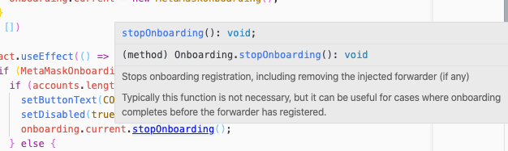
- 使用香草 Javascript + HTML

		<!DOCTYPE html>
		<html lang="en-CA">
		  <head>
		    <title>MetaMask Onboarding Example</title>
		    <meta charset="UTF-8" />
		  </head>
		  <body>
		    <h1>Sample Dapp</h1>
		    <button id="onboard">Loading...</button>
		    
		    
		  </body>
		</html>
### onboarding流程图
这是onboarding库，转发器和扩展之间的交互图：

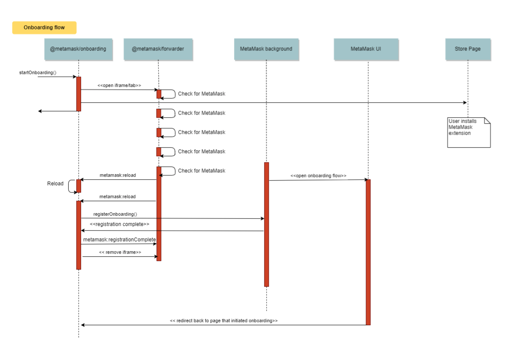
### MetaMask 扩展提供程序
用于访问用户的 MetaMask [提供程序](https://github.com/ethereum/wiki/wiki/JavaScript-API#web3currentprovider)的模块来自其他 WebExtensions。

该提供商提供的帐户将是用户的 MetaMask 帐户。

向该提供商发送签名请求时，MetaMask 将提示用户使用其帐户签名。

适用于：

- chrome
- firefox

#### 安装
使用 npm 作为程序包管理器：

	npm install metamask-extension-provider -s
#### 用法
使用像 browserify 一样的捆绑器：

	const createMetaMaskProvider = require('metamask-extension-provider');
	
	const provider = createMetaMaskProvider();
	
	provider.on('error', (error) => {
	  // Failed to connect to MetaMask, fallback logic.
	});
	
	// Enjoy!
#### 添加其他浏览器支持
将该浏览器商店的 MetaMask 扩展名添加到配置文件中。

	{
	  "CHROME_ID": "nkbihfbeogaeaoehlefnkodbefgpgknn",
	  "FIREFOX_ID": "webextension@metamask.io"
	}
#### 运行示例
将该 `./sample-extension` 文件夹用作 WebExtension。您可以轻松地将其添加到 Chrome 或 Firefox Developer Edition。
#### 编辑示例
您必须已 `browserif`y 安装（`npm i -g browserify`）。

您可以编辑示例文件  `sample-extension/index.js`，然后使用重建文件 `npm run buildSample`。
#### 与 MetaMask 的本地开发副本一起使用
您需要编辑该方法 `getMetaMaskId()` 以返回本地开发 MetaMask 的 ID。您可以使用来从 MetaMask 控制台中获取该信息 `chrome.runtime.id`。
#### 当前限制
为了确定何时出现问题（例如未连接 MetaMask），必须在 [metamask-inpage-provider](https://github.com/MetaMask/metamask-inpage-provider) 中添加某种适当的错误处理 将错误暴露给提供商的使用者。也许使它成为一个事件发射器，所以它可以发出错误，而不仅仅是记录它们。

## 移动
### 介绍
#### 为什么您和您的用户应使用 MetaMask Mobile
- 在几秒钟内为您的用户服务-无论他们已经是钱包用户还是全新用户，我们都会引导他们开始使用！
- 将您的 dapp 带入我们庞大且快速增长的用户群。
- 您的用户可以直接在 MetaMask Web3 浏览器中发现分散式 Web 的其他用例。
- 无论是在 MetaMask 浏览器上使用您的 dapp，还是更喜欢使用其他主浏览器，本机移动应用程序或桌面，用户都可以使用自己的 MetaMask 钱包签名。[*与支持 Wallet Connect 的 dapp 配合使用*]
- 以最优惠的价格轻松购买加密货币，并在许多国家/地区获得支持。
- 管理您的加密资产-观看或交易令牌，收藏品
- 将付款发送给您的家人和朋友（*免 Gas*，并且可以正常交易-随心所欲）
- 请求朋友，雇主等付款
- 我们还有很多其他令人兴奋的内容-敬请期待，这仅仅是开始😉
 
请访问[我们的主页](https://metamask.io/) 以了解有关在何处下载移动应用程序的更多信息。

### 网站兼容性清单
确保您的网站与 [MetaMask以太坊提供商API](https://docs.metamask.io/guide/ethereum-provider.html) 兼容，并查看 [MetaMask Mobile 最佳做法](https://docs.metamask.io/guide/mobile-best-practices.html)

将 MetaMask Mobile 作为列出的钱包包含在您的应用程序中，并链接以打开 MetaMask Mobile 应用程序（如果已安装）或转到应用程序商店（如果尚未安装）

- 我们建议添加一个 `Connect With MetaMask` 按钮并使用深层链接
- 有关深层链接的更多信息，请参阅[最佳实践文档](https://docs.metamask.io/guide/mobile-best-practices.html#deeplinking)。

请将您的用户定向到相关的应用商店列表或 MetaMask 主页 [下载 MetaMask Mobile](https://metamask.io/download.html)

#### Web3 网站用户界面库
`Connect With MetaMask` 这里有两个选项，而不是创建您自己的按钮

- [Rimble UI](https://rimble.consensys.design/)
- [Decentraland 用户界面](https://ui.decentraland.org/?path=/story/atlas--uncontrolled)

### 最佳实践
如果此页面未回答您的问题，请随时在我们的[存储库](https://github.com/MetaMask/metamask-mobile)中打开一个问题 。
#### 提供商（window.ethereum）
	如果您是以太坊应用程序开发人员，并且正在寻找有关我们2021年1月提供程序API更改的信息，请参阅我们的迁移指南以获取更多详细信息。
该[供应商 API](https://docs.metamask.io/guide/ethereum-provider.html) 是两个 MetaMask 移动和桌面扩展相同。但是，提供商在页面生命周期的不同点可用（即被注入到页面中）。
### 提供商可用性
如果您使用 [@metamask/detect-provider](https://npmjs.com/package/@metamask/detect-provider) ，没有什么可担心的；它将可靠地检测到移动提供商和扩展提供商。

如果不使用该 `detect-provide` 程序包，则必须手动检测移动提供商。

在您执行代码时，扩展提供程序将始终可用。由于平台的限制，移动提供商可能要等到页面生命周期的后期才能注入。为此，MetaMask 提供程序 `ethereum#initialized` 在 `window` 完全初始化事件时将其分派。

您可以使用以下代码段可靠地检测移动提供商和扩展提供商。

	if (window.ethereum) {
	  handleEthereum();
	} else {
	  window.addEventListener('ethereum#initialized', handleEthereum, {
	    once: true,
	  });
	
	  // If the event is not dispatched by the end of the timeout,
	  // the user probably doesn't have MetaMask installed.
	  setTimeout(handleEthereum, 3000); // 3 seconds
	}
	
	function handleEthereum() {
	  const { ethereum } = window;
	  if (ethereum && ethereum.isMetaMask) {
	    console.log('Ethereum successfully detected!');
	    // Access the decentralized web!
	  } else {
	    console.log('Please install MetaMask!');
	  }
	}
#### 使用 WalletConnect
通过 WalletConnect，您可以在其他浏览器，桌面或移动应用程序上使用应用程序时，将 MetaMask Mobile 用作签名者。查看 [WalletConnect 移动链接文档](https://docs.walletconnect.org/mobile-linking) 有关更多信息。
#### 深层连结
[单击此处](https://metamask.github.io/metamask-deeplinks/#)为您的应用程序创建深层链接。

深度链接可通过正确参数化的交易即时调用用户的首选钱包应用程序。

只有（经过身份验证的）用户可以确认交易，并且钱包可以是 Web、移动或桌面应用程序。

嵌入在 QR 码中的 URL、网页中的超链接、电子邮件或聊天消息，可在松散耦合的应用程序之间实现强大的跨应用程序信令。

您可以对以下内容使用深层链接：

- 创建一个 URL，以便您的用户可以直接在 MetaMask Mobile 中打开您的应用程序，以使用其以太坊帐户与您的应用程序进行交互。
- 提供一键式体验，使用户可以轻松地向另一个帐户付款（具有预先填写的参数、例如收件人地址、金额、网络等）
- 让您的用户通过 Connext 付款渠道请求进行免 Gas 且即时的交易
	- 这就要求用户选择加入 InstaPay 实验功能。

#### 网站测试与调试
轻松在任何 iOS 或 Android 设备上使用 MetaMask Mobile 测试和调试您的 web3 网站。

- 测验
	- 将开发服务器配置为在主机的本地IP地址 `192.168.x.x` 或上运行 `0.0.0.0`。
	- 确保测试设备使用与托管服务器的计算机相同的 WiFi 连接。
	- 在 MetaMask Mobile Web 浏览器中，通过导航到您的网站 `http://YOUR_LOCAL_IP:PORT`。

	如果您使用的是 Android 设备，则必须 `xip` 在网址中使用。例子：`http://192.168.x.x.xip.io:8000`
- 调试
	- 重要的

		为了安全起见，如果该应用是通过 Apple App Store 或 Google Play 商店下载的，则无法在 iOS 和 Android 上进行 Web 浏览器调试。您必须从 [MetaMask Mobile 存储库](https://github.com/MetaMask/metamask-mobile)本地构建应用程序 并在模拟器或物理设备上运行它。
- iOS
	- 打开 Safari `偏好设置->高级->启用菜单栏` 中的`显示开发菜单`复选框
	- 在 iOS 模拟器或 iOS 设备中打开 MetaMask Mobile
	- 在 Safari `菜单栏中->开发-> [设备名称] -> [应用名称] -> [URL-标题]`

	在物理设备上调试时，必须在设备的设置中启用 Web Inspector：

		设置-> Safari- >高级-> Web检查器
- 安卓
	- 在 Android 模拟器或 Android 设备中打开 MetaMask Mobile
	- 打开 Goog​​le Chrome 浏览器的 `DevTools->菜单（3点）->更多工具->远程设备` 您也可以 `chrome://inspect` 从 Chrome 浏览器浏览到可用设备列表，以进行调试
	- 在左侧选择您的设备，然后在您要`检查`的浏览器内容上单击`检查`。

	在物理设备上调试时，必须在设备的设置中启用 USB 调试：

		设置->系统->关于手机->开发人员选项->启用USB调试

	您现在可以像在网络上一样调试MetaMask Mobile的浏览器内容！

## 创建一个简单的 Dapp
我们将构建这个[程序]
### 项目准备
设置之前，请确保您已访问并阅读了 [《onboarding指南》](https://docs.metamask.io/guide/getting-started.html#getting-started)

确保您具有：

- 该 [MetaMask扩展](https://metamask.io/download.html) 已下载。
- 已下载并安装 [Node.js](https://nodejs.org/)
- 克隆/下载[样例项目文件](https://github.com/BboyAkers/simple-dapp-tutorial) 来自GitHub。

		git clone https://github.com/BboyAkers/simple-dapp-tutorial
- 您最喜欢的文本编辑器或IDE 编辑

#### 打开项目文件夹
进入项目文件夹 `start-> index.html`，然后看一下说明第1部分的注释。在本教程的第一部分中将使用/构建整个部分。

	cd simple-dapp-tutorial/start
#### 安装依赖项
- 打开一个终端，并确保您的终端位于 `start` 文件夹 的基本目录内。在文件夹内，文件应如下所示：
	
		 % tree
		 .
		├── README.md
		├── contract.js
		├── index.html
		├── metamask-fox.svg
		├── metamask.css
		├── package.json
		└── yarn.lock
- 在 start 文件夹中运行：

		npm install
- 这将安装我们项目所需的所有必需依赖项。这将创建一个 `node_modules` 文件夹，其中存储了所有依赖项。

		npm run serve
- 项目地址

		http://localhost:9011
	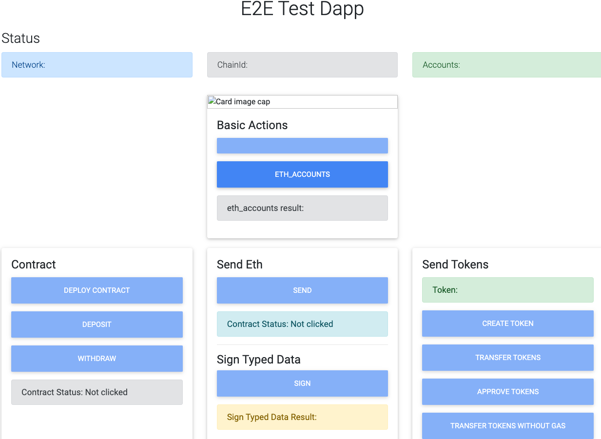

### 基本动作（第1部分）
- 打开项目目录中的 `contract.js` 文件。
	
		vi contract.js
		
		//不用担心第1-31行。
		const forwarderOrigin = 'http://localhost:9010';
		
		const initialize = () => {
		  //You will start here
		};
		window.addEventListener('DOMContentLoaded', initialize);

	一旦 DOM 中的内容加载完毕就会调用的 initialize 函数。在开始编写任何代码之前需要查看此应用程序第一部分的任务列表中的内容。
- 在第一部分中介绍以下内容
	- [连接到 MetaMask 钱包](https://docs.metamask.io/guide/create-dapp.html#connecting-to-the-metamask-wallet)
	- 查看 `eth_accounts` 结果
	- 显示网络号码
	- 显示 `ChainId`
	- 显示帐户

- 连接到 MetaMask 钱包

	在 Dapp 中需要做的第一件事是连接到 MetaMask 电子钱包。

	- 需要创建一个函数来查看是否已安装 MetaMask Chrome 扩展程序
		- 如果未安装 MetaMask
			- 更改 `connectButton` 为 `Click here to install MetaMask`
			- 点击该按钮后应该进入一个页面，该页面将允许安装扩展程序
			- 禁用按钮
		- 如果安装了MetaMask
			- 更改 `connectButton` 为 `Connect`
			- 单击该按钮时，它应该允许连接到 MetaMask 钱包
			- 禁用按钮

### MetaMask 钱包扩展检查
- 在合约代码中需要从 index.html 连接到我们的按钮

		const initialize = () => {
		  //Basic Actions Section
		  // 基本动作部分
		  const onboardButton = document.getElementById('connectButton');
		};
- 接下来创建一个检查函数，`isMetaMaskInstalled` 以查看是否已安装 MetaMask 扩展

		const initialize = () => {
		  //Basic Actions Section
		  //基本动作部分
		  const onboardButton = document.getElementById('connectButton');
		
		  //Created check function to see if the MetaMask extension is installed
		  //创建检查功能以查看是否已安装 MetaMask 扩展
		  const isMetaMaskInstalled = () => {
		    //Have to check the ethereum binding on the window object to see if it's installed
		    //必须检查 window 对象上的以太坊绑定以查看是否已安装
		    const { ethereum } = window;
		    return Boolean(ethereum && ethereum.isMetaMask);
		  };
		};
- 接下来需要创建一个 `MetaMaskClientCheck` 函数，以查看是否需要根据是否已安装 `MetaMask Extension` 来更改按钮文本。

		const initialize = () => {
		  //Basic Actions Section
		   //基本动作部分
		  const onboardButton = document.getElementById('connectButton');
		
		  //Created check function to see if the MetaMask extension is installed
		  //创建检查功能以查看是否已安装 MetaMask 扩展
		  const isMetaMaskInstalled = () => {
		    //Have to check the ethereum binding on the window object to see if it's installed
		    //必须检查 window 对象上的以太坊绑定以查看是否已安装
		    const { ethereum } = window;
		    return Boolean(ethereum && ethereum.isMetaMask);
		  };
		
		  //------Inserted Code------\\
		  //------插入代码------\\
		  const MetaMaskClientCheck = () => {
		    //Now we check to see if MetaMask is installed
		    //检查是否已安装MetaMask
		    if (!isMetaMaskInstalled()) {
		      //If it isn't installed we ask the user to click to install it
		      //如果未安装更改按为'Click here to install MetaMask!'
		      onboardButton.innerText = 'Click here to install MetaMask!';
		    } else {
		      //如果已安装，则更改按钮为 'Connect'
		      onboardButton.innerText = 'Connect';
		    }
		  };
		  MetaMaskClientCheck();
		  //------/插入代码------\\
		};
- 查看结果
	- 安装钱包的
	
		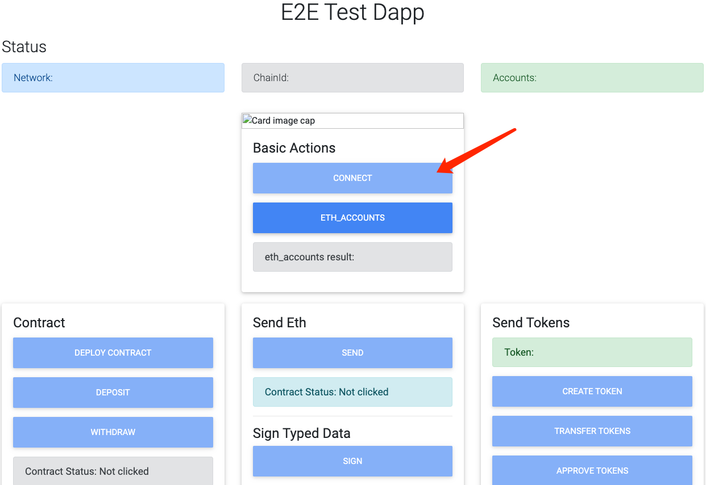
	- 没有安装钱包

		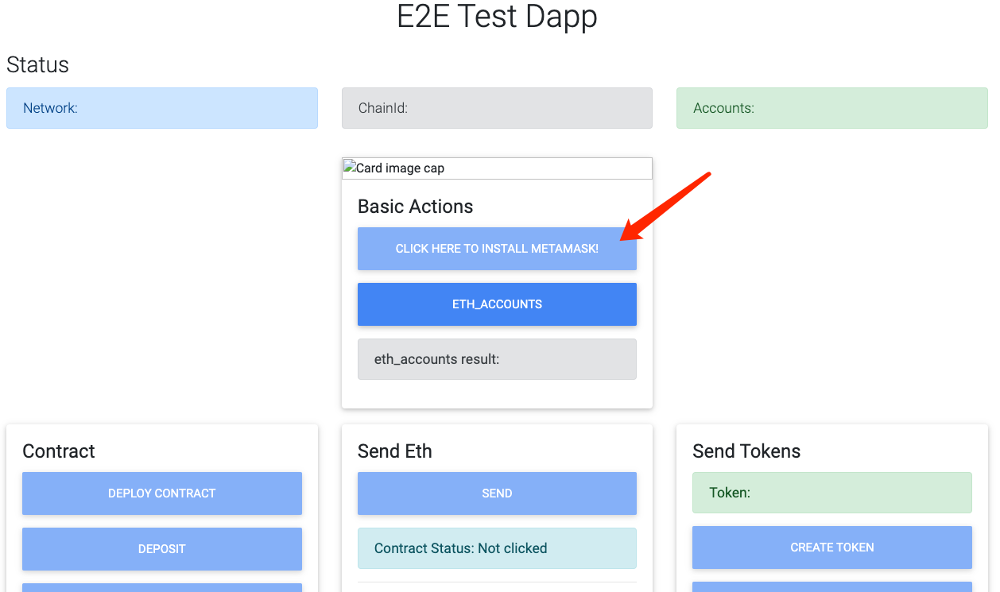	

#### MetaMask “未安装” Dapp 逻辑
- 未安装 MetaMask 求用户安装的代码块中 `Click here to install MetaMask!`，如果单击按钮需要进行安装：
	- 将用户重定向到正确的页面以安装扩展程序
	- 禁用按钮

	代码如下
		
		const MetaMaskClientCheck = () => {
		  //Now we check to see if Metmask is installed
		  //检查是否已安装MetaMask
		  if (!isMetaMaskInstalled()) {
		    //If it isn't installed we ask the user to click to install it
		    //如果未安装更改按为'Click here to install MetaMask!'
		    onboardButton.innerText = 'Click here to install MetaMask!';
		    //When the button is clicked we call this function
		    //当单击按钮时，我们调用此函数
		    onboardButton.onclick = onClickInstall;
		    //The button is now disabled
		    //此按钮现已禁用
		    onboardButton.disabled = false;
		  } else {
		    //If it is installed we change our button text
		    //如果已安装，则更改按钮为 'Connect'
		    onboardButton.innerText = 'Connect';
		  }
		};
		MetaMaskClientCheck();
- 创建了一个函数 `onClickInstall `

	只要单击该按钮并将其禁用，就会调用该函数。对于这一部分，我们将使用在执行 npm 安装时安装的 `@ metamask/onboarding` 库。要了解更多信息，[请点击这里](https://github.com/MetaMask/metamask-onboarding#metamask-onboarding)

	在此函数功能要完成：
	
	- 将按钮的文本更改为 Onboarding in progress
	- 禁用按钮
	- 开始 onboarding 流程

	在 `MetaMaskClientCheck` 函数上方编写/插入此代码。

		//We create a new MetaMask onboarding object to use in our app
		//创建一个新的 MetaMask onboarding 对象以在应用程序中使用
		const onboarding = new MetaMaskOnboarding({ forwarderOrigin });
			
		//This will start the onboarding proccess
		//这将启动 onboarding 过程
		const onClickInstall = () => {
		  onboardButton.innerText = 'Onboarding in progress';
		  onboardButton.disabled = true;
		  //On this object we have startOnboarding which will start the onboarding process for our end user
		  //在此对象上有 startOnboarding，它将为最终用户启动 onboarding 过程
		  onboarding.startOnboarding();
		};
	伟大的！现在如果用户没有 MetaMask 扩展，我们可以将其安装到哪里。当他们刷新页面时，以太坊 windows 对象将在那里，我们可以继续将其 MetaMask 钱包连接到我们的 Dapp！

#### MetaMask“已安装” Dapp流
- 接下来需要重新访问  `MetaMaskClientCheck` 功能，并执行与“未安装 MetaMask”块中相似的功能，直到现在的 “已安装MetaMask” 代码块。

		const MetaMaskClientCheck = () => {
		  //Now we check to see if Metmask is installed
		  //检查是否已安装 MetaMask
		  if (!isMetaMaskInstalled()) {
		    //If it isn't installed we ask the user to click to install it
		    //如果未安装更改按钮要求用户单击以安装它
		    onboardButton.innerText = 'Click here to install MetaMask!';
		    //When the button is clicked we call th is function
		    //当单击按钮时，我们调用此函数
		    onboardButton.onclick = onClickInstall;
		    //The button is now disabled
		    //此按钮现已禁用
		    onboardButton.disabled = false;
		    
		  } else {
		    //If MetaMask is installed we ask the user to connect to their wallet
		     //如果安装更改按钮为 Connect
		    onboardButton.innerText = 'Connect';
		    //When the button is clicked we call this function to connect the users MetaMask Wallet
		    //当点击按钮时，我们调用此函数来连接用户 MetaMask Wallet
		    onboardButton.onclick = onClickConnect;
		    //The button is now disabled
		    //此按钮现已禁用
		    onboardButton.disabled = false;
		  }
		};
		MetaMaskClientCheck();
- 创建了一个函数，只要单击按钮以触发与钱包的连接并禁用该按钮，就会调用该函数。

	在此函数完成功能：

	- 创建一个异步函数，该函数将尝试调用 `eth_requestAccounts` RPC方法
	- 捕获任何错误并将其记录到控制台

	在 `onClickInstall` 函数下编写/插入此代码。

		const onClickConnect = async () => {
		  try {
		    // Will open the MetaMask UI
		    // 将打开 MetaMask UI
		    // You should disable this button while the request is pending!
		    //请求待处理中将禁用此按钮！
		    await ethereum.request({ method: 'eth_requestAccounts' });
		  } catch (error) {
		    console.error(error);
		  }
		};
	现在，一旦单击按钮，`MetaMask Extension` 就会弹出并连接您的钱包。

	- 打开钱包选择登陆账户 
	
		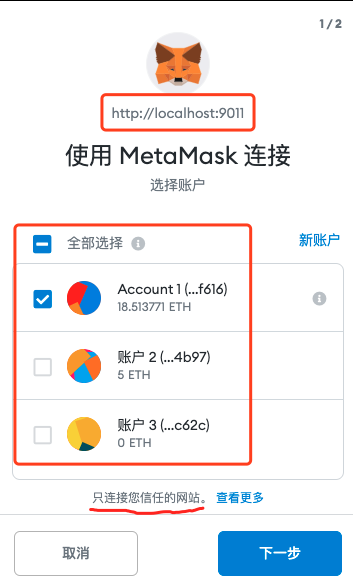
		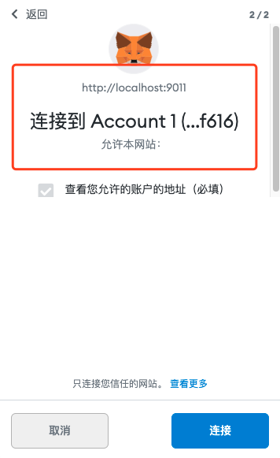
	- 在钱包中查看登陆情况
	
		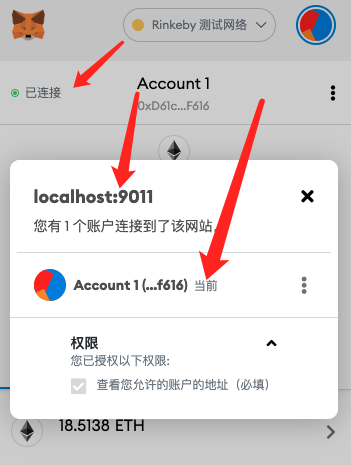
		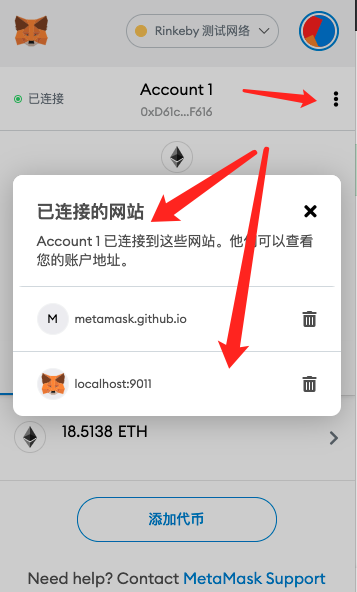

#### 获取以太坊账户
- 我们要做的就是每们按下 `eth_accounts` 按钮时想要获得以太坊账户并显示它。

		//Basic Actions Section
		//基本动作部分
		const onboardButton = document.getElementById('connectButton');
		const getAccountsButton = document.getElementById('getAccounts');
		const getAccountsResult = document.getElementById('getAccountsResult');
- 现在已经抓到了 `eth_accounts` 按钮，并且要在其中显示它的段落字段要抓取数据。

	在 `MetaMaskClientCheck()` 功能下编写/插入的代码。

		//Eth_Accounts-getAccountsButton
		getAccountsButton.addEventListener('click', async () => {
		  //we use eth_accounts because it returns a list of addresses owned by us.
		  //我们使用 eth_accounts，因为它会返回我们拥有的地址列表
		  const accounts = await ethereum.request({ method: 'eth_accounts' });
		  //We take the first address in the array of addresses and display it
		  //我们获取地址数组中的第一个地址并显示它
		  getAccountsResult.innerHTML = accounts[0] || 'Not able to get accounts';
		});
- 查看钱包默认账户
		
	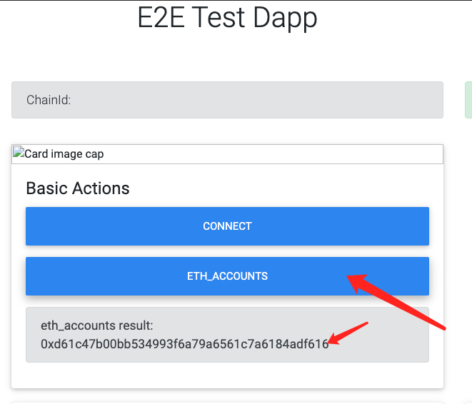

恭喜！我们刚刚完成了基本动作功能的构建。现在进入下一步，显示我们的状态。

### 第一步代码总和如下
	const forwarderOrigin = 'http://localhost:9010'
	
	const initialize = () => {
	  //Basic Actions Section
	  //基本动作部分
	  const onboardButton = document.getElementById('connectButton');
	  const getAccountsButton = document.getElementById('getAccounts');
	  const getAccountsResult = document.getElementById('getAccountsResult');
	
	  //Created check function to see if the MetaMask extension is installed
	  //创建检查功能以查看是否已安装 MetaMask 扩展
	  const isMetaMaskInstalled = () => {
	    //Have to check the ethereum binding on the window object to see if it's installed
	    //必须检查 window 对象上的以太坊绑定以查看是否已安装
	    const { ethereum } = window;
	    return Boolean(ethereum && ethereum.isMetaMask);
	  }
	
	  // 这块注释问题是代码报错，没有解决，跳过
	  //We create a new MetaMask onboarding object to use in our app
	  //创建一个新的 MetaMask onboarding 对象以在应用程序中使用
	  //const onboarding = new MetaMaskOnboarding({ forwarderOrigin });
	
	  //This will start the onboarding proccess 
	  //这将启动 onboarding 过程
	  //const onClickInstall = () => {
	    //onboardButton.innerText = 'Onboarding in progress';
	    //onboardButton.disabled = true;
	    //On this object we have startOnboarding which will start the onboarding process for our end user
	    //在此对象上有 startOnboarding，它将为最终用户启动 onboarding 过程
	    //onboarding.startOnboarding();
	  //};
	  const onClickConnect = async () => {
	    try {
	      // Will open the MetaMask UI
	      // 将打开 MetaMask UI
	      // You should disable this button while the request is pending!
	      //请求待处理中将禁用此按钮！
	      await ethereum.request({ method: 'eth_requestAccounts' });
	    } catch (error) {
	      console.error(error);
	    }
	  };
	  
	  //------Inserted Code------\\
	  //------插入代码------\\
	  const MetaMaskClientCheck = () => {
	    //Now we check to see if MetaMask is installed
	    //检查是否已安装MetaMask
	    if (!isMetaMaskInstalled()) {
	      //If it isn't installed we ask the user to click to install it
	      //如果未安装更改按钮要求用户单击以安装它
	      onboardButton.innerText = 'Click here to install MetaMask!';
	      //When the button is clicked we call this function
	      //当单击按钮时，我们调用此函数
	      onboardButton.onclick = onClickInstall;
	      //The button is now disabled
	      //此按钮现已禁用
	      onboardButton.disabled = false;
	    } else {
	      //如果已安装，则更改按钮文本
	      onboardButton.innerText = 'Connect';
	      //When the button is clicked we call this function to connect the users MetaMask Wallet
	      //当点击按钮时，我们调用此函数来连接用户 MetaMask Wallet
	      onboardButton.onclick = onClickConnect;
	      //The button is now disabled
	      //此按钮现已禁用
	      onboardButton.disabled = false;
	    }
	  }
	
	  //Eth_Accounts-getAccountsButton
	  getAccountsButton.addEventListener('click', async () => {
	    //we use eth_accounts because it returns a list of addresses owned by us.
	    //我们使用 eth_accounts，因为它会返回我们拥有的地址列表
	    const accounts = await ethereum.request({ method: 'eth_accounts' });
	    //We take the first address in the array of addresses and display it
	    //我们获取地址数组中的第一个地址并显示它
	    getAccountsResult.innerHTML = accounts[0] || 'Not able to get accounts';
	  });
	
	  MetaMaskClientCheck();
	  //------/插入代码------\\
	}
	
	window.addEventListener('DOMContentLoaded', initialize)

## demo 基础功能
- 未登陆前
	- 钱包链接网络 id
	- chainid 
	- 检查是否安装钱包
		- 未安装钱包按钮会提示安装
		- 安装钱包会提示可以登陆链接
	- 登陆钱包  
- 登陆后
	- 查询登陆地址
	- 权限设置
		- 设置权限，对账户(暂时只有一个权限)
		- 查询权限
	- 发以太
	- 合约
		- 部署
		- 合约状态
		- 合约地址金额
		- 合约金额提取
	-  token
		- 创建
		- 交换
		- 许可
		- 设定交换gas
		- 批准交换gas 
	- 加密
		- 获取加密公钥
		- 加密
		- 解密
	- 签名
		- 各种签名
		- 各种验证
	- 添加其他链

	 	      		
## 参考
- [MetaMask docs](https://docs.metamask.io/guide/)
- [手册](https://github.com/MetaMask/metamask-docs/edit/master/packages/docs/dist/guide/common-terms.md)
- [全 demo 地址](https://metamask.github.io/test-dapp/)

## 推荐读物
- [web3基本用法](https://docs.metamask.io/guide/ethereum-provider.html#basic-usage)
- [metamask 迁移指南](https://docs.metamask.io/guide/provider-migration.html)
- [RPC API 的更多信息](https://docs.metamask.io/guide/rpc-api.html)
- [以太坊 JSON-RPC API](https://eips.ethereum.org/EIPS/eip-1474)