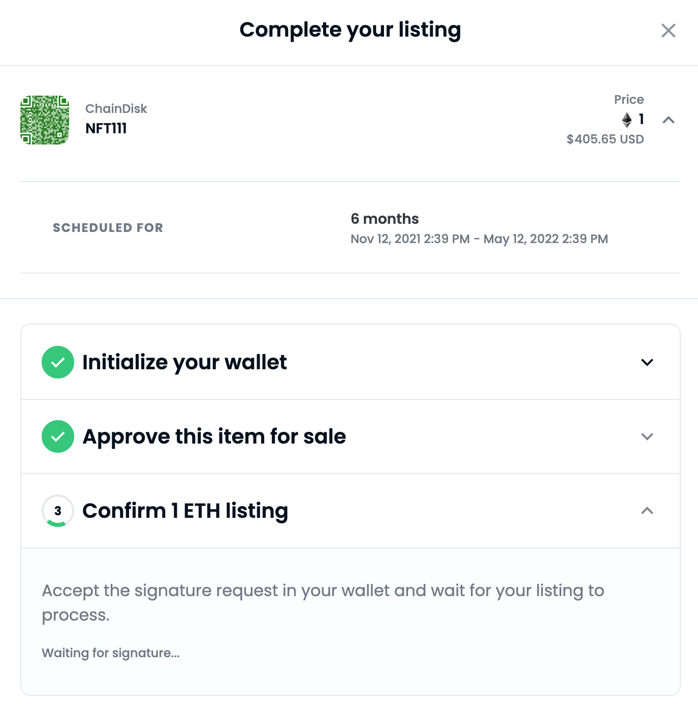

# opensea 钱包登陆逻辑
- dapp 登陆，需要授权获取地址信息，提示信息如下

		查看您允许的账户的地址（必填）
		
		
		
- 创建物品		

		Welcome to OpenSea!
		
		Click "Sign" to sign in. No password needed! //登陆不需要密码
		This request will not trigger a blockchain transaction or cost any gas fees. // 不会触发区块链交易或者交易费
		
		Your authentication status will be reset after 24 hours. // 认证将保持 24 小时
		
		I accept the OpenSea Terms of Service: https://opensea.io/tos // 查询服务信息
		
		Wallet address:  // 地址
		0xd61c47b00bb534993f6a79a6561c7a6184adf616
		
		Nonce: // 放冲突
		586102
- 设置销售
	- 弹出流程菜单
		- 初始化钱包(登陆已经做了) 
		- 必须批准物品买卖
			- 卖什么东西，是否
			- 签名
			- 正规交易烧 gas
	- 钱包
		
			Set Approval For All(授权 operator)
			
			参数:
			[
			  {
			    "type": "address"
			  },
			  {
			    "type": "bool"
			  }
			]			    		
			十六进制数据: 68 BYTES
			0xa22cb46500000000000000000000000069f302131ceab6552a2772bb79571e85eccae7530000000000000000000000000000000000000000000000000000000000000001
	- 确认
		- 等待链回复

			
			
				接受您钱包中的签名请求并等待您的列表处理。
	
				等待签名...
		- 钱包签名交易，授权价格挂单

				0xdfe43861096a88f83eaedd3508beb9c227360b71dac312351e2f21c1637826d0	
# NFT 业务流
- 铸造流程