# opensea 支持第三方钱包流程
## Bitski
### opensea
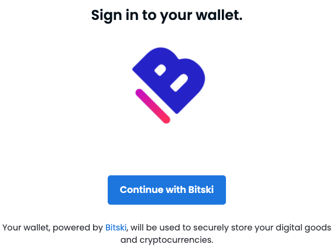
### 注册
- 注册界面

	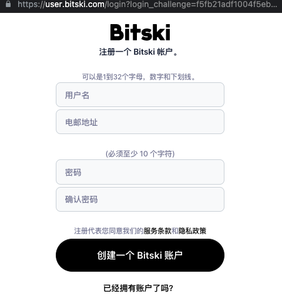
	
	- 填写
		- 用户名
		- 邮箱
		- 密码两次(要求必须是10个字符)
	- 查看 
		- 服务条款
		- 隐私政策
	- 创建按钮
	- 登陆跳转按钮
- 手机验证码
	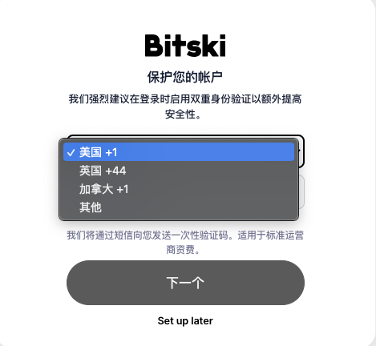
	
	- 国家选择
	- 国家号码
		- 中国+86 
	- 手机号码
		- 手机号码即可，不用加0
- 填写验证码  

	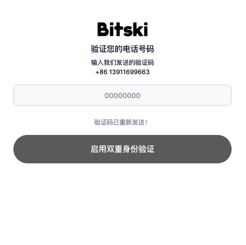
	
	- 填写
		- 验证码
	- 按钮
		- 启用双重身份验证
			- 确认按钮
			- 不填写验证码不可点 
		- 重新发送验证码	
			- 相同的手机号，申请多次得到相同验证码 
- 授权界面

	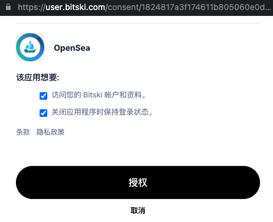 
	
	- 多选按钮
		- 允许访问钱包账户资料
		- 关闭应用保持登陆
	- 查看
		- 隐私条款
	- 按钮
		- 授权
		- 取消    	 
			
### 登陆
- 登陆界面

	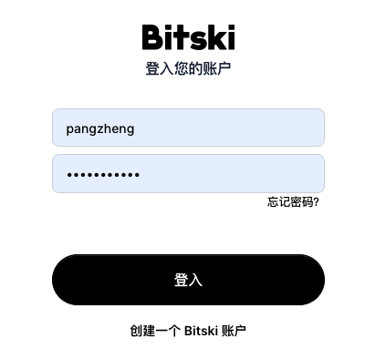
	
	- 填写
		- 账户
		- 密码
	- 按钮
		- 忘记密码
		- 登陆
		- 新建账户
- 手机验证码
	
	 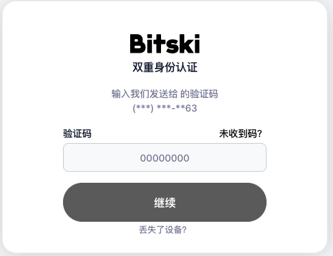
	
	- 填写
		- 验证码
	- 按钮
		- 未收到验证码(重发)
		- 继续
		- 丢失设备

			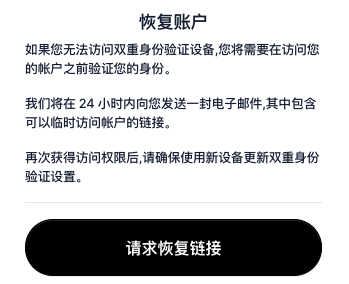

### 钱包功能
- 第一部分
	- 按钮
		- 登出
- 第二部分(轮廓)

	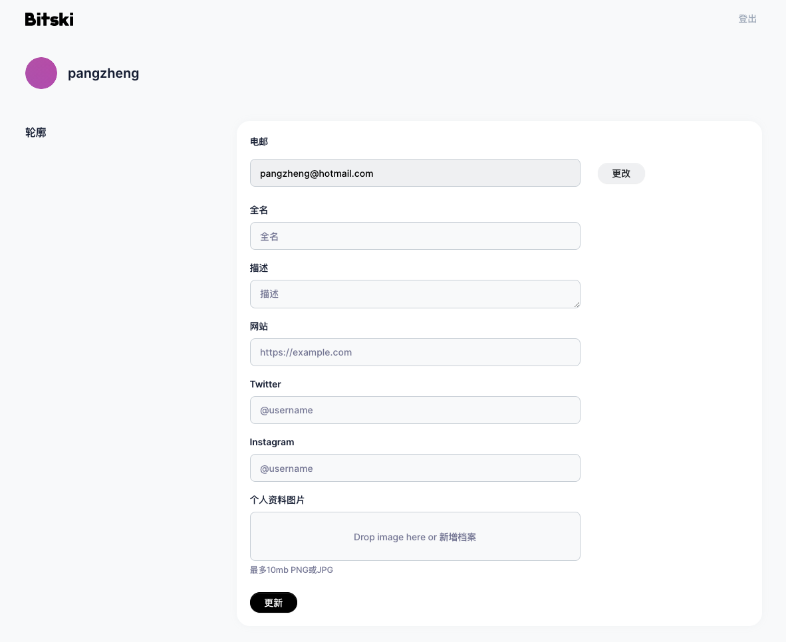
	
	- 可填
		- 邮箱(可改)
		- 全名
		- 描述
		- 网站
		- twitter
		- instagram
		- 个人资料图片
			- 限制10MB png/jpg
	- 按钮
		- 更新
- 第三部分(账户安全)
	
	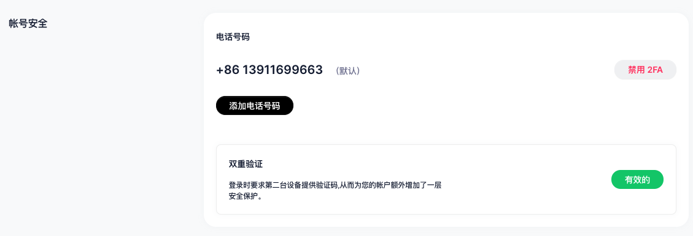
	
	- 按钮
		- 增加电话号码
		- 禁用 2FA  
- 第四、五部分

	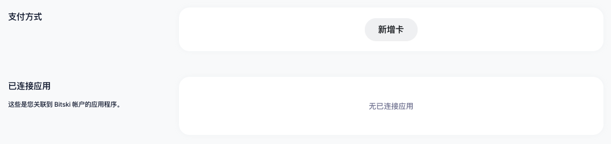
	
	- 第四部分(支付方式)
		
		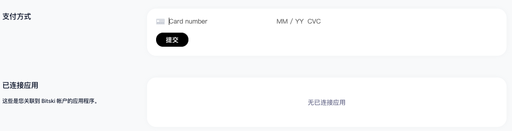
	- 第五部分(已连接应用)
- 钱包登陆界面

	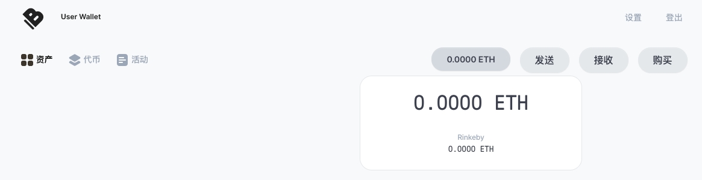
	
	- 左边
		- 资产
		- 代币
		- 活动
	- 右边
		- Eth 数量
			- 包含主网和 rinkeby  
		- 发送
		
			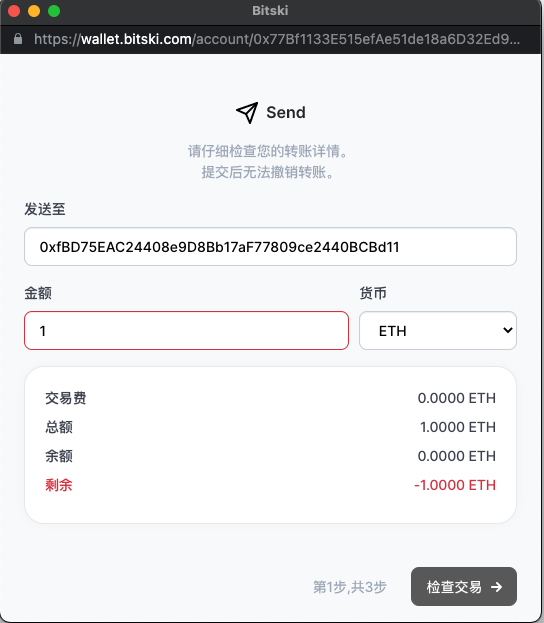
		- 接收

			当前只有以太坊地址，可以复制地址
			
			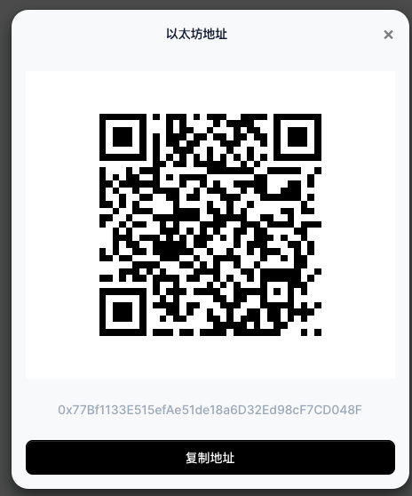
		- 购买
			- 法币换代币
				- 币种
					- 法币
						- 多种
					- 加密货币
						- BTC、ETH 等
				- 支付手段
					- 苹果 pay
					- 信用卡
				- 交易说明
					- 交易周期 
					- 交易费
					- 网络费
					- 总费用        
		
			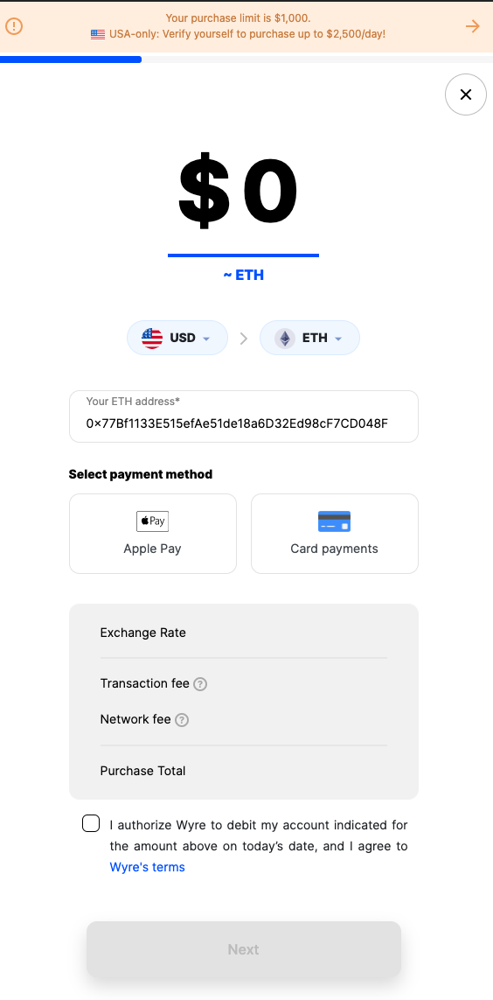
	     
### 找回密码
- 登陆界面-忘记密码
	
	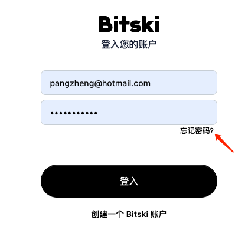
- 输入邮箱

		
- 邮件查看

	
- 邮箱

	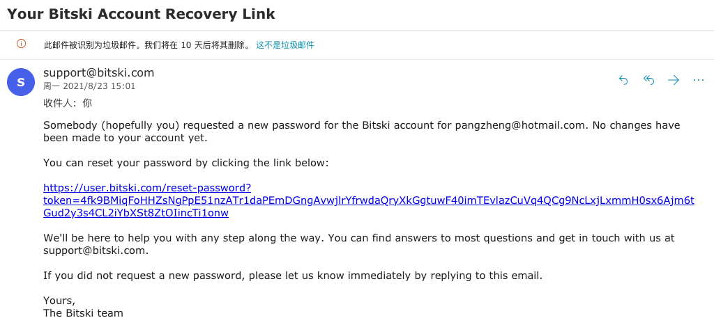
- 重置密码

	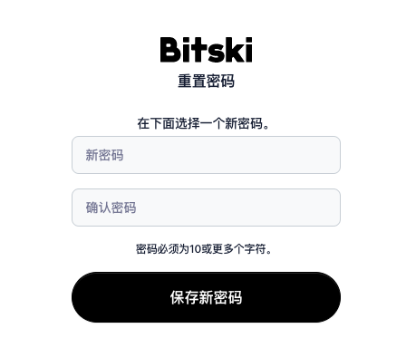				
	
## Arkane
### 注册
- 登陆注册入口

	
- 支持多账户登陆
	- google
	- facebook
	- twitter
	- 邮箱
- 邮箱注册

	 
	
	- 填入
		- 邮箱
		- 密码2次
		- 人机身份验证
		- 确认
- 确认授权

	
- 认证邮件
	
	
	 		
- 填写认证码

	 
- 设置 pin 码

	 	 	
	 		
### 登陆
- 登陆界面

	 
	 
	 
	- 填写
		- 邮箱
		- 密码
	- 按钮
		- 记住密码
		- 忘记密码
		- 登陆
		- 创建新账户
	- 多钱包选择

			
- 检测攻击页面

	  
### 设置
- 设置 pin

	   
- 设置
	- 账户设置

		 
		 
		 - 用户名(必填)
	- 设置密码

		 
		 
		 - 老密码
		 - 新密码*2
	- 两段验证

		 
	- 社区账户绑定

		 
	- session日志

		
	- 应用权限

		
	- 日志

			
		 	 
### 找回密码
- 邮箱验证

	
- 邮箱信息

	
- 重填新密码

	
				
### 钱包功能
- 创建钱包地址

	
		

	- 新建
		- 填写 pin
		
			
	- 添加新地址
	
			
- 地址详情

	
	
	- 可以查看所有、发送、接收、授权的事件
- 发送

	
	
	- 支持地址、邮件地址、域名(后2个是服务内部)
- 转换

	 
	 
	 支持各种币流转
- token (疑似各种代币)

	  
- inventory(疑似 NFT)

	  		
- 应用连接授权

						  
	    	
## Authereum(已经关闭)
### 注册
- 填入用户名(检查用户名)

	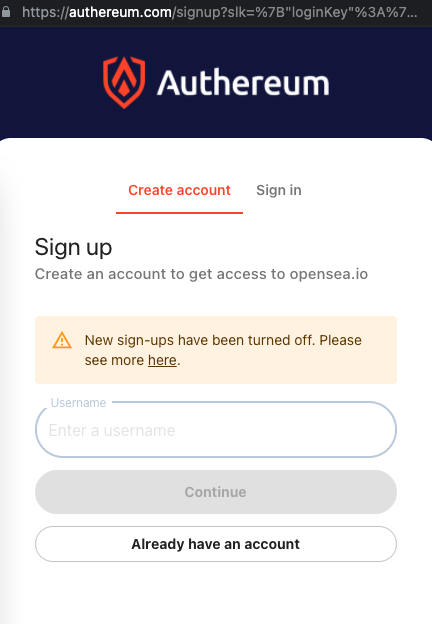
- 详细信息

	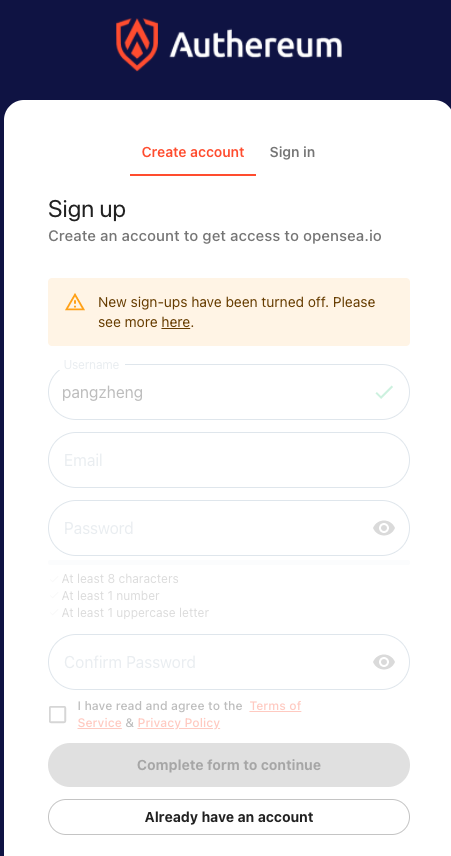
	
	- 填写
		- 邮箱
		- 密码*2
	- 选择
		- 服务
		- 隐私策略
		     	
### 登陆
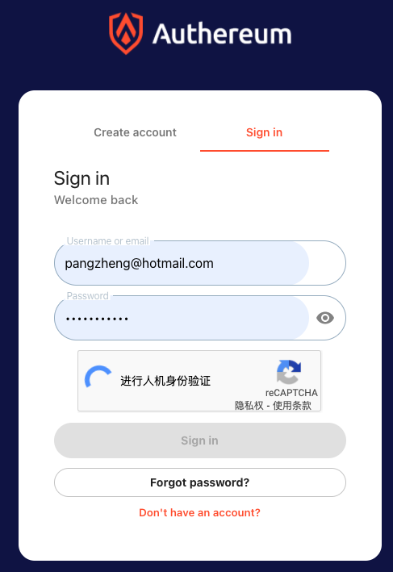

- 用户名
- 密码

### 找回密码
通过三种方式恢复

- 通过账户

	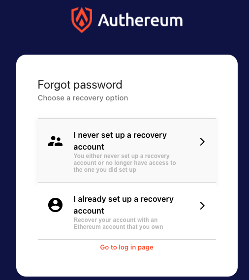
	
	- 没有设置恢复账户
		
		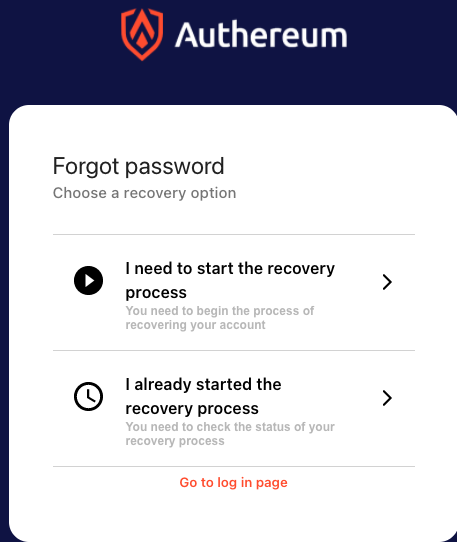
		
		- 开始恢复进程

			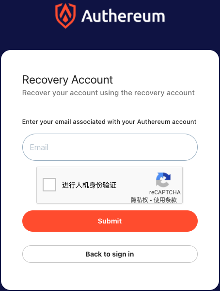
		- 检查恢复进程

			- 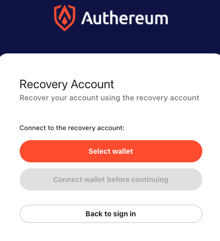
			- 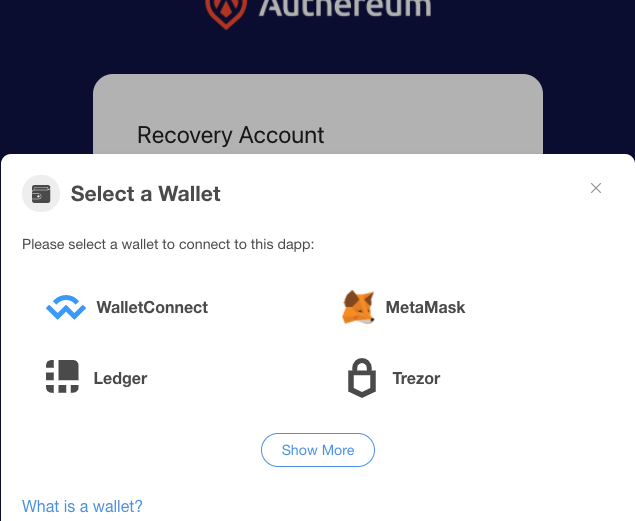
	- 设置恢复账户
		
- 通过短语
	 - 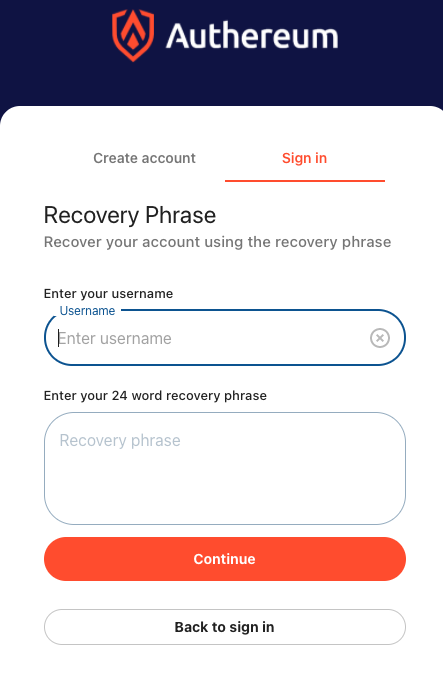 
- 通过状态恢复
	-  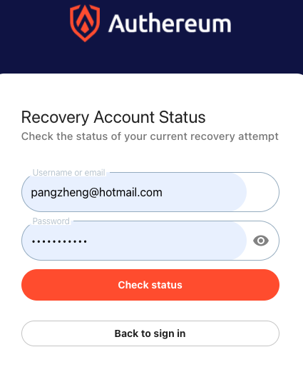  
	
### 修改密码

## Bitski
### 注册
### 登陆
### 找回密码
### 修改密码