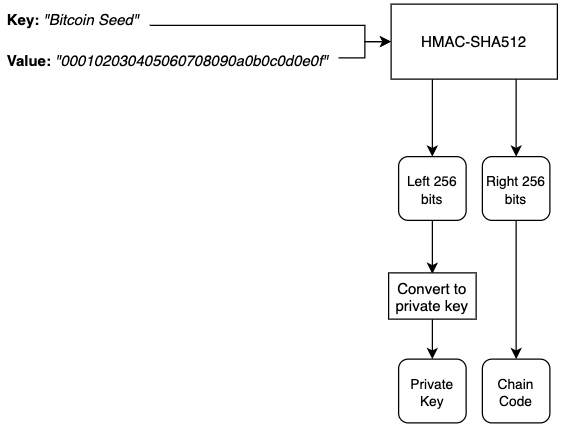
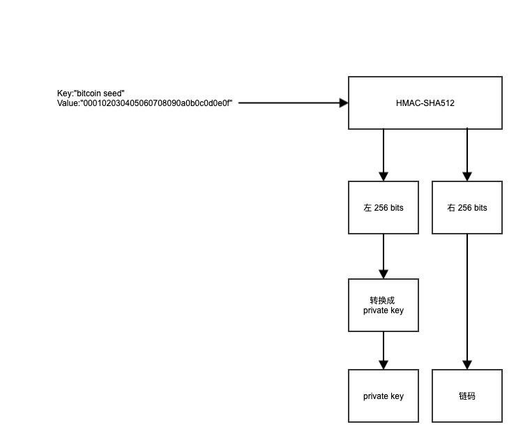
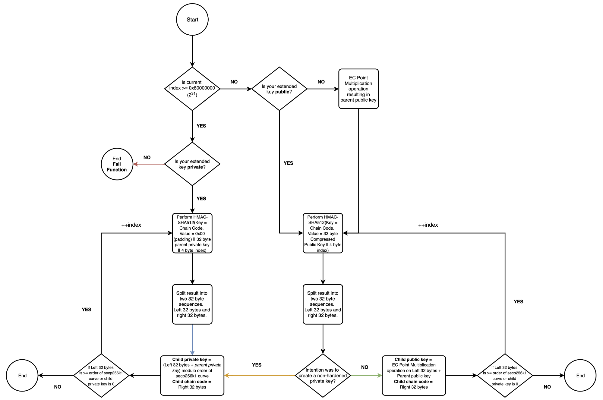
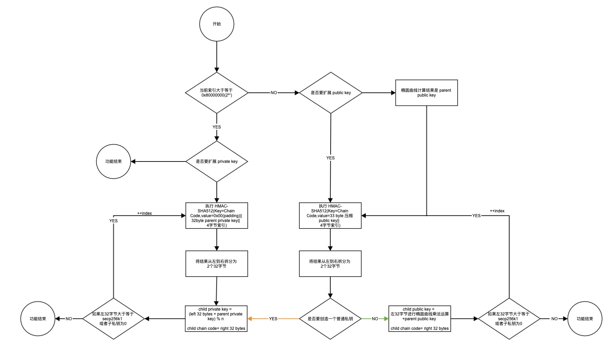

# HD 钱包：为什么强化衍生很重要？
非强化派生的扩展公钥不仅仅是任何旧的公钥，都需要小心处理。如果需要泄漏该公钥，但需要更更安全。就需要更安全的方式派生私钥，如强化派生。

分层确定性（HD）钱包大家可以想一想一组 ECDSA 键的方式。[BIP32](https://github.com/bitcoin/bips/blob/master/bip-0032.mediawiki) 力求更加以用户为中心的体验，试图改变软件钱包处理密钥生成的方式，从而消除对随时间创建的密钥池进行备份的需要。

从用户的角度来看，他们应该只需要记住一个 12 个单词的助记符，通常称为种子短语 ( [BIP39](https://github.com/bitcoin/bips/blob/master/bip-0039.mediawiki) )。所有符合 BIP39 的钱包都应该知道如何处理这个种子短语。旨在鼓励多个钱包实现之间的互操作性的功能。

本文的目的不是介绍 HD 钱包的基础知识，而是深入探讨并解释为什么强化派生很重要。在我们探讨这个问题之前，我们需要在更高的层次上理解推导。

# 什么是推导？
为简单起见，我们可以将其[想象](https://en.wikipedia.org/wiki/Elliptic_Curve_Digital_Signature_Algorithm)为一种用于在密钥树中生成特定 ECDSA 密钥对的机制。给定[父扩展键](https://bitcoin.org/en/developer-guide#term-extended-key)和索引数组，您将能够在树中的指定位置确定性地重新生成键。

树中的每个节点最多可以有 4,294,967,296 个子节点（2³²/32 位无符号整数）。此外，树的深度是无限的。导致从单个主种子生成无限数量的密钥的理想能力（这只是预定义长度的随机字节数组，请参阅[主密钥生成](https://github.com/bitcoin/bips/blob/master/bip-0032.mediawiki#master-key-generation)）。

作为入门，让我们介绍扩展私钥的创建，因为它是贯穿每个派生函数的重要变量。这个测试向量（Test Vector 1）取自原始的 BIP32 提案。我们只关注组成扩展键的两个字段；

- 链码
- 密钥数据（实际的公钥或私钥字节）

如果您对完整的序列化格式感兴趣，请参阅 [BIP32 序列化格式](https://github.com/bitcoin/bips/blob/master/bip-0032.mediawiki#serialization-format)。

同时，我拼凑了一些代码来演示 [BIP32 测试向量 1 扩展密钥](https://github.com/bitcoin/bips/blob/master/bip-0032.mediawiki#test-vector-1)的创建：

	import { algo, enc } from 'crypto-js';
	import { ec as EC } from "elliptic";
	import * as bs58check from "bs58check";
	
	const ec = new EC("secp256k1");
	
	const TEST_VECTOR_1_SEED = "000102030405060708090a0b0c0d0e0f";
	const MASTER_KEY_DERIVATION_KEY = "Bitcoin seed";
	const mainnetVersionBytesPriv = "0488ADE4";
	const mainnetVersionBytesPub = "0488B21E";
	const childDepth = "00"; // master node
	const parentFingerPrint = "00000000"; // Calculated from http://bip32.org/ - First 32 bits of the public key identifier i.e. HASH160(publicKey)
	const childNumber = "00000000";
	
	const key = Buffer.from(MASTER_KEY_DERIVATION_KEY).toString("hex");
	const hasher = algo.HMAC.create(algo.SHA512, enc.Hex.parse(key));
	hasher.update(enc.Hex.parse(TEST_VECTOR_1_SEED));
	const res = hasher.finalize().toString();
	
	
	const left256Bits = res.substring(0, 64);
	const right256Bits = res.substring(64, 128);
	const keypair = ec.keyFromPrivate(Buffer.from(left256Bits, "hex"));
	const masterPub = keypair.getPublic("hex");
	const compressedMasterPub = `${(Buffer.from(masterPub, "hex")[64] % 2 === 0) ? "02" : "03"}${masterPub.substring(2, 66)}`;
	
	const extendedPrivateKey = `${mainnetVersionBytesPriv}${childDepth}${parentFingerPrint}${childNumber}${right256Bits}00${left256Bits}`;
	const extendedPublicKey = `${mainnetVersionBytesPub}${childDepth}${parentFingerPrint}${childNumber}${right256Bits}${compressedMasterPub}`;
	const xprv = bs58check.encode(Buffer.from(extendedPrivateKey, "hex"));
	const xpub = bs58check.encode(Buffer.from(extendedPublicKey, "hex"));
	console.log(`Extended Private Key: ${xprv}`);
	console.log(`Extended Public Key: ${xpub}`);
	
逻辑上

- 原文

	
- 翻译

			
现在我们知道如何将种子转换为主扩展密钥，我们可以开始问一个问题，在给定主扩展密钥的情况下，我们如何派生子密钥？

## 子密钥派生 (CKD) 功能如何工作？
在相关的 [BIP](https://github.com/bitcoin/bips/blob/master/bip-0032.mediawiki#child-key-derivation-ckd-functions)上已经定义了对该功能的简明和大量注释的描述。下面提取了重要的部分（在不影响细节的情况下，见图2）。

子密钥派生函数有三个有效的排列。第四个是不可能的。这是因为假设找到一个随机椭圆曲线元素关于一个公知基点的离散对数是不可行的。

- 父私钥→ 子私钥（蓝黄线——图2）
- 公共父密钥 → 公共子密钥（绿线——图 2）
- 私有父密钥 → 公共子密钥（绿线 —图 2）
- 公共父密钥 → 私有子密钥（不可能 - 红线 -图 2）

通过 CKD 函数创建的每个密钥仍需要正确序列化才能成为扩展密钥。相同深度的私钥和公钥共享相同的链码

- 原文
	
	
- 翻译

	

就是这样，子键推导函数。正是原始 BIP 描述它的方式。

值得注意的是，此流程图的一次迭代构成了我们之前提到的键树中的一个深度级别。当我们到达图表的任何“结束”点时，我们可以递归地使用结果值通过在“开始”点重新开始来进一步深入。在继续之前，请花一点时间研究流程图。它用作下一节中的参考点。	

## 为什么强化派生很重要？
### 问题开始
Alice 是一位新的比特币用户，她选择了管理自己的 HD 钱包的非常规方法。请注意，不建议这样做。它容易出错，非常乏味而且……容易出错。不要做！

- 她开始时抛硬币 512 次。
	- 前 256 次获得 32 字节的私钥
	- 另外 256 次获得她的 32 字节链码
- 她将它序列化，这成为她扩展的父私钥

她的大学朋友 Siobhan 说，她开设了一家接受比特币支付的在线书店。Alice 和 Siobhan 达成协议，如果 Alice 帮助她理解比特币，那么 Siobhan 将让她免费在网站上列出任何数量的书籍。Alice 将获得 100% 的利润。

爱丽丝想要确保她从她的图书销售中收到所有的比特币。她可以依靠 Siobhan 在每次购买时向她发送比特币，但她不想要这个。爱丽丝希望将比特币直接发送到她的钱包。

爱丽丝此时有几个选择。所有这些都依赖于她向 Siobhan 公开了一些有关她钱包的数据。

为了缩小选择范围，Alice 需要的另一个要求是增加隐私。她想确保她为每本书收到的每一笔付款都发送到一个新的比特币地址。

她决定按照上面流程图中的黄色箭头进行操作。

- 她使用她的父扩展私钥创建一个非强化的子私钥。在这样做时，她需要用她的父私钥执行一些算术（请记住这一点，因为这是一个非常微妙和重要的点。

		child private key =( left 32 bytes + parent private key) % n)
- 她天真地将孩子的扩展私钥交给 Siobhan。在这一点上，Alice 不知道她现在暴露了她的整个 HD 钱包所面临的危险。
- 众所周知，Siobhan 对比特币世界并不是很了解。但是，Alice 确实教她如何为她列出的每本书创建新地址。Siobhan 按照上面流程图中的绿色路径为每本书创建一个新地址，每次递增索引以获得不同的公钥，然后可以将其解析为比特币地址（最好是[Bech32](https://github.com/bitcoin/bips/blob/master/bip-0173.mediawiki)）。她使用 Alice 与她共享的非强化子私钥来执行此操作。
- 随着时间的流逝，Alice 卖了很多书，总共赚了 ₿2.0。与此同时，Siobhan 的伙伴 Bob 说他可以帮助她运营网站。Siobhan 认识 Bob 的时间不长，但知道他是加密货币爱好者。Siobhan 认为 Bob 将能够为网站的顺利运行提供很多帮助。
- 几周过去了，爱丽丝试图在当地的一家咖啡店消费她的一些比特币。从那以后，她使用扩展的父私钥创建了更多的子密钥。她试图花费一个她认为存储在一个地址中的 UTXO，该地址是从一个完全独立的子公钥生成的，而该子公钥与 Siobhan 拥有的公钥不同。爱丽丝买不到她的咖啡。事实上，她整个 HD 钱包中的所有比特币都没有了，包括位于 Siobhan 生成的地址中的比特币。发生了什么事？她的父私钥已被泄露，但怎么办？

### 问题回顾
让我们回顾一下并解释这是如何发生的。

- 爱丽丝的第一个错误是试图自己做这一切。
- 她的第二个错误也是最重要的错误是给了 Siobhan 一个未加固的扩展子私钥。

### 黑客步骤
- 在 Bob 为 Susan 工作的第一天，他发现这个密钥嵌入在源代码中（请永远不要以这种方式存储私钥）。鲍勃知道他可以快速赚钱并轻松地拿走爱丽丝的所有利润。相反，他打了一场漫长的比赛，希望获得更大的回报。
- 他借此机会与爱丽丝成为朋友，并向她索要她的扩展父公钥。自然地，Alice 给了他它，认为它是完全安全的。爱丽丝不知道的是，鲍勃实际上是在要求拼图的最后一块。这将使他能够消灭爱丽丝的整个钱包，而不仅仅是她的图书销售。
- Bob 的目标是检索扩展的父私钥。他拥有执行这次攻击的所有数据。

	在这个阶段，只需使用一些简单的代数来解决父私钥而不是原始子私钥

		child private key = (left 32 bytes + parent private key) % n
	Bob 求解父私钥
	
		parent private key = (child private key - left 32 bytes) % n
- 他已经从源代码中获得了子私钥，并且通过执行 Alice 最初为 Siobhan 向 Siobhan 执行的相同操作而剩下的 32 个字节。他现在可以执行计算并捕获根私钥，控制整个钱包

### 解决方案
Alice 怎么能避开这个攻击向量呢？答案在于强化推导。如果 Alice 给 Siobhan 一个使用流程图上的蓝色箭头生成的扩展私钥，那么 Bob 将永远无法检索左边的 32 字节操作数来求解方程。这是假设 Alice 保持扩展的父私钥安全！实际上，只给 Siobhan 扩展的子公钥就足够了。Siobhan 没有充分理由在她的服务器上保存任何私钥。她从不需要签署任何交易。

总而言之，强化派生在 HD 钱包中的深度很有用，您预计需要共享扩展公钥的场景。您知道，下面任何泄露的子密钥都不会使父私钥易受攻击。

遵循 [BIP44](https://github.com/bitcoin/bips/blob/master/bip-0044.mediawiki) 中定义的树结构和适当的密钥管理将减少您容易受到这种攻击的任何可能性。

您可以在下面看到模拟上述场景的程序的输出。我使用 [BIP32 中的 Test Vector 1](https://en.bitcoin.it/wiki/BIP_0032_TestVectors) 作为 Alice 的父私钥。您可以看到攻击者实际上确实检索了 Alice 的主私钥。如果有任何兴趣，我可以将此代码发布到我的 [Github 帐户](https://github.com/blmalone)。

	Order of secp256k1 curve:  fffffffffffffffffffffffffffffffebaaedce6af48a03bbfd25e8cd0364141

	### MASTER KEY 推导 ###
	Master Private Key:  e8f32e723decf4051aefac8e2c93c9c5b214313817cdb01a1494b917c8436b35 (Alice's parent private key)
	Master Public Key:  0439a36013301597daef41fbe593a02cc513d0b55527ec2df1050e2e8ff49c85c23cbe7ded0e7ce6a594896b8f62888fdbc5c8821305e2ea42bf01e37300116281
	Master Compressed Public Key:  0339a36013301597daef41fbe593a02cc513d0b55527ec2df1050e2e8ff49c85c2
	Master Chain Code:  873dff81c02f525623fd1fe5167eac3a55a049de3d314bb42ee227ffed37d508 (Alice's parent chain code)
	
	
	### HARDENED 推导 ###
	Child Private Key:  edb2e14f9ee77d26dd93b4ecede8d16ed408ce149b6cd80b0715a2d911a0afea
	Compressed Child Public Key:  035a784662a4a20a65bf6aab9ae98a6c068a81c52e4b032c0fb5400c706cfccc56
	Child Chain Code:  47fdacbd0f1097043b78c63c20c34ef4ed9a111d980047ad16282c7ae6236141
	
	
	### NON-HARDENED 推导 ###
	Child Private Key:  4e2cdcf2f14e802810e878cf9e6411fc4e712edf19a06bcfcc5d5572e489a3b7 (Bob 在代码中看到)
	计算获得 Child Public Key:  027c4b09ffb985c298afe7e5813266cbfcb7780b480ac294b0b43dc21f2be3d13c
	Child Chain Code:  d323f1be5af39a2d2f08f5e8f664633849653dbe329802e9847cfc85f8d7b52a (Bob 在代码中看到)
	
	
	### 泄露的子密钥 ###
	假设攻击者可以访问父 xpub + 索引，这是一个合理的假设。有了这些信息，他们就可以获得 xpriv。(只有非强化派生容易受到这种攻击。)
	
	Bob 攻击操作如下 
	
	泄露 child private key:  4e2cdcf2f14e802810e878cf9e6411fc4e712edf19a06bcfcc5d5572e489a3b7
	计算获得 Child Public Key:  024d9efd4844098d316de7387404cad44e27a0bcb9d6701675db035f44301831ba
	Child Chain Code:  d323f1be5af39a2d2f08f5e8f664633849653dbe329802e9847cfc85f8d7b52a
	
	Left 256 (IL) bits from ckd():  6539ae80b3618c22f5f8cc4171d04835570bda8db11b5bf1779afae7ec7c79c3
	Child private key formula -> parse256(IL) + kpar (mod n) = ki
	Solve for kpar -> kpar = ki - parse256(IL) (mod n)
	
	Attacker's (Bob) result:  e8f32e723decf4051aefac8e2c93c9c5b214313817cdb01a1494b917c8436b35
	Alice's Master privateKey:  e8f32e723decf4051aefac8e2c93c9c5b214313817cdb01a1494b917c8436b35			
## 参考
[HD Wallets: Why Hardened Derivation Matters?](https://medium.com/@blainemalone01/hd-wallets-why-hardened-derivation-matters-89efcdc71671)

