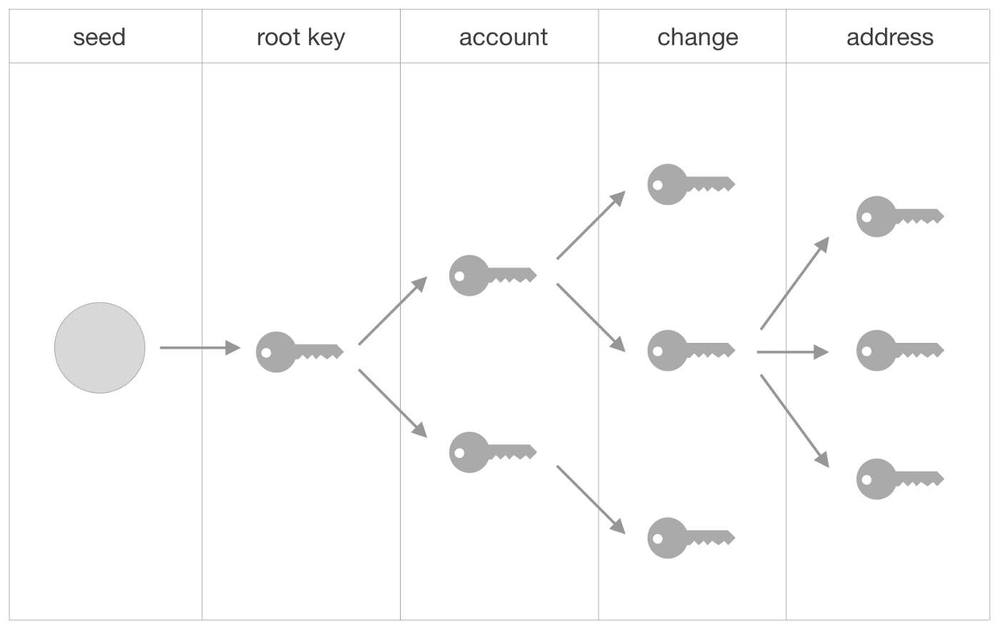
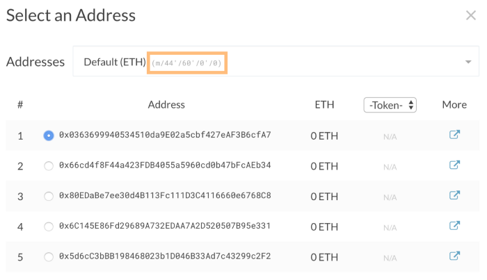

# 以太坊钱包
## 助记词
大多数现代加密货币钱包从[比特币改进提案 (BIP) 39](https://github.com/bitcoin/bips/blob/master/bip-0039.mediawiki) 进化而来。在高维度上，BIP 39 定义了一个公式，用于

1. 助记句的生成(也称为助记词、种子短语、恢复短语等)
2. 从该助记句中生成种子。该种子用于生成您的私钥和公钥

此信息将步骤基本事实位和字节助记符句子生成的，并从这些词语生成 512 位的种子。Python 代码片段将用于演示沿途的概念。免责声明：此代码纯粹出于教育目的而编写；负责任地使用等。

注意：如果您更喜欢直接跳到代码或者想在阅读时运行它，可以在[此处](https://github.com/marcgarreau/ethereum-notebooks/blob/master/bip39_bip32.ipynb)的 Jupyter 笔记本中找到该实现。

## 为什么是 BIP 39？助记词优势
因为这个助记句
	
	indoor dish desk flag debris potato excuse depart ticket judge file exit
比下面的十六进制种子更容易识别和传递

	3bd0bda567d4ea90f01e92d1921aacc5046128fd0e9bee96d070e1d606cb79225ee3e488bf6c898a857b5f980070d4d4ce937af587d4e937af587d6a37a8d48d606
该公式是确定性的，这意味着相同的助记词将始终产生相同的 512 位种子。如果您的设备被盗或钱包供应商倒闭，您只需使用随机的 12-24 个字就可以完全恢复多个钱包。钱包的社交恢复也变得更容易，例如，通过与四个可信赖的朋友中的每一个分享三个词。

在高维度上，我们希望从一个随机数开始将其切成我们想要在助记句中使用的单词数，然后将每个数据块转换为一个英语单词。

我们需要的第一件事是随机数也称为 `entropy`。BIP 39 规范指出这种熵只能有几种大小：

- 32 位的倍数
- 介于 128 和 256 之间。

熵越大，生成的助记词就越多，钱包的安全性就越高。为简单起见，我们将选择一个 128 位的熵，我们可以期望从中导出 12 个助记词。作为参考，超过 128 的每 32 位向句子添加三个助记词——上限为 24 个词，使用 256 位随机数。

在 Python 中，[os.urandom](https://docs.python.org/3/library/os.html#os.urandom) 可用于生成多个随机字节，并且该 `bitarray` 包提供了一种将这些字节转换为位的便捷方法。稍后我们将需要这两种表示。

注意：如果您在家中进行操作，您将看到与这些示例中显示的结果不同的结果。毕竟是随机的。
注意: 该代码不具有安全性，不能使用在生产环境

	# valid_entropy_bit_sizes = [128, 160, 192, 224, 256] 
	entropy_bit_size = 128 
	entropy_bytes = os.urandom(entropy_bit_size // 8)
	print(entropy_bytes) 
	# b'Q\x83\xe1\xf4\xf1j\xac5\x16\x04<\x0bm`\xcf\x0c'
	from bitarray import bitarray 
	entropy_bits = bitarray() 
	entropy_bits.frombytes(entropy_bytes) 
	print(entropy_bits) 
	# bitarray('0101000110000011...01100111100001100')
随机数实现！`entropy_bits` 并且 `entropy_bytes` 是相同数字的两种表示。

我们期待最后有 12 个助记词，因此我们要将数据分成 12 组。但是 128 位不能被 12 整除。BIP 39 公式通过在熵的末尾添加校验和来说明这一点。

校验和的大小取决于熵的大小。要找到校验和长度，请将熵大小（例如 128）除以 32

	checksum_length = entropy_bit_size // 32
	print(checksum_length)
	# 4
因此，我们知道校验和的长度为四位。哪四位？熵的 SHA-256 散列的前四个：

	from hashlib import sha256
	hash_bytes = sha256(entropy_bytes).digest()
	print(hash_bytes)
	# b'\xef\x88\xad\x02\x16\x7f\xa6y\xde\xa6T...'
	hash_bits = bitarray()
	hash_bits.frombytes(hash_bytes)
	print(hash_bits)
	# bitarray('111011111000100010...')
	checksum = hash_bits[:checksum_length]
	print(checksum)
	# bitarray('1110')
在这种情况下的前 4 位是1110. 该校验和被附加到的末尾 `entropy_bits`，使总位数达到 132 — 一个数字，可均匀地分为 12 组，每组 11 位。

	print(len(entropy_bits))
	# 128
	entropy_bits.extend(checksum)
	print(len(entropy_bits))
	# 132
11 位是 BIP 39 规范中选择的“魔法数”。无论熵大小如何，熵+校验和都需要平均分成 11 位的组。下面的 Python one-liner 就是这样做的

	grouped_bits = tuple(entropy_bits[i * 11: (i + 1) * 11] for i in range(len(entropy_bits) // 11))
	print(grouped_bits)
	# (bitarray('01010001100'), bitarray('00011111000'), ...)
	print(len(grouped_bits))
	# 12
下一步是将每个 11 位组转换为整数。该 `bitarray` 包提供了一个方便的辅助函数 `ba2int`，用于将位数组转换为整数。结果整数的范围应从零到 2047（即 `ba2int(bitarray(‘11111111111’)) == 2047`）

	from bitarray.util import ba2int
	indices = tuple(ba2int(ba) for ba in grouped_bits)
	print(indices)
	# (652, 248, 1001, 1814, 1366, 212, 704, 1084, 91, 856, 414, 206)
此时，我们有十二个整数，每个整数代表单词列表中的一个单词。[单词列表](https://github.com/bitcoin/bips/blob/master/bip-0039/bip-0039-wordlists.md)有多种语言，但每种语言都有 2048 个单词。

注意：如果您正在实施自己的钱包，您可以自由地制作自己的单词列表，但是使用您的单词列表生成的钱包将无法与其他符合 BIP 39 的钱包提供商进行互操作/恢复。

对于这个例子，我们假设[英语单词列表](https://github.com/bitcoin/bips/blob/master/bip-0039/english.txt)已经加载到内存中。只需将相应索引处的英文单词换出即可显示您的助记符

	english_word_list = ['abandon', 'ability', ..., 'zone', 'zoo']
	mnemonic_words = tuple(english_word_list[i] for i in indices)
	print(mnemonic_words)
	# ('face', 'business', 'large', 'tissue', 'print', 'box', 'fix', 'maple', 'arena', 'help', 'critic', 'border')
助记词生成！💥

请注意，这些词只有在产生可以派生私钥和公钥的种子时才有用。所以，让我们找到那个种子并把它包起来

## 派生密钥
512位的种子是由 `Password-Based Key Derivation` 派生的，并且具体地，[PBKDF2](https://en.wikipedia.org/wiki/PBKDF2)。该函数的输入是[伪随机函数](https://en.wikipedia.org/wiki/Pseudorandom_function_family)(HMAC-SHA512)、密码（我们的助记词）、salt 以及哈希函数将运行的迭代次数 (2048)。

我们还没有涉及的唯一参数是 [salt](https://en.wikipedia.org/wiki/Salt_(cryptography))。这是为您的钱包增加额外安全级别的机会。为了生成盐，字符串 `mnemonic` 与您选择的可选密码连接在一起。如果您不提供密码，则密码将默认为空字符串。

	passphrase = "you-make-this-up"
	salt = "mnemonic" + passphrase

这就是我们获得种子所需的一切。在 Python-land 中，`hashlib` 的 [pbkdf2_hmac](https://docs.python.org/3/library/hashlib.html#hashlib.pbkdf2_hmac) 函数就是我们要寻找的函数。注意助记句需要是字符串格式，单词之间用空格隔开。然后，助记符和盐都需要[转换](https://docs.python.org/3/library/stdtypes.html?highlight=encode#str.encode)为字节。

	mnemonic_string = ' '.join(mnemonic_words)
	print(mnemonic_string)
	# 'across abstract shine ... uphold already club'
	seed = hashlib.pbkdf2_hmac(
	   "sha512", 
	   mnemonic_string.encode("utf-8"), 
	   salt.encode("utf-8"), 
	   2048
	)
	print(seed)
	# b'\xcd@\xd0}\xbc\x17\xd6H\x00\x1c\xdc...'
	print(len(seed))
	# 64
	print(seed.hex())
	# cd40d07dbc17d648001cdc84473be584...
种子作为一组 64 字节（512 位）返回，但十六进制格式是您通常看到的表示方式。如果您在家中进行编码，检查您的工作的一种快速方法是将您生成的助记词插入[BIP 39助记词转换器](https://iancoleman.io/bip39/#english)，然后查看生成的种子是否与您的匹配。

## BIP 钱包标准
三个 BIP：

- [BIP 39](https://github.com/bitcoin/bips/blob/master/bip-0039.mediawiki)
	
	 “用于生成确定性密钥的助记符代码”
- [BIP 32](https://github.com/bitcoin/bips/blob/master/bip-0032.mediawiki)

	“分层确定性钱包”
- [BIP 44](https://github.com/bitcoin/bips/blob/master/bip-0044.mediawiki)

	“确定性钱包的多账户层次结构”

## BIP32
BIP 32 是用于创建分层确定性(HD) 钱包的规范。这指的是 

- 1) 所有帐户都源自一个根密钥 ( hierarchical ) 
- 2) 给定该根密钥，所有子帐户都可以可靠地重新计算（确定性）

HD 钱包的分层性质在视觉上很容易理解。当每个“父”键可以产生多个“子”键时，就会产生一个树结构：

您会在图中注意到帐户树有四个深度。每个深度都有一些隐含的含义。事实证明，这些含义也值得标准化，这导致了 [BIP 44](https://github.com/bitcoin/bips/blob/master/bip-0044.mediawiki) 的创建。该标准在密钥的派生方式中起着重要作用，因此我们现在将快速介绍它。

我们将从一个种子开始，派生根密钥，然后是一些子密钥，直到我们到达所需的地址。

## BIP44
BIP 44 编码了每个深度级别的目的：

	m/purpose’/coin_type’/account’/change/address_index
该规范很灵活，但专为比特币创建。每个级别都不能完美地映射到以太坊,例如 `change` ，深度仅适用于比特币的 [UTXO](https://en.wikipedia.org/wiki/Unspent_transaction_output) 模型,但“足够好”的标准通常总比没有好。与 BIP 32 一样，BIP 44 已被广泛的区块链采用，包括以太坊。

在使用以太坊硬件或软件钱包时，您可能已经看到过 BIP 44 路径。例如，在 [MyCrypto](https://mycrypto.com/account) 应用程序中解锁钱包时，您将看到以下内容：

注意上面图片的地址在橙色处

默认情况下，以太坊的大多数用户都使用派生地址路径为 `m/44'/60'/0'/0/0`。

简要说明：

- 撇号（例如，在前三个级别中）表示该值已硬化。这是一项安全功能，我们很快就会了解其含义。
- `m`

	是约定俗成的；这里没有什么可解读的。
- `44`

	`purpose` 这条路径遵循 `BIP 44` 标准,如果有其他标准就需要修改，当前仅44通用
- `60`

	`coin_type` 加密币类型，60 表示以太坊网络。可在[此处](https://github.com/satoshilabs/slips/blob/master/slip-0044.md)找到“注册硬币类型”列表。
- `0`

	`account` 意在代表不同类型的钱包用户。例如，一家企业可能有一个会计部门的帐户分支和一个销售团队的帐户分支。这是一个从零开始的索引。
- `0`

	`change` 主要是比特币的[特殊使用](https://github.com/bitcoin/bips/blob/master/bip-0044.mediawiki#change)。通常保留`0` 用于以太坊地址。
- `0`

	`address_index` 最后一个路径，您正在使用的帐户的索引。这也是一个从零开始的索引，所以索引 `0` 是第一个可用的帐户。如果你有十个账户，最后一个的派生路径是 `m/44'/60'/0'/0/9`。

BIP 32 要求我们从种子开始，通常是由 BIP 39 实现产生的种子。从那颗种子中，你会发现你可能需要的尽可能多的账户。对于此示例，我们将从标准测试向量中提供的种子之一开始：

`seed = 'fffcf9f6f3f0edeae7e4e1dedbd8d5d2cfccc9c6c3c0bdbab7b4b1aeaba8a5a29f9c999693908d8a8784817e7b7875726f6c696663605d5a5754514e4b484542'`

第一个目标是将种子转换为所谓的主密钥或根密钥。“根”是说明性的，因为所有派生键都将从它分支出来。

我们可以使用这个[工具](https://iancoleman.io/bip39/)进行预览,看看所产生的根密钥和派生地址。确保将上面的种子（不带引号）粘贴到 BIP 39 种子字段中，然后从硬币选项中选择“ETH — Ethereum” 。

产生这些值的背后有很多事情要做，所以让我们一步一步来。

注意：即将推出的公式通常依赖于哈希函数和椭圆曲线加密。这些概念的复杂性超出了本文的范围。相反，您会找到一个端到端的实现，其中包含对全局的解释。

## 根密钥生成
根密钥是通过[几个步骤](https://github.com/bitcoin/bips/blob/master/bip-0032.mediawiki#master-key-generation)生成的：

- `I=HMAC-SHA512`（密钥=“比特币种子”,数据=种子）
- 将 `I` 拆分为两个 32 字节的序列，`L` 和 `R`
- 使用 `parse256(L)` 作为主密钥，使用 R 作为主链码

在 Python 中

	import binascii
	import hmac
	import hashlib
	# the HMAC-SHA512 `key` and `data` must be bytes:
	seed_bytes = binascii.unhexlify(seed)
	I = hmac.new(b'Bitcoin seed', seed_bytes, hashlib.sha512).digest()
	L, R = I[:32], I[32:]
	master_private_key = int.from_bytes(L, 'big')
	master_chain_code = R
很好的第一步！主私钥和链码将用于派生所有后续子密钥。所述链码用作[熵](https://en.wikipedia.org/wiki/Entropy_(computing))。

根密钥通常表示为扩展私钥( xprv)。在 BIP 32 规范中定义，扩展私钥是私钥、链码和一些附加元数据的 Base58 编码。我们接下来会推导出来。

有趣的事实：[Base58 编码](https://en.wikipedia.org/wiki/Base58)是专门为比特币创建的。这就像 Base64 的，但没有一些常用曲解字符，例如：0，O，I，和l。因此，二进制值可以转换为以下字母和数字

	123456789ABCDEFGHJKLMNPQRSTUVWXYZabcdefghijkmnopqrstuvwxyz
如上一个帐户生成器屏幕截图所示，我们将得到以下扩展私钥

	xprv9s21ZrQH143K31xYSDQpPDxsXRTUcvj2iNHm5NUtrGiGG5e2DtALGdso3pGz6ssrdK4PFmM8NSpSBHNqPqm55Qn3LqFtT2emdEXVYsCzC2U
	
您会注意到

-  1) 没有零、大写 o、大写 i 或小写 l
-  2) 前四个字符是 xprv. xprv 是一个精心设计的四个字节序列，让我们知道我们正在查看旨在用于主网上的扩展私钥

根据[规范](https://github.com/bitcoin/bips/blob/master/bip-0032.mediawiki#serialization-format)，78 个字节被编码以派生扩展密钥

- 4 个字节

	版本字节
	
	- 主网：
		- `0x0488B21E`公共
		- `0x0488ADE4`私有
	- 测试网：
		- `0x043587CF`公共
		- `0x04358394`私有
- 1 个字节

	深度（`0x00`用于主节点，`0x01`用于 1 级派生密钥等）
- 4 个字节

	父密钥的指纹
- 4 个字节

	子编号
- 32 字节

	链码
- 33 字节

	公钥或私钥数据

在 Python 中，这可能如下所示

	import base58
	VERSION_BYTES = {
	    'mainnet_public': binascii.unhexlify('0488b21e'),
	    'mainnet_private': binascii.unhexlify('0488ade4'),
	    'testnet_public': binascii.unhexlify('043587cf'),
	    'testnet_private': binascii.unhexlify('04358394'),
	}
	version_bytes = VERSION_BYTES['mainnet_private']
	depth_byte = b'\x00'
	parent_fingerprint = b'\x00' * 4
	child_number_bytes = b'\x00' * 4
	key_bytes = b'\x00' + L
	all_parts = (
	    version_bytes,      # 4 bytes  
	    depth_byte,         # 1 byte
	    parent_fingerprint,  # 4 bytes
	    child_number_bytes, # 4 bytes
	    master_chain_code,  # 32 bytes
	    key_bytes,          # 33 bytes
	)
	all_bytes = b''.join(all_parts)
	root_key = base58.b58encode_check(all_bytes).decode('utf8')
	print(root_key)
	# xprv9s21ZrQH143K...T2emdEXVYsCzC2U

在根密钥的情况下，大部分附加元数据都被清零

- 我们知道根键是树中的第一个节点（即深度为零），所以 `depth_byte` 很直观——一个空字节。
- 当我们需要为子帐户计算指纹和子编号时，我们将很快探索指纹和子编号，但首先，它们每个都表示为四个空字节。
- 规范要求 33 个字节用于关键数据。主私钥，L，只有 32，所以前面填充了一个空字节

太好了，我们有一个根密钥。我们实际可以使用的帐户怎么样——带有私钥和公共地址？

在更高纬度上，我们需要为我们想要的路径中的每个深度派生子键。因此，如果我们想为 `path` 处的地址生成密钥 `m/44'/60'/0'/0/0`，我们最终将运行子密钥派生函数五次——路径中的每个数值一次。

在 Python 中，我们将路径表示为一个元组，因此我们需要迭代一些东西。直接从 [规范](https://github.com/bitcoin/bips/blob/master/bip-0032.mediawiki#extended-keys) 中提取

每个扩展键有 2³¹ 个普通子键和 2³¹ 个强化子键。这些子键中的每一个都有一个索引。

- 普通的子键使用索引 0 到 2³¹–1
- 强化的子键使用索引 2³¹ 到 2³²–1

因此，如果该值是 hardened，那么我们只需将 2³¹ 添加到该数字上。例如：

	# Break each depth into integers (m/44'/60'/0'/0/0)
	#    e.g. (44, 60, 0, 0, 0)
	# If hardened, add 2**31 to the number:
	#    e.g. (44 + 2**31, 60 + 2**31, 0 + 2**31, 0, 0)
	path_numbers = (2147483692, 2147483708, 2147483648, 0, 0)
	
硬化的路径意味着什么？这是一项安全功能；

- 私钥用于生成强化密钥
- 非强化（或普通）密钥使用公钥生成。

这对键的功能有影响。

例如，普通扩展公钥 ( xpub) 可用于创建子公钥。一个普遍引用的用例是为店面提供一个扩展的公钥，该公钥可用于派生一个新的子公共地址以接收每次销售的资金。服务器上永远没有私钥，因此如果服务器受到威胁，它们就不会有泄露的风险。

如果您想深入了解,[点击这里](https://bitcoin.stackexchange.com/a/37489)。
	
为了导出扩展的子私钥，我们需要用于导出根密钥的相同变量：

- 私钥
- 链码
- 指纹
- 深度
- 子编号

目前，我们只导出了根密钥及其组成部分，剩下：

	depth = 0
	parent_fingerprint = None
	child_number = None
	private_key = master_private_key
	chain_code = master_chain_code
我们已经讨论了深度、私钥和链码。`child_number` 是简单地从当前路径整数 `path_numbers` 元组。第一次通过子键推导函数，`child_number` 将等于 2147483692。在第五次也是最后一次迭代中，`child_number` 将是 0。

指纹涉及更多。根据 [BIP 32 标准](https://github.com/bitcoin/bips/blob/master/bip-0032.mediawiki#key-identifiers)

扩展密钥可以通过序列化的 ECDSA 公钥 K 的 Hash160（SHA256 之后的 RIPEMD160）来识别，忽略链码。[…] 标识符的前 32 位称为密钥指纹。[...] 请注意，父节点的指纹仅用作在软件中检测父节点和子节点的快速方法......

总之，指纹是从子密钥到其父密钥的链接，BIP 32 标准指定了派生这四个字节的公式。

该公式是散列函数和椭圆曲线密码术的混合体，所以我们只是想把这个魔法收起来：

	from ecdsa import SECP256k1
	from ecdsa.ecdsa import Public_key
	SECP256k1_GEN = SECP256k1.generator
	def serialize_curve_point(p):
	   x, y = K.x(), K.y()
	   if y & 1:
	      return b'\x03' + x.to_bytes(32, 'big')
	   else:
	      return b'\x02' + x.to_bytes(32, 'big')
	def curve_point_from_int(k):
	   return Public_key(SECP256k1_GEN, SECP256k1_GEN * k).point
	def fingerprint_from_private_key(k):
	   K = curve_point_from_int(k)
	   K_compressed = serialize_curve_point(K)
	   identifier = hashlib.new(
	      'ripemd160',
	      hashlib.sha256(K_compressed).digest(),
	   ).digest()
	   return identifier[:4]
最后，让我们解决我们期望运行五次的子密钥派生函数。该函数将私钥、链码和子链码作为输入，并返回子私钥和子链码。

该函数所做的第一件事是检查它是否会派生出强化密钥或普通密钥。请记住，在前面的讨论中，私钥用于派生强化密钥，而公钥（例如，`curve_point_from_int(private_key)`）派生普通密钥。

该函数的其余部分应该类似于主私钥和主链代码的推导：

	# Review of master private key and chain code derivation:
	I = hmac.new(b'Bitcoin seed', seed_bytes, hashlib.sha512).digest()
	L, R = I[:32], I[32:]
	master_private_key = int.from_bytes(L, 'big')
	master_chain_code = R
这一次，使用父链码代替，b'Bitcoin seed'数据是附加到（硬化或正常）关键数据的子编号：

	SECP256k1_ORD = SECP256k1.order
	def derive_ext_private_key(private_key, chain_code, child_number):
	    if child_number >= 2 ** 31:
	        # Generate a hardened key
	        data = b'\x00' + private_key.to_bytes(32, 'big')
	    else:
	        # Generate a non-hardened key
	        p = curve_point_from_int(private_key)
	        data = serialize_curve_point(p)
	    data += child_number.to_bytes(4, 'big')
	    hmac_bytes = hmac.new(chain_code, data, hashlib.sha512).digest()
	    L, R = hmac_bytes[:32], hmac_bytes[32:]
	    L_as_int = int.from_bytes(L, 'big')
	    child_private_key = (L_as_int + private_key) % SECP256k1_ORD
	    child_chain_code = R
	    return (child_private_key, child_chain_code)
现在我们已经准备好了所有的部分，是时候迭代路径号并递归更新每个值了：

	path_numbers = (2147483692, 2147483708, 2147483648, 0, 0)
	depth = 0
	parent_fingerprint = None
	child_number = None
	private_key = master_private_key
	chain_code = master_chain_code
	for i in path_numbers:
	   depth += 1
	   child_number = i
	   parent_fingerprint = fingerprint_from_private_key(private_key)
	   private_key, chain_code = derive_ext_child_key(private_key)
完成后，您将获得路径中帐户的私钥 `m/44'/60'/0'/0/0`困难的部分已经完成。您可以通过显示私钥的十六进制值将您的结果与 `Ian Coleman` 生成器中的结果进行比较

	print(f'private key: {hex(private_key)}')
	# private key: 0x3c4cf049f83a5870ab31c396a0d46783c3e3974da1364ea5a2477548d36b5f8f
公钥可以从私钥派生出更多的椭圆曲线密码

	p = curve_point_from_int(private_key)
	public_key_bytes = serialize_curve_point(p)
	print(f'public key: 0x{public_key_bytes.hex()}')
	# public key: 0x024c8f4044470bd42b81a8b233e2f954b63f4ee2c32c8d44288b44188754e2042e
如果我们想收到任何资金，我们也需要一个公共地址。地址是从公钥派生出来的。具体来说，公共地址是公钥点的 Keccak-256 哈希的最后 20 个字节。在 Python 中：

	from eth_utils import keccak
	digest = keccak(x.to_bytes(32, 'big') + y.to_bytes(32, 'big'))
	address = '0x' + digest[-20:].hex()
	print(f'public address: {address}')
	# public address: 0xbbec2620cb01adae3f96e1fa39f997f06bfb7ca0

## HD 钱包
让我们通过在此路径上为帐户派生扩展私钥( `xprv` ) 。导出此值是了解您是否正确完成整个过程的最佳方式。所述 BIP 32 标准包括一些[测试矢量](https://github.com/bitcoin/bips/blob/master/bip-0032.mediawiki#test-vectors)为HD钱包开发人员来验证，给定种子和期望的路径，它们的软件可以得到正确的 `xprv` 和 `xpub` 值。

我们将使用与导出根密钥相同的公式，但这次元数据包含的不仅仅是空字节：

	version_bytes = VERSION_BYTES['mainnet_private'] 
	depth_byte = depth.to_bytes(1, 'big') 
	child_number_bytes = child_number.to_bytes(4, 'big') 
	key_bytes = b'\x00' + private_key.to_bytes(32, 'big')
	all_parts = ( 
	    version_bytes, # 4 bytes   
	    depth_byte, # 1 byte 
	    parent_fingerprint, # 4 bytes 
	    child_number_bytes, # 4 bytes 
	    chain_code, # 32 bytes 
	    key_bytes, # 33 bytes 
	) 
	all_bytes = b''.join(all_parts) 
	extended_private_key = base58.b58encode all_bytes).decode('utf8')
你应该得到以下结果xprv

	print(f'extended private key: {extended_private_key}') 
	# 扩展私钥：xprvA2vDkmMuK1Ae2eF92xyQpn6qZzHoGTnV5hXrBw7UExUTXeMFTZDLF7cRD6vhR785RMF2EC6mAo3ojRxSVGogsvCEUGXUS	

还有很多东西要探索,我们没有派生出任何扩展的公钥 ( xpub) 或深入研究强化密钥

同样，如果您对带有此代码的 Jupyter Notebook 感兴趣，可以在[此处](https://github.com/marcgarreau/ethereum-notebooks/blob/master/bip32.ipynb)找到。如果你想探索一个全面的 Python 实现，[py-hdwallet](https://github.com/ethereum/py-hdwallet/)是一个由以太坊基金会维护的新项目。这篇文章中的代码是 py-hdwallet 中的简化版本。

## BIP32 两种派生类型，非硬化(普通)密钥-non-hardened keys 和硬化子密钥Hardened keys 的区别
本质上，硬化的子键是用 `hash(parent private key + index)` 计算的，而非硬化的子键是用 `hash(parent public key + index)` 计算的。

那么这有什么实际后果呢？

- 使用扩展公钥派生非强化的子公钥

	这在您想接受付款但不能立即消费的情况下很有用。例如，如果您有一个销售羊驼毛袜子的网站，您的服务器可以使用扩展的公钥来接受付款，如果被黑客入侵，您也不会损失所有资金。所以这就是您可能使用非强化派生的原因。
- 使用扩展私钥派生出强化密钥

	当攻击者拥有 
	
	- 1) 扩展公钥
	- 2) 从中派生出的非强化私钥之一时，非强化公钥较弱。

	在这种情况下，攻击者可以计算出扩展公钥的私钥，从而获得可以从中派生出的每个密钥，无论是强化的还是非强化的。

那么你的应用默认应该使用什么？

您应该使用非强化密钥，并禁用导出私钥的功能，因为这会允许攻击者破坏钱包中的其他密钥。即使攻击者获得了其中一个私钥，在攻击者无法访问扩展公钥的情况下，非强化等同于强化安全性。在我看来，非强化密钥的功能胜过强化密钥增加的安全性。

但是，如果您不需要非强化密钥的功能，那么您应该使用强化密钥，因为它们更安全。

## 强化子密钥优点
- 当您不需要向某人提供主公钥并让他们知道所有地址的能力时，强化密钥很有用。对于这些情况，它们比未强化的具有更好的安全特性。

## 非强化(普通)子密钥优点
- 使用强化地址，我需要此服务的私钥，因此如果我被黑客入侵，我将损失所有资金。使用非强化地址，我的服务没有敏感信息，因此它可以被黑客入侵而不会造成损害。我只需要将私钥安全地存储在任何地方。
	
## 参考
- [BIP 39助记词转换器](https://iancoleman.io/bip39/#english)
- [Ethereum 201: Mnemonics](https://wolovim.medium.com/ethereum-201-mnemonics-bb01a9108c38)
- [Ethereum 201: HD Wallets](https://wolovim.medium.com/ethereum-201-hd-wallets-11d0c93c87f7)
- [BIP32 中的子密钥和硬化子密钥有什么区别](https://bitcoin.stackexchange.com/questions/37488/eli5-whats-the-difference-between-a-child-key-and-a-hardened-child-key-in-bip3/37489#37489)