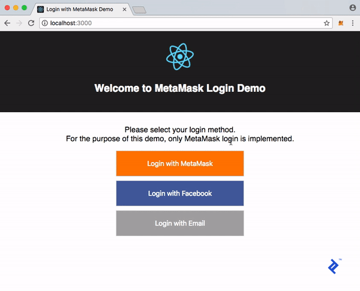
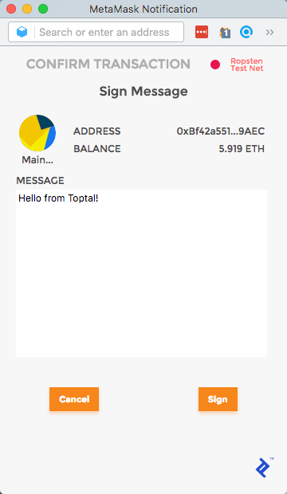
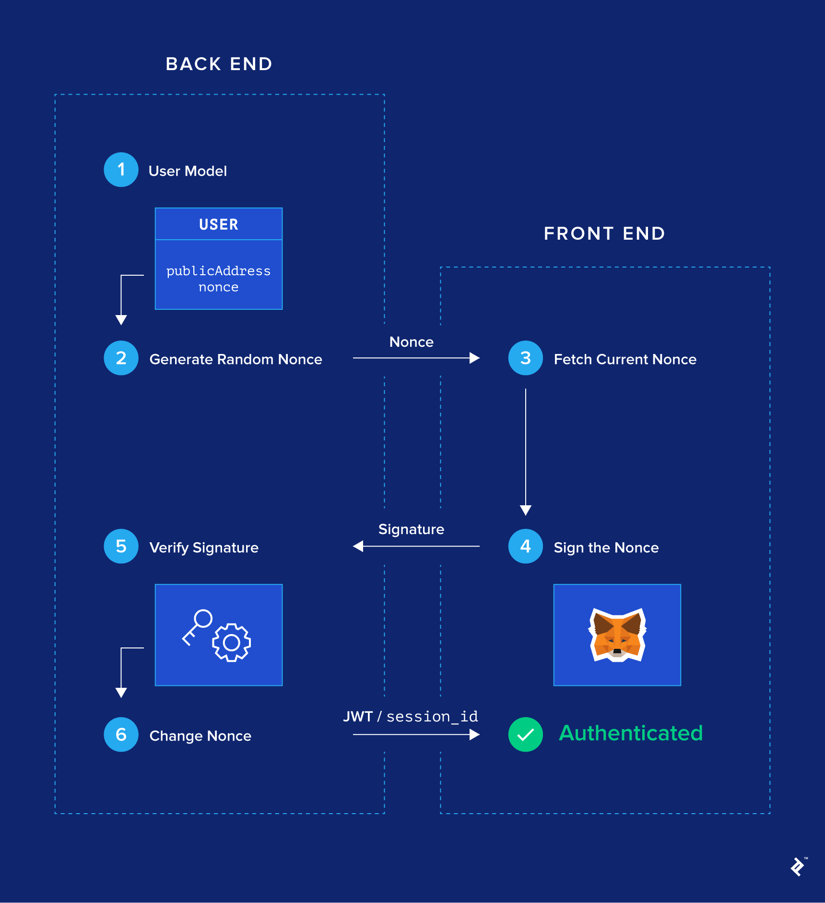

# 使用区块链一键登录：MetaMask 教程
在线用户对传统的电子邮件/密码注册流程的抵抗力越来越强。通过 Facebook、Google 或 GitHub 实现的一键式社交登录功能被证明是更理想的选择。但是，它需要权衡取舍。

- 社交媒体登录集成的优点：
	- 不再繁琐的填表工作
	- 无需记住另一个用户名/密码对
	- 整个过程需要几秒钟而不是几分钟
- 社交媒体登录集成的缺点：
	- 由于用户的信息是从外部提供商加载的，这引发了对提供商如何使用所有这些个人数据的巨大隐私问题。例如，在撰写本文时，Facebook 正面临[数据隐私问题](https://www.reuters.com/article/us-facebook-privacy-costs-analysis/privacy-issues-emerge-as-major-business-risk-for-facebook-idUSKBN1GW01F)。

本文介绍了一种[区块链开发](https://www.toptal.com/services/blockchain-development)的新登录方法：使用[MetaMask 扩展](https://metamask.io/)的一键式密码安全登录流程，所有数据都存储在我们自己的后端。我们称之为：“使用 MetaMask 登录”。

一张图值一千字，下面是我们要构建的登录流程的演示：

## 如何使用 Metamask 进行一键式登录流程
基本思想是，通过使用私钥签署一段数据来证明账户的所有权是很容易的。如果您设法签署了我们后端生成的精确数据，那么后端将认为您是该公共地址的所有者。因此，我们可以构建一个基于消息签名的认证机制，以用户的公共地址为标识。

请注意，虽然我们将使用连接到以太坊区块链的工具（ [MetaMask](https://www.toptal.com/ethereum)、以太坊公共地址），但此登录过程实际上并不需要区块链：它只需要其加密功能。话虽如此，随着 MetaMask 成为[如此流行的扩展](https://twitter.com/metamask_io/status/942816957920829440)，现在似乎是引入此登录流程的好时机。

如果看起来不清楚，那也没关系，因为我们会一点一点地解释它：
### MetaMask 浏览器扩展
如果您已经知道 MetaMask 是什么，请随意跳过本节。

MetaMask是一个浏览器插件，可作为 [MetaMask Chrome 扩展](https://chrome.google.com/webstore/detail/metamask/nkbihfbeogaeaoehlefnkodbefgpgknn)或 [Firefox Add-on](https://addons.mozilla.org/en-US/firefox/addon/ether-metamask/) 使用。它的核心是一个以太坊钱包：通过安装它，你将可以访问一个独特的以太坊公共地址，通过它你可以开始发送和接收以太币或代币。

但 MetaMask 做的不仅仅是以太坊钱包。作为浏览器扩展，它可以与您正在浏览的当前网页进行交互。它通过在您访问的每个网页中注入一个名为 [web3.js 的 JavaScript 库来实现](https://github.com/ethereum/web3.js/)。

注入后，`web3` 将通过 `window.web3` 本网站的 JavaScript 代码获得一个对象。要查看此对象的外观，只需 `window.web3` 在 Chrome 或 Firefox DevTools 控制台中输入（如果您安装了 MetaMask）。

Web3.js 是以太坊区块链的 JavaScript 接口。有以下功能：

- 获取链上的最新区块 ( `web3.eth.getBlockNumber`)
- 检查 MetaMask 上的当前活动帐户 ( `web3.eth.coinbase`)
- 获取任意账户余额 ( `web3.eth.getBalance`)
- 发送交易 ( `web3.eth.sendTransaction`)
- 使用当前账户的私钥签署消息（`web3.personal.sign`）
……还有[更多](https://github.com/ethereum/wiki/wiki/JavaScript-API)

安装 MetaMask 后，任何前端代码都可以访问所有这些功能，并与[区块链交互](https://www.toptal.com/ethereum-smart-contract)。它们被称为 dapps 或DApps（用于去中心化应用程序——有时甚至称为“ĐApps”）。

#### 与 DApp 开发相关： 时间锁定钱包：以太坊智能合约简介
web3.js 中的大部分函数都是读函数（`get block`、`get balance` 等），web3 会立即给出响应。但是，某些功能（例如 `web3.eth.sendTransaction` 和`web3.personal.sign` ）需要当前帐户使用其私钥对某些数据进行签名。这些功能触发 MetaMask 显示确认屏幕，以仔细检查用户是否知道她或他正在签名的内容。

让我们看看如何使用 MetaMask。要进行简单测试，请将以下行粘贴到 DevTools 控制台中：

	web3.personal.sign(web3.fromUtf8("Hello from Toptal!"), web3.eth.coinbase, console.log);
这个命令的意思是：用 coinbase 账户（即当前账户）签署我的消息，从 utf8 转换为 hex，并作为回调，打印签名。将出现一个 MetaMask 弹出窗口，如果您对其进行签名，将打印已签名的消息。

我们将 `web3.personal.sign` 在我们的登录流程中使用。

关于本节的最后一点说明：MetaMask 将 web3.js 注入到您当前的浏览器中，但实际上还有其他独立的浏览器也注入了 web3.js，例如 Mist。然而，在我看来，MetaMask 为普通用户探索 dapps 提供了当今最好的用户体验和最简单的过渡。

### 登录流程的工作原理
让我们从如何开始。How将有望说服您它是安全的

如概述中所述，我们将忘记区块链。我们有一个传统的 Web 2.0 服务模型(客户端-服务器 RESTful)架构。我们将做一个假设：所有访问我们前端网页的用户都安装了 MetaMask。有了这个假设，我们将展示无密码密码安全登录流程是如何工作的。

- 第 1 步：修改用户模型（后端）

	首先，我们的 User 模型需要有两个新的必填字段：`publicAddress` 和 `nonce` 。
	
	- `publicAddress` 需要是唯一的。您可以保留常用的 `username、email、password` 字段——特别是如果你想将 MetaMask 登录与电子邮件/密码登录并行实现——但它们是可选的。
	- `publicAddress` 如果用户希望使用 MetaMask 登录，注册过程也会略有不同，注册时的必填字段也是如此。请放心，用户永远不需要 `publicAddress` 手动输入，因为它可以通过 `web3.eth.coinbase`.
- 第 2 步：生成随机数（后端）

	对于数据库中的每个用户，在 `nonce` 字段中生成一个随机字符串。例如，`nonce` 可以是一个大的随机整数。
- 第 3 步：用户获取他们的 `Nonce`（前端）

	在我们的前端 JavaScript 代码中，假设 MetaMask 存在，我们可以访问 `window.web3.`  因此，我们可以调用 `web3.eth.coinbase` 获取当前 MetaMask 帐户的公共地址。

	当用户点击 UI 登录按钮时，我们会向后端发起 API 调用以检索与其公共地址关联的 `nonce`。类似以下语句 
	
		GET /api/users?publicAddress=${publicAddress}
		
	当然，由于这是一个未经身份验证的 API 调用，因此后端应该配置为仅显示 `nonce` 此路由上的公共信息（包括 ）。

	如果之前的请求没有返回任何结果，说明当前的公共地址还没有注册。我们需要首先创建一个新帐户
	
		POST /users
		
	并传入 `publicAddress` 请求正文。另一方面，如果有结果，那么我们存储它的 `nonce`.
- 第 4 步：用户签署 Nonce（前端）

	一旦前端收到 `nonce` 上一个 API 调用的响应，它就会运行以下代码：

		web3.personal.sign(nonce, web3.eth.coinbase, callback);
	这将提示 MetaMask 显示对消息进行签名的确认弹出窗口。随机数将显示在此弹出窗口中，以便用户知道没有签署某些恶意数据。

	当接受它时，将使用签名消息（称为 `signature` ）作为参数调用回调函数。然后前端对 进行另一个 API 调用
	
		POST /api/authentication
	同时传递一个带有 `signature`和 `publicAddress`。
- 第 5 步：签名验证（后端）

	后端收到
	
		POST /api/authentication
	请求时
	
	- 首先从 `publicAddress` 请求体中给定的数据库中获取用户。特别是它获取相关的随机数。
	- 有了 `nonce`、`publicAddress`和`signature`，后端就可以[加密验证](https://en.wikipedia.org/wiki/Digital_signature) `nonce` 是否已被用户正确签名。
		- 如果是这种情况，那么用户已经证明了公共地址的所有权，我们可以认为用户是经过身份验证的。
		- 然后可以将 JWT 或会话标识符返回到前端。
- 第 6 步：更改 Nonce（后端）

	为了防止用户使用相同的签名再次登录（以防它被泄露），我们确保下次同一用户想要登录时，用户需要签署一个新的随机数。这是通过 `nonce` 为该用户生成另一个随机数并将其持久化到数据库来实现的。
	
瞧！这就是我们管理 nonce 签名无密码登录流程的方式。

### 为什么登录流程有效
根据定义，身份验证实际上只是帐户所有权的证明。如果您使用公共地址唯一标识您的帐户，那么证明您拥有它在加密上是微不足道的。

为防止黑客获得一条特定消息和您的签名（但不是您的实际私钥），我们强制该消息签名为：

- 由后端提供 nonce
- 定期更换 nonce

我们在解释中每次成功登录后都对其进行了更改，但也可以想象基于时间戳的机制。

### 让我们一起建造它
在本节中，将一一完成上述六个步骤。将展示一些代码片段，说明我们如何从头开始构建此登录流程，或将其集成到现有后端，而无需太多努力。

为了本文的目的，我创建了一个小型演示应用程序。我正在使用的堆栈如下：

- Node.js、Express 和 SQLite（通过 Sequelize ORM）在后端实现 RESTful API。它在成功验证时返回 JWT。
- 在前端反应单页应用程序。

我尝试使用尽可能少的库。我希望代码足够简单，以便您可以轻松地将其移植到其他技术堆栈。

整个项目可以在 这个 [GitHub 存储库](https://github.com/amaurymartiny/login-with-metamask-demo)中看到。[这里](https://amaurym.com/login-with-metamask-demo/)有一个演示。

- 第 1 步：修改用户模型（后端）

	需要两个字段：`publicAddress` 和 `nonce` 。我们初始化 `nonce` 为一个随机的大数。每次成功登录后都应更改此号码。我还在此处添加了一个可选 `username` 字段，用户可以更改该字段。

		const User = sequelize.define('User', {
		  nonce: {
		    allowNull: false,
		    type: Sequelize.INTEGER.UNSIGNED,
		    defaultValue: () => Math.floor(Math.random() * 1000000) // 初始化一个随机 nonce
		  },
		  publicAddress: {
		    allowNull: false,
		    type: Sequelize.STRING,
		    unique: true,
		    validate: { isLowercase: true }
		  },
		  username: {
		    type: Sequelize.STRING,
		    unique: true
		  }
		});
	为了简单起见，我将 `publicAddress` 字段设置为小写。更严格的实现会添加一个验证功能来检查这里的所有地址是否都是有效的以太坊地址。
- 第 2 步：生成随机数（后端）

	这是在 `defaultValue()` 上面模型定义的函数中完成的。
- 第 3 步：用户获取他们的 Nonce（前端）

	下一步是在后端添加一些样板代码来处理 `User` 模型上的 CRUD 方法，我们在这里不会做。

	切换到前端代码，当用户点击登录按钮时，我们的 `handleClick` 处理程序执行以下操作：

		class Login extends Component {
		  handleClick = () => {
		    // --剪断--
		    const publicAddress = web3.eth.coinbase.toLowerCase();
		
		    // 检查用户当前的publicAddress是否已经存在于后端
		    fetch(`${process.env.REACT_APP_BACKEND_URL}/users?publicAddress=${publicAddress}`)
		      .then(response => response.json())
		      // 如果有，请检索。如果没有，请创建。
		      .then(
		        users => (users.length ? users[0] : this.handleSignup(publicAddress))
		      )
		      // --剪断--
		  };
		
		  handleSignup = publicAddress =>
		    fetch(`${process.env.REACT_APP_BACKEND_URL}/users`, {
		      body: JSON.stringify({ publicAddress }),
		      headers: {
		        'Content-Type': 'application/json'
		      },
		      method: 'POST'
		    }).then(response => response.json());
		}
	在这里，我们使用检索 MetaMask 活动帐户 `web3.eth.coinbase`。然后我们检查 `publicAddress`后端是否已经存在。如果用户已经存在，我们要么检索它，要么不存在，我们在 `handleSignup` 方法中创建一个新帐户。
- 第 4 步：用户签署 Nonce（前端）

	让我们继续 `handleClick` 方法。我们现在拥有一个由后端提供的用户（无论是检索的还是新创建的）。特别是，我们有他们的 `nonce` 和`publicAddress`。因此，我们准备好使用与此关联的私钥对 `nonce` 进行签名 `web3.personal.sign` 。这是在 `handleSignMessage` 函数中完成的。

	请注意，`web3.personal.sign`它将字符串的十六进制表示形式作为其第一个参数。我们需要将 UTF-8 编码的字符串转换为十六进制格式 `web3.fromUtf8`。此外，我决定签署一个更加用户友好的句子，而不是只签署随机数，因为它将显示在 MetaMask 确认弹出窗口中：`I am signing my once-time nonce: ${nonce}`.

		class Login extends Component {
		  handleClick = () => {
		    // --剪断--
		    fetch(`${process.env.REACT_APP_BACKEND_URL}/users?publicAddress=${publicAddress}`)
		      .then(response => response.json())
		      
		     // 如果有，请检索。如果没有，请创建。
		      .then(
		        users => (users.length ? users[0] : this.handleSignup(publicAddress))
		      )
		      // 弹出 MetaMask 确认模式来签署消息
		      .then(this.handleSignMessage)
		      
		      // 将签名发送到路由 /auth 的后端
		      .then(this.handleAuthenticate)
		       // --剪断--
		  };
		
		  handleSignMessage = ({ publicAddress, nonce }) => {
		    return new Promise((resolve, reject) =>
		      web3.personal.sign(
		        web3.fromUtf8(`I am signing my one-time nonce: ${nonce}`),
		        publicAddress,
		        (err, signature) => {
		          if (err) return reject(err);
		          return resolve({ publicAddress, signature });
		        }
		      )
		    );
		  };
		
		  handleAuthenticate = ({ publicAddress, signature }) =>
		    fetch(`${process.env.REACT_APP_BACKEND_URL}/auth`, {
		      body: JSON.stringify({ publicAddress, signature }),
		      headers: {
		        'Content-Type': 'application/json'
		      },
		      method: 'POST'
		    }).then(response => response.json());
		}
	当用户成功签署消息后，我们进入该 `handleAuthenticate` 方法。 我们只需向后端 `/auth` 路由发送一个请求，发送我们 `publicAddress` 的以及 `signature` 用户刚刚签名的消息。
- 第 5 步：签名验证（后端）

	这是稍微复杂的部分。后端在包含 a 和 a 的 `/auth` 路由上收到请求，需要验证这是否签名正确。
	
	`publicAddress` `signature` `publicAddress` `nonce`

	- 第一步是从数据库中检索用户所说的 `publicAddress`；

		应只有一个，因为我们定义 `publicAddress` 为数据库中的唯一字段。然后我们将消息设置 `msg` 为 `“I am signing my once……”`，就像在第 4 步中的前端一样，使用该用户的随机数。
	- 下一个块是验证本身。涉及一些密码学。如果您喜欢冒险，我建议您阅读有关 [椭圆曲线签名](https://en.wikipedia.org/wiki/Elliptic_Curve_Digital_Signature_Algorithm)的更多信息。

	总结这个块，它的作用是，给定我们的 `msg`（包含`nonce`）和我们的 `signature`，`ecrecover` 函数输出用于签署的公共地址 `msg`。如果它与`publicAddress` 请求正文中的我们匹配，则发出请求的用户成功证明了他们对 `publicAddress`. 我们认为它们是经过身份验证的。

		User.findOne({ where: { publicAddress } })
		  //  --剪断--
		  .then(user => {
		    const msg = `I am signing my one-time nonce: ${user.nonce}`;
		
		    // 我们现在拥有 msg, publicAddress 和 signature。我们可以用 ecrecover 进行椭圆曲线签名验证
		    const msgBuffer = ethUtil.toBuffer(msg);
		    const msgHash = ethUtil.hashPersonalMessage(msgBuffer);
		    const signatureBuffer = ethUtil.toBuffer(signature);
		    const signatureParams = ethUtil.fromRpcSig(signatureBuffer);
		    const publicKey = ethUtil.ecrecover(
		      msgHash,
		      signatureParams.v,
		      signatureParams.r,
		      signatureParams.s
		    );
		    const addressBuffer = ethUtil.publicToAddress(publicKey);
		    const address = ethUtil.bufferToHex(addressBuffer);
		
		    // 如果在 ecrecover 中找到的地址与初始 publicAddress 匹配，则签名验证成功
		    if (address.toLowerCase() === publicAddress.toLowerCase()) {
		      return user;
		    } else {
		      return res
		        .status(401)
		        .send({ error: 'Signature verification failed' });
		    }
		  })

	身份验证成功后，后端会生成 JWT 并将其发送回客户端。这是一个[经典的身份验证方案](https://github.com/amaurymartiny/login-with-metamask-demo/blob/41f1ff4297c6ab179d1b8a6b980dde479bf2945c/packages/backend/src/services/auth/controller.ts#L72-L96)，您可以在 repo 中找到将 JWT 与后端集成的代码。
- 第 6 步：更改 NONCE（后端）

	出于安全原因，最后一步是更改随机数。在成功验证后的某处，添加以下代码：

		// --剪断--
		.then(user => {
		  user.nonce = Math.floor(Math.random() * 1000000);
		  return user.save();
		})
		// --剪断--
	没那么难，不是吗？同样，如果您想了解整个应用程序的连接方式（JWT 生成、CRUD 路由、localStorage 等），请随时查看[GitHub](https://github.com/amaurymartiny/login-with-metamask-demo)存储库。

### 今天可以投入生产了
虽然区块链可能存在缺陷并且仍处于初级阶段，但我无法强调如何在当今任何现有网站上实现此登录流程。以下是为什么此登录流程优于电子邮件/密码和社交登录的参数列表：

- 提高安全性

	通过公钥加密证明所有权可以说比通过电子邮件/密码或第三方证明所有权更安全，因为 MetaMask 将凭据存储在本地计算机上，而不是在线服务器上，这使得攻击面更小。
- 简化的用户体验

	这是一个单击（好吧，也许是两次单击）登录流程，在几秒钟内完成，无需输入或记住任何密码。
- 增加隐私

	无需电子邮件，不涉及第三方。

当然，MetaMask 登录流程可以很好地与其他传统登录方法并行使用。需要在每个帐户与其持有的公共地址之间进行映射。

但是这个登录流程并不适合所有人：

- 用户需要安装 MetaMaskweb3 

	如果没有 MetaMask 或启用的浏览器，这个登录流程显然是行不通的。如果您的观众对加密货币不感兴趣，他们甚至会考虑安装 MetaMask 的可能性很小。随着最近的加密热潮，让我们希望我们正在走向 [Web 3.0 互联网](https://blog.stephantual.com/web-3-0-revisited-part-one-across-chains-and-across-protocols-4282b01054c5)。
- 后端需要做一些工作

	正如我们所见，实现这个登录流程的简单版本非常简单。但是，要将其集成到现有的复杂系统中，需要对涉及身份验证的所有领域进行一些更改：
	
	- 注册
	- 数据库
	- 身份验证路由等
	- 尤其如此，因为每个帐户都将与一个或多个公共地址相关联。
- 它不适用于移动设备

	这值得拥有自己的部分——请继续阅读。

### 移动端的缺点
正如我们所见，web3 是此登录流程的先决条件。在桌面浏览器上，MetaMask 会注入它。但是，移动浏览器上没有扩展，因此此登录流程在移动 Safari、Chrome 或 Firefox 上无法开箱即用。有一些独立的移动浏览器可以注入 web3——基本上是 MetaMask 封装在浏览器中。在撰写本文时，它们还处于早期阶段，但如果您有兴趣，请查看 [Cipher](https://www.cipherbrowser.com/)、[Status](https://status.im/) 和 [Toshi](https://www.toshi.org/)。 “使用 MetaMask 登录”适用于这些移动浏览器。

关于移动应用程序，答案是肯定的，登录流程有效，但有很多基础工作需要准备。基本上，你需要自己重建一个简单的以太坊钱包。这包括公共地址生成、种子词恢复、安全私钥存储以及 `web3.personal.sign` 确认弹出窗口。幸运的是，有一些库可以帮助您。需要关注的关键领域自然是安全性，因为应用程序本身拥有私钥。在桌面浏览器上，我们将此任务委托给 MetaMask。

所以我认为简短的回答是否定的，这个登录流程今天在移动设备上不起作用。正在朝着这个方向努力，但今天的简单解决方案仍然是移动用户的平行传统登录方法。
### 让您的用户使用 MetaMask 登录
我们在本文中介绍了一种一键式、密码安全的登录流程，不涉及第三方，称为“使用 MetaMask 登录”。我们解释了后端生成的随机随机数的数字签名如何证明帐户的所有权，从而提供身份验证。我们还探讨了这种登录机制与传统电子邮件/密码或社交登录相比在桌面和移动设备上的权衡。

尽管今天这种登录流程的目标受众仍然很少，但我真诚地希望你们中的一些人受到启发，在自己的 Web 应用程序中提供使用 MetaMask 登录，与传统登录流程并行——我很想听听如果你这样做。如果您有任何问题，请随时在下面的评论中与我们联系。

## 参考
[One-click Login with Blockchain: A MetaMask Tutorial](https://www.toptal.com/ethereum/one-click-login-flows-a-metamask-tutorial)

