# 基于 BIP-32 和 BIP-39 规范生成 HD 钱包（分层确定性钱包）
## 关于 Bitcoin 的钱包
在 Bitcoin 中有两种主要类型的钱包，分别为：

- 非确定性钱包(Nodeterministic Wallet)

	该钱包中的每个密钥都是从不同的随机数独立生成的，密钥彼此之间没有任何关系，这种钱包也被称为 JBOK 钱包（Just a Bunch Of Keys）；
- 确定性钱包（Deterministic Wallet）

	其中所有的密钥都是从一个主密钥派生出来的，这个主密钥就是种子（seed），在该类型的钱包中，所有的密钥之间都是相互关联派生的。如果有原始种子，就可以再次生成全部的密钥；在确定性钱包中，可以使用不同的密钥推导方式。目前最常用的推导方法是树状结构，也称为`分层确定性钱包`或`HD 钱包`；

涉及到钱包的一些常用标准规范有：

- [BIP-39](https://github.com/bitcoin/bips/blob/master/bip-0039.mediawiki) 助记词方案
- [BIP-32](https://github.com/bitcoin/bips/blob/master/bip-0033.mediawiki) HD 钱包
- [BIP-43](https://github.com/bitcoin/bips/blob/master/bip-0043.mediawiki) 多用途 HD 钱包结构
- [BIP-44](https://github.com/bitcoin/bips/blob/master/bip-0044.mediawiki) 多币种和多账户钱包

要生成钱包私钥，我们需要有个种子(seed)，而我们这里是通过助记词来生成的，下面我们就先了解一下如何基于 BIP-39 规范来生成助记词和种子(seed)。

## BIP-39
BIP-39 规范主要描述了基于助记词（一组便于记忆的单词）来生成确定性钱包的算法和过程。

该规范中主要由两部分构成：

- 如何生成助记词；
- 如何将生成的助记词转化成一个二进制种子；

下面就先分别介绍这两个部分来看看如何生成确定性钱包。
	
	注意后面涉及到一些示例代码都是采用的 python-mnemonic 库。

### 生成助记词
生成助记词的算法过程如下图

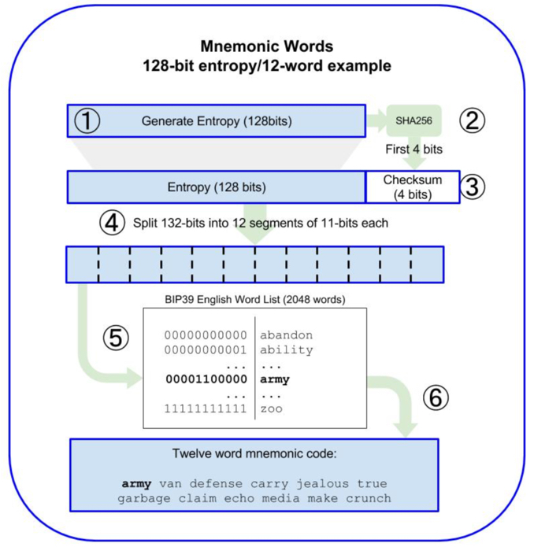

具体过程如下

- 创建一个 128 到 256 位（步长 32 位）的随机序列（熵）；\

	随机序列的长度称为熵长，熵长按照步长 32 位，主要有几种分别为 [128, 160, 192, 224, 256]，示例图中是 128 位；
- 对上一步生成的随机序列进行 SHA256 生成 Hash 值，并取出该 Hash 值的前 N 位（熵长/32，如：128 位，则 N = 4）作为随机序列的校验和（Checksum）；
- 将 Checksum 添加至第一步生成的随机序列的尾部，此时对于图中示例加上 Checksum 之后为 128 + 4 = 132 位的随机序列；
- 将上一步的随机序列按照 11 位一段进行分隔(split)，这样对于 128 位熵长的序列就会生成 12 段（132/11=12）；
- 此时将每个包含 11 位部分的值与一个预定义的 2048 个单词的词典进行对应；
- 按照切割顺序生成了最终的单词组就是助记词；

可以看到不同熵长对应的 Checksum 的长度，最终生成的助记词的长度不同，具体如下表

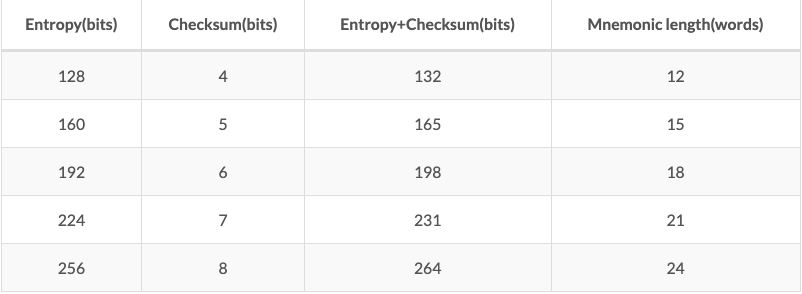

上面第 5 步涉及到单词表，理想的单词表应该满足智能选词、避免相似单词、排序单词表等特点，目前支持了[多种不同国家的单词表](https://github.com/bitcoin/bips/tree/master/bip-0039)。

如下示例代码基于 128 位强度的熵长生成了 12 个助记词

	>>> from mnemonic import Mnemonic
	>>> m = Mnemonic('english')
	>>> words = m.generate(strength=128)
	>>> words
	
	u'olympic hard body window sibling used only mimic put sad ability bone'
	
## 从助记词生成种子
助记词生成之后我们可以通过密钥生成函数 PBKDF2 算法来生成种子。

PBKDF2 需要提供两个参数：助记词和盐（salt）。其中 salt 的目的就是增加破解难度，而在 BIP-39 中，我们可以引入密码（passphrase）来作为保护种子的附加安全因素。

PBKDF2 is part of RSA Laboratories’ Public-Key Cryptography Standards (PKCS) series, specifically PKCS #5 v2.0, also published as Internet Engineering Task Force’s RFC 2898.

接着上面的助记词生成之后，如下图为生成 seed 的算法过程

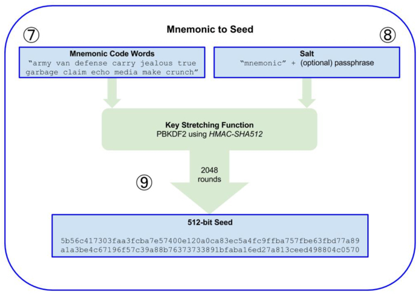

- PBKDF2 的第一个参数是上面生成的助记词；
- PBKDF2 的第二个参数就是 salt，一般有字符串和可选的用户提供的密码字符串连接组成；
- PBKDF2 使用 HMAC-SHA512 算法，使用了 2048 次 Hash 之后产生一个 512 位的值作为种子；

如下示例代码为基于上面示例中生成的助记词来生成种子

	>>>	 seed = Mnemonic.to_seed(words, "hellobtc")
	>>>	seed
	"\xb8\x94\xc79\xc6v\x07VY:\xfd\xb9J\x1d)\xffu3\x0c\x1d'\xd1F\xed\xe5c{R\xb9M\xdbu+\xdc\xc3\xb7\xc34\xe0\x81\xca\x97\x98W\xcf\xab\xa6\xa4c\xf3\xc9\x1d\xc0\xee\xd2\xa2{\xdaX+\x82\x14R\xfa"
	>>>	base58.b58encode(seed)
	'4h3QDYvyXEZRFeoCztcMybKH4aXkysTEmNqyDG2ZUyLTGvGwWUxXcEefCEB5JYjE8zuh2MSmLKsz9e8SQDpmzhuB'
	>>>	base58.b58encode_check(seed)
	'R9cTcYjTpLGZEKquHyv5MzyfQAEYyRzAFTd9dxqNhKqKCCKsxmwcy27qetTbK8zEZDzLSLf7AjF9L9cuWY6bZ4UGzZ3GQ'

## 从种子开始生成 HD 钱包
下面就将上面生成的种子作为 HD 钱包的根种子（root seed），任何 HD 钱包的根种子都可以重新创造整个 HD 钱包。

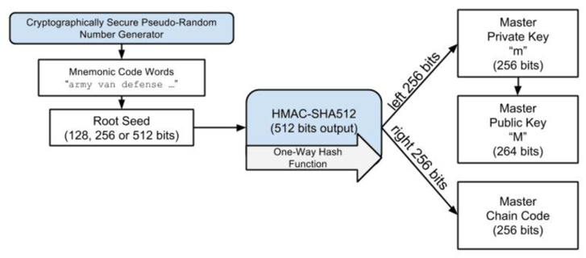

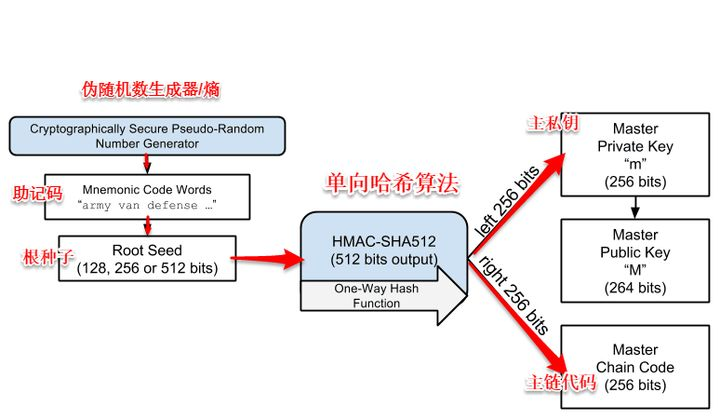

将 root seed 输入到 HMAC-SHA512 算法中可以得到一个 512 位的 Hash，该 Hash 的左边 256 位作为主私钥 m（Master Private Key），右边 256 位作为 主链码（Master Chain Code）。之后的 主公钥 M（Master Public Key，264 bits）可以通过 主私钥 m 生成。

### 子密钥衍生函数(Child Key Derivation, CKD)
#### 用椭圆公式推导
HD 协议利用了 ECDSA 公钥创建函数“point()”，它采用一个大整数（私钥）并将其转换为图形点（公钥）

- 父公钥推导

		point(private_key) == public_key
由于 `point()` 的工作方式，可以通过将现有（父）公钥与从任何整数（i）值创建子公钥。如果将i值添加到原始（父）私钥，然后将总和的余数除以使用的全局常量，则此子公钥与 `point()` 函数将创建的公钥相同（p）
	
- 子公钥推导
	- 子私钥推导 

			child_private_key=  (parent_private_key + i) % n
	- 子公钥推导
		
			point( (parent_private_key + i) % n ) == child_public_key == parent_public_key + point(i)
			
			point( (parent_private_key + i) % n )  == parent_public_key + point(i)
			
			parent_public_key + point(i) == child_public_key
	
这意味着在整数序列上，达成一致的两个或多个独立程序可以从单个父密钥对创建一系列唯一的子密钥对。此外，分发用于接收付款的新公钥的程序可以在不访问私钥的情况下执行此操作，从而允许公钥分发程序在可能不安全的平台上运行，例如公共网络服务器。

子公钥也可以通过重复子密钥推导操作来创建自己的子公钥（孙公钥）

	point( (child_private_key + i) % n ) == child_public_key + point(i)

无论是创建子公钥还是进一步下降的公钥，可预测的整数值序列不会比对所有交易使用单个公钥更好，因为知道一个子公钥的任何人都可以找到所有其他创建的子公钥来自同一个父公钥。相反，可以使用随机种子来确定性地生成整数值序列，以便没有该种子的任何人都看不到子公钥之间的关系。

#### 用一致性 HASH 推导
HD 协议使用单个根种子来创建子键、孙键和其他具有不可链接的确定性生成整数值的后代键的层次结构。每个子密钥还从其父密钥获得一个确定性生成的种子，称为链码，因此一个链码的妥协并不一定会危及整个层次结构的整数序列，即使主链码仍然有用，即使例如，基于 Web 的公钥分发程序被黑客入侵。	
如上所述，给定 Parent extended key 以及一个索引号(index)，就可以生成相应的 child extended key。

各个子层级的密钥生成规则如下图：

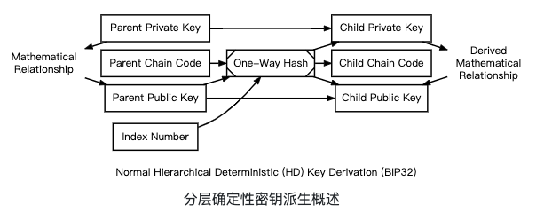

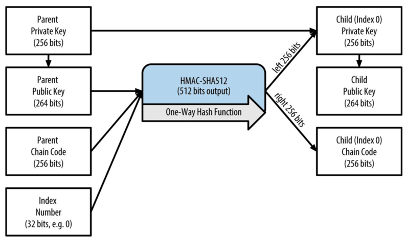

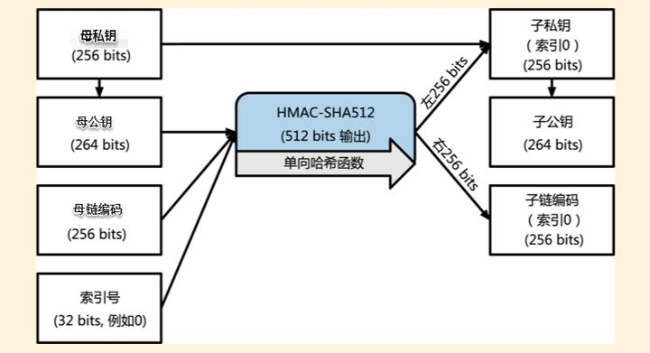

从上图可以看到，HD 的密钥生成如下几个参数：

- Parent Private Key 或 Parent Public Key；（均为未压缩的 256 bits 的 ECDSA 密钥）；
- 256 bits 的 Parent Chain Code；
- 32-bit 整型的 index number（索引号）；

在上图所示的范式中，父链码、父公钥和索引号被输入到单向加密哈希 ( HMAC-SHA512 ) 以产生 512 位的确定性生成但看似随机的数据。哈希输出右侧看似随机的 256 位用作新的子链码。散列输出左侧看似随机的 256 位用作整数值，与父私钥或父公钥结合，分别创建子私钥或子公钥：

	child_private_key == (parent_private_key + lefthand_hash_output) % n
	child_public_key == point( (parent_private_key + lefthand_hash_output) % n )
	child_public_key == point(child_private_key) == parent_public_key + point(lefthand_hash_output)
指定不同的索引号将从相同的父键创建不同的不可链接的子键。使用子链代码对子密钥重复该过程将创建不可链接的孙密钥。

另外，上面的过程是可以递归下去的，图中的 Child Private Key 可以作为其下一层级的 Parent Private Key。通过将 (Parent Publick Key, Parent Chain Code, Index Number) 输入至 HMAC-SHA512 算法中就可以生成其子密钥，并且可以通过调整 Index Number 来生成同一层级的多个子密钥。

改变索引号可以让我们延长母密钥以及创造序列中的其他子密钥。我们可以将索引集设为0去生产母密钥的第0个子密钥。比如子0，子1，子2等等。每一个母密钥可以有（2^31）个子密钥。索引号有32位，为什么32位的索引号只能产生2^31个子密钥呢？因为另一半作为特定类型的推导而保留的。在密钥的衍生方式中，分为两种

- 一种是正常衍生
- 另一种是强化衍生I

衍生的子密钥可以依次成为母密钥继续创造它自己的子密钥，直到无限代。

#### 整个流程
因为创建子密钥需要密钥和链码，所以密钥和链码一起称为[扩展密钥](https://developer.bitcoin.org/glossary.html#term-Extended-key)。一个扩展私钥与其对应的扩展公钥具有相同的链码。（顶级父级 root ）[主私钥](https://developer.bitcoin.org/glossary.html#term-Master-chain-code)和主链码来自随机数据，如下图所示。

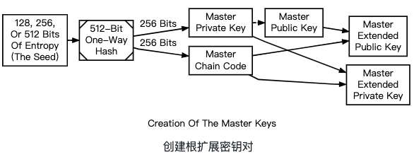

### 关于扩展密钥(extended key)
因为这个密钥衍生函数是单向的，所有 子密钥 都是不能够被用来推导出它们的 父密钥 的，也不能推导出同层级的 姊妹密钥 的，只有 父密钥 和 父链码（又是由 Parent 的 Parent 层级的 密钥 和 链码 生成） 可以推导出所有的 子密钥 和 子链码，后续也就可以生成相应的 子公钥 以及地址，并且用于对交易进行签名。

将 密钥 Key 和 Chain Code 结合起来称为 扩展密钥（extended key），可以通过 扩展密钥 来生成自其而下的所有分支。

密钥衍生函数需要三个输入量：

- 一个密钥
- 一个链码
- 子密钥的索引

密钥以及链码这两个重要的部分被结合之后，就叫做扩展密钥.

扩展密钥中提供的密钥可以分为两种私钥 或者 公钥，和 链码 结合起来分别称为 

- 扩展私钥（extended private key）

	私钥以及链码组成的扩展私钥，它可以用来衍生子私钥
- 扩展公钥（extended public key）

	公钥以及链码组成扩展公钥，扩展公钥可以生成扩展子公钥

扩展密钥通过 Base58Check 来编码，从而能轻易地在不同的BIP-32兼容钱包之间导入导出。

并且分别记为 (k, c) 和 (K, c)，其中公钥 K = point(k)。

扩展密钥编码用的 Base58Check使用特殊的版本号，这导致在Base58编码字符中，出现前缀“xprv”和“xpub”。这种前缀可以让编码更易被识别。因为扩展密钥是512或者513位，所以它比我们之前所看到的Base58Check编码串更长一些。

以下面的扩展私钥为例，其使用的是 Base58Check 编码：

	xprv9tyUQV64JT5qs3RSTJkXCWKMyUgoQp7F3hA1xzG6ZGu6u6Q9VMNjGr67Lctvy5P8oyaYAL9CAWrUE9i6GoNMKUga5biW6Hx4tws2six3b9c

这是上面扩展私钥对应的扩展公钥，同样使用Base58Check编码

	xpub67xpozcx8pe95XVuZLHXZeG6XWXHpGq6Qv5cmNfi7cS5mtjJ2tgypeQbBs2UAR6KECeeMVKZBPLrtJunSDMstweyLXhRgPxdp14sk9tJPW9
我们可以从 扩展私钥 推导出 扩展公钥，而反之则不可以，因此对于某些交易场景（如电商），可以为每笔交易生成一个新的公钥和地址来收款，而扩展私钥可以被存储在纸质钱包或者硬件钱包中，用于安全的离线签署交易。可以看到 扩展公钥 的安全性相对高一些，下图为通过 扩展 父公钥 来衍生 子私钥进而生成子公钥 的传递机制：

扩展密钥 也通过 Base58Check 进行编码，扩展私钥 和 扩展公钥 的编码分别以 xprv 和 xpub 作为前缀。

## 硬化衍生子密钥
### 问题
强化扩展密钥修复了普通扩展密钥的潜在问题。

- 如果攻击者获得了一个普通的父链码和父公钥，他就可以暴力破解从中派生的所有链码。
- 如果攻击者还获得了子、孙或进一步后代的私钥，他可以使用链码生成从该私钥向下的所有扩展私钥，如图中的孙代和曾孙代所示以下。

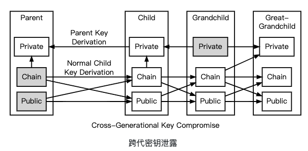

更糟糕的是，攻击者可以反转正常的子私钥推导公式，从子私钥中减去父链码以恢复父私钥，如上图的子代和父代所示。这意味着获得扩展公钥和从它派生的任何私钥的攻击者可以恢复该公钥的私钥和从它派生的所有密钥。

### 解决办法
- 不要随意导出私钥

	出于这个原因，扩展公钥的链码部分应该比标准公钥更安全，并且应该建议用户不要将非扩展私钥导出到可能不可信的环境中。
- 硬化衍生密钥

	HD 钱包为了安全性，又提出来一种叫做 硬化衍生(hardened derivation) 的衍生函数，从上面 扩展公钥 生成的图中可以看到 子密钥 和 子链码 都是由 父公钥 和 父链码 通过 HMAC-SHA512 生成的，而 硬化衍生 函数将 父公钥 换成 父私钥 来推导出 子密钥 和 子链码，如下图：

	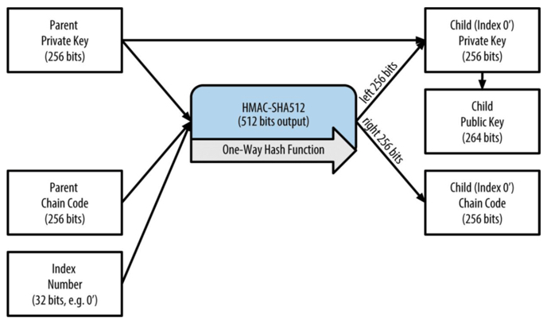
	
	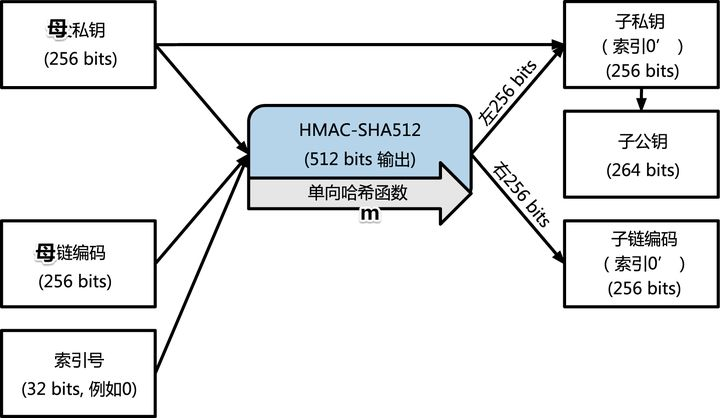

### 正常衍生与强化衍生索引号的区别
- 对比图
	- 普通衍生
	
		
	- 强化衍生
	
		
- 如图所示的强化公式将索引号、父链码和父私钥组合在一起，以创建用于生成子链码和子私钥的数据。这个公式使得在不知道父私钥的情况下无法创建子公钥。换句话说，父扩展公钥不能创建强化的子公钥。

	正因为如此，[强化的扩展私钥](https://developer.bitcoin.org/glossary.html#term-Hardened-extended-key)比普通的扩展私钥有用得多。强化的扩展私钥创建了一个防火墙，通过它不会发生多级密钥派生。因为硬化的子扩展公钥不能自己生成孙子链码，所以不能将父扩展公钥的泄露与孙子私钥的泄露结合起来创建曾孙扩展私钥。	
- 用在衍生函数中的索引号码是32位的整数。为了区分密钥是普通衍生还是强化衍生的，将使用不同的索引号，所以索引号被分为两个范围。
	- 索引号在0和2^31–1(0x0 to 0x7FFFFFFF)之间的是只被用在常规衍生。
	- 索引号在2^31和2^32– 1(0x80000000 to 0xFFFFFFFF)之间的只被用在强化衍生。

	因此，索引号小于2^31就意味着子密钥是常规的，而大于或者等于2^31的子密钥就是强化型的。所以第一个正常密钥（0×00）为0，第一强化键（为0x80000000）为0'。
- 为了让索引号码更容易被阅读和展示，强化子密钥的索引号码是从0开始展示的，但是右上角有一个小撇号。第一个常规子密钥因此被表述为0，但是第一个强化子密钥（索引号为0x80000000）就被表示为0'。第二个强化密钥依序有了索 引号0x80000001，且被显示为1'，以此类推。当你看到HD钱包索引号i'，这就意味着 2^31+i。

这种紧凑的描述进一步与以m或M为前缀的斜杠组合以指示层次结构和密钥类型，其中m是私钥，M是公钥。例如，m/0'/0/122'是指主私钥的第一个硬化子（按索引）的第一个正常子（按索引）的第123个硬化私有子（按索引号）。以下层次结构说明了主要符号和强化的关键防火墙。

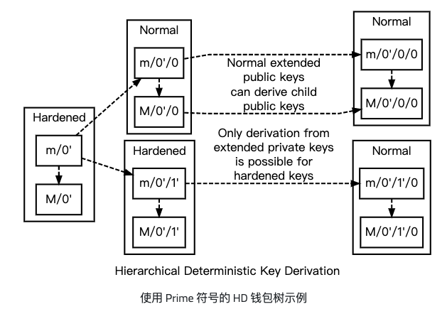

## 总结
下面是根据自己理解整理的 HD Wallet 的分层密钥生成结构图如下

## 参考
- [基于 BIP-32 和 BIP-39 规范生成 HD 钱包（分层确定性钱包）](https://stevenocean.github.io/2018/09/23/generate-hd-wallet-by-bip39.html)
- [Wallets](https://developer.bitcoin.org/devguide/wallets.html)