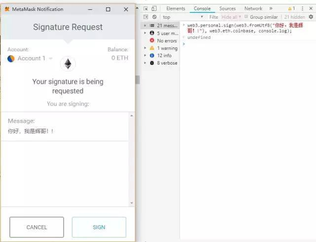
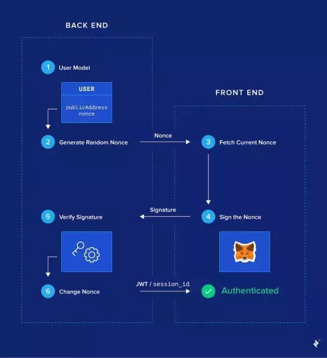

# 如何实现MetaMask签名授权后 DAPP 一键登录功能？
MetaMask（https://metamask.io/）是一个浏览器插件，它的核心是它作为以太坊钱包：通过安装它，您将可以访问一个独特的以太坊钱包地址，并使用它开始发送和接收以太币、ERC20或NFT通证。

MetaMask不仅仅是以太坊钱包。作为浏览器扩展，它可以与您正在浏览的当前网页进行交互。它通过在您访问的每个网页中注入一个名为 web3.js（https://github.com/ethereum/web3.js/）的JavaScript库来实现。注入后，web3 将通过 window.web3 的 JavaScript 代码为你访问的每个网页提供一个对象。
## web3.js
 Web3.js 是以太坊区块链的 JavaScript 接口。有以下功能：

- 获取最新的区块号（web3.eth.getBlockNumber）
- 检查MetaMask上的当前活动帐户（web3.eth.coinbase）
- 获取任何帐户的余额（web3.eth.getBalance）
- 发送交易（web3.eth.sendTransaction）
- 使用当前帐户的私钥对消息进行签名（web3.personal.sign）

…还有获取更多接口说明：https://github.com/ethereum/wiki/wiki/JavaScript-API

安装 MetaMask 后，任何 `前端` 代码都可以访问所有这些功能，并与区块链进行交互（https://www.toptal.com/ethereum-smart-contract）。他们被称为 dapps 或 DApps（去中心化的应用程序，有时甚至写成“ĐApps”）。

web3.js 中的大多数函数都是读函数（get block, get balance, etc.），web3立即给出响应。但是某些功能（如 web3.eth.sendTransaction 和 web3.personal.sign）需要当前帐户使用其私钥对某些数据进行签名。这些函数触发 MetaMask 显示确认弹窗，以仔细检查用户是否知道他或她正在签名的内容。

简单测试，请在 DevTools 控制台中粘贴以下行

	web3.personal.sign(web3.fromUtf8("你好，我是辉哥！!"), web3.eth.coinbase, console.log);
此命令表示：使用 coinbase 帐户（即当前帐户）将我的消息（从utf8转换为十六进制）进行签名，并以打印作为回调函数打印出签名。输入回车后，将出现 MetaMask 弹窗，如果点击签名按钮，将打印签名的消息。

MetaMask确认弹出窗口

我们将 web3.personal.sign 在登录流程中使用。

关于这一部分的最后一点说明：MetaMask 将 web3.js 注入到您当前的浏览器中，但实际上还有其他独立的浏览器也会注入 web3.js，例如 Mist（https://github.com/ethereum/mist）。MetaMask 为普通用户提供了探索 dapps 的最佳用户体验和最简单的转换。
## 登录流程
如前面所述，我们将忘记区块链。我们有一个传统的 Web 2.0 客户端 - 服务器 RESTful架构。我们将做出一个假设：访问我们的前端网页的所有用户都安装了 MetaMask。有了这个假设，我们将展示无密码加密安全登录流程的工作原理。

- 第1步：修改用户模型（后端）
	- Dapp 登陆流程
	
		首先，我们的 User 模型需要有两个新的必填字段：

		- publicAddress 
			- 需要具有唯一性
		- nonce
	
		你可以保持平常 username，email 和 password 字段，特别是想平行实现 MetaMask 登录电子邮件/密码登录，但它们是可选的。
	- metamask 登陆流程
	
		如果用户希望使用 MetaMask 登录，则注册过程也会略有不同，因为注册时 publicAddress 将是必填字段。但用户永远不需要手动输入 publicAddress 钱包地址，因为它可以通过 web3.eth.coinbase 变量来提取。
- 第2步：生成随机数（后端）

	对于 Dapp 数据库中的每个用户，在 nonce 字段中生成随机字符串。例如，nonce 可以是一个大的随机整数。
- 第3步：用户获取他们的随机数（前端）

	在 Dapp 前端 JavaScript 代码中，假设存在 MetaMask 并可以访问 window.web3，通知 web3.eth.coinbase 获取当前 MetaMask 帐户的钱包地址。

	当用户单击 Dapp 登录按钮时，向后端发出 API 调用以检索与其钱包地址关联的随机数。像带参数获取例如 
	
		GET /api/users?publicAddress=${publicAddress}
	当然，由于这是一个未经身份验证的 API 调用，因此后端应配置为仅显示此路由上的公共信息包括 nonce。

	- 没有结果
	
		如果先前的请求未返回任何结果，则表示当前钱包地址尚未注册。我们需要先通过 
		
			POST /users
		传递 `publicAddress` 请求消息体来创建一个新帐户。
	- 有结果

		那么我们存储它的 nonce
- 第4步：用户签署 Nonce（前端）

	一旦前端接收 nonce 到先前 API 调用的响应，它将运行以下代码：

		web3.personal.sign(nonce, web3.eth.coinbase, callback);
	这将提示 MetaMask 显示用于签名消息的确认弹出窗口。随机数将显示在此弹出窗口中，以便用户知道有没有签署某些恶意数据。

	当她或他接受签名时，将使用带签名的消息（称为 `signature`）作为参数调用回调函数。然后前端进行另一个 API 调用 
	
		POST /api/authentication
	传递一个带有 `signature` 和 `publicAddress` 的消息体
- 第5步：签名验证（后端）

	当后端收到
	
		POST /api/authentication
	请求时，它首先根据请求消息体中 `publicAddress` 获取数据库中的对应用户，特别是它相关的随机数 nonce。

	具有随机数、钱包地址和签名后，后端可以加密地验证（https://en.wikipedia.org/wiki/Digital_signature）用户已正确签署了随机数。如果确认是这种情况，那么用户已经证明了拥有钱包地址的所有权，我们可以考虑对她或他进行身份验证。然后可以将 JWT 或会话标识符返回到前端。

- 第6步：更改 Nonce（后端）

	为了防止用户使用相同的签名再次登录（如果它被泄露），我们确保下次同一用户想要登录时，她或他需要签署一个新的 nonce。这是通过nonce 为该用户生成另一个随机数并将其持久保存到数据库来实现的。

这就是我们管理 nonce 签名无密码登录流程的方法

## 为什么登录流程有效
根据定义，身份验证实际上只是帐户所有权的证明。如果您使用钱包地址唯一地标识您的帐户，那么证明您加密方式拥有该帐户就非常简单。

为了防止黑客获取某个特定邮件及其签名（但不是您的实际私钥），我们会强制需要签名的消息满足以下条件：

- 由后端提供
- 定期改变

在 demo 样例中，每次成功登录后我们都改变了它，但也可以设想基于时间戳的机制。

## demo代码实现
为了本文的目的，我创建了一个小型演示应用程序。我正在使用的堆栈如下：

- Node.js，Express 和 SQLite（通过Sequelize ORM）在后端实现 RESTful API。它在成功验证时返回 JWT
- 在前端反应单页面应用程序

我尝试使用尽可能少的库。我希望代码足够简单，以便您可以轻松地将其移植到其他技术堆栈。

访问 `https://login-with-metamask.firebaseapp.com/` 可以获得一个演示，也可以参考步骤搭建自己的本地工程。

- 第1步：修改用户模型（后端）	
	代码所在
	
		.\backend\src\models\user.model.js
	编辑	
	
		const User = sequelize.define('User', {
		
		  nonce: { 
		  // 初始化 nonce 为随机大数,每次成功登录后都应更改此号码。 
		    allowNull: false,
		    type: Sequelize.INTEGER.UNSIGNED,
		    defaultValue: () => Math.floor(Math.random() * 1000000) // Initialize with a random nonce
		  },
		
		  publicAddress: { 
		  //地址，为简单起见 publicAddress 字段设置为小写。更严格的检查地址是否是有效的以太坊地址的方法参考链接
		  // https://ethereum.stackexchange.com/questions/1374/how-can-i-check-if-an-ethereum-address-is-valid
		    allowNull: false,
		    type: Sequelize.STRING,
		    unique: true,
		    validate: { isLowercase: true }
		  },
		
		  username: {
		  //username 这里添加了一个可选字段，用户可以更改。 
		    type: Sequelize.STRING,
		    unique: true
		}
		});
- 第2步：生成随机数（后端）

	这是在 defaultValue() 上面的模型定义中的函数中完成的。
- 第3步：用户获取他们的随机数（前端）

	下一步是在后端添加一些样板代码来处理 User 模型上的 CRUD 方法，这里不做。

	切换到前端代码，当用户单击登录按钮时，我们的 `handleClick` 处理程序执行以下操作
	
	代码所在
	
		.\frontend\src\Login\Login.js
	编辑
	
		class Login extends Component {
		  handleClick = () => {
		    // 检查账户
		    // --snip-- 
		   const publicAddress = web3.eth.coinbase.toLowerCase(); 
		   // 检查后端是否已存在具有当前 publicAddress 的用户
		    fetch(`${process.env.REACT_APP_BACKEND_URL}/users?publicAddress=${publicAddress}`)
		      .then(response => response.json())
		      // If yes, retrieve it. If no, create it.
		      // 如果是，则检索它。 如果没有，请创建它。
		      .then(
		        users => (users.length ? users[0] : this.handleSignup(publicAddress))
		      )
		      // --snip--
		  }; 
		
		 handleSignup = publicAddress =>
		    // 创建账户
		    fetch(`${process.env.REACT_APP_BACKEND_URL}/users`, {
		      body: JSON.stringify({ publicAddress }),
		      headers: {
		        'Content-Type': 'application/json'
		      },
		      method: 'POST'
		    }).then(response => response.json());
		}
- 用户签署 Nonce（前端）

	让继续 handleClick 方法。现在拥有一个由后端给出的用户（无论是检索还是新创建）。特别是有他们的 nonce 和 publicAddress。因此准备 publicAddress 使用与此相关联的私钥对 nonce 进行签名 web3.personal.sign。

	继续编辑
	
		class Login extends Component {
		  handleClick = () => {
		  
		  // 检查函数
		    // --snip--
			fetch(`${process.env.REACT_APP_BACKEND_URL}/users?publicAddress=${publicAddress}`)
		      .then(response => response.json())
		      // If yes, retrieve it. If no, create it.
		      .then(
		        users => (users.length ? users[0] : this.handleSignup(publicAddress))
		      )
		      // 弹出 MetaMask 确认模式以签署消息
		      .then(this.handleSignMessage)
		      // 将签名发送到 /auth 路由上的后端
		      .then(this.handleAuthenticate)
		      // --snip--
		  };
		
		  handleSignMessage = ({ publicAddress, nonce }) => {
		  
		  // 签名函数
		  
		    return new Promise((resolve, reject) =>
		      web3.personal.sign(
		      	  // web3.personal.sign 将字符串的十六进制表示作为其第一个参数，需要使用 UTF-8 编码的字符串转换为十六进制格式web3.fromUtf8
		      	  // 签署一个更加用户友好的句子，而不是仅签署nonce
		        web3.fromUtf8(`I am signing my one-time nonce: ${nonce}`),        publicAddress,
		        (err, signature) => {
		          if (err) return reject(err);
		          return resolve({ publicAddress, signature });
		        }
		      )
		    );
		  };
		  handleAuthenticate = ({ publicAddress, signature }) =>  
		  
		  // 只是向/auth后端的路由发送请求，发送我们publicAddress以及signature用户刚签名的消息

		  fetch(`${process.env.REACT_APP_BACKEND_URL}/auth`, {
		      body: JSON.stringify({ publicAddress, signature }),
		      headers: {
		        'Content-Type': 'application/json'
		      },
		      method: 'POST'
		    }).then(response => response.json());
		}
- 第5步：签名验证（后端）

	后端在 /auth 包含一个 publicAddress 和一个路由上接收请求签名 signature 并且需要验证钱包地址 publicAddress 是否已签名正确的随机数 nonce。

	- 第一步是从数据库中检索用户所说的 publicAddress; 只有一个因为我们 publicAddress 在数据库中定义为唯一字段。
	- 然后，我们将消息设置 msg 为 “I am signing my one-time nonce…”，与步骤4中的前端完全相同，使用此用户的随机数。
	- 下一个块是验证本身。有一些加密涉及。相关阅读[椭圆曲线签名算法](https://en.wikipedia.org/wiki/Elliptic_Curve_Digital_Signature_Algorithm)

			User.findOne({ where: { publicAddress } })
			  // --snip--
			  .then(user => {
			    const msg = `I am signing my one-time nonce: ${user.nonce}`;
			    // 我们现在拥有 msg、publicAddress 和签名。 我们可以使用 ecrecover 进行椭圆曲线签名验证
			
			    const msgBuffer = ethUtil.toBuffer(msg);
			    const msgHash = ethUtil.hashPersonalMessage(msgBuffer);
			    const signatureBuffer = ethUtil.toBuffer(signature);
			    const signatureParams = ethUtil.fromRpcSig(signatureBuffer);
			    const publicKey = ethUtil.ecrecover(
			      msgHash,
			      signatureParams.v,
			      signatureParams.r,
			      signatureParams.s
			    );
			
			    const addressBuffer = ethUtil.publicToAddress(publicKey);
			    const address = ethUtil.bufferToHex(addressBuffer);
			
			    // 如果用ecrecover找到的地址与初始publicAddress匹配，则签名验证成功
			
			    if (address.toLowerCase() === publicAddress.toLowerCase()) {
			      return user;
			    } else {
			      return res
			        .status(401)
			        .send({ error: 'Signature verification failed' });
			    }
			    })

	总结这部分的作用，对于给出的 msg（包含nonce）和 signature 信息，ecrecover 函数输出用于签名 msg 的钱包地址。如果它与我们请求消息体的publicAddress一致，则证明了他们拥有publicAddress的所有权。经过这个过程，我们认为他们经过身份验证的。
	
	成功验证后，后端生成JWT并将其发送回客户端。这是一种经典的身份验证方案，所以我不会在这里放置代码。
- 第6步：更改Nonce（后端）

	出于安全原因，最后一步是更改 nonce。在成功验证后的某处，添加以下代码：
	
		// --snip--.
	
		then(user => {
		 user.nonce = Math.floor(Math.random() * 1000000);  return user.save();
		})
		
		// --snip--

## 投入生产
为什么此登录流程优先于电子邮件/密码和社交登录的参数列表：

- 提高安全性

	公钥加密的所有权证明可以说比通过电子邮件/密码或第三方证明所有权更安全，因为MetaMask在您的计算机本地存储凭据，而不是在线服务器，这使得攻击面较小。
- 简化的用户体验

	这是一键式（也可能是双击）登录流程，在几秒钟内完成，无需输入或记住任何密码。
- 增加隐私

	不需要电子邮件，也不涉及第三方

当然，MetaMask 登录流程可以很好地与其他传统登录方法并行使用。需要在每个帐户与其拥有的钱包地址之间进行映射。

但是这个登录流程并不适合所有人：

- **用户需要安装MetaMask：** 

	如果没有 MetaMask 或支持 web3 的浏览器，此登录流程显然无效。
- **需要在后端完成一些工作：**

	正如我们所见，实现此登录流程的简单版本非常简单。但是，要将其集成到现有的复杂系统中，需要在接触身份验证的所有区域进行一些更改：注册，数据库，身份验证路由等。这尤其正确，因为每个帐户都将与一个或多个钱包地址相关联。
- **它不适用于移动设备：**

	web3是此登录流程的先决条件。在桌面浏览器上，MetaMask会注入它。但是，移动浏览器没有扩展程序，因此此登录流程无法在移动版Safari，Chrome或Firefox上开箱即用。有一些独立的移动浏览器注入了web3基于MetaMask的浏览器。
	
	关于移动应用程序，答案是肯定的，登录流程有效，但需要有很多准备工作的作为基础。作为基本准备工作，您需要自己重建一个简单的以太坊钱包以及 web3.personal.sign 确认弹出窗口。幸运的是，有library可以帮助您。

	所以我认为答案是否定的，这个登录流程今天不适用于移动设备。但它正朝着这个方向努力，今天简单的解决方案仍然是移动用户的并行传统登录方法。	

## 参考						
[如何实现MetaMask签名授权后DAPP一键登录功能](./pic/https://www.pianshen.com/article/814899590/)				