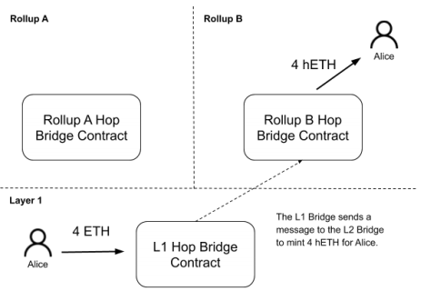
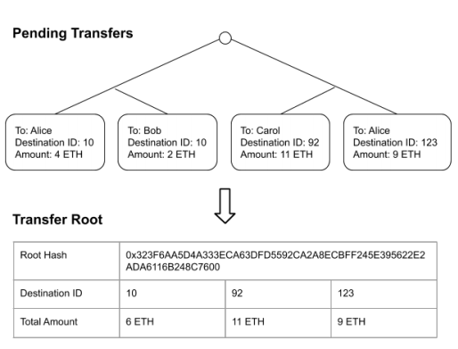
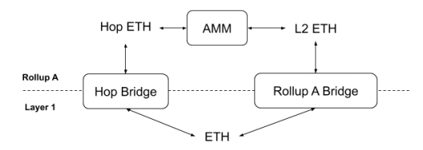
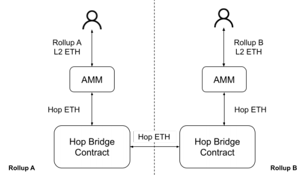

# 跳跃：跨汇总发送令牌
克里斯·温弗瑞 2021 年 1 月
## 摘要
本文介绍了 Hop，这是一种以快速且无需信任的方式跨 Rollup 及其共享的第 1 层网络发送令牌的协议。

Rollup 有扩展以太坊网络的潜力，但每个 rollup 都会为其应用程序创建一个孤立的环境。 在 Rollup 和第 1 层网络之间移动资产缓慢且昂贵，减少了用户通过使用 Rollup 获得的节省。

Hop 协议允许资产直接从 Rollup 移动到 Rollup，从而节省成本并实现应用程序的交叉 Rollup 组合。
## 1 简介
### 1.1 Rollups
Rollups 是一种第 2 层解决方案，已成为以太坊扩展路线图的基石。每个 Rollups 都提供了一个执行环境，该环境可以与以太坊本身类似的方式处理交易，但成本只是其中的一小部分。

简而言之，Rollups 通过将计算和数据存储移到链外，同时将每笔交易的一些数据保留在链上[1]，从而提高了以太坊的吞吐量。

出于本文的目的，我们将通过在 rollup 之间以及在 rollup 与其第 1 层基础链之间桥接令牌的镜头来分析 rollup。

有两种类型的 rollups：

- optimistic rollups
- zk-rollups[1]

虽然具有与本文无关的复杂权衡，但这两种类型的主要区别在于它们通过它们所扎根的第 1 层链进行验证的方法。

验证两种类型的 rollups 的方式使得将令牌从 rollups 移动到其第 1 层基础链的速度缓慢且成本高昂。

对于从 rollups 传递到其第 1 层的任何数据也是如此。 数据从 rollups 传递到其第 1 层基础链的速度称为 rollups 的“退出时间”。

- optimistic rollups 

	使用欺诈证明，其中涉及 rollups 中状态变化的挑战以及在第 1 层基础链上解决这些挑战。这些挑战需要时间来发挥。 因此，Optimistic rollup 的退出时间很重要； 通常在一天到一周之间。 
- Zk-rollups 

	使用有效性证明，可以即时确认，但每次确认都相对昂贵。在执行下一个有效性证明之前，无法完成从 zk-rollup 到 layer-1 的退出。 由于费用相对较高，zk-rollups 可能会选择不频繁地确认有效性证明，这意味着退出时间不会立即发生。目前生产中 zk-rollup 的确认间隔时间通常从一小时到一天不等。

对于这两种变体，将令牌从第 1 层移动到第 2 层并返回既昂贵又缓慢。为了让用户充分实现多样化汇总生态系统的好处，他们必须能够快速轻松地在 rollup 之间转移资产，而不会让第 1 层网络成为瓶颈——无论是时间还是成本。

### 1.2 将 L1 代币连接到 Rollup
每个 rollup 都有一个 Native Token Bridge 桥接第 1 层基础链和 rollup 之间的令牌。该桥通常内置于 Rollup 本身或至少与 Rollup 密切相关。

Rollup 的原生令牌桥允许用户在第 1 层网络上存入令牌并在 Rollup 上接收该令牌的表示。用户还可以将他们收到的第 2 层令牌发送回第 1 层，这将燃烧第 2 层令牌并最终在 Rollup 退出时间后解锁第 1 层令牌。

在某些情况下，应用程序还可以为其令牌提供自定义桥接器，称为应用程序特定桥接器。特定于应用程序的桥可能对已经具有比 Rollup 本身更灵活的信任模型的应用程序、具有第 1 层和第 2 层组件的应用程序或使用定制侧链的应用程序有意义 [2]。

最后，还有像 Hop Bridge 这样的通用令牌桥。通用令牌桥由第三方提供，并以通用方式桥接 ERC-20 令牌。
#### 1.2.1 规范代币
桥接器可以为被桥接的第 1 层令牌创建新的第 2 层令牌表示或者桥接器可以允许用户转换为现有的第 2 层表示。 即使存在多个第 1 层令牌的第 2 层令牌表示，应用程序也可能会倾向于使用第 1 层令牌的单个表示。

这是因为与 Rollup 中的其他应用程序组合符合每个应用程序的最大利益。因此，每个应用程序将选择使用与其他应用程序最兼容的每个令牌的版本。最广泛采用的版本是该 Rollup 的规范版本（例如，“Canonical ETH”、“Canonical DAI”）。

在大多数情况下，除非存在特定于应用程序的令牌桥，否则第 1 层令牌的规范版本将是本地令牌桥生成的令牌，在这种情况下，可能首选应用程序桥生成的版本。

因为汇总上的第 1 层令牌的规范版本是与该 Rollup 上的应用程序最兼容的版本，所以它很可能是最终用户想要的版本。

任何通用令牌桥的目标应该是允许用户在第 1 层令牌与其规范的第 2 层表示之间进行转换，而不仅仅是在 Rollup 上创建第 1 层令牌的新表示。

### 1.3 前期工作
跨区块链网络桥接资产并不是一个新问题。

用于桥接各种第 1 层网络及其变体的解决方案也可用于桥接汇总。
#### 1.3.1 权威桥的证明
权威证明 (PoA) 网桥依赖一组权威来证明令牌已锁定在其本地环境中，然后在目标环境中创建该令牌的表示。

这种方法是有效的，但引入了一个新的信任假设：当局将保持诚实。 不诚实的大多数当局可以窃取锁定的资金，并用不再抵押的代币充斥目的地环境。
#### 1.3.2 哈希时间锁定合约
用于原子交换的哈希时间锁定合约 (HTLC) 允许用户无需信任地将一种资产交换为另一种资产，即使这些资产位于不同的区块链上。

设置很简单：

1. Alice 用一个秘密的原像生成一个散列。¹
2. 爱丽丝向鲍勃付款，要求使用秘密原像来领取付款。
3. 鲍勃向爱丽丝付款，同样需要秘密原像，但鲍勃还不知道秘密。
4. 爱丽丝声称鲍勃的付款泄露了秘密原像。
5. Bob 使用新公开的原像来声明 Alice 的付款。 

HTLC 有几个已被广泛研究的缺点。

- Griefing 攻击 [5]
- 大规模退出漏洞 [4] 
- “免费选项”问题 [6] 

为 HTLC 实现带来了严重障碍

#### 1.3.3 有条件转移
条件转移类似于基于 HTLC 的交换，但不依赖于秘密原像，交换的第一条直接由交换的第二条触发。

这意味着条件传输对于在未连接的网络之间执行原子交换没有用，因为在一个网络上的操作不能触发另一个网络上的操作。

使用 rollup，第 1 层网络在 rollup 上触发操作是微不足道的，这使得在 rollup 与其第 1 层网络之间交换时，条件传输比 HTLC 更直接地执行原子交换。

虽然条件转移对于减少退出汇总所需的时间很有用，但将代币从一个 rollup 转移到下一个 rollup 的交易成本几乎没有减少。 所有 rollup-to-rollup 传输仍必须单独通过第 1 层网络，这并不能缓解第 1 层瓶颈。

## 2 Hop 协议
Hop 协议使用两管齐下的方法提供了一个可扩展的 rollup-to-rollup 通用令牌桥：

1. 创建一个跨网络的桥接代币，可以快速、经济地从一个 rollup 移动到另一个 rollup 或在第 1 层上为其基础资产认领。
2. 使用自动做市场在每次 rollup 时在每个桥接代币与其对应的规范代币之间进行交换，以动态定价流动性并激励整个网络的流动性重新平衡。

这种组合方法允许用户使用专门的桥接代币作为中介资产，在第 2 层规范代币之间快速且无需信任地进行交换。

### 2.1 跳桥代币
Hop Bridge 代币（例如，分别带有符号“hETH”、“hDAI”的“Hop ETH”、“Hop DAI”）是专门的第 2 层代币，可以批量传输 rollup-to-rollup 并充当中间资产 Hop 协议。

每个 Hop Bridge 代币代表第 1 层 Hop Bridge 合约中的一笔存款。

例如，如果将 4 ETH 存入第 1 层 Hop Bridge 合约，则可以从第 2 层 Hop Bridge 合约中铸造 4 Hop ETH。

相反，Hop Bridge 代币可以在第 1 层兑换其基础资产，这会燃烧在第 2 层兑换的 Hop Bridge 代币。

当一个 Hop Bridge Token 从 rollup 转移到 rollup 时，它会在原始 rollup 上燃烧并在目标 rollup 上铸造。

如下所述，这些即时转账是通过允许“保税人”在目的地提供流动性以换取少量费用来实现的。 

Bonder的流动性被返还

图 1：Alice 将 4 ETH 存入 L1 Bridge 合约并从 L2 Bridge 合约中收到 4 Hop ETH。

当传输最终作为称为“传输根”的更大束的一部分通过第 1 层传播时。

#### 2.1.1 转账
Hop 转移包括以下信息：

- 目标链 ID - rollup 或第 1 层目标的链 ID
- 收件人 - 在目的地接收转账的地址
- Amount - 被转移的代币数量

传输还可能包括附加信息以方便功能。例如，它可以指定中继器费用以允许交易中继器代表用户在其目的地撤回转账。

处理多个令牌的 Hop Bridge 的未来版本也需要在传输数据中包含令牌标识符。

#### 2.1.2 转移根
传输根代表具有最少数据的一组传输。每个传输根由以下部分组成：

1. 转移的默克尔根
2. 每个唯一目的地的数组，由其链 ID 表示
3. 发送到每个唯一目的地的总金额数组

图 2：四个待处理的传输聚合成一个具有三个目的地的传输根。

一个传输根可以包含数千个传输，但在第 1 层上作为单个包进行处理。 这减轻了第 1 层的瓶颈，并允许大量传输通过第 1 层以可扩展的方式传递到其目的地汇总。

但是，通过第 1 层传播传输根可能是一个缓慢的过程。 这主要是由于传输根发起的汇总的退出时间。为了立即完成转移，外部方可以在目标 rollup 上提供少量费用的前期流动性，如下一节所述。

#### 2.1.3 转让Bonder(债券)
Bonder 可以通过为 rollup 运行验证器节点来验证传输是否在其原始 rollup 上进行。 然后，Bonder 可以在目标 rollup 上提供前期流动性，以便立即完成转移。

最终，当转账到达目的地时，Bonder 的资金将被恢复。当转移通过系统传播时，Bonder 可能会收取少量费用以换取锁定流动性。 Transfer Bonds 提供的即时流动性和 Transfer Roots 实现的可扩展性使 Hop Bridge 代币能够快速、经济地从 rollup 转移到 rollup。

### 2.2 自动化做市商
每个 Hop Bridge 代币代表一个第 1 层代币，可以快速、经济地从一个 rollup 移动到另一个 rollup。 在正常的网络条件下，每个 Hop Bridge Token 的价值恰好是其 L1 对应物的 1，因为它可以随时在第 1 层兑换。

但是，每次 rollup 的第三方不太可能直接采用 Hop Bridge 代币。 他们采用的规范令牌更有可能是由 rollup 的本机令牌桥或如前所述的特定于应用程序的令牌桥产生的。

为了完成第 1 层代币与其 Canonical 第 2 层对应物之间的桥梁，可以部署自动做市商 (AMM) 以实现每个 Hop Bridge 代币与其对应的 Canonical 代币（例如，Hop ETH - Canonical L2 ETH）之间的交换 ）。

图 3：AMM 在 rollup 时在 Hop ETH 和 Canonical ETH 之间创建了一个市场。

该市场为给定 rollup 的流动性提供了定价机制，并且还充当套利者根据市场变动重新平衡流动性的激励机制。
#### 2.2.1 套利者
套利者是 Hop 协议中未经批准的外部参与者群体。套利者的作用是利用 layer1 代币与其规范的 layer-2 代币之间的价格差异。通过利用这些价格差异，套利者有效地在支持的 rollup 之间重新平衡流动性。

考虑以下具有第 1 层网络和 Hop Bridge 支持的单个 rollup 的场景。

用户在 rollup 上有 ETH，他们想立即将其移动到第 1 层。他们使用 Hop Bridge 是因为使用 Native Token Bridge 会使他们受到 rollup 的退出时间的影响。

- 首先，他们的 ETH 将使用 rollup 上的 ETH:hETH AMM 交换为 Hop ETH (hETH)。
- 然后，Hop ETH 可以在 rollup 上燃烧并兑换为第 1 层 ETH。

因为通过 Hop Bridge 退出涉及将 ETH 出售到 ETH:hETH 市场，这导致 ETH 的定价比 Hop ETH 略有折扣。如果此折扣变得足够大（例如，1.005 ETH/hETH），套利者将通过 Hop 桥移动第 1 层 ETH 以接收 Hop ETH。

然后使用 Hop ETH 购买打折的第 2 层规范 ETH。套利者现在可以选择将第 2 层规范 ETH 移回第 1 层。因为他们不想交易回到他们刚刚套利的市场并失去利润，他们将通过 Native Token Bridge 退出并承担流动性锁定。
#### 2.2.2 流动性提供者
每个 AMM 都要求流动性提供者向 AMM 的流动性池贡献被动流动性。作为回报，流动性提供者会从每次掉期中获得少量费用（例如 0.3%）作为回报。

通常情况下，流动性提供者也有发生所谓的“非永久性损失”的风险。当 AMM 中的资产价格出现分歧时，就会发生非永久性损失。

由于 Hop 协议中的 AMM 对始终是价值相似的资产，因此 Hop 流动性提供者的风险非常低，正常网络条件下的非永久性损耗。此外，AMM 的价格曲线可以针对在窄范围内交易的资产进行优化 [3]。
### 2.3 Rollup-to-Rollup 传输
通过 Hop Bridge 代币和每个 Rollup 上的市场在 Hop Bridge 代币和 Canonical 代币之间进行交换，用户可以快速轻松地从一个 Rollup 的 Canonical 代币转换为下一个。通过 Hop 协议的 Rollup-to-rollup 传输具有高度的可扩展性，因为单个传输不需要任何第 1 层事务。

考虑以下场景，Alice 拥有 Rollup A 的 Canonical ETH 并且想要 Rollup B 的 Canonical ETH：

1. Alice 使用 Rollup A 上的 AMM 将她的 Rollup A Canonical ETH 交换为 Hop ETH。
2. Alice 然后使用 Hop Bridge 将她的 Hop ETH 从 Rollup A 发送到 Rollup B。
3. 一旦 Bonder 为其转账提供流动性，Alice 就会在 Rollup B 上收到 Hop ETH。
4. Alice 现在可以使用 Rollup B 上的 AMM 将她的 Hop ETH 交换为 Rollup B Canonical ETH。

图 4：用户使用 Hop 令牌作为中间资产在每次 Rollup 时在 Canonical 令牌之间进行交换。

最终，她的 Transfer 通过 L1 Hop Bridge 传播，Bonder 的流动性被返还。

为方便起见，Alice 还可以通过单笔交易进行交叉 Rollup 转账。她调用 Hop Bridge，它使用 AMM 为 Alice 执行从 Rollup A Canonical ETH 到 Hop ETH 的交换，然后将 Hop ETH 发送到其目的地。

这一次，传输会发送指令，以在目的地自动将 Hop ETH 交换为 Rollup B Canonical ETH。这种便利的功能还使其他智能合约可以轻松地直接与 Hop 协议交互并进行交叉汇总传输。

需要注意的是，在这两种情况下，Alice 的转账仅通过第 2 层交易完成。第 1 层跳桥严格处理批量传输而不是单个传输本身。这允许以最少的第 1 层交互完成数以千计的 rollup-to-rollup 传输。

## 3 个进一步研究的领域
### 3.1 去中心化 Bonder 角色
在最基本的形式中，Bonder 是一个单一的外部方，它为转移和转移根验证和提供流动性。然而，依靠单一的 Bonder 始终可用并拥有足够的流动性来满足需求并不理想。 如果 Bonder 不可用，则没有资金面临风险，但转移以慢得多的速度通过系统传播。

允许使用 Bonders 网络可以创建一个更强大的系统，这带来了挑战。

选择绑定特定传输或传输根的绑定器必须以不经常导致失败交易且不允许拒绝服务攻击的方式进行。
### 3.2 更广泛的第 2 层支持
非 Rollup 第 2 层解决方案可能与 Hop 协议兼容。支持更广泛的解决方案将提高灵活性并可能提高系统的效率。

也可能支持与其他第 1 层的桥接，但在不引入新的信任假设的情况下这样做可能具有挑战性。
### 3.3 限制责任
在当前的结构中，Hop 桥的安全性取决于最弱的支撑卷轴。这给系统参与者带来了系统性风险。虽然普通用户在 Hop 桥上移动代币只会暂时暴露，但 AMM 的流动性提供者和一些套利者会不断暴露在这种风险中。

可以限制每个 Rollup 对系统的责任，从而降低系统的整体风险。
### 3.4 启用合约调用
智能合约和外部拥有的账户可以通过 Hop Bridge 发送代币，但它们不能向目标汇总发送数据或在其上进行合约调用。

此功能易于实现，但必须仔细考虑确切的方法和安全风险。
## 解释
- ¹ 原像可以被认为是一个秘密密钥，最终将与接收者共享。这可以是一个词、一个短语，甚至是一系列随机字节[7]。

## 参考文献
1. 维塔利克·布特林。一个不完整的 rollup 指南。 https://vitalik.ca/general/2021/01/05/rollup.html，2020 年 1 月。
2. 化合物。复合现金。 https://compound.cash/](https://compound.cash/，2020 年 12 月。
3. 迈克尔·叶戈罗夫。 Stableswap - 稳定币流动性的有效机制。https://www.curve.fi/stableswap-paper.pdf，2019 年 11 月。
4. Aviv Zohar Jona Harris。 Flood & loot：对闪电网络的系统性攻击。https://arxiv.org/pdf/2006.08513.pdf，2020 年 6 月。
5.  Cristina Perez-Sola、Alejandro Ranchal-Pedrosa、Jordi Herrera-Joancomart、Guillermo Navarro-Arribas 和 Joaquin Garcia-Alfaro。锁定：平衡针对闪电网络通道的可用性攻击。https://eprint.iacr.org/2019/1149.pdf, 2019.
6. 丹·罗宾逊。 Htlcs 被认为是有害的。http://diyhpl.us/wiki/transcripts/stanford-blockchain-conference/2019/htlcs-thinked-harmful/，2019 年 1 月。
7. taconator Ryan R. Fox，John M. Jones。 bsip-0044。https://github.com/bitshares/bsips/blob/master/bsip-0044.md，2018 年 8 月。

## 翻译
[Hop: Send Tokens Across Rollups](https://hop.exchange/whitepaper.pdf)
