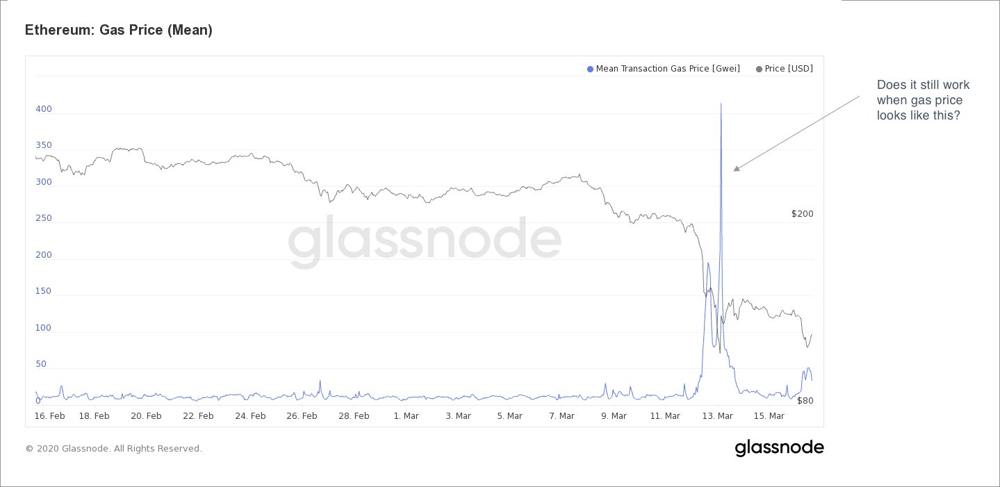

# 一个结束和一个新的开始(Authereum 钱包公司第一篇翻译）
Authereum Labs 正在将我们的重点转向 [Hop 协议](https://medium.com/hop-protocol/hop-send-tokens-across-rollups-30f14c432f7c)，为以太坊的第 2 层生态系统带来可组合性。Hop 允许用户通过汇总和其他基于以太坊的扩展解决方案快速且廉价地发送代币。

第 1 层 gas 高昂的费用已将 Authereum 的入门成本推至不可持续的水平。今天，注册一个 Authereum 账户的成本超过 200 美元——距离我们着手构建的以太坊的无缝入口很远。Hop 正面解决了这个问题，但最好从一开始就解释我们如何到达这里。
## 开始
当我们开始在 Authereum 工作，我们的目标很简单：

让普通人访问 dapp 应用程序

对我们来说，这就像人类可读的 ENS 名称而不是地址的意思的事情

- 简单的用户名
- 基于口令登录
- 分批交易
- 消除令牌的批准(当然需要赞助或抽象的外卖交易费用)

我们支付了大约 $ 0.30 至部署帐户合同，并为每个用户分配一个 ENS 名称并与多家 dapps (那些愿意支付他们的用户的交易费用的)结成伙伴。交易的时间成本，他们今天做的不到1％，但是这并没有持续多久。

## 黑色星期四
[上周四](https://medium.com/aave/crypto-black-thursday-the-good-the-bad-and-the-ugly-7f2acebf2b83)，2020年3月12日，我们第一次意识到这种模式可能存在根本性缺陷。当时，COVID-19 以惊人的速度在全球蔓延，世界开始意识到我们所知道的生活即将改变。金融市场不景气，加密资产全线下跌 50% 至 60%。由于一连串的链上清算，gas 价格飙升，我们第一次看到了以太坊交易的昂贵程度。

3 月 12 日和 13 日，汽油价格飙升至现在看似温和的 200 Gwei，然后飙升至 400 Gwei。

第二天是我们在办公室的最后一天，现在已经一年多了。下周我们在 Zoom 上重新组合，并开始讨论 Authereum 如何在每个注册用户的成本超过 10 美元，我们支付的赞助交易成本更高的世界中生存。

我们迅速终止了赞助交易，并将注册成本推给了用户。这使我们能够可持续地运营，但导致我们的入门用户体验受到影响。

Gas 价格继续上涨，而且很明显，以太坊的第 1 层不仅对我们而言，而且对我们正在为其构建的主流用户而言都非常昂贵。如果 Authereum 有未来，它必须在第 2 层，而第 2 层不能很快到来。
## 2层
我们的第一个第 2 层工作是与 [DeversiFi](https://www.deversifi.com/) 和 [zkSync](https://zksync.io/) 等解决方案集成。两者都有快速的用户体验和极其低廉的费用——这正是第 2 层一直以来所承诺的。然而，大多数 Authereum 用户并没有意识到任何天然气节省。简单地上下第 2 层的成本太高了。更不用说，用户仍然必须在第 1 层部署现在 50 美元的帐户合同才能注册。一件事对我们来说变得越来越明显。

用户需要直接进入第 2 层，并且需要能够留在第 2 层。对于绝大多数用户来说，与第 1 层的任何交互都太昂贵了。

我们开始研究用户可以使用流动性池将代币直接从一个汇总转移到下一个汇总的方式。这将允许用户访问多样化的 rolllup 生态系统，而无需接触第 1 层以太坊。经过几次迭代，我们找到了 Hop 协议的早期版本，并认为值得进行概念验证。

看到 Hop 的第一个版本通过 Optimism 和 Arbitrum 测试网发送令牌令人着迷。以太坊的第 2 层开始感觉像是一个不可否认的现实，但我们了解没有直接可组合性的扩展性的局限性。如果 Hop 背后的概念是合理的，那么其影响是巨大的。

我们悄悄发布了 [Hop 白皮书](https://hop.exchange/whitepaper.pdf) 以征求更广泛社区的反馈，反响热烈。我们正在做一些事情，但知道前面还有很长的路要走。
## 今天
交易费用继续攀升，看不到尽头。我们已经看到越来越多的用户被以太坊淘汰，曾经有希望的项目由于费用而变得过时。相互竞争的区块链已经开始利用以太坊的拥塞问题。他们复制或买断以太坊的项目和创新，试图反映其文化，但通常会牺牲支撑这一切的精神。以太坊现在比以往任何时候都更需要第 2 层。

我们已经意识到我们在 Hop 上的工作可能会对更广泛的以太坊生态系统产生影响。从第一天起，我们的目标就是让普通人掌握以太坊应用程序，我们相信构建 Hop 是我们做到这一点的最佳方式。我们既悲伤又兴奋地宣布我们将在明年关闭 Authereum，将我们的全部注意力集中在 Hop Protocol 上。
## 前进
如果您是 Authereum 用户，我们强烈建议您保留帐户并继续关注未来几个月的更多新闻。我们鼓励您在方便的时候尽早开始平仓并将您的资金从 Authereum 中转移出去。我们已无限期暂停新注册，但将继续运行 Authereum 运行所需的所有基础设施。

如果您有兴趣关注我们的 Hop 进展，请在 [Twitter](https://twitter.com/HopProtocol) 上关注我们或跳入我们的 [Discord](http://discord.gg/PwCF88emV4) 并打个招呼。
每一个结束都会带来一个新的开始，我们对未来可能发生的事情感到前所未有的兴奋。

## 翻译
[An End and A New Beginning](https://medium.com/authereum/an-end-and-a-new-beginning-ae0e2e596e1b)