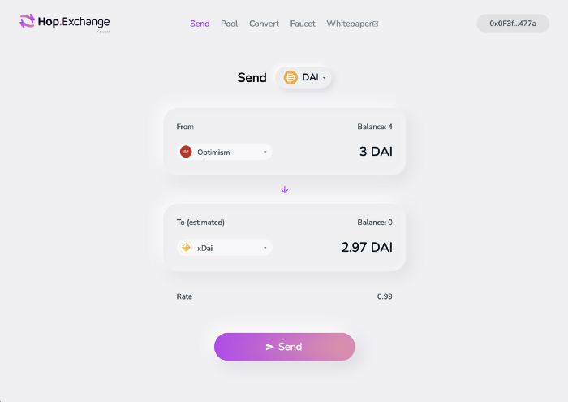

# 跳跃：跨汇总发送令牌
我们很自豪地正式介绍我们的 [Hop Protocol 计划](https://hop.exchange/send)。Hop 允许用户直接在第 2 层、侧链和第 1 层以太坊之间快速轻松地转移代币。在与 Authereum 率先解决高 gas 费用之后，我们决定将全部注意力集中在为以太坊实现可组合和可互操作的第 2 层生态系统上。
## 跳协议🐰
Hop 协议使用两管齐下的方法为以太坊的第 2 层生态系统提供了一个可扩展的令牌桥：

1. 创建一种称为 hToken（例如 hETH、hDAI 等）的特殊中介资产，可以快速经济地从一个网络转移到另一个网络。
1. 使用自动做市商 (AMM) 在每个第 2 层网络上的 hToken 及其相应资产之间进行交换。

最终结果允许用户将代币从一个网络无缝转移到下一个网络

## 跳跃发射🧑‍🚀
Hop 合同目前正在审核中，将于 4 月上线。最初，我们将专注于将少数资产从 Optimism 连接到第 1 层以太坊。从那里，我们将采用更多扩展解决方案并扩展支持的令牌集。您可以期待在短期内支持以下扩展解决方案：

- [Optimism](https://optimism.io/)
- [xDai](https://www.xdaichain.com/)
- [Polygon](https://polygon.technology/) (原来的 Matic)
- [Arbitrum](https://offchainlabs.com/) (主网启动)

## 我们要去哪里🚀
当前版本的 Hop 使用户能够在兼容 EVM 的扩展解决方案之间传输代币。我们相信这只是触及了第 2 层互操作性和可组合性的表面。未来的研究领域将包括：

- 启用跨链合约调用
- 提高系统的资本效率和气体效率
- 添加对非 evm 兼容汇总的支持

我们相信未来的以太坊用户将直接进入第 2 层，并将留在第 2 层，而无需接触第 1 层和随之而来的 gas 费用。我们的目标是让这成为现实。同时，请继续关注更多信息并了解如何参与社区。

## 翻译
[Hop: Send Tokens Across Rollups](https://medium.com/hop-protocol/hop-send-tokens-across-rollups-30f14c432f7c)

