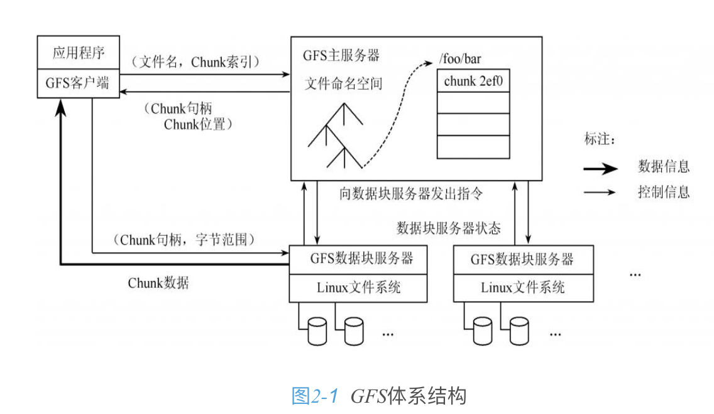
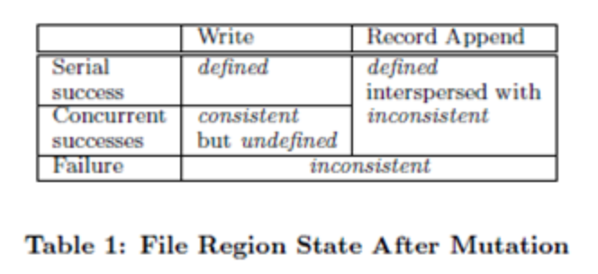
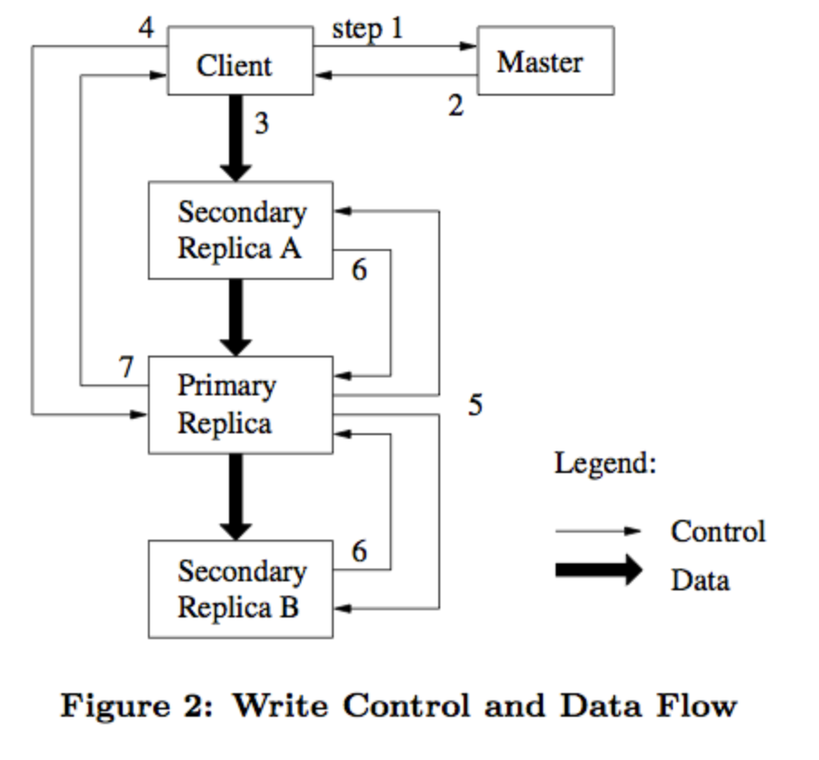
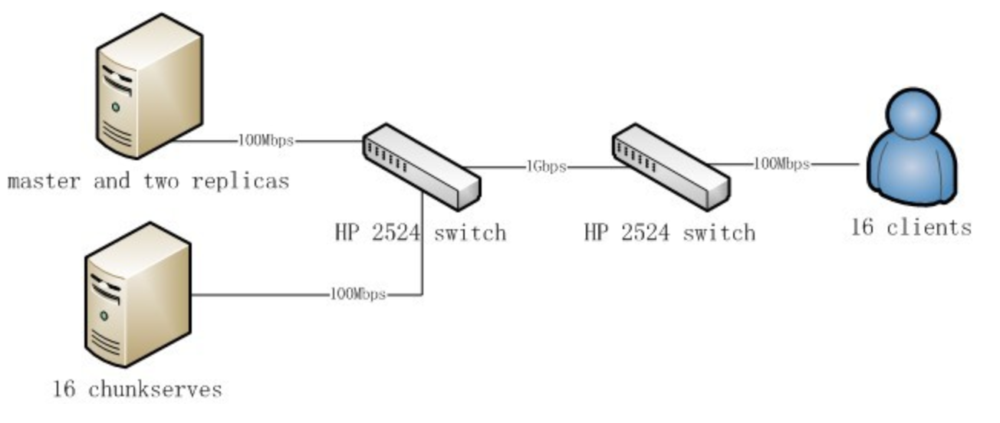
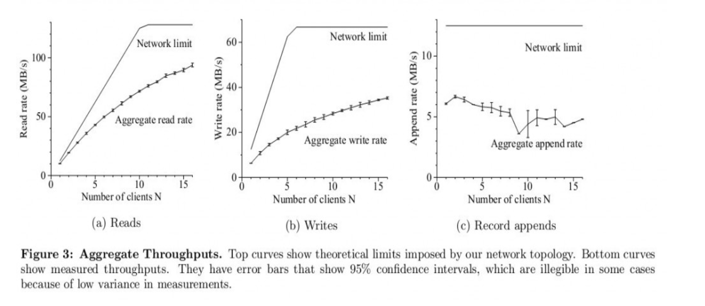
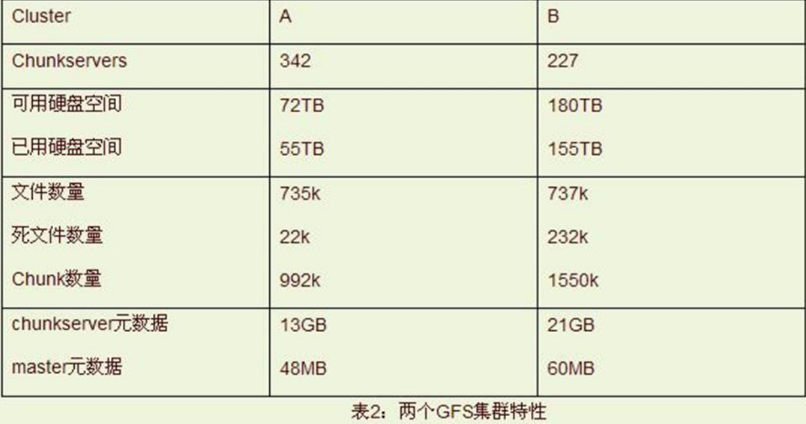
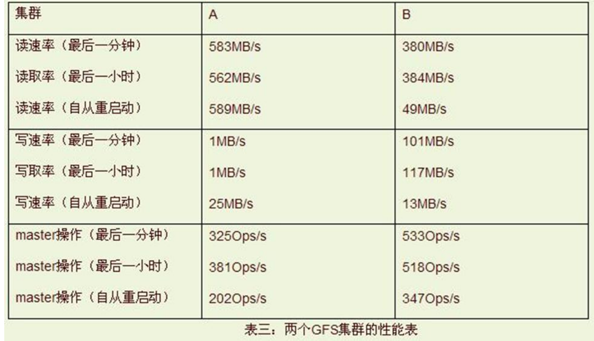
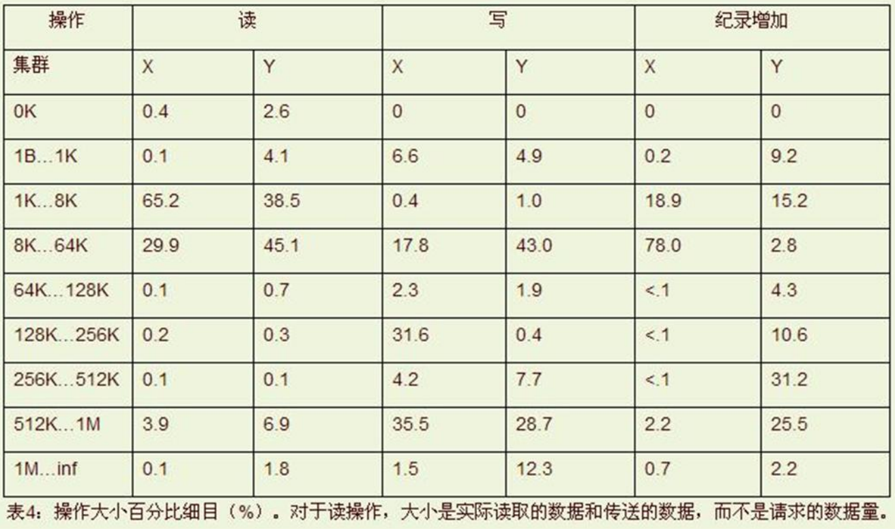
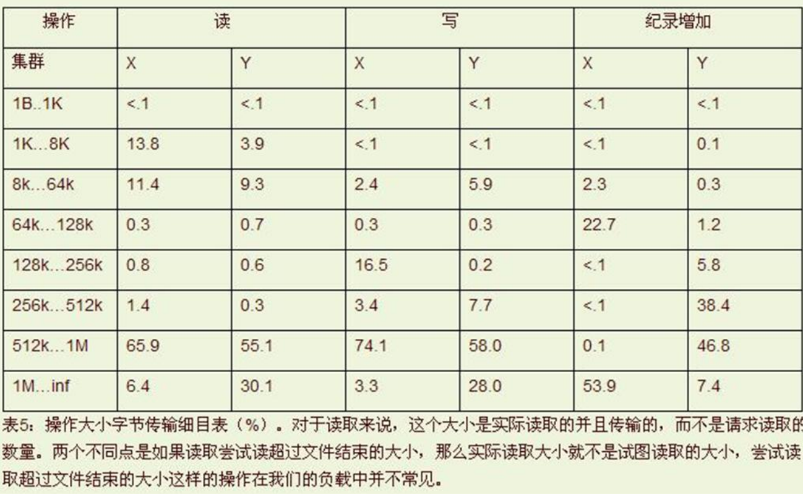
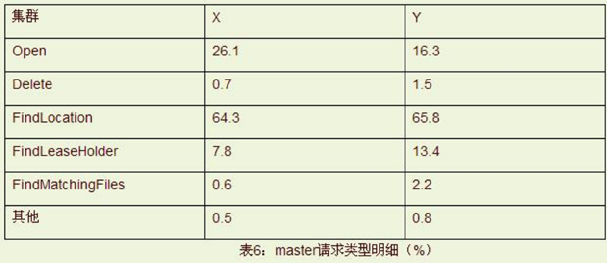

# Google File System翻译（转）

转载请注明：http://duanple.blog.163.com/blog/static/7097176720109145829346/ 

作者 phylips@bmy 

## 1 摘要
我们设计实现了 google 文件系统，一个面向大规模分布式数据密集性应用的可扩展分布式文件系统。它运行在廉价的商品化硬件上提供容错功能，为大量的客户端提供高的整体性能。 

尽管与现有的分布式文件系统具有很多相同的目标，我们的设计更多的来源于对于我们的具体应用的负载类型以及当前甚至未来技术环境的观察，这就使得它与早期的文件系统表现出明显的不同。这也使得我们重新审视传统上的设计选择，探索出一些在根本上不同的设计观点。

这个文件系统成功的满足了我们的存储需求。伴随这研究和开发的努力，在google内部，它已经作为那些需要大数据集服务的数据生成处理的基础存储平台而广泛部署。迄今为止，最大的集群可以通过超过一千台机器的数千块硬盘提供数百T的存储，这些存储空间可以由数百个客户端并发访问。

在本论文中，我们将描述为了支持分布式应用的文件系统扩展接口设计，讨论很多我们的设计观点，展示来自于beachmark和现实世界的一些测量数据。

为了满足google快速增长的数据处理需求，我们设计实现了google文件系统(GFS)。GFS与传统的分布式文件系统具有很多相同的目标比如性能，可扩展性，可靠性，可用性。然而，它的设计是由我们的具体应用的负载类型以及当前甚至未来技术环境的观察驱动的，所以与早期文件系统的设计假设具有明显的区别。我们重新审视传统上的设计选择，探索出一些在根本上不同的设计观点。

 - 一，组件失败成为一种常态而不是异常。文件系统是由成百上千台通过廉价的商品化部件组装起来的存储机器构成，可以被大量的客户端访问。组件的数量和质量在本质上决定了在某一时间有一些是不可用的，有一些无法从当前的失败中恢复过来。我们观察到，应用程序的bug，操作系统bug，人为的错误，硬盘的失败，内存，连接器，网络，电力供应都可以引起这样的问题。因此经常性的监控，错误检测，容错和自动恢复必须集成到系统中。
 - 二，与传统的标准相比，文件是巨大的。在这里，好几个G的文件是很普通的。每个文件通常包含很多的应用程序处理的对象比如网页文档。当我们日常处理的快速增长的数据集合总是达到好几个TB的大小，包含数十亿的对象时，去处理数十亿个KB级别的文件即使文件系统支持也会显得很笨重。这样设计中的一些假设和参数，比如IO操作和块大小就必须重新定义。
 - 三，大部分的文件更新模式是通过在尾部追加数据而不是覆盖现有数据。文件内部的随机写操作几乎是不存在的。一旦写完，文件就是只读的，而且通常是顺序读。大量的数据都具有这样的特点。有些可能是被数据分析程序扫描的库组成，有些可能是由运行中的应用程序持续生成的数据流，有些可能是档案数据，有些可能是数据需要由一台机器产生，然后由另一台机器处理而产生的中间结果。假设在大文件上数据访问具有这样的模式，那么当缓存数据在客户端失效后，append操作就成为性能优化和原子性的关键。
 - 四，应用程序和文件系统api的协同设计，增加了整个系统的灵活性。比如我们通过放松了GFS的一致性模型大大简化了文件系统，同时也没有给应用程序带来繁重的负担。我们也提供了一个原子性的append操作，这样多个客户端就可以对同一个文件并行的进行append操作而不需要彼此间进行额外的同步操作。这些都会在后面进行详细的讨论。

 目前已经有多个GFS集群为了不同的目的而部署起来。最大的那个具有1000个存储节点，超过300T的磁盘空间，被来自不同机器的数百个客户端持续访问着。

## 2 设计概览
### 2.1 假设
在设计一个满足我们需求的文件系统时，我们以一些充满了挑战和机遇的假设作为指南，之前我们曾间接的提到过一些关键的点，现在我们把这些假设再详细的列出来。

- 系统是由廉价的经常失败的商品化组件构建而来。必须进行经常性的监控和检测，容错，并且能够从组件失败中迅速的恢复，这些都应该像是例行公事。
- 系统存储了适度个数的大文件。我们期望有数百万个文件，每个100mb或者更大。上GB的文件大小应该是很普通的情况而且能被有效的管理。小文件也应该被支持，但我们不需要为它们进行优化。
- 工作负载主要由两种类型的读组成
	- 大的流式读取

		单个操作通常要读取数百k，甚至1m或者更大的数据。来自于同一个客户端的连续读取，通常读完文件的一个连续区域。
	- 小的随机读取

		通常在某个任意的偏移位置读取几kb的数据。具有性能意识的应用程序会把这些小的随机读取按批次，排序使得读取可以稳步的穿越整个文件而不是来回读取。
- 工作负载有很多大的对文件数据的append操作，通常操作的大小类似。一旦写完，文件就很少改变，在文件内部的随机写操作可以被支持，但是性能不必是很高的。
- 系统对于良好定义的多个客户端对相同文件的并行append操作必须提供有效的实现。我们的文件通常是用来作为生产者消费者队列或者进行多路归并。数百个生产者(每个机器上运行一个)将会对同一个文件进行append。因此具有最小化同步开销的原子性是必要的。文件之后可能会被读取，或者消费者可能并行的读取这个文件。
- 高的持续带宽比低延时更重要。我们大部分的目标应用都希望得到高速的批量数据处理速度，很少有对于单个的读写有严格的响应时间需求。

### 2.2 接口
GFS提供一个熟悉的文件系统接口，尽管它并没有实现一个诸如POSIX那样的标准API。文件通过目录进行层次化组织，通过路径来标识文件。支持常见的那些文件操作：create,delete,open,close,read,write。

另外，GFS还具有快照和append操作。快照以很低的开销创建一个文件或者目录数的拷贝。Append操作允许多个客户端向同一个文件并发的操作，同时保证每个独立客户端的append操作的原子性。这对于实现多路归并的结果以及生成者消费者队列很有帮助，这样客户端不需要额外的锁操作就可以并行的append。我们发现这种文件类型，对于构建大型的分布式应用简直就是无价之宝。快照和append操作将会在3.4和3.3分别讨论。
### 2.3 架构
一个GFS集群由一个master和多个chunkserver组成，可以被多个client访问，如图1所示。

 
它们都是一个运行着用户级服务进程的商品化linux机器。可以很容易的在同一台机器上运行一个chunkserver和client，只要机器资源允许以及由于运行可能的无状态应用程序代码带来的低可靠性是可以接受的。

文件被划分成固定大小的chunk。每个chunk是由chunk创建时由master分配的一个不可变的全局唯一的64bit句柄来标识。Chunkserver将chunk作为linux文件存储在本地，对于chunk数据的读写通过chunk的handle和字节边界来表示。为了可靠性，每个chunk存储在多个chunkserver上。尽管用户可以为不同文件名字空间区域指定不同的备份级别，默认地我们存储三个备份。

Master维护所有的文件系统元数据。包括名字空间，访问控制信息，文件与chunk的映射信息，chunk的当前位置。它也控制系统范围内的一些活动，比如chunk租赁管理，僵死chunk的垃圾回收，chunkserver间的chunk迁移。Master与chunkserver通过心跳信息进行周期性的通信，以发送指令和收集chunkserver的状态。

应用程序链接的GFS客户端代码实现了文件系统API以及代表应用程序与master和chunkserver进行通信以读写数据。客户端如果需要操作元数据则需要与master通信，但是所有的纯数据通信直接与chunksever通信。我们没有提供POSIX API，因此也就不需要与linux vnode layer关联。

客户端或者chunkserver都不会进行文件数据缓存。客户端缓存只能得到很少的好处，因为大部分的应用需要直接读取整个大文件或者工作集合太大根本无法缓存。没有cache简化了客户端和整个系统，因为不需要考虑缓存一致性问题(实际上客户端会缓存元数据)。Chunkserver不需要进行文件数据缓存，是因为chunk是作为本地文件存储，这样linux自身会将那些经常访问的数据进行缓存。
### 2.4 单Master
只有一个 master 大大简化了我们的设计，而且使得master可以利用全局信息对chunk的放置和备份进行更好的判断。然而，我们必须最小化它在读写中的参与性，使得它不会成为一个瓶颈。Client永远不会通过master读取文件数据，它只是问master它应该同哪个chunkserver联系。并且client将这些信息在有限的时间段内进行缓存，直接与chunksever交互进行很多后续的操作。

根据图1，我们简单解释一些一个读操作的交互过程：

- 首先，通过固定大小的chunk，客户端将应用程序中标识的文件名和offset转换为chunk的index。
- 然后给 master 发送一个包含文件名和chunk index 的请求
- master 返回相应的 chunk 的 handle 和所有备份的位置
- 客户端以文件名和 chunk index 为 key 将这条信息进行缓存
- 然后客户端给其中一个备份发送一个请求，通常是最近的那个

请求标识了chunk 的 handle 以及在那个 chunk 内的字节边界。直到缓存信息过期或者重新打开文件之前，对于相同 chunk 的后续读操作就不需要 client-master 的通信了。事实上，客户端通常在一个请求中查询多个 chunk 的信息，master也可以将这些被请求的多个chunk的信息包裹在一块进行返回。这种特别的信息，并没有额外的花费就避免了未来的client-master的多次通信。

### 2.5 chunk大小
Chunk 大小是一个关键的设计参数。我们选择了64mb，远远大于现有的文件系统块。每个chunk的副本作为普通的linux文件存储在chunkserver上，如果需要才会进行扩展。Lazy空间分配避免了内部碎片造成的空间浪费，很可能最大的碎片有向一个chunk那么大。

大的 chunk size 提供了几个重要的优势。

- 首先，降低了client与sever的交互需求，因为在相同chunk上的读写只需要一个初始化请求就可以从master得到chunk的位置信息。这个减少对于我们的应用负载是非常明显的，因为我们应用大部分需要顺序的读写整个大文件。即使对于小的随机读取，客户端也可以很容易的缓存一个几TB工作集的所有chunk的位置信息。
- 其次，由于chunk很大，那么客户端就很有可能在一个给定的 chunk 上执行更多的操作，这样可以将一个与 chunkserver 的TCP连接保持更长的时间，这就减少了网络开销。
- 再者，降低了存储在master上的元数据大小。这样就允许我们将元数据存放在内存中，反过来就带来了我们将在2.6.1中讨论的其他优势。

另一方面，大的 chunk size，即使采用了 lazy 的空间分配，也有它的缺点。

- 小的文件可能只有少数几个chunk，或许只有一个。如果很多的client都需要访问这个文件，这样那些存储了这些 chunk 的chunkserver 就会变成热点。实际中，热点还没有成为一个主要的考虑点因为我们的应用绝大部分都是在顺序读大的多chunk文件。
- 然而，当GFS第一次使用在一个批处理队列系统时，热点确实出现了：一个可执行文件作为一个chunk的文件写到GFS，然后同时在数百台机器上开始执行。存储了该可执行文件的那些chunkserver被数百个并发请求瞬间变成超载。我们通过更高的备份级别存储这样的可执行文件以及减慢队列系统的应用程序启动时间解决了这个问题。一个潜在的长远的解决方案是在这种情况下，允许客户端从其他客户端读取数据。

### 2.6元数据
Master 存储了三个主要类型的元数据：

- 文件和chunk名字空间
- 文件到chunk的映射信息
- 每个chunk的备份的位置

所有的元数据都保存在 master 的内存中。前两种类型还通过将更新操作的日志保存在本地硬盘和备份在远程机器来保持持久化。使用log允许我们简单可靠地更新master的状态，不用担心当 master crash 的时候的不一致性。Master并没有永久保存chunk的位置信息，而是在master启动或者某个chunkserver加入集群时，它会向每个chunkserver询问它的chunks信息。
#### 2.6.1 内存数据结构
由于元数据存储在内存里，master 的操作是很快的。因此对于 master 来说，可以简单有效地对在后台整个状态进行周期性扫描。这个周期性的扫描是用来实现chunk垃圾回收，chunkserver出现失败时进行的重复制，以及为了平衡负载和磁盘空间在chunkserver间的chunk 迁移。4.3 4.4将进一步讨论这些活动。

这样全内存策略存在一个潜在的限制就是 chunk 的数目，因此整个系统的容量取决于 master 有多少可用内存。实际中这不是一个很严重的限制。Master为每个64MB的chunk维护少于64byte的数据。大部分的chunk是满的，因为大部分的文件包含多个chunk，只有最后一个chunk可能是未慢的。类似的，每个文件名字空间数据通常需要少于64byte因为文件名称存储时会使用前缀压缩算法进行压缩。

如果需要支持更大的文件系统，只需要往 master 里添加内存。这点开销与通过将元数据存储到内存所得到简单性，可靠性，性能和灵活性，将是很小的一笔花费。
#### 2.6.2 chunk location
Master 并没有提供一个永久性的存储保存对于一个给定的 chunk 都是那些 chunkserver 保存了它的副本。它只是在启动时，简单地从chunkserver那里把这些信息拉过来。Master 能够保证它自己的数据是更新过的，并控制 chunk 的存放的，以及通过周期性的心跳信息来监控chunkserver。

起初，尝试将chunk位置信息永久保存在master，但是我们发现在启动时去chunkserver请求这些数据更简单。这样避免了当chunkserver在加入或者离开集群，改名，失败，重启等待时需要的 master 与chunkserver间的同步。在一个数百台机器的集群中，这样的事件太经常了。

理解这个设计决定的另一个方式是 chunkserver 对于自己有还是没有某个 chunk 具有最终的发言权。在 master 上维护一个这些信息一致性视图是没有意义的，因为发生在 chunkserver 上的错误可能使得一些chunk 突然间不见了(比如硬盘可能会坏掉或者不可用)，一个操作可能将 chunkserver 重命名。
#### 2.6.3 操作日志 
操作日志包含了关键元数据改变的历史记录。它是GFS的核心。它不仅是元数据的唯一一致性记录，而且它也定义了那些并发操作的逻辑上的时间表。文件和chunk的版本都是唯一和持久化，由它们创建时的逻辑时间来标识的。

因此操作日志是很关键的，我们必须可靠地保存它，在任何元数据变更被持久化之前不应当被客户端看到。否则，我们将丢失整个文件系统或者最近的客户端操作即使chunckserver自己保存了它们。因此我们将它备份在多个远程机器上，对于一个客户端操作只有当该操作对应的日志记录被刷新到本地和远程的磁盘上时才会发出响应。Master将几个操作日志捆在一块刷新，从而降低刷新和复制对于整个系统吞吐率的影响。

Master 通过重新执行操作日志来恢复它的文件系统。为了最小化启动时间，我们必须将日志是保持在很小的规模。当日志增长超过一定的大小后，Master给它的状态设置检查点，它可以通过从本地磁盘加载最新的检查点进行恢复，然后重新执行那些在该检查点之后的日志记录。检查点保存了一个压缩的类B树的结构，不需要额外的解析就可以直接映射到内存用于名字空间查找。这大大提高了恢复的速度和可用性。

因为建立一个检查点会花费一些时间，master 的内部状态的结构设计使得一个新的检查点可以不需要延时那些接受到的变化就可以被创建。Master会启动一个新的线程切换到一个新的日志文件然后创建新的检查点。这个新的检查点包含在切换之前的所有变更。对于一个包含几百万文件的集群大概需要几分钟就可以完成。结束后，它将会被写回本地和远程的磁盘。

恢复只需要最新完全的检查点和后来的日志文件。更老的检查点和日志文件可以自由的删除，当然我们会保存了一些来应对某些突发情况。在创建检查点的时候发生的失败不会影响系统的正确性，因为恢复代码会检测和跳过不完全的检查点。

### 2.7 一致性模型
GFS使用的一个放松的一致性模型不但很好的支持了我们的高度分布式的应用，而且实现起来也相对简单和有效率。我们现在讨论GFS所提供的保证以及它们对应用程序的意味着什么。我们也会讲述GFS如何维护这些保证，但是会将具体的细节留到其他论文里讲述。

#### 2.7.1 GFS提供的保证
文件名字空间的改变(比如文件创建)是原子性的。它们只由master进行处理：名字空间锁来保证原子性和正确性(4.1节)。Master的操作日志定义了这些操作的全局性的排序。

当数据变更后，文件区域的状态取决于变更的类型，变更是否成功以及是否是并发进行的。表1是对结果的一个概述。

如果所有的客户端无论从哪个副本读取数据总是看到相同的数据，那么我们就说文件区域是一致的。如果文件数据变更后是一致的，同时客户端可以看到它所有的变更，那么我们就说文件区是已定义的。当一个变更成功后，且没有受到其他并发写者的影响，那么被影响的区域就是定义良好的(肯定是一致性的)：所有的客户端将会看到所做的变更。并发的成功的变更，会使区域进入未定义的状态但是还是一致的：所有的客户端可以看到一致的数据，但是它可能无法看到所有的变更(如果变更是针对相同的数据写这样有的变更就会被新的变更所覆盖，这样用户就无法看到最先的变更了，同时发生在跨chunk的操作会被拆分成两个操作，这样这个操作的一部分可能会被其他操作覆盖，而另一部分则保留下来，如3.1节末尾所述)。通常它看到的是多个变更组合后的结果。一个失败的变更会使区域进入非一致的状态(因此也是未定义的状态)：不同的客户端在不同的访问中可能看到不同的数据。我们下面描述下我们的应用程序如何区分定义良好的区域和未定义的区域。应用程序不需要进一步区分未定义区域的各种不同的类型。

数据变更可能是写或者记录 append。写操作会使数据在应用程序指定的偏移位置写入。记录append操作会使数据原子性的append，如果是并发性的话则至少会被append一次，但是偏移位置是由GFS决定的(然而，通常的理解可能是在客户端想写入的那个文件的尾部)。偏移位置会被返回给客户端，同时标记包含这条记录的那个定义良好的文件区域的起始位置。另外GFS可能会在它们之间插入一些padding或者记录的副本。它们会占据那些被认为是不一致的区域，通常它们比用户数据小的多。

在一系列成功的变更之后，变更的文件区域被保证是已定义的，同时包含了最后一次变更的数据写入。GFS通过两种方式来实现这种结果
 
- a.将这些变更以相同的操作顺序应用在该chunk的所有的副本上
- b.使用chunk的版本号来检测那些老旧的副本可能是由于它的chunkserver挂掉了而丢失了一些变更。

陈旧的副本永远都不会参与变更或者返回给那些向master询问chunk位置的client。它们会优先参与垃圾回收。

因为客户端会缓存 chunk 的位置，在信息更新之前它们可能会读到陈旧的副本。时间窗口由缓存值的超时时间以及文件的下一次打开而限制，文件的打开会清除缓存中该文件相关的chunk信息。此外，由于我们的大部分操作都是记录的append，因此一个陈旧副本通常会返回一个过早结束的chunk而不是过时的数据。当读取者重试并与master联系时，它会立即得到当前的chunk位置。

成功的变更很久之后，组件失败仍有可能破坏或者污染数据。GFS通过周期性的在master和所有chunkserver间握手找到那些失败的chunkserver，同时通过校验和(5.2节)来检测数据的污染。一旦发现问题，会尽快的利用正确的副本恢复(4.3节)。只有一个块的所有副本在GFS做出反应之前，全部丢失，这个块才会不可逆转的丢失，而通常GFS的反应是在几分钟内的。即使在这种情况下，块不可用，而不是被污染：应用程序会收到清晰的错误信息而不是被污染的数据。
#### 2.7.2 对于应用程序的影响
GFS应用程序可以通过使用简单的技术来适应这种放松的一致性模型，这些技术已经为其他目的所需要：

- 依赖与append操作而不是覆盖
- 检查点
- 写时自我验证
- 自己标识记录

实际中，所有的应用程序都是通过append改变文件。

典型应用中

- 一个写操作者会从头至尾生成一个文件。当写完所有数据后它自动的将文件重命名为一个永久性的名称
- 或者通过周期性的检查点检查已经有多少数据被成功写入了。检查点可能会设置应用级的校验和。
- 读取者仅验证和处理最后一个检查点之前的文件区域，这些区域处于已定义的状态。

无论什么样的并发和一致性要求，这个方法都工作的很好。Append 操作比随机写对于应用程序的失败处理起来总是要更加有效和富有弹性。检查点允许写操作者增量性的重启(不需要重新从头写)，允许读取者可以处理那些已经成功写入的数据，虽然在应该程序的看来仍然是不完全的。

另一种典型的应用中

- 很多写者同时向一个文件 append 为了归并文件或者是作为一个生产者消费者队列。
- 记录的 append 的 append-at-least-once 语义保证了每个写者的输出。
- 读取者这样处理偶然的 padding 和重复数据。写者为每条记录准备一些额外信息比如校验和，这样它的合法性就可以验证。
- 如果不能容忍重复的数据(比如它们可能触发非幂等操作)，可以通过在记录中使用唯一标识符来过滤它们，很多时候都需要这些标识符命名相应的应用程序实体，比如网页文档。
- 这些用于record输入输出的功能函数是以库的形式被我们的应用程序共享的，同时应用于google其他的文件接口实现。所以，相同系列的记录，加上一些罕见的重复，总是直接被分发给记录读取者。

在以上的描述中，存在一个基本的假定：数据是以record形式存储的，而且通常这些record都是可以重复的，比如一个网页文档，这对于数百亿的网页文档，少数多余很正常，也就是说这些数据通常是文本，而不是二进制，所以我们才可以在append或者写时用记录的副本来覆盖非一致的区域，所以提供了append的append-at-least-once语义，因为append二次也是可以的。如果要保证唯一性，可以在应用层增加逻辑。

## 3.系统交互
我们是以尽量最小化master在所有操作中的参与度来设计系统的。在这个背景下，我们现在描述下client，master以及chunkserver如何交互来实现数据变更，记录append以及快照的。 
### 3.1租约和变更顺序
一个变更是指一个改变chunk的内容或者元信息的操作，比如写操作或者append操作。每个变更都需要在所有的副本上执行。我们使用租约来保持多个副本间变更顺序的一致性。Master授权给其中的一个副本一个该chunk的租约，我们把它叫做主副本。这个主副本为针对该chunk的所有变更的选择一个执行顺序，然后所有的副本根据这个顺序执行变更。因此，全局的变更顺序首先是由master选择的租约授权顺序来确定的(可能有多个chunk需要进行修改)，而同一个租约内的变更顺序则是由那个主副本来定义的。 

租约机制是为了最小化master的管理开销而设计的。一个租约有一个初始化为60s的超时时间设置。然而只要这个chunk正在变更，那个主副本就可以向master请求延长租约。这些请求和授权通常是与master和chunkserver间的心跳信息一起发送的。有时候master可能想在租约过期前撤销它(比如，master可能想使对一个正在重命名的文件的变更无效)。即使master无法与主副本进行通信，它也可以在旧的租约过期后安全的将租约授权给另一个新的副本。 

如图2，我们将用如下的数字标识的步骤来表示一个写操作的控制流程。

1. client向master询问那个chunkserver获取了当前chunk的租约以及其他副本所在的位置。如果没有人得到租约，master将租约授权给它选择的一个副本。
- master返回该主副本的标识符以及其他副本的位置。Client为未来的变更缓存这个数据。只有当主副本没有响应或者租约到期时它才需要与master联系。
- client将数据推送给所有的副本，client可以以任意的顺序进行推送。每个chunkserver会将数据存放在内部的LRU buffer里，直到数据被使用或者过期。通过将控制流与数据流分离，我们可以通过将昂贵的数据流基于网络拓扑进行调度来提高性能，而不用考虑哪个chunkserver是主副本。3.2节更深入地讨论了这点。
- 一旦所有的副本接受到了数据，client发送一个写请求给主副本，这个请求标识了先前推送给所有副本的数据。主副本会给它收到的所有变更(可能来自多个client)安排一个连续的序列号来进行必需的串行化。它将这些变更根据序列号应用在本地副本上。
- 主副本将写请求发送给所有的次副本，每个次副本以与主副本相同的串行化顺序应用这些变更。
- 所有的次副本完成操作后向主副本返回应答
- 主副本向client返回应答。任何副本碰到的错误都会返回给client。出现错误时，该写操作可能已经在主副本以及一部分次副本上执行成功。(如果主副本失败，那么它不会安排一个序列号并且发送给其他人)。客户端请求将会被认为是失败的，被修改的区域将会处在非一致状态下。我们的客户端代码会通过重试变更来处理这样的错误。它会首先在3-7步骤间进行一些尝试后在重新从头重试这个写操作。
 
如果应用程序的一个写操作很大或者跨越了chunk的边界，GFS client代码会将它转化为多个写操作。它们都会遵循上面的控制流程，但是可能会被来自其他client的操作插入或者覆盖。因此共享的文件区域可能会包含来自不同client的片段，虽然这些副本是一致的，因为所有的操作都按照相同的顺序在所有副本上执行成功了。但是文件区域会处在一种一致但是未定义的状态，正如2.7节描述的那样。

### 3.2数据流
为了更有效的使用网络我们将数据流和控制流分离。控制流从client到达主副本，然后到达其他的所有次副本，而数据则是线性地通过一个仔细选择的chunkserver链像流水线那样推送过去的。我们的目标是充分利用每个机器的网络带宽，避免网络瓶颈和高延时链路，最小化数据推送的延时。

 为了充分利用每个机器的网络带宽，数据通过chunkserver链线性的推送过去而不是以其他的拓扑进行分布比如树型。因此每个机器的带宽可以全部用来发送数据而不是为多个接受者进行切分。

 为了尽可能的避免网络瓶颈和高延时链路，每个机器向网络中还没有收到该数据的最近的那个机器推送数据。假设client将数据推送给S1- S4，它会首先将数据推送给最近的chunkserver假设是S1，S1推送给最近的，假设S2，S2推送给S3，S4中离他最近的那个。我们网络拓扑足够简单，以至于距离可以通过IP地址估计出来。

 最后为了最小化延时，我们通过将TCP数据传输进行流水化。一旦一个chunkserver收到数据，它就开始立即往下发送数据。流水线对我们来说尤其有用，因为我们使用了一个全双工链路的交换网络。立即发送数据并不会降低数据接受速率。如果没有网络拥塞，向R个副本传输B字节的数据理想的时间耗费是B/T+RL,T代表网络吞吐率，L是机器间的网络延时。我们的网络连接是100Mbps(T),L远远低于1ms，因此1MB的数据理想情况下需要80ms就可以完成。
### 3.3原子性的记录append
GFS提供一个原子性的append操作叫做record append(注意这与传统的append操作也是不同的)。在传统的写操作中，用户指定数据需要写的便宜位置。对于相同区域的并行写操作是不可串行的：该区域的末尾可能包含来自多个client的数据片段。但在一个record append操作中，client唯一需要说明的只有数据。GFS会将它至少原子性地append到文件中一次，append的位置是由GFS选定的，同时会将这个位置返回给client。这很类似于unix文件打开模式中的O_APPEND，当多个写者并发操作时不会产生竞争条件。

 Record append在我们的分布式应用中被大量的使用。很多在不同机器的client并发地向同一个文件append。如果使用传统的写操作，client将需要进行复杂而又昂贵的同步化操作，比如通过一个分布式锁管理器。在我们的工作负载中，这样的文件通常作为一个多生产者/单消费者队列或者用来保存来自多个不同client的归并结果。

 Record append是一种类型的变更操作，除了一点在主副本上的额外的逻辑外依然遵循3.1节的控制流。Client将所有的数据推送给所有副本后，它向主副本发送请求。主副本检查将该记录append到该chunk是否会导致该chunk超过它的最大值(64MB)。如果超过了，它就将该chunk填充到最大值，告诉次副本做同样的工作，然后告诉客户端该操作应该在下一个trunk上重试。(append的Record大小需要控制在最大trunk大小的四分之一以内，这样可以保证最坏情况下的碎片可以保持在一个可以接受的水平上 )。如果记录可以没有超过最大尺寸，就按照普通情况处理，主副本将数据append到它的副本上，告诉次副本将数据写在相同的偏移位置上，最后向client返回成功应答。

 如果record append在任何一个副本上失败，client就会重试这个操作。这样，相同chunk的多个副本就可能包含不同的数据，这些数据可能包含了相同记录的整个或者部分的重复值。GFS并不保证所有的副本在位级别上的一致性，它只保证数据作为一个原子单元最少写入一次。这个属性是由如下的简单观察推导出来的，当操作报告成功时，数据肯定被写入到某个trunk的所有副本的相同偏移位置上。此后，所有的副本至少达到了记录尾部的大小，因此未来的记录将会被放置在更高的便宜位置，或者是另一个不同的chunk，即使另一个副本变成了主副本。在我们的一致性保证里，record append操作成功后写下的数据区域是已定义的(肯定是一致的)，然而介于其间的数据则是不一致的(因此也是未定义的)。我们的应用程序可以处理这样的不一致区域，正如我们在2.7.2里讨论的那样。
### 3.4快照
快照操作可以非常快速的保存文件或者目录树的一个拷贝，同时可以最小化对于正在执行的变更操作的中断。用户经常用它来创建大数据集的分支拷贝，以及拷贝的拷贝……。或者用来创建检查点，以实验将要提交的拷贝或者回滚到更早的状态。

 像AFS，我们使用标准的写时拷贝技术来实现快照。当master收到一个快照请求时，它首先撤销将要进行快照的那些文件对应的chunk的所有已发出的租约。这就使得对于这些chunk的后续写操作需要与master交互来得到租约持有者。这就首先给master一个机会创建该chunk的新的拷贝。

 当这些租约被撤销或者过期后，master将这些操作以日志形式写入磁盘。然后复制该文件或者目录树的元数据，然后将这些日志记录应用到内存中的复制后的状态上，新创建的快照文件与源文件一样指向相同的chunk。

 当client在快照生效后第一次对一个chunk C进行写入时，它会发送请求给master找到当前租约拥有者。Master注意到对于chunk C的引用计数大于1。它延迟回复客户端的请求，选择一个新的chunk handle C。然后让每个拥有C的那些chunkserver创建一个新的叫做C的chunk。通过在相同的chunkserver上根据原始的chunk创建新chunk，就保证了数据拷贝是本地地，而不是通过网络(我们的硬盘比100Mbps网络快大概三倍)。这样，对于任何chunk的请求处理都没有什么不同：master为新才chunk C`的副本中的一个授权租约，然后返回给client，这样它就可以正常的写这个chunk了，client不需要知道该chunk实际上是从一个现有的chunk创建出来的。
## 4.master操作
Master执行所有的名字空间操作。此外，它还管理整个系统的chunk备份：决定如何放置，创建新的chunk和相应的副本，协调整个系统的活动保证chunk都是完整备份的，在chunkserver间进行负载平衡，回收没有使用的存储空间。我们现在讨论这些主题。
###  4.1名字空间管理和锁
很多master操作都需要花费很长时间：比如，一个快照操作要撤销该快照所包含的chunk的所有租约。我们并不想耽误其他运行中的master操作，因此我们允许多个操作同时是活动的，通过在名字空间区域使用锁来保证正确的串行化。

不像传统的文件系统，GFS的目录并没有一种数据结构用来列出该目录下所有文件，而且也不支持文件或者目录别名(像unix的硬链接或者软连接那样)。GFS在逻辑上通过一个路径全称到元数据映射的查找表来表示它的名字空间。通过采用前缀压缩，这个表可以有效地在内存中表示。名字空间树中的每个节点(要么是文件的绝对路径名称要么是目录的)具有一个相关联的读写锁。

每个master操作在它运行前，需要获得一个锁的集合。比如如果它想操作 `/d1/d2…/dn/leaf`，那么它需要获得 `/d1,/d1/d2……/d1/d2…/dn` 这些目录的读锁，然后才能得到路径 `/d1/d2…/dn/leaf` 的读锁或者写锁。Leaf可能是个文件或者目录，这取决于具体的操作。

我们现在解释一下，当为`/home/user` 创建快照 `/save/user` 时，锁机制如何防止文件 `/home/user/foo` 被创建。快照操作需要获得在`/home /save`上的读锁，以及`/home/user`和`/save/user`上的写锁。文件创建需要获得在`/home`和`/home/user`上的读锁，以及在`/home/user/foo`上的写锁。这两个操作将会被正确的串行化，因为它们试图获取在`/home/user`上的相冲突的锁。文件创建并不需要父目录的写锁，因为实际上这里并没有”目录”或者说是类似于inode的数据结构，需要防止被修改。读锁已经足够用来防止父目录被删除。

这种锁模式的一个好处就是它允许对相同目录的并发变更操作。比如多个文件的创建可以在相同目录下并发创建：每个获得该目录的一个读锁，以及文件的一个写锁。目录名称上的读锁足够可以防止目录被删除，重命名或者快照。文件名称上的写锁将会保证重复创建相同名称的文件的操作只会被执行一次。

因为名字空间有很多节点，所以读写锁对象只有在需要时才会被分配，一旦不再使用用就删除。为了避免死锁，锁是按照一个一致的全序关系进行获取的：首先根据所处的名字空间树的级别，相同级别的则根据字典序。
### 4.2 备份放置
GFS在多个层次上都具有高度的分布式。它拥有数百个散布在多个机柜中的chunkserver。这些chunkserver又可以被来自不同或者相同机柜上的client访问。处在不同机柜的机器间的通信可能需要穿过一个或者更多的网络交换机。此外，进出一个机柜的带宽可能会小于机柜内所有机器的带宽总和。多级的分布式带来了数据分布式时的扩展性，可靠性和可用性方面的挑战。

 Chunk的备份放置策略服务于两个目的：最大化数据可靠性和可用性，最小化网络带宽的使用。为了达到这两个目的，仅仅将备份放在不同的机器是不够的，这只能应对机器或者硬盘失败，以及最大化利用每台机器的带宽。我们必须在机柜间存放备份。这样能够保证当一个机柜整个损坏或者离线(比如网络交换机故障或者电路出问题)时，该chunk的存放在其他机柜的某些副本仍然是可用的。这也意味着对于一个chunk的流量，尤其是读取操作可以充分利用多个机柜的带宽。另一方面，写操作需要在多个机柜间进行，但这是我们可以接受的。
###  4.3 创建 重备份 重平衡
Chunk副本的创建主要有三个原因：chunk的创建，重备份，重平衡。

当master创建一个chunk时，它将初始化的空的副本放置在何处。它会考虑几个因素：1.尽量把新的chunk放在那些低于平均磁盘空间使用值的那些chunkserver上。随着时间的推移，这会使得chunkserver的磁盘使用趋于相同2.尽量限制每个chunkserver上的最近的文件创建数，虽然创建操作是很简单的，但是它后面往往跟着繁重的写操作，因为chunk的创建通常是因为写者的需要而创建它。在我们的一次append多次读的工作负载类型中，一旦写入完成，它们就会变成只读的。3.正如前面讨论的，我们希望在机柜间存放chunk的副本

当chunk的可用备份数低于用户设定的目标值时，Master会进行重复制。有多个可能的原因导致它的发生：chunkserver不可用，chunkserver报告它的某个备份已被污染，一块硬盘由于错误而不可用或者用户设定的目标值变大了。需要重复制的chunk根据几个因素确定优先级。一个因素是它与备份数的目标值差了多少，比如我们给那些丢失了2个副本的chunk比丢失了1个的更高的优先级。另外，比起最近被删除的文件的chunk，我们更想备份那些仍然存在的文件的chunk(参考4.4节)。最后了，为了最小化失败对于运行中的应用程序的影响，我们提高那些阻塞了用户进度的chunk的优先级。

Master选择最高优先级的chunk，通过给某个chunkserver发送指令告诉它直接从一个现有合法部分中拷贝数据来进行克隆。新备份的放置与创建具有类似的目标：平均磁盘使用，限制在单个chunkserver上进行的clone操作数，使副本存放在不同机柜间。为了防止clone的流量淹没client的流量，master限制整个集群已经每个chunkserver上处在活动状态的clone操作数。另外每个chunkserver还会限制它用在clone操作上的带宽，通过控制它对源chunkserver的读请求。

最后，master会周期性的对副本进行重平衡。它检查当前的副本分布，然后为了更好的磁盘空间使用和负载瓶颈，将副本进行移动。而且在这个过程中，master是逐步填充一个新的chunkserver，而不是立即将新的chunk以及大量沉重的写流量使他忙的不可开交。对于一个新副本的放置，类似于前面的那些讨论。另外，master必须选择删除哪个现有的副本。通常来说，它更喜欢那些存放在低于平均磁盘空闲率的chunkserver上的chunk，这样可以使磁盘使用趋于相等。
### 4.4垃圾回收
文件删除后，GFS并不立即释放可用的物理存储。它会将这项工作推迟到文件和chunk级别的垃圾回收时做。我们发现，这种方法使得系统更简单更可靠。
#### 4.4.1机制
当文件被应用程序删除时，master会将这个删除操作像其他变化一样理解写入日志。文件不会被立即删除，而是被重命名为一个包含删除时间戳的隐藏名称。在master对文件系统进行常规扫描时，它会删除那些存在时间超过3天(这个时间是可以配置的)的隐藏文件。在此之前，文件依然可以用那个新的特殊名称进行读取，或者重命名回原来的名称来取消删除。当隐藏文件从名字空间删除后，它的元数据会被擦除。这样就有效地切断了它与所有chunk的关联。

在chunk的类似的常规扫描中，master找到那些孤儿块(无法从任何文件到达)，擦除这些块的元数据。在与master周期交互的心跳信息中，chunkserver报告它所拥有的chunk的那个子集，然后master返回那些不在master的元数据中出现的chunk的标识。Chunkserver就可以自由的删除这些chunk的那些副本了。
#### 4.4.2讨论
尽管程序设计语言中的分布式垃圾回收是一个需要复杂解决方案的难解问题，但是在我们这里它是很简单的。我们可以简单的找到对于chunk的所有引用：因为它们保存在只由master维护的一个文件-chunk映射里。我们可以找到所有chunk的副本：它们不过是存放在每个chunkserver的特定目录下的linux文件。任何master不知道的副本就是垃圾。

采用垃圾回收方法收回存储空间与直接删除相比，提供了几个优势：1.在经常出现组件失败的大规模分布式系统中，它是简单而且可靠的。Chunk创建可能在某些chunkserver上成功，在另外一些失败，这样就留下一些master所不知道的副本。副本删除消息可能丢失，master必须记得在出现失败时进行重发。垃圾回收提供了一种同一的可信赖的清除无用副本的方式。2.它将存储空间回收与master常规的后台活动结合在一起，比如名字空间扫描，与chunkserver的握手。因此它们是绑在一块执行的，这样开销会被平摊。而且只有当master相对空闲时才会执行。Master就可以为那些具有时间敏感性的客户端请求提供更好的响应。3.空间回收的延迟为意外的不可逆转的删除提供了一道保护网。

根据我们的经验，主要的缺点是，当磁盘空间很紧张时，这种延时会妨碍到用户对磁盘使用的调整。那些频繁创建和删除中间文件的应用程序不能够立即重用磁盘空间。我们通过当已删除的文件被再次删除时加速它的存储回收来解决这个问题。我们也允许用户在不同的名字空间内使用不同的重备份和回收策略。比如用户可以指定某个目录树下的文件的chunk使用无副本存储，任何已经删除的文件会被立即删除并且从当前文件系统中彻底删除。
#### 4.5过期副本检测
如果chunkserver失败或者在它停机期间丢失了某些更新，chunk副本就可能变为过期的。对于每个chunk，master维护一个版本号来区分最新和过期的副本。

只要master为一个chunk授权一个新的租约，那么它的版本号就会增加，然后通知副本进行更新。在一致的状态下，Master和所有副本都会记录这个新的版本号。这发生在任何client被通知以前，因此也就是client开始向chunk中写数据之前。如果另一个副本当前不可用，它的chunk版本号就不会被更新。当chunkserver重启或者报告它的chunk和对应的版本号的时候，master会检测该chunkserver是否包含过期副本。如果master发现有些版本号大于它的记录，master就认为它在授权租约时失败了，所以采用更高的版本号的那个进行更新。

Master通过周期性的垃圾回收删除过期副本。在此之前，对于客户端对于该chunk的请求master会直接将过期副本当作根本不存在进行处理。作为另外一种保护措施，当master通知客户端那个chunkserver包含某chunk的租约或者当它在clone操作中让chunkserver从另一个chunkserver中读取chunk时，会将chunk的版本号包含在内。当clinet和chunkserver执行操作时，总是会验证版本号，这样就使得它们总是访问最新的数据。
## 5.容错和诊断
在设计系统时，一个最大的挑战就是频繁的组件失败。组件的数量和质量使得这些问题变成一种常态而不再是异常。我们不能完全信任机器也不能完全信任磁盘。组件失败会导致系统不可用，甚至是损坏数据。我们讨论下如何面对这些挑战，以及当它们不可避免的发生时，在系统中建立起哪些工具来诊断问题。
### 5.1高可用性
在GFS的数百台服务器中，在任何时间总是有一些是不可用的。我们通过两个简单有效的策略来保持整个系统的高可用性：快速恢复和备份。 
#### 5.1.1快速恢复
Master和chunkserver都设计得无论怎么样地被终止，都可以在在几秒内恢复它们的状态并启动。事实上，我们并没有区分正常和异常的终止。服务器通常都是通过杀死进程来关闭。客户端和其他服务器的请求超时后会经历一个小的停顿，然后重连那个重启后的服务器，进行重试。6.2.2报告了观测到的启动时间。
#### 5.1.2chunk备份
正如之前讨论的，每个chunk备份在不同机柜上的多个chunkserver上。用户可以在不同名字空间内设置不同的备份级别，默认是3.当chunkserver离线或者通过检验和检测到某个chunk损坏后(5.2节)，master会克隆现有的副本使得副本的数保持充足。尽管副本已经很好的满足了我们的需求，我们还探寻一些其他的具有同等或者更少code的跨机器的冗余方案，来满足我们日益增长的只读存储需求。我们期望在我们的非常松散耦合的系统中实现这些更复杂的冗余模式是具有挑战性但是可管理的。因为我们的负载主要是append和读操作而不是小的随机写操作。
#### 5.1.3master备份
为了可靠性，master的状态需要进行备份。它的操作日志和检查点备份在多台机器上。对于状态的变更只有当它的操作日志被写入到本地磁盘和所有的远程备份后，才认为它完成。为了简单起见，master除了负责进行各种后台活动比如：垃圾回收外，还要负责处理所有的变更。当它失败后，几乎可以立即重启。如果它所在的机器或者硬盘坏了，独立于GFS的监控设施会利用备份的操作日志在别处重启一个新的master进程。Client仅仅使用master的一个典型名称(比如gfs-test)来访问它，这是一个DNS名称，如果master被重新部署到一个新的机器上，可以改变它。

此外，当主master down掉之后，还有多个影子master可以提供对文件系统的只读访问。它们是影子，而不是镜像，这意味着它们可能比主master要滞后一些，通常可能是几秒。对于那些很少发生变更的文件或者不在意轻微过时的应用程序来说，它们增强了读操作的可用性。实际上，因为文件内容是从chunkserver中读取的，应用程序并不会看到过期的文件内容。文件元数据可能在短期内是过期的，比如目录内容或者访问控制信息。

为了保持自己的实时性，影子服务器会读取不断增长的操作日志的副本，然后像主master那样将这些变化序列应用在自己的数据结构上。与主master一样，它也会在启动时向chunkserver拉数据来定位chunk的副本，也会同它们交换握手信息以监控它们的状态。只有在主master决定创建或者删除副本时引起副本位置信息更新时，它才依赖于主master。
### 5.2数据完整性
每个chunkserver通过校验和来检测存储数据中的损坏。GFS集群通常具有分布在几百台机器上的数千块硬盘，这样它就会经常出现导致数据损坏或丢失的硬盘失败。我们可以从chunk的其他副本中恢复被损坏的数据，但是如果通过在chunkserver间比较数据来检测数据损坏是不现实的。另外，有分歧的备份仍然可能是合法的：根据GFS的变更语义，尤其是前面提到的原子性的record append操作，并不保证所有副本是完全一致的。因此每个chunkserver必须通过维护一个检验和来独立的验证它自己的拷贝的完整性。

一个chunk被划分为64kb大小的块。每个块有一个相应的32bit的校验和。与其他的元数据一样，校验和与用户数据分离的，它被存放在内存中，同时通过日志进行持久化存储。

对于读操作，chunkserver在向请求者(可能是一个client或者其他的chunkserver)返回数据前，需要检验与读取边界重叠的那些数据库的校验和。因此chunkserver不会将损坏数据传播到其他机器上去。如果一个块的校验和与记录中的不一致，chunkserver会向请求者返回一个错误，同时向master报告这个不匹配。之后，请求者会向其他副本读取数据，而master则会用其他副本来clone这个chunk。当这个合法的新副本创建成功后，master向报告不匹配的那个chunkserver发送指令删除它的副本。

校验和对于读性能的影响很小，因为：我们大部分的读操作至少跨越多个块，我们只需要读取相对少的额外数据来进行验证。GFS client代码通过尽量在校验边界上对齐读操作大大降低了开销。另外在chunkserver上校验和的查找和比较不需要任何的IO操作，校验和的计算也可以与IO操作重叠进行。

校验和计算对于append文件末尾的写操作进行了特别的优化。因为它们在工作负载中占据了统治地位。我们仅仅增量性的更新最后一个校验块的校验值，同时为那些append尾部的全新的校验块计算它的校验值。即使最后一个部分的校验块已经损坏，而我们现在无法检测出它，那么新计算出来的校验和将不会与存储数据匹配，那么当这个块下次被读取时，就可以检测到这个损坏。(也就是说这里并没有验证最后一个块的校验值，而只是更新它的值，也就是说这里省去了验证的过程，举个例子假设最后一个校验块出现了错误，由于我们的校验值计算时是增量性的，也就是说下次计算不会重新计算已存在的这部分数据的校验和，这样该损坏就继续保留在校验和里，关键是因为这里采用了增量型的校验和计算方式)

与之相对的，如果一个写操作者覆盖了一个现有chunk的边界，我们必须首先读取和验证操作边界上的第一个和最后一个块，然后执行写操作，最后计算和记录新的校验和。如果在覆盖它们之前不验证第一个和最后一个块，新的校验和就可能隐藏掉那些未被覆盖的区域的数据损坏。(因为这里没有采用增量计算方式，因为它是覆盖不是append所以现有的检验和就是整个块的没法从中取出部分数据的校验和，必须重新计算)。

在空闲期间，chunkserver可以扫描验证处在非活动状态的trunk的内容。这允许我们检测到那些很少被读取的数据的损失。一旦损坏被发现，master就可以创建一个新的未损坏副本并且删除损坏的副本。这就避免了一个不活跃的坏块骗过master，让之以为块有足够的好的副本。
### 5.3 诊断工具
全面而详细的诊断性的日志以很小的成本，带来了在问题分解，调试，性能分析上不可估量的帮助。没有日志，就很难理解那些机器间偶然出现的不可重复的交互。GFS生成一个诊断日志用来记录很多重要事件(比如chunkserver的启动停止)以及所有RPC请求和应答。这些诊断日志可以自由的删除而不影响系统的正常运行。然而，只要磁盘空间允许，我们会尽量保存这些日志。

RPC日志包含了所有的请求和响应信息，除了读写的文件数据。通过匹配请求和响应，整理不同机器上的RPC日志，我们可以重新构建出整个交互历史来诊断一个问题。这些日志也可以用来进行负载测试和性能分析。

因为日志是顺序异步写的，因此写日志对于性能的影响是很小的，得到的好处却是大大的。最近的事件也会保存在内存中，可以用于持续的在线监控。
## 6.测量
在这一节，我们用一些小规模的测试来展示GFS架构和实现固有的一些瓶颈，有一些数字来源于google的实际集群。
### 6.1小规模测试
我们在一个由一个master，两个master备份，16个chunkserver，16个client组成的GFS集群上进行了性能测量。这个配置是为了方便测试，实际中的集群通常会有数百个chunkserver，数百个client。

所有机器的配置是，双核PIII 1.4GHz处理器，2GB内存，两个80G，5400rpm硬盘，以及100Mbps全双工以太网连接到HP2524交换机。所有19个GFS服务器连接在一个交换机，所有16个客户端连接在另一个上。两个交换机用1Gbps的线路连接。

#### 6.1.1读操作
N个客户端从文件系统中并发读。每个客户端在一个320GB的文件集合里随机4MB进行读取。然后重复256次，这样每个客户端实际上读取了1GB数据。Chunkserver总共只有32GB内存，因此我们估计在linux的buffer cache里最多有10%的命中率。我们的结果应该很接近一个几乎无缓存的结果。 

图3(a)展示了对于N个客户端的总的读取速率以及它的理论上的极限。当2个交换机通过一个1Gbps的链路连接时，它的极限峰值是125MB/s，客户端通过100Mbps连接，那么换成单个客户端的极限就是12.5MB/s。当只有一个客户端在读取时，观察到的读取速率是10MB/s，达到了单个客户端极限的80%。当16个读取者时，总的读取速率的94 MB/s，大概达到了链路极限(125MB/s)的75%，换成单个客户端就是6 MB/s。效率从80%降到了75%，是因为伴随着读取者的增加，多个读者从同一个chunkserver并发读数据的概率也随之变大。
#### 6.1.2写操作
N个客户端并行向N个不同的文件写数据。每个客户端以 1MB 的单个写操作总共向一个新文件写入 1GB 数据。单个客户端的写入速率是 6.3 MB/s，大概是极限值的一半(12.5MB)。主要原因是网络协议栈不能充分利用 chunk 副本数据推送的流水线模式。将数据从一个副本传递到另一个副本的延迟降低了整体的写速率。这样总的写速率以及它的理论上的极限如图3(中间)所示。

- 极限值变成了67 MB/s，因为客户端是一半，总极限峰值也是 125MB/s 的一半
- 对于16个客户端，总体的写入速率达到了35 MB/s，平均每个客户端2.2 MB/s,大概是理论极限的一半。

与写操作类似，伴随着写者的增加，多个写者从同一个chunkserver并发写数据的概率也随之变大。另外对于16个写者比16个读者更容易产生碰撞，因为每个写者将关联到3个不同的副本。

 写者比我们期望的要慢。在实际中，这还末变成一个主要问题，因为尽管它可能增加单个客户端的延时，但是当系统面对大量客户端时，其总的写入带宽并没有显著的影响。
#### 6.1.3记录追加
图3(最右边)展示了record append的性能。N个客户端向单个文件并行的append。性能取决于保存了该文件最后那个chunk的那些chunkserver，与客户端的数目无关。当只有一个客户端时，能达到6.0MB/s，当有16个客户端时就降到了4.8 MB/s。主要是由于拥塞以及不同的客户端的网络传输速率不同造成的。

 我们的应用程序倾向于并行创建多个这样的文件。换句话说，N个客户端向M个共享文件并行append，在这里N和M通常是几十甚至几百大小。因此在我们的实验中出现的chunkserver的网络拥塞问题在实际中并不是一个显著的问题，因为当一个文件的chunkserver比较繁忙的时候，它可以去写另一个。
### 6.2现实的集群

我们选择在google内部使用的两个集群进行测试作为相似的那些集群的一个代表。集群A主要用于100多个工程的日常研发。它会从数TB的数据中读取数MB的数据，对这些数据进行转化或者分析，然后将结果再写回集群。集群B主要用于产品数据处理。它上面的任务持续时间更长，持续地在生成和处理数TB的数据集合，只是偶尔可能需要人为的参与。在这两种情况下，任务都是由分布在多个机器上的很进程组成，它们并行的读写很多文件。 
#### 6.2.1存储
正如表中前5个字段所展示的，两个集群都有数百个chunkserver，支持TB级的硬盘空间，空间已经被充分使用但还没全满。已用的空间包含chunk的所有副本。通常文件存在三个副本，因此这两个集群实际分别存储了18TB和52TB的数据。 

这两个集群的文件数目很接近，尽管B集群有大量的死文件(那些已经被删除或者被新版本文件所替换但空间还没有被释放的文件)。而且它具有更多的trunk，因为它上面的文件通常更大。
#### 6.2.2元数据
所有的Chunkserver总共存储了数十G的元数据，大部分是用户数据的64kb块的校验和。Chunkserver上唯一的其他的元数据就是4.5节讨论的chunk的版本号。

 保存在master上的元数据要更小一些，只有数十MB，平均下来每个文件只有100来个字节。这也刚好符合我们的master的内存不会成为实际中系统容量限制的料想。每个文件的元数据主要是以前缀压缩格式存储的文件名称。还有一些其他的元数据比如文件所有者，权限，文件到chunk的映射以及chunk的当前版本。另外对于每个chunk我们还存储了当前的副本位置以及用于实现写时复制的引用计数。

 每个独立的server(chunkserver和master)只有50-100MB的元数据。因此，恢复是很快的：在server可以应答查询前只需要花几秒钟的时间就可以把它们从硬盘上读出来。然而，master的启动可能要慢一些，通常还需要30-60秒从所有的chunkserver获得chunk的位置信息。
#### 6.2.3读写速率

表3展示了不同时期的读写速率。进行这些测量时，两个集群都已经运行了大约一周(为了更新到最新版本的GFS，这两个集群被重启过)。

从启动开始看，平均写速率小于30MB/s。当我们进行这些测量时，集群B正在以100MB/s的速率进行密集的写操作，同时产生了300MB/s的网络负载，因为写操作将会传给3个副本。

读速率要远高于写速率。正如我们料想的那样，整个工作负载组成中，读多于写。这两个集群都处在繁重的读活动中。尤其是，A已经在过去的一个星期中维持了580MB/s的读速率。它的网络配置可以支持750MB/s，因此它已经充分利用了资源。B集群可支持1300 MB/s的峰值读速率，但是应用只使用了380 MB/s。
#### 6.2.4 master负载
表3也表明发送给master的操作速率大概是每秒200-500个操作。Master可以轻易的处理这个级别的速率，因此对于这些工作负载来说，它不会成为瓶颈。

在早期版本的GFS中，master偶尔会成为某些工作负载的瓶颈。为了查找文件，花费大量的时间在巨大的目录(包含上千万的文件)中进行线性扫描。因此，我们改变了master的数据结构，使之可以在名字空间内进行有效的二分搜索。现在它可以简单的支持每秒上千次的文件访问。如果必要的话，我们还可以进一步的在名字空间数据结构前端提供名字查找缓存。

#### 6.2.5 恢复时间
一台Chunkserver失败后，它上面的那些chunk的副本数就会降低，必须进行clone以维持正常的副本数。恢复这些chunk的时间取决于资源的数量。在一个实验中，我们关闭集群B中的一个chunkserver。该chunkserver大概有15000个chunk，总共600GB的数据。为减少对于应用程序的影响以及为调度决策提供余地，我们的默认参数设置将集群的并发clone操作限制在91个(占chunkserver个数的40%),同时每个clone操作最多可以消耗6.25MB/s(50Mbps)。所有的chunk在23.2分钟内被恢复，备份速率是440MB/s。

在另一个实验中，我们关掉了两个chunkserver，每个具有16000个chunk，660GB的数据。这次失败使得266个chunk降低到了一个副本，但是两分钟内，它们就恢复到了至少2个副本，这样就让集群能够容忍另一个chunkserver发生失败，而不产生数据丢失。
### 6.3 工作负载剖析
在这一节，我们将继续在两个新的集群上对工作负载进行细致的对比分析。集群X是用于研究开发的，集群Y是用于产品数据处理。
#### 6.3.1 方法和说明
这些结果只包含了客户端产生的请求，因此它们反映了应用程序的对整个文件系统的工作负载。并不包含为了执行客户端的请求进行的server间的请求，或者是内部的后台活动，比如写推送或者是重平衡。

对于IO操作的统计是从GFS的server的PRC请求日志中重新构建出来的。比如为了增加并行性，GFS客户端代码可能将一个读操作拆分为多个RPC请求，我们通过它们推断出原始请求。因为我们的访问模式高度的程式化，希望每个错误都可以出现在日志中。应用程序显式的记录可以提供更精确的数据，但是重新编译以及重启正在运行中的客户端在逻辑上是不可能这样做的。而且由于机器数很多，收集这些数据也会变得很笨重。

需要注意的是，不能将我们的工作负载过于一般化。因为GFS和应用程序是由google完全控制的，应用程序都是针对GFS进行专门优化的，同时GFS也是专门为这些应用而设计的。这种相互的影响可能也存在于一般的文件系统及其应用程序中，但是这种影响可能并不像我们上面所描述的那样。
#### 6.3.2 chunkserver负载

表4展示了操作根据大小的分布。读操作的大小表现出双峰分布，小型读操作(小于64kb)来自于那些在大量文件中查找小片数据的随机读客户端，大型读操作(超过512kb)来自于穿越整个文件的线性读操作。

集群Y中大量的读操作没有返回数据。我们应用程序，尤其是在产品系统中，经常使用文件作为生产者消费者队列。生产者并行的往文件中append数据，而消费者则从文件尾部读数据。有时候，如果消费者超过了生产者，就没有数据返回。集群X很少出现这种情况，因为它主要是用来进行短期数据分析，而不是长期的分布式应用。

写操作的大小也表现出双峰分布。大型的写操作(超过256KB)通常来自于写操作者的缓冲。那些缓冲更少数据的写操作者，检查点或者经常性的同步或者简单的数据生成组成了小型的写操作(低于64KB)。

对于记录的append，Y集群比X集群可以看到更大的大record append比率。因为使用Y集群的产品系统，针对GFS进行了更多的优化。

表5展示了不同大小的数据传输总量。对于各种操作来说，大型的操作(超过256KB)构成了大部分的数据传输。但是小型(低于64KB)的读操作虽然传输了比较少的数据但是在数据读中也占据了相当的一部分，主要是由于随机seek造成的。
#### 6.3.4 append与write
记录append操作被大量的应用尤其是在我们的产品系统中。对于集群X来说，按字节传输来算，write与append的比例是108：1，根据操作数来算它们的比例是8：1。对于集群Y，比例变成了3.7：1和2.5：1。对于这两个集群来说，它们的append操作都要比write操作大一些｛操作数的比要远大于字节数的比，说明单个的append操作的字节数要大于write｝。对于集群X来说，在测量期间的记录append操作要低一些，这可能是由其中具有特殊缓冲大小设置的应用程序造成的。

正如期望的，我们的数据变更操作处于支配地位的是追加而不是重写{write也可能是追加}。我们测量了在主副本上的数据重写数量。对于集群X来说，以字节大小计算的话重写大概占了整个数据变更的0.0001%，以操作个数计算，大概小于0.0003%。对于Y集群来说，这两个数字都是0.05%，尽管这也不算大，但是还是要高于我们的期望。结果显示，大部分的重写是由于错误或者超时导致的客户端重写而产生的。它们并不是工作负载的一部分，而是属于重试机制。
#### 6.3.4 master负载

表6展示了对于master各种请求类型的剖析。大部分请求是为了得到chunk位置以及数据变更需要的租约持有信息。

可以看到集群X和Y在delete请求上的限制区别，因为集群Y上存储的产品信息会周期性地生成被新版本数据所替换。这些不同被隐藏在open请求中，因为老版的数据在被写的时候的打开操作中被隐式的删除(类似与Unix的”w”打开模式)。

查找匹配文件是一个类似于ls的模式匹配请求。不像其他的请求，它可能需要处理很大部分的名字空间，因此可能是很昂贵的。在集群Y上可以更频繁地看到它，因为自动化的数据处理任务为了了解整个应用程序的状态可能需要检查文件系统中的某些部分。与此相比，集群X需要更多显式的用户控制而且已经提前知道所需要的文件的名称。
## 7.经验
在构建和部署GFS的过程中，我们总结出了很多经验，观点和技术。

起初，GFS只是考虑作为我们产品系统的后端文件系统。随着时间的推移，开始在研究和开发中使用。一开始它基本不支持像权限，quota这些东西，但是现在它们都已经有了。产品系统是很容易控制的，但是用户却不是。因此需要更多的设施来避免用户间的干扰。

我们最大的问题是硬盘和linux相关性。我们的很多硬盘声称支持各种IDE协议版本的linux驱动，但是实际上它们只能在最近的一些上才能可靠的工作。因此如果协议版本如果相差不大，硬盘大多数情况下都可以工作，但是有时候这种不一致会使得驱动和内核在硬盘状态上产生分歧。由于内核的问题，这将会导致数据被默默的污染。这个问题使得我们使用校验和来检测数据污染，如果出现这种情况，我们就需要修改内核来处理这种协议不一致的情况。

之前，由于linux2.2内核的fsync()的花费，我们也碰到过一些问题。它的花费是与文件大小而不是被修改部分的大小相关的。这对于我们大的操作日志会是一个问题，尤其是在我们实现检查点之前。我们通过改用同步写来绕过了这个问题，最后迁移到Linux2.4来解决了它。

另一个由于linux产生的问题是与读写锁相关的。在一个地址空间里的线程在从硬盘中读页数据(读锁)或者在mmap调用中修改地址空间(写锁)的时候，必须持有一个读写锁。在系统负载很高，产生资源瓶颈或者出现硬件失败时，我们碰到了瞬态的超时。最后，我们发现当磁盘读写线程处理前面映射的数据时，这个锁阻塞了网络线程将新的数据映射到内存。由于我们的工作瓶颈主要是在网络带宽而不是内存带宽，因此我们通过使用pread()加上额外的开销替代mmap()绕过了这个问题。

尽管出现了一些问题，linux代码的可用性帮助了我们探索和理解系统的行为。在适当的时机，我们也会改进内核并与开源社区共享这些变化。
## 8.相关工作
像其他的大型分布式文件系统比如AFS，GFS提供了一个本地的独立名字空间，使得数据可以为了容错或者负载平衡而透明的移动。但与AFS不同的是，为了提升整体的性能和容错能力，GFS将文件数据在多个存储服务器上存储，这点更类似于xFS或者Swift。

 硬盘是相对便宜的，而且与复杂的RAID策略相比，副本策略更简单。由于GFS完全采用副本策略进行冗余因此它会比xFS或者Swift消耗更多的原始存储。

与AFS,xFS,Frangipani,Intermezzo这些系统相比，GFS在文件系统接口下并不提供任何缓存。我们的目标工作负载类型对于通常的单应用程序运行模式来说，基本上是不可重用的，因为这种模式通常需要读取大量数据集合或者在里面进行随机的seek，而每次只读少量的数据。

一些分布式文件系统比如xFS,Frangipani,Minnesota’s GFS和GPFS删除了中央服务节点，依赖于分布式的算法进行一致性和管理。我们选择中央化测量是为了简化设计增加可靠性，获取灵活性。尤其是，一个中央化的master更容易实现复杂的chunk放置和备份策略，因为master具有大部分的相关信息以及控制了它们的改变。我们通过让master状态很小以及在其他机器上进行备份来解决容错。当前通过影子master机制提供可扩展性和可用性。对于master状态的更新，通过append到write-ahead 日志里进行持久化。因此我们可以通过类似于Harp里的主copy模式来提供一个比我们当前模式具有更强一致性的高可用性。

 我们未来将解决类似于Lustre的一个问题：大量客户端的整体性能。然而我们通过专注于我们自己的需求而不是构建一个POSIX兼容文件系统来简化了这个问题。另外，GFS加速不可靠组件的数量是很大的，因此容错是我们设计的中心。

 GFS很类似于NASD架构。但是NASD是基于网络连接的硬盘驱动器，GFS则使用普通机器作为chunkserver。与NASD不同，chunkserver在需要时分配固定大小的chunk，而没有使用变长对象。此外，GFS还实现了诸如重平衡，副本，产品环境需要的快速恢复。

 不像Minnesota’s GFS和NASD，我们并没有寻求改变存储设备的模型。我们更专注于解决使用现有商品化组件组成的复杂分布式系统的日常的数据处理需求。

 通过在生产者消费者队列中使用原子record append操作解决了与分布式操作系统River的类似问题。River使用基于内存的跨机器分布式队列以及小心的数据流控制来解决这个问题，而GFS只使用了一个可以被很多生产者append数据的文件。River模型支持m to n的分布式队列，但是缺乏容错，GFS目前只支持m to 1。多个消费者可以读取相同文件，但是它们必须协调好对输入负载进行划分(各自处理不相交的一部分)。
## 9.总结
GFS包含了那些在商品化硬件上支持大规模数据处理的必要特征。尽管某些设计决定与我们特殊的应用类型相关，但是可以应用在具有类似需求和特征的数据处理任务中。

针对我们当前的应用负载类型，我们重新审视传统的文件系统的一些假设。我们的审视，使得我们的设计中产生了一些与之根本不同的观点。我们将组件失败看做常态而不是异常，为经常进行的在大文件上的append进行优化，然后是读(通常是顺序的)，为了改进整个系统我们扩展并且放松了标准文件系统接口。

我们的系统通过监控，备份关键数据，快速和自动恢复来提供容错。Chunk备份使得我们可以容忍chunkserver的失败。这些经常性的失败，驱动了一个优雅的在线修复机制的产生，它周期性地透明的进行修复尽快的恢复那些丢失的副本。另外，我们通过使用校验和来检测数据损坏，当系统中硬盘数目很大的时候，这种损坏变得很正常。

我们的设计实现了对于很多执行大量任务的并发读者和写者的高吞吐率。通过从数据传输中分离文件系统控制，我们来实现这个目标，让master来处理文件系统控制，数据传输则直接在chunkserver和客户端之间进行。通过增大chunk的大小以及chunk的租约机制，降低了master在普通操作中的参与。这使中央的master不会成为瓶颈。我们相信在当前网络协议栈上的改进将会提供客户端写出速率的限制。

GFS成功地满足了我们的存储需求，同时除了作为产品数据处理平台外，还作为研发的存储平台而被广泛使用。它是一个使我们可以持续创新以及面对整个web的海量数据挑战的重要工具。

致谢

#