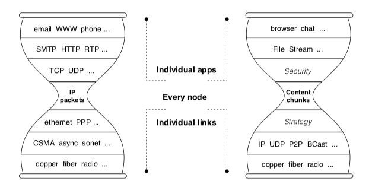
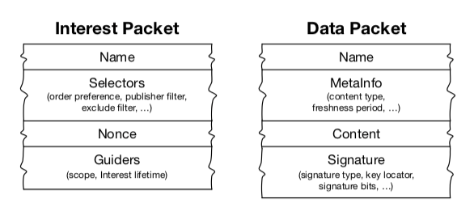
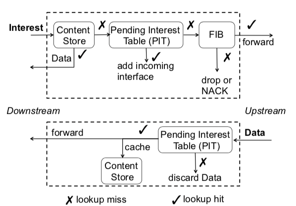

# Named Data Networking
## 抽象
命名数据网络（NDN）是由美国国家科学基金会根据其未来互联网架构计划资助的五个项目之一。 NDN的根源在于早期的项目，内容中心网络（CCN），Van Jacobson 于2006年首次公开展示. NDN项目调查了Jacobson提出的从以主机为中心的网络架构（IP）到以数据为中心的网络的演进的架构（NDN）。 这种概念上简单的转变对我们设计，开发，部署和使用网络和应用程序的方式具有深远的影响。 我们描述了这种新架构的动机和愿景，以及它的基本组件和操作。 我们还提供了其当前设计，开发状态和研究挑战的快照。 有关该项目的更多信息，包括原型实现，出版物和年度报告，可在  `named-data.net` 上获得。
## 1 愿景：一个迷人的新腰部
今天的互联网沙漏架构以一个通用的网络层（即IP）为中心，实现了全球互联所需的最小功能。 这种纤薄的腰部通过允许低层和高层技术独立创新，使互联网的爆炸性增长成为可能。 但是，IP旨在创建一个通信网络，其中数据包仅命名为通信端点。 电子商务，数字媒体，社交网络和智能手机应用的持续增长导致互联网的主要用途是成作为分发网络。 分布网络比通信网络更通用，并且通过点对点通信协议解决分发问题是复杂且容易出错的。

	图1：NDN架构的主要构建块称为内容块，与IP架构的基本通信单元形成对比，后者是由IP地址标识的两个端点之间的端到端通道。

命名数据网络（NDN）项目提出了IP架构的演变，它概括了这个瘦腰的作用，这样数据包可以命名除通信端点之外的对象（图1）。更具体地说，NDN将网络服务的语义从将数据包传送到给定的目标地址转变成以获取由给定名称标识的数据。 NDN数据包中的名称可以命名任何东西，如 
	
- 端点
- 电影
- 书籍中的数据块
- 打开某些灯光的命令等

这个概念上简单的更改允许NDN网络几乎使用所有经过良好测试的互联网工程属性可以解决更广泛的问题，不仅包括端到端通信，还包括内容分发和控制问题。基于对当前互联网架构的优势和局限的三十年经验，该设计还建立了安全原则（通过所有命名数据的签名）和网络流量的自我调节（通过兴趣和数据包之间的流量平衡）。该架构包括随着网络的发展而有助于用户选择和竞争的功能，例如多路径转发和网络内存储。

NDN是一种更为通用的网络研究方向，称为以信息为中心的网络（ICN），其中出现了不同的架构设计[29]。 互联网研究工作组（IRTF）于2012年成立了一个ICN研究工作组。在本文中，我们提供了NDN架构研究项目当前状态的简要（并且必然不完整），其中包括16个NSF在12个校区资助了主要研究人员，并且学术界和工业研究界越来越感兴趣。 最近活动的更完整描述见于第三个年度项目报告[20]和NDN网站（named-data.net）。
## 2 NDN 架构
NDN 中的通信由接收者（即数据消费者）通过交换两种类型的分组来驱动：兴趣和数据。 两种类型的数据包都带有一个名称，用于标识可以在一个数据包中传输的数据。 消费者将所需数据的名称放入兴趣包中并将其发送到网络。 路由器使用此名称将兴趣转发给数据生成者。 一旦兴趣到达具有所请求数据的节点，该节点将返回包含名称和内容的数据包，以及生成者密钥绑定两者的签名（图2）。 该数据包反过来关注兴趣回到请求消费者所采用的路径。

	图2：NDN架构中的数据包

为了执行兴趣和数据包转发功能，每个NDN路由器维护三种数据结构：待定兴趣表（PIT），转发信息库（FIB）和内容存储（CS）（图3），以及转发策略模块（图中未示出），用于确定转发每个兴趣包的时间和位置。 PIT存储路由器已转发但尚未满足的所有兴趣。每个PIT都会记录 Internet 中携带的数据名称及其传入和传出接口。当一个感兴趣的数据包到达时，NDN路由器首先检查内容存储库是否匹配数据;如果存在，则路由器返回Interest所来自的接口上的数据包。否则，路由器在其PIT中查找名称，如果存在匹配条目，它只是在PIT条目中记录此兴趣的传入接口。在没有匹配的PIT条目的情况下，路由器将根据FIB中的信息以及路由器的自适应转发策略将兴趣转发给数据生产者。当路由器从多个下游节点接收相同名称的兴趣时，它仅向数据生成器上游转发第一个。 FIB本身由基于名称前缀的路由协议填充，并且可以为每个前缀具有多个输出接口。

转发策略可以决定在某些情况下放弃兴趣，例如，如果所有上游链路都拥塞或怀疑兴趣是 DoS 攻击的一部分。 对于每个兴趣，转发策略从FIB检索最长前缀匹配条目，并决定转发兴趣的时间和位置.内容存储是路由器已收到的数据包的临时缓存。 由于NDN数据包的有意义与其来源或转发位置无关，因此可以对其进行缓存以满足未来的兴趣。

	图3：NDN节点上的转发过程
	
当数据包到达时，NDN路由器找到匹配的PIT条目，并将数据转发到该PIT条目中列出的所有下游接口。然后它删除该PIT条目，并将数据缓存在内容存储库中。数据包始终采用兴趣的反向路径，并且在没有数据包丢失的情况下，一个兴趣数据包在每个链路上产生一个数据包，从而提供流量平衡。为了获取包含多个数据包的大型内容对象，Interests在控制流量方面提供了类似的角色，就像当今互联网中的TCP ACK一样：由数据使用者控制的细粒度反馈循环（参见第2.1节）。兴趣和数据包都不携带任何主机或接口地址;路由器根据数据包中携带的名称将兴趣包转发给数据生成者，并根据每个跃点的兴趣设置的PIT状态信息将数据包转发给消费者。此感兴趣/数据包交换对称会引发逐跳控制环路（不要与对称路由混淆，或与路由混淆！），并且无需在数据传输中使用任何源节点或目标节点的概念，与IP的端到端数据包传输模型不同。
### 2.1 命名
尽管路由器识别名称中组件之间的边界，但它们对名称没有任何意义，即NDN名称对网络是不透明的。此设计决策允许每个应用程序选择符合其需求的命名方案，因此命名可以独立于网络发展。 NDN设计假定分层结构名称，例如，由UCLA生成的视频可以具有名称 `/ucla/videos/demo.mpg`，其中 `/` 描述文本表示中的名称组件，类似于URL。这种分层结构允许应用程序表示数据元素的上下文和关系。例如，UCLA演示视频版本1的第3段可能被命名为 `/ucla/videos/demo.mpg/1/3`。它还允许名称聚合，例如 `/ucla` 可以对应于发起视频的自治系统。平面名称可以作为特殊情况使用，可能在本地环境中很有用，但是分层命名空间在缩放路由系统和为数据提供必要的上下文方面都是必不可少的。 （即使是平面路由的拥护者也承认平面名称通过引入一些层次来扩展[2]。）

为了检索动态生成的数据，消费者必须能够确定地构建所需数据的名称，而无需事先看到名称或数据。 要么

- （1）确定性算法允许生产者和消费者基于两者可用的信息到达相同的名称
- （2）兴趣选择器结合最长前缀匹配通过一次或多次迭代检索所需数据

到目前为止，我们的经验表明，一组简单的选择器可以支持使用部分已知名称来检索数据。 例如，想要第一个版本的 `demo.mpg` 视频的消费者可以使用兴趣选择器 “最左边的孩子” 请求 `/ucla/videos/demo.mpg/1` 并接收名为 `/ucla/videos/demo.mpg/` 的数据包。 `1/1` 对应第一段。 消费者可以使用由第一数据包显示的信息和发布应用的命名约定的组合来请求稍后的段。

可以全局检索的数据必须具有全局唯一名称，但是用于本地通信的名称可能仅需要本地路由（或本地广播）来查找匹配数据。 各个数据名称在各种范围和上下文中都是有意义的，从“这个房间里的灯开关”到“世界上所有国家名称”。

命名空间管理不是NDN架构的一部分，就像地址空间管理不是IP架构的一部分一样。 但是，命名是NDN应用程序设计中最重要的部分。 命名数据支持内容分发，组播，移动性和延迟容忍网络等功能。

使应用程序开发人员（有时是用户）能够为数据交换设计自己的命名空间有几个好处：增加应用程序数据与网络使用之间的映射关系; 减少二级表示法的需要（记录保持以将应用程序配置映射到网络配置）; 并扩大了开发人员可用的抽象范围
	
我们正在通过实验学习应用程序应如何选择能够促进应用程序开发和网络交付的名称。 在我们开发和完善命名原则和指南时，我们将它们转换为命名约定并在系统库中实现它们以简化未来的应用程序开发（参见[19]，了解当前代码库的预期用途[22]）。 幸运的是，网络名称的不透明性允许架构开发与应用程序开发环境中的命名空间结构和导航研究并行进行。
### 2.2 以数据为中心的安全性
与TCP/IP不同，后者将安全性（或缺乏安全性）的责任留给端点，NDN通过要求数据生产者对每个数据包进行加密签名来保护数据本身[15]。发布者的签名可确保完整性并确保数据证明，从而使消费者对数据的信任与获取的方式和位置分离。它还支持细粒度信任，允许消费者推断公钥主人是否是特定上下文中特定数据的可接受发布者。第二个主要研究重点是设计和开发可用的机制来管理用户信任。我们已经尝试了一种高级别的信任模型，其中密钥命名空间授权使用密钥（承载公钥的数据包实际上是证书，因为它由第三方签名）以签署特定数据[5]，以及信任网，无需预先商定的信任锚即可实现安全通信[36]。

NDN以数据为中心的安全性具有内容访问控制和基础架构安全性的自然应用。 应用程序可以通过加密和分配（数据加密）密钥作为加密的NDN数据来控制对数据的访问，从而将数据安全边界限制在单个应用程序的上下文中。 要求网络路由和控制消息上的签名（如任何其他NDN数据）为保护路由协议提供了坚实的基础，例如欺骗和篡改。 NDN使用多路径转发以及自适应转发策略模块，减轻了前缀劫持，因为路由器可以检测由劫持引起的异常并通过备用路径检索数据[31]。 由于NDN数据包引用内容而不是设备，因此恶意瞄准特定设备更为棘手，尽管需要针对其他NDN特定攻击的缓解机制，例如兴趣泛滥DoS [4]。
### 2.3路由和转发
NDN根据名称路由和转发数据包，消除了IP体系结构中地址引起的三个问题：地址空间耗尽，NAT遍历和地址管理。 由于命名空间是无界的，因此没有地址耗尽问题。 没有NAT遍历问题，因为NDN取消了地址，公共或私有。 最后，本地网络不再需要地址分配和管理。

NDN可以使用传统的路由算法，例如链路状态和距离矢量。 NDN路由器不会宣布IP预修复，而是宣布覆盖路由器愿意服务的数据的名称前缀。 路由协议通过网络传播这些公告，通知每个路由器构建自己的FIB。 传统路由协议（例如OSPF和BGP）可以通过将名称视为不透明组件序列并对兴趣数据包中的名称与FIB表进行组件方式最长前缀匹配来调整路由名称前缀。

每个路由器的PIT状态支持跨NDN的数据平面转发，记录每个待处理的兴趣和传入的接口，并在收到匹配的数据或发生超时后删除兴趣。每个数据包的包状态与IP的无状态数据平面不同。根据FIB和性能测量中的信息，每个路由器中的自适应转发策略模块做出明智的决策：哪些兴趣转发到哪些接口，PIT中允许的多少不满意的兴趣，不同的相对优先级ests，load-balancing多个接口之间的兴趣转发，以及选择备用路径以避免检测到的故障[32,31]。如果路由器确定不能满足兴趣，例如，上游链路断开，FIB中没有转发条目，或者发生极端拥塞，则路由器可以向其发送的下游邻居发送NACK兴趣[31]。这样的NACK可以触发接收路由器将兴趣转发到其他接口以探索备用路径。 PIT状态使路由器能够识别和丢弃循环数据包，允许它们自由地使用多条路径到同一数据生产者。

PIT状态用于其他有价值的目的。 

- 首先，由于它记录了相同数据名称的兴趣所到达的接口集，因此它自然支持多播数据传输。 
- 其次，由于每个兴趣最多检索一个数据包，路由器可以通过控制待处理兴趣的数量来控制流量负载以实现流量平衡。 
- 第三，PIT条目的数量是路由器负载的指示; 限制其大小限制了DDoS攻击的影响。 最后，PIT进入超时提供相对便宜的攻击检测，并且每个PIT条目中的到达接口信息可以支持推回方案。
### 2.4 网内存储
由于每个NDN数据包都带有名称和签名，因此它独立于请求的人或检索的位置是有意义的。 因此，路由器可以在其内容存储库中缓存接收的数据包，并使用它们来满足未来的请求。 内容存储库类似于IP路由器中的缓冲存储器，但是IP路由器在将数据包转发到目的地后不能重用数据包，而NDN路由器可以。 NDN在数据检索方面对存储和网络通道进行相同处理。 对于静态文件，NDN实现了几乎最佳的数据传输。 甚至动态内容也可以在多播（例如，实时电话会议）的情况下从高速缓存中受益，或者在分组丢失之后进行重传。

除了Content Store之外，该架构现在还支持更持久和更大容量的网内存储，称为Repository（简称Repo）。 这种类型的存储可以支持类似于当今的交付网络（CDN）的服务，而无需使用创造性的协议技巧（例如，DNS操作）将它们设计为应用层覆盖，以使它们工作。

缓存命名数据会引起与IP相关的不同隐私问题。 在IP中，可以检查数据包标头和可能的有效负载，以了解谁正在消耗哪些数据。 NDN网络中数据的命名和缓存可以帮助观察所请求的数据，但是如果没有目标地址，则很难确定谁在请求它（除非一个人直接连接到与请求主机相同的子网）。 因此，NDN提供了与当前IP网络完全不同的隐私保护。

一些研究人员特别强调网内缓存是ICN架构的基本增益，例如[10]。 尽管NDN可以支持比TCP/IP更强大的CDN架构，但NDN还提供了许多其他功能（保护数据，流量平衡，有状态数据平面，从而带来了许多收益），这些功能更加重要和重要 好处。	
### 2.5 传输功能
NDN体系结构没有单独的传输层。 它将当今传输协议（解复用，可靠传输和拥塞控制）的功能转移到应用程序，支持库和转发平面的策略模块。 不需要传输层信息，如端口和序列号; 传输所需的所有信息都在数据名称中。 例如，名称 `/ucla/videos/demo.mpg/1/3` 指定转发该名称的兴趣（ `/ucla/` ），哪个应用程序应该接收它们（ `/video/` ）以及任何特定于应用程序的信息 （第1版，第3段）。

当应用程序需要可靠的交付时，应用程序本身或其支持库将监视未完成的兴趣的状态，并在需要时（例如，在超时后）重新发送它们。 NDN的流量平衡要求，以及节点通过限制每一跳的待处理兴趣的数量来控制自己的流量负载的能力，可以在整个网络中提供有效的拥塞控制。 如果发生拥塞丢失，缓存可以减轻影响，因为重传的兴趣可以在数据包丢失之前通过缓存的数据包来满足。 因此，当数据包在其目的地附近丢失并且来自原始源主机的重复重传消耗大部分带宽时，NDN可以避免在当今的因特网中发生的那种拥塞崩溃。
## 3 NDN架构开发
NDN协议规范要求两种基本数据包类型（兴趣和数据）的标准格式以及网络层支持的功能的描述，即新的窄腰。 构建可操作的NDN网络还需要软件库来支持命名，高性能转发和路由，转发策略和信任管理。 与IP的支持组件（地址分配，路由协议，DNS）类似，这些库不是核心架构的一部分，但本质上支持它，并且所有这些都涉及令人畏惧的研究挑战。 本节描述了项目设计和开发架构的应用驱动的实验方法，包括说明其功能和开放式研究挑战的示例。
### 3.1 应用研究
该项目的方法是在NDN上设计和构建各种应用程序，以推动架构及其支持模块的开发和部署，测试原型实现，并鼓励社区使用，实验和反馈到设计中 。应用程序驱动的开发还允许验证、验证NDN的性能和功能优势，例如通过降低复杂性，错误机会以及设计和部署的时间和费用，如何通过名称路由促进复杂分布式应用程序的高效创作。在NDN上设计和开发原型应用程序几年，揭示了应用研究的五个关键领域，这些领域映射到架构的重要特征

- （1）命名空间; 
- （2）信任模型;
- （3）网内存储;
- （4）数据同步;
- （5）会合，发现和引导。

这些挑战在应用程序内部和跨应用程命名空间设计还必须认识到特定于应用程序的数据分发要求与信任相关信息的组织之间的相互作用，以及有效路由/转发所强加的要求。名称发现，引导和移动性支持也存在类似的挑战。这种对应用程序开发的承诺在项目的早期得到了回报：它揭示了持久存储的每个节点存储库和作为应用程序的一般构建块的同步的意外重要性。早期应用程序的一些示例说明了NDN的优势和挑战。
#### 3.1.1 视频流 
最早的NDN应用程序之一是功能视频流应用程序，它展示了基于NDN的媒体传输的实际好处，它本身支持缓存和多播。 NDNVideo [17]通过NDN流式传输实时和预先录制的高清视频，并已通过 UDP 和以太网传输进行测试和演示。 在最近的现场演示中，亚马逊网络服务和NDN测试平台上的1000个客户端从单个NDNVideo发布者消费了视频，中间节点上只有“普通的”NDN转发器[9]。 NDNVideo 应用程序不需要发布者和消费者之间的直接通信，通过NDN使用网络内存储实现与发布者无关的可扩展性。 通过命名空间设计直接支持执行内容的动态组装或视频部分选择的应用程序，即帧级随机访问要求。
#### 3.1.2 实时会议
 ChronoChat [36]多用户文本聊天应用程序提供了一个平台，用于探索可以支持对等（即，没有集中式服务器）聊天服务的数据同步技术。 ChronoChat还推动了非分层信任模型的实验（第3.3节），并开发了基于加密的访问控制的支持库。 结合ChronoChat，NDNVideo的经验以及NDN音频会议工具[37]的早期工作，激发了nd-nrtc的开发，这是一个结合了WebRTC代码库的视频会议应用程序。 该工具将能够调查针对实时通信的拥塞控制，速率适配和播出同步的NDN特定方法。
#### 3.1.3 楼宇自动化系统
企业建筑自动化和管理系统（BAS / BMS）是NDN研究的理想驱动因素，因为精心设计的命名空间和信任模型可以支持传感器的认证控制[7]。迄今为止，最大的NDN应用研究工作之一是与加州大学洛杉矶分校设施管理部门合作，该管理部门运营着一个超过15w点的传感和控制网络，并促进了专用的行业标准的电力需求监测系统的安装。并从现有系统获取NDN研究数据[23]。与多媒体应用相比，BAS / BMS应用程序对数据命名和信任提出了不同的要求。例如，当前基于NDN的BMS设计在三个名称空间中发布数据：一个用于遵循物理构建系统配置的应用程序数据访问，另一个用于设备发现和引导，以及
密钥的信任管理命名空间，体现了主体的机构角色和关系。另一个挑战是探索命名空间和存储设计如何支持来自许多异构传感器和其他设备的数据聚合和挖掘。
#### 3.1.4 车载网络
车载网络是NDN架构提供优势的另一个领域，它可以实现基于位置的内容检索和新的信任模型，以支持特定的机会通信[11]。 车载应用的实现也导致了NDN协议栈本身的更新，包括对其他媒体（例如，3G / LTE，DSRC / WAVE，WiFi，WiMAX）的支持以及对数据管理的网络层支持，其中车载NDN节点缓存通过广播信道听到的数据包，这些数据包在其PIT中没有匹配的未决兴趣，以便稍后将其提供给其他车辆或将其传递给基础设施。
#### 3.1.5 其他应用
可用的NDN软件平台[22]使学生和其他人能够探索基于NDN的分布式文件系统，多用户游戏和网络管理工具。 在接下来的几年中，将继续开展上述应用，以及作为NDN架构研究和开发驱动因素的气候建模和移动健康环境的新探索。
#### 3.1.6 新架构组件：同步
作为尝试构建健壮，高效且真正分布式（即无服务器）对等NDN应用程序的直接结果，该体系结构现在支持称为Sync [35]的新构建块。 使用NDN的基本兴趣：数据交换通信模型，Sync使用命名约定使多方能够同步其数据集。 通过交换单独计算的数据摘要，各方可以快速可靠地了解新数据或缺失数据，然后通过NDN的内置多播传输有效地检索数据。 
### 3.2 NDN路由和转发
NDN转发平面提出了两个主要挑战：转发策略和可扩展转发。 与此同时，项目团队开发了基于NDN的原型路由协议，以支持测试平台上的近期和中期使用，同时还研究NDN自适应转发平面可以实现的更激进的新路由方向。 在一些情况下，路由协议设计揭示了当前软件库中缺少的功能。

#### 3.2.1 转发战略设计
每个节点的转发策略模块是NDN弹性和效率的关键。 通过有效利用NDN的多路径功能，自适应转发策略可以在最佳性能路径上发送消费者兴趣，避免拥塞和故障，平衡路径负载，检测并应对前缀劫持和 DDoS 等攻击[31]。 但是，转发策略设计是一个全新的研究领域，有许多关于如何为不同的环境和设备设计简单有效的策略的开放性问题。
#### 3.2.2 转发引擎设计
转发引擎必须支持线速操作，包括可变长度名称的快速表查找，存储数百万到数十亿个名称的高效数据结构以及快速数据包处理。 项目团队成员提出了一种高度可扩展的转发结构和引擎[34,33]。 仿真原型支持以小于10MB的速度存储的数百万条入口FIB，其FIB查找速度大约为微秒。 此外，思科[26]和阿尔卡特朗讯[27]的工业团队已开发出可行的原型路由器。
#### 3.2.3 路由协议设计
第一个NDN路由协议，旨在快速在测试平台上进行基于名称的转发原型，同时进行更具冒险性的路由研究，是OSPF扩展（OSPFN [28]），定义了一种新型的不透明链路状态广告携带名称前缀和计算基于名称的FIB。但是这种基于IP的路由协议的简单适应正好构成了NDN旨在避免的负担类型，包括管理GRE隧道，管理底层IP地址以及支持多跳转发的黑客攻击，因为OSPF仅支持单路径和等价多路径转发。当前的NDN路由协议是基于NDN的链路状态路由（NLSR）[14]，它使用名称来识别网络，路由器，进程，数据和密钥。 NLSR可以使用任何底层通信信道（例如，以太网，IP隧道，TCP/UDP隧道）来交换路由消息。具体而言，路由器使用兴趣数据包来检索数据包中携带的路由更新，这些数据包由源路由器签名以允许验证真实性。最重要的是，NLSR在每个路由器中创建基于名称的多路径FIB，以支持NDN的转发平面。
设计NLSR协议需要考虑与任何其他NDN应用相同的维度

- 如何命名路由器，链路，路由更新等;
- 如何分配加密密钥以及如何获得对这些密钥的信任;
- 路由更新传播，这需要拉动而不是（OSPF）推动更新;
- 如何为每个名称前缀生成和排序多个next-hop以促进NDN的多径转发

#### 3.2.4 探索新的路由范例
今天的IP路由架构需要在路由器检测和路由故障时传播拓扑和策略信息，路由计算以及有时延长的收敛时间。在NDN中，转发平面本身执行快速故障检测和恢复，减少了路由到引导转发和传播长期拓扑或策略信息的作用[30]。这种解耦允许研究在IP网络中不可能的更激进，可扩展的路由方法。例如，NLSR现在支持一种双曲线路由[16,6]，它通过在链路状态通告中传播超椭圆坐标。 AS级别的Internet拓扑结构是一个无标度，强聚类的小世界[18]，它与拓扑结构中潜在空间的超椭圆几何结构有深层联系[16]。假设路由器拓扑和名称空间具有双曲线结构，我们可以使用每个名称前缀的双曲线坐标以及邻居的坐标来使用贪婪转发计算下一跳 

- 每个路由器将兴趣包转发给它的邻居 
- 最接近目的地名称的bor路由器

将NDN上的双曲线路由的性能与链路状态路由协议进行比较正在进行中.其他可能的路由方法，例如小世界，伪电位梯度和流行渗透，可能值得探索NDN。
### 3.3 信托管理
为了验证数据包的签名，应用程序可以获取在数据包的密钥位置字段中标识的相应密钥，就像任何其他内容一样。 但是信任管理，即如何确定给定应用中特定分组的给定密钥的真实性，是主要的研究挑战。 与实验方法一致，NDN信任管理研究由应用程序开发和使用驱动：首先解决特定问题，然后确定常见模式。

例如，NLSR的安全需求需要开发一个简单的分层信任模型，其中密钥的发布名称反映了它们的信任关系。根密钥由网络域管理员拥有，根目录下方是站点密钥，每个站点密钥由单个站点的管理员拥有，由根密钥签名并发布在层次结构的下一级。然后每个站点密钥对站点的操作员密钥进行签名，操作员密钥又签署路由器密钥，路由器密钥又在该路由器上签署NLSR进程的密钥。最后，NLSR密钥签署由NLSR发起的路由数据。在该信任模型中，命名空间匹配信任委托的层次结构，即（概念上）
	
	/root
		/site
			/operator
					/router
							/process
在层次结构中发布具有特定名称的密钥授权它们对特定数据包进行签名并限制其范围。现实世界信任倾向于遵循分层模式的其他应用，例如在我们的建筑管理系统（BMS）[23]中，可以使用两个单独的层次结构来构建运算符和应用数据，以便于对谁拥有精细控制访问哪些数据。更加灵活和富有表现力的信任关系，例如我们的聊天应用[36]，激发了信任网模型的实验。当前的聊天室参与者可以通过签署新手的密钥向他人介绍新人。未来的应用程序将实现交叉认证模型（SDSI）[13,3]，它提供更多的验证冗余，允许数据和密钥名称独立，更容易适应各种现实世界的信任关系。
## 4 NDN社区和部署
新架构的成功需要广泛的社区参与和吸收。 NDN已经获得了动力，学术界和工业界都参与其中。 但是，激励增量部署需要证明NDN可以解决基于TCP/IP的解决方案存在问题或根本不存在的实际问题。 NDN团队还维护着NDN协议栈的开源实现，模拟器和测试平台，以促进测试和更广泛的社区参与。

与IP一样，NDN是一种通用覆盖：NDN可以运行任何可以转发数据报的东西（以太网，WiFi，蓝牙，蜂窝，IP，TCP等），任何东西都可以在NDN上运行，包括IP。 NDN可以简单地运行它，而不是尝试替换或更改已部署的IP基础架构。 NDN还可以利用互联网经过充分测试的工程解决方案，这些解决方案需要数十年的时间才能发展，例如用于命名和路由的传统，策略和管理实践。 因此，NDN在内容分发，应用友好的通信和命名，强大的安全性，对移动性和广播的支持方面的优势可以逐步且相对轻松地实现。
### 4.1 企业应用程序（例如，自动化楼宇控制）
基于NDN的解决方案可以通过本地部署带来直接价值。 诸如无服务器的聊天室之类的广域应用可以在IP隧道上运行。 在部署基于NDN的应用程序时，我们设想出现了NDN节点的孤岛，使用集合解决方案通过非NDN云上的隧道进行互连。 一旦NDN应用获得广泛接收，NDN路由器的ISP部署将提高自身及其客户的性能和效率，为基础设施增长提供自然激励。 IP体系结构在其自身的部署历史中提供了类似的重叠功能和增量效益激励
### 4.2 开源软件支持
可自由使用的软件库和工具对于可扩展的NDN架构的推出至关重要。 NDN项目最初使用PARC的开源软件包CCNx [8]作为其代码库。为了提供更灵活的研究开发平台，2013年，NDN团队推出了CCNx版本，并于2014年初从头开始实施了一个新的NDN转发器NFD [21]。 NFD支持新开发的NDN数据包格式，并具有模块化和可扩展性，以便于进行各种实验。 NDN平台软件的发布[22]包括支持的关键组件包，用于构建和测试NDN网络和应用程序。在流行且易于使用的语言（如Python和Javascript）中提供NDN支持，进一步促进了社区中的开发活动[24]。该团队计划继续开发和支持NDN代码库，包括通过NDN进行Web风格内容发布的浏览器内支持，以帮助NDN项目以及更广泛的社区编写创新的实验性NDN应用程序.

项目团队还维护着一个基于NS-3的开源模拟器ndnSIM [1]，该模拟器提供了一个通用平台，可帮助研究人员评估大型网络中NDN系统性能的各个方面。 ndnSIM邮件列表主办了来自十几个国家的100多名成员对ndnSIM使用和开发的积极讨论
### 4.3 运营NDN测试平台
我们对网络研究和开发的实验方法至关重要，是评估应用程序和核心架构组件的大型测试平台。 在项目的第一年，NDN团队在华盛顿大学建立并配备了一个本地测试平台，配备可编程路由器和连接所有参与NSF资助的NDN项目的机构的广域覆盖测试平台。 本地测试平台支持NDN原型实现的基线评估，广域测试平台支持NDN组件的测试，包括视频流，会议工具和路由协议。 监控脚本和可视化工具有助于测试平台管理。 虽然NDN团队鼓励研究人员创建自己的测试平台，但它也接受来自外部站点的请求以连接到NDN项目testbed9。
## 5 开放式问题
Ververidis等。 [29]提供了对许多现有ICN项目的调查，并确定了社区中的几个重要辩论，最明显的是与可扩展信任管理和命名本身的策略相关。

与其他ICN设计一样，NDN通过使用加密技术实现数据真实性，机密性和完整性。 密钥用于通过签名将名称绑定到数据，并通过加密保护数据（或名称）。 由于这些密钥本身就是命名数据，因此可以利用NDN架构的所有功能来解决密钥管理的常见挑战，例如分发和撤销; 这是一个活跃的研究领域。 高性能加密算法的开发和集成也是必不可少的。 然而，最重要的挑战是健壮且可用的信任管理，其允许内容消费者在给定上下文中确定可接受的签名密钥。

此外，大多数提议的ICN体系结构依赖于自我认证的名称，这使得任何节点都能够验证数据包中的名称是否与其内容匹配。但是，自我认证名称要求每个应用程序必须确定内容是否符合要求，如果使用对应用程序名称的辅助绑定，则会产生额外的安全风险。 NDN提供了一种不同的方法，直接从应用程序获取每个数据包的数据名称，然后将这些名称安全地绑定到内容。因此，命名空间设计是一个重要的研究领域，因为它将应用程序的数据，通信和存储模型的考虑因素与NDN中名称的路由和安全含义结合在一起。除了基于这些名称的可扩展转发之外，NDN研究的一个重要挑战是为当前和预想的应用程序体系结构开发和评估命名空间和相关协议设计，并找到可应用于常见用例的可重用方法。

最后，我们正在与社会科学家合作，探索NDN的社会影响，特别是与当今TCP/IP架构形成鲜明对比的四个方面：支持语义分类，出处，出版和分散沟通。我们相信这些功能将增加言论自由，安全性，隐私性和匿名性的机会，同时在数据保留和内容监管方面提出新的挑战[25]。

## 6 期待
NDN研究的应用驱动的实验方法已经取得了进展，并为NDN的原始愿景提供了新的深度[15]。但该团队仅涉及名称空间结构和导航，信任模型和管理机制，可扩展转发和路由，转发策略设计，分布式数据同步以及会合，发现和引导等方面的研究。我们为一组试验性NDN应用提供了合理的命名方法，并对剩余的挑战有了更清晰的了解。我们实现了一种支持传统链路状态和双曲线路由的NDN路由协议。我们为Sync绘制了一种初始设计方法，这是一种支持跨集合同步数据的新型传输方式。同步填补了NDN网络层简单兴趣数据交换与分布式应用程序同步数据集之间的差距。

幸运的是，正如学术研讨会和会议活动的增长所表明的那样，世界各地正在进行与NDN密切配合的其他研究工作。 NDN团队已采取措施，希望将更广泛的社区参与带入项目的下一阶段。特别是，NDN网站发布常规软件更新，测试平台文档，技术和年度报告，常见问题解答和博客条目，并为对技术讨论感兴趣的用户存档公共ndn-interest邮件列表。
## 参考
- [“A New Way to Look at Networking”](https://www.youtube.com/watch?v=oCZMoY3q2uM)
- [icnrg]( http://trac.tools.ietf.org/group/irtf/trac/wiki/icnrg)
- [ndnsim](http://www.lists.cs.ucla.edu/mailman/listinfo/ndnsim)
- [ndnmap](http://ndnmap.arl.wustl.edu/)
- [testbed](http://named-data.net/ndn-testbed/)

