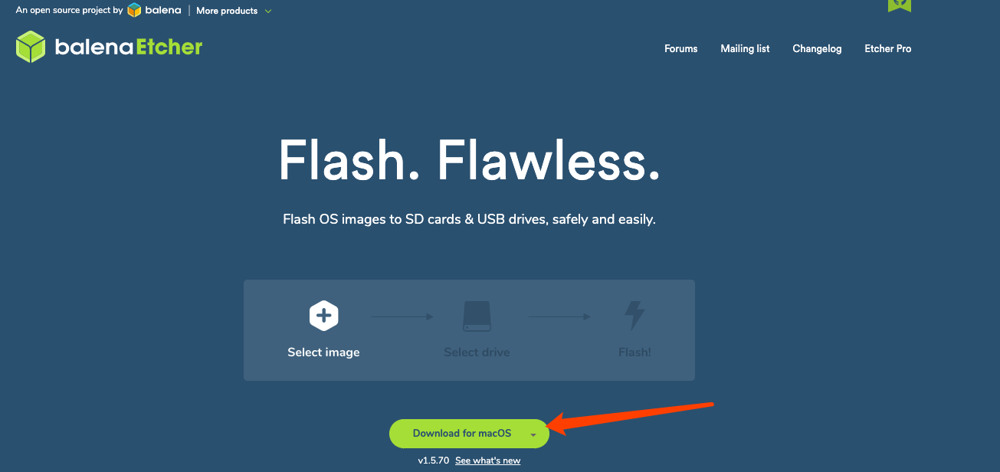

# 树莓派安装树莓系统
## 准备工作
### 物理设备购买
- [树莓派套装](https://item.m.jd.com/product/55733253261.html?wxa_abtest=a&utm_user=plusmember&ad_od=share&utm_source=androidapp&utm_medium=appshare&utm_campaign=t_335139774&utm_term=Wxfriends)

	注意这里是我们购买并且测试过的地址，不是广告。这里特别需要注意的是树莓派本身只是一块板子，想跑起来还需要购买各种零件，比如套装中国所需的东西。
	
	- 保护壳
	- 散热风扇
	- hdmi 转 mini hdmi
	- type c usb 电源(注意 3A 以上)，这点很重要
- [ssd](https://item.m.jd.com/product/6164595.html)
- [ssd链接线](https://item.m.jd.com/product/1678865.html)
- [sd 读卡器](https://item.m.jd.com/product/100003803875.html?wxa_abtest=a&utm_user=plusmember&ad_od=share&utm_source=androidapp&utm_medium=appshare&utm_campaign=t_335139774&utm_term=Wxfriends)
- [mini-sd 卡](https://item.m.jd.com/product/100003467417.html?wxa_abtest=a&utm_user=plusmember&ad_od=share&utm_source=androidapp&utm_medium=appshare&utm_campaign=t_335139774&utm_term=Wxfriends)
- 网线
- 4口以上无线交换机/路由器

## 安装系统
- 下载镜像文件

	[下载源页面](https://www.raspberrypi.org/downloads/raspbian/)，找到 [Raspbian Buster Lite](https://downloads.raspberrypi.org/raspbian_lite_latest)进行下载。注意验证对应的 sha256
- 烧录镜像到 sd 卡
	- 从[烧录软件网站](https://www.balena.io/etcher/)最新版本的balenaEtcher ,注意操作系统版本
	
		
	- 插入读卡器和对应的 sd 卡
	- 打开 balenEtcher 
		- 选择镜像文件，支持 `.zip` 或者 `.img`
		- 选择烧录的设备(sd卡)
		- 点击继续，注意如果是 mac 需要输入系统密码来打开对硬件操作权限
		- 点击 Flash 开始烧录
- 调试操作系统
	- 将树莓派准备好，包括连接键盘等 
	- 将 sd 卡插入，并启动电源
	- 输入用户名密码
		- 默认的用户名: pi
		- 默认的密码是: raspberry
	- 设置网络(这里设置dhcp)
	
			# sudo su -
			# vi /etc/network/interfaces
				.....
				
				auto lo
				iface lo inet loopback
			
				auto eth0
				iface eth0 inet dhcp
			
			# reboot			
	- 设置 ssh

			# sudo systemctl enable ssh
			# sudo systemctl start ssh
			# reboot		
	- 测试 ssh

			ssh pi@192.168.0.101
	- 挂载硬盘
		- 插上 usb 磁盘 
		- 格式化
				
				mkfs.ext4 /dev/sda1
				mkfs.ext4 /dev/sda2
		- 创建挂载目录

				mkdir /data
		- 查看 ssd 挂载设备

				fdisk -l
		- 挂载

				mount /dev/sda2 /data
		- 查询设备 uuid

				# ls -l /dev/disk/by-partuuid/
				total 0
				lrwxrwxrwx 1 root root 15 Dec 25 16:20 6c586e13-01 -> ../../mmcblk0p1
				lrwxrwxrwx 1 root root 15 Dec 25 16:20 6c586e13-02 -> ../../mmcblk0p2
				lrwxrwxrwx 1 root root 10 Dec 25 16:20 7b4e3985-01 -> ../../sda1
				lrwxrwxrwx 1 root root 10 Dec 25 16:20 7b4e3985-02 -> ../../sda2
		- 设置自动挂载

				# vim /etc/fstab
		
				proc            /proc           proc    defaults          0       0
				PARTUUID=6c586e13-01  /boot           vfat    defaults          0       2
				PARTUUID=6c586e13-02  /               ext4    defaults,noatime  0       1
				PARTUUID=7b4e3985-01  /aos            ext4    defaults,noatime  0       0
				PARTUUID=7b4e3985-02  /data           ext4    defaults,noatime  0       0
				# mount -a
				# df -h			 
	- 设置时区

			rm /etc/localtime
			ln -s /usr/share/zoneinfo/Asia/Shanghai /etc/localtime
	- 设置 `ll` 别名

			echo "alias ll='ls -l'" >> ~/.profile
			. ~/.profile
	- 最终重启验证

			# sudo su -
			# reboot
	- docker 安装
	
			# 设置源
			curl -fsSL https://download.docker.com/linux/debian/gpg | sudo apt-key add -
			echo 'deb https://download.docker.com/linux/debian stretch stable' > /etc/apt/sources.list.d/docker.list
			
			# 升级源
			apt update
		
			# 安装
			apt install docker-ce docker-compose=1.25.0-1
		
			service docker stop
			mv /var/lib/docker /data/lib/
			ln -s /data/lib/docker /var/lib/docker
			ls -l /var/lib/docker
			service docker start
			sudo systemctl enable docker
			docker ps
			
## 修复无法启动
因为挂载误操作或者断电重启等，可能会损坏 sd 卡里的数据。我这边操作是因为修改 `/etc/fstab` 重启后，Pi根本无法启动。

- 故障问题 

	启动完毕报错 `"Cannot open access to console, the root account is locked." `
- 修复方法
	1. 关机，从 Pi 上取回 SD 卡，然后用适配器将卡安装电脑
	2. 能够看到 SD 卡的 `/boot`分区
	3. 找到文件 `cmdline.txt` ，并在该行的末尾添加以下内容。`init=/bin/sh`
	4. 将 SD 卡加载回 Pi 并启动
	5. Pi 启动将获得 `root shell` 提示符
	6. 树莓派SD卡将有两个主分区，因为我们无法直接读取分区表，因此您必须手动为根分区和引导分区找到设备。

			mount -o remount,rw /dev/mmcblk0p2 /
	7. 修改 `/etc/fstab` 错误的设置
	8. 关机再操作 1.2.3 步骤，删除 `init=/bin/sh`

## 参考
- [Installing operating system images](https://www.raspberrypi.org/documentation/installation/installing-images/README.md)
- [解决 树莓派 Pi账户 emergency mode cannot open access 问题](https://www.jianshu.com/p/be699b3e8be2)		