# 2023 年 ChatGPT 网页抓取：提示与应用
像 [ChatGPT](https://research.aimultiple.com/chatgpt/) 这样的预训练[语言模型](https://research.aimultiple.com/large-language-models/)可以理解自然语言并生成类似人类的响应，这使它们成为对公司有吸引力的选择。《福布斯》报道称，Meta、Canva 和 Shopify 等公司已经在其客户服务聊天机器人系统中使用了支持 ChatGPT 的技术。[1](https://research.aimultiple.com/chatgpt-web-scraping/#easy-footnote-bottom-1-65145)

关于使用 ChatGPT 进行[网页抓取](https://research.aimultiple.com/web-scraping/)也有类似的讨论。ChatGPT 等先进的自然语言处理模型可以显着[提高网络抓取过程的效率和有效性](https://research.aimultiple.com/web-scraping-best-practices/)。

在本文中，我们将讨论 ChatGPT 如何在网络抓取中使用。我们将讨论各种用例，将网络抓取和 ChatGPT 相结合可以释放新的机会并简化流程。
## 如何使用 ChatGPT 抓取网站
在本教程中，我们将使用 [ChatGPT-4 从电子商务网站提取产品数据](https://research.aimultiple.com/amazon-scraping/)。
### 使用 ChatGPT 抓取亚马逊网页
- 例如，我们将定位游戏鼠标的亚马逊产品页面。
	- 目标网页包含产品详细信息，例如标题、图像、评级和价格。

如果您使用 “从本网站抓取产品价格信息：[粘贴网址]”之类的提示，则不会抓取数据。相反，它会指示您编写代码以从目标网站提取数据（图1）。

图1：显示 ChatGPT 如何指导您编写提取数据的代码。

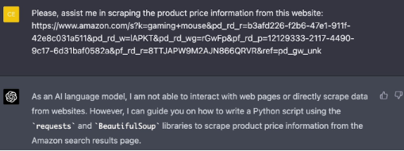

我们的目标是提取所提供图像中显示的产品标题（图 2）。

图 2：识别目标网页上所需的数据以进行网页抓取

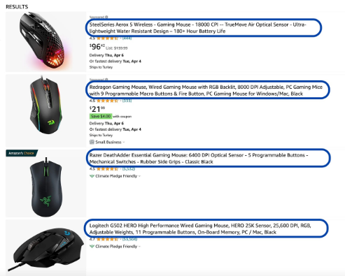

-  第1步

	我们必须首先检查网页的结构。要检查元素，请右键单击感兴趣的任何元素，然后从上下文菜单中选择“检查”选项。这将使我们能够分析 HTML 代码并找到网页抓取所需的数据。
- 第2步
	
	然后我们需要识别所需的数据及其属性。与我们要在下图中提取的数据相对应的 HTML 元素（图 3）。该元素有一个 “class” 属性，我们将在网络抓取库中使用该属性。

	图 3：演示如何检查网页中所需的数据和属性

	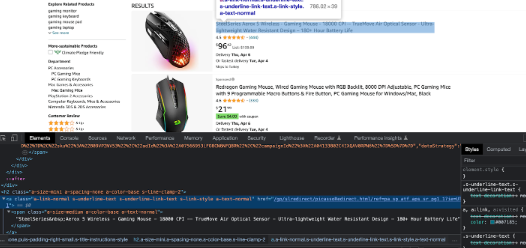

	您可以通过检查目标网页的来源来识别网页抓取所需的数据及其属性。

	确定要抓取的目标元素及其属性非常重要。这有助于 ChatGPT 了解我们需要哪些信息以及如何在目标网站上找到它。
- 第3步

	我们用来从亚马逊搜索结果页面抓取产品标题的提示：

	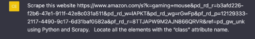
	
	ChatGPT生成的用于数据提取的代码：

	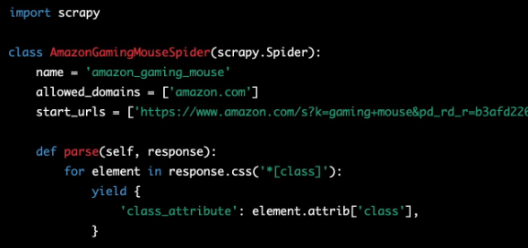

## ChatGPT 在网页抓取中的应用
### 1. 生成抓取网站的代码
像 ChatGPT 这样的语言模型可以帮助开发人员用他们喜欢的[编程语言](https://research.aimultiple.com/web-scraping-programming-languages/)和[库](https://research.aimultiple.com/python-web-scraping-libraries/)生成代码片段，以执行网络抓取任务。

请记住，[网站的结构和设计可能会发生变化](https://research.aimultiple.com/web-scraping-dynamic-content/)，这可能会影响您所定位的 HTML 元素和属性。在这种情况下，您的代码可能无法正常运行或无法提取所需的数据。您需要定期监控和更新您的抓取代码。

例如，您可以使用下面的提示从特定的亚马逊产品页面提取产品描述数据。

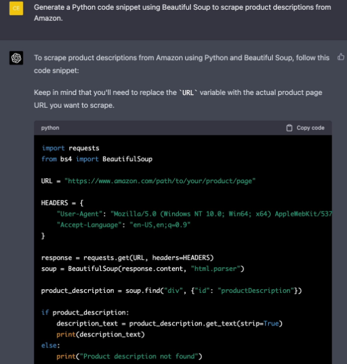
	
一个值得注意的是，大多数网站都采用[反抓取措施](https://research.aimultiple.com/web-scraping-challenges/)来防止网络抓取活动。您必须确保您的网[络抓取行为符合道德标准](https://research.aimultiple.com/web-scraping-best-practices/)。在抓取任何数据之前，请检查网站的服务条款或 robots.txt 文件。

#### [Sponsored](https://brightdata.com/)
您可以将解锁技术与网络爬虫集成，以增强您的网络抓取项目。Bright Data 的 [Web Unlocker](https://get.brightdata.com/web-unlocker1382?sid=chatgpt-web-scraping) 使企业和个人能够以[道德和合法](https://research.aimultiple.com/web-scraping-ethics/)的方式从网络来源收集数据，同时避免反抓取措施。

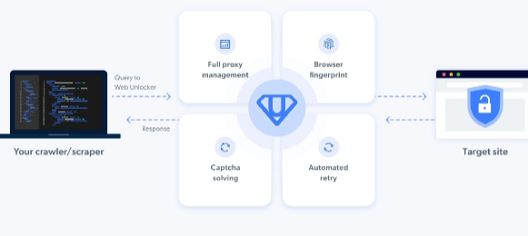

如果你打算大规模收集数据，你需要以真实用户的身份出现，以避免被识别和屏蔽。[Oxylabs Web Unblocker](https://oxylabs.go2cloud.org/aff_c?offer_id=7&aff_id=845&url_id=14) 允许用户绕过先进的反抓取措施并大规模收集数据。它提供类似代理的集成，并使用无头浏览器抓取大量 JavaScript 网站。

#### 1.1 提供 Python 指令进行网页抓取
ChatGPT 提供了使用各种编程语言从网络源抓取数据的分步说明。在此示例中，我们将使用 requests 库来获取网页内容，并使用 Beautiful Soup 来解析和检索所需的数据。

1. ChatGPT 提供了安装所需库的命令。您可以运行以下代码在 python 中安装库。

		pip install requests
		pip install beautifulsoup4
2. 您可以使用 ChatGPT 生成的 Python 代码导入请求和 Beautiful Soup。

		import requests
		from bs4 import BeautifulSoup
- requests 库允许您获取目标网页的内容。您可以使用 requests 库将 HTTP 请求发送到目标服务器并处理响应。要获取产品页面的内容，请在终端中键入以下命令，并将 `https://example.com/product-page` 替换为目标网页 URL

		def fetch_webpage(url):
			response = requests.get(url)
		
			if response.status_code == 200:
				return response.text
			else:
				print(f"Error {response.status_code}: Unable to fetch the webpage")
				return None
			
		url = "https://example.com/product-page"
		page_content = fetch_webpage(url)

- 获取网页内容后，需要解析获取的数据以提取所需的数据。使用 Beautiful Soup 库解析获取的数据：

		soup = BeautifulSoup(page_content, `html.parser`)
	如果您抓取电子商务网站来提取产品数据（例如产品标题），则必须检查产品页面以找到与数据相对应的必要标签和属性。
- 要保存或打印抓取的数据，请输入 ChatGPT 生成的代码：

		print(f"product Title: [product_title]")
		print(f"product Price: [product_price]")
		print(f"Product Description: [product_description3")

### 2. 清理提取的数据
抓取数据后，必须清理文本以删除不相关的元素和停用词，例如“the”、“and”等。ChatGPT 可以提供有关清理和格式化收集的数据的指导和建议。

假设您收集了大量数据并将其导入到 Excel 中。然而，您意识到数据是杂乱无章的。

例如，fullname 位于 B 列中，您希望将名字和姓氏分成两个不同的列。您可以请求 ChatGPT 提供用于分隔名字和姓氏的公式。

ChatGPT 生成的提取名字的公式：

	=LEFT(B1，SEARCH(""，B1) - 1)
ChatGPT 生成的用于提取姓氏的公式：

	RIGHT(B1，LEN(B1) - SEARCH(""，B1))

### 3. 处理提取的数据
- 3.1 进行情感分析

	ChatGPT 可以对抓取的数据执行情感分析，从非结构化文本数据生成可解释的见解。假设您从社交媒体平台上抓取了对您品牌的社交提及，以分析您的受众增长情况。获取数据并清理收集的数据后，您可以指示 ChatGPT 分析文本数据并将其标记为负面、中性或正面（图 4）。

	图 4：演示分析和标记示例文本文档的过程
	
	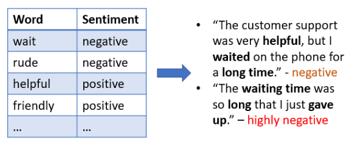
	
	以下是如何指示 ChatGPT 执行情绪分析的示例：
	
		“Analyze the sentiment of the text: ‘The battery life is also long’.”
	ChatGPT 对我们查询的回复：
	
	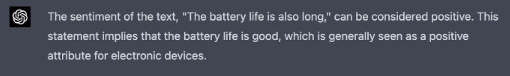
	
	请注意，情感分析的准确性可能会因不同因素而异，例如文本的复杂性和上下文相关的错误。
- 3.2 对抓取的内容进行分类

	ChatGPT 可以帮助将抓取的数据分类为预定义的类别。您可以定义要将内容分类到的类别。以下是使用 ChatGPT 对内容进行分类的示例：

	例如，我们要对以下内容进行分类：

	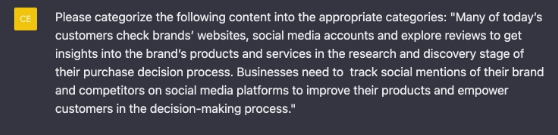

	以下是使用 ChatGPT 对抓取的数据进行分类的输出：
	
	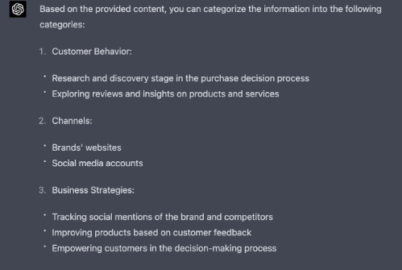
	
	
## 参考
[ChatGPT Web Scraping in 2023: Tips & Applications](https://research.aimultiple.com/chatgpt-web-scraping/)	