# RSS 移动端
## 首页

## 点击 get started now 后
### 第一部分-feed 生成器
#### 搜索操作
- 搜索输入 `openai`
	
	
- 点击生成，进入 load 页面

	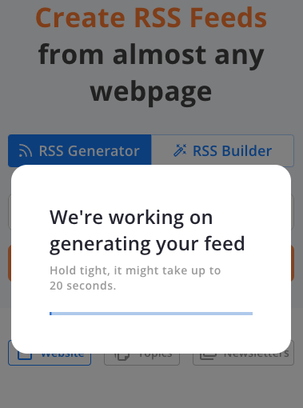

#### 生成预览信息
- 概述
	
	
	
	- 你的 feed 已经创建(不知道GC 规则)	
		
		 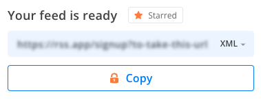
	- 预览信息
		- 预览信息列表
	
			
			
			- 排序
				- 默认时间倒序
			- 新闻条目
				- 标题
				- 照片
				- 概述
				- 新闻源
				- 时间
	- 设置
	
		 
		
		- 设置查询条件
			- 设置
				- 使用全局设置(全局设置更改需要付费用户)
				- feed 设置
					- 最多展示多少 post 
						- 免费 5 条
						- 可见不能加
					- 是否需要翻译
						- 可以选择翻译
					- 是否插入图像到信息中
						-  媒体图像
						-  附件图像
					- 标题长度设置
						-  标题长度 100
					- 描述限制
						- 描述中是否启用多媒体
							- 图像
							- 视频
						- 描述字符限制
							- 200	   	
			- 编辑 feed 展示信息

			 	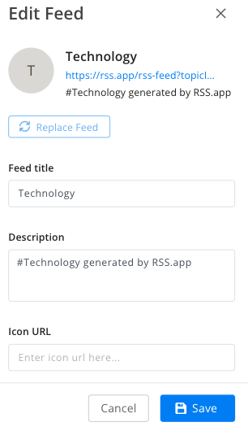
		- 设置通知方法
		- 删除本源
- 部件

	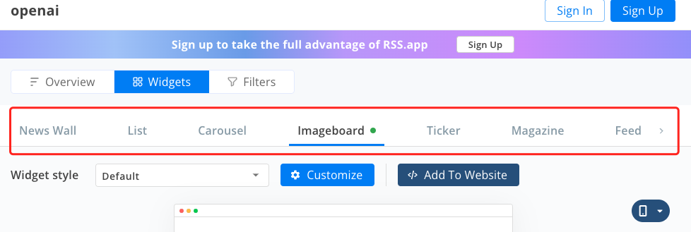 
	
	- 设置嵌入式页面效果，分
		- 新闻墙
		- 列表
		- 薄片
		- 图片版
		- 新闻条-tiker
		- 杂志
		- feed
		
		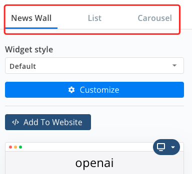 
	
	- 新闻墙	
		- 还可以定义页面样式
	
			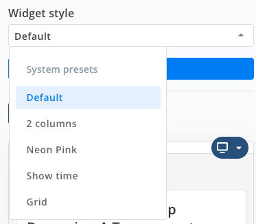 
		- 样式匹配设置
	
			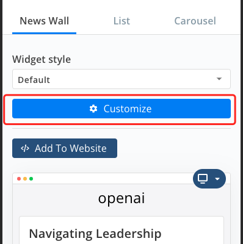 
			
			- 电脑
			
				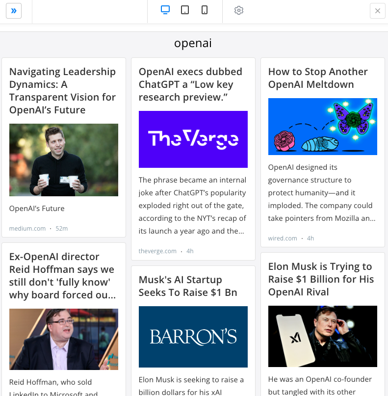 
			- 平板
	
				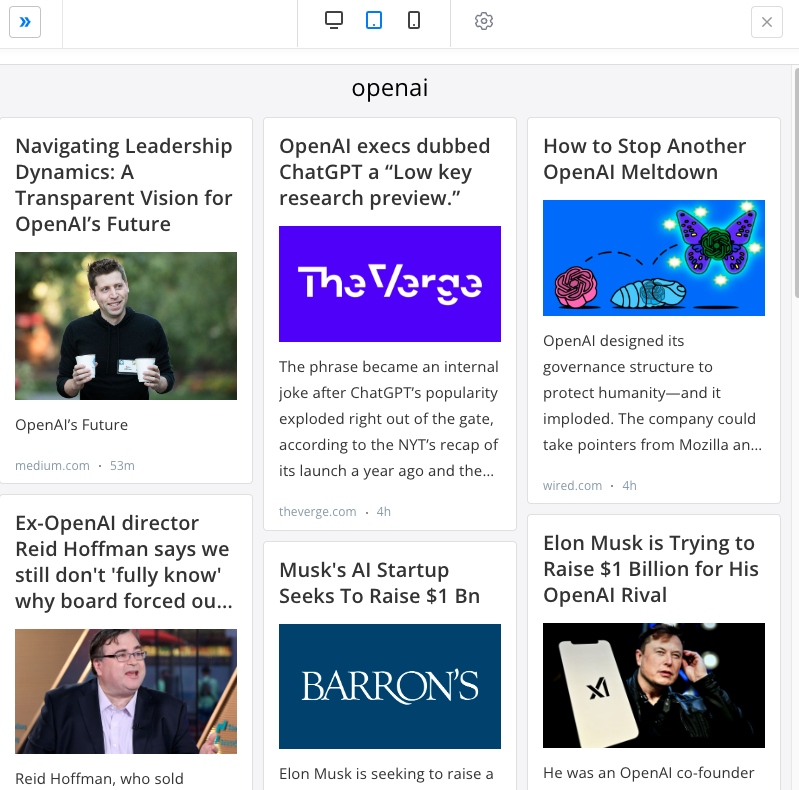 	 
			- 手机
	
				 	
		- 高级样式设置
				
			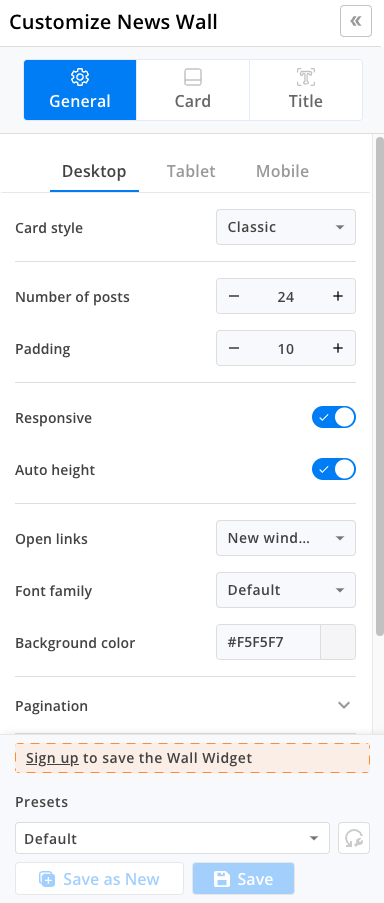 	
		- 嵌入语言支持
	
			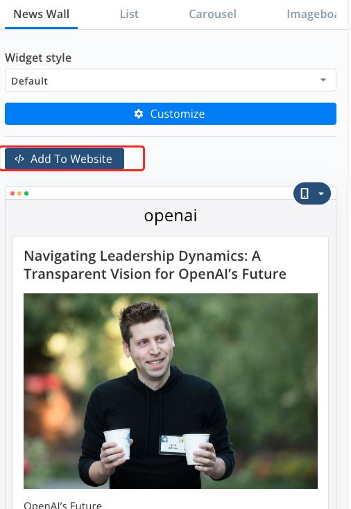 
			
			- js
	
				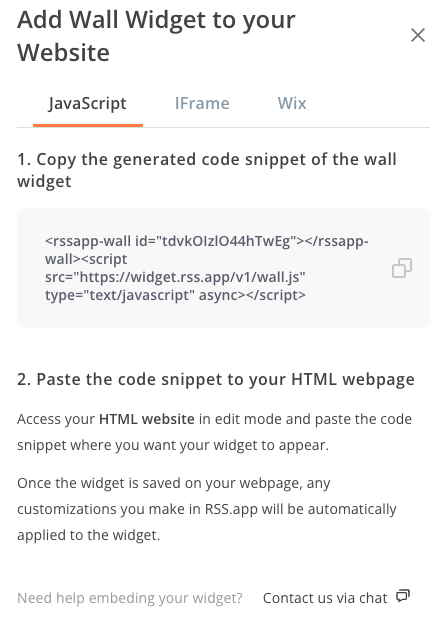 
			- iframe
	
				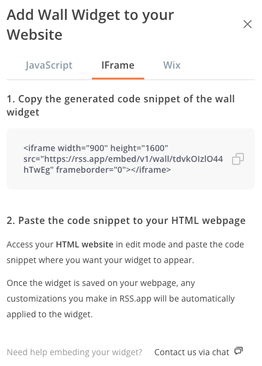 
			- wix
	
				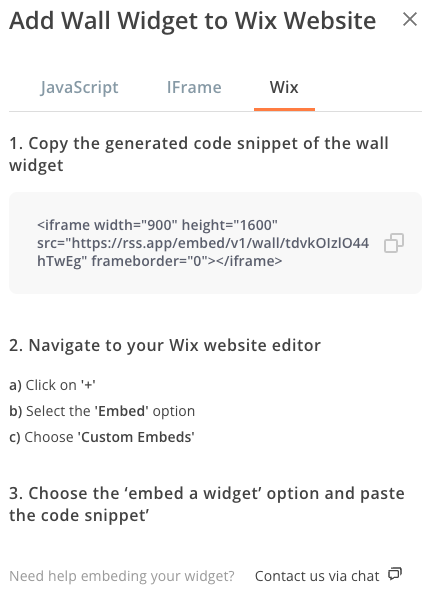 
		- 排版效果
		
			 
	- 列表
		
		处理排版效果外，其他都相同
		
		 
	- 薄片

		处理排版效果外，其他都相同，效果左右自动翻动
		
		 
	- 图片展板

		处理排版效果外，其他都相同
		
		 
	- 新闻条-tiker

		处理排版效果外，其他都相同	
			
		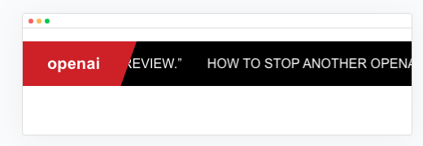 
	- 杂志

		处理排版效果外，其他都相同	
		
		 
	- feed

		处理排版效果外，其他都相同	
		
		 
- 过滤器

	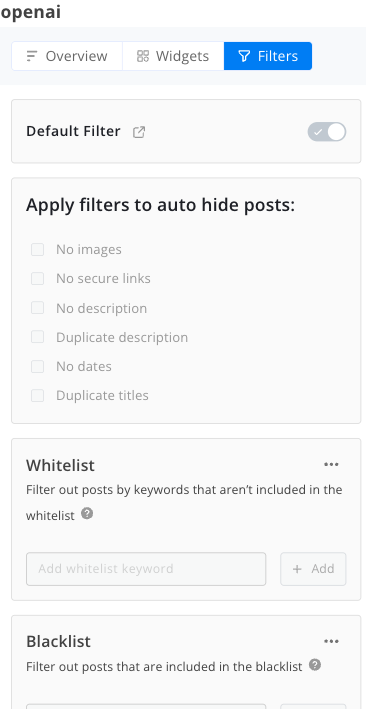 
	
	- 隐藏对象

		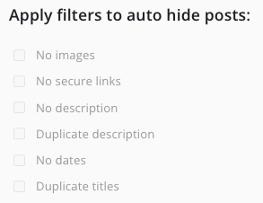 
	- 关键词白名单

		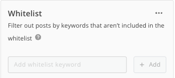 
	- 关键词黑名单

		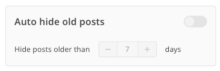 
	- 自动隐藏老信息(默认7天未开放)

		 
	- 替换和移除文本

		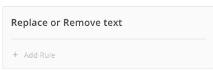 
	- 操作(重置规则，清空 feed cache) 

		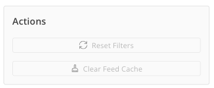 

### 第一部分-RSS 构建器
 根据自己需求，构建自己输入网站页面爬去数据，并格式化 feed
 
 

### 第二部分
选择已有 feed，分3种方法

- 单源搜索
	- 筛选
		- 根据 feed 类型筛选
	
			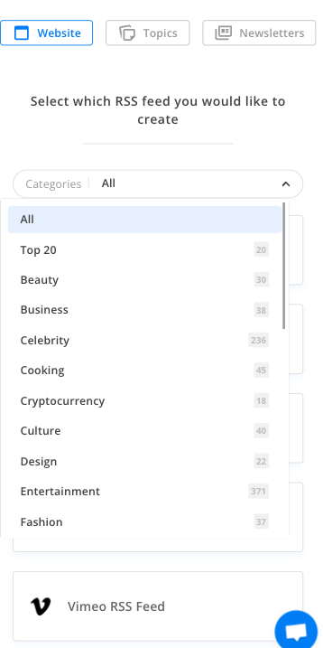 
		- 不加类型就是全 feed 筛选
	
			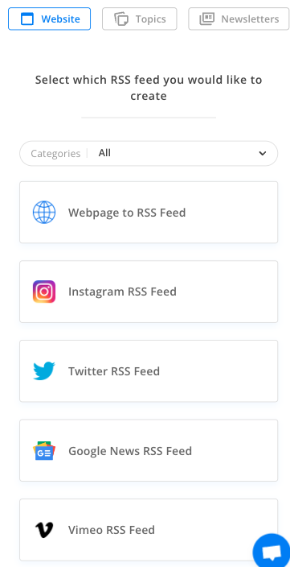 
	- 具体某源选筛选 feed
		- 根据 url 获取数据

			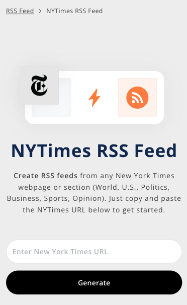 
		- 根据选择获取数据

			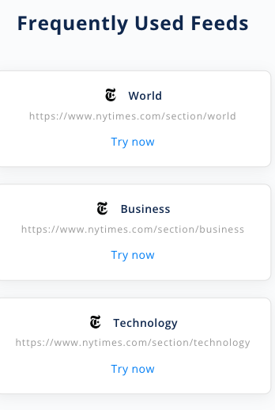 
		- 推荐其他源

			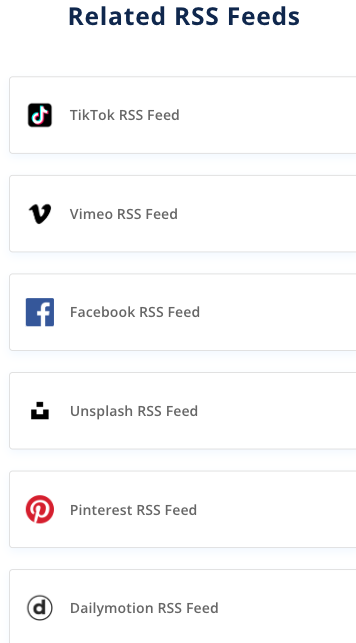 	
- feed 热门搜索 top

	根据不同领域搜索的明词排序，比如生意、名人等

	 
- 通讯(功能还未出)

	 

## 问题
- 条件卡顿

	热门条件搜索也会卡顿，比如马斯克，卡顿几分钟
	
	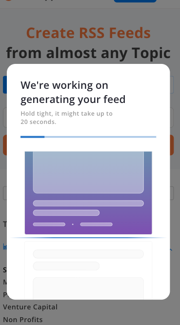 		
				
			
		
						
				

						

									
					
			
			
			
		
			
				
		
