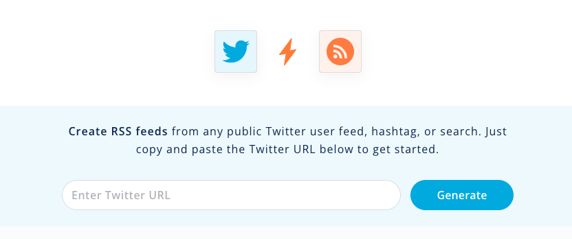
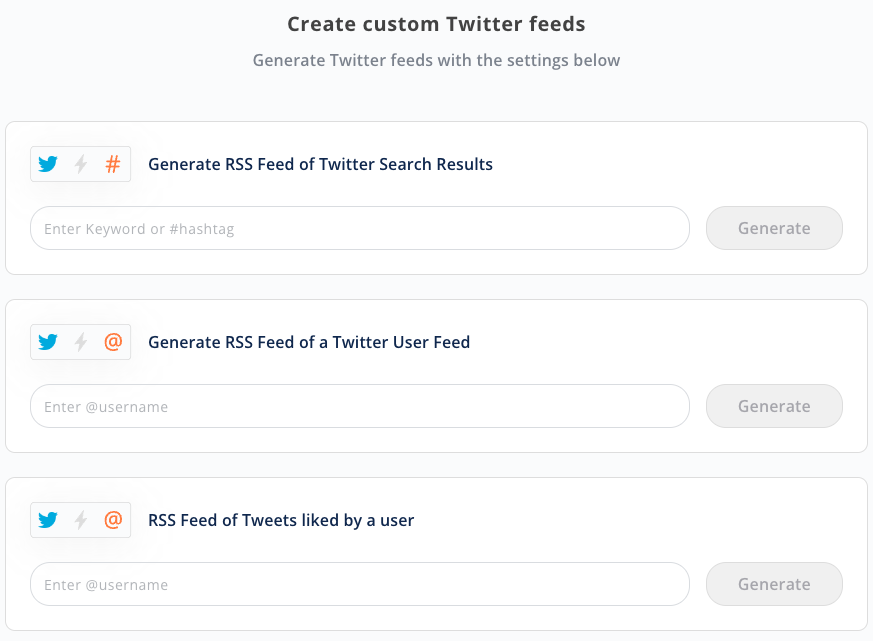
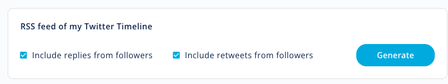

# 如何从 Twitter 创建 RSS 源
Twitter 是一个很好的工具，可以让您了解最新动态：新闻、爱好和兴趣、名人和影响者。然而，一些用户更喜欢使用 RSS 阅读器、[小部件(widgets)](https://rss.app/showcase)或自己的​​应用程序中的自定义[集成](https://rss.app/website-widgets-integrations)来通过 RSS 源监控此信息。

[RSS.app](https://rss.app/) 允许用户从任何公共 Twitter 用户源、主题标签、提及或搜索关键字以及自己的 Twitter 时间线的源创建 RSS 源，而无需编写任何代码。
## 以下是有关如何创建 Twitter 源的 3 个选项
### 选项1  任何公共 Twitter 帐户 ULR 都可以生成 RSS feed
任何公共 Twitter 帐户都可以转换为 RSS feed。只需将 Twitter URL 复制并粘贴到 Twitter RSS [生成器](https://rss.app/rss-feed/create-twitter-rss-feed)中即可获取提要。通过[选择一个小部件](https://rss.app/rss-widgets)来根据您的喜好自定义提要。 
 

### 选项 2  任何 Twitter 用户名都可以生成 RSS feed
此选项生成用户喜欢的所有推文的 RSS 提要。使用这种类型的源的好处之一是监控用户参与度并管理可信的推文来源。 

 
只需输入您想要关注的@用户名（例如@elonmusk），然后单击“生成”即可获取提要。您将看到该用户喜欢的所有推文。 
 
 

#### 您还可以获得公共用户的 feed。 
在此提要中，我搜索一个用户（比尔·盖茨）并获取他所有推文的提要。 

 
### 选项 3：来自您自己的 Twitter 时间线的 RSS feed
通过此选项，用户可以获得自己的 Twitter 时间线的 feed，其中包括其关注者的推文、转发和回复。
 
 

## 参考
[How to create RSS Feeds from Twitter](https://rss.app/blog/how-to-create-rss-feeds-from-twitter-PMsbbO)