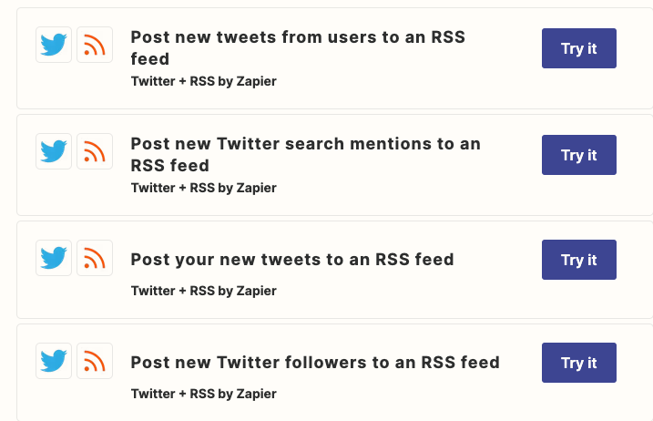
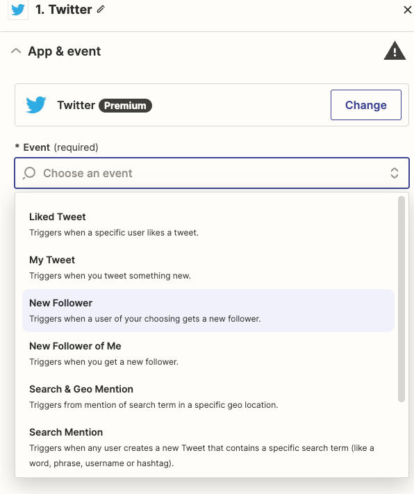
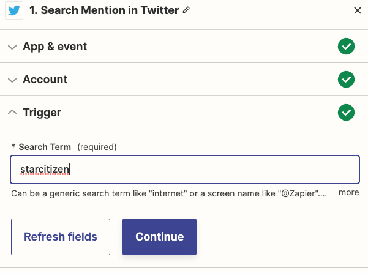
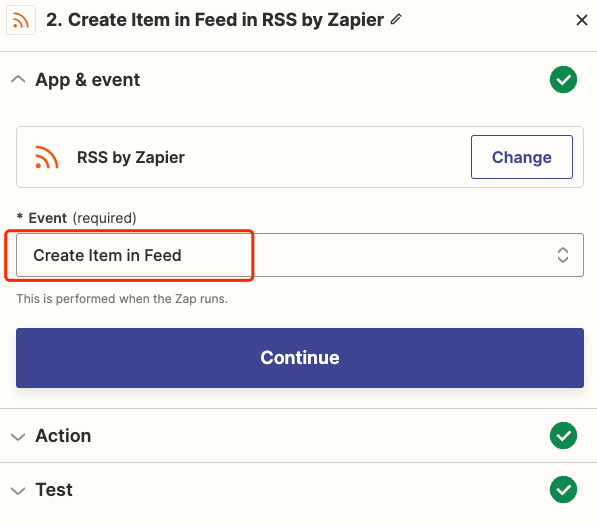
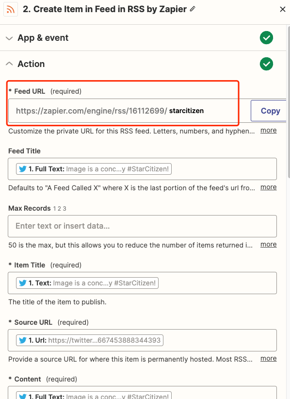
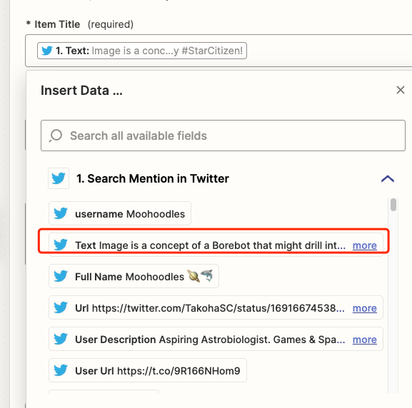
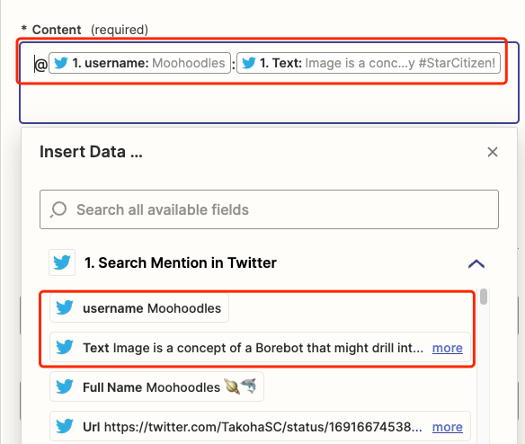

# 如何制作 Twitter RSS 源
Twitter 曾经在每个 Twitter 个人资料中包含一个 RSS 提要，但几年前将其删除。幸运的是，为 Twitter 帐户创建自己的 RSS 提要、在 Twitter 上搜索或提及主题标签或用户并不困难。在本教程中，我们将引导您了解如何创建您自己的自定义 Twitter RSS 源。

想要关注更多您的社交媒体帐户吗？以下是如何为 [Facebook 创建自定义 RSS 源](https://zapier.com/apps/facebook-pages/tutorials/facebook-rss-feed)。

要简化流程，请从以下 Zaps 之一（Zapier 的自动化工作流程）开始，帮助您只需点击几下即可制作 RSS Twitter 提要：

或者，如果您想进一步自定义工作流程，请按照以下步骤操作。
## 如何构建 Twitter 到 RSS 源
### 创建 Twitter 的触发器
登录 [Zapier](https://zapier.com/)，单击创建 Zap 按钮，然后选择 Twitter 作为触发器应用程序。要创建不属于您自己的 Twitter 个人资料的 RSS feed，请选择搜索。

将您的 Twitter 帐户连接到 Zapier，然后输入您关注的关键词。Zapier 随后将测试 Twitter 集成。

### 创建 RSS 源
- 接下来，单击“ + 添加步骤”并选择 RSS by Zapier 应用程序作为操作应用程序。

	
- 在“源 URL”框中输入 RSS 源的名称，然后单击“复制到剪贴板”

	这是您的新 RSS 源将其保存到您的笔记应用程序或RSS 源阅读器。

	
- 现在，点击每个必填字段旁边的 + 图标，将正确的信息从 Twitter 添加到 RSS 源。

	我们将推文文本作为项目标题，将推文的 URL 作为源 URL。
	
	
	对于内容，输入最适合您的 RSS 阅读器的内容 - 我们使用用户名和推文文本。
	
	
- 保存并测试您的 Zap。您现在可以使用您最喜欢的 RSS 源阅读器关注这些推文。

## 结束
您还可以选择让 Zap 监视用户或列表中的新推文、监控搜索查询或跟踪主题标签或用户的提及。只需在源中选择您想要的选项，而不是上面第一步中的“用户推文” ，然后按照 Zap 设置流程进行操作即可。

如果您希望您的 RSS 提要仅包含特定的推文（可能是您品牌中包含链接的推文），那么请向您的 Twitter/RSS Zap 添加过滤器以创建超级提要。

## 参考
[How to make a Twitter RSS feed](https://zapier.com/blog/twitter-rss-feed/?utm_source=google&utm_medium=cpc&utm_campaign=gaw-row-nua-evr-search_nb_alldev_remarketing_developing1_developing2-ads&utm_adgroup=DSA-BestApps-Form_Builder&utm_term=&utm_content=_pcrid_664335623945_pkw__pmt__pdv_c_slid__pgrid_152223563713_ptaid_aud-1658837655288:dsa-2066874513104_&gad=1&gclid=CjwKCAjwxOymBhAFEiwAnodBLOfL4DfDZ1bbhR79bTC99VbYyBqHGCEoOxQ2WlaWmKEtzJ58cbLgPBoCobkQAvD_BwE)

