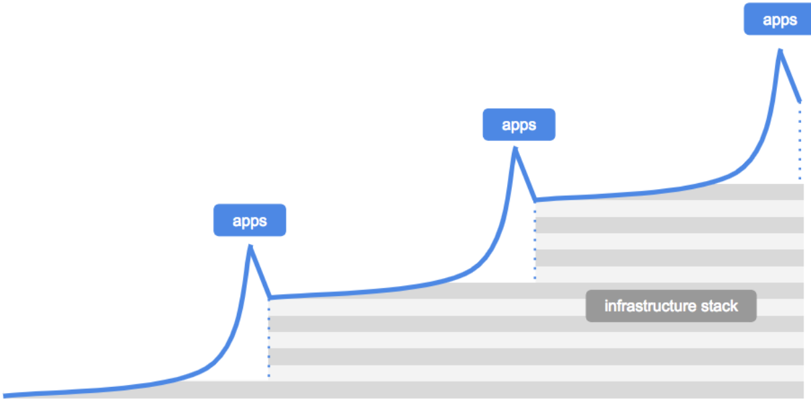
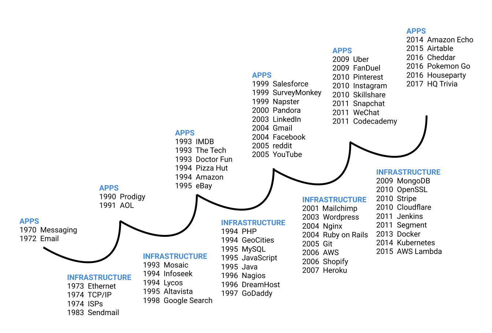
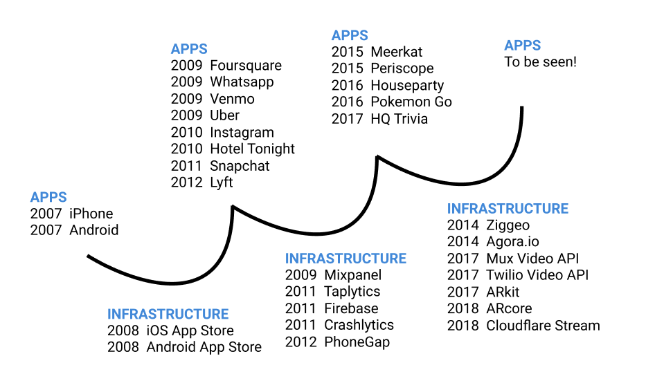
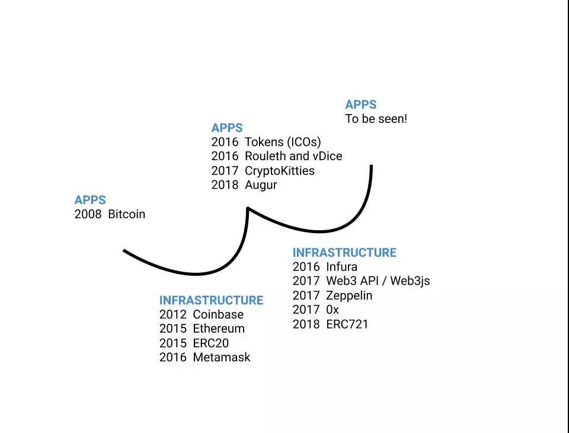

# 基础设施阶段的神话
## 应用与基础设施
区块链社区的一个常见叙述是“我们处于基础架构阶段”，现在正在开展工作的正确方法是构建基础架构：更好的基础链，更好的链间互操作性，更好的客户端，钱包和浏览器。理由是“首先我们需要能够轻松构建和使用在区块链上运行的应用程序的工具，一旦拥有这些工具，我们就可以开始构建这些应用程序了，等等”。

而当我们与正在构建基础架构的人交谈时，一直听到他们面临的最大挑战是让开发人员在顶层构建应用程序。为什么会这样呢？

假设，这实际上并不是事情发生的方式。我们不处于基础架构阶段，而是处于应用程序阶段 - 基础架构周期的另一个转折点。事实上，新技术的历史表明，应用程序需要基础设施，而不是相反。

每个人现在都知道“平台”往往是最大的价值机会（对于 Facebook，亚马逊/AWS，Twilio 等都是如此），所以自然会急于建立一个抓住价值的主要平台。在分布式网络中，这可能更为真实，其中价值通常、但不总是，在协议层而不是位于顶部的应用程序中累积。

但是，基础设施的演进过程如:

	apps => 基础设施 => apps => 基础设施
这样的迭代循环演变而来，并且很少在外部真空中构建。

应用程序和基础架构在响应周期中发展，而不是分开的独立阶段。

- 例如

	灯泡（应用程序）是在电网（基础设施）之前发明的。而不是需要电网来装灯泡。但是为了广泛消费者使用灯泡，而需要电网。所以灯泡的突破(应用程序)在1879年首先出现，而电网在 1882年开始。

- 另一个例子

	飞机（应用程序）是在有机场（基础设施）之前发明的。不是先机场再有飞机。
	
互联网也遵循相同的模式。

- 从第一个应用开始：消息传递（1970）和电子邮件（1972），然后激发基础设施:以太网（1973)、TCP/IP（1973）和互联网服务提供者（1974年）。
- 下一波应用程序，它们是门户网站（1990 年的 Prodigy，1991 年的 AOL），门户网站激励我们构建基础设施（1990年代早期的搜索引擎和网络浏览器）。
- 下一波应用程序，是早期网站，如1994年的 Amazon.com，这导致构建基础设施，如编程语言（1994年的PHP，1995年的Javascript和Java），这使得构建网站变得更加容易。
- 然后是下一波更复杂的应用程序，如 Napster（1999），Pandora（2000），Gmail（2004）和 Facebook（2004）导致基础架构更容易构建更复杂的应用程序（2004年的 NGINX 和 Ruby on Rails，2006 年的 AWS）。

而这个循环仍在继续。

这种模式与最新的移动应用程序迭代

- 首先我们有一套流行的移动应用程序，严重依赖流媒体视频：Snapchat（2011），Periscope（2014），Meerkat（2015）和Instagram故事（2016年）。
- 现在，我们看到公司构建基础设施，使移动应用程序可以轻松添加视频：Ziggeo（2014），Agora.io（2014），Mux（2017），Twilio Video API（2017），Cloudflare Stream（2018）。

循环还正确地解释了区块链中的事件序列。

- 第一个突破应用程序开始：BTC（2008）,这激发了新的基础设施，如 Sidechains 和 Drivechain（2015），以太坊智能合约和 ERC20（2015），Lightning（2015），可以轻松构建新的应用程序，以及 Coinbase（2012）和 Metamask（2016）等基础设施，使消费者能够采用这些新应用程序。
- 这个新的基础设施随后启用了下一波应用程序：令牌/ ICO（2017）和早期的 dapps (2016) 年的 Rouleth 和 vDice ，CryptoKitties （2017），它激发了新的基础设施：Infura（2016）和 Web3js 和 Zeppelin 2017。我们现在正在等待下一个有助于指导下一波基础设施的大型应用程序。

## 相邻可能
每个主要平台（电力，汽车，飞机，网络，移动设备等）的开发中的共同主题现在可以为提供可用的工具。在好的想法来自哪里，史蒂芬约翰逊将此称为相邻可能。换句话说，构建远远领先于应用程序市场的基础架构是非常困难的。

每次基础设施周期重复时，由于之前循环中构建的基础架构，新应用程序成为可能。例如，YouTube 可以在2005年建立，但不是在1995年建立，因为 YouTube 在2000年初部署宽带等基础设施之后才有意义，这种情况发生在 eBay、aws、AskJeeves 等首批热门网站之后的基础架构阶段。

Chris Dixon 和 Fred Wilson 在最近一集 a16z 播客中谈到了这个概念。克里斯有一个名为 Dot Bomb 的网络游戏，它取笑了1990年代后期的愚蠢网络游戏。而他所指出的是，网络时代的所有“愚蠢”想法现在都是十亿美元的独角兽。

这就是所说的基础设施阶段神话的关键所在，如果我们考虑与将使用它的应用程序脱离的“基础设施阶段”，冒着在投机真空中建设的风险。需要循环使用基础设施周期来保持诚实。

由于每个新平台中的周期越来越多，因此构建和使用这些应用程序的成本会更低。在1995年建立 usv.com 将花费我们比现在构建成本高出许多数量级，并且创建区块链应用程序的现金，工作量和时间成本比现在15年后要多。
## 发展框架与投资框架
把投资者的帽子放在一边，重要的是区分解释何时可以建立什么的技术框架，以及解释何时可以成为一项好投资的投资框架。

基础架构周期解释了何时可以构建应用程序或基础架构，但不一定说明何时投资应用程序与何时投资基础架构。

以灯泡为例。它们是在电网之前发明的，但从投资者的角度来看，没有人在电网到位之前卖掉了很多灯泡。
## 总结
一个问题是：为什么应用程序首先出现在循环中，而不是基础设施？

- 一个原因是，在有应用程序要求您解决基础架构问题之前，创建基础架构没有意义。

	如何知道正在构建的基础架构解决了一个真正的问题？现在构建加密基础架构将是一个挑战和风险的。直到有一个突破性的加密应用程序推出，而其他开发人员想要模拟并需要更好的开发工具和基础设施来实现这一目标。

加密空间中有一个叙述，首先我们需要构建出色的工具，一旦我们拥有工具，我们就可以构建应用程序。但我们希望展示的是，在其他平台转变中，我们能够在有优秀工具之前构建前几个应用程序（尽管它更加节省现金和时间），然后这些早期应用程序激励我们构建工具。循环重复。

## 参考
[The Myth of The Infrastructure Phase](https://www.usv.com/blog/the-myth-of-the-infrastructure-phase?utm_source=wanqu.co&utm_campaign=Wanqu+Daily&utm_medium=website)