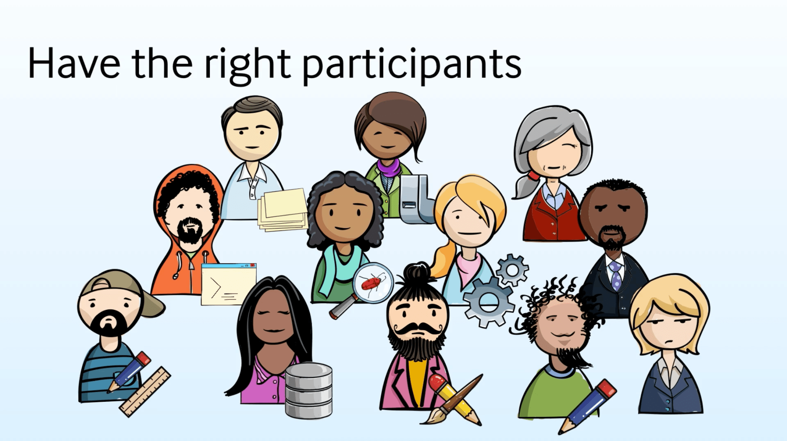
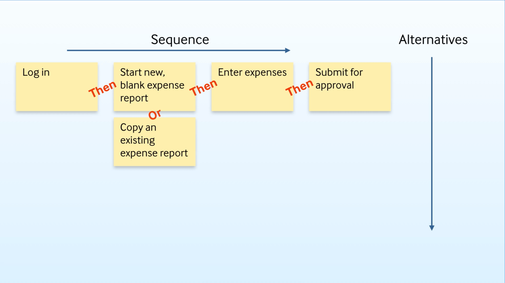
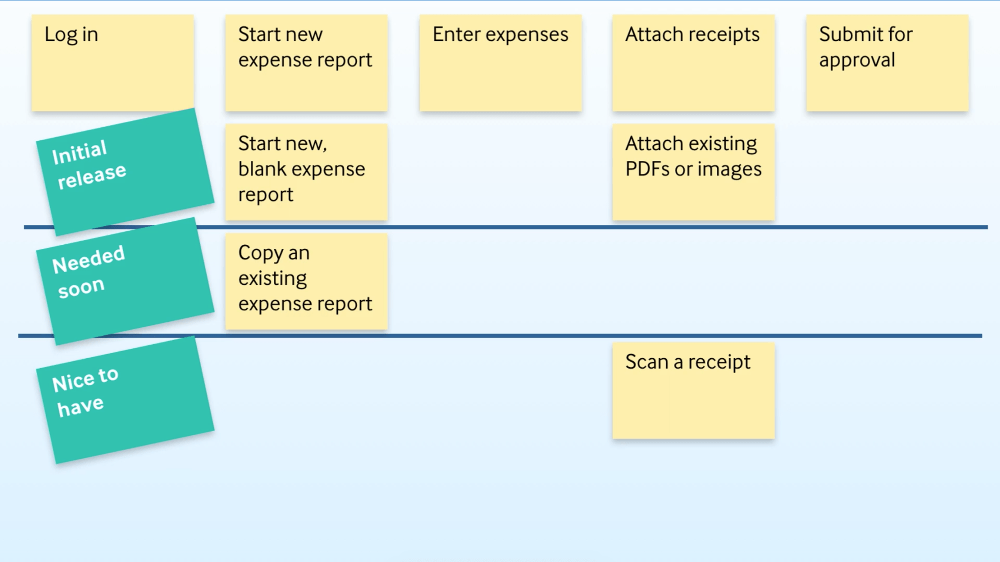

# 如何开始一个成功的用户故事工作坊(网文纪要)
## 团队在写故事的三种挑战
- 团队成员参与度不高
- 故事写了太多细节或太少细节
- 花在拆故事的时间太长

## 问题
- 问题
	- 自己来写用户故事，再讨论可能会时间更长
	- 花很长时间来做一个几年的故事地图
- 建议   	
	- 用户地图开会时间
		- 每3个月最少开一次
		- 每3个月可以由好几个 spring 组成来完成一个基本的 mvp 或者 mmf。

## 开故事工作坊成功三要点
- 专注在单一一额重要目标(mvp/mmf)上
- 跟对的人一起开
- 透过用户故事地图将故事关系视觉化

## 流程
- 开始由 po 、关键的利益相关者(Stakeholder)带着一个大目标(愿景、里程碑(Milestore)等) 作为会议的起点
- 由 [Scrum Master](https://blog.teambition.com/blog/agile-tool/scrum-one-scrum-master/)/敏捷教练引导会议进行，所有团队成员全部参与，并且尽可能的邀请一些用户
- 需要正确的参与者

	
- 在使用用户故事地图来讨论出遗漏的细节

		
	
	- 横坐标是排序
	- 纵坐标是备选方案
- 提问
	- 用户最可能下一步做什么事情？
	- 在这里用户会发生什么样的错误
	- 在这什么会造成用户混淆
	- 用户需要那些附加信息
- 然后拆分功能，分成 mvp 版本、尽快完成和最好有
	 
	
## [原文参考](http://designerica.cc/2017/03/1-user-story-workshop/)

# 做产品就像开车上路
- 出发前：路程好远
- 路上：其实很近，20分钟就到了
- 返回：果然很远，因为迷路绕路

## 心得
- 不同阶段看不同层次的地图，产品从探索到交付过程中需要很多其他地图
	- impact map(更高产品战略层面）
	- specification by example(用例规格说明) 
	- 以及其他
- 从地图上找到最短的实现路径，没必要打造所有功能
- 做产品的时候，不知道为什么而做，加一个按钮都嫌多
- 规划好后做产品需要随情况变化而调整，最终达到目的地才是目的
- 达到目的地有很多路，选择方法重点是你要的结果和付出的代价，这样才能衡量。例如，要省钱、方便、无脑、快速的方法，需要多少时间，要花多少代价。
- 回头总结经验，减少下次出错的几率。

## [原文参考](http://designerica.cc/2017/02/waytoneihu/) 

