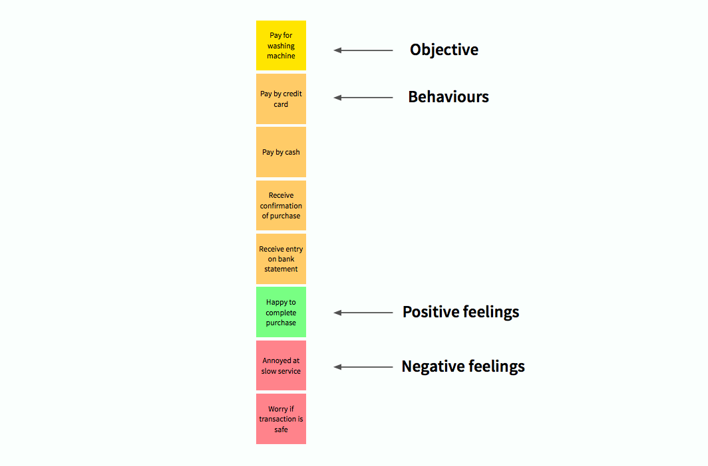
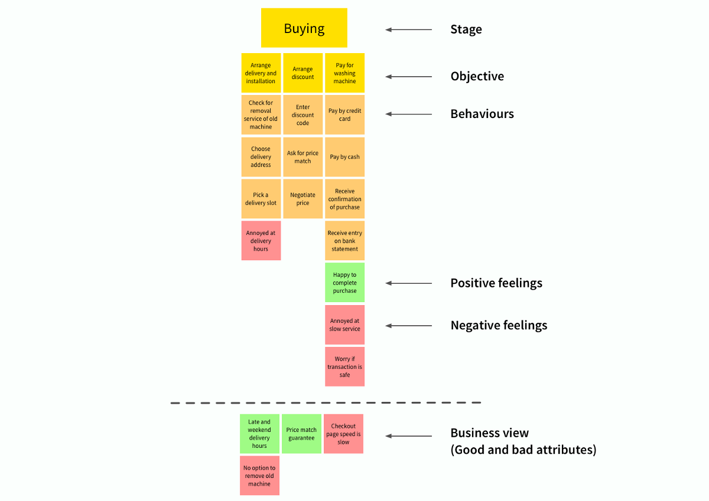
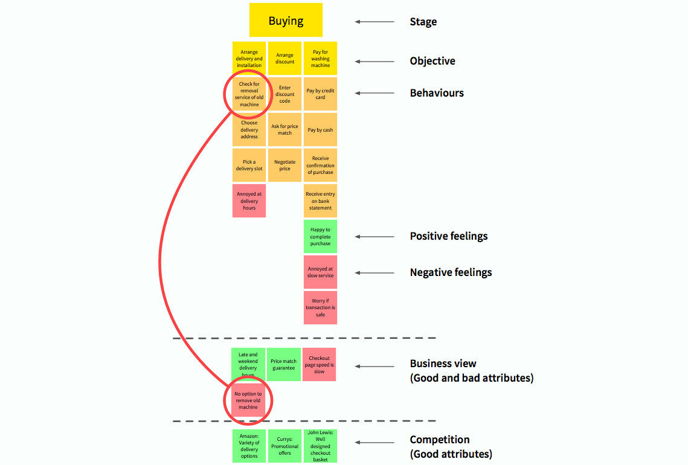
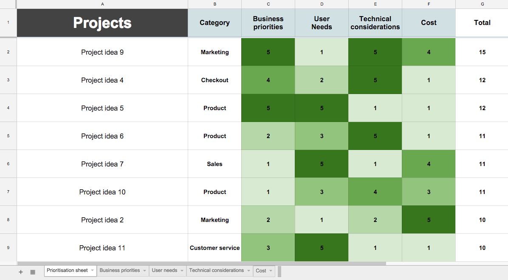
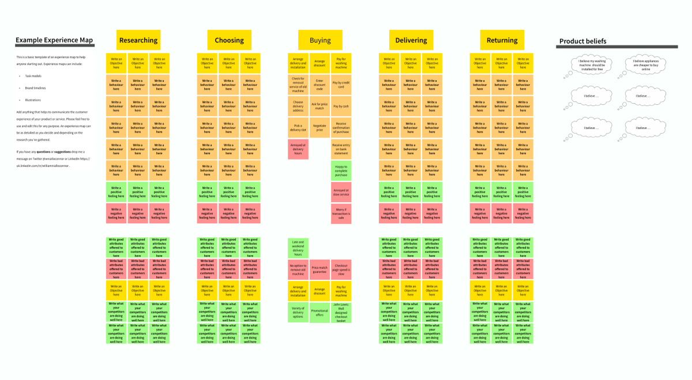

# 用户体验地图完全绘制手册
## 为什么要建立用户体验地图
- 认清项目并建立一张工作路径地图
- 发现创新的机会
- 理解UX最近被看好的原因

## 怎么建立用户体验地图？
### 展开调研
- 民族志研究 Ethnographicresearch（民族志研究是在描述一个种族或团体中人的生活方式，并解析其与文化中的人，事，时，地，物各因素之间交互影响过程。这里是借用社会学的研究方式来说明用户体验地图的前期调研环节。——译者注）
- 深度采访 In-depthinterviews
- 游击研究 Guerillaresearch（游击研究指用最快且最低花费的方法去获得足够的要领，进而去做一个可靠地判断。——译者注）

调研方法会影响收集到的数据的质量。了解更多关于如何开展用户调研的内容，推荐阅读 Steve Portigal 的`《Interviewing Users》`这本书。

为了研究分析，应该抄录下所有的采访音频。分析这些数据会花上几周时间，这取决于研究的进展。这在一个被预算束缚又认为市场第一的现实中是不太可能实现的。

一个替代它的方法是让两个人去完成一个采访。一个人负责采访，另一个人负责记下相关细节。之后用这些笔记做研究分析。

## 分析调研结果
打开excel表格。逐一梳理笔记，并摘录人们

- 在做些什么（行为）
- 感受到什么（感受）
- 想些什么（想法）

将这些摘录从用户的角度，以简洁的语句有组织的整合到一起是很重要的。

做什么：我+动词… 例如：我不满意这个项目。

感受什么：我觉得…例如：对这个不完整的项目，我觉得很生气。

想什么：我认为…例如：我认为这个项目的质量很差。

访问内容|行为|感受|想法
---|---|---|---
我想，在线买一个大型的电器应该很便宜|||我相信在线买家电会便宜
我租的房子没有带任何家电，我需要洗衣机||我感到房子不带家电带来不便||
我正在比对哪家洗衣机更好|在比对洗衣机|||

## 把行为和感受分组
基于对用户的调查把 “做什么（行为）” 和 “感受” 分组。提供的产品或服务，可能需要罗列 40-80 个要点（objectives）。比如其中的一个要点可能是当人们为 “项目买单”

- 付款是信用卡(行为-红色)
- 采购成功会高兴(感受-绿色)
- 缓慢的服务会感觉懊恼(感受-黄色)

## 优先考虑行为和感受
在罗列的这些要点的下方应该是人们的行为，积极的感受和消极的感受。

个人的行为和感受是要被优先考虑的。并且根据顺序，最符合这个要点的或者频繁出现在调研笔记中的应排在前头。

- 黄色 - 干什么
- 橘黄色 - 行为
- 绿色 - 积极情绪
- 红色 - 消极情绪

## 整理要点
在体验一个产品或服务时，没有一个用户会展现出在调研中发现的所有行为。地图上展示的是所有用户的所有行为，感受和想法。同样的，不是所有人都会在任何指定顺序下做这些列举出的要点。

所以重要的是，根据调研，把这些要点按照一定的逻辑顺序整理。一旦整理了这些要点，就把它们打散成组或者一个体验的不同阶段。

用动词的现在进行时（v.+ing）命名一个阶段，来确定一段时间内发生的行为。

比如：阶段可以这样表示：Choosing，Buying 等

## 业务地图化
在每个部分的业务中找出一个具有典型性的代表，并把这些写在一起。这样就能帮助你把握产品的品质是否成功支撑相应的用户行为。 

## 竞争因素地图化
了解你的竞争者们在整个体验中什么方面做的好并不容易。而实现这一点的最好的方法是进行纵向的跟踪研究。

纵向的跟踪研究是一个观察研究的方法。研究的数据和观察结果来自于在一段时间内的大量对象。

日记法（diary study）是我最喜欢的跟踪研究形式。它可以持续几周甚至几个月。这项研究会捕捉一些在之前组织过程中看不见的联系，比如和竞争者的价格关系。

在这个设想中，要寻找的是当产品或服务相互作用时一系列愉悦的时刻，为的是了解我们的竞争者在哪个方面做得好。收集这些愉悦时刻最快捷的方法是参与到使用 app 的过程中。nativeye 就是一个值得使用的app。

另一个替代日记法的方法是对竞争者通过案头调研(desk research)展开研究。但它会不那么深入地了解你的竞争者们都在给他们的用户提供些什么。

## 加入用户的想法
现在是时候加入用户关于产品和服务的想法了。

从研究分析中摘选出用户们都在想些什么，然后把写着相似想法的便利贴分成一组。用一个标签给每一组命名。这些便利贴将会代表用户对于产品和服务的想法。

这些想法应该列在地图之外，有两个原因：

- 一是混着行为，感受和想法会干扰整个地图流的思路。
- 二是人们的想法是基于对产品哲学上的判断，不是怎么用的问题。

## 把地图展现给公司看
完成了用户体验地图的制作，接下来要做的就是和产品负责人开一个工作坊，为整个工作线路图进行一场头脑风暴。复现地图上的每个短语，包括竞争者/业务（the competitor/bussiness）的见解。

业务决策是会影响现实中的人的，这点很容易被遗忘。当你把你的地图重新展现给公司里的人们的时候，你一定要把你在用户研究时的故事告诉大家。

回过头来和股东交流这些故事也是有必要的。这样会增加组织者们对用户的同理心，并帮助他们在未来做出更好的决策。

## 认清机遇
这时候产品和服务没有与用户行为匹配上的差距会显现出来。战略项目也会因为把竞争因素考虑进去而成为可见的。

## 创建一个工作的路线图
不论你在组织工作之前有多么充足的证据，当来到制作工作路线图的环节，应该期望其他因素也开始起作用。用户体验地图不是一个有关内部政治策略的解决方法，但它确实赋予你一种能力去利用你先前用户调研的证据。

创建一个路线图的第一步是按照重要顺序罗列你的想法。我建议用一套标准来帮你按重要的顺序罗列潜在的项目。你可以基于一套标准给每个项目打一个分数。

给潜在项目打分是一个主观的过程，不过结合领域专家和可利用数据的帮助会好得多。

有关标准的例子：技术上的考虑（Technical considerations）

领域专家设定分数：发展引领（Development lead）

用不同的标签给经过领域专家评定的分数一个评价。任何一个质疑任何分数的决策人可以进行更深入的研究。

- 第一列：产品想法
- 第二列：想法类型
- 第三列: 生意优先级
- 第四列：用户需求
- 第五列：技术考虑
- 第六列：价格
- 第七列: 总分

按照重要顺序罗列项目不像仅仅给每项目一个分数那样简单。每个倡议都可能有各自的局限和依赖。因此有些时候把一些工作分成组一起做会更高效。

最后，当你有一个按优先顺序排列的项目清单之后，你需要制订一个基于实际考虑的计划。

用户体验地图模板

## 参考
[原文地址](https://medium.com/@wnialloconnor/how-to-build-an-experience-map-5e55b7ee4f32#.tz5o1k5lw)

[翻文地址](https://mp.weixin.qq.com/s?__biz=MjM5NTMzNzg3NA==&mid=402348159&idx=1&sn=96b7157b116e0912d97187932595ec82&scene=23&srcid=0225vUr4uLMUv1cZSqdtjqix#rd)